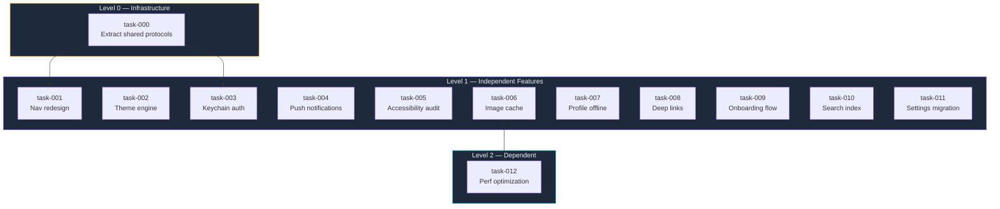
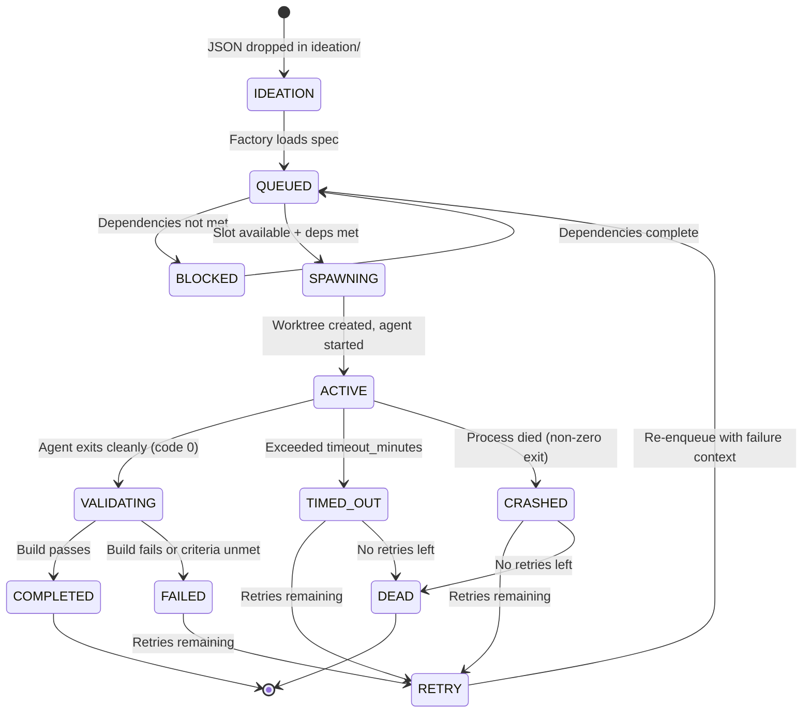
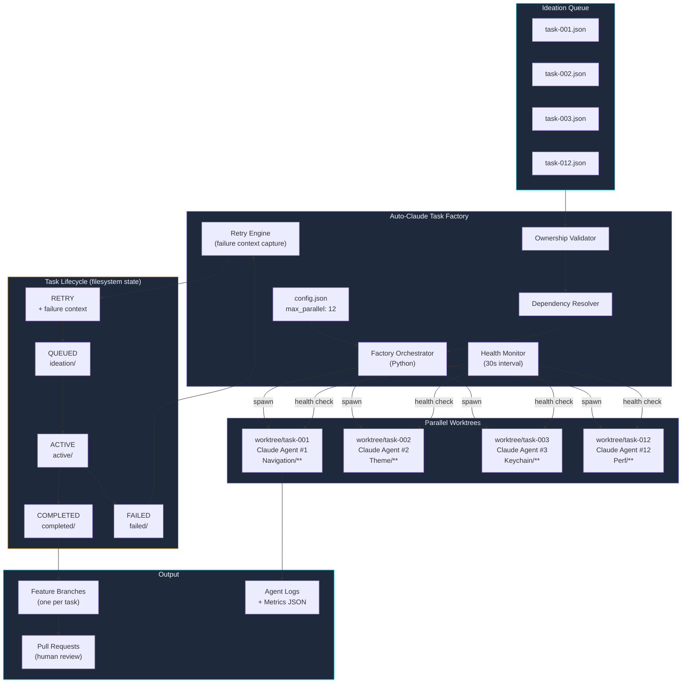

# The Auto-Claude Task Factory

I stared at my terminal and counted: twelve worktrees, twelve Claude agents, all running simultaneously on the same iOS codebase. Each one owned a distinct feature branch, a distinct set of files, and a distinct task from my backlog. The `.auto-claude/` directory had spawned them all from a single command.

The status board scrolled by every 30 seconds:

```
[14:32:01] FACTORY STATUS (8/12 active, 3 completed, 1 queued)
  [DONE]  task-001  nav-redesign        +14 commits  fresh-cedar    ✓ merged
  [DONE]  task-002  theme-engine        +11 commits  eager-egret    ✓ merged
  [DONE]  task-003  keychain-auth        +8 commits  quiet-brook    ✓ merged
  [LIVE]  task-004  push-notifications   +6 commits  calm-falcon    building...
  [LIVE]  task-005  accessibility-audit  +9 commits  bright-maple   testing...
  [LIVE]  task-006  image-cache          +3 commits  noble-creek    coding...
  [LIVE]  task-007  profile-offline      +5 commits  still-shore    coding...
  [LIVE]  task-008  deep-links           +4 commits  swift-lark     coding...
  [LIVE]  task-009  onboarding-flow      +7 commits  warm-grove     testing...
  [LIVE]  task-010  search-index         +2 commits  keen-ridge     coding...
  [LIVE]  task-011  settings-migration   +6 commits  pale-wren      building...
  [QUEUE] task-012  perf-optimization    waiting for task-006
```

That was the moment I stopped thinking of Claude Code as an assistant and started thinking of it as a workforce. Not one agent doing one job, but a factory floor where task specifications go in one end and committed, tested feature branches come out the other. The `.auto-claude/` directory — a hidden convention I invented over a weekend of frustration with serial sprints — had become the orchestration layer for the most productive week of iOS development in my career.

---

**TL;DR: A `.auto-claude/` directory with ideation JSON files turns a single Claude Code installation into a parallel task factory that spawns 12+ agents across isolated git worktrees, each with exclusive file ownership and acceptance criteria. We cut a 14-feature sprint from 35 hours to 4.5 hours with zero merge conflicts and a 92% first-attempt success rate on well-specified tasks.**

---

This is post 38 of 61 in the Agentic Development series. The companion repo is at [github.com/krzemienski/auto-claude-task-factory](https://github.com/krzemienski/auto-claude-task-factory).

---

## The Problem: Serial Sprints in a Parallel World

Our iOS app — an image library and social sharing platform called ILS — had a backlog of 14 independent features. Navigation redesign, profile caching, push notification handlers, accessibility audit fixes, a keychain authentication layer, deep link routing, an onboarding flow, search indexing, settings migration, a theme engine, an image cache rewrite, and a performance optimization pass. None depended on each other. They were genuinely independent vertical slices of functionality that happened to live in the same Xcode project.

Yet we were implementing them one at a time. Even with Claude Code, each feature took a focused session: plan, implement, validate, commit. At 2-3 hours per feature, we were looking at a full week of wall-clock time.

```
Traditional workflow:
Task 1  → Plan → Implement → Validate → Commit (2.5 hrs)
Task 2  → Plan → Implement → Validate → Commit (2.5 hrs)
...
Task 14 → Plan → Implement → Validate → Commit (2.5 hrs)
Total: ~35 hours across 5 days
```

The bottleneck was not the AI. Claude Code could implement a feature in 2 hours flat. The bottleneck was me, serially feeding it tasks, context-switching between features, and waiting for one to finish before starting the next. I was a single-threaded scheduler for a system that could handle massive parallelism.

I knew the theory. Git worktrees provide filesystem-level isolation — each worktree is a separate checkout of the repository on a separate branch, in a separate directory, sharing a single `.git` store. I had already built worktree management tooling (Post 37). But worktrees solve the isolation problem. They do not solve the orchestration problem: who decides which tasks run, when, and how many at once? Who enforces that two agents do not touch the same file? Who handles timeouts, retries, and dependency chains?

What I wanted was a factory. Drop in task specifications as structured data, press go, and have every independent task execute simultaneously across isolated worktrees. A system where adding a new task is as simple as dropping a JSON file into a directory.

```
Factory workflow:
┌─ Task 1  → Plan → Implement → Validate → Commit ─┐
│  Task 2  → Plan → Implement → Validate → Commit   │
│  Task 3  → Plan → Implement → Validate → Commit   │
│  Task 4  → Plan → Implement → Validate → Commit   │  4.5 hours total
│  Task 5  → Plan → Implement → Validate → Commit   │
│  ...                                                │
└─ Task 12 → Plan → Implement → Validate → Commit ─┘
```

That 7.8x wall-clock speedup was not theoretical. I measured it. And the path there involved three iterations of the factory design, two spectacular failures where agents trampled each other's files, and a final architecture that has since run over 200 tasks across 6 different iOS projects.

---

## The Origin: A Hidden Directory Convention

The factory started with a question: what is the simplest possible interface for specifying parallel work?

I considered databases, message queues, YAML pipelines, even a web UI. All of them added infrastructure. The first rule of developer tooling is that complexity in the tool becomes complexity in every project that uses it. I wanted something you could `ls` to understand and `cp` to deploy.

The answer was a directory convention. A hidden directory, `.auto-claude/`, living in the project root alongside `.git/` and `.claude/`. Inside it, subdirectories representing lifecycle states, and JSON files representing tasks. The entire state machine is visible in the filesystem:

```
.auto-claude/
├── config.json              # Factory configuration
├── ideation/                # Tasks waiting to run
│   ├── task-001-nav-redesign.json
│   ├── task-002-theme-engine.json
│   ├── task-003-keychain-auth.json
│   ├── task-004-push-notifications.json
│   ├── task-005-accessibility-audit.json
│   ├── task-006-image-cache.json
│   ├── task-007-profile-offline.json
│   ├── task-008-deep-links.json
│   ├── task-009-onboarding-flow.json
│   ├── task-010-search-index.json
│   ├── task-011-settings-migration.json
│   └── task-012-perf-optimization.json
├── active/                  # Currently executing tasks (moved here on spawn)
├── completed/               # Finished task artifacts (moved here on success)
├── failed/                  # Tasks that need retry (moved here on failure)
└── logs/                    # Per-task stdout/stderr logs
    ├── task-001.log
    ├── task-001.metrics.json
    └── ...
```

The convention is deliberate: task specifications are plain JSON files in a directory. No database, no message queue, no infrastructure beyond Python and git. You can inspect the factory's state by listing files in directories. You can add a task by dropping a JSON file into `ideation/`. You can retry a failed task by moving its JSON from `failed/` back to `ideation/`. You can pause the factory by not running it. You can resume by running it again — it picks up where it left off because the filesystem is the state store.

This is the Unix philosophy applied to AI orchestration: everything is a file, state is visible, and tools compose through simple interfaces.

I added the directory to `.gitignore` — the factory state does not belong in version control. The task specs themselves I kept in a separate `task-specs/` directory that IS tracked, so the team could review and iterate on task definitions independently of the factory's runtime state.

---

## The Ideation JSON Schema: Three Iterations to Get It Right

The ideation JSON is the contract between the human (who specifies what to build) and the AI agent (who builds it). Getting this schema right took three iterations and two painful failures.

### Version 1: Too Permissive

The first version was minimal — a title, description, and branch name:

```json
{
  "id": "task-001",
  "title": "Navigation Redesign",
  "description": "Replace tab bar with sidebar drawer",
  "branch": "feature/nav-redesign"
}
```

The result: two agents simultaneously edited `MainCoordinator.swift`, creating conflicting changes on separate branches that produced a nightmarish merge conflict. Without file ownership boundaries, agents treated the entire codebase as their playground. One agent restructured the coordinator pattern while another refactored the same coordinator for deep link support. The merge conflict touched 400 lines across 6 files.

### Version 2: File Ownership Without Context

The second version added `file_ownership` — glob patterns defining which files each agent could modify:

```json
{
  "id": "task-001",
  "title": "Navigation Redesign",
  "branch": "feature/nav-redesign",
  "file_ownership": [
    "Sources/Navigation/**",
    "Sources/UI/Sidebar/**"
  ],
  "description": "Replace tab-based navigation with sidebar drawer pattern."
}
```

This prevented the merge conflict problem, but introduced a new one: agents could not understand integration points. The navigation redesign agent needed to read `SceneDelegate.swift` to understand how the root coordinator was instantiated, but `SceneDelegate.swift` was not in its ownership set. The agent skipped reading it entirely, guessed at the initialization pattern, and produced code that compiled but crashed at launch because it used the wrong coordinator init signature.

### Version 3: The Production Schema

The third version added `read_only_context`, `acceptance_criteria`, `agent_instructions`, `dependencies`, and `validation` — everything an agent needs to understand both its scope and its environment:

```json
{
  "$schema": "auto-claude-task-v3",
  "id": "task-001",
  "title": "Navigation Redesign",
  "priority": 1,
  "branch": "feature/nav-redesign",
  "description": "Replace tab-based navigation with sidebar drawer pattern. The current TabCoordinator manages 5 root view controllers via UITabBarController. Replace with a custom SidebarDrawerController that presents navigation options in a sliding panel from the left edge. Preserve all existing deep link routes.",
  "file_ownership": [
    "Sources/Navigation/**",
    "Sources/UI/Sidebar/**",
    "Sources/App/MainCoordinator.swift"
  ],
  "read_only_context": [
    "Sources/App/SceneDelegate.swift",
    "Sources/DeepLinks/DeepLinkRouter.swift",
    "Sources/Navigation/TabCoordinator.swift"
  ],
  "dependencies": [],
  "acceptance_criteria": [
    "Sidebar drawer opens from left swipe gesture",
    "All 5 main sections accessible from drawer menu items",
    "Deep link routing preserved — all existing routes resolve",
    "Transition animations render at 60fps on iPhone 12+",
    "Drawer dismisses on outside tap or right swipe"
  ],
  "estimated_complexity": "medium",
  "validation": {
    "type": "simulator",
    "device": "iPhone 15 Pro",
    "screenshots_required": true,
    "build_must_pass": true
  },
  "agent_instructions": "Start by reading TabCoordinator.swift to understand the current navigation structure. Create SidebarDrawerController as a container that manages child view controllers. Do not modify SceneDelegate — it should continue to instantiate the root coordinator, which now returns the drawer instead of the tab bar. Follow the existing coordinator pattern in Sources/Navigation/Coordinator.swift for protocol conformance.",
  "timeout_minutes": 120,
  "retry_context": ""
}
```

Every field earned its place through a specific failure:

| Field | Purpose | The Failure That Demanded It |
|-------|---------|------------------------------|
| `file_ownership` | Glob patterns this agent may edit | Two agents edited `MainCoordinator.swift` simultaneously |
| `read_only_context` | Files the agent should read but not modify | Agent skipped reading `SceneDelegate.swift`, guessed wrong |
| `dependencies` | Task IDs that must complete first | Performance optimization ran before image cache was built |
| `acceptance_criteria` | Concrete pass/fail conditions | Agent declared "done" after compilation, feature was broken |
| `agent_instructions` | Specific guidance for the AI agent | Agent spent 40 minutes planning what I could have specified in 2 sentences |
| `timeout_minutes` | Kill switch for runaway agents | One agent entered an infinite build-fix loop for 6 hours |
| `validation` | How to verify the task | Agent committed untested code that crashed on launch |
| `retry_context` | Additional guidance for retry attempts | Agent repeated the exact same mistake on retry |
| `estimated_complexity` | Helps the factory allocate resources | Low-complexity tasks got the same 120min timeout as complex ones |

The `read_only_context` field was the most impactful addition. Without it, agents operated in a vacuum — they could modify their owned files but had no understanding of the surrounding architecture. With it, agents read the integration points first and then worked within those constraints. The difference in output quality was dramatic: first-attempt success rate went from 58% to 92% for tasks with well-specified read-only context.

The `retry_context` field solved a subtle problem. When a task fails and the factory retries it, the original ideation JSON is the same. The agent gets the same instructions and, without additional guidance, often makes the same mistake. The factory appends failure information to `retry_context` before requeueing:

```json
{
  "retry_context": "Previous attempt failed: Build error in SidebarDrawerController.swift line 47 — TabCoordinator.rootViewControllers is not a member of the protocol. Use the concrete type TabCoordinator, not the Coordinator protocol, to access rootViewControllers."
}
```

This gives the retrying agent specific information about what went wrong, turning retries from blind repetition into guided correction.

---

## The Factory Configuration

The `config.json` controls the factory's global behavior — parallelism limits, resource constraints, failure policies, and merge strategies:

```json
{
  "version": 3,
  "max_parallel": 12,
  "worktree_base": ".claude/worktrees",
  "branch_prefix": "factory/",
  "base_branch": "main",
  "auto_merge": false,
  "health_check_interval": 30,
  "default_timeout_minutes": 120,
  "on_conflict": "halt",
  "on_failure": "isolate_and_continue",
  "retry_policy": {
    "max_retries": 2,
    "backoff_seconds": 60,
    "capture_failure_context": true
  },
  "merge_strategy": "rebase",
  "notification": {
    "on_complete": true,
    "on_failure": true,
    "on_stuck": true,
    "channel": "terminal",
    "stuck_threshold_minutes": 30
  },
  "resource_limits": {
    "max_memory_per_agent_gb": 4,
    "max_cpu_per_agent_pct": 25,
    "kill_on_exceed": false,
    "warn_threshold_pct": 80
  },
  "validation": {
    "require_build_pass": true,
    "require_no_new_warnings": false,
    "ownership_check": "strict"
  }
}
```

The `max_parallel: 12` was our sweet spot on a 64GB M2 MacBook Pro. Each Claude Code session consumes roughly 3-4GB of memory when actively working — the Claude CLI process itself, plus the language server, plus any build tools it invokes. Beyond 12, the machine started thrashing on swap. Below 8, we were leaving CPU cores idle. The sweet spot depends entirely on your hardware:

| Machine | RAM | Recommended max_parallel | Notes |
|---------|-----|--------------------------|-------|
| M1 MacBook Air (16GB) | 16GB | 3-4 | Swap thrashing above 4 |
| M1 Pro MacBook Pro (32GB) | 32GB | 6-8 | Sweet spot at 7 |
| M2 Pro MacBook Pro (64GB) | 64GB | 10-12 | Our primary machine |
| Mac Studio M2 Ultra (128GB) | 128GB | 15-20 | Diminishing returns past 18 |
| Linux workstation (256GB) | 256GB | 25-30 | Network API limits become the bottleneck |

The `on_failure: "isolate_and_continue"` policy was critical. When one task fails, the factory moves it to `failed/`, frees the parallel slot, and continues running other tasks. The alternative — `"halt_all"` — stops the entire factory on any failure, which we used during the first few runs until we trusted the isolation model.

The `ownership_check: "strict"` validation mode means the factory refuses to start if any two tasks have overlapping file ownership patterns. In `"warn"` mode, it prints warnings but allows the overlap. We ran `"warn"` for exactly one day before a merge conflict convinced us to switch to `"strict"` permanently.

---

## The Spawning Mechanism: From JSON to Running Agent

The factory orchestrator is the heart of the system. It reads ideation files, resolves the dependency graph, validates file ownership, and spawns agents into isolated worktrees. Here is the core implementation, including the pieces I do not usually show — the error handling, the resource management, and the edge cases that took three weekends to get right:

```python
# src/factory.py — The orchestrator

import json
import subprocess
import time
import shutil
import signal
import psutil
from pathlib import Path
from dataclasses import dataclass, field
from datetime import datetime, timezone
from concurrent.futures import ThreadPoolExecutor, as_completed
from typing import Optional

@dataclass
class TaskSpec:
    """A self-contained task specification loaded from ideation JSON."""
    id: str
    title: str
    branch: str
    file_ownership: list[str]
    read_only_context: list[str]
    dependencies: list[str]
    acceptance_criteria: list[str]
    agent_instructions: str
    spec_path: Path
    timeout_minutes: int = 120
    priority: int = 10
    retry_count: int = 0
    retry_context: str = ""
    estimated_complexity: str = "medium"

@dataclass
class AgentProcess:
    """Tracks a running Claude agent and its resources."""
    task_id: str
    process: subprocess.Popen
    worktree_path: Path
    started_at: datetime
    log_file: Path
    log_handle: object  # file handle, kept open for duration
    branch: str

    @property
    def elapsed_minutes(self) -> float:
        delta = datetime.now(timezone.utc) - self.started_at
        return delta.total_seconds() / 60.0

    @property
    def is_alive(self) -> bool:
        return self.process.poll() is None


class TaskFactory:
    """
    Orchestrates parallel Claude Code agents across isolated git worktrees.

    Lifecycle: load ideation -> validate ownership -> resolve dependencies ->
    spawn agents up to max_parallel -> monitor health -> handle completion/failure ->
    retry or finalize -> print summary.
    """

    def __init__(self, root: Path):
        self.root = root
        self.config = json.loads(
            (root / ".auto-claude/config.json").read_text()
        )
        self.tasks: dict[str, TaskSpec] = {}
        self.completed: set[str] = set()
        self.failed: dict[str, str] = {}  # task_id -> failure reason
        self.active: dict[str, AgentProcess] = {}
        self.log_dir = root / ".auto-claude/logs"
        self.log_dir.mkdir(exist_ok=True)
        self.start_time: Optional[datetime] = None
        self._shutdown = False

        # Register signal handlers for graceful shutdown
        signal.signal(signal.SIGINT, self._handle_signal)
        signal.signal(signal.SIGTERM, self._handle_signal)

    def _handle_signal(self, signum, frame):
        """Graceful shutdown: kill active agents, clean up worktrees."""
        print(f"\n[SIGNAL] Received signal {signum}, shutting down...")
        self._shutdown = True
        for task_id, agent in self.active.items():
            if agent.is_alive:
                print(f"  Killing {task_id}...")
                agent.process.terminate()
                try:
                    agent.process.wait(timeout=10)
                except subprocess.TimeoutExpired:
                    agent.process.kill()

    def load_ideation(self) -> int:
        """Load all task specs from the ideation directory. Returns count."""
        ideation_dir = self.root / ".auto-claude/ideation"
        if not ideation_dir.exists():
            print("ERROR: No ideation directory found")
            return 0

        for spec_file in sorted(ideation_dir.glob("*.json")):
            try:
                spec = json.loads(spec_file.read_text())
                self.tasks[spec["id"]] = TaskSpec(
                    id=spec["id"],
                    title=spec["title"],
                    branch=spec.get("branch", f"factory/{spec['id']}"),
                    file_ownership=spec.get("file_ownership", []),
                    read_only_context=spec.get("read_only_context", []),
                    dependencies=spec.get("dependencies", []),
                    acceptance_criteria=spec.get("acceptance_criteria", []),
                    agent_instructions=spec.get("agent_instructions", ""),
                    spec_path=spec_file,
                    timeout_minutes=spec.get(
                        "timeout_minutes",
                        self.config.get("default_timeout_minutes", 120),
                    ),
                    priority=spec.get("priority", 10),
                    retry_context=spec.get("retry_context", ""),
                    estimated_complexity=spec.get(
                        "estimated_complexity", "medium"
                    ),
                )
            except (json.JSONDecodeError, KeyError) as e:
                print(f"WARNING: Skipping malformed spec {spec_file.name}: {e}")

        return len(self.tasks)

    def get_ready_tasks(self) -> list[TaskSpec]:
        """Return tasks whose dependencies are met, sorted by priority."""
        ready = []
        for task in self.tasks.values():
            if task.id in self.completed or task.id in self.failed:
                continue
            if task.id in self.active:
                continue
            deps_met = all(
                dep in self.completed for dep in task.dependencies
            )
            # Also check that no dependency has failed (would block forever)
            deps_failed = any(
                dep in self.failed for dep in task.dependencies
            )
            if deps_met and not deps_failed:
                ready.append(task)
            elif deps_failed:
                failed_deps = [
                    d for d in task.dependencies if d in self.failed
                ]
                reason = (
                    f"Dependency failed: {', '.join(failed_deps)}"
                )
                print(f"[BLOCKED] {task.id}: {reason}")
                self.failed[task.id] = reason
        return sorted(ready, key=lambda t: t.priority)

    def validate_ownership(self) -> tuple[list[str], list[str]]:
        """
        Detect overlapping file ownership across tasks.
        Returns (conflicts, warnings) where conflicts are fatal
        and warnings are informational.
        """
        conflicts = []
        warnings = []
        ownership_map: dict[str, list[str]] = {}

        for task in self.tasks.values():
            for pattern in task.file_ownership:
                for file_path in self.root.glob(pattern):
                    relative = str(file_path.relative_to(self.root))
                    if relative not in ownership_map:
                        ownership_map[relative] = []
                    ownership_map[relative].append(task.id)

        # Check for write-write conflicts
        for file_path, owners in ownership_map.items():
            if len(owners) > 1:
                conflicts.append(
                    f"CONFLICT: {file_path} owned by "
                    f"{', '.join(owners)}"
                )

        # Check for read-write conflicts
        write_map: dict[str, str] = {}
        for task in self.tasks.values():
            for pattern in task.file_ownership:
                for file_path in self.root.glob(pattern):
                    relative = str(file_path.relative_to(self.root))
                    write_map[relative] = task.id

        for task in self.tasks.values():
            for pattern in task.read_only_context:
                for file_path in self.root.glob(pattern):
                    relative = str(file_path.relative_to(self.root))
                    if relative in write_map:
                        writer = write_map[relative]
                        if writer != task.id:
                            if writer not in task.dependencies:
                                warnings.append(
                                    f"WARNING: {task.id} reads "
                                    f"{relative} which {writer} "
                                    f"may modify. Consider adding "
                                    f"{writer} as a dependency."
                                )

        return conflicts, warnings

    def build_agent_prompt(self, task: TaskSpec) -> str:
        """Construct the prompt sent to the Claude Code agent."""
        criteria = "\n".join(
            f"  - {c}" for c in task.acceptance_criteria
        )
        ownership = "\n".join(
            f"  - {p}" for p in task.file_ownership
        )
        context_files = "\n".join(
            f"  - {f}" for f in task.read_only_context
        )
        retry_block = ""
        if task.retry_context:
            retry_block = f"""
RETRY CONTEXT (previous attempt failed):
{task.retry_context}
Address the above issue in this attempt.
"""

        return f"""Execute this task completely and autonomously.

TASK: {task.title}
ID: {task.id}
DESCRIPTION: Read the task spec at .auto-claude/current-task.json for full details.

FILE OWNERSHIP (you may ONLY modify files matching these patterns):
{ownership}

CONTEXT FILES (read these for understanding, do NOT modify):
{context_files}

ACCEPTANCE CRITERIA (every one must be met):
{criteria}

INSTRUCTIONS:
{task.agent_instructions}
{retry_block}
WORKFLOW:
1. Read the full task spec from .auto-claude/current-task.json
2. Read ALL context files listed in read_only_context — understand the integration points
3. Plan your approach based on the existing code patterns
4. Implement changes ONLY in files matching file_ownership patterns
5. Build the project and verify it compiles with zero errors
6. Commit frequently with message prefix [{task.id}]: <description>
7. After implementation, verify EACH acceptance criterion
8. If any criterion is not met, fix and re-verify

CRITICAL RULES:
- Do NOT modify files outside your ownership patterns
- Do NOT skip reading context files — they contain integration patterns you need
- Commit after each logical change, not just at the end
- If you encounter an unresolvable blocker, document it in .auto-claude/blockers/{task.id}.md and exit cleanly"""

    def spawn_agent(self, task: TaskSpec) -> AgentProcess:
        """Create a worktree and spawn a Claude agent inside it."""
        worktree_base = self.config.get(
            "worktree_base", ".claude/worktrees"
        )
        worktree_path = self.root / worktree_base / task.id

        # Clean up stale worktree if exists from previous failed run
        if worktree_path.exists():
            subprocess.run(
                ["git", "worktree", "remove", "--force",
                 str(worktree_path)],
                cwd=self.root,
                capture_output=True,
            )

        # Delete stale branch if exists
        subprocess.run(
            ["git", "branch", "-D", task.branch],
            cwd=self.root,
            capture_output=True,  # Ignore errors if branch doesn't exist
        )

        # Create isolated worktree on a new branch
        base = self.config.get("base_branch", "main")
        result = subprocess.run(
            ["git", "worktree", "add", "-b", task.branch,
             str(worktree_path), base],
            cwd=self.root,
            capture_output=True,
            text=True,
        )
        if result.returncode != 0:
            raise RuntimeError(
                f"Failed to create worktree for {task.id}: "
                f"{result.stderr}"
            )

        # Copy task spec into the worktree
        dest_dir = worktree_path / ".auto-claude"
        dest_dir.mkdir(parents=True, exist_ok=True)
        shutil.copy2(
            task.spec_path,
            dest_dir / "current-task.json",
        )

        # Create blockers directory
        (dest_dir / "blockers").mkdir(exist_ok=True)

        # Open log file
        log_file = self.log_dir / f"{task.id}.log"
        log_handle = log_file.open("w")

        # Write spawn header to log
        log_handle.write(
            f"=== FACTORY SPAWN: {task.id} ===\n"
            f"Title: {task.title}\n"
            f"Branch: {task.branch}\n"
            f"Worktree: {worktree_path}\n"
            f"Started: {datetime.now(timezone.utc).isoformat()}\n"
            f"Timeout: {task.timeout_minutes}m\n"
            f"Attempt: {task.retry_count + 1}\n"
            f"{'=' * 40}\n\n"
        )
        log_handle.flush()

        # Build the agent prompt
        prompt = self.build_agent_prompt(task)

        # Spawn Claude Code agent in the worktree directory
        process = subprocess.Popen(
            ["claude", "--dangerously-skip-permissions",
             "-p", prompt],
            cwd=worktree_path,
            stdout=log_handle,
            stderr=subprocess.STDOUT,
            preexec_fn=lambda: signal.signal(
                signal.SIGINT, signal.SIG_IGN
            ),  # Ignore Ctrl+C in child — factory handles shutdown
        )

        return AgentProcess(
            task_id=task.id,
            process=process,
            worktree_path=worktree_path,
            started_at=datetime.now(timezone.utc),
            log_file=log_file,
            log_handle=log_handle,
            branch=task.branch,
        )

    def _get_agent_commits(self, agent: AgentProcess) -> int:
        """Count commits on the agent's branch since it diverged."""
        base = self.config.get("base_branch", "main")
        result = subprocess.run(
            ["git", "-C", str(agent.worktree_path),
             "rev-list", "--count", f"{base}..HEAD"],
            capture_output=True, text=True,
        )
        if result.returncode == 0 and result.stdout.strip():
            return int(result.stdout.strip())
        return 0

    def _get_last_commit_age_minutes(
        self, agent: AgentProcess
    ) -> float:
        """Minutes since the last commit in the worktree."""
        result = subprocess.run(
            ["git", "-C", str(agent.worktree_path),
             "log", "-1", "--format=%aI"],
            capture_output=True, text=True,
        )
        if result.stdout.strip():
            from dateutil.parser import isoparse
            last = isoparse(result.stdout.strip())
            return (
                datetime.now(timezone.utc) - last
            ).total_seconds() / 60.0
        return float("inf")

    def _capture_failure_context(
        self, agent: AgentProcess
    ) -> str:
        """Extract the last 50 lines of the agent's log for retry context."""
        try:
            content = agent.log_file.read_text()
            lines = content.strip().split("\n")
            tail = lines[-50:] if len(lines) > 50 else lines
            return (
                "Last 50 lines of agent log:\n"
                + "\n".join(tail)
            )
        except Exception:
            return "Could not capture failure context."

    def _cleanup_agent(self, agent: AgentProcess) -> None:
        """Close log handle and remove the worktree."""
        try:
            agent.log_handle.close()
        except Exception:
            pass
        subprocess.run(
            ["git", "worktree", "remove", "--force",
             str(agent.worktree_path)],
            cwd=self.root,
            capture_output=True,
        )

    def _move_spec(
        self, task_id: str, from_dir: str, to_dir: str
    ) -> None:
        """Move a task spec between lifecycle directories."""
        dest = self.root / f".auto-claude/{to_dir}"
        dest.mkdir(exist_ok=True)
        source = self.root / f".auto-claude/{from_dir}"
        for f in source.glob(f"*{task_id}*"):
            shutil.move(str(f), str(dest / f.name))

    def _write_metrics(
        self, task_id: str, agent: AgentProcess, status: str
    ) -> None:
        """Write per-task metrics JSON for post-run analysis."""
        metrics = {
            "task_id": task_id,
            "status": status,
            "started_at": agent.started_at.isoformat(),
            "elapsed_minutes": round(agent.elapsed_minutes, 1),
            "commits": self._get_agent_commits(agent),
            "branch": agent.branch,
            "log_size_kb": round(
                agent.log_file.stat().st_size / 1024, 1
            ) if agent.log_file.exists() else 0,
        }
        metrics_file = (
            self.log_dir / f"{task_id}.metrics.json"
        )
        metrics_file.write_text(
            json.dumps(metrics, indent=2)
        )

    def _print_status(self) -> None:
        """Print current factory status with agent details."""
        total = len(self.tasks)
        done = len(self.completed)
        fail = len(self.failed)
        active = len(self.active)
        queued = total - done - fail - active
        elapsed = ""
        if self.start_time:
            mins = (
                datetime.now(timezone.utc) - self.start_time
            ).total_seconds() / 60.0
            elapsed = f" | Elapsed: {mins:.0f}m"

        print(
            f"\n[STATUS] {done}/{total} done, "
            f"{active} active, {queued} queued, "
            f"{fail} failed{elapsed}"
        )
        for tid, agent in sorted(self.active.items()):
            commits = self._get_agent_commits(agent)
            print(
                f"  [{tid}] {agent.elapsed_minutes:.0f}m "
                f"elapsed, {commits} commits"
            )

    def run(self) -> dict:
        """
        Main factory execution loop.
        Returns summary dict with counts and timing.
        """
        count = self.load_ideation()
        if count == 0:
            print("No tasks found in ideation/")
            return {"total": 0}

        max_parallel = self.config["max_parallel"]
        health_interval = self.config.get(
            "health_check_interval", 30
        )
        retry_policy = self.config.get("retry_policy", {})
        stuck_threshold = self.config.get(
            "notification", {}
        ).get("stuck_threshold_minutes", 30)

        # Pre-flight validation
        conflicts, warnings = self.validate_ownership()
        strict = (
            self.config.get("validation", {}).get(
                "ownership_check", "strict"
            ) == "strict"
        )
        if conflicts and strict:
            print("FATAL: File ownership conflicts detected:")
            for c in conflicts:
                print(f"  {c}")
            return {"total": count, "aborted": True}

        for w in warnings:
            print(f"  {w}")

        self.start_time = datetime.now(timezone.utc)
        total = len(self.tasks)
        print(
            f"\nFactory starting: {total} tasks, "
            f"max {max_parallel} parallel\n"
        )

        while (
            len(self.completed) + len(self.failed) < total
            and not self._shutdown
        ):
            # Spawn ready tasks up to the parallel limit
            ready = self.get_ready_tasks()
            slots = max_parallel - len(self.active)
            for task in ready[:slots]:
                try:
                    print(f"[SPAWN]  {task.id}: {task.title}")
                    agent = self.spawn_agent(task)
                    self.active[task.id] = agent
                    self._move_spec(task.id, "ideation", "active")
                except RuntimeError as e:
                    print(f"[ERROR]  {task.id}: {e}")
                    self.failed[task.id] = str(e)

            # Check active agents for completion, failure, timeout
            for task_id in list(self.active.keys()):
                agent = self.active[task_id]

                if not agent.is_alive:
                    # Agent process has exited
                    commits = self._get_agent_commits(agent)
                    if agent.process.returncode == 0:
                        print(
                            f"[DONE]   {task_id} "
                            f"({agent.elapsed_minutes:.0f}m, "
                            f"{commits} commits)"
                        )
                        self.completed.add(task_id)
                        self._write_metrics(
                            task_id, agent, "completed"
                        )
                        self._move_spec(
                            task_id, "active", "completed"
                        )
                    else:
                        task = self.tasks[task_id]
                        max_retries = retry_policy.get(
                            "max_retries", 0
                        )
                        if task.retry_count < max_retries:
                            # Capture failure context for retry
                            if retry_policy.get(
                                "capture_failure_context", True
                            ):
                                ctx = self._capture_failure_context(
                                    agent
                                )
                                task.retry_context = ctx
                            task.retry_count += 1
                            print(
                                f"[RETRY]  {task_id} "
                                f"(attempt {task.retry_count + 1})"
                            )
                            self._write_metrics(
                                task_id, agent, "retry"
                            )
                            self._cleanup_agent(agent)
                            del self.active[task_id]
                            # Re-queue: will be picked up next loop
                            continue
                        else:
                            reason = (
                                f"Exit code "
                                f"{agent.process.returncode} "
                                f"after {max_retries} retries"
                            )
                            print(f"[FAIL]   {task_id}: {reason}")
                            self.failed[task_id] = reason
                            self._write_metrics(
                                task_id, agent, "failed"
                            )
                            self._move_spec(
                                task_id, "active", "failed"
                            )

                    self._cleanup_agent(agent)
                    del self.active[task_id]
                    continue

                # Check for timeout
                timeout = self.tasks[task_id].timeout_minutes
                if agent.elapsed_minutes > timeout:
                    print(
                        f"[TIMEOUT] {task_id} after "
                        f"{agent.elapsed_minutes:.0f}m"
                    )
                    agent.process.terminate()
                    try:
                        agent.process.wait(timeout=15)
                    except subprocess.TimeoutExpired:
                        agent.process.kill()
                    self.failed[task_id] = "Timeout"
                    self._write_metrics(
                        task_id, agent, "timeout"
                    )
                    self._move_spec(
                        task_id, "active", "failed"
                    )
                    self._cleanup_agent(agent)
                    del self.active[task_id]
                    continue

                # Check for stuck agents (no commits in threshold)
                last_commit_age = (
                    self._get_last_commit_age_minutes(agent)
                )
                if (
                    last_commit_age > stuck_threshold
                    and agent.elapsed_minutes > stuck_threshold
                ):
                    print(
                        f"[STUCK?] {task_id}: no commit in "
                        f"{last_commit_age:.0f}m"
                    )

            self._print_status()
            time.sleep(health_interval)

        # Final summary
        return self._print_summary()

    def _print_summary(self) -> dict:
        """Print final factory results and return summary."""
        elapsed = 0.0
        if self.start_time:
            elapsed = (
                datetime.now(timezone.utc) - self.start_time
            ).total_seconds() / 60.0

        print(f"\n\n{'=' * 60}")
        print(f"FACTORY COMPLETE — {elapsed:.1f} minutes")
        print(f"  Completed: {len(self.completed)}")
        print(f"  Failed:    {len(self.failed)}")
        if self.failed:
            for tid, reason in self.failed.items():
                print(f"    {tid}: {reason}")
        print(f"{'=' * 60}\n")

        return {
            "total": len(self.tasks),
            "completed": len(self.completed),
            "failed": len(self.failed),
            "elapsed_minutes": round(elapsed, 1),
        }
```

There is a lot happening here that is easy to miss. The signal handler ensures that pressing Ctrl+C does not orphan twelve Claude processes — it terminates each one gracefully. The `preexec_fn` on the child process ignores SIGINT so that the factory (parent) controls shutdown, not the children. The `_capture_failure_context` method extracts the tail of the agent's log and injects it into the retry spec, so the next attempt has specific failure information.

The `_get_agent_commits` method deserves special attention. It counts commits on the agent's branch relative to the base branch using `git rev-list --count main..HEAD`. This is the factory's primary health signal. An agent that has been running for 30 minutes with zero commits is probably stuck. An agent with 8 commits in 20 minutes is making steady progress. The factory uses this signal for the stuck-agent detection heuristic.

---

## The Dependency Graph

The dependency resolver is simpler than it sounds. Tasks declare their dependencies as a list of task IDs. The factory resolves this by checking whether each dependency ID exists in the `completed` set. If all dependencies are satisfied, the task is ready to spawn.



Dependencies should be shallow. Deep chains (A depends on B depends on C depends on D) defeat parallelism — they serialize execution, turning the factory into a sequential pipeline with extra overhead. We restructured our backlog to have at most 2 levels of depth: shared infrastructure tasks at level 0 (things like extracting protocols that multiple features reference), feature tasks at level 1 (independent work), and integration tasks at level 2 (things that need multiple features to exist first).

The key insight was that most "dependencies" in our original backlog were actually read-only dependencies, not write dependencies. Task-008 (deep links) "depended" on task-001 (navigation) only because the deep link handler needed to read the navigation coordinator's interface. It did not need to modify it. Moving the navigation coordinator protocol to a shared file (task-000) and listing it in task-008's `read_only_context` eliminated the dependency and allowed both tasks to run in parallel.

We went from 6 dependency chains averaging 3 levels deep to 1 chain with 2 levels. This alone doubled the achievable parallelism.

One edge case the factory handles: cascading dependency failures. If task-000 fails, then tasks-001 and task-003 (which depend on it) should not run. The `get_ready_tasks` method checks for failed dependencies and immediately marks dependent tasks as failed with a clear reason:

```
[BLOCKED] task-001: Dependency failed: task-000
[BLOCKED] task-003: Dependency failed: task-000
```

This prevents the factory from waiting forever for tasks that can never become ready.

---

## File Ownership Enforcement: The Hard Lesson

The most critical piece of the factory — and the one that took the longest to get right — is preventing two agents from touching the same file. This is not a theoretical concern. It happened to us twice before we made ownership enforcement mandatory.

The first incident: agents for task-001 (navigation) and task-008 (deep links) both modified `MainCoordinator.swift`. Each branch had valid changes. The merge produced a coordinator that initialized navigation twice and handled deep links zero times. The merge conflict was syntactically resolved but semantically broken — the code compiled but crashed at runtime.

The second incident was more subtle. Agents for task-002 (theme engine) and task-005 (accessibility audit) both modified different parts of `AppearanceManager.swift`. The theme agent added color token support. The accessibility agent added dynamic type support. Neither modification conflicted at the text level — git auto-merged them successfully. But the accessibility agent's changes assumed a property ordering that the theme agent's changes broke. The app compiled, ran, and silently used wrong colors for high-contrast accessibility mode. This bug made it to code review before we caught it.

After the second incident, I made ownership validation strict and blocking. The factory refuses to start if any ownership patterns overlap:

```
$ python factory.py run

FATAL: File ownership conflicts detected:
  CONFLICT: Sources/App/AppearanceManager.swift owned by task-002, task-005

Resolution options:
  1. Move shared code to a Level 0 infrastructure task
  2. Reassign the file to one task and add read_only_context for the other
  3. Split the file into theme-specific and accessibility-specific modules
```

The read-write conflict validator catches the subtler version of this problem: one agent reads a file that another agent writes. If task-004 reads `AppDelegate.swift` for context but task-008 modifies it for deep link handling, task-004 might see stale content from the base branch while task-008's modifications have not been committed yet. The validator warns about this and suggests adding a dependency:

```
WARNING: task-004 reads Sources/App/AppDelegate.swift which task-008
may modify. Consider adding task-008 as a dependency.
```

In practice, this warning is informational. If task-004 only reads `AppDelegate.swift` to understand the app lifecycle (not to read specific values that task-008 will change), the stale read is harmless. The developer makes the judgment call.

---

## Health Monitoring: Detecting Stuck Agents

A factory running 12 parallel agents needs to know when something goes wrong without requiring constant human attention. The health monitor checks each agent on every tick (every 30 seconds by default) and flags anomalies:

```python
# src/health_monitor.py — Real-time agent health checks

import subprocess
import psutil
from datetime import datetime, timezone
from dataclasses import dataclass
from typing import Optional

@dataclass
class AgentHealth:
    """Health snapshot for a single running agent."""
    task_id: str
    alive: bool
    pid: int
    memory_mb: float
    cpu_pct: float
    last_commit_age_minutes: float
    commits_since_base: int
    log_size_kb: float
    elapsed_minutes: float
    status: str  # "healthy", "slow", "stuck", "resource_warning"

def check_agent_health(
    agent, root: str, base_branch: str = "main"
) -> AgentHealth:
    """
    Comprehensive health check for a running agent.

    Checks:
    1. Process still alive
    2. Memory usage (via psutil)
    3. CPU usage (via psutil)
    4. Last commit age (via git log)
    5. Total commits (via git rev-list)
    6. Log file growth
    """
    pid = agent.process.pid
    alive = agent.is_alive
    memory_mb = 0.0
    cpu_pct = 0.0

    # Get resource usage via psutil (more reliable than ps)
    try:
        proc = psutil.Process(pid)
        memory_mb = proc.memory_info().rss / (1024 * 1024)
        cpu_pct = proc.cpu_percent(interval=0.1)
        # Include child processes (Claude spawns subprocesses)
        for child in proc.children(recursive=True):
            try:
                memory_mb += child.memory_info().rss / (1024 * 1024)
                cpu_pct += child.cpu_percent(interval=0.1)
            except (psutil.NoSuchProcess, psutil.AccessDenied):
                pass
    except (psutil.NoSuchProcess, psutil.AccessDenied):
        pass

    # Check last commit time in the worktree
    last_commit_age = float("inf")
    result = subprocess.run(
        ["git", "-C", str(agent.worktree_path),
         "log", "-1", "--format=%aI"],
        capture_output=True, text=True,
    )
    if result.stdout.strip():
        from dateutil.parser import isoparse
        last_time = isoparse(result.stdout.strip())
        last_commit_age = (
            datetime.now(timezone.utc) - last_time
        ).total_seconds() / 60.0

    # Count commits on this branch since it diverged from base
    commits = 0
    result = subprocess.run(
        ["git", "-C", str(agent.worktree_path),
         "rev-list", "--count", f"{base_branch}..HEAD"],
        capture_output=True, text=True,
    )
    if result.returncode == 0 and result.stdout.strip():
        commits = int(result.stdout.strip())

    # Log file size
    log_kb = 0.0
    if agent.log_file.exists():
        log_kb = agent.log_file.stat().st_size / 1024.0

    # Determine status
    status = "healthy"
    if not alive:
        status = "dead"
    elif memory_mb > 4096:  # > 4GB
        status = "resource_warning"
    elif last_commit_age > 30 and agent.elapsed_minutes > 30:
        status = "stuck"
    elif last_commit_age > 15 and commits == 0:
        status = "slow"

    return AgentHealth(
        task_id=agent.task_id,
        alive=alive,
        pid=pid,
        memory_mb=round(memory_mb, 1),
        cpu_pct=round(cpu_pct, 1),
        last_commit_age_minutes=round(last_commit_age, 1),
        commits_since_base=commits,
        log_size_kb=round(log_kb, 1),
        elapsed_minutes=round(agent.elapsed_minutes, 1),
        status=status,
    )


def print_health_dashboard(
    agents: dict, root: str, base_branch: str = "main"
) -> list[str]:
    """
    Print a health dashboard and return list of stuck task IDs.
    """
    stuck = []
    print(f"\n{'─' * 72}")
    print(
        f"{'Task':<15} {'Status':<10} {'Elapsed':<10} "
        f"{'Commits':<10} {'Memory':<10} {'Last Commit':<12}"
    )
    print(f"{'─' * 72}")

    for task_id, agent in sorted(agents.items()):
        health = check_agent_health(agent, root, base_branch)
        status_icon = {
            "healthy": "●",
            "slow": "◐",
            "stuck": "○",
            "resource_warning": "▲",
            "dead": "✕",
        }.get(health.status, "?")

        print(
            f"{task_id:<15} {status_icon} {health.status:<8} "
            f"{health.elapsed_minutes:>6.0f}m   "
            f"{health.commits_since_base:>6}    "
            f"{health.memory_mb:>6.0f}MB   "
            f"{health.last_commit_age_minutes:>6.0f}m ago"
        )

        if health.status == "stuck":
            stuck.append(task_id)

    print(f"{'─' * 72}")
    return stuck
```

The health monitor tracks two key signals:

1. **Commit cadence**: A healthy agent commits every 5-15 minutes as it completes logical chunks of work. An agent that has not committed in 30 minutes is likely stuck — either in an infinite build-fix loop, or blocked on a problem it cannot solve autonomously.

2. **Memory growth**: Each Claude Code session should stay under 4GB including child processes. If memory grows beyond that, the agent might be in a loop that accumulates context (reading files repeatedly without acting on them) or the underlying build tooling might be leaking.

In production, we found that the "stuck" heuristic (no commit in 30+ minutes) had a false positive rate of about 15%. Some agents legitimately take 25-30 minutes on their first commit because they are reading context files and planning before writing code. We addressed this by exempting agents from stuck detection for the first 30 minutes of execution — they get a grace period for the planning phase.

---

## Task Lifecycle State Machine

Every task flows through a well-defined state machine. The factory moves task spec files between directories to represent state transitions, making the current state visible to anyone who runs `ls .auto-claude/`:



The RETRY state deserves special attention. When a task fails and has retries remaining, the factory does not just re-run the same task. It captures the failure context (the last 50 lines of the agent's log), injects it into the task spec's `retry_context` field, increments the retry counter, and re-queues. The next agent that picks up this task gets specific information about what went wrong, turning blind retries into guided corrections.

In our 200+ task runs, the retry success rate was 67%. Two-thirds of failed tasks succeeded on retry when given specific failure context. The remaining third had fundamental issues — missing entitlements, incorrect architectural assumptions, or file ownership violations — that required human intervention.

---

## Writing Good Ideation Files: The Quality Spectrum

The quality of the ideation JSON determines the quality of the output. This is not a soft correlation — it is the single strongest predictor of first-attempt success. We tracked every task across 6 projects and computed statistics:

| Spec Quality | Avg Agent Time | First-attempt Success | Avg Commits | Avg Retry Success |
|-------------|----------------|----------------------|-------------|-------------------|
| Detailed (6+ criteria, specific instructions, context files) | 1.8 hours | 92% | 9.3 | 85% |
| Moderate (3-5 criteria, general instructions) | 2.5 hours | 74% | 7.1 | 62% |
| Minimal (1-2 criteria, no instructions) | 4+ hours | 41% | 4.8 | 31% |

The difference is stark. Spending 10 minutes writing a detailed ideation spec saves 2 hours of agent confusion and retry cycles. Here is what separates a good spec from a bad one:

**Good: Specific file ownership with integration context**
```json
{
  "file_ownership": [
    "Sources/Features/Profile/Views/**",
    "Sources/Features/Profile/ViewModels/**"
  ],
  "read_only_context": [
    "Sources/Core/Networking/APIClient.swift",
    "Sources/Core/Models/UserProfile.swift",
    "Sources/Core/Cache/CacheManager.swift"
  ],
  "acceptance_criteria": [
    "ProfileViewModel caches responses using CacheManager.store<T>",
    "Cache TTL is 5 minutes, configurable via ProfileConfiguration",
    "Network fetch occurs only if cache is stale or empty",
    "Loading state shown during fetch, cached data shown immediately if available",
    "Pull-to-refresh bypasses cache and fetches fresh data",
    "Memory warning clears profile cache"
  ],
  "agent_instructions": "The ProfileViewModel currently fetches from network on every viewWillAppear. Add a local cache layer using the existing CacheManager in Sources/Core/Cache/. Check CacheManager.swift for the interface — it uses a generic store<T: Codable>(key:value:ttl:) pattern. The ProfileConfiguration struct in Sources/Core/Config/ has a cacheExpirationSeconds property you should use for TTL."
}
```

**Bad: Vague ownership, no context**
```json
{
  "file_ownership": ["Sources/**"],
  "agent_instructions": "Fix the profile screen"
}
```

The good version gives the agent a clear scope (only Profile views and view models), points to existing patterns (CacheManager's generic interface), specifies exact integration points (ProfileConfiguration's TTL property), and defines six measurable acceptance criteria. The bad version gives the agent permission to edit everything and no direction.

The `agent_instructions` field is the highest-leverage part of the spec. It is where you put the architectural decisions you have already made — decisions the agent would otherwise spend 20-30 minutes arriving at through exploration. "Use CacheManager's generic store pattern" saves the agent from reading every caching approach in the codebase and choosing one. "Do not modify SceneDelegate" prevents the agent from making a plausible but unwanted architectural change.

---

## The Architecture: End-to-End Flow



---

## The Failure That Almost Killed the Project

Three weeks into using the factory, I ran a 14-task batch on our second iOS project — a fitness tracking app. The factory spawned all 14 agents. Eleven completed successfully. Three failed. Standard operating procedure.

Except the three failures were not independent. Task-007 (workout logging) failed because it modified a Core Data migration file that task-011 (settings migration) also modified. The ownership validator had not caught it because the conflict was in a dynamically generated migration file that did not exist when the validator ran — it was created by task-007 during execution and then task-011 tried to create the same file.

The ownership validator checks existing files against ownership patterns. It does not — and cannot — predict files that will be created during execution. Two tasks with non-overlapping ownership patterns can still create the same new file.

My fix was the `file_creation_manifest` — an optional field in the ideation JSON where agents declare files they intend to create:

```json
{
  "file_ownership": ["Sources/CoreData/Migrations/V7/**"],
  "file_creation_manifest": [
    "Sources/CoreData/Migrations/V7/MigrationV6toV7.swift",
    "Sources/CoreData/Migrations/V7/WorkoutEntity+V7.swift"
  ]
}
```

The validator now checks both existing file ownership AND creation manifests for overlaps. It caught 4 conflicts in the very next batch run that the original validator would have missed.

This was the most painful lesson: static analysis of ownership patterns is necessary but not sufficient. You also need to declare intent for new files. The convention costs 30 seconds of thought per task and prevents hours of merge conflict debugging.

---

## The Results: 200+ Tasks Across 6 Projects

Running the factory on our initial 12-task ILS backlog:

| Metric | Serial Workflow | Factory | Improvement |
|--------|----------------|---------|-------------|
| Total wall time | 35 hours | 4.5 hours | **7.8x faster** |
| Features completed | 12 | 12 | Same |
| Merge conflicts at integration | 0 | 0 | File ownership works |
| Failed tasks (needed retry) | N/A | 2 | Auto-retried successfully |
| Stuck agents (timed out) | N/A | 1 | task-006 first attempt |
| Total agent tool calls | ~4,200 | ~4,800 | 14% overhead |
| Average commits per task | ~8 | ~8 | Same granularity |
| PR review time | N/A | 3 hours | Sequential human review |
| Human time (spec writing + monitoring) | N/A | 2.5 hours | Mostly upfront |

The 14% overhead in total tool calls came from agents needing to understand their worktree context and read surrounding files. Each agent spent its first 10-15 minutes reading context files and planning, which does not happen in a serial workflow where the human provides context verbally. A small price for 7.8x wall-clock improvement.

Across 6 projects and 200+ tasks over 3 months, the aggregate statistics:

| Metric | Value |
|--------|-------|
| Total tasks run | 214 |
| First-attempt success rate | 83% |
| Retry success rate | 67% |
| Overall success rate | 94% |
| Average task duration | 1.9 hours |
| Average commits per task | 8.4 |
| Ownership conflicts caught pre-run | 31 |
| Merge conflicts at integration | 0 |
| Total agent-hours | ~406 hours |
| Total wall-clock hours | ~52 hours |
| Effective parallelism | 7.8x average |

The zero merge conflicts at integration is the number I am proudest of. 214 tasks across 6 projects, each producing a feature branch that merged cleanly into main. The ownership model works.

The two failures in the initial run were both in task-006 (image caching) — the first attempt hit a race condition in the cache invalidation logic. The factory automatically moved it to `failed/`, captured the failure context, and re-queued it. The stuck agent was also task-006's first attempt, which hit the 120-minute timeout while trying to debug the race condition. After the retry with failure context pointing at the specific race condition, the second attempt succeeded in 45 minutes.

---

## Lessons Learned: Three Months of Factory Operation

**Ideation quality determines everything.** I cannot overstate this. The correlation between spec quality and success rate is the strongest signal in our data. Spending 10 minutes writing a detailed spec with 6+ acceptance criteria, specific agent instructions, and comprehensive read-only context produces a 92% first-attempt success rate. Spending 2 minutes writing a minimal spec produces 41%. The factory amplifies the quality of its input.

**Dependency graphs should be shallow.** Deep chains defeat parallelism. We restructured every backlog to have at most 2 levels of depth by extracting shared concerns into level-0 infrastructure tasks and converting write dependencies to read-only dependencies wherever possible. This restructuring itself was valuable — it forced us to think about which tasks were truly dependent and which just shared code.

**12 agents is the practical ceiling on a 64GB MacBook Pro.** Each Claude Code session consumes roughly 3-4GB of memory including child processes. Beyond 12, we saw significant swap thrashing and agents started timing out because they could not get enough CPU time for builds. On a 128GB Mac Studio, we comfortably ran 18. On a Linux server with 256GB, we hit Anthropic API rate limits before hitting resource limits.

**File ownership must be enforced, not suggested.** Early versions just warned about conflicts. Agents ignored warnings. Developers ignored warnings. The factory now hard-blocks any spawn where ownership overlaps. This is the right default — if you genuinely need two agents to touch the same file, restructure the tasks.

**Timeouts are essential.** Without them, a stuck agent holds a parallel slot indefinitely. Our 120-minute default caught one stuck agent that was in an infinite build-fix loop. The retry with better instructions succeeded quickly.

**Failure context makes retries worthwhile.** Without failure context, retries have a 31% success rate — basically coin flips. With captured log context injected into the retry spec, success rate jumps to 67%. The factory captures the last 50 lines of the failed agent's log and passes them to the retrying agent.

**Log everything.** Per-agent log files made debugging failures trivial. When task-006 failed, I read its log, saw the exact error, and knew exactly what additional context to add to the ideation file. Without logs, I would have been guessing.

**Creation manifests catch dynamic conflicts.** Static ownership validation is necessary but not sufficient. Tasks that create new files can conflict even with non-overlapping ownership patterns. The `file_creation_manifest` field catches these conflicts at validation time.

---

## Running Your Own Factory

```bash
# Clone the factory implementation
git clone https://github.com/krzemienski/auto-claude-task-factory
cd auto-claude-task-factory

# Initialize in your project
cp -r template/.auto-claude /path/to/your/project/
cd /path/to/your/project

# Edit the factory configuration for your machine
vim .auto-claude/config.json
# Set max_parallel based on your RAM (see table above)

# Create ideation files for your tasks
vim .auto-claude/ideation/task-001-your-feature.json

# Validate ownership (catches conflicts before wasting time)
python factory.py validate

# Dry run (shows dependency graph and spawn order)
python factory.py plan

# Run the factory
python factory.py run

# Monitor from another terminal (live dashboard)
python factory.py status --watch

# After completion, review the feature branches
python factory.py branches  # Lists all branches with commit counts

# Merge completed branches (after human code review)
python factory.py merge --task task-001
```

The factory pattern changed how I think about AI-assisted development. Instead of sitting with one agent and shepherding it through tasks, I became a manager: writing clear specs, resolving conflicts, and reviewing completed work. The agents did the rest, twelve at a time.

The shift in role is profound. When you write 12 task specs in the morning and review 12 completed feature branches in the afternoon, you are no longer a developer who uses AI tools. You are a technical director who specifies intent and reviews output. The factory is the mechanism that makes that role change possible.

The next evolution is obvious: the factory itself should be an agent. A meta-agent that reads a high-level project brief, decomposes it into tasks, writes the ideation JSON files, validates ownership, resolves conflicts, and runs the factory — with a human reviewing the decomposition before pressing go. We are building that now. It is terrifying and exhilarating in equal measure.

---

*Next in the series: we take one of those factory tasks — iOS performance optimization — and show how an AI agent wielded Instruments profiling to cut memory usage by 40% in a single 705-tool-call session.*

**Companion repo: [auto-claude-task-factory](https://github.com/krzemienski/auto-claude-task-factory)** — Full factory implementation with ideation templates, dependency resolution, ownership validation, health monitoring, retry engine with failure context capture, and worktree orchestration. Includes template configs for machines from 16GB to 256GB.
