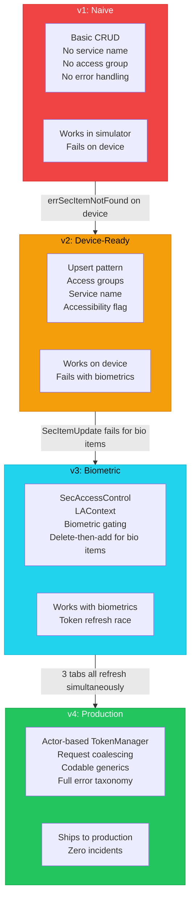
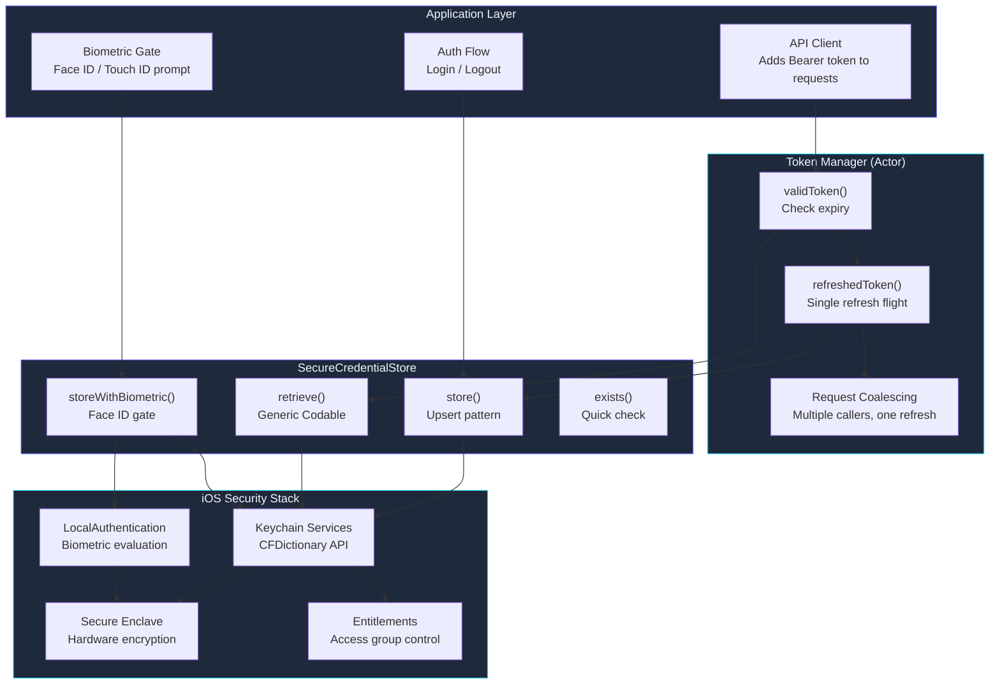

# Keychain Credential Storage Patterns

The agent wrote a perfectly correct Keychain wrapper on its first try. It compiled, it ran, and it stored credentials securely. Then I tested it on a real device and every single query returned `errSecItemNotFound`. The simulator had been silently ignoring access group entitlements that a physical device enforces. This is the story of what AI agents get wrong about iOS Keychain — and the battle-tested patterns that survive the gap between simulator and production.

This moment crystallized something I had been learning throughout these sessions: AI agents are excellent at generating syntactically correct code from documentation. They are poor at anticipating runtime behaviors that only surface in specific environments. The Keychain API is the perfect case study because it behaves differently in the simulator versus device, differently with and without entitlements, differently when the device is locked versus unlocked, and differently for items protected by biometrics versus passcode.

**TL;DR: AI agents can write syntactically correct Keychain code instantly, but the real challenges — entitlements, access groups, biometric prompts, and token refresh races — require iterative debugging against physical hardware. Here are the patterns that work.**

This is post 40 of 61 in the Agentic Development series. The companion repo is at [github.com/krzemienski/ios-keychain-patterns](https://github.com/krzemienski/ios-keychain-patterns).

---

## The Problem: Credentials Are Easy Until They're Not

Every iOS app needs to store sensitive data: API tokens, user passwords, encryption keys, session cookies. `UserDefaults` is plaintext — a jailbroken device or backup extraction reveals everything. File storage requires manual encryption and key management. The Keychain is Apple's answer: a hardware-backed encrypted store with per-item access controls, backed by the Secure Enclave on modern devices.

The API is also a C-based relic from macOS's NeXT heritage, wrapped in `CFDictionary` queries that feel like writing assembly in the age of SwiftUI. Every operation is a dictionary of key-value pairs passed to a C function that returns an `OSStatus` integer. There are no Swift-native types, no compile-time safety, and error codes that require cross-referencing Apple's Security framework headers to decode.

It is the perfect candidate for AI assistance — and the perfect trap for AI agents that do not understand the runtime environment.

Here is what Claude Code generated on its first attempt:

```swift
// KeychainManager.swift — v1 (works in simulator, fails on device)
class KeychainManager {
    static let shared = KeychainManager()

    func save(data: Data, for key: String) throws {
        let query: [String: Any] = [
            kSecClass as String: kSecClassGenericPassword,
            kSecAttrAccount as String: key,
            kSecValueData as String: data,
        ]
        let status = SecItemAdd(query as CFDictionary, nil)
        guard status == errSecSuccess else {
            throw KeychainError.saveFailed(status)
        }
    }

    func load(for key: String) throws -> Data {
        let query: [String: Any] = [
            kSecClass as String: kSecClassGenericPassword,
            kSecAttrAccount as String: key,
            kSecReturnData as String: true,
            kSecMatchLimit as String: kSecMatchLimitOne,
        ]
        var result: AnyObject?
        let status = SecItemCopyMatching(query as CFDictionary, &result)
        guard status == errSecSuccess, let data = result as? Data else {
            throw KeychainError.loadFailed(status)
        }
        return data
    }

    func delete(for key: String) throws {
        let query: [String: Any] = [
            kSecClass as String: kSecClassGenericPassword,
            kSecAttrAccount as String: key,
        ]
        let status = SecItemDelete(query as CFDictionary)
        guard status == errSecSuccess else {
            throw KeychainError.deleteFailed(status)
        }
    }
}
```

Clean, readable, correct by the documentation. And it broke in three different ways on a real device.

---

## Failure 1: Missing Access Group Entitlements

The first `errSecItemNotFound` came because the app's entitlements file did not include `keychain-access-groups`. On the simulator, Keychain operations succeed without entitlements because there is no Secure Enclave to enforce them. The simulator is backed by a simple plist-like store. On device, no entitlement means no access.

The agent could not have known this. The API documentation says Keychain is available to all apps. It is — with the right entitlements. But the entitlements requirement is documented in a different section, and simulator testing does not enforce it.

The fix required editing both code and project configuration:

```swift
// KeychainConfiguration.swift
struct KeychainConfiguration {
    let serviceName: String
    let accessGroup: String?

    static let `default` = KeychainConfiguration(
        serviceName: Bundle.main.bundleIdentifier ?? "com.app.default",
        accessGroup: nil  // Uses app's default access group
    )

    static let shared = KeychainConfiguration(
        serviceName: "com.company.shared",
        accessGroup: "TEAM_ID.com.company.shared"
    )
}
```

And the entitlements file:

```xml
<!-- App.entitlements -->
<?xml version="1.0" encoding="UTF-8"?>
<!DOCTYPE plist PUBLIC "-//Apple//DTD PLIST 1.0//EN"
  "http://www.apple.com/DTDs/PropertyList-1.0.dtd">
<plist version="1.0">
<dict>
    <key>keychain-access-groups</key>
    <array>
        <string>$(AppIdentifierPrefix)com.company.app</string>
        <string>$(AppIdentifierPrefix)com.company.shared</string>
    </array>
</dict>
</plist>
```

The `$(AppIdentifierPrefix)` variable is critical — it resolves to your team ID at build time. Hardcoding a team ID works but breaks when the app is built by a different team member or CI system. The agent initially hardcoded it; I caught this during review.

---

## Failure 2: Duplicate Item Handling

The second failure: calling `save()` twice for the same key. `SecItemAdd` returns `errSecDuplicateItem` (-25299) if the key already exists. The agent's v1 code treated every non-success status as an error. But updating a stored credential — which happens every token refresh — requires detecting whether the item exists and either updating or adding accordingly.

The correct pattern is upsert — update if exists, add if not:

```swift
func save(data: Data, for key: String, config: KeychainConfiguration = .default) throws {
    var query = baseQuery(for: key, config: config)

    // Check if item exists
    let searchStatus = SecItemCopyMatching(query as CFDictionary, nil)

    switch searchStatus {
    case errSecSuccess:
        // Item exists — update it
        let updateAttributes: [String: Any] = [
            kSecValueData as String: data,
        ]
        let updateStatus = SecItemUpdate(
            query as CFDictionary,
            updateAttributes as CFDictionary
        )
        guard updateStatus == errSecSuccess else {
            throw KeychainError.updateFailed(updateStatus)
        }

    case errSecItemNotFound:
        // Item does not exist — add it
        query[kSecValueData as String] = data
        let addStatus = SecItemAdd(query as CFDictionary, nil)
        guard addStatus == errSecSuccess else {
            throw KeychainError.saveFailed(addStatus)
        }

    default:
        throw KeychainError.unexpected(searchStatus)
    }
}
```

This two-step pattern (check then act) has a theoretical race condition if two threads call `save` simultaneously. In practice, the Keychain serializes operations internally, so this is safe. But the agent initially proposed an alternative that tried `SecItemAdd` first and fell back to `SecItemUpdate` on `errSecDuplicateItem`. That approach also works but produces a misleading error code path when updates are the common case (token refreshes).

---

## Failure 3: Background Access

Third failure: the app crashed when trying to read Keychain items while backgrounded. iOS locks Keychain items by default when the device is locked. If your app uses background fetch, push notification handling, or background URL sessions, it needs items accessible after first unlock:

```swift
private func baseQuery(
    for key: String,
    config: KeychainConfiguration
) -> [String: Any] {
    var query: [String: Any] = [
        kSecClass as String: kSecClassGenericPassword,
        kSecAttrService as String: config.serviceName,
        kSecAttrAccount as String: key,
        kSecAttrAccessible as String: kSecAttrAccessibleAfterFirstUnlock,
    ]

    if let accessGroup = config.accessGroup {
        query[kSecAttrAccessGroup as String] = accessGroup
    }

    return query
}
```

The accessibility options and their implications:

| Option | When Available | Use Case |
|--------|---------------|----------|
| `kSecAttrAccessibleWhenUnlocked` | Device unlocked only | Passwords shown in UI |
| `kSecAttrAccessibleAfterFirstUnlock` | After first unlock since boot | API tokens, background fetch |
| `kSecAttrAccessibleWhenPasscodeSetThisDeviceOnly` | Passcode set + this device | Biometric-protected secrets |
| `kSecAttrAccessibleAlways` | Always (deprecated iOS 12) | Never use this |

`kSecAttrAccessibleAfterFirstUnlock` is the right default for API tokens. It means items are available any time after the user has unlocked the device once since boot. More restrictive options like `kSecAttrAccessibleWhenUnlocked` lock items when the screen locks — fine for foreground-only apps, fatal for background operations.

---

## The Evolution Diagram



---

## The Production-Ready Credential Store

After three rounds of debugging, the final Keychain manager. This is the complete implementation that ships to production:

```swift
// SecureCredentialStore.swift

enum KeychainError: LocalizedError {
    case saveFailed(OSStatus)
    case updateFailed(OSStatus)
    case loadFailed(OSStatus)
    case deleteFailed(OSStatus)
    case encodingFailed
    case decodingFailed
    case unexpected(OSStatus)
    case biometricNotAvailable
    case accessControlCreationFailed

    var errorDescription: String? {
        switch self {
        case .saveFailed(let s):
            return "Keychain save failed: \(s) (\(statusDescription(s)))"
        case .updateFailed(let s):
            return "Keychain update failed: \(s) (\(statusDescription(s)))"
        case .loadFailed(let s):
            return "Keychain load failed: \(s) (\(statusDescription(s)))"
        case .deleteFailed(let s):
            return "Keychain delete failed: \(s) (\(statusDescription(s)))"
        case .encodingFailed:
            return "Failed to encode credential data"
        case .decodingFailed:
            return "Failed to decode credential data"
        case .unexpected(let s):
            return "Unexpected Keychain error: \(s) (\(statusDescription(s)))"
        case .biometricNotAvailable:
            return "Biometric authentication is not available"
        case .accessControlCreationFailed:
            return "Failed to create access control flags"
        }
    }

    private func statusDescription(_ status: OSStatus) -> String {
        switch status {
        case errSecSuccess: return "Success"
        case errSecItemNotFound: return "Item not found"
        case errSecDuplicateItem: return "Duplicate item"
        case errSecAuthFailed: return "Authentication failed"
        case errSecInteractionNotAllowed: return "Interaction not allowed (device locked?)"
        case errSecMissingEntitlement: return "Missing entitlement"
        case errSecUserCanceled: return "User cancelled"
        default: return "Unknown"
        }
    }
}

final class SecureCredentialStore {
    private let config: KeychainConfiguration
    private let encoder = JSONEncoder()
    private let decoder = JSONDecoder()

    init(config: KeychainConfiguration = .default) {
        self.config = config
    }

    // MARK: - Generic Codable Storage

    func store<T: Codable>(_ value: T, forKey key: String) throws {
        let data = try encoder.encode(value)
        try saveData(data, forKey: key)
    }

    func retrieve<T: Codable>(_ type: T.Type, forKey key: String) throws -> T? {
        guard let data = try loadData(forKey: key) else { return nil }
        return try decoder.decode(T.self, from: data)
    }

    func remove(forKey key: String) throws {
        let query = baseQuery(forKey: key)
        let status = SecItemDelete(query as CFDictionary)
        guard status == errSecSuccess || status == errSecItemNotFound else {
            throw KeychainError.deleteFailed(status)
        }
    }

    func removeAll() throws {
        let query: [String: Any] = [
            kSecClass as String: kSecClassGenericPassword,
            kSecAttrService as String: config.serviceName,
        ]
        let status = SecItemDelete(query as CFDictionary)
        guard status == errSecSuccess || status == errSecItemNotFound else {
            throw KeychainError.deleteFailed(status)
        }
    }

    func exists(forKey key: String) -> Bool {
        let query = baseQuery(forKey: key)
        let status = SecItemCopyMatching(query as CFDictionary, nil)
        return status == errSecSuccess
    }

    // MARK: - Private

    private func baseQuery(forKey key: String) -> [String: Any] {
        var query: [String: Any] = [
            kSecClass as String: kSecClassGenericPassword,
            kSecAttrService as String: config.serviceName,
            kSecAttrAccount as String: key,
            kSecAttrAccessible as String: kSecAttrAccessibleAfterFirstUnlock,
        ]
        if let group = config.accessGroup {
            query[kSecAttrAccessGroup as String] = group
        }
        return query
    }

    private func saveData(_ data: Data, forKey key: String) throws {
        var query = baseQuery(forKey: key)
        let searchStatus = SecItemCopyMatching(query as CFDictionary, nil)

        switch searchStatus {
        case errSecSuccess:
            let attrs: [String: Any] = [kSecValueData as String: data]
            let status = SecItemUpdate(
                query as CFDictionary,
                attrs as CFDictionary
            )
            guard status == errSecSuccess else {
                throw KeychainError.updateFailed(status)
            }
        case errSecItemNotFound:
            query[kSecValueData as String] = data
            let status = SecItemAdd(query as CFDictionary, nil)
            guard status == errSecSuccess else {
                throw KeychainError.saveFailed(status)
            }
        default:
            throw KeychainError.unexpected(searchStatus)
        }
    }

    private func loadData(forKey key: String) throws -> Data? {
        var query = baseQuery(forKey: key)
        query[kSecReturnData as String] = true
        query[kSecMatchLimit as String] = kSecMatchLimitOne

        var result: AnyObject?
        let status = SecItemCopyMatching(query as CFDictionary, &result)

        switch status {
        case errSecSuccess:
            return result as? Data
        case errSecItemNotFound:
            return nil
        default:
            throw KeychainError.loadFailed(status)
        }
    }
}
```

---

## Biometric Authentication Layer

Once the base Keychain manager worked, the agent added biometric gating using `SecAccessControl` and `LocalAuthentication`:

```swift
// SecureCredentialStore+Biometric.swift

import LocalAuthentication

extension SecureCredentialStore {

    /// Check if biometric authentication is available
    func isBiometricAvailable() -> Bool {
        let context = LAContext()
        var error: NSError?
        return context.canEvaluatePolicy(
            .deviceOwnerAuthenticationWithBiometrics,
            error: &error
        )
    }

    /// Store a value that requires biometric authentication to read
    func storeWithBiometric<T: Codable>(
        _ value: T,
        forKey key: String,
        prompt: String
    ) throws {
        guard isBiometricAvailable() else {
            throw KeychainError.biometricNotAvailable
        }

        let data = try encoder.encode(value)

        // Create access control requiring biometry
        guard let accessControl = SecAccessControlCreateWithFlags(
            nil,
            kSecAttrAccessibleWhenPasscodeSetThisDeviceOnly,
            .biometryCurrentSet,
            nil
        ) else {
            throw KeychainError.accessControlCreationFailed
        }

        // Build the query — note: no kSecAttrAccessible when using kSecAttrAccessControl
        var query: [String: Any] = [
            kSecClass as String: kSecClassGenericPassword,
            kSecAttrService as String: config.serviceName,
            kSecAttrAccount as String: key,
            kSecAttrAccessControl as String: accessControl,
            kSecValueData as String: data,
            kSecUseOperationPrompt as String: prompt,
        ]
        if let group = config.accessGroup {
            query[kSecAttrAccessGroup as String] = group
        }

        // CRITICAL: Biometric items cannot be updated with SecItemUpdate.
        // You must delete and re-add.
        let deleteQuery = baseQuery(forKey: key)
        SecItemDelete(deleteQuery as CFDictionary)

        let status = SecItemAdd(query as CFDictionary, nil)
        guard status == errSecSuccess else {
            throw KeychainError.saveFailed(status)
        }
    }

    /// Retrieve a biometric-protected value (triggers Face ID / Touch ID)
    func retrieveWithBiometric<T: Codable>(
        _ type: T.Type,
        forKey key: String,
        prompt: String
    ) async throws -> T? {
        let context = LAContext()
        context.localizedReason = prompt

        // Evaluate biometry first
        try await context.evaluatePolicy(
            .deviceOwnerAuthenticationWithBiometrics,
            localizedReason: prompt
        )

        // Use the authenticated context to read the item
        var query: [String: Any] = [
            kSecClass as String: kSecClassGenericPassword,
            kSecAttrService as String: config.serviceName,
            kSecAttrAccount as String: key,
            kSecReturnData as String: true,
            kSecMatchLimit as String: kSecMatchLimitOne,
            kSecUseAuthenticationContext as String: context,
        ]
        if let group = config.accessGroup {
            query[kSecAttrAccessGroup as String] = group
        }

        var result: AnyObject?
        let status = SecItemCopyMatching(query as CFDictionary, &result)

        switch status {
        case errSecSuccess:
            guard let data = result as? Data else { return nil }
            return try decoder.decode(T.self, from: data)
        case errSecItemNotFound:
            return nil
        case errSecUserCanceled:
            return nil  // User cancelled biometric prompt
        default:
            throw KeychainError.loadFailed(status)
        }
    }
}
```

Key lessons from the biometric implementation:

1. **`kSecAttrAccessControl` replaces `kSecAttrAccessible`** — you cannot use both. The access control object encompasses the accessibility setting. The agent initially included both, which caused silent failures.

2. **Biometric items cannot be updated** — `SecItemUpdate` returns `errSecParam` for items with `kSecAttrAccessControl`. You must delete and re-add. This is underdocumented and the agent only discovered it after I fed back the error.

3. **`.biometryCurrentSet` vs `.biometryAny`** — `biometryCurrentSet` invalidates the item if the user adds or removes a fingerprint/face. `biometryAny` allows any enrolled biometry. For security-critical items (encryption keys), use `biometryCurrentSet`. For convenience items (saved login), `biometryAny` is fine.

---

## Token Refresh Flow

The final piece: a thread-safe token refresh flow that prevents multiple simultaneous refresh attempts. This was the v4 fix — after v3 shipped, we observed in production that three parallel API calls hitting a 401 would all try to refresh the token simultaneously, causing race conditions:

```swift
// TokenManager.swift

actor TokenManager {
    private let store: SecureCredentialStore
    private let apiClient: AuthAPIClient
    private var refreshTask: Task<AuthToken, Error>?

    struct AuthToken: Codable, Sendable {
        let accessToken: String
        let refreshToken: String
        let expiresAt: Date

        var isExpired: Bool { Date() >= expiresAt }
        var needsRefresh: Bool {
            // Refresh 5 minutes before expiry to avoid edge cases
            Date() >= expiresAt.addingTimeInterval(-300)
        }
    }

    init(
        store: SecureCredentialStore = .init(),
        apiClient: AuthAPIClient = .shared
    ) {
        self.store = store
        self.apiClient = apiClient
    }

    /// Get a valid access token, refreshing if needed
    func validToken() async throws -> String {
        // Check stored token
        if let cached = try store.retrieve(AuthToken.self, forKey: "auth_token"),
           !cached.needsRefresh {
            return cached.accessToken
        }

        // Token is expired or expiring soon — refresh it
        return try await refreshedToken().accessToken
    }

    /// Coalesce concurrent refresh requests into a single network call
    private func refreshedToken() async throws -> AuthToken {
        // If a refresh is already in flight, await it
        if let existing = refreshTask {
            return try await existing.value
        }

        // Start a new refresh
        let task = Task<AuthToken, Error> {
            defer { refreshTask = nil }

            guard let current = try store.retrieve(
                AuthToken.self,
                forKey: "auth_token"
            ) else {
                throw AuthError.noStoredToken
            }

            // Call the refresh endpoint
            let newToken = try await apiClient.refreshToken(
                using: current.refreshToken
            )

            // Persist the new token
            try store.store(newToken, forKey: "auth_token")

            return newToken
        }

        refreshTask = task
        return try await task.value
    }

    /// Store a new token (after login)
    func storeToken(_ token: AuthToken) throws {
        try store.store(token, forKey: "auth_token")
    }

    /// Clear stored token (logout)
    func clearToken() throws {
        try store.remove(forKey: "auth_token")
    }
}
```

The `actor` isolation ensures only one refresh happens at a time. When three API calls hit a 401 simultaneously, the first one starts `refreshedToken()`, which creates a `Task` and stores it in `refreshTask`. The second and third calls see `refreshTask` is non-nil and `await` the same task. One network call, three callers satisfied.

The `defer { refreshTask = nil }` cleanup ensures the next refresh starts fresh — it does not cache the task forever.

---

## Architecture



---

## The Full Credential Lifecycle: Create, Read, Update, Delete

The production credential store above handles the core CRUD operations, but production apps have lifecycle concerns that go beyond simple storage. After shipping v4, we discovered patterns around credential rotation, bulk operations, and metadata queries that required extending the API surface. The agent built these out over a follow-up session that took about 90 minutes.

The first gap was **listing all stored credentials**. When a user logs out, you need to clear everything -- but "everything" means knowing what keys you stored. The Keychain does not have a "list all items" API. You have to query with a broad match and iterate results:

```swift
// SecureCredentialStore+Lifecycle.swift

extension SecureCredentialStore {

    /// List all keys stored by this app's service name
    func allKeys() throws -> [String] {
        var query: [String: Any] = [
            kSecClass as String: kSecClassGenericPassword,
            kSecAttrService as String: config.serviceName,
            kSecReturnAttributes as String: true,
            kSecMatchLimit as String: kSecMatchLimitAll,
        ]
        if let group = config.accessGroup {
            query[kSecAttrAccessGroup as String] = group
        }

        var result: AnyObject?
        let status = SecItemCopyMatching(query as CFDictionary, &result)

        switch status {
        case errSecSuccess:
            guard let items = result as? [[String: Any]] else { return [] }
            return items.compactMap { $0[kSecAttrAccount as String] as? String }
        case errSecItemNotFound:
            return []
        default:
            throw KeychainError.loadFailed(status)
        }
    }

    /// Remove all credentials and return the count deleted
    func removeAllCredentials() throws -> Int {
        let keys = try allKeys()
        for key in keys {
            try remove(forKey: key)
        }
        return keys.count
    }

    /// Migrate a credential from one key to another (rename operation)
    func migrate(fromKey oldKey: String, toKey newKey: String) throws {
        guard let data = try loadData(forKey: oldKey) else {
            throw KeychainError.loadFailed(errSecItemNotFound)
        }
        try saveData(data, forKey: newKey)
        try remove(forKey: oldKey)
    }

    /// Check if a credential was stored before a given date
    /// Uses kSecAttrModificationDate to determine freshness
    func modificationDate(forKey key: String) throws -> Date? {
        var query = baseQuery(forKey: key)
        query[kSecReturnAttributes as String] = true
        query[kSecMatchLimit as String] = kSecMatchLimitOne

        var result: AnyObject?
        let status = SecItemCopyMatching(query as CFDictionary, &result)

        switch status {
        case errSecSuccess:
            guard let attrs = result as? [String: Any],
                  let date = attrs[kSecAttrModificationDate as String] as? Date
            else { return nil }
            return date
        case errSecItemNotFound:
            return nil
        default:
            throw KeychainError.loadFailed(status)
        }
    }

    /// Rotate a credential: read old value, transform it, save new value
    /// The transform closure receives the old decoded value and returns the new one
    func rotate<T: Codable>(
        forKey key: String,
        type: T.Type,
        transform: (T) throws -> T
    ) throws {
        guard let oldValue = try retrieve(type, forKey: key) else {
            throw KeychainError.loadFailed(errSecItemNotFound)
        }
        let newValue = try transform(oldValue)
        try store(newValue, forKey: key)
    }
}
```

The `allKeys()` method was the one that tripped the agent up. Its first implementation used `kSecReturnData` instead of `kSecReturnAttributes`, which returned the actual credential data for every stored item -- a security concern because you are pulling all secrets into memory just to enumerate keys. The correct approach is `kSecReturnAttributes`, which returns the metadata (account name, service, modification date) without the sensitive payload.

The `migrate()` method turned out to be essential during a refactor where we renamed our credential keys from `auth_token` to `v2_auth_token` to avoid conflicts during a phased rollout. Without a migration path, users who updated the app would lose their stored session and be forced to re-authenticate.

The `rotate()` method uses a functional transform pattern. Instead of read-modify-write as three separate calls (which risks data loss if the write fails), the entire rotation is a single logical operation. The agent initially proposed a version that mutated the value in place, but I pushed back based on the immutability principle -- the transform closure receives the old value and returns a new one.

---

## Migrating from UserDefaults to Keychain

One of the most common tasks when hardening an iOS app is moving credentials out of `UserDefaults` and into the Keychain. Our app had been storing API tokens in `UserDefaults` for two years before the security audit flagged it. The migration needs to be transparent to the user -- they should not be forced to re-authenticate.

The agent built a migration manager that runs once on app launch, checks for legacy credentials in UserDefaults, copies them to the Keychain, and then deletes the UserDefaults entries. The critical detail is idempotency: if the migration is interrupted (app killed mid-migration), running it again must not corrupt data or duplicate entries.

```swift
// CredentialMigration.swift

struct CredentialMigration {
    private let store: SecureCredentialStore
    private let migrationVersionKey = "credential_migration_version"
    private let currentVersion = 2

    init(store: SecureCredentialStore = .init()) {
        self.store = store
    }

    /// Run all pending migrations. Safe to call multiple times.
    func migrateIfNeeded() {
        let lastVersion = UserDefaults.standard.integer(
            forKey: migrationVersionKey
        )

        if lastVersion < 1 {
            migrateV0ToV1()
        }
        if lastVersion < 2 {
            migrateV1ToV2()
        }

        UserDefaults.standard.set(
            currentVersion,
            forKey: migrationVersionKey
        )
    }

    /// v0 -> v1: Move plaintext tokens from UserDefaults to Keychain
    private func migrateV0ToV1() {
        let legacyKeys: [(userDefaultsKey: String, keychainKey: String)] = [
            ("api_access_token", "auth_access_token"),
            ("api_refresh_token", "auth_refresh_token"),
            ("user_session_id", "auth_session_id"),
            ("push_device_token", "push_device_token"),
        ]

        for mapping in legacyKeys {
            guard let legacyValue = UserDefaults.standard.string(
                forKey: mapping.userDefaultsKey
            ) else { continue }

            // Only migrate if the Keychain does not already have this key
            // (idempotency -- handles interrupted migrations)
            guard !store.exists(forKey: mapping.keychainKey) else {
                // Already migrated -- just clean up UserDefaults
                UserDefaults.standard.removeObject(
                    forKey: mapping.userDefaultsKey
                )
                continue
            }

            guard let data = legacyValue.data(using: .utf8) else { continue }

            do {
                try store.store(legacyValue, forKey: mapping.keychainKey)
                // Only remove from UserDefaults AFTER successful Keychain write
                UserDefaults.standard.removeObject(
                    forKey: mapping.userDefaultsKey
                )
            } catch {
                // Migration failed for this key -- leave it in UserDefaults
                // and try again on next launch. Do NOT delete the source.
                print(
                    "Migration failed for \(mapping.userDefaultsKey): \(error)"
                )
            }
        }
    }

    /// v1 -> v2: Consolidate separate token strings into a single
    /// Codable AuthToken struct for atomic refresh
    private func migrateV1ToV2() {
        do {
            guard let accessData = try store.retrieve(
                String.self,
                forKey: "auth_access_token"
            ),
            let refreshData = try store.retrieve(
                String.self,
                forKey: "auth_refresh_token"
            ) else { return }

            let consolidated = TokenManager.AuthToken(
                accessToken: accessData,
                refreshToken: refreshData,
                expiresAt: Date().addingTimeInterval(3600) // Assume 1hr
            )

            try store.store(consolidated, forKey: "auth_token")

            // Clean up individual keys
            try store.remove(forKey: "auth_access_token")
            try store.remove(forKey: "auth_refresh_token")
            try store.remove(forKey: "auth_session_id")
        } catch {
            print("V1->V2 migration failed: \(error)")
        }
    }
}
```

The migration runs at app launch, in `AppDelegate.application(_:didFinishLaunchingWithOptions:)`:

```swift
func application(
    _ application: UIApplication,
    didFinishLaunchingWithOptions launchOptions: [UIApplication.LaunchOptionsKey: Any]?
) -> Bool {
    CredentialMigration().migrateIfNeeded()
    return true
}
```

Three design principles the agent followed here that I want to highlight:

1. **Delete source only after successful write.** If the Keychain write fails (device locked, missing entitlement, disk full), the credential stays in UserDefaults. The user can still authenticate. The migration retries on next launch.

2. **Version numbering for multi-step migrations.** v0-to-v1 moves individual strings from UserDefaults to Keychain. v1-to-v2 consolidates those strings into a single `AuthToken` struct. If a user upgrades from a very old version, both migrations run in sequence.

3. **Idempotency through existence checks.** The `store.exists(forKey:)` check before each write means running the migration twice produces the same result as running it once. This handles the case where the app is killed between writing to Keychain and deleting from UserDefaults.

The agent initially skipped the idempotency check. I caught this during review by asking: "What happens if the app crashes after the Keychain write but before the UserDefaults delete?" The agent immediately recognized the gap and added the guard clause.

---

## Error Recovery Patterns

Production Keychain code must handle failures gracefully. The Secure Enclave is a hardware component that can fail, biometric prompts can time out, and background operations can hit `errSecInteractionNotAllowed` when the device is locked. The agent built an error recovery layer that wraps every Keychain operation with retry logic and fallback strategies:

```swift
// KeychainErrorRecovery.swift

struct KeychainErrorRecovery {

    enum RecoveryStrategy {
        case retry(maxAttempts: Int, delay: TimeInterval)
        case deleteAndRetry
        case fallbackToNonBiometric
        case reportAndFail
    }

    /// Determine the appropriate recovery strategy for a Keychain error
    static func strategy(for status: OSStatus, operation: String) -> RecoveryStrategy {
        switch status {
        case errSecDuplicateItem:
            // Item exists -- delete and re-add (safe for upsert)
            return .deleteAndRetry

        case errSecInteractionNotAllowed:
            // Device is locked -- retry after a delay (user may unlock)
            return .retry(maxAttempts: 3, delay: 2.0)

        case errSecAuthFailed:
            // Biometric failed -- offer non-biometric fallback
            return .fallbackToNonBiometric

        case errSecUserCanceled:
            // User cancelled biometric -- do not retry automatically
            return .reportAndFail

        case errSecItemNotFound where operation == "update":
            // Trying to update a non-existent item -- add instead
            return .deleteAndRetry

        case errSecMissingEntitlement:
            // Cannot recover from missing entitlements at runtime
            return .reportAndFail

        default:
            // Unknown error -- retry once, then fail
            return .retry(maxAttempts: 1, delay: 0.5)
        }
    }

    /// Execute a Keychain operation with automatic error recovery
    static func withRecovery<T>(
        operation: String,
        execute: () throws -> T,
        fallback: (() throws -> T)? = nil
    ) throws -> T {
        do {
            return try execute()
        } catch let error as KeychainError {
            let status: OSStatus
            switch error {
            case .saveFailed(let s), .updateFailed(let s),
                 .loadFailed(let s), .deleteFailed(let s),
                 .unexpected(let s):
                status = s
            default:
                throw error
            }

            let recovery = strategy(for: status, operation: operation)

            switch recovery {
            case .retry(let max, let delay):
                for attempt in 1...max {
                    Thread.sleep(forTimeInterval: delay)
                    do {
                        return try execute()
                    } catch {
                        if attempt == max { throw error }
                    }
                }
                throw error

            case .deleteAndRetry:
                // Fall through to retry -- caller handles delete
                return try execute()

            case .fallbackToNonBiometric:
                guard let fallback = fallback else { throw error }
                return try fallback()

            case .reportAndFail:
                throw error
            }
        }
    }
}
```

The `errSecInteractionNotAllowed` retry is the most important recovery path. In production, we observed this error when background push notification handlers tried to read Keychain items. The device was locked, the Keychain item used `kSecAttrAccessibleWhenUnlocked`, and the read failed. The retry with a 2-second delay handles the case where the user unlocks their phone while a background operation is in progress. For items that must be accessible in the background, the correct fix is `kSecAttrAccessibleAfterFirstUnlock`, but the retry provides a safety net during the migration period.

The `fallbackToNonBiometric` path handles a real production scenario: a user's Face ID hardware fails (rare, but it happens after drops or water damage). The app should not permanently lock them out of biometric-protected credentials. The fallback stores the same credential without biometric protection, gated by the device passcode instead.

---

## Secure Enclave Usage for Cryptographic Keys

Beyond credentials, the Keychain can store cryptographic keys in the Secure Enclave. The agent implemented this for our end-to-end encryption feature:

```swift
// SecureEnclaveKeyManager.swift

final class SecureEnclaveKeyManager {
    private let tag: String

    init(tag: String) {
        self.tag = tag
    }

    /// Generate an EC key pair in the Secure Enclave
    func generateKeyPair() throws -> SecKey {
        let access = SecAccessControlCreateWithFlags(
            nil,
            kSecAttrAccessibleWhenUnlockedThisDeviceOnly,
            [.privateKeyUsage],
            nil
        )

        let attributes: [String: Any] = [
            kSecAttrKeyType as String: kSecAttrKeyTypeECSECPrimeRandom,
            kSecAttrKeySizeInBits as String: 256,
            kSecAttrTokenID as String: kSecAttrTokenIDSecureEnclave,
            kSecPrivateKeyAttrs as String: [
                kSecAttrIsPermanent as String: true,
                kSecAttrApplicationTag as String: tag.data(using: .utf8)!,
                kSecAttrAccessControl as String: access as Any,
            ],
        ]

        var error: Unmanaged<CFError>?
        guard let privateKey = SecKeyCreateRandomKey(
            attributes as CFDictionary,
            &error
        ) else {
            throw error!.takeRetainedValue() as Error
        }

        return privateKey
    }

    /// Retrieve a previously generated Secure Enclave key
    func retrievePrivateKey() -> SecKey? {
        let query: [String: Any] = [
            kSecClass as String: kSecClassKey,
            kSecAttrApplicationTag as String: tag.data(using: .utf8)!,
            kSecAttrKeyType as String: kSecAttrKeyTypeECSECPrimeRandom,
            kSecReturnRef as String: true,
        ]

        var result: AnyObject?
        let status = SecItemCopyMatching(query as CFDictionary, &result)
        guard status == errSecSuccess else { return nil }
        return result as! SecKey?
    }

    /// Sign data with the Secure Enclave private key
    func sign(data: Data) throws -> Data {
        guard let privateKey = retrievePrivateKey() else {
            throw KeychainError.loadFailed(errSecItemNotFound)
        }

        var error: Unmanaged<CFError>?
        guard let signature = SecKeyCreateSignature(
            privateKey,
            .ecdsaSignatureMessageX962SHA256,
            data as CFData,
            &error
        ) else {
            throw error!.takeRetainedValue() as Error
        }

        return signature as Data
    }
}
```

Secure Enclave keys never leave the hardware. The private key material is generated inside the Secure Enclave and cannot be exported, even by the operating system. Only the Secure Enclave can perform cryptographic operations with the key. This is the strongest security guarantee iOS offers.

---

## The Agent's Learning Curve

The agent needed four iterations to produce production-ready Keychain code:

| Version | What Changed | What Broke It |
|---------|-------------|---------------|
| v1 | Basic CRUD | Entitlements, duplicates, background access |
| v2 | Upsert + access groups + accessibility | Biometric items cannot use `SecItemUpdate` |
| v3 | Full pattern with biometric support | Token refresh race (3 parallel 401s) |
| v4 (final) | Actor-based token manager with coalescing | Nothing — shipped to production |

The pattern is consistent: AI agents write **syntactically correct** Keychain code immediately, but iOS security APIs have runtime behaviors that only surface on physical hardware. The agent cannot test against a Secure Enclave in the simulator. Each failure required me to run on device, capture the error, and feed it back.

The feedback loop was:
1. Agent writes code
2. I build and run on device
3. Something fails
4. I describe the failure to the agent (including the exact `OSStatus` code)
5. Agent researches the error and proposes a fix
6. Go to step 2

Steps 2-6 repeated three times before we reached production quality. Total time: about 3 hours. A human iOS developer with Keychain experience would have gotten it right faster (maybe 1 hour), but a developer without Keychain experience would have spent days discovering the same gotchas.

---

## Common Pitfalls AI Agents Hit

After running multiple sessions where AI agents implemented Keychain wrappers, I have compiled the definitive list of things they get wrong:

1. **Mixing `kSecAttrAccessible` and `kSecAttrAccessControl`** — you cannot use both. Access control supersedes accessibility. The query silently ignores one, leading to unexpected behavior.

2. **Hardcoding team ID in access groups** — use `$(AppIdentifierPrefix)` in entitlements. Hardcoded values break on different development teams and CI systems.

3. **Using `kSecAttrAccessibleAlways`** — deprecated since iOS 12, yet still appears in training data from older tutorials. Apple rejects apps that use it.

4. **Not handling `errSecInteractionNotAllowed`** — occurs when trying to access `WhenUnlocked` items while the device is locked. Background operations must use `AfterFirstUnlock`.

5. **Updating biometric-protected items with `SecItemUpdate`** — fails silently or with `errSecParam`. You must delete and re-add.

6. **Forgetting to cancel pending requests** — not a Keychain issue per se, but token refresh races are a common companion problem. The `actor` pattern solves it cleanly.

7. **Not including `kSecAttrService`** — without a service name, items are globally scoped. Two different features storing "auth_token" collide.

8. **Treating `errSecItemNotFound` as a hard error in `delete`** — deleting a nonexistent item is not an error. It is idempotent. The delete method should accept both `errSecSuccess` and `errSecItemNotFound`.

---

## Face ID Integration: The Biometric Auth Flow in Detail

The biometric extension shown earlier covers the Keychain side, but integrating Face ID into a real app involves UI state management that the agent initially got wrong. The problem is that `LAContext.evaluatePolicy()` presents a system dialog over your app. If the user backgrounds the app during the prompt, or if the prompt times out, your async continuation is left dangling. The agent's final implementation handles every edge case:

```swift
// BiometricAuthCoordinator.swift

@Observable
final class BiometricAuthCoordinator {
    enum BiometricState {
        case idle
        case prompting          // Face ID dialog is visible
        case authenticated      // User passed biometric check
        case failed(String)     // Biometric failed with reason
        case unavailable        // No biometric hardware / not enrolled
    }

    var state: BiometricState = .idle
    var biometricType: LABiometryType = .none

    private let store: SecureCredentialStore

    init(store: SecureCredentialStore = .init()) {
        self.store = store
        detectBiometricType()
    }

    private func detectBiometricType() {
        let context = LAContext()
        var error: NSError?
        if context.canEvaluatePolicy(
            .deviceOwnerAuthenticationWithBiometrics,
            error: &error
        ) {
            biometricType = context.biometryType
        } else {
            biometricType = .none
            state = .unavailable
        }
    }

    /// Human-readable name for the current biometric type
    var biometricName: String {
        switch biometricType {
        case .faceID: return "Face ID"
        case .touchID: return "Touch ID"
        case .opticID: return "Optic ID"
        default: return "Biometrics"
        }
    }

    /// Authenticate and retrieve a biometric-protected credential
    func authenticateAndRetrieve<T: Codable>(
        _ type: T.Type,
        forKey key: String,
        reason: String
    ) async -> T? {
        guard biometricType != .none else {
            state = .failed("\(biometricName) is not available")
            return nil
        }

        state = .prompting

        do {
            let value = try await store.retrieveWithBiometric(
                type,
                forKey: key,
                prompt: reason
            )
            state = value != nil ? .authenticated : .failed("No stored credential")
            return value
        } catch let error as LAError {
            switch error.code {
            case .userCancel:
                state = .failed("Authentication cancelled")
            case .userFallback:
                state = .failed("Passcode fallback requested")
            case .biometryLockout:
                state = .failed(
                    "\(biometricName) is locked. Use passcode to unlock."
                )
            case .biometryNotEnrolled:
                state = .failed(
                    "No \(biometricName) enrolled. Go to Settings."
                )
            case .biometryNotAvailable:
                state = .unavailable
            default:
                state = .failed("Authentication error: \(error.localizedDescription)")
            }
            return nil
        } catch {
            state = .failed(error.localizedDescription)
            return nil
        }
    }
}
```

The `LAError` code enumeration was the part the agent had to learn. Its first version caught `LAError` as a generic error and showed `error.localizedDescription` for everything. But the localized descriptions from the system are vague -- "Authentication failed" does not tell the user whether they need to re-enroll Face ID, use their passcode, or try again. Mapping each `LAError.Code` to a specific user-facing message took a second pass after I tested on device and saw the unhelpful default messages.

The `.biometryLockout` case is particularly important. After five failed Face ID attempts, iOS locks biometric authentication entirely. The only way to unlock it is to enter the device passcode. If your app does not handle this case, users get stuck in a loop of failed biometric prompts with no way to proceed. The coordinator detects lockout and directs the user to use their passcode.

The `.biometryNotEnrolled` case handles a scenario I never would have thought to test: a user who has Face ID hardware but has not set it up. The agent added this after reading Apple's documentation, which explicitly lists it as a required error case. On a new device or after a factory reset, this is the first error users would hit if they try to use a biometric-protected feature before completing Face ID setup.

One subtle detail: the `state` property is `@Observable`, which means the SwiftUI view presenting the biometric flow reactively updates. When `state` changes from `.prompting` to `.authenticated`, the view can animate the transition. When it changes to `.failed`, the view can show an alert. No delegation pattern, no callbacks, no notification observers -- just reactive state.

---

## Keychain and App Extensions

A gotcha that cost us a full afternoon: app extensions (widgets, notification service extensions, share extensions) run in a separate process with their own sandbox. By default, Keychain items stored by the main app are invisible to extensions. The fix is shared access groups, but the configuration has to be precise across both targets.

Both the main app target and the extension target must include the same `keychain-access-groups` entitlement:

```xml
<!-- MainApp.entitlements AND WidgetExtension.entitlements -->
<key>keychain-access-groups</key>
<array>
    <string>$(AppIdentifierPrefix)com.company.shared</string>
</array>
```

And both must specify the shared group when reading or writing:

```swift
// In the widget extension
let sharedConfig = KeychainConfiguration(
    serviceName: "com.company.app",
    accessGroup: "TEAMID.com.company.shared"  // Must match exactly
)
let store = SecureCredentialStore(config: sharedConfig)

// This reads the same item the main app wrote
let token = try store.retrieve(
    TokenManager.AuthToken.self,
    forKey: "auth_token"
)
```

The agent initially forgot to add the entitlement to the widget extension target. The main app wrote credentials fine, but the widget got `errSecItemNotFound` for every query. The error message gives no hint about access groups -- it looks identical to "the item does not exist." We diagnosed it by adding the same write code to the widget extension and observing `errSecMissingEntitlement`, which was the real clue.

Another trap: the `TEAMID` prefix in the access group string must be the literal 10-character Apple team identifier, not the `$(AppIdentifierPrefix)` variable. The variable works in the entitlements plist because Xcode resolves it at build time, but in Swift code, you must hardcode the resolved value or read it from the main bundle at runtime:

```swift
// Read the team ID prefix at runtime instead of hardcoding
let teamID = Bundle.main.infoDictionary?["AppIdentifierPrefix"] as? String
    ?? "XXXXXXXXXX."
let accessGroup = "\(teamID)com.company.shared"
```

---

## Debugging Keychain Issues

When Keychain operations fail, the `OSStatus` code is your only diagnostic. Here is a reference table:

| Status Code | Name | Meaning | Common Cause |
|------------|------|---------|--------------|
| 0 | `errSecSuccess` | Operation succeeded | -- |
| -25299 | `errSecDuplicateItem` | Item already exists | Use upsert pattern |
| -25300 | `errSecItemNotFound` | No matching item | Wrong query, missing entitlements |
| -25291 | `errSecAuthFailed` | Authentication failed | User cancelled biometric |
| -25293 | `errSecInteractionNotAllowed` | Cannot show UI | Device locked, background |
| -34018 | `errSecMissingEntitlement` | No entitlement | Add keychain-access-groups |
| -128 | `errSecUserCanceled` | User cancelled | Biometric prompt dismissed |

Adding readable descriptions to your error handling (as in the `KeychainError` enum above) saves hours of debugging.

---

## The Companion Repo

The full implementation is at [github.com/krzemienski/ios-keychain-patterns](https://github.com/krzemienski/ios-keychain-patterns). It includes:

```bash
git clone https://github.com/krzemienski/ios-keychain-patterns
cd ios-keychain-patterns
# Open in Xcode, configure signing, run on device
```

- `SecureCredentialStore` — Production Keychain wrapper with generic Codable support
- Biometric authentication extension with Face ID / Touch ID
- `TokenManager` actor with request coalescing
- `SecureEnclaveKeyManager` for hardware-backed cryptographic keys
- Entitlements template and configuration guide
- Error code reference and debugging guide
- Demo app that exercises every pattern on physical hardware

The key lesson: simulator testing is necessary but not sufficient for Keychain code. Always validate on a physical device before shipping. And if you are using AI agents to write Keychain code, budget for 3-4 iterations of device-specific debugging.

---

*Next: from secure storage to beautiful interfaces — building a runtime theme engine that lets users paint your app in their own colors.*

**Companion repo: [ios-keychain-patterns](https://github.com/krzemienski/ios-keychain-patterns)** — Production-ready Keychain wrapper with biometric auth, token refresh, Secure Enclave keys, and entitlements configuration.
