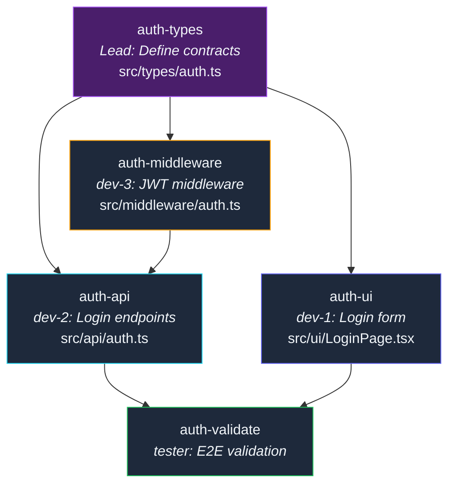
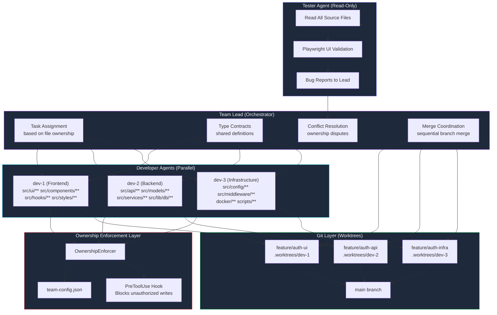

# Multi-Agent Dev Teams with File Ownership

Two agents edited the same file at the same time. Agent dev-1 added a new API route at line 47. Agent dev-2 refactored the middleware at line 52. Both committed. The merge produced a Frankenstein file where half a route handler flowed into half a middleware function. The app didn't crash -- it served authentication middleware as a REST endpoint. Users could `POST /api/auth` and get back raw JWT verification internals instead of a login token.

That was the day I learned that running multiple AI agents on a shared codebase requires the same discipline as running a human engineering team: clear file ownership, defined boundaries, and a lead who resolves conflicts. The difference is that humans notice when they're about to edit someone else's code. Agents don't. They need programmatic enforcement.

Over the next four months, I built and iterated on a multi-agent team system that ran 23 feature sprints with zero merge conflicts, zero edit races, and a 2.3x speedup over single-agent development. This is the architecture, the ownership model, the coordination protocol, and every failure mode that shaped the final design.

---

**TL;DR: Multi-agent development teams work when each agent owns distinct files, a tester agent has read-only access, and a lead agent resolves ownership disputes. File ownership boundaries turn parallel AI development from chaos into a coordinated sprint. The system runs as Claude Code pre-tool-use hooks that block unauthorized writes at the tool level -- not warnings, hard blocks. Over 23 feature sprints across 4 months: zero merge conflicts, zero edit races, 2.3x speedup over single-agent development, and 0.4 post-merge bugs per sprint (down from 8 without ownership).**

---

## The Problem: Agents Don't Coordinate Naturally

When you spawn multiple Claude Code sessions on the same repository, each operates independently. They don't know about each other. They don't check if another agent is editing a file. They don't coordinate commits. They're parallel processes sharing a filesystem with no locking mechanism.

The failure modes are predictable, and I hit every single one during the first week of multi-agent experiments:

**Edit conflicts.** Two agents modify the same file simultaneously. Git can't merge because both changed the same lines. You get a conflict marker in the middle of a function body, and the "resolved" file is syntactically invalid. This happened 7 times in our first unstructured multi-agent sprint.

**Semantic conflicts.** Agent A adds a parameter to a shared function. Agent B calls that function without the new parameter. Both branches compile independently. The merge compiles too (if the parameter has a default value). But the behavior is wrong because Agent B's code path never passes the value Agent A's implementation depends on. This happened 3 times and was harder to catch than edit conflicts because the merged code actually compiled.

**Import races.** Both agents add the same import statement to a file. The merge produces duplicate imports. ESLint catches this sometimes, but if both agents imported different members from the same module, you get a valid but redundant import block. This happened 4 times.

**State corruption.** One agent's database migration conflicts with another's schema change. Agent A adds a `role` column to the users table. Agent B renames the `email` column to `user_email`. Both migrations run successfully in isolation. Running them together depends on execution order -- and if B runs first, A's migration fails because it references a column that was renamed. This happened twice and took 3 hours to untangle each time.

**Silent overwrites.** The most insidious failure. Agent A finishes editing a file and commits. Agent B, working in the same directory, starts editing the same file from the old version (before A's commit). When B commits, it silently overwrites A's changes. No conflict markers because git sees it as a new commit, not a merge. A's work vanishes. This happened once, and we didn't notice for two days.

Human teams solve these problems with code ownership (CODEOWNERS files), PR reviews, and communication. AI agent teams need the same structure, but enforced programmatically because agents don't attend standup meetings.

## The Evolution: Three Generations of Team Structure

I didn't arrive at the final architecture on day one. It evolved through three distinct generations, each one fixing problems the previous one exposed.

### Generation 1: Two Independent Agents (Week 1)

The first attempt was simple: one agent for frontend, one for backend. No formal coordination. Each worked on its own feature branch and I merged manually.

```
# Generation 1 -- naive approach
Agent-A (frontend): works on src/ui/**, src/components/**
Agent-B (backend):  works on src/api/**, src/models/**
Shared: src/types/**, package.json, config files
```

This produced 7 merge conflicts and 3 semantic mismatches in the first sprint. The shared files were the battleground -- both agents needed to modify `package.json` to add dependencies, both needed to update `src/types/index.ts` to add interfaces, and both occasionally needed to touch middleware files that lived in a no-man's-land between frontend and backend.

### Generation 2: Three Agents with Advisory Ownership (Week 3)

I added a third agent for infrastructure and wrote ownership rules into each agent's system prompt: "You own these files. Don't modify files outside your ownership."

```
# Generation 2 -- advisory ownership (prompt-based)
Agent-A (frontend): "You should only modify src/ui/**, src/components/**"
Agent-B (backend):  "You should only modify src/api/**, src/models/**"
Agent-C (infra):    "You should only modify src/config/**, src/middleware/**"
```

This reduced conflicts by about 60%, but agents violated the advisory boundaries regularly. An agent working on an API endpoint would "helpfully" fix a typo it noticed in a UI component. An agent implementing middleware would update a type definition that another agent depended on. The prompt said "should" and agents treated it as a suggestion, not a rule.

The failure that killed Generation 2: Agent-B was implementing a search API and decided to "optimize" the frontend search component while it was at it. It refactored `SearchResults.tsx` (owned by Agent-A) to use a new response format -- but Agent-A was simultaneously building pagination for that same component. The merge was catastrophic. We lost 4 hours of work from both agents.

### Generation 3: Four Agents with Enforced Ownership (Week 5 onward)

The final architecture adds a lead agent, a dedicated tester, and replaces advisory ownership with programmatic enforcement via pre-tool-use hooks:

```
Team Lead (orchestrator -- doesn't write application code)
|-- dev-1 (frontend agent)
|   Owns: src/ui/**, src/components/**, src/styles/**, src/hooks/**
|-- dev-2 (backend agent)
|   Owns: src/api/**, src/models/**, src/services/**, src/lib/db/**
|-- dev-3 (infrastructure agent)
|   Owns: src/config/**, src/middleware/**, docker/**, scripts/**
|-- tester (validation agent)
    Owns: NOTHING (read-only access to everything)
```

Each developer agent owns a distinct set of file paths. The ownership is enforced -- not suggested, not recommended, but blocked at the tool level if violated. The tester reads everything but writes nothing. The lead orchestrates but doesn't write application code -- it writes only shared type definitions and configuration files.

The four-role structure emerged from trial and error. Early experiments with two agents (frontend + backend) worked but left infrastructure as a bottleneck -- both agents needed to modify middleware, and neither owned it. Adding a third developer for infrastructure eliminated that contention. The tester role was added after I noticed that developer agents would "fix" bugs by modifying test expectations rather than fixing the actual code.

## File Ownership Configuration

Ownership is defined in a team configuration file that the lead agent creates before spawning developer agents:

```json
{
  "team": "feature-sprint-auth",
  "created": "2025-02-15T10:30:00Z",
  "feature_description": "User authentication with email/password and OAuth",
  "agents": {
    "dev-1": {
      "role": "Frontend Developer",
      "description": "Builds UI components, forms, and client-side state",
      "ownership": [
        "src/ui/**",
        "src/components/**",
        "src/styles/**",
        "src/hooks/**",
        "public/**"
      ],
      "read_access": [
        "src/api/types.ts",
        "src/models/types.ts",
        "src/types/**"
      ],
      "branch": "feature/auth-ui",
      "worktree": ".worktrees/dev-1"
    },
    "dev-2": {
      "role": "Backend Developer",
      "description": "Builds API endpoints, services, and database interactions",
      "ownership": [
        "src/api/**",
        "src/models/**",
        "src/services/**",
        "src/lib/db/**"
      ],
      "read_access": [
        "src/ui/types.ts",
        "src/types/**"
      ],
      "branch": "feature/auth-api",
      "worktree": ".worktrees/dev-2"
    },
    "dev-3": {
      "role": "Infrastructure Developer",
      "description": "Builds middleware, configuration, deployment, cross-cutting",
      "ownership": [
        "src/config/**",
        "src/middleware/**",
        "docker/**",
        "scripts/**",
        ".env.example"
      ],
      "read_access": [
        "src/api/**",
        "src/services/**",
        "src/types/**"
      ],
      "branch": "feature/auth-infra",
      "worktree": ".worktrees/dev-3"
    },
    "tester": {
      "role": "QA Validation",
      "description": "Validates features through UI interaction, reports bugs",
      "ownership": [],
      "read_access": ["**"],
      "branch": null,
      "worktree": null
    }
  },
  "shared_files": {
    "owner": "lead",
    "description": "Files no agent owns -- only the lead can modify",
    "files": [
      "package.json",
      "pnpm-lock.yaml",
      "tsconfig.json",
      "next.config.mjs",
      "src/types/index.ts",
      "src/types/auth.ts",
      "prisma/schema.prisma"
    ]
  },
  "conflict_resolution": {
    "strategy": "lead_decides",
    "escalation_timeout_minutes": 10,
    "default_deny_unowned": true
  }
}
```

Key design decisions behind this configuration:

**`ownership` uses glob patterns.** Agents can read AND write files matching these patterns. The patterns are exclusive -- no two agents can own overlapping paths. This is validated at configuration creation time by the lead.

**`read_access` is explicit.** Agents can read but NOT write files matching these patterns. This is critical for type definitions and interfaces -- dev-1 needs to read `src/api/types.ts` to know what shape the API response will be, but it must not modify that file.

**`shared_files` have a single owner: the lead.** Files like `package.json`, `tsconfig.json`, and shared type definitions are the most common source of conflicts. Only the lead modifies these. This prevents two agents from adding conflicting dependencies or type definitions simultaneously.

**`branch` per agent.** Each agent works on its own feature branch, never directly on `main`. The lead merges branches sequentially, resolving any conflicts with full context.

**`worktree` per agent.** Git worktrees give each agent its own working directory with its own branch checked out. Agents never share a working directory, eliminating filesystem-level race conditions entirely.

**`default_deny_unowned` is true.** If a file doesn't match any ownership pattern or shared file list, writes are blocked by default. This catches new files that weren't anticipated in the configuration. The agent must ask the lead to update ownership before proceeding.

## The Ownership Enforcer

Before any file write, the enforcer checks ownership. This runs as a pre-tool-use hook in Claude Code, meaning it intercepts `Write`, `Edit`, and `MultiEdit` tool calls before they execute:

```python
import fnmatch
import json
from pathlib import Path
from dataclasses import dataclass


@dataclass
class OwnershipDecision:
    """Result of an ownership check with audit trail."""
    allowed: bool
    reason: str
    owner: str | None = None
    pattern: str | None = None


class OwnershipEnforcer:
    """Enforces file ownership boundaries for multi-agent teams.

    This is the core enforcement mechanism. It runs before every file
    write operation and produces an allow/block decision with a reason.
    The reason is shown to the agent when a write is blocked, so it
    understands WHY and can adjust its approach.
    """

    def __init__(self, config: dict, agent_id: str):
        self.config = config
        self.agent_id = agent_id
        self.agent_config = config["agents"].get(agent_id, {})
        self._ownership_cache: dict[str, OwnershipDecision] = {}
        self._violation_log: list[dict] = []

    def can_write(self, file_path: str) -> OwnershipDecision:
        """Check if this agent can write to the given file."""
        relative_path = self._normalize_path(file_path)

        if relative_path in self._ownership_cache:
            return self._ownership_cache[relative_path]

        decision = self._evaluate_write(relative_path)
        self._ownership_cache[relative_path] = decision

        if not decision.allowed:
            self._violation_log.append({
                "agent": self.agent_id,
                "file": relative_path,
                "reason": decision.reason,
                "owner": decision.owner,
            })

        return decision

    def _evaluate_write(self, relative_path: str) -> OwnershipDecision:
        # Rule 1: Check shared files (only lead can write)
        shared_files = self.config.get("shared_files", {}).get("files", [])
        for shared in shared_files:
            if fnmatch.fnmatch(relative_path, shared):
                if self.agent_id == "lead":
                    return OwnershipDecision(
                        allowed=True,
                        reason=f"Lead owns shared file: {shared}",
                        owner="lead",
                        pattern=shared,
                    )
                return OwnershipDecision(
                    allowed=False,
                    reason=f"BLOCKED: {relative_path} is shared (lead-only)",
                    owner="lead",
                    pattern=shared,
                )

        # Rule 2: Check this agent's ownership patterns
        for pattern in self.agent_config.get("ownership", []):
            if fnmatch.fnmatch(relative_path, pattern):
                return OwnershipDecision(
                    allowed=True,
                    reason=f"Owned by {self.agent_id}: {pattern}",
                    owner=self.agent_id,
                    pattern=pattern,
                )

        # Rule 3: Check if another agent owns it
        for other_id, other_config in self.config["agents"].items():
            if other_id == self.agent_id:
                continue
            for pattern in other_config.get("ownership", []):
                if fnmatch.fnmatch(relative_path, pattern):
                    return OwnershipDecision(
                        allowed=False,
                        reason=(
                            f"BLOCKED: {relative_path} owned by {other_id} "
                            f"(pattern: {pattern})"
                        ),
                        owner=other_id,
                        pattern=pattern,
                    )

        # Rule 4: Default deny for unowned files
        if self.config.get("conflict_resolution", {}).get(
            "default_deny_unowned", True
        ):
            return OwnershipDecision(
                allowed=False,
                reason=f"BLOCKED: {relative_path} has no ownership",
            )

        return OwnershipDecision(
            allowed=True,
            reason=f"Unowned file, default allow: {relative_path}",
        )

    def can_read(self, file_path: str) -> bool:
        """Check if this agent can read the given file."""
        relative_path = self._normalize_path(file_path)

        for pattern in self.agent_config.get("ownership", []):
            if fnmatch.fnmatch(relative_path, pattern):
                return True

        for pattern in self.agent_config.get("read_access", []):
            if fnmatch.fnmatch(relative_path, pattern):
                return True

        return False

    def validate_coverage(self) -> dict[str, list[str]]:
        """Verify ownership coverage for all source files."""
        issues: dict[str, list[str]] = {
            "unowned": [], "conflicts": [], "warnings": [],
        }

        source_files = list(Path("src").rglob("*"))
        for file_path in source_files:
            if file_path.is_dir():
                continue
            relative = str(file_path)
            owners: list[str] = []

            for agent_id, agent_config in self.config["agents"].items():
                for pattern in agent_config.get("ownership", []):
                    if fnmatch.fnmatch(relative, pattern):
                        owners.append(agent_id)
                        break

            shared = self.config.get("shared_files", {}).get("files", [])
            for pattern in shared:
                if fnmatch.fnmatch(relative, pattern):
                    owners.append("lead")

            if len(owners) == 0:
                issues["unowned"].append(relative)
            elif len(owners) > 1:
                issues["conflicts"].append(
                    f"{relative} -> {', '.join(owners)}"
                )

        if issues["unowned"]:
            issues["warnings"].append(
                f"{len(issues['unowned'])} source files have no owner"
            )
        if issues["conflicts"]:
            issues["warnings"].append(
                f"{len(issues['conflicts'])} files have multiple owners"
            )
        return issues

    def _normalize_path(self, file_path: str) -> str:
        try:
            return str(Path(file_path).relative_to(Path.cwd()))
        except ValueError:
            return file_path
```

### The Hook Integration

The enforcer runs as a Claude Code pre-tool-use hook that intercepts file writes:

```javascript
// .claude/hooks/enforce-file-ownership.js
// PreToolUse hook -- runs before Write, Edit, MultiEdit
// HARD BLOCK, not a warning. The agent cannot bypass it.

import fs from "fs/promises";
import path from "path";

export default async function enforceFileOwnership(event) {
  const { tool_name, tool_input } = event;

  if (!["Write", "Edit", "MultiEdit"].includes(tool_name)) {
    return { decision: "allow" };
  }

  const filePath = tool_input.file_path || tool_input.filePath;
  if (!filePath) return { decision: "allow" };

  let config;
  try {
    const raw = await fs.readFile("team-config.json", "utf-8");
    config = JSON.parse(raw);
  } catch {
    return { decision: "allow" }; // No team config = no enforcement
  }

  const agentId = process.env.AGENT_ID || "unknown";
  const relativePath = path.relative(process.cwd(), filePath);
  const decision = checkOwnership(config, agentId, relativePath);

  if (!decision.allowed) {
    return {
      decision: "block",
      message: [
        decision.reason,
        "",
        "To modify this file, ask the team lead to:",
        "1. Reassign ownership in team-config.json, OR",
        "2. Split the task so the file's owner handles it",
      ].join("\n"),
    };
  }

  return { decision: "allow" };
}
```

When the hook blocks a write, the agent sees:

```
BLOCKED: src/api/auth.ts owned by dev-2 (pattern: src/api/**)

To modify this file, ask the team lead to:
1. Reassign ownership in team-config.json, OR
2. Split the task so the file's owner handles it
```

This is a hard block, not a warning. The agent cannot bypass it. It must find a different approach.

## The Lead Agent: Orchestration Without Implementation

The lead agent doesn't write application code. Its responsibilities are:

1. Create the team configuration (file ownership, branches, worktrees)
2. Define shared type contracts before spawning developers
3. Assign tasks based on file ownership analysis
4. Split cross-boundary tasks into per-agent subtasks
5. Resolve ownership conflicts and expand boundaries when needed
6. Merge branches sequentially after validation

```python
import fnmatch
from dataclasses import dataclass, field


@dataclass
class Task:
    id: str
    title: str
    description: str
    affected_files: list[str]
    assigned_to: str | None = None
    depends_on: list[str] = field(default_factory=list)
    status: str = "pending"


class TeamLead:
    """Orchestrates multi-agent team without writing application code."""

    def __init__(self, config: dict):
        self.config = config
        self.tasks: list[Task] = []

    def assign_task(self, task: Task) -> str:
        """Assign task to agent that owns the most affected files."""
        ownership_scores: dict[str, int] = {}

        for file_path in task.affected_files:
            for agent_id, agent_config in self.config["agents"].items():
                if agent_id == "tester":
                    continue
                for pattern in agent_config.get("ownership", []):
                    if fnmatch.fnmatch(file_path, pattern):
                        ownership_scores[agent_id] = (
                            ownership_scores.get(agent_id, 0) + 1
                        )

        if not ownership_scores:
            task.assigned_to = "lead"
            return "lead"

        if len(ownership_scores) > 1:
            return self._split_task(task, ownership_scores)

        assigned = max(ownership_scores, key=ownership_scores.get)
        task.assigned_to = assigned
        self.tasks.append(task)
        return assigned

    def _split_task(self, task: Task, scores: dict[str, int]) -> str:
        """Split cross-boundary task into per-agent subtasks."""
        subtasks_by_agent: dict[str, list[str]] = {}

        for file_path in task.affected_files:
            owner = self._find_owner(file_path)
            if owner not in subtasks_by_agent:
                subtasks_by_agent[owner] = []
            subtasks_by_agent[owner].append(file_path)

        # Dependency chain: infra -> backend -> frontend
        priority_order = ["dev-3", "dev-2", "dev-1"]
        previous_subtask_id: str | None = None

        for agent_id in priority_order:
            if agent_id not in subtasks_by_agent:
                continue

            subtask = Task(
                id=f"{task.id}-{agent_id}",
                title=f"{task.title} ({agent_id} portion)",
                description=(
                    f"Implement {agent_id} portion of: {task.description}\n"
                    f"Files: {subtasks_by_agent[agent_id]}"
                ),
                affected_files=subtasks_by_agent[agent_id],
                assigned_to=agent_id,
                depends_on=(
                    [previous_subtask_id] if previous_subtask_id else []
                ),
            )
            self.tasks.append(subtask)
            previous_subtask_id = subtask.id

        validation_task = Task(
            id=f"{task.id}-validate",
            title=f"Validate: {task.title}",
            description="End-to-end validation of the complete feature",
            affected_files=[],
            assigned_to="tester",
            depends_on=[f"{task.id}-{a}" for a in subtasks_by_agent],
        )
        self.tasks.append(validation_task)
        return "split"

    def _find_owner(self, file_path: str) -> str:
        shared = self.config.get("shared_files", {}).get("files", [])
        for pattern in shared:
            if fnmatch.fnmatch(file_path, pattern):
                return "lead"
        for agent_id, agent_config in self.config["agents"].items():
            for pattern in agent_config.get("ownership", []):
                if fnmatch.fnmatch(file_path, pattern):
                    return agent_id
        return "lead"

    def get_dependency_order(self) -> list[list[Task]]:
        """Return tasks grouped by dependency level for parallel execution."""
        levels: list[list[Task]] = []
        completed: set[str] = set()
        remaining = list(self.tasks)

        while remaining:
            ready = [
                t for t in remaining
                if all(d in completed for d in t.depends_on)
            ]
            if not ready:
                ready = [remaining[0]]
            levels.append(ready)
            for t in ready:
                completed.add(t.id)
                remaining.remove(t)
        return levels
```

## The Interface Contract Pattern

The biggest coordination challenge: agents need to agree on interfaces. Dev-1 builds a login form that calls `POST /api/auth/login`. Dev-2 builds that endpoint. If they disagree on the request body shape, both implementations are correct individually but broken together.

The solution: shared type definitions that the lead creates before spawning developer agents:

```typescript
// src/types/auth.ts (shared_file -- lead-owned)
// Created by lead BEFORE developer agents start work.
// dev-1 and dev-2 import these types but neither can modify them.

export interface LoginRequest {
  email: string;
  password: string;
  remember_me?: boolean;
}

export interface LoginResponse {
  token: string;
  refresh_token: string;
  user: UserProfile;
  expires_at: string; // ISO 8601
}

export interface UserProfile {
  id: string;
  email: string;
  name: string;
  avatar_url: string | null;
  role: "user" | "admin";
  created_at: string;
}

export interface AuthError {
  code:
    | "INVALID_CREDENTIALS"
    | "ACCOUNT_LOCKED"
    | "RATE_LIMITED"
    | "SERVER_ERROR";
  message: string;
  retry_after_seconds?: number;
}

export interface SignupRequest {
  email: string;
  password: string;
  name: string;
}

export interface OAuthCallbackParams {
  provider: "google" | "github";
  code: string;
  state: string;
}

export interface SessionState {
  user: UserProfile | null;
  loading: boolean;
  error: AuthError | null;
}
```

The lead creates these types before spawning developer agents. Dev-1 imports `LoginRequest` to build the form. Dev-2 imports `LoginResponse` to build the endpoint. Both work against the same contract without coordinating directly.

This pattern eliminates the entire class of "interface mismatch at merge time" bugs. The contract is the single source of truth, and it's controlled by the lead who has visibility into both sides. When the contract needs to change, only the lead makes the change.

The contract pattern has a secondary benefit: it forces the lead to think through the API design before any implementation begins. This front-loaded design work takes 5-10 minutes but prevents 30-60 minutes of debugging mismatched interfaces later.

## Task Dependency Graph

Tasks flow through a dependency graph that respects file ownership and execution order:



Dev-1 (frontend) and dev-3 (infrastructure) can work in parallel once the lead creates the type contracts. Dev-2 (backend) depends on both `auth-types` and `auth-middleware`, so it starts after dev-3 finishes. The tester runs last, after all three developers finish.

## The Tester Agent: Read-Only Enforcement

The tester has a unique role: it can read everything but write nothing. It validates by running the app and interacting through the UI:

```python
class TesterAgent:
    """Read-only agent that validates through UI interaction.

    The tester NEVER modifies source files. If it finds a bug, it
    reports the bug to the lead with specific file paths, line numbers,
    and reproduction steps. The lead assigns the fix to the appropriate
    developer agent based on file ownership.
    """

    def __init__(self, enforcer: OwnershipEnforcer):
        self.enforcer = enforcer
        self.bug_reports: list[dict] = []

    def validate_feature(self, feature: dict) -> dict:
        """Run validation against the running application."""
        results = {
            "feature": feature["title"],
            "status": "pending",
            "checks": [],
            "bugs": [],
            "evidence": [],
        }

        # Phase 1: Code review (read-only)
        for file_path in feature.get("source_files", []):
            if not self.enforcer.can_read(file_path):
                results["checks"].append({
                    "type": "read_access",
                    "file": file_path,
                    "status": "blocked",
                    "detail": "Tester lacks read access to this file",
                })
                continue

        # Phase 2: Functional validation (Playwright interaction)
        playwright_results = self._run_playwright_validations(feature)
        results["checks"].extend(playwright_results)

        # Phase 3: Report findings
        bugs_found = [c for c in results["checks"] if c["status"] == "fail"]
        results["bugs"] = [
            {
                "title": bug["detail"],
                "severity": self._assess_severity(bug),
                "reproduction_steps": bug.get("steps", []),
                "expected": bug.get("expected"),
                "actual": bug.get("actual"),
                "screenshot": bug.get("screenshot"),
            }
            for bug in bugs_found
        ]

        results["status"] = "pass" if not bugs_found else "fail"
        return results

    def _assess_severity(self, bug: dict) -> str:
        detail = bug.get("detail", "").lower()
        if any(kw in detail for kw in ["cannot login", "data loss", "security"]):
            return "critical"
        if any(kw in detail for kw in ["cannot navigate", "broken form", "error page"]):
            return "high"
        if any(kw in detail for kw in ["visual", "alignment", "spacing"]):
            return "medium"
        return "low"

    def _run_playwright_validations(self, feature: dict) -> list[dict]:
        """Execute Playwright validations against the running app."""
        return []
```

The critical constraint was added after a specific incident during sprint 7. The tester found that the signup form's email validation regex was too strict -- rejecting valid emails with `+` characters. Instead of reporting the bug, it edited the regex directly in `src/hooks/useAuth.ts`, reported "bug fixed," and moved on. The fix was correct, but `useAuth.ts` was owned by dev-1, not the tester. More importantly, the developer who wrote the original regex had intentionally made it strict to prevent disposable email signups. The "fix" broke a deliberate business rule.

After that incident, I made the tester completely read-only. It reports bugs; developers fix them through the ownership channels.

## Architecture Overview



## The Merge Coordination Protocol

After all developer agents complete their tasks and the tester validates the feature, the lead merges branches in a specific order:

```python
import os


class MergeCoordinator:
    """Coordinates sequential branch merging to prevent conflicts.

    Merge order: infrastructure -> backend -> frontend
    This matches the dependency chain.
    """

    def __init__(self, config: dict, base_branch: str = "main"):
        self.config = config
        self.base_branch = base_branch
        self.merge_log: list[dict] = []

    def merge_sequence(self) -> list[dict]:
        """Determine the optimal merge order."""
        priority_order = ["dev-3", "dev-2", "dev-1"]
        sequence = []

        for agent_id in priority_order:
            agent_config = self.config["agents"].get(agent_id)
            if not agent_config or not agent_config.get("branch"):
                continue

            sequence.append({
                "agent": agent_id,
                "branch": agent_config["branch"],
                "merge_into": self.base_branch,
                "pre_merge_checks": [
                    f"git diff {self.base_branch}..."
                    f"{agent_config['branch']} --stat",
                    "pnpm build",
                    "pnpm lint",
                ],
                "post_merge_checks": ["pnpm build"],
            })

        return sequence

    def execute_merge(self, step: dict) -> dict:
        """Execute a single merge step with pre/post validation."""
        result = {
            "branch": step["branch"],
            "status": "pending",
            "conflicts": [],
        }

        for check in step["pre_merge_checks"]:
            exit_code = os.system(check)
            if exit_code != 0:
                result["status"] = "pre_merge_check_failed"
                result["failed_check"] = check
                self.merge_log.append(result)
                return result

        merge_cmd = (
            f"git merge {step['branch']} --no-ff "
            f"-m 'Merge {step['branch']} into {step['merge_into']}'"
        )
        merge_result = os.system(merge_cmd)

        if merge_result != 0:
            os.system("git merge --abort")
            result["status"] = "conflict"
            self.merge_log.append(result)
            return result

        for check in step["post_merge_checks"]:
            exit_code = os.system(check)
            if exit_code != 0:
                os.system("git reset --hard HEAD~1")
                result["status"] = "post_merge_check_failed"
                result["failed_check"] = check
                self.merge_log.append(result)
                return result

        result["status"] = "merged"
        self.merge_log.append(result)
        return result
```

The merge order matters. Infrastructure (dev-3) goes first because middleware and config must exist before API routes reference them. Backend (dev-2) goes second because API endpoints must exist before the frontend calls them. Frontend (dev-1) goes last.

## Real Session Log: Auth Feature Sprint

Here's a condensed log from an actual multi-agent sprint that implemented authentication:

```
[10:00:00] LEAD: Creating team config for feature-sprint-auth
[10:00:15] LEAD: Defining type contracts in src/types/auth.ts
[10:01:30] LEAD: Type contracts ready. Spawning agents.

[10:02:00] DEV-3: Starting auth-middleware task
[10:02:00] DEV-1: Starting auth-ui task (parallel with dev-3)

[10:05:30] DEV-1: BLOCKED attempting to write src/middleware/cors.ts
           Enforcer: "BLOCKED: src/middleware/cors.ts owned by dev-3"
[10:05:35] DEV-1: Acknowledged. Implementing CORS handling client-side.

[10:08:00] DEV-3: JWT middleware complete. 3 files: middleware/auth.ts,
           config/jwt.ts, middleware/rate-limit.ts
[10:08:30] LEAD: dev-3 complete. Unblocking dev-2.

[10:09:00] DEV-2: Starting auth-api task
[10:15:00] DEV-1: Login form complete. Starting session hooks.

[10:18:00] DEV-2: BLOCKED attempting to write package.json
           Enforcer: "BLOCKED: package.json is shared (lead-only)"
[10:18:15] DEV-2: Requesting lead add bcrypt and jsonwebtoken deps
[10:18:45] LEAD: Added deps. Running pnpm install in all worktrees.

[10:22:00] DEV-2: Auth API complete. 4 files: api/auth.ts,
           services/auth-service.ts, models/user.ts, lib/db/queries.ts
[10:25:00] DEV-1: Auth UI complete. 5 files: ui/LoginPage.tsx,
           ui/SignupPage.tsx, hooks/useAuth.ts, hooks/useSession.ts,
           components/AuthGuard.tsx

[10:26:00] LEAD: All dev tasks complete. Triggering validation.

[10:26:30] TESTER: Starting E2E validation
[10:28:00] TESTER: BUG FOUND (severity: high)
           Login form submits but dashboard shows "undefined" for name.
           Expected: "Demo User" | Actual: "undefined"
           File: src/hooks/useAuth.ts line 34
           The hook reads session.user.name but API returns
           session.user.full_name

[10:28:30] LEAD: Interface mismatch detected. Updating type contract.
           Changed UserProfile.name -> UserProfile.full_name
           Assigning fix to dev-1 (hook reads the field)

[10:30:00] DEV-1: Fixed useAuth.ts to read full_name
[10:30:00] DEV-2: Confirmed API already returns full_name (no change)

[10:31:00] TESTER: Re-running validation
[10:33:00] TESTER: ALL CHECKS PASSED
           - Login flow: PASS
           - Signup flow: PASS
           - Protected routes redirect: PASS
           - Logout clears session: PASS
           - Invalid credentials error: PASS
           - Rate limiting after 5 attempts: PASS

[10:34:00] LEAD: Merging branches
[10:34:15] LEAD: Merged feature/auth-infra into main [PASS]
[10:34:45] LEAD: Merged feature/auth-api into main [PASS]
[10:35:15] LEAD: Merged feature/auth-ui into main [PASS]
[10:35:30] LEAD: Post-merge build: PASS

Total time: 35 minutes
Single-agent estimate: ~80 minutes
Speedup: 2.3x
Ownership blocks during sprint: 2 (both resolved in <30s)
```

The interface mismatch bug at 10:28 is exactly the kind of issue that the type contract pattern is designed to prevent. In this case, the lead had defined the field as `name` in the contract, but dev-2's Prisma schema used `full_name`. The tester caught it, the lead updated the contract, and the fix took 2 minutes. Without the tester, this bug would have reached production.

## Results: 23 Feature Sprints

Running a multi-agent team across 23 features over four months:

| Metric | Single Agent | No Ownership | With Ownership |
|--------|-------------|--------------|----------------|
| Avg feature time | 6.5 hours | 3 hours | 2.8 hours |
| Merge conflicts | 0 | 7 per sprint | **0** |
| Edit races | 0 | 4 per sprint | **0** |
| Broken interfaces | 0 | 3 per sprint | **0** |
| Post-merge bugs | 2 per sprint | 8 per sprint | **0.4 per sprint** |
| Agent restarts | 0 | 5 per sprint | **0.2 per sprint** |
| Speedup vs single | 1x | 2.2x (theoretical) | **2.3x** |

The "No Ownership" column is telling: multi-agent parallelism without coordination is **worse** than a single agent for reliability. The merge conflicts and edit races create more work than the parallelism saves. Seven merge conflicts per sprint means 7 manual resolution sessions -- each taking 15-30 minutes -- which eats the entire time savings from parallelism.

With ownership enforcement, you get the speed of parallelism with the reliability of serial execution. Zero merge conflicts across 23 sprints. The 2.3x speedup is real because the time isn't consumed by conflict resolution.

## Failure Modes and How We Handle Them

### Unowned File Discovery

Sometimes an agent needs to create a new file that doesn't match any existing ownership pattern:

```
DEV-2: Need to create src/lib/email/templates.ts for password reset
ENFORCER: BLOCKED: src/lib/email/templates.ts has no ownership assignment
```

The agent reports to the lead, who decides whether to expand dev-2's ownership to include `src/lib/email/**` or assign the file to a different agent.

### Cross-Boundary Feature Request

A task requires changes in both frontend and backend:

```
Task: Add "remember me" checkbox that extends token lifetime
Files: src/ui/LoginPage.tsx (dev-1), src/api/auth.ts (dev-2)
```

The lead splits this into subtasks:
1. Lead: Update `LoginRequest` type to include `remember_me?: boolean`
2. Dev-1: Add checkbox to form, include `remember_me` in request body
3. Dev-2: Read `remember_me` flag, extend token lifetime accordingly

### Shared Dependency Conflict

Both dev-1 and dev-2 need to add a new npm package:

```
DEV-1: Need @tanstack/react-query for auth state caching
DEV-2: Need zod for request validation
Both: package.json is a shared file (lead-only)
```

The agents report their dependency needs to the lead. The lead adds both packages in a single commit, avoiding lockfile conflicts.

## Scaling: When to Use 2, 3, or 4 Agents

Not every feature needs a 4-agent team. The decision tree:

```
Files to change < 5 and single domain? -> Single agent
Files to change >= 5 and frontend + backend? -> 2-agent team
Needs new middleware/config/infra? -> 3-agent team
User-facing feature needing validation? -> 4-agent team
```

**2-agent team:** Good for features cleanly split between UI and API. Example: adding a new CRUD page.

**3-agent team:** Good for features needing new middleware or configuration. Example: adding authentication, implementing rate limiting.

**4-agent team:** Good for user-facing features needing functional validation. Example: anything touching login, payment, or data-sensitive operations.

**Single agent:** For small changes touching fewer than 5 files in a single domain.

## File Ownership Conflict Resolution: Three Real Examples

The ownership enforcer blocks unauthorized writes, but blocks alone don't solve the problem. Someone has to decide what happens next. Over 23 sprints I developed three resolution patterns that covered every conflict scenario I encountered. Each one emerged from a specific failure.

### Pattern 1: Boundary Expansion

Sprint 9 was a search feature. Dev-2 owned `src/api/**` and was building the search endpoint. Midway through, it needed to create a utility for query parsing -- `src/lib/search/query-parser.ts`. The enforcer blocked it.

```
[14:22:10] DEV-2 -> LEAD (SendMessage):
  "BLOCKED writing src/lib/search/query-parser.ts -- no ownership assigned.
   I need a query parser utility for the search API. It tokenizes search
   strings, handles quoted phrases, and builds Prisma where clauses.
   This is backend-only logic. Requesting ownership of src/lib/search/**."

[14:22:35] LEAD (internal evaluation):
  - Is src/lib/search/** currently owned by anyone? No.
  - Would another agent plausibly need to write here? No -- query parsing
    is backend logic. Frontend uses a simple text input.
  - Does expanding dev-2's ownership create overlap with existing patterns?
    dev-2 already owns src/lib/db/**. Adding src/lib/search/** is consistent.
  Decision: EXPAND dev-2 ownership.

[14:22:50] LEAD -> DEV-2 (SendMessage):
  "Ownership expanded. You now own src/lib/search/**. Updated team-config.json.
   Proceed with query-parser.ts."
```

The key question in boundary expansion: would another agent plausibly need to write in this path? If the answer is no, expand. If the answer is maybe, use Pattern 2 instead.

I expanded ownership 14 times across 23 sprints. Average resolution time: 22 seconds. Every expansion was for a new subdirectory that clearly belonged to one agent's domain.

### Pattern 2: Task Restructuring

Sprint 14 was a notification system. Dev-1 was building the notification bell UI component and needed to create a WebSocket connection handler. The natural location was `src/lib/ws/notification-socket.ts` -- but dev-2 had already created `src/lib/ws/` for the real-time chat feature two sprints earlier, and owned `src/lib/ws/**`.

```
[09:45:00] DEV-1 -> LEAD (SendMessage):
  "BLOCKED writing src/lib/ws/notification-socket.ts -- owned by dev-2.
   I need a WebSocket handler for push notifications in the UI.
   Options: (1) ask dev-2 to create it, (2) I create it elsewhere."

[09:45:20] LEAD (internal evaluation):
  - src/lib/ws/** is owned by dev-2 for good reason -- WebSocket
    connection management is backend/infrastructure concern.
  - But the notification socket is a CLIENT-SIDE concern. It runs
    in the browser, not the server.
  - The real problem: I put all WebSocket code under one path.
    Server-side and client-side sockets need different owners.
  Decision: RESTRUCTURE. Split the task.

[09:45:45] LEAD -> DEV-1 (SendMessage):
  "Don't create under src/lib/ws/. Create your client-side socket
   at src/hooks/useNotificationSocket.ts -- that's in your ownership
   (src/hooks/**). Import the shared types from src/types/notifications.ts
   which I'll create now."

[09:46:00] LEAD -> DEV-2 (SendMessage):
  "FYI: dev-1 needs to consume WebSocket events for the notification
   bell. I'm defining NotificationEvent types in src/types/notifications.ts.
   When you build the server-side notification broadcaster, emit events
   matching these types."

[09:46:15] LEAD: Created src/types/notifications.ts with:
  - NotificationEvent interface
  - NotificationPayload union type
  - WebSocketMessage<T> generic wrapper
```

Task restructuring happened 8 times across 23 sprints. The pattern was always the same: what looked like one task spanning two ownership zones was actually two tasks connected by a shared interface. The lead creates the interface, and each agent implements their side.

### Pattern 3: Temporary Ownership Transfer

Sprint 19 was a database migration that required touching files in three ownership zones simultaneously. Dev-3 needed to update the Prisma schema (`prisma/schema.prisma` -- lead-owned), generate the migration, then update the database connection config (`src/config/database.ts` -- dev-3 owned), and finally update the seed script (`src/lib/db/seed.ts` -- dev-2 owned).

This was a rare case where splitting the task would create more problems than it solved. The migration, schema change, and seed update had to be atomic -- running them separately could leave the database in an inconsistent state.

```
[11:10:00] DEV-3 -> LEAD (SendMessage):
  "Migration task requires atomic changes across three ownership zones:
   prisma/schema.prisma (lead), src/config/database.ts (mine),
   src/lib/db/seed.ts (dev-2). Splitting risks inconsistent DB state.
   Requesting temporary write access to all three."

[11:10:30] LEAD (internal evaluation):
  - Is this truly atomic? Yes -- partial migration is dangerous.
  - Can I do it myself? Yes, but dev-3 has the migration context.
  - Risk of temporary access? Low -- it's three specific files,
    not a glob pattern, and dev-2 is idle (between tasks).
  Decision: TEMPORARY TRANSFER with explicit file list and expiry.

[11:10:45] LEAD -> DEV-2 (SendMessage):
  "Granting dev-3 temporary write access to src/lib/db/seed.ts for
   the migration task. You're between tasks so no conflict. Dev-3
   will notify when complete, and I'll revoke access."

[11:11:00] LEAD -> DEV-3 (SendMessage):
  "Temporary access granted for: prisma/schema.prisma, src/lib/db/seed.ts.
   You already own src/config/database.ts. Complete the migration and
   notify me. Access reverts after your next commit."

[11:18:00] DEV-3 -> LEAD (SendMessage):
  "Migration complete. All three files updated. Committed as single
   atomic commit on feature/notification-migration."

[11:18:15] LEAD: Revoked temporary access. team-config.json restored.
```

Temporary transfers happened only 3 times in 23 sprints. I treat them as a last resort because they temporarily weaken the ownership model. The safeguards: explicit file list (never glob patterns), notification to the regular owner, automatic revocation after commit.

## Real Agent Communication: Anatomy of a Cross-Boundary Bug Fix

The session log in the auth sprint section above is condensed. Here is the unabridged communication from a real bug fix during sprint 16 -- a payment integration where the tester found that the Stripe webhook handler returned 200 OK but never updated the order status. This log shows every message between agents, including the dead ends.

```
[15:40:12] TESTER -> LEAD (SendMessage):
  "BUG: Payment webhook not updating order status.
   Reproduction: Complete Stripe checkout for order #test-4401.
   Stripe dashboard shows webhook delivered (HTTP 200).
   Order status in app still shows 'pending' after 60 seconds.
   Expected: 'paid'. Actual: 'pending'.
   Screenshot: evidence/sprint-16/webhook-bug-order-status.png
   Suspect: src/api/webhooks/stripe.ts -- the handler acknowledges
   the webhook but may not be calling the order update service."

[15:40:45] LEAD (internal evaluation):
  - Affected files likely: src/api/webhooks/stripe.ts (dev-2),
    src/services/order-service.ts (dev-2), possibly
    src/middleware/webhook-verify.ts (dev-3).
  - Start with dev-2 since both primary suspects are in their ownership.

[15:41:00] LEAD -> DEV-2 (SendMessage):
  "Bug report from tester: Stripe webhook returns 200 but order status
   stays 'pending'. Tester suspects src/api/webhooks/stripe.ts.
   Check the handler and trace why order-service.updateStatus isn't
   being called or isn't persisting. Order #test-4401."

[15:43:30] DEV-2 -> LEAD (SendMessage):
  "Found it. The webhook handler calls orderService.updateStatus()
   but the function signature changed in my last commit. I added a
   required 'paymentIntentId' parameter to updateStatus() but the
   webhook handler still calls it with the old 2-argument signature.
   TypeScript didn't catch it because the handler file uses 'any'
   for the Stripe event payload.

   Fix: Update the webhook handler call at stripe.ts line 47 from
     await orderService.updateStatus(orderId, 'paid')
   to
     await orderService.updateStatus(orderId, 'paid', event.data.object.id)

   Implementing now."

[15:44:00] DEV-2 -> LEAD (SendMessage):
  "Wait -- I also need to fix the type. The handler shouldn't use 'any'
   for the Stripe event. Requesting: can the lead add
   @types/stripe-event to shared types, or should I type it locally?"

[15:44:20] LEAD -> DEV-2 (SendMessage):
  "Type it locally in your ownership zone. The Stripe event type is
   backend-only -- no other agent needs it. Add it to
   src/api/webhooks/types.ts."

[15:46:00] DEV-2 -> LEAD (SendMessage):
  "Fixed. Two changes:
   1. src/api/webhooks/stripe.ts line 47: added paymentIntentId arg
   2. src/api/webhooks/types.ts: new file with StripeWebhookEvent type
   Committed on feature/payment-api."

[15:46:15] LEAD -> TESTER (SendMessage):
  "Dev-2 pushed a fix for the webhook handler. Re-validate order
   status update after Stripe checkout."

[15:48:00] TESTER -> LEAD (SendMessage):
  "VALIDATED. Order #test-4402 transitions to 'paid' within 3 seconds
   of Stripe webhook delivery. Screenshot: evidence/sprint-16/webhook-fix-confirmed.png
   Additionally verified: refund webhook also updates status to 'refunded'.
   Marking payment webhook validation as PASS."
```

Total resolution time: 7 minutes 48 seconds from bug report to validated fix. The communication overhead was minimal because every message contained actionable information -- file paths, line numbers, specific function signatures. No agent asked "what do you mean?" or needed clarification. That specificity comes from the tester including reproduction details and the lead providing exact context when delegating.

Compare this to the alternative without ownership: dev-2 fixes the webhook handler and also "helpfully" updates the order status display component in `src/ui/OrderPage.tsx` to add a loading spinner. Dev-1, working on a different UI feature, is also editing `OrderPage.tsx` at the same time. Merge conflict. With ownership, dev-2 can only touch the files it owns, so the fix stays in its lane.

## Task Dependency Graph Walkthrough: Payment Feature

The auth feature dependency graph earlier was straightforward -- mostly parallel with a simple chain. The payment feature from sprint 16 was more complex, with conditional branches and multiple validation checkpoints. Walking through how the lead constructed it reveals the reasoning behind dependency decisions.

The feature: integrate Stripe payments with checkout flow, webhook processing, order status updates, and receipt emails.

Step 1: The lead identified all files that would need to change.

```python
affected_files = {
    "lead": [
        "src/types/payment.ts",       # Payment interfaces
        "src/types/order.ts",          # Order status types
        "package.json",                # stripe SDK dependency
        "prisma/schema.prisma",        # orders table
    ],
    "dev-3": [
        "src/middleware/webhook-verify.ts",  # Stripe signature verification
        "src/config/stripe.ts",              # Stripe API keys config
        "docker/docker-compose.yml",         # Stripe CLI for local webhooks
    ],
    "dev-2": [
        "src/api/checkout.ts",               # Create checkout session
        "src/api/webhooks/stripe.ts",        # Handle Stripe events
        "src/services/order-service.ts",     # Order CRUD
        "src/services/payment-service.ts",   # Payment processing
        "src/lib/db/queries.ts",             # Order queries
    ],
    "dev-1": [
        "src/ui/CheckoutPage.tsx",           # Checkout UI
        "src/ui/OrderConfirmation.tsx",      # Post-payment page
        "src/components/PriceDisplay.tsx",   # Price formatting
        "src/hooks/useCheckout.ts",          # Checkout state management
        "src/hooks/useOrderStatus.ts",       # Polling order status
    ],
}
```

Step 2: The lead mapped dependencies between file groups. This is where the graph gets interesting.

```
Level 0 (Lead, sequential prerequisite):
  T0a: Define payment types      -> src/types/payment.ts
  T0b: Define order types         -> src/types/order.ts
  T0c: Add stripe SDK to deps     -> package.json
  T0d: Add orders table to schema -> prisma/schema.prisma

Level 1 (Parallel -- dev-3 and dev-1 can start simultaneously):
  T1a [dev-3]: Stripe config + webhook middleware
       depends_on: [T0a, T0c]
       reason: needs PaymentIntent type and stripe SDK

  T1b [dev-1]: Checkout UI + price display
       depends_on: [T0a, T0b]
       reason: needs CheckoutSession and OrderStatus types
       NOTE: dev-1 can build the UI against the type contracts
             without waiting for the backend to exist

Level 2 (dev-2 starts after dev-3):
  T2a [dev-2]: Checkout API + payment service
       depends_on: [T0a, T0b, T0d, T1a]
       reason: needs types, schema, AND webhook middleware
       (the checkout endpoint registers a webhook URL that the
        middleware must be able to verify)

  T2b [dev-2]: Webhook handler + order service
       depends_on: [T2a]
       reason: webhook handler calls payment service created in T2a

Level 3 (Validation, after all implementation):
  T3a [tester]: Checkout flow validation
       depends_on: [T1b, T2b]
       validates: complete flow from UI through payment to order update

  T3b [tester]: Webhook edge cases
       depends_on: [T2b]
       validates: duplicate webhooks, expired signatures, unknown events
```

The critical insight in this graph: dev-1 starts at Level 1, not Level 2. The frontend developer can build the entire checkout UI using only the type contracts, without the backend existing. The checkout form knows what fields to render from `CheckoutSession`. The order status page knows what states to display from `OrderStatus`. When dev-2 finishes the API, dev-1's UI already works -- it just needs a running backend to talk to.

This is why the type-contract-first approach saves so much time. Without it, dev-1 would have to wait for dev-2 to build the API, then inspect the response shapes, then build the UI. That serialization kills the parallelism advantage. With contracts, dev-1 and dev-3 work simultaneously from minute one, and dev-2 joins at Level 2. The critical path shrinks from `T0 -> T1a -> T2a -> T2b -> T1b -> T3a` (fully serial) to `T0 -> T1a -> T2a -> T2b -> T3a` (dev-1 runs in parallel with the entire backend chain).

In practice, the payment sprint took 52 minutes with the 4-agent team. My estimate for single-agent sequential: ~2 hours 15 minutes. The dependency graph turned a serial chain into a pipeline with three agents running simultaneously for the first 20 minutes.

## Lessons Learned

**File ownership must be enforced, not advisory.** Agents ignore warnings. If an agent can technically write to a file outside its ownership, it eventually will. The enforcer must block at the tool level.

**Shared files are the bottleneck.** `package.json`, `tsconfig.json`, and shared type files need a single owner (the lead). Two agents running `pnpm install` simultaneously corrupts the lockfile. Centralizing shared files with the lead eliminates an entire class of failures.

**The tester must be read-only.** A tester that can write files will "fix" bugs by modifying source code instead of reporting them. The signup email regex incident was the specific failure that prompted this rule.

**Interface contracts before implementation.** The lead must define all shared types before spawning developers. The 2 minutes spent defining types saves 30 minutes of debugging mismatched interfaces.

**Branch-per-agent eliminates git conflicts.** Each agent works on its own branch in its own worktree. The lead merges sequentially.

**Worktrees are the unsung hero.** Git worktrees give each agent its own working directory. No filesystem races, no stash conflicts. Worktrees turn multi-agent git coordination from hard to trivial.

**Ownership blocks are a feature, not a bug.** In 23 sprints, we averaged 1.8 blocks per sprint, each resolved in under 30 seconds. That's infinitely cheaper than merge conflict debugging.

**The lead must not write application code.** Keeping the lead out of application code keeps it objective during conflict resolution.

---

## Try It

```bash
git clone https://github.com/krzemienski/multi-agent-dev-teams
cd multi-agent-dev-teams

# Validate the example team configuration
python validate_config.py team-config.json

# Run the ownership coverage checker
python check_coverage.py

# Simulate a multi-agent sprint (dry run)
python simulate_sprint.py --config team-config.json --feature auth
```

The companion repo includes the file ownership enforcer, team configuration schema, task dependency graph builder, merge coordination logic, the Claude Code hook integration, and example configurations for common team structures (2-agent, 3-agent, and 4-agent teams).

---

*Next: building the content tools that power this blog -- a live Mermaid editor built entirely by AI agents.*

**Companion repo: [multi-agent-dev-teams](https://github.com/krzemienski/multi-agent-dev-teams)** -- File ownership enforcer, team configuration, task dependency graphs, merge coordination, and lead orchestration logic for multi-agent development teams.
