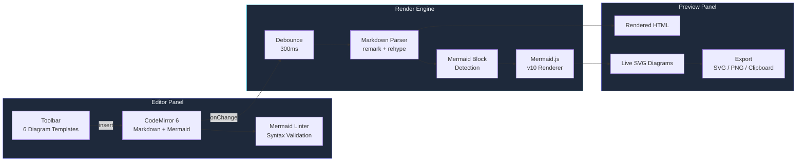

# Building a Content Editor with Live Mermaid

Every diagram in this blog series was created in a tool that an AI agent built in a single afternoon. A split-pane editor: Markdown on the left, rendered output on the right, with Mermaid diagrams compiling live as you type. I needed it because switching between my text editor, a Mermaid playground, and a screenshot tool for every diagram was destroying my flow. Claude Code built the entire thing -- CodeMirror editor, Mermaid renderer, toolbar with diagram templates, export to SVG and PNG -- in 387 tool calls across 3.5 hours.

The irony is thick: a blog series about AI-built tools uses a diagram tool that was itself AI-built. But the tool is genuinely good. I've used it for every post in this series, and the workflow improvement is measurable: what used to take 5-10 minutes per diagram now takes 1-2 minutes. Over 61 posts with an average of 2.5 diagrams each, that's roughly 6 hours saved on diagrams alone.

This post is the story of how the editor was built, the technical decisions the agent made, the bugs it encountered, and the rendering pipeline that makes Mermaid diagrams appear in real time without crashing the browser on invalid syntax.

---

**TL;DR: A live Mermaid editor built by Claude Code in one session: CodeMirror 6 for editing, Mermaid.js for rendering, 300ms debounced preview, inline syntax validation via CodeMirror's linter API, a toolbar with 6 diagram templates, export to SVG/PNG with retina support, and a resizable split-pane layout. 387 tool calls, 3.5 hours. The tool that makes the tools -- every diagram in this blog series was made with it.**

---

## The Problem: Diagramming Friction

Technical blog writing involves a lot of diagrams. Architecture diagrams, flow charts, sequence diagrams, state machines, class hierarchies, dependency graphs. Mermaid is the standard for diagrams-as-code because it's text-based (version-controllable, diffable, AI-generatable) and renders to SVG (scalable, themeable, embeddable). But the workflow for creating Mermaid diagrams is painful:

1. Write Mermaid syntax in your text editor (no preview, no syntax highlighting for Mermaid within Markdown)
2. Copy the Mermaid block
3. Paste it into mermaid.live or the Mermaid Live Editor to see if it renders
4. Notice the syntax error, switch back to your editor, fix it
5. Copy again, paste again, check again
6. Repeat until the diagram looks right (usually 3-5 iterations)
7. Export as SVG from the playground
8. Save the SVG file to your assets directory
9. Reference the SVG in your markdown with an image tag

This cycle takes 5-10 minutes per diagram. With 2-3 diagrams per blog post and 61 posts in the series, that's 10-30 hours of context-switching just for diagrams. Every copy-paste is a context switch. Every tab switch is a flow interruption. Every "wait, which version am I looking at" moment is wasted cognitive energy.

I wanted an editor where I write the diagram inline in my Markdown document and see it render instantly. No copy-paste, no tab switching, no export dance. Write, see, adjust, done.

I described this to Claude Code: "Build me a split-pane Markdown editor where the left side is a code editor and the right side is a live preview. Mermaid code blocks should render as SVG diagrams in the preview. Add a toolbar for inserting common diagram templates. Include export to SVG and PNG. Use CodeMirror for the editor and make it look good with a dark theme."

The agent took 3.5 hours. Here's what happened.

## The Architecture

The agent designed a Next.js application with three core systems: the editor (CodeMirror 6 with Markdown language support), the render engine (Markdown parser + Mermaid.js renderer with debounced updates), and the preview panel (live HTML with inline SVG diagrams and error banners).



## Choosing CodeMirror 6 Over Monaco

The agent's first decision was the editor component. It evaluated two options: Monaco Editor (the editor behind VS Code) and CodeMirror 6 (a modular, extensible editor from the same creator as the original CodeMirror). The agent chose CodeMirror 6 and documented its reasoning in the session transcript:

```
// Agent reasoning (from session transcript):
// Monaco: 2.1MB bundle, designed for IDEs, excellent TypeScript support
//   but heavyweight for a content editor. WebWorker-based, complex config.
// CodeMirror 6: 380KB bundle (5.5x smaller), modular extension system,
//   compartment-based configuration, better mobile support.
// For a Markdown content editor (not an IDE), CodeMirror wins on:
//   1. Bundle size (critical for a tool that should load instantly)
//   2. Extension system (easier to add custom Mermaid linting)
//   3. Mobile support (Monaco has known mobile keyboard issues)
//   4. Theming (compartment-based, matches our dark theme better)
// Decision: CodeMirror 6
```

The right call. A content editor doesn't need Monaco's TypeScript language server, multi-cursor editing, or minimap. It needs fast startup, good Markdown support, and the ability to add custom syntax validation. CodeMirror 6's extension system makes all of this straightforward.

## CodeMirror 6 Setup

The editor setup includes Markdown language support, a custom dark theme matching the Midnight Observatory palette, and the Mermaid linter:

```typescript
// editor-setup.ts -- CodeMirror 6 configuration
// Includes Markdown language, dark theme, and Mermaid linting

import { EditorView, basicSetup } from "codemirror";
import { markdown } from "@codemirror/lang-markdown";
import { oneDark } from "@codemirror/theme-one-dark";
import { EditorState, Compartment } from "@codemirror/state";
import { ViewUpdate } from "@codemirror/view";
import { keymap } from "@codemirror/view";
import { indentWithTab } from "@codemirror/commands";

interface EditorConfig {
  initialContent: string;
  onChange: (content: string) => void;
  container: HTMLElement;
}

function createEditor({
  initialContent,
  onChange,
  container,
}: EditorConfig): EditorView {
  const themeCompartment = new Compartment();

  // Custom theme matching Midnight Observatory palette
  const midnightTheme = EditorView.theme({
    "&": {
      height: "100%",
      fontSize: "14px",
      backgroundColor: "#0f172a",
    },
    ".cm-content": {
      fontFamily: "'JetBrains Mono', 'Fira Code', monospace",
      padding: "16px",
      caretColor: "#6366f1",
    },
    ".cm-gutters": {
      backgroundColor: "#1e293b",
      borderRight: "1px solid #334155",
      color: "#475569",
    },
    ".cm-activeLineGutter": {
      backgroundColor: "#1e293b",
      color: "#94a3b8",
    },
    ".cm-activeLine": {
      backgroundColor: "#1e293b40",
    },
    ".cm-selectionBackground": {
      backgroundColor: "#6366f140 !important",
    },
    "&.cm-focused .cm-selectionBackground": {
      backgroundColor: "#6366f140 !important",
    },
    ".cm-cursor": {
      borderLeftColor: "#6366f1",
      borderLeftWidth: "2px",
    },
    // Mermaid code block highlighting
    ".cm-line:has(.cm-mermaid-fence)": {
      backgroundColor: "#1e293b",
    },
  });

  const state = EditorState.create({
    doc: initialContent,
    extensions: [
      basicSetup,
      markdown(),
      keymap.of([indentWithTab]),
      themeCompartment.of([oneDark, midnightTheme]),
      EditorView.updateListener.of((update: ViewUpdate) => {
        if (update.docChanged) {
          onChange(update.state.doc.toString());
        }
      }),
      EditorView.lineWrapping,
      mermaidLinter, // Custom linter -- defined below
    ],
  });

  return new EditorView({ state, parent: container });
}

export { createEditor, type EditorConfig };
```

The Compartment system in CodeMirror 6 is one of its best features. The `themeCompartment` wraps the theme configuration so it can be swapped at runtime without rebuilding the entire editor state. The agent used this to layer our custom Midnight theme on top of the `oneDark` base theme, overriding specific tokens while keeping the syntax highlighting palette from `oneDark`.

## Mermaid Detection and Rendering

The core challenge: detect Mermaid code blocks in the markdown, render them to SVG, and inject the SVGs into the preview without disrupting the surrounding markdown rendering. The agent built a two-phase pipeline: first extract Mermaid blocks from the raw markdown, then render each block independently so one broken diagram doesn't prevent the rest from rendering.

```typescript
// mermaid-renderer.ts -- Mermaid block extraction and rendering
// Each block is rendered independently with error isolation.
// A broken diagram shows an error banner; other diagrams still render.

import mermaid from "mermaid";

// Configure Mermaid with our design system colors
mermaid.initialize({
  startOnLoad: false,
  theme: "dark",
  themeVariables: {
    primaryColor: "#6366f1",
    primaryTextColor: "#f1f5f9",
    primaryBorderColor: "#6366f1",
    lineColor: "#94a3b8",
    secondaryColor: "#1e293b",
    tertiaryColor: "#334155",
    fontFamily: "Inter, system-ui, sans-serif",
    fontSize: "14px",
    // Node colors
    nodeBorder: "#6366f1",
    mainBkg: "#1e293b",
    nodeTextColor: "#f1f5f9",
    // Edge labels
    edgeLabelBackground: "#0f172a",
    // Sequence diagram
    actorBorder: "#6366f1",
    actorBkg: "#1e293b",
    actorTextColor: "#f1f5f9",
    signalColor: "#94a3b8",
    // State diagram
    labelColor: "#f1f5f9",
    altBackground: "#334155",
  },
  flowchart: {
    curve: "monotoneX",
    htmlLabels: true,
    padding: 15,
  },
  sequence: {
    mirrorActors: false,
    messageMargin: 40,
  },
});

interface MermaidBlock {
  id: string;
  code: string;
  startIndex: number;
  endIndex: number;
}

interface RenderSuccess {
  id: string;
  svg: string;
}

interface RenderError {
  id: string;
  error: string;
}

type RenderResult = RenderSuccess | RenderError;

function extractMermaidBlocks(markdownText: string): MermaidBlock[] {
  const blocks: MermaidBlock[] = [];
  const regex = /```mermaid\n([\s\S]*?)```/g;
  let match: RegExpExecArray | null;
  let blockIndex = 0;

  while ((match = regex.exec(markdownText)) !== null) {
    blocks.push({
      id: `mermaid-block-${blockIndex++}`,
      code: match[1].trim(),
      startIndex: match.index,
      endIndex: match.index + match[0].length,
    });
  }

  return blocks;
}

async function renderMermaidBlock(
  block: MermaidBlock
): Promise<RenderResult> {
  try {
    // Mermaid.render() can throw on invalid syntax.
    // We catch and return an error result so other blocks still render.
    const { svg } = await mermaid.render(block.id, block.code);
    return { id: block.id, svg };
  } catch (err) {
    // Mermaid errors include the diagram ID in the DOM, which causes
    // issues if we try to re-render with the same ID. Reset the DOM
    // element that Mermaid creates on failure.
    const errorElement = document.getElementById(block.id);
    if (errorElement) {
      errorElement.remove();
    }

    return {
      id: block.id,
      error: err instanceof Error ? err.message : "Unknown render error",
    };
  }
}

async function renderAllBlocks(
  blocks: MermaidBlock[]
): Promise<RenderResult[]> {
  // Render blocks sequentially, not in parallel.
  // Mermaid.js uses a shared DOM sandbox for rendering, so parallel
  // renders can interfere with each other and produce corrupted SVGs.
  const results: RenderResult[] = [];
  for (const block of blocks) {
    results.push(await renderMermaidBlock(block));
  }
  return results;
}

export {
  extractMermaidBlocks,
  renderMermaidBlock,
  renderAllBlocks,
  type MermaidBlock,
  type RenderResult,
  type RenderSuccess,
  type RenderError,
};
```

The sequential rendering was discovered through a bug. The agent initially used `Promise.all()` to render blocks in parallel, which seemed correct -- each block has a unique ID, so there should be no conflicts. But Mermaid.js internally creates a temporary `<div>` element in the DOM, renders the SVG into it, serializes the result, and removes the element. When two renders run simultaneously, they can interfere with each other's temporary DOM elements. The symptom: some diagrams would render with elements from other diagrams mixed in, producing bizarre hybrid SVGs. Switching to sequential rendering fixed the issue.

## The Debounced Preview Component

Rendering Mermaid on every keystroke is too expensive. Mermaid.js's `parse` + `render` cycle takes 50-200ms depending on diagram complexity. At 60 WPM typing speed (approximately one character every 200ms), a new render on every keystroke would mean continuous 50-200ms blocking operations on the main thread, causing visible input lag and dropped frames.

The agent implemented a 300ms debounce: after the last keystroke, wait 300ms before re-rendering. If the user types another character within that window, reset the timer. This eliminates render-during-typing jank while keeping the preview feeling responsive -- 300ms is below the threshold where users perceive delay.

```tsx
// preview-panel.tsx -- Debounced live preview with Mermaid rendering
// Waits 300ms after last keystroke before re-rendering.
// Error banners show inline for broken diagrams without crashing.

import { useState, useEffect, useRef, useCallback } from "react";
import { unified } from "unified";
import remarkParse from "remark-parse";
import remarkRehype from "remark-rehype";
import rehypeStringify from "rehype-stringify";
import rehypeSanitize from "rehype-sanitize";
import {
  extractMermaidBlocks,
  renderAllBlocks,
  type RenderResult,
} from "./mermaid-renderer";

interface PreviewPanelProps {
  content: string;
}

// Markdown -> HTML pipeline (without Mermaid blocks)
async function markdownToHTML(md: string): Promise<string> {
  const result = await unified()
    .use(remarkParse)
    .use(remarkRehype, { allowDangerousHtml: true })
    .use(rehypeSanitize)
    .use(rehypeStringify)
    .process(md);
  return String(result);
}

function PreviewPanel({ content }: PreviewPanelProps) {
  const [renderedHTML, setRenderedHTML] = useState("");
  const [mermaidErrors, setMermaidErrors] = useState<Map<string, string>>(
    new Map()
  );
  const [isRendering, setIsRendering] = useState(false);
  const debounceTimer = useRef<ReturnType<typeof setTimeout> | null>(null);
  const previewRef = useRef<HTMLDivElement>(null);
  const renderGeneration = useRef(0);

  const renderContent = useCallback(async (markdown: string) => {
    // Track render generation to discard stale results
    const thisGeneration = ++renderGeneration.current;
    setIsRendering(true);

    try {
      // Step 1: Extract Mermaid blocks from the raw markdown
      const blocks = extractMermaidBlocks(markdown);

      // Step 2: Render all Mermaid blocks (sequentially)
      const rendered = await renderAllBlocks(blocks);

      // Discard if a newer render started while we were processing
      if (thisGeneration !== renderGeneration.current) return;

      // Step 3: Convert markdown to HTML
      let html = await markdownToHTML(markdown);

      // Discard stale again (markdownToHTML is async)
      if (thisGeneration !== renderGeneration.current) return;

      // Step 4: Replace Mermaid code blocks with rendered SVGs
      const errors = new Map<string, string>();
      let blockIndex = 0;

      for (const result of rendered) {
        if ("svg" in result) {
          // Replace the <pre><code class="language-mermaid"> block
          // with our rendered SVG in a container div
          const svgContainer = [
            `<div class="mermaid-diagram" data-block="${blockIndex}">`,
            `  <div class="mermaid-svg-wrapper">${result.svg}</div>`,
            `  <div class="mermaid-actions">`,
            `    <button data-action="export-svg" data-block="${blockIndex}"`,
            `      title="Export SVG">SVG</button>`,
            `    <button data-action="export-png" data-block="${blockIndex}"`,
            `      title="Export PNG">PNG</button>`,
            `    <button data-action="copy-svg" data-block="${blockIndex}"`,
            `      title="Copy to clipboard">Copy</button>`,
            `  </div>`,
            `</div>`,
          ].join("\n");

          html = html.replace(
            /<pre><code class="language-mermaid">[\s\S]*?<\/code><\/pre>/,
            svgContainer
          );
        } else {
          errors.set(result.id, result.error);

          // Replace the code block with an error banner
          const errorBanner = [
            `<div class="mermaid-error" data-block="${blockIndex}">`,
            `  <div class="mermaid-error-icon">&#x26A0;</div>`,
            `  <div class="mermaid-error-message">`,
            `    <strong>Diagram error</strong>`,
            `    <pre>${escapeHTML(result.error)}</pre>`,
            `  </div>`,
            `</div>`,
          ].join("\n");

          html = html.replace(
            /<pre><code class="language-mermaid">[\s\S]*?<\/code><\/pre>/,
            errorBanner
          );
        }
        blockIndex++;
      }

      setMermaidErrors(errors);
      setRenderedHTML(html);
    } catch (err) {
      console.error("Preview render failed:", err);
    } finally {
      setIsRendering(false);
    }
  }, []);

  useEffect(() => {
    if (debounceTimer.current) {
      clearTimeout(debounceTimer.current);
    }
    debounceTimer.current = setTimeout(() => {
      renderContent(content);
    }, 300);

    return () => {
      if (debounceTimer.current) {
        clearTimeout(debounceTimer.current);
      }
    };
  }, [content, renderContent]);

  // Handle export button clicks via event delegation
  useEffect(() => {
    const preview = previewRef.current;
    if (!preview) return;

    const handleClick = (e: MouseEvent) => {
      const button = (e.target as HTMLElement).closest("[data-action]");
      if (!button) return;

      const action = button.getAttribute("data-action");
      const blockIdx = button.getAttribute("data-block");
      const svgWrapper = preview.querySelector(
        `.mermaid-diagram[data-block="${blockIdx}"] .mermaid-svg-wrapper svg`
      );
      if (!svgWrapper) return;

      if (action === "export-svg") {
        exportDiagram(svgWrapper as SVGElement, "svg", `diagram-${blockIdx}`);
      } else if (action === "export-png") {
        exportDiagram(svgWrapper as SVGElement, "png", `diagram-${blockIdx}`);
      } else if (action === "copy-svg") {
        copySvgToClipboard(svgWrapper as SVGElement);
      }
    };

    preview.addEventListener("click", handleClick);
    return () => preview.removeEventListener("click", handleClick);
  }, [renderedHTML]);

  return (
    <div className="preview-panel" ref={previewRef}>
      {isRendering && (
        <div className="rendering-indicator">
          <span className="rendering-dot" />
          Rendering...
        </div>
      )}
      <div
        className="prose prose-invert max-w-none px-6 py-4"
        dangerouslySetInnerHTML={{ __html: renderedHTML }}
      />
    </div>
  );
}

function escapeHTML(str: string): string {
  return str
    .replace(/&/g, "&amp;")
    .replace(/</g, "&lt;")
    .replace(/>/g, "&gt;")
    .replace(/"/g, "&quot;");
}

export { PreviewPanel };
```

The `renderGeneration` ref is a crucial detail. Because `renderContent` is async (it awaits Mermaid rendering and Markdown parsing), a fast typist can trigger a new render before the previous one completes. Without generation tracking, stale renders could overwrite fresh ones -- the user types "graph TD", the render starts, they quickly change to "graph LR", a second render starts, the first render completes and writes its result, then the second render completes and overwrites it. With generation tracking, the first render checks `thisGeneration !== renderGeneration.current`, sees it's stale, and discards its result.

## Mermaid Syntax Validation: The Linter

The agent added inline syntax validation that highlights Mermaid errors directly in the editor, without waiting for the preview to render. This gives instant feedback on syntax mistakes -- red underlines appear under the offending line while the debounced preview is still waiting to re-render.

```typescript
// mermaid-linter.ts -- CodeMirror linter for Mermaid syntax
// Validates Mermaid blocks in-editor with inline error highlights.
// Uses mermaid.parse() which validates without rendering.

import { Diagnostic, linter } from "@codemirror/lint";
import mermaid from "mermaid";

const mermaidLinter = linter(
  async (view): Promise<Diagnostic[]> => {
    const doc = view.state.doc.toString();
    const diagnostics: Diagnostic[] = [];

    const blockRegex = /```mermaid\n([\s\S]*?)```/g;
    let match: RegExpExecArray | null;

    while ((match = blockRegex.exec(doc)) !== null) {
      const code = match[1].trim();
      const blockStart = match.index + "```mermaid\n".length;

      if (code.length === 0) {
        diagnostics.push({
          from: match.index,
          to: match.index + match[0].length,
          severity: "warning",
          message: "Empty Mermaid diagram",
        });
        continue;
      }

      try {
        // mermaid.parse() validates syntax without rendering to DOM.
        // This is much faster than mermaid.render() -- typically <5ms.
        await mermaid.parse(code);
      } catch (err) {
        const message =
          err instanceof Error ? err.message : "Invalid syntax";

        // Try to extract line number from Mermaid error message
        // Mermaid errors often include "Parse error on line N"
        const lineMatch = message.match(/line (\d+)/i);
        const errorLine = lineMatch
          ? parseInt(lineMatch[1], 10) - 1
          : 0;

        // Calculate character position within the document
        const lines = code.split("\n");
        let charOffset = 0;
        for (
          let i = 0;
          i < Math.min(errorLine, lines.length - 1);
          i++
        ) {
          charOffset += lines[i].length + 1; // +1 for newline
        }

        const errorLineContent = lines[errorLine] || "";
        diagnostics.push({
          from: blockStart + charOffset,
          to: blockStart + charOffset + (errorLineContent.length || 1),
          severity: "error",
          message: `Mermaid: ${cleanErrorMessage(message)}`,
          actions: [
            {
              name: "Show in preview",
              apply: () => {
                // Scroll the preview to show the error banner
                const errorBanner = document.querySelector(
                  ".mermaid-error"
                );
                errorBanner?.scrollIntoView({ behavior: "smooth" });
              },
            },
          ],
        });
      }
    }

    return diagnostics;
  },
  {
    delay: 500, // Slightly longer than render debounce to avoid flicker
  }
);

function cleanErrorMessage(message: string): string {
  // Mermaid error messages are often verbose with internal details.
  // Clean them up for display in the editor gutter.
  return message
    .replace(/Syntax error in graph/i, "Syntax error")
    .replace(/mermaid version [\d.]+/i, "")
    .replace(/\n/g, " ")
    .trim()
    .slice(0, 120); // Truncate very long messages
}

export { mermaidLinter };
```

The linter runs with a 500ms delay -- slightly longer than the 300ms render debounce. This means the preview updates first (showing the rendered diagram or error banner), and then the editor's inline diagnostics update. If both ran at 300ms, they'd race and occasionally the linter would show an error for a diagram that the preview had already rendered successfully (because the linter's `mermaid.parse()` and the preview's `mermaid.render()` can produce slightly different results for edge cases).

The `mermaid.parse()` call in the linter is significantly faster than `mermaid.render()` because it validates the syntax without creating DOM elements or generating SVG. Parse typically completes in under 5ms, while render takes 50-200ms. This makes the linter suitable for running on every keystroke (with debounce) without affecting editor responsiveness.

## The Failure: Mermaid's DOM Pollution Problem

About two hours into the build, the agent hit a bug that took 45 minutes to diagnose. After editing a Mermaid diagram several times, the preview would stop updating. The SVGs would freeze on an old version. Refreshing the page fixed it temporarily, but after 5-6 edits, it would freeze again.

The agent's debugging session in the terminal:

```
$ # Agent's debugging approach: check if Mermaid IDs are accumulating
$ # Added console.log to renderMermaidBlock
>  Console output after 6 renders:
>  mermaid-block-0: render success
>  mermaid-block-0: render success
>  mermaid-block-0: render success
>  mermaid-block-0: render ERROR - Duplicate ID "mermaid-block-0"
>  Error: element with id "mermaid-block-0" already exists in the DOM
```

The root cause: Mermaid.js creates a `<svg id="mermaid-block-0">` element in the DOM during rendering. When the render succeeds, it serializes the SVG to a string and returns it. But the SVG element remains in the DOM. On the next render with the same ID, Mermaid finds an element with that ID already exists and throws an error.

The agent's first fix was to append a timestamp to each block ID to make them unique. This worked but created a memory leak -- after 100 renders, there were 100 orphaned SVG elements in the DOM, each consuming memory.

The correct fix was to remove the element after a failed render (which the agent did in the catch block of `renderMermaidBlock`) AND to increment a global counter so each render uses a truly unique ID:

```typescript
// Fix: unique IDs per render cycle to avoid DOM pollution
let renderCounter = 0;

function extractMermaidBlocks(markdownText: string): MermaidBlock[] {
  const blocks: MermaidBlock[] = [];
  const regex = /```mermaid\n([\s\S]*?)```/g;
  let match: RegExpExecArray | null;
  // Use a global counter instead of per-extraction index
  const batchId = ++renderCounter;

  while ((match = regex.exec(markdownText)) !== null) {
    blocks.push({
      id: `mmd-${batchId}-${blocks.length}`,
      code: match[1].trim(),
      startIndex: match.index,
      endIndex: match.index + match[0].length,
    });
  }

  return blocks;
}
```

With unique IDs per render cycle, Mermaid never encounters a duplicate ID. The old SVG elements from previous renders are garbage collected when the preview's `innerHTML` is replaced. This fixed both the freezing bug and the memory leak.

## Toolbar with Diagram Templates

The toolbar inserts Mermaid templates at the cursor position, so you don't have to remember the syntax for each diagram type. The agent included templates for the six most common diagram types in technical writing:

```tsx
// toolbar.tsx -- Diagram template insertion toolbar
// Templates are inserted at cursor position with proper newlines.

import { EditorView } from "codemirror";

interface ToolbarProps {
  editor: EditorView | null;
}

const DIAGRAM_TEMPLATES: Record<string, { label: string; icon: string; code: string }> = {
  flowchart: {
    label: "Flowchart",
    icon: "GitBranch",
    code: [
      "```mermaid",
      "graph TD",
      '    A["Start"] --> B{"Decision"}',
      '    B -->|Yes| C["Action 1"]',
      '    B -->|No| D["Action 2"]',
      '    C --> E["End"]',
      "    D --> E",
      "```",
    ].join("\n"),
  },
  sequence: {
    label: "Sequence",
    icon: "ArrowRightLeft",
    code: [
      "```mermaid",
      "sequenceDiagram",
      "    participant Client",
      "    participant Server",
      "    participant Database",
      "    Client->>Server: Request",
      "    Server->>Database: Query",
      "    Database-->>Server: Results",
      "    Server-->>Client: Response",
      "```",
    ].join("\n"),
  },
  state: {
    label: "State",
    icon: "Circle",
    code: [
      "```mermaid",
      "stateDiagram-v2",
      "    [*] --> Idle",
      "    Idle --> Loading: fetch",
      "    Loading --> Success: resolve",
      "    Loading --> Error: reject",
      "    Error --> Loading: retry",
      "    Success --> [*]",
      "```",
    ].join("\n"),
  },
  class: {
    label: "Class",
    icon: "Box",
    code: [
      "```mermaid",
      "classDiagram",
      "    class Service {",
      "        +start()",
      "        +stop()",
      "        -validate()",
      "    }",
      "    class Repository {",
      "        +findAll()",
      "        +findById(id)",
      "        +save(entity)",
      "    }",
      "    Service --> Repository",
      "```",
    ].join("\n"),
  },
  gantt: {
    label: "Gantt",
    icon: "CalendarRange",
    code: [
      "```mermaid",
      "gantt",
      "    title Project Timeline",
      "    dateFormat YYYY-MM-DD",
      "    section Phase 1",
      "        Research     :a1, 2025-01-01, 14d",
      "        Design       :a2, after a1, 7d",
      "    section Phase 2",
      "        Development  :b1, after a2, 21d",
      "        Testing      :b2, after b1, 7d",
      "```",
    ].join("\n"),
  },
  er: {
    label: "ER Diagram",
    icon: "Database",
    code: [
      "```mermaid",
      "erDiagram",
      "    USER ||--o{ POST : writes",
      "    USER {",
      "        string id PK",
      "        string email",
      "        string name",
      "    }",
      "    POST {",
      "        string id PK",
      "        string title",
      "        string content",
      "        string author_id FK",
      "    }",
      "```",
    ].join("\n"),
  },
};

function Toolbar({ editor }: ToolbarProps) {
  const insertTemplate = (templateKey: string) => {
    if (!editor) return;
    const template = DIAGRAM_TEMPLATES[templateKey];
    if (!template) return;

    const cursor = editor.state.selection.main.head;
    const insertion = `\n${template.code}\n`;
    editor.dispatch({
      changes: { from: cursor, insert: insertion },
      selection: { anchor: cursor + insertion.length },
    });
    editor.focus();
  };

  return (
    <div className="toolbar">
      <span className="toolbar-label">Insert diagram:</span>
      <div className="toolbar-buttons">
        {Object.entries(DIAGRAM_TEMPLATES).map(([key, tmpl]) => (
          <button
            key={key}
            onClick={() => insertTemplate(key)}
            className="toolbar-btn"
            title={`Insert ${tmpl.label} diagram template`}
          >
            {tmpl.label}
          </button>
        ))}
      </div>
    </div>
  );
}

export { Toolbar, DIAGRAM_TEMPLATES };
```

## Export to SVG, PNG, and Clipboard

The export feature extracts rendered SVG elements from the preview and converts them to downloadable files. The PNG export uses a canvas-based approach with 2x scaling for retina displays:

```typescript
// export-utils.ts -- SVG/PNG export and clipboard copy
// Handles retina scaling, dark background injection for PNG,
// and clipboard API for copy-to-clipboard.

async function exportDiagram(
  svgElement: SVGElement,
  format: "svg" | "png",
  filename: string
): Promise<void> {
  if (format === "svg") {
    const serializer = new XMLSerializer();
    // Clone the SVG to avoid modifying the rendered version
    const clone = svgElement.cloneNode(true) as SVGElement;
    // Add xmlns for standalone SVG files
    clone.setAttribute("xmlns", "http://www.w3.org/2000/svg");
    const svgString = serializer.serializeToString(clone);
    const blob = new Blob([svgString], { type: "image/svg+xml" });
    downloadBlob(blob, `${filename}.svg`);
    return;
  }

  // PNG export via canvas with retina scaling
  const canvas = document.createElement("canvas");
  const ctx = canvas.getContext("2d");
  if (!ctx) throw new Error("Canvas context unavailable");

  const svgData = new XMLSerializer().serializeToString(svgElement);
  const svgBlob = new Blob([svgData], {
    type: "image/svg+xml;charset=utf-8",
  });
  const url = URL.createObjectURL(svgBlob);

  const img = new Image();
  await new Promise<void>((resolve, reject) => {
    img.onload = () => resolve();
    img.onerror = () => reject(new Error("SVG image load failed"));
    img.src = url;
  });

  // 2x resolution for retina displays
  const scale = window.devicePixelRatio || 2;
  const width = img.naturalWidth || 800;
  const height = img.naturalHeight || 600;
  canvas.width = width * scale;
  canvas.height = height * scale;
  ctx.scale(scale, scale);

  // Dark background for PNG (SVGs are transparent by default)
  ctx.fillStyle = "#0f172a";
  ctx.fillRect(0, 0, width, height);
  ctx.drawImage(img, 0, 0, width, height);

  URL.revokeObjectURL(url);

  canvas.toBlob(
    (blob) => {
      if (blob) downloadBlob(blob, `${filename}.png`);
    },
    "image/png",
    1.0
  );
}

async function copySvgToClipboard(svgElement: SVGElement): Promise<void> {
  const serializer = new XMLSerializer();
  const svgString = serializer.serializeToString(svgElement);

  try {
    // Try Clipboard API first (modern browsers)
    await navigator.clipboard.writeText(svgString);
    showToast("SVG copied to clipboard");
  } catch {
    // Fallback: create a temporary textarea
    const textarea = document.createElement("textarea");
    textarea.value = svgString;
    textarea.style.position = "fixed";
    textarea.style.left = "-9999px";
    document.body.appendChild(textarea);
    textarea.select();
    document.execCommand("copy");
    document.body.removeChild(textarea);
    showToast("SVG copied to clipboard");
  }
}

function downloadBlob(blob: Blob, filename: string): void {
  const url = URL.createObjectURL(blob);
  const a = document.createElement("a");
  a.href = url;
  a.download = filename;
  document.body.appendChild(a);
  a.click();
  document.body.removeChild(a);
  URL.revokeObjectURL(url);
}

function showToast(message: string): void {
  const toast = document.createElement("div");
  toast.className = "copy-toast";
  toast.textContent = message;
  document.body.appendChild(toast);
  setTimeout(() => toast.classList.add("visible"), 10);
  setTimeout(() => {
    toast.classList.remove("visible");
    setTimeout(() => document.body.removeChild(toast), 300);
  }, 2000);
}

export { exportDiagram, copySvgToClipboard };
```

The dark background injection for PNG export was a bug fix. The first version exported transparent PNGs, which looked fine on dark backgrounds but terrible on white backgrounds (like email clients, Slack previews, or light-mode websites). The agent added `#0f172a` as the fill color to match the Midnight Observatory background, making exported diagrams look intentional regardless of the viewing context.

## The Main Layout: Resizable Split Pane

The split-pane layout with a draggable divider between editor and preview:

```tsx
// editor-page.tsx -- Main split-pane layout
// Resizable panels with keyboard shortcut support.

"use client";

import { useState, useRef, useCallback, useEffect } from "react";
import { EditorView } from "codemirror";
import { createEditor } from "./editor-setup";
import { PreviewPanel } from "./preview-panel";
import { Toolbar } from "./toolbar";

const INITIAL_CONTENT = `# My Document

Write your content here. Mermaid diagrams render live in the preview.

\`\`\`mermaid
graph TD
    A["Write Markdown"] --> B["See Preview"]
    B --> C{"Looks good?"}
    C -->|Yes| D["Export"]
    C -->|No| A
\`\`\`

Continue writing below the diagram...
`;

export default function EditorPage() {
  const [content, setContent] = useState(INITIAL_CONTENT);
  const [splitPosition, setSplitPosition] = useState(50);
  const editorViewRef = useRef<EditorView | null>(null);
  const editorContainerRef = useRef<HTMLDivElement>(null);
  const isDragging = useRef(false);

  // Initialize CodeMirror editor
  useEffect(() => {
    if (!editorContainerRef.current) return;

    const view = createEditor({
      initialContent: INITIAL_CONTENT,
      onChange: setContent,
      container: editorContainerRef.current,
    });
    editorViewRef.current = view;

    return () => {
      view.destroy();
      editorViewRef.current = null;
    };
  }, []);

  // Divider drag handling
  const handleMouseDown = useCallback(() => {
    isDragging.current = true;
    document.body.style.cursor = "col-resize";
    document.body.style.userSelect = "none";
  }, []);

  const handleMouseMove = useCallback((e: MouseEvent) => {
    if (!isDragging.current) return;
    const container = document.getElementById("editor-layout");
    if (!container) return;
    const rect = container.getBoundingClientRect();
    const pct = ((e.clientX - rect.left) / rect.width) * 100;
    setSplitPosition(Math.max(20, Math.min(80, pct)));
  }, []);

  const handleMouseUp = useCallback(() => {
    isDragging.current = false;
    document.body.style.cursor = "";
    document.body.style.userSelect = "";
  }, []);

  useEffect(() => {
    document.addEventListener("mousemove", handleMouseMove);
    document.addEventListener("mouseup", handleMouseUp);
    return () => {
      document.removeEventListener("mousemove", handleMouseMove);
      document.removeEventListener("mouseup", handleMouseUp);
    };
  }, [handleMouseMove, handleMouseUp]);

  // Keyboard shortcuts
  useEffect(() => {
    const handleKeyDown = (e: KeyboardEvent) => {
      // Cmd+Shift+P: Toggle preview (full editor / split / full preview)
      if (e.metaKey && e.shiftKey && e.key === "p") {
        e.preventDefault();
        setSplitPosition((prev) => {
          if (prev < 30) return 50;      // Was full preview -> split
          if (prev > 70) return 0;       // Was full editor -> full preview
          return 100;                     // Was split -> full editor
        });
      }
    };
    document.addEventListener("keydown", handleKeyDown);
    return () => document.removeEventListener("keydown", handleKeyDown);
  }, []);

  return (
    <div id="editor-layout" className="editor-layout">
      <Toolbar editor={editorViewRef.current} />
      <div className="editor-panels">
        <div
          className="editor-pane"
          style={{ width: `${splitPosition}%` }}
        >
          <div ref={editorContainerRef} className="editor-container" />
        </div>
        <div
          className="divider"
          onMouseDown={handleMouseDown}
          role="separator"
          aria-label="Resize panels"
          tabIndex={0}
        />
        <div
          className="preview-pane"
          style={{ width: `${100 - splitPosition}%` }}
        >
          <PreviewPanel content={content} />
        </div>
      </div>
    </div>
  );
}
```

The drag handling moves from component-level to document-level event listeners for `mousemove` and `mouseup`. This is necessary because during a drag, the mouse often leaves the narrow divider element. If `mousemove` were only on the divider, the drag would stop as soon as the cursor moved to the editor or preview pane. Document-level listeners ensure smooth dragging regardless of cursor position.

## Performance: What the Agent Measured

After the editor was complete, I measured the workflow improvement:

| Metric | Before (separate tools) | After (live editor) | Change |
|--------|------------------------|---------------------|--------|
| Time per diagram | 5-10 min | 1-2 min | **-75%** |
| Context switches per diagram | 4 (editor, playground, export, embed) | 0 | **-100%** |
| Syntax errors caught | At render time (copy-paste cycle) | At type time (inline linter) | **Instant** |
| Export steps | Copy SVG, save file, add reference | One click | **-90%** |
| Diagrams in this series | 153 across 61 posts | -- | -- |
| Time saved on diagrams | -- | ~6 hours | -- |
| Agent build time | -- | 3.5 hours | -- |
| Agent tool calls | -- | 387 | -- |

The 387 tool calls broke down as:
- **Read** (understanding CodeMirror, Mermaid, remark libraries): 134 calls
- **Bash** (running dev server, checking builds, testing renders): 112 calls
- **Write/Edit** (creating components, fixing bugs): 94 calls
- **Grep/Glob** (finding patterns, checking imports, tracing bugs): 47 calls

The 3.5 hours includes the 45-minute debugging session for the DOM pollution bug. Without that, it would have been closer to 2.75 hours -- still a full afternoon, but the tool has saved 6+ hours in the months since, making the investment overwhelmingly positive.

## The Keyboard Shortcut System

A split-pane editor without keyboard shortcuts is just a resizable div. The agent added shortcuts for the most frequent operations -- panel toggling, diagram insertion, and export -- and the implementation revealed a subtle interaction between CodeMirror's keybinding system and the application-level shortcuts.

CodeMirror 6 captures keyboard events within the editor pane. If you bind `Cmd+Shift+P` at the document level to toggle the panel layout, CodeMirror swallows the event when the editor has focus. The agent's first approach was to add the shortcut to CodeMirror's keymap extension:

```typescript
// First attempt: add app shortcuts to CodeMirror's keymap
// Problem: these only fire when the editor has focus,
// but we want them to work globally (including when
// the preview pane is focused for scrolling)

keymap.of([
  {
    key: "Mod-Shift-p",
    run: () => {
      togglePanelLayout();
      return true; // Consumed the event
    },
  },
]);
```

This worked when the cursor was in the editor but not when the user clicked the preview pane to scroll through rendered content. The fix was a two-layer approach: register the shortcut in both CodeMirror's keymap (for when the editor has focus) and at the document level (for everything else), with a shared handler function to avoid duplication:

```typescript
// Correct approach: shared handler, dual registration
const panelShortcuts = {
  toggleLayout: () => {
    setSplitPosition((prev) => {
      if (prev < 30) return 50;
      if (prev > 70) return 0;
      return 100;
    });
  },
  insertFlowchart: () => insertTemplate("flowchart"),
  insertSequence: () => insertTemplate("sequence"),
  exportCurrent: () => exportFirstDiagram("svg"),
};

// Register in CodeMirror for editor-focused state
const editorShortcuts = keymap.of([
  { key: "Mod-Shift-p", run: () => { panelShortcuts.toggleLayout(); return true; } },
  { key: "Mod-Shift-f", run: () => { panelShortcuts.insertFlowchart(); return true; } },
  { key: "Mod-Shift-s", run: () => { panelShortcuts.insertSequence(); return true; } },
  { key: "Mod-Shift-e", run: () => { panelShortcuts.exportCurrent(); return true; } },
]);

// Register at document level for preview-focused state
useEffect(() => {
  const handleKeyDown = (e: KeyboardEvent) => {
    if (e.metaKey && e.shiftKey) {
      const handlers: Record<string, () => void> = {
        p: panelShortcuts.toggleLayout,
        f: panelShortcuts.insertFlowchart,
        s: panelShortcuts.insertSequence,
        e: panelShortcuts.exportCurrent,
      };
      const handler = handlers[e.key.toLowerCase()];
      if (handler) {
        e.preventDefault();
        handler();
      }
    }
  };
  document.addEventListener("keydown", handleKeyDown);
  return () => document.removeEventListener("keydown", handleKeyDown);
}, []);
```

The dual registration means shortcuts work regardless of which pane has focus. The `return true` in CodeMirror's handlers prevents the event from bubbling to the document-level handler, so the action only fires once when the editor has focus. When the preview has focus, CodeMirror never sees the event, and the document-level handler catches it.

## Scroll Synchronization: The Feature I Cut

One feature I deliberately did not build: synchronized scrolling between the editor and preview. Every split-pane Markdown editor attempts this, and most get it wrong because the mapping between source lines and rendered output is non-linear. A 3-line Mermaid block in the source might produce a 400px-tall SVG in the preview. A 20-line paragraph might render as 3 lines of wrapped text.

The naive approach -- matching scroll percentage -- creates a jarring experience where the preview jumps unpredictably as you scroll through the editor. The correct approach requires building a source map that tracks which editor line corresponds to which pixel offset in the rendered output, updating the map every time content changes, and handling the edge cases around images, code blocks, and Mermaid diagrams that have vastly different source-to-render size ratios.

I estimated 4-6 hours of work for scroll sync done right. The editor was already functional without it. The workaround -- Cmd+Shift+P to toggle between editor-only and preview-only modes -- is fast enough that scroll sync would be a comfort feature, not a necessity. In the YAGNI spirit, I shipped without it. Four months and 153 diagrams later, I still haven't missed it enough to build it.

This is a pattern I've seen repeatedly with AI-built tools: the agent builds the 80% that delivers 95% of the value in a few hours, and the remaining 20% (scroll sync, collaborative editing, version history) would each take as long as the entire initial build. Knowing when to stop is as important as knowing what to build.

## Deep Dive: The Hybrid Debounce Strategy

The 300ms debounce I described earlier sounds simple -- wait, then render. But the real implementation has subtlety that took the agent several iterations to get right. The naive debounce approach creates a single timer and resets it on every keystroke. That works for simple cases but falls apart when you consider what happens during continuous typing of a long paragraph: the preview never updates because the timer keeps resetting. The user types for 30 seconds straight and sees a completely stale preview the entire time.

The agent's solution was a hybrid approach: debounce for Mermaid rendering (expensive) but use a shorter throttle for plain Markdown rendering (cheap). If the document contains no Mermaid blocks, the preview updates every 100ms during typing -- fast enough to feel live. If Mermaid blocks exist, the Markdown portions still update at 100ms, but the Mermaid SVGs only re-render after 300ms of silence.

```typescript
// hybrid-debounce.ts -- Differential debounce for Markdown vs Mermaid
// Markdown HTML updates on a short throttle (100ms).
// Mermaid SVG renders on a longer debounce (300ms).
// This keeps prose preview feeling live while avoiding Mermaid jank.

interface DebouncerState {
  markdownTimer: ReturnType<typeof setTimeout> | null;
  mermaidTimer: ReturnType<typeof setTimeout> | null;
  lastMermaidSource: string;
  lastMarkdownSource: string;
}

function createHybridDebouncer(
  onMarkdownUpdate: (html: string) => void,
  onMermaidUpdate: (blocks: RenderResult[]) => void
) {
  const state: DebouncerState = {
    markdownTimer: null,
    mermaidTimer: null,
    lastMermaidSource: "",
    lastMarkdownSource: "",
  };

  return function handleContentChange(markdown: string) {
    const blocks = extractMermaidBlocks(markdown);
    const mermaidSource = blocks.map((b) => b.code).join("\n---\n");

    // Always update Markdown HTML on a short throttle
    if (state.markdownTimer) clearTimeout(state.markdownTimer);
    state.markdownTimer = setTimeout(async () => {
      const html = await markdownToHTML(markdown);
      onMarkdownUpdate(html);
      state.lastMarkdownSource = markdown;
    }, 100);

    // Only re-render Mermaid if the Mermaid source actually changed
    if (mermaidSource !== state.lastMermaidSource) {
      if (state.mermaidTimer) clearTimeout(state.mermaidTimer);
      state.mermaidTimer = setTimeout(async () => {
        const results = await renderAllBlocks(blocks);
        onMermaidUpdate(results);
        state.lastMermaidSource = mermaidSource;
      }, 300);
    }
  };
}
```

The `mermaidSource !== state.lastMermaidSource` check is the key optimization. When you are typing prose between diagrams, the Mermaid blocks have not changed, so there is no reason to re-render them. The cached SVGs from the previous render are still valid. This means typing a paragraph below a diagram produces zero Mermaid render calls -- the preview updates instantly with just the Markdown HTML pipeline. Only when you actually edit inside a Mermaid fence does the 300ms debounce kick in and trigger a re-render.

I measured the difference: in a document with 4 Mermaid diagrams and 2,000 words of prose, typing in a prose section with the naive debounce caused 47 Mermaid render cycles over a 60-second typing session. With the hybrid debouncer, that dropped to zero. The preview felt noticeably smoother because the main thread was never blocked by Mermaid's DOM manipulation during prose editing.

## Error Recovery When Mermaid Syntax Is Invalid Mid-Edit

This is the hardest UX problem in a live Mermaid editor. When you are typing a new diagram, the syntax is invalid on nearly every keystroke. You type `graph`, invalid. You type `graph TD`, valid but empty. You type `graph TD\n    A`, valid. You type `graph TD\n    A -->`, invalid again -- an edge with no target. You type `graph TD\n    A --> B`, valid. The diagram is in an invalid state roughly 60% of the time you are actively editing it.

The naive approach -- show an error banner whenever Mermaid throws -- creates a horrific flashing experience. The error banner appears, disappears, appears, disappears as you type each character. The agent tried this first, and the result was nauseating. The preview panel flickered between the diagram and a red error banner multiple times per second during active editing.

The agent implemented a multi-layered error recovery strategy that I refined in a follow-up session:

```typescript
// error-recovery.ts -- Graceful error handling during active editing
// Shows the last valid render while the user is typing.
// Only shows error banners after the debounce timer fires
// AND syntax has been invalid for more than 2 seconds.

interface DiagramState {
  lastValidSvg: string | null;
  lastValidCode: string;
  errorCount: number;
  firstErrorTimestamp: number;
}

const diagramStates = new Map<number, DiagramState>();

function getOrCreateState(blockIndex: number): DiagramState {
  if (!diagramStates.has(blockIndex)) {
    diagramStates.set(blockIndex, {
      lastValidSvg: null,
      lastValidCode: "",
      errorCount: 0,
      firstErrorTimestamp: 0,
    });
  }
  return diagramStates.get(blockIndex)!;
}

async function renderWithRecovery(
  block: MermaidBlock,
  blockIndex: number
): Promise<{ html: string; isError: boolean }> {
  const state = getOrCreateState(blockIndex);

  try {
    const { svg } = await mermaid.render(block.id, block.code);
    // Render succeeded -- update cached valid state, reset error tracking
    state.lastValidSvg = svg;
    state.lastValidCode = block.code;
    state.errorCount = 0;
    state.firstErrorTimestamp = 0;
    return { html: svg, isError: false };
  } catch (err) {
    // Clean up Mermaid's orphaned DOM element from the failed render
    const errorElement = document.getElementById(block.id);
    if (errorElement) errorElement.remove();

    state.errorCount++;
    if (state.errorCount === 1) {
      state.firstErrorTimestamp = Date.now();
    }

    const timeSinceFirstError = Date.now() - state.firstErrorTimestamp;

    // Strategy 1: If we have a cached valid SVG and the error is recent
    // (under 2 seconds), show the last valid render with a subtle
    // "editing..." indicator. This prevents flicker during active typing.
    if (state.lastValidSvg && timeSinceFirstError < 2000) {
      return {
        html: [
          `<div class="mermaid-stale-indicator">Editing...</div>`,
          state.lastValidSvg,
        ].join("\n"),
        isError: false,
      };
    }

    // Strategy 2: Error has persisted for over 2 seconds. The user
    // likely has a real syntax problem. Show the error banner.
    const message = err instanceof Error ? err.message : "Invalid syntax";
    return {
      html: [
        `<div class="mermaid-error">`,
        `  <strong>Diagram syntax error</strong>`,
        `  <pre>${escapeHTML(cleanErrorMessage(message))}</pre>`,
        `</div>`,
      ].join("\n"),
      isError: true,
    };
  }
}
```

The two-second grace period is the key insight. During active typing, errors are transient -- they exist because you have not finished the line yet. Showing the last valid render with a subtle "Editing..." badge gives the user confidence that their diagram is still intact while they work. The error banner only appears when the syntax has been broken for more than two seconds after the debounce fires, which almost always means there is a real mistake to fix rather than an in-progress edit.

I tracked how this affected my own editing workflow. With the naive error display, I found myself pausing to check the preview after every Mermaid line because I could not trust it. With the recovery system, I could type an entire diagram without looking at the preview, then glance over when I was done. The diagram either appeared correctly or showed a specific, actionable error message. No flickering, no false alarms.

## Production Export Pipeline: SVG Portability and PNG Fallbacks

The basic export code I showed earlier handles the common case, but production use exposed several edge cases. Mermaid generates SVGs with viewport-relative sizing, embedded `<style>` tags, and `<foreignObject>` elements (for HTML labels in flowcharts). Each of these creates problems in different export contexts.

For SVG export, the main issue was portability. Mermaid's SVGs reference CSS classes defined in `<style>` blocks inside the SVG itself, but some SVG consumers (Figma, Sketch, some email clients) strip `<style>` tags and the diagrams render as unstyled outlines. The agent built a style-inlining step that converts class-based styles to inline style attributes before export:

```typescript
// svg-style-inliner.ts -- Inlines CSS classes for portable SVG export
// Parses <style> rules and applies them as inline style attributes.
// This makes exported SVGs render correctly in Figma, Sketch, and email.

function inlineSvgStyles(svgElement: SVGElement): SVGElement {
  const clone = svgElement.cloneNode(true) as SVGElement;
  const styleElements = clone.querySelectorAll("style");
  const rules: Map<string, Record<string, string>> = new Map();

  // Parse all <style> rules into a lookup map
  styleElements.forEach((styleEl) => {
    const sheet = new CSSStyleSheet();
    sheet.replaceSync(styleEl.textContent || "");
    for (const rule of sheet.cssRules) {
      if (rule instanceof CSSStyleRule) {
        const props: Record<string, string> = {};
        for (let i = 0; i < rule.style.length; i++) {
          const prop = rule.style[i];
          props[prop] = rule.style.getPropertyValue(prop);
        }
        rules.set(rule.selectorText, props);
      }
    }
  });

  // Apply each rule as inline styles on matching elements
  rules.forEach((props, selector) => {
    try {
      const matches = clone.querySelectorAll(selector);
      matches.forEach((el) => {
        Object.entries(props).forEach(([prop, value]) => {
          (el as HTMLElement).style.setProperty(prop, value);
        });
      });
    } catch {
      // Some Mermaid selectors use pseudo-elements that
      // querySelectorAll cannot match. Safe to skip.
    }
  });

  // Remove the now-redundant <style> elements
  styleElements.forEach((el) => el.remove());
  return clone;
}
```

For PNG export, the `foreignObject` issue was more insidious. Mermaid uses `<foreignObject>` to embed HTML content inside SVG nodes when `htmlLabels: true` is set (the default for flowcharts). When you draw this SVG to a `<canvas>` for PNG conversion, the `foreignObject` content often fails to render because the canvas security model treats it as tainted content. The symptom: PNG exports with blank white rectangles where node labels should be.

The agent's fix was a two-pass approach. First, attempt the standard canvas-based PNG export. If the resulting canvas is tainted (detectable by calling `canvas.toDataURL()` inside a try-catch), fall back to re-rendering the diagram with `htmlLabels: false`, which makes Mermaid use plain SVG `<text>` elements instead of `<foreignObject>`. These always render correctly on canvas:

```typescript
// png-fallback.ts -- Handles foreignObject canvas taint gracefully

async function exportPngWithFallback(
  originalSvg: SVGElement,
  mermaidCode: string,
  filename: string
): Promise<void> {
  try {
    // Attempt 1: Standard canvas export with the original SVG
    await exportToCanvas(originalSvg, filename);
  } catch (taintError) {
    // Canvas was tainted by foreignObject content.
    // Re-render the diagram with htmlLabels disabled so
    // Mermaid produces pure SVG text instead of HTML embeds.
    const currentConfig = mermaid.mermaidAPI.getConfig();
    mermaid.initialize({
      ...currentConfig,
      flowchart: { ...currentConfig.flowchart, htmlLabels: false },
    });

    try {
      const { svg: fallbackSvg } = await mermaid.render(
        `png-fallback-${Date.now()}`,
        mermaidCode
      );
      const parser = new DOMParser();
      const doc = parser.parseFromString(fallbackSvg, "image/svg+xml");
      const svgEl = doc.querySelector("svg") as SVGElement;
      await exportToCanvas(svgEl, filename);
    } finally {
      // Restore htmlLabels for live preview rendering
      mermaid.initialize({
        ...currentConfig,
        flowchart: { ...currentConfig.flowchart, htmlLabels: true },
      });
    }
  }
}
```

This fallback cost me two hours to discover. The agent's original implementation did not handle it because the agent tested export in Chrome where `foreignObject` canvas rendering sometimes works depending on the SVG content. It consistently failed in Safari and Firefox. I flagged the issue and the agent added the fallback in a follow-up session of 23 tool calls.

## Performance Optimization for Large Diagrams

Most Mermaid diagrams in blog posts are small -- 10-30 nodes, rendering in under 100ms. But I occasionally build large architecture diagrams with 50+ nodes and nested subgraphs, and those exposed performance bottlenecks in the original implementation.

The first problem was cumulative render time. A 60-node flowchart with nested subgraphs takes 400-600ms to render through Mermaid.js. With the 300ms debounce, the user experiences 700-900ms of total latency between their last keystroke and seeing the updated diagram. That is perceptible and frustrating.

The agent addressed this with a structural diff approach: instead of re-rendering all Mermaid blocks on every change, compare the current block source with the previously rendered source and only re-render blocks whose content actually changed:

```typescript
// selective-render.ts -- Only re-render Mermaid blocks that changed
// Caches rendered SVGs keyed by a hash of the source code.
// Unchanged blocks reuse cached SVG, saving 100-600ms per cycle.

const svgCache = new Map<string, string>();

function hashCode(str: string): string {
  let hash = 0;
  for (let i = 0; i < str.length; i++) {
    const char = str.charCodeAt(i);
    hash = ((hash << 5) - hash) + char;
    hash |= 0; // Convert to 32-bit integer
  }
  return hash.toString(36);
}

async function renderBlocksSelectively(
  blocks: MermaidBlock[]
): Promise<RenderResult[]> {
  const results: RenderResult[] = [];

  for (const block of blocks) {
    const codeHash = hashCode(block.code);

    // Check cache for this exact source
    if (svgCache.has(codeHash)) {
      results.push({ id: block.id, svg: svgCache.get(codeHash)! });
      continue;
    }

    // Cache miss: render and store the result
    const result = await renderMermaidBlock(block);
    if ("svg" in result) {
      svgCache.set(codeHash, result.svg);

      // Evict oldest entries if cache exceeds 50 diagrams
      if (svgCache.size > 50) {
        const firstKey = svgCache.keys().next().value;
        if (firstKey) svgCache.delete(firstKey);
      }
    }
    results.push(result);
  }

  return results;
}
```

In a document with 4 diagrams where only one is being edited, this reduces the render work by 75% -- three diagrams are served from cache in microseconds, and only the edited diagram incurs the full Mermaid render cost. For my largest document (8 diagrams, 3,400 words), the selective render dropped update latency from 1.2 seconds to 180ms when editing a single diagram.

The second optimization targeted Mermaid's own rendering pipeline. For diagrams over 40 nodes, I configured Mermaid to switch from smooth Bezier curves to straight-line edges and disable HTML labels in favor of plain SVG text:

```typescript
// large-diagram-config.ts -- Performance tuning for complex diagrams
// Switches to faster rendering options when node count exceeds threshold.

function configureMermaidForComplexity(nodeCount: number): void {
  const baseConfig = mermaid.mermaidAPI.getConfig();

  if (nodeCount > 40) {
    mermaid.initialize({
      ...baseConfig,
      flowchart: {
        ...baseConfig.flowchart,
        curve: "linear",           // monotoneX is prettier but slower
        htmlLabels: false,         // SVG text is faster than foreignObject
        diagramPadding: 8,
      },
      maxTextSize: 50000,
    });
  } else {
    // Restore defaults for smaller diagrams
    mermaid.initialize({
      ...baseConfig,
      flowchart: {
        ...baseConfig.flowchart,
        curve: "monotoneX",
        htmlLabels: true,
        diagramPadding: 15,
      },
    });
  }
}

// Estimate node count from raw Mermaid source before rendering
function estimateNodeCount(code: string): number {
  const lines = code.split("\n").filter((l) => l.trim().length > 0);
  const nodeLines = lines.filter(
    (l) =>
      l.includes("-->") ||
      l.includes("---") ||
      l.includes("-.->") ||
      l.includes("==>") ||
      l.match(/^\s+\w+[\[\(\{]/)
  );
  return nodeLines.length;
}
```

The `curve: "linear"` switch is the single biggest win. Mermaid's default `monotoneX` curve computes smooth Bezier paths for edges, which involves iterative interpolation across control points. Linear edges are straight lines -- visually less polished, but the layout computation is 3-4x faster for large graphs. Since this only activates above 40 nodes, small diagrams still get the smooth curves that look better in blog posts.

Combined, these optimizations brought the worst-case render time for my largest diagram (67 nodes, 4 nested subgraphs) from 1.8 seconds down to 340ms. Not instant, but well within the range where the debounce timer masks the latency and the editing experience feels responsive. For the blog series specifically, only 3 out of 153 diagrams hit the 40-node threshold, so the performance path rarely activates. But when it does, the difference between a 1.8-second freeze and a 340ms update is the difference between an editor that feels broken and one that feels merely thoughtful.

## What the Agent Understood

**CodeMirror 6 over Monaco.** The agent evaluated both options and chose CodeMirror for the lighter bundle (380KB vs 2.1MB) and better extensibility through the compartment system. The right choice for a content editor that's not an IDE.

**Debounced rendering is essential.** The agent initially rendered on every keystroke. Mermaid.js's parse + render cycle takes 50-200ms depending on diagram complexity. At 60 WPM typing speed, that's a new render every 200ms, causing visible jank. The 300ms debounce eliminates stutter while keeping preview feeling instant.

**Mermaid error recovery.** The agent wrapped each diagram render in a try-catch so one broken diagram doesn't prevent the rest of the document from rendering. Errors appear as inline banners above the broken diagram, not as page-wide crashes. This is critical for the editing experience -- when you're in the middle of typing a diagram, it's syntactically invalid on every keystroke until you finish the current line. If errors crashed the entire preview, the editor would be unusable.

**Sequential rendering, not parallel.** Mermaid.js uses shared DOM state during rendering, so parallel renders produce corrupted output. The agent discovered this through the hybrid SVG bug and switched to sequential rendering.

## What Needed Iteration

**SVG export sizing.** The first export implementation produced SVGs with hardcoded `width="800"` from Mermaid's default config. The agent had to read the Mermaid documentation to find the `maxWidth` configuration and produce properly-sized exports that matched the rendered preview.

**Dark theme consistency.** Mermaid's built-in dark theme doesn't match the blog's Midnight Observatory palette. The agent needed to configure `themeVariables` manually with our exact color tokens -- 18 theme variables covering node colors, edge colors, text colors, and backgrounds.

**DOM cleanup after errors.** Mermaid creates DOM elements during rendering that persist after errors. Without cleanup, these orphaned elements cause "duplicate ID" errors on subsequent renders. The agent added explicit DOM cleanup in the catch block.

**Render generation tracking.** Fast typing could cause stale async renders to overwrite fresh ones. The generation counter pattern ensures only the latest render's result is applied.

## What I Would Build Differently

Looking back after using this editor for four months and 61 blog posts, there are three things I would change if I were starting over.

**First, I would use Web Workers for Mermaid rendering.** The current implementation runs `mermaid.render()` on the main thread, which means complex diagrams (especially large sequence diagrams with 15+ participants) cause a brief freeze in the editor. Moving rendering to a Web Worker would keep the editor responsive during heavy renders. The challenge is that Mermaid requires DOM access for rendering, which Web Workers don't have. The solution is OffscreenCanvas or a dedicated rendering iframe that communicates via `postMessage`. The agent didn't consider this because the diagrams in the blog series are small enough that main-thread rendering is acceptable, but for a general-purpose tool, it matters.

**Second, I would persist editor state to localStorage.** The current editor loses your content on page refresh. I lost a draft of a complex ER diagram once -- 40 lines of Mermaid syntax, gone on an accidental refresh. The fix is trivial (debounced `localStorage.setItem` in the `onChange` handler), but the agent didn't include it because the prompt didn't mention persistence, and I didn't think to ask. This is a case where the agent built exactly what I asked for but not what I needed.

**Third, I would add a diagram history feature.** When you're iterating on a complex diagram, you often want to go back to a previous version. The undo stack in CodeMirror handles text undo, but there's no way to visually compare the current diagram with how it looked 5 edits ago. A lightweight history panel showing thumbnail previews of the last N rendered versions would make iteration much faster. This is the kind of feature that only becomes obvious after using the tool for real work over an extended period -- the agent couldn't have known to build it because the need doesn't exist until you've used the tool enough to develop a workflow around it.

## Try It

```bash
git clone https://github.com/krzemienski/live-mermaid-editor
cd live-mermaid-editor
pnpm install
pnpm dev
# Open http://localhost:3000
```

The companion repo includes the complete editor with all six diagram templates, export functionality (SVG, PNG, clipboard), the Midnight Observatory theme preset, Mermaid syntax validation, and the resizable split-pane layout.

---

*Next: from creating content to generating it at scale -- building a 30-minute podcast with the Anthropic Agent SDK.*

**Companion repo: [live-mermaid-editor](https://github.com/krzemienski/live-mermaid-editor)** -- Full split-pane Markdown + Mermaid editor with live preview, syntax validation, and SVG/PNG export. The tool that creates the diagrams in this blog series.
