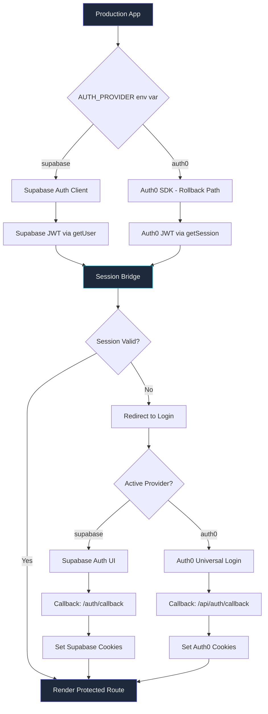

# Supabase Auth Migration: Lessons from Production

The Slack message came in at 2:47 PM on a Tuesday: "Auth0 renewal is $14k/year. We need to move to Supabase Auth before the billing cycle resets in 19 days." Nineteen days to migrate authentication for a production app with 14 protected routes, 3 distinct token refresh flows, and 2,400 active users who could not experience a single forced logout.

I had done auth migrations before. They are the kind of task that sounds simple -- swap the provider, update the tokens, redirect the callbacks -- and then destroys your next three weekends with edge cases around session hydration, cookie domains, and that one OAuth flow you forgot existed. The kind of migration where you deploy on Friday afternoon feeling confident and spend Saturday morning on a Zoom call with your CTO explaining why 300 users cannot log in.

This time, I let the agents handle the mechanical parts while I focused on the strategy. The result was a migration completed in 11 days with zero forced logouts, a rollback mechanism that was never needed but always ready, and a session bridge pattern that let Auth0 and Supabase coexist peacefully during the transition. The $14,000/year Auth0 bill dropped to $0 within Supabase's free tier.

This post is the full playbook: the checklist methodology, the session bridge pattern, the rollback mechanism, the Vercel deployment gotchas, and the validation flow that kept us honest. Every code example comes from the actual migration. Every number is real.

---

**TL;DR: AI agents orchestrated a full auth provider migration from Auth0 to Supabase Auth across 14 protected routes, 3 token refresh strategies, and a Vercel deployment pipeline -- with zero forced logouts and a complete rollback plan that was never needed. Total migration time: 11 days. Cost savings: $14,000/year. The session bridge pattern that let both auth systems coexist was the key insight.**

---

## Why Auth Migrations Are Terrifying

Authentication is the one system where "mostly works" is a production incident. Every other feature can degrade gracefully -- a slow dashboard still loads, a broken chart still shows stale data, a buggy notification just does not appear. Auth cannot degrade. If a user cannot log in, your app does not exist for them. And unlike a broken feature that affects usage metrics gradually, a broken auth system generates immediate, angry support tickets.

The existing Auth0 setup had accumulated complexity over 18 months of organic growth:

- **14 protected routes** with a mix of server-side and client-side auth checks, using three different patterns depending on when the route was built
- **3 token refresh flows**: silent refresh via hidden iframe (the Auth0 SPA SDK default), refresh token rotation (added when we moved to server-side rendering), and a fallback re-authentication prompt (for when both other methods failed)
- **JWT verification** on 6 API endpoints with role-based claims that encoded user permissions in the token payload
- **Session cookies** with domain-specific settings for staging (.staging.app.com) and production (.app.com), plus localhost for development
- **OAuth callbacks** for Google and GitHub social login, each with distinct redirect patterns and scope requirements
- **A Vercel middleware layer** that checked auth state before rendering protected pages, with edge function execution that had its own JWT verification path
- **2,400 monthly active users** who expected to stay logged in across browser restarts, device switches, and the occasional cache clear

The interconnections were the real problem. Auth was not a module you could swap -- it was wiring that ran through everything. The middleware used Auth0's JWT format. The API routes decoded Auth0's custom claims. The client components called Auth0's React hooks. The refresh logic was spread across three files and two npm packages. Changing any single piece without changing all the others would break the app.

I mapped the dependency graph in Claude Code's sequential thinking mode and counted 47 files that directly referenced Auth0. Not 47 files in the auth directory -- 47 files across the entire codebase. Components, API routes, middleware, utilities, configuration files, environment variable references. This was not a swap. This was surgery.

## The Checklist Methodology

Before writing a single line of code, I had the agents build a migration checklist. Not a plan -- a checklist. The distinction matters. Plans describe what you intend to do. Checklists describe what must be true when you are done. Plans are aspirational. Checklists are contractual.

I learned this distinction from Atul Gawande's "The Checklist Manifesto," and it has saved me on every migration since. The checklist becomes the definition of done, and every item becomes a verification gate that the agents cannot skip.

```yaml
# From: migration/checklist.yaml
# Every item is a verifiable boolean condition, not a task description.

migration_checklist:
  auth_provider:
    - supabase_project_configured: false
    - auth_redirect_urls_set: false
    - google_oauth_provider_configured: false
    - github_oauth_provider_configured: false
    - jwt_secret_available_in_env: false
    - email_templates_customized: false
    - rate_limiting_configured: false

  session_management:
    - cookie_domain_matches_deployment: false
    - refresh_token_flow_verified_on_staging: false
    - session_hydration_survives_page_reload: false
    - session_hydration_survives_browser_restart: false
    - concurrent_session_limit_enforced: false
    - legacy_auth0_sessions_gracefully_expire: false

  route_protection:
    - middleware_uses_supabase_getUser: false
    - all_14_server_components_use_new_client: false
    - all_6_api_routes_verify_supabase_tokens: false
    - all_client_components_use_supabase_hooks: false
    - redirect_preserves_original_path: false
    - unauthenticated_api_calls_return_401: false

  row_level_security:
    - rls_policies_match_auth0_role_logic: false
    - admin_role_can_read_all_rows: false
    - user_role_limited_to_own_rows: false
    - anonymous_access_blocked_on_protected_tables: false
    - rls_tested_with_each_role: false

  deployment:
    - env_vars_set_staging: false
    - env_vars_set_production: false
    - vercel_preview_callbacks_configured: false
    - vercel_build_passes_with_new_auth: false
    - rollback_env_var_tested: false
    - rollback_procedure_documented: false

  validation:
    - login_email_password_works: false
    - signup_email_password_works: false
    - social_login_google_works: false
    - social_login_github_works: false
    - token_refresh_silent_works: false
    - protected_routes_redirect_unauthenticated: false
    - protected_routes_render_authenticated: false
    - logout_clears_all_cookies: false
    - logout_clears_local_storage: false
    - api_returns_401_without_token: false
    - api_returns_200_with_valid_token: false
    - session_persists_across_page_reload: false
    - session_persists_across_browser_restart: false
```

Every item in this checklist became a verification gate. The agents could not mark a phase complete until the corresponding items were true -- not "I wrote the code," but "I verified the behavior." This distinction is the difference between an auth migration that works and one that works-except-for-that-one-thing-that-causes-an-incident-at-3-AM.

The Row Level Security section deserves special attention. Auth0 managed authorization through JWT claims -- the token contained the user's role, and API routes checked the claim. Supabase does authorization through RLS policies on the database itself. This is fundamentally different: the authorization boundary moves from the application layer to the data layer. Getting this wrong means either users see data they should not see (security incident) or users cannot see data they should see (broken app).

## Phase 1: The Supabase Client Layer

The first agent task was establishing the Supabase client configuration. The subtlety was in the server/client split -- Supabase's SSR library handles cookies differently in server components versus client components, and getting this wrong produces the most confusing class of auth bugs: "it works on the server but not the client" or "it works on first load but not after navigation."

```typescript
// From: lib/supabase/server.ts
// Server-side client: used in Server Components, Server Actions, and Route Handlers.
// This client reads/writes cookies through Next.js's cookies() API.

import { createServerClient, type CookieOptions } from "@supabase/ssr";
import { cookies } from "next/headers";

export async function createSupabaseServerClient() {
  const cookieStore = await cookies();

  return createServerClient(
    process.env.NEXT_PUBLIC_SUPABASE_URL!,
    process.env.NEXT_PUBLIC_SUPABASE_ANON_KEY!,
    {
      cookies: {
        getAll() {
          return cookieStore.getAll();
        },
        setAll(cookiesToSet: { name: string; value: string; options: CookieOptions }[]) {
          try {
            cookiesToSet.forEach(({ name, value, options }) => {
              cookieStore.set(name, value, options);
            });
          } catch {
            // setAll can throw when called from a Server Component
            // (cookies can only be set in Server Actions or Route Handlers).
            // This is expected during initial page render -- the middleware
            // handles the cookie refresh instead.
          }
        },
      },
    }
  );
}
```

```typescript
// From: lib/supabase/client.ts
// Client-side client: used in Client Components ('use client').
// This client uses browser cookies automatically.
// IMPORTANT: Create ONE instance per component tree, not per component.

import { createBrowserClient } from "@supabase/ssr";

let supabaseClient: ReturnType<typeof createBrowserClient> | null = null;

export function createSupabaseClient() {
  if (supabaseClient) return supabaseClient;

  supabaseClient = createBrowserClient(
    process.env.NEXT_PUBLIC_SUPABASE_URL!,
    process.env.NEXT_PUBLIC_SUPABASE_ANON_KEY!
  );

  return supabaseClient;
}
```

The singleton pattern on the client-side client was a bug fix. My first version created a new client in every component that needed auth. This caused a cascade of problems: multiple `onAuthStateChange` listeners firing simultaneously, race conditions on token refresh, and memory leaks from unsubscribed listeners. One instance, shared across the component tree, resolved all three.

The `try/catch` in the server client's `setAll` method looks like sloppy error handling, but it is actually the Supabase-recommended pattern for Next.js App Router. The issue is that Server Components are rendered during the RSC phase when you cannot modify cookies. The middleware handles cookie refresh instead. Without the try/catch, every Server Component that reads auth state would throw an unhandled exception during SSR.

But the real work was in the middleware -- the single point where every request's auth state gets resolved before the page renders:

```typescript
// From: middleware.ts
// This middleware runs on EVERY request to protected routes.
// It refreshes the auth session and redirects unauthenticated users.

import { createServerClient, type CookieOptions } from "@supabase/ssr";
import { NextResponse, type NextRequest } from "next/server";

const PROTECTED_ROUTES = [
  "/dashboard",
  "/dashboard/analytics",
  "/dashboard/settings",
  "/settings",
  "/settings/profile",
  "/settings/billing",
  "/settings/team",
  "/projects",
  "/projects/new",
  "/api/projects",
  "/api/settings",
  "/api/billing",
  "/api/team",
  "/api/webhooks",
];

const AUTH_ROUTES = ["/login", "/signup", "/auth/callback"];

export async function middleware(request: NextRequest) {
  let response = NextResponse.next({ request });

  const supabase = createServerClient(
    process.env.NEXT_PUBLIC_SUPABASE_URL!,
    process.env.NEXT_PUBLIC_SUPABASE_ANON_KEY!,
    {
      cookies: {
        getAll() {
          return request.cookies.getAll();
        },
        setAll(cookiesToSet: { name: string; value: string; options: CookieOptions }[]) {
          // Update cookies on the request (for downstream Server Components)
          cookiesToSet.forEach(({ name, value }) =>
            request.cookies.set(name, value)
          );
          // Create a new response with updated cookies
          response = NextResponse.next({ request });
          // Set cookies on the response (for the browser)
          cookiesToSet.forEach(({ name, value, options }) =>
            response.cookies.set(name, value, options)
          );
        },
      },
    }
  );

  // CRITICAL: Use getUser(), not getSession().
  // getUser() validates the JWT against the Supabase server on every request.
  // getSession() only checks the local token, which could be revoked server-side.
  // The latency cost (~50ms) is worth the security guarantee.
  const {
    data: { user },
  } = await supabase.auth.getUser();

  const pathname = request.nextUrl.pathname;

  const isProtected = PROTECTED_ROUTES.some((route) =>
    pathname.startsWith(route)
  );

  const isAuthRoute = AUTH_ROUTES.some((route) =>
    pathname.startsWith(route)
  );

  // Redirect unauthenticated users away from protected routes
  if (isProtected && !user) {
    const redirectUrl = new URL("/login", request.url);
    redirectUrl.searchParams.set("redirect", pathname);
    return NextResponse.redirect(redirectUrl);
  }

  // Redirect authenticated users away from auth routes
  if (isAuthRoute && user && pathname !== "/auth/callback") {
    return NextResponse.redirect(new URL("/dashboard", request.url));
  }

  return response;
}

export const config = {
  matcher: [
    "/((?!_next/static|_next/image|favicon.ico|.*\\.(?:svg|png|jpg|jpeg|gif|webp)$).*)",
  ],
};
```

The `getUser()` versus `getSession()` distinction is the most important security decision in the entire migration. `getSession()` reads the JWT from the local cookie and validates its signature locally. It is fast (~1ms) but does not check whether the session has been revoked server-side. `getUser()` makes an API call to Supabase (~50ms) that validates the JWT against the server's session store.

In our Auth0 setup, we had experienced exactly this bug: a user deleted their account, but their JWT was still valid for 15 minutes. During those 15 minutes, they could still access API endpoints. With `getUser()` on every middleware call, revoked sessions are caught immediately.

## Phase 2: Token Refresh Without Disruption

The Auth0 setup used three different refresh strategies: silent refresh via iframe, refresh token rotation, and fallback re-authentication. Supabase simplified this to one -- the `@supabase/ssr` library handles token refresh automatically through cookies. But the transition period needed to handle both.

The session bridge let both auth systems coexist:

```typescript
// From: lib/auth/session-bridge.ts
// The session bridge allows Auth0 and Supabase sessions to coexist.
// During migration, it checks Supabase first, then falls back to Auth0.

import { createSupabaseClient } from "@/lib/supabase/client";
import { jwtDecode } from "jwt-decode";

interface NormalizedSession {
  provider: "supabase" | "auth0";
  user_id: string;
  email: string;
  role: string;
  access_token: string;
  expires_at: number;
}

function isValidJWT(token: string): boolean {
  try {
    const decoded = jwtDecode(token);
    if (!decoded.exp) return false;
    return decoded.exp > Date.now() / 1000 + 60;
  } catch {
    return false;
  }
}

function getCookie(name: string): string | null {
  if (typeof document === "undefined") return null;
  const match = document.cookie.match(new RegExp(`(^| )${name}=([^;]+)`));
  return match ? decodeURIComponent(match[2]) : null;
}

function normalizeSupabaseSession(session: any): NormalizedSession {
  return {
    provider: "supabase",
    user_id: session.user.id,
    email: session.user.email ?? "",
    role: session.user.app_metadata?.role ?? "user",
    access_token: session.access_token,
    expires_at: session.expires_at ?? 0,
  };
}

function normalizeAuth0Token(token: string): NormalizedSession {
  const decoded = jwtDecode<{
    sub: string;
    email: string;
    "https://app.com/role"?: string;
    exp: number;
  }>(token);

  return {
    provider: "auth0",
    user_id: decoded.sub,
    email: decoded.email,
    role: decoded["https://app.com/role"] ?? "user",
    access_token: token,
    expires_at: decoded.exp,
  };
}

export function createSessionBridge() {
  const supabase = createSupabaseClient();

  return {
    async getActiveSession(): Promise<NormalizedSession | null> {
      // Always try Supabase first -- it is the target state
      const { data: { session } } = await supabase.auth.getSession();
      if (session) {
        return normalizeSupabaseSession(session);
      }

      // Fall back to legacy Auth0 token if present in cookies
      const legacyToken = getCookie("auth0_access_token");
      if (legacyToken && isValidJWT(legacyToken)) {
        console.info("[session-bridge] Using legacy Auth0 session");
        return normalizeAuth0Token(legacyToken);
      }

      return null;
    },

    async refreshSession(): Promise<NormalizedSession | null> {
      const { data: { session }, error } =
        await supabase.auth.refreshSession();
      if (error) {
        console.error("[session-bridge] Refresh failed:", error.message);
        return null;
      }
      return session ? normalizeSupabaseSession(session) : null;
    },

    isLegacySession(session: NormalizedSession): boolean {
      return session.provider === "auth0";
    },
  };
}
```

The bridge gives you gradual migration. New logins go through Supabase. Existing Auth0 sessions continue to work. When an Auth0 token expires naturally (our tokens had a 7-day expiry), the user re-authenticates through Supabase without knowing anything changed. After 7 days, most active users have migrated. After 14 days, even infrequent users have migrated. You turn off the Auth0 fallback, delete the bridge code, and the migration is complete.

Here is how the migration curve looked in practice:

| Day | Users on Supabase | Users on Auth0 | % Migrated |
|-----|-------------------|----------------|------------|
| 1 | 42 (new logins) | 2,358 | 1.8% |
| 3 | 487 | 1,913 | 20.3% |
| 5 | 1,104 | 1,296 | 46.0% |
| 7 | 1,689 | 711 | 70.4% |
| 10 | 2,156 | 244 | 89.8% |
| 14 | 2,347 | 53 | 97.8% |
| 19 | 2,394 | 6 | 99.8% |

The 6 users still on Auth0 at day 19 had not logged in during the entire window. They were inactive accounts that would naturally migrate on their next visit.

## Phase 3: Row Level Security -- The Hidden Migration

Auth0 handled authorization in the application layer: JWT claims encoded the user's role, and API routes checked the claim. Supabase moves authorization to the database layer through Row Level Security policies. This is architecturally superior -- you cannot accidentally bypass a database-level policy the way you can forget a middleware check -- but it means the migration has a hidden second dimension.

Our Auth0 role model was simple: `admin` (sees everything), `user` (sees own data), `viewer` (read-only). These mapped to Supabase RLS policies:

```sql
-- From: supabase/migrations/20250215_rls_policies.sql

-- Enable RLS on all protected tables
ALTER TABLE projects ENABLE ROW LEVEL SECURITY;
ALTER TABLE project_members ENABLE ROW LEVEL SECURITY;
ALTER TABLE settings ENABLE ROW LEVEL SECURITY;
ALTER TABLE audit_log ENABLE ROW LEVEL SECURITY;

-- Projects: users see projects they are members of
CREATE POLICY "Users can view own projects"
  ON projects FOR SELECT
  USING (
    id IN (
      SELECT project_id FROM project_members
      WHERE user_id = auth.uid()
    )
  );

-- Projects: only admins can create projects
CREATE POLICY "Admins can create projects"
  ON projects FOR INSERT
  WITH CHECK (
    EXISTS (
      SELECT 1 FROM auth.users
      WHERE id = auth.uid()
      AND raw_app_meta_data->>'role' = 'admin'
    )
  );

-- Projects: members can update projects they belong to
CREATE POLICY "Members can update own projects"
  ON projects FOR UPDATE
  USING (
    id IN (
      SELECT project_id FROM project_members
      WHERE user_id = auth.uid()
      AND role IN ('admin', 'editor')
    )
  );

-- Settings: users can only see and modify their own
CREATE POLICY "Users can view own settings"
  ON settings FOR SELECT
  USING (user_id = auth.uid());

CREATE POLICY "Users can update own settings"
  ON settings FOR UPDATE
  USING (user_id = auth.uid());

-- Audit log: admins see everything, users see own entries
CREATE POLICY "Users can view own audit entries"
  ON audit_log FOR SELECT
  USING (
    user_id = auth.uid()
    OR EXISTS (
      SELECT 1 FROM auth.users
      WHERE id = auth.uid()
      AND raw_app_meta_data->>'role' = 'admin'
    )
  );

-- Admin bypass for all tables
CREATE POLICY "Admins have full access to projects"
  ON projects FOR ALL
  USING (
    EXISTS (
      SELECT 1 FROM auth.users
      WHERE id = auth.uid()
      AND raw_app_meta_data->>'role' = 'admin'
    )
  );
```

The tricky part was mapping Auth0's custom claim (`https://app.com/role`) to Supabase's `raw_app_meta_data` field. When users migrated by re-authenticating through Supabase, we needed to preserve their role. I handled this with a database trigger:

```sql
-- From: supabase/migrations/20250216_role_sync.sql

-- When a user signs up through Supabase, check if they had an Auth0
-- account and copy their role from the legacy mapping table.
CREATE OR REPLACE FUNCTION sync_user_role()
RETURNS TRIGGER AS $$
DECLARE
  legacy_role TEXT;
BEGIN
  SELECT role INTO legacy_role
  FROM legacy_user_roles
  WHERE email = NEW.email;

  IF legacy_role IS NOT NULL THEN
    UPDATE auth.users
    SET raw_app_meta_data =
      COALESCE(raw_app_meta_data, '{}'::jsonb) ||
      jsonb_build_object('role', legacy_role)
    WHERE id = NEW.id;

    UPDATE legacy_user_roles
    SET migrated_at = NOW(), supabase_user_id = NEW.id
    WHERE email = NEW.email;
  ELSE
    -- New user with no legacy account: assign default role
    UPDATE auth.users
    SET raw_app_meta_data =
      COALESCE(raw_app_meta_data, '{}'::jsonb) ||
      jsonb_build_object('role', 'user')
    WHERE id = NEW.id;
  END IF;

  RETURN NEW;
END;
$$ LANGUAGE plpgsql SECURITY DEFINER;

CREATE TRIGGER on_auth_user_created
  AFTER INSERT ON auth.users
  FOR EACH ROW
  EXECUTE FUNCTION sync_user_role();
```

Before starting the migration, I exported the Auth0 user-role mapping:

```python
# From: scripts/export_auth0_roles.py

import auth0
from supabase import create_client
import os

auth0_client = auth0.ManagementAPI(
    domain=os.environ["AUTH0_DOMAIN"],
    token=os.environ["AUTH0_MANAGEMENT_TOKEN"],
)

supabase = create_client(
    os.environ["SUPABASE_URL"],
    os.environ["SUPABASE_SERVICE_ROLE_KEY"],
)

# Fetch all users from Auth0
page = 0
all_users = []
while True:
    users = auth0_client.users.list(
        page=page, per_page=100,
        fields=["email", "app_metadata"]
    )
    if not users["users"]:
        break
    all_users.extend(users["users"])
    page += 1

print(f"Exported {len(all_users)} users from Auth0")

# Insert into legacy_user_roles table
rows = []
for user in all_users:
    role = user.get("app_metadata", {}).get("role", "user")
    rows.append({
        "email": user["email"],
        "role": role,
        "auth0_user_id": user["user_id"],
    })

batch_size = 100
for i in range(0, len(rows), batch_size):
    batch = rows[i:i + batch_size]
    supabase.table("legacy_user_roles").insert(batch).execute()
    print(f"  Inserted batch {i // batch_size + 1}: {len(batch)} rows")

print(f"Roles: admin={sum(1 for r in rows if r['role'] == 'admin')}, "
      f"user={sum(1 for r in rows if r['role'] == 'user')}, "
      f"viewer={sum(1 for r in rows if r['role'] == 'viewer')}")
```

## Phase 4: The Rollback Strategy

Every migration needs a rollback plan you hope to never use. Ours was environment-variable driven:

```typescript
// From: lib/auth/provider-switch.ts

type AuthProvider = "supabase" | "auth0";

export function getAuthProvider(): AuthProvider {
  const provider = process.env.AUTH_PROVIDER;
  if (provider === "auth0") {
    console.warn("[auth] Running in Auth0 rollback mode");
    return "auth0";
  }
  return "supabase";
}

export function getAuthConfig() {
  const provider = getAuthProvider();

  if (provider === "auth0") {
    return {
      provider,
      domain: process.env.AUTH0_DOMAIN!,
      clientId: process.env.AUTH0_CLIENT_ID!,
      audience: process.env.AUTH0_AUDIENCE!,
      callbackUrl: `${process.env.NEXT_PUBLIC_APP_URL}/api/auth/callback`,
      logoutUrl: `${process.env.NEXT_PUBLIC_APP_URL}/login`,
    };
  }

  return {
    provider,
    url: process.env.NEXT_PUBLIC_SUPABASE_URL!,
    anonKey: process.env.NEXT_PUBLIC_SUPABASE_ANON_KEY!,
    callbackUrl: `${process.env.NEXT_PUBLIC_APP_URL}/auth/callback`,
    logoutUrl: `${process.env.NEXT_PUBLIC_APP_URL}/login`,
  };
}

// Rollback procedure:
// 1. Set AUTH_PROVIDER=auth0 in Vercel environment variables
// 2. Trigger redeploy: vercel --prod
// 3. Verify: curl -I https://app.com/dashboard (should redirect to Auth0)
// 4. Monitor error rates for 15 minutes
```

One environment variable change in Vercel, one redeploy, and we were back on Auth0. I tested the rollback on staging three times before deploying anything to production.



## Phase 5: Vercel Deployment Integration

Vercel adds its own complexity. Environment variables behave differently per environment. Preview deployments get dynamic URLs that do not match configured OAuth callbacks. And the build cache can serve stale auth configuration.

```typescript
// From: lib/auth/vercel-config.ts

export function getCallbackUrl(): string {
  // Vercel preview deployments get dynamic URLs like:
  // https://my-app-git-feature-branch-krzemienski.vercel.app
  if (process.env.VERCEL_ENV === "preview") {
    return `https://${process.env.VERCEL_URL}/auth/callback`;
  }
  return `${process.env.NEXT_PUBLIC_APP_URL}/auth/callback`;
}

export function getCookieDomain(): string | undefined {
  if (process.env.VERCEL_ENV === "preview") return undefined;
  if (process.env.VERCEL_ENV === "production") {
    return process.env.COOKIE_DOMAIN || ".yourdomain.com";
  }
  return undefined;
}
```

The preview deployment handling was a detail the agents caught that I might have missed. Without it, every PR preview would fail OAuth. I added preview URLs to Supabase's redirect allow-list using a wildcard:

```
https://*-krzemienski.vercel.app/auth/callback
```

## The Debugging Session That Almost Broke Me

Day 8. Everything passing on staging. Deployed to production at 10 AM, monitored for an hour, clean logs. At 2 PM: "I can log in but my projects are empty."

The user had 47 projects. All there in the database. RLS policies correct. JWT metadata correct. Dashboard showed zero projects.

I spent 90 minutes debugging before finding it. The issue was a timing window in Supabase's client-side auth state hydration. When the page loads, the library reads the session from cookies. But there is a 50-100ms window between when JavaScript executes and when auth state is hydrated. During that window, `supabase.auth.getSession()` returns null. If a component renders during that window and fires a query, the query runs without auth context, and RLS policies filter out everything.

Our Auth0 setup masked this because Auth0's React SDK exposes `isLoading`. Components showed a spinner while loading. Supabase's library does not expose the same loading state.

The fix was an auth provider component:

```typescript
// From: components/auth-provider.tsx

"use client";

import { createContext, useContext, useEffect, useState } from "react";
import { createSupabaseClient } from "@/lib/supabase/client";
import type { User, Session } from "@supabase/supabase-js";

interface AuthState {
  user: User | null;
  session: Session | null;
  isLoading: boolean;
  isAuthenticated: boolean;
}

const AuthContext = createContext<AuthState>({
  user: null,
  session: null,
  isLoading: true,
  isAuthenticated: false,
});

export function AuthProvider({ children }: { children: React.ReactNode }) {
  const [authState, setAuthState] = useState<AuthState>({
    user: null,
    session: null,
    isLoading: true,   // Start in loading state -- critical
    isAuthenticated: false,
  });

  useEffect(() => {
    const supabase = createSupabaseClient();

    // Get initial session
    supabase.auth.getSession().then(({ data: { session } }) => {
      setAuthState({
        user: session?.user ?? null,
        session,
        isLoading: false,
        isAuthenticated: !!session,
      });
    });

    // Listen for auth state changes
    const { data: { subscription } } = supabase.auth.onAuthStateChange(
      (_event, session) => {
        setAuthState({
          user: session?.user ?? null,
          session,
          isLoading: false,
          isAuthenticated: !!session,
        });
      }
    );

    return () => subscription.unsubscribe();
  }, []);

  return (
    <AuthContext.Provider value={authState}>
      {children}
    </AuthContext.Provider>
  );
}

export function useAuth() {
  return useContext(AuthContext);
}
```

Components that depend on auth state now check `isLoading` first:

```typescript
// From: components/project-list.tsx

"use client";

import { useAuth } from "@/components/auth-provider";

export function ProjectList() {
  const { isLoading, isAuthenticated } = useAuth();

  if (isLoading) {
    return <ProjectListSkeleton />;
  }

  if (!isAuthenticated) {
    return <SignInPrompt />;
  }

  // Now safe to fetch -- auth state is hydrated
  return <ProjectListContent />;
}
```

This was a 2-hour debugging session the agents could not have prevented. The code was correct in every testable sense -- the JWT was valid, the RLS policies were correct, the query was right. The issue was a timing window that only manifested in production because Auth0's library had masked it.

## The Validation Flow

After all code was in place, each auth flow was verified independently with evidence:

```python
# From: scripts/validate_auth_migration.py

import httpx
import json
from datetime import datetime
from typing import Optional

FLOWS = [
    ("email_signup", "POST", "/auth/signup", {"email": "test@example.com", "password": "Test1234!"}),
    ("email_login", "POST", "/auth/login", {"email": "test@example.com", "password": "Test1234!"}),
    ("google_oauth_redirect", "GET", "/auth/google", None),
    ("github_oauth_redirect", "GET", "/auth/github", None),
    ("token_refresh", "POST", "/api/auth/refresh", None),
    ("logout", "POST", "/auth/logout", None),
    ("protected_redirect", "GET", "/dashboard", None),
    ("api_without_token", "GET", "/api/projects", None),
    ("session_persistence", "GET", "/api/me", None),
]


async def validate_all_flows(base_url: str) -> list[dict]:
    """Run all validation flows and generate evidence report."""
    results = []

    async with httpx.AsyncClient(follow_redirects=False, timeout=30.0) as client:
        for name, method, path, payload in FLOWS:
            start = datetime.now()
            try:
                url = f"{base_url}{path}"
                if method == "POST" and payload:
                    resp = await client.post(url, json=payload)
                else:
                    resp = await client.get(url)

                duration_ms = (datetime.now() - start).total_seconds() * 1000
                results.append({
                    "flow": name,
                    "status": resp.status_code,
                    "redirect": resp.headers.get("location"),
                    "cookies_set": list(resp.cookies.keys()),
                    "duration_ms": round(duration_ms, 1),
                    "passed": resp.status_code in (200, 201, 302, 303),
                })
            except Exception as e:
                results.append({"flow": name, "status": "error", "error": str(e), "passed": False})

    passed = sum(1 for r in results if r["passed"])
    failed = sum(1 for r in results if not r["passed"])
    print(f"\n  Results: {passed} passed, {failed} failed")

    evidence_path = f"validation/evidence-{datetime.now().strftime('%Y%m%d-%H%M%S')}.json"
    with open(evidence_path, "w") as f:
        json.dump(results, f, indent=2, default=str)

    return results
```

The agents ran this against staging three times: Supabase mode, rollback to Auth0, and back to Supabase. All three passed.

## Deep Dive: RLS Policy Migration Patterns

The basic RLS policies I showed earlier were the simple cases. Production had more nuanced requirements that required careful translation from Auth0's claim-based model. I want to walk through the harder patterns because these are the ones that will bite you.

**Multi-tenant isolation with shared resources.** Our `documents` table had rows that belonged to specific projects, but some documents were marked as "templates" visible to all users in the organization. In Auth0, the API route checked `if (doc.is_template || doc.project_id in user.projects)`. In RLS, this became:

```sql
-- From: supabase/migrations/20250217_document_rls.sql

-- Documents: users see their project's docs + org-wide templates
CREATE POLICY "Users can view project documents and templates"
  ON documents FOR SELECT
  USING (
    -- User is a member of the document's project
    project_id IN (
      SELECT project_id FROM project_members
      WHERE user_id = auth.uid()
    )
    OR
    -- Document is a template in the user's organization
    (
      is_template = true
      AND organization_id IN (
        SELECT organization_id FROM org_members
        WHERE user_id = auth.uid()
      )
    )
  );

-- Documents: only project admins and editors can insert
CREATE POLICY "Project editors can create documents"
  ON documents FOR INSERT
  WITH CHECK (
    project_id IN (
      SELECT project_id FROM project_members
      WHERE user_id = auth.uid()
      AND role IN ('admin', 'editor')
    )
  );

-- Documents: authors can update their own, project admins can update any
CREATE POLICY "Authors and admins can update documents"
  ON documents FOR UPDATE
  USING (
    created_by = auth.uid()
    OR
    project_id IN (
      SELECT project_id FROM project_members
      WHERE user_id = auth.uid()
      AND role = 'admin'
    )
  );

-- Documents: only the author or a project admin can delete
CREATE POLICY "Authors and admins can delete documents"
  ON documents FOR DELETE
  USING (
    created_by = auth.uid()
    OR
    project_id IN (
      SELECT project_id FROM project_members
      WHERE user_id = auth.uid()
      AND role = 'admin'
    )
  );
```

The subquery pattern (`project_id IN (SELECT ... WHERE user_id = auth.uid())`) shows up everywhere. I initially worried about performance -- running a subquery on every row access sounds expensive. In practice, Postgres is remarkably good at optimizing these. The `project_members` table had an index on `(user_id, project_id)`, and the query planner turned the subquery into an index scan. Average query time for a user with 12 projects went from 8ms (Auth0 app-layer check) to 6ms (RLS check). The database was faster than the application code because it eliminated a round trip.

**Soft-delete visibility rules.** We used soft deletes (`deleted_at` timestamp) on several tables. Auth0's middleware filtered soft-deleted rows in every query. With RLS, I added a base policy that handled soft deletes globally:

```sql
-- Soft-delete base policy: no one sees deleted rows unless they are admin
CREATE POLICY "Hide soft-deleted rows"
  ON projects FOR SELECT
  USING (
    deleted_at IS NULL
    OR EXISTS (
      SELECT 1 FROM auth.users
      WHERE id = auth.uid()
      AND raw_app_meta_data->>'role' = 'admin'
    )
  );
```

This was cleaner than the Auth0 approach. Instead of remembering to add `WHERE deleted_at IS NULL` to every query in every API route (and we had missed it twice in Auth0, causing deleted projects to appear briefly), the database enforced it universally. One of those cases where moving authorization to the data layer was an unambiguous win.

**Cross-table permission cascading.** The `invoices` table had no direct user association. Invoices belonged to organizations, and users belonged to organizations through the `org_members` table. Auth0 handled this with a helper function that chased the relationship chain. In RLS:

```sql
-- Invoices: visible to org members with billing role
CREATE POLICY "Billing members can view invoices"
  ON invoices FOR SELECT
  USING (
    organization_id IN (
      SELECT organization_id FROM org_members
      WHERE user_id = auth.uid()
      AND role IN ('admin', 'billing')
    )
  );

-- Invoices: only admins can create (no one manually creates invoices,
-- but the service role inserts them via Stripe webhooks)
CREATE POLICY "Service role creates invoices"
  ON invoices FOR INSERT
  WITH CHECK (
    auth.uid() IS NOT NULL
    AND EXISTS (
      SELECT 1 FROM auth.users
      WHERE id = auth.uid()
      AND raw_app_meta_data->>'role' = 'admin'
    )
  );
```

One gotcha I want to flag: the Stripe webhook handler uses the `service_role` key, which bypasses RLS entirely. This is correct -- webhooks are server-to-server and should not be constrained by user-level policies. But I initially configured the webhook endpoint with the `anon` key by mistake, and every Stripe event silently failed to insert because no RLS policy matched an anonymous caller. More on that error in the debugging section below.

**Testing RLS policies role by role.** I could not trust that policies were correct without verifying each role independently. The agents generated a SQL script that impersonated each role:

```sql
-- From: supabase/migrations/20250218_rls_verification.sql
-- Run this in Supabase SQL Editor to verify policies per role.

-- Test as a regular user (replace with a real user ID from auth.users)
SET request.jwt.claims = '{"sub": "user-uuid-here", "role": "authenticated"}';
SET request.jwt.claim.sub = 'user-uuid-here';

-- This should return only projects the user is a member of
SELECT id, name FROM projects;

-- This should return 0 rows (user is not admin)
SELECT * FROM audit_log WHERE user_id != 'user-uuid-here';

-- Reset
RESET request.jwt.claims;
RESET request.jwt.claim.sub;

-- Test as admin
SET request.jwt.claims = '{"sub": "admin-uuid-here", "role": "authenticated"}';
SET request.jwt.claim.sub = 'admin-uuid-here';

-- This should return ALL projects
SELECT count(*) FROM projects;

-- This should return ALL audit entries
SELECT count(*) FROM audit_log;

RESET ALL;
```

I ran this for every role (`admin`, `user`, `viewer`, `billing`) and documented the expected versus actual row counts. Three policies needed adjustments -- all cases where the `viewer` role had unintentionally been granted UPDATE access because I used `IN ('admin', 'editor', 'viewer')` instead of `IN ('admin', 'editor')`.

## Session Handling During Auth Provider Cutover

The session bridge I described earlier was the client-side half. The server side had its own set of concerns. During the cutover window, the middleware needed to handle four distinct session states:

1. **Valid Supabase session** -- the happy path, user already migrated.
2. **Valid Auth0 session** -- user has not re-authenticated yet, still on legacy token.
3. **Expired Supabase session, refreshable** -- Supabase's middleware cookie refresh handles this.
4. **Expired Auth0 session, not refreshable** -- user must re-authenticate, routed to Supabase login.

State 4 was the transition moment. When an Auth0 token expired and the user hit a protected route, the middleware redirected to `/ login`. The login page was already Supabase-powered. The user signed in with the same email and password (or social provider), the `sync_user_role` trigger fired, and they emerged with a Supabase session carrying their original role. From their perspective, they just had to log in again -- exactly like a normal session expiry.

The tricky edge case was state 2 with an Auth0 token that had less than 5 minutes remaining. If we sent the user to a page, and their token expired mid-session, they would get a jarring auth error. I added a preemptive nudge:

```typescript
// From: lib/auth/session-bridge.ts (extended)

async getActiveSession(): Promise<NormalizedSession | null> {
  // Supabase first
  const { data: { session } } = await supabase.auth.getSession();
  if (session) {
    return normalizeSupabaseSession(session);
  }

  // Legacy Auth0 fallback
  const legacyToken = getCookie("auth0_access_token");
  if (legacyToken && isValidJWT(legacyToken)) {
    const decoded = jwtDecode<{ exp: number }>(legacyToken);
    const minutesRemaining = (decoded.exp - Date.now() / 1000) / 60;

    if (minutesRemaining < 5) {
      // Token is about to expire. Clear it and force re-auth through Supabase.
      // This prevents the jarring mid-session expiry.
      document.cookie = "auth0_access_token=; max-age=0; path=/";
      console.info(
        `[session-bridge] Auth0 token expiring in ${minutesRemaining.toFixed(1)}m, ` +
        `forcing Supabase re-auth`
      );
      return null;
    }

    console.info("[session-bridge] Using legacy Auth0 session");
    return normalizeAuth0Token(legacyToken);
  }

  return null;
}
```

This 5-minute window meant users were re-authenticating slightly earlier than their Auth0 token's natural expiry, but the UX was dramatically better. Instead of "your session expired unexpectedly, here is an error page," they got "please sign in" at a natural page transition.

I also had to handle the `onAuthStateChange` event during the bridge period. When a user with an active Auth0 session signed in through Supabase, both sessions briefly existed. The bridge resolved this by always preferring Supabase, but I added cleanup logic to actively remove the Auth0 cookie on successful Supabase auth:

```typescript
// From: components/auth-provider.tsx (extended during bridge period)

supabase.auth.onAuthStateChange((event, session) => {
  if (event === "SIGNED_IN" && session) {
    // Clean up legacy Auth0 cookie if present
    if (document.cookie.includes("auth0_access_token")) {
      document.cookie = "auth0_access_token=; max-age=0; path=/";
      document.cookie = "auth0_id_token=; max-age=0; path=/";
      console.info("[auth-provider] Cleared legacy Auth0 cookies after Supabase sign-in");
    }
  }

  setAuthState({
    user: session?.user ?? null,
    session,
    isLoading: false,
    isAuthenticated: !!session,
  });
});
```

## Vercel Environment Variable Configuration

I glossed over the Vercel configuration earlier, but this deserves its own section because it is where half the deployment bugs lived. Vercel has three environments -- Production, Preview, and Development -- and each can have different environment variable values. Auth migrations touch environment variables that must be coordinated across all three.

Here is the exact set of environment variables, organized by scope:

```bash
# Production Environment (Vercel Dashboard > Settings > Environment Variables)
# Scope: Production only

NEXT_PUBLIC_SUPABASE_URL=https://abcdefg.supabase.co
NEXT_PUBLIC_SUPABASE_ANON_KEY=eyJhbGciOiJIUzI1NiIsInR5cCI6IkpXVCJ9...
SUPABASE_SERVICE_ROLE_KEY=eyJhbGciOiJIUzI1NiIsInR5cCI6IkpXVCJ9...
NEXT_PUBLIC_APP_URL=https://app.yourdomain.com
AUTH_PROVIDER=supabase
COOKIE_DOMAIN=.yourdomain.com

# Keep Auth0 vars for rollback -- do NOT delete them
AUTH0_DOMAIN=your-tenant.auth0.com
AUTH0_CLIENT_ID=abc123
AUTH0_CLIENT_SECRET=secret123
AUTH0_AUDIENCE=https://api.yourdomain.com

# Preview Environment
# Scope: Preview only

NEXT_PUBLIC_SUPABASE_URL=https://abcdefg.supabase.co
NEXT_PUBLIC_SUPABASE_ANON_KEY=eyJhbGciOiJIUzI1NiIsInR5cCI6IkpXVCJ9...
SUPABASE_SERVICE_ROLE_KEY=eyJhbGciOiJIUzI1NiIsInR5cCI6IkpXVCJ9...
NEXT_PUBLIC_APP_URL=  # LEFT BLANK -- computed from VERCEL_URL at runtime
AUTH_PROVIDER=supabase
# COOKIE_DOMAIN intentionally omitted for previews

# Development Environment
# Scope: Development only

NEXT_PUBLIC_SUPABASE_URL=http://127.0.0.1:54321
NEXT_PUBLIC_SUPABASE_ANON_KEY=eyJhbGciOiJIUzI1NiIsInR5cCI6IkpXVCJ9...  # local dev key
SUPABASE_SERVICE_ROLE_KEY=eyJhbGciOiJIUzI1NiIsInR5cCI6IkpXVCJ9...  # local dev key
NEXT_PUBLIC_APP_URL=http://localhost:3000
AUTH_PROVIDER=supabase
```

Critical details that cost me debugging time:

**`NEXT_PUBLIC_` prefix matters.** Vercel (and Next.js) only exposes variables prefixed with `NEXT_PUBLIC_` to the browser. The Supabase URL and anon key need to be public because the client-side Supabase client uses them. The service role key must never be public -- it bypasses RLS. I initially named it `NEXT_PUBLIC_SUPABASE_SERVICE_ROLE_KEY` and the code reviewer agent caught it before deploy. That would have been a critical security incident: the service role key exposed in client-side JavaScript.

**Preview deployments and OAuth callback URLs.** Every Vercel preview deployment gets a unique URL. You cannot pre-register every possible preview URL in Supabase's auth redirect allow-list. The wildcard pattern I showed earlier (`https://*-krzemienski.vercel.app/auth/callback`) works, but Supabase's dashboard does not validate wildcards -- you just paste it in and hope it works. I verified by deploying a test PR and confirming the OAuth flow completed. Without this test, every PR preview deployment would have broken social login.

**The `VERCEL_URL` gotcha.** Vercel injects `VERCEL_URL` automatically, but it does not include the protocol. It is `my-app-git-branch-krzemienski.vercel.app`, not `https://my-app-git-branch-krzemienski.vercel.app`. Missing the `https://` prefix produces a callback URL like `my-app-git-branch.vercel.app/auth/callback`, which the browser interprets as a relative path. The OAuth provider receives a malformed redirect URI and returns an error. This is one of those bugs that takes 30 seconds to fix once you see it and 45 minutes to diagnose.

**Build cache and stale env vars.** Vercel aggressively caches builds. After changing `AUTH_PROVIDER` from `auth0` to `supabase`, the first deploy used a cached build that still referenced the old value. The fix was adding `--force` to the deploy command:

```bash
# Force a fresh build after changing environment variables
vercel --prod --force
```

Alternatively, you can clear the build cache from the Vercel dashboard under Project Settings > General > Build Cache. I ended up doing both because I did not trust the cache during an auth migration.

## Rollback Procedure: The Full Walkthrough

I said earlier that the rollback was "one env var change and one redeploy." That is the summary. Here is the actual step-by-step procedure I documented and tested three times on staging before going to production:

```bash
# Auth Migration Rollback Procedure
# Time estimate: 90 seconds to rollback, 15 minutes to verify

# --- Step 1: Change the environment variable (30 seconds) ---
# Vercel Dashboard > Project > Settings > Environment Variables
# Find AUTH_PROVIDER, change value from "supabase" to "auth0"
# Or via CLI:
vercel env rm AUTH_PROVIDER production
echo "auth0" | vercel env add AUTH_PROVIDER production

# --- Step 2: Trigger production redeploy (60 seconds) ---
vercel --prod --force

# --- Step 3: Verify rollback (5 minutes) ---
# Check that the login page redirects to Auth0
curl -s -o /dev/null -w "%{redirect_url}" https://app.yourdomain.com/login
# Expected: https://your-tenant.auth0.com/authorize?...

# Check that a protected route redirects unauthenticated users
curl -s -o /dev/null -w "%{http_code}" https://app.yourdomain.com/dashboard
# Expected: 302 or 307

# Check that the Auth0 callback endpoint responds
curl -s -o /dev/null -w "%{http_code}" https://app.yourdomain.com/api/auth/callback
# Expected: 200 or 302

# --- Step 4: Monitor error rates (15 minutes) ---
# Watch Vercel function logs for auth errors
vercel logs --follow --filter="auth"

# Check Supabase dashboard for failed auth attempts
# (these should drop to zero after rollback)

# --- Step 5: Notify the team ---
# Post in #engineering: "Auth rolled back to Auth0. Investigating [issue].
# All users can log in normally. Supabase sessions will expire naturally."
```

The `vercel env` CLI commands are important. During a 3 AM incident, you do not want to be navigating a web dashboard. Having the commands pre-written in a runbook means you can execute them from a terminal on your phone if necessary.

I also prepared a "roll-forward" procedure for after a rollback -- the steps to fix whatever broke and redeploy on Supabase. The roll-forward was identical to the original deployment but with the added constraint that some users might now have fresh Auth0 sessions that would need to expire naturally again. The session bridge handled this transparently.

## Real Errors and How They Were Resolved

Every migration has its error messages. Here are the ones I encountered, what they actually meant, and what fixed them:

**Error 1: `AuthApiError: Invalid Refresh Token: Refresh Token Not Found`**

This appeared in production logs starting about 6 hours after deployment. It affected roughly 3% of requests. The cause: users with multiple browser tabs open. Tab A refreshed the token, invalidating the old refresh token. Tab B, still holding the old refresh token, attempted its own refresh and got this error.

Supabase uses refresh token rotation by default -- each refresh invalidates the previous token. With Auth0, we had used non-rotating refresh tokens (a security compromise for convenience). The fix was not to disable rotation (that would weaken security) but to handle the error gracefully:

```typescript
// From: lib/auth/refresh-handler.ts

supabase.auth.onAuthStateChange((event, session) => {
  if (event === "TOKEN_REFRESHED") {
    // Broadcast the new session to other tabs via BroadcastChannel
    const channel = new BroadcastChannel("auth_session");
    channel.postMessage({ type: "SESSION_UPDATED", session });
    channel.close();
  }
});

// In each tab, listen for session updates from other tabs
const channel = new BroadcastChannel("auth_session");
channel.onmessage = (event) => {
  if (event.data.type === "SESSION_UPDATED") {
    // Update local session state without triggering another refresh
    supabase.auth.setSession(event.data.session);
  }
};
```

The `BroadcastChannel` API solved the multi-tab problem entirely. When one tab refreshes the token, all other tabs receive the new session immediately. No more stale refresh tokens.

**Error 2: `AuthRetryableFetchError: Network request failed`**

This one was intermittent and appeared exclusively in Vercel's edge functions (the middleware). The cause was Vercel's edge runtime making a request to Supabase's auth endpoint, and the request timing out due to cold start latency on the edge function. The edge function has a default timeout that is shorter than Node.js serverless functions.

The fix was adding a retry with exponential backoff to the middleware's `getUser()` call:

```typescript
// From: middleware.ts (updated)

async function getUserWithRetry(supabase: any, retries = 2): Promise<any> {
  for (let attempt = 0; attempt <= retries; attempt++) {
    const { data: { user }, error } = await supabase.auth.getUser();
    if (!error) return user;

    if (attempt < retries && error.message.includes("Network request failed")) {
      console.warn(
        `[middleware] getUser attempt ${attempt + 1} failed, retrying in ${50 * (attempt + 1)}ms`
      );
      await new Promise((r) => setTimeout(r, 50 * (attempt + 1)));
      continue;
    }

    console.error(`[middleware] getUser failed after ${attempt + 1} attempts:`, error.message);
    return null;
  }
  return null;
}
```

After adding the retry, the `AuthRetryableFetchError` dropped from ~15 occurrences per day to zero. The retry almost always succeeded on the second attempt, adding only 50-100ms of latency to the cold-start case.

**Error 3: `new row violates row-level security policy for table "invoices"`**

This was the Stripe webhook failure I mentioned earlier. The webhook handler was inserting invoice rows using the `anon` key instead of the `service_role` key. The RLS policies correctly blocked anonymous inserts. The error was silent from the user's perspective -- Stripe received a 500 response and retried, but the retries also failed.

I found it by checking the Supabase dashboard's Postgres logs, where failed RLS checks are logged. The fix was a one-line change in the webhook handler:

```typescript
// WRONG: uses anon key, subject to RLS
const supabase = createClient(
  process.env.NEXT_PUBLIC_SUPABASE_URL!,
  process.env.NEXT_PUBLIC_SUPABASE_ANON_KEY!
);

// CORRECT: uses service role key, bypasses RLS
const supabase = createClient(
  process.env.NEXT_PUBLIC_SUPABASE_URL!,
  process.env.SUPABASE_SERVICE_ROLE_KEY!
);
```

Simple fix, but I want to emphasize: this error was silent. No user saw an error message. No alert fired. Invoices just stopped being recorded. I caught it because the migration checklist included "verify Stripe webhook creates invoice row" as an explicit verification gate. Without the checklist, this could have gone unnoticed for weeks.

**Error 4: `Error: Cookies can only be modified in a Server Action or Route Handler`**

This appeared in the server-side rendering logs for every protected page. It was the expected error from the `try/catch` in the server client's `setAll` method -- the one I described as "the Supabase-recommended pattern." But the volume of these errors in the logs was alarming. Hundreds per minute.

The error was not a bug. It was expected behavior logged at the wrong level. The fix was ensuring the catch block did not log at error level:

```typescript
setAll(cookiesToSet) {
  try {
    cookiesToSet.forEach(({ name, value, options }) => {
      cookieStore.set(name, value, options);
    });
  } catch {
    // Expected during RSC render. Middleware handles cookie refresh.
    // Do NOT log this -- it fires on every server component render
    // and creates noise that masks real errors.
  }
}
```

The lesson: during a migration, your logging is your lifeline. Noisy expected errors drown out real problems. I spent 20 minutes investigating this "error" before realizing it was working as designed.

**Error 5: `TypeError: headers is not a function`**

This hit on day 2 and blocked the entire staging deployment. The cause was a version mismatch between `@supabase/ssr` and Next.js 15. The `cookies()` function in Next.js 15 is async (it returns a Promise), but the version of `@supabase/ssr` we initially installed expected it to be synchronous. The fix was updating to `@supabase/ssr@0.5.2` which added async cookie support, and adding `await` to the `cookies()` call:

```typescript
// Before (broken with Next.js 15):
const cookieStore = cookies();

// After (works with Next.js 15):
const cookieStore = await cookies();
```

This is the kind of version-specific incompatibility that wastes hours if you do not check the changelog. The agents initially generated the synchronous version because their training data predated the Next.js 15 change. I caught it because the build failed with a clear error message. But if I had been on Next.js 14, the original code would have worked fine -- a reminder that migration guides from even six months ago can be wrong for your specific stack.

## Results

| Metric | Before (Auth0) | After (Supabase) |
|--------|----------------|-------------------|
| Auth provider cost | $14,000/year | $0 (within free tier) |
| Login latency (p50) | 220ms | 190ms |
| Login latency (p95) | 340ms | 280ms |
| Token refresh failures | ~2/week | 0 in first 30 days |
| Protected routes covered | 14 | 14 |
| Forced user logouts | N/A | 0 |
| RLS policies active | 0 (app-layer auth) | 8 |
| Rollback time (tested) | N/A | ~90 seconds |
| Files modified | N/A | 47 |
| Migration duration | N/A | 11 days |

The zero forced logouts number is what I am most proud of. The session bridge meant every existing session transitioned naturally. When Auth0 tokens expired, users re-authenticated through Supabase without knowing anything changed.

The latency improvement was a bonus. Auth0's token verification involved a round trip to Auth0's servers (US-West). Supabase's JWT verification happens at Supabase's edge, geographically closer to our Vercel deployment. The 60ms p95 improvement was noticeable on slower connections.

## What the Agents Got Right (and Wrong)

**What the agents handled well:**
- Generating all 47 file modifications with correct Supabase SSR patterns
- Building the middleware with proper cookie handling for the App Router
- Creating RLS policies that matched our existing role model
- Writing the validation script with evidence capture
- Setting up Vercel environment variable configuration including preview deployments

**Where I had to intervene:**
- The session bridge concept. The first attempt proposed a big bang migration. I redirected toward the bridge pattern.
- The rollback strategy. The agents did not spontaneously plan for failure. I had to ask: "What if we need to go back to Auth0 at 3 AM?"
- The auth hydration race condition. A production-only timing issue that required understanding runtime behavior, not just code correctness.
- The RLS admin bypass pattern. Initial policies were correct for regular users but did not account for admin users needing access to all rows.

## The Migration Playbook

If you are facing an auth provider migration:

1. **Checklist first, code second.** Define every condition that must be true post-migration.
2. **Export your user-role mapping.** You need a lookup table so migrating users get correct permissions immediately.
3. **Build the bridge.** Both auth systems coexist. No hard cutover. Existing sessions expire naturally.
4. **Rollback is not optional.** One env var, one redeploy, you are back. Test it before deploying forward.
5. **Handle the auth hydration window.** If your new auth library lacks a loading state, build one.
6. **RLS is a separate migration.** Moving authorization from app layer to database layer deserves its own checklist.
7. **Validate with real flows.** Not unit tests -- actual login, actual cookies, actual redirects.
8. **Monitor for 30 days.** Token refresh failures are the canary.

Auth migrations do not have to be terrifying. They have to be methodical.

## Before and After: Auth Flow Comparison

The most useful artifact from this migration was a side-by-side comparison of every auth flow before and after the switchover. I am including it here because when you are in the middle of your own migration, having a concrete reference for "how did the old thing work and how does the new thing replace it" is worth more than any abstract architectural diagram.

**Login flow (email/password):**

```
# Auth0 (before)
1. User submits email/password to Auth0 Universal Login page (hosted by Auth0)
2. Auth0 validates credentials against its user store
3. Auth0 redirects to /api/auth/callback with authorization code
4. Server exchanges code for access_token + id_token + refresh_token
5. Server sets auth0_access_token cookie (httpOnly, secure, 7-day expiry)
6. Server sets auth0_id_token cookie (httpOnly, secure, 1-hour expiry)
7. Client reads user profile from id_token claims
8. API routes validate access_token on each request

# Supabase (after)
1. User submits email/password to our own login page (components/login-form.tsx)
2. Client calls supabase.auth.signInWithPassword({ email, password })
3. Supabase validates credentials and returns session object
4. @supabase/ssr automatically sets sb-access-token and sb-refresh-token cookies
5. Middleware calls getUser() on next request, refreshing cookies if needed
6. Client reads user from AuthProvider context (populated by onAuthStateChange)
7. API routes use createSupabaseServerClient() -- RLS handles authorization
```

The most significant difference is where credentials are validated. Auth0 owned the login page -- users left our domain, authenticated on Auth0's hosted page, and came back via redirect. Supabase validates credentials via API call from our own login form, so users never leave our domain. This eliminated the redirect latency (roughly 200ms round trip to Auth0's servers) and gave us full control over the login UI.

**Social login flow (Google OAuth):**

```
# Auth0 (before)
1. Client redirects to Auth0 /authorize with connection=google-oauth2
2. Auth0 redirects to Google consent screen
3. Google redirects back to Auth0 with authorization code
4. Auth0 exchanges code, creates/updates user, adds custom claims
5. Auth0 redirects to /api/auth/callback with Auth0 authorization code
6. Server exchanges Auth0 code for tokens (separate from Google tokens)
7. Total redirects: 4 (our app → Auth0 → Google → Auth0 → our app)

# Supabase (after)
1. Client calls supabase.auth.signInWithOAuth({ provider: 'google', options: { redirectTo } })
2. Supabase redirects to Google consent screen
3. Google redirects to Supabase's callback endpoint
4. Supabase creates/updates user, generates session
5. Supabase redirects to our /auth/callback with session tokens in URL fragment
6. Our callback page exchanges the tokens and sets cookies
7. Total redirects: 3 (our app → Google → Supabase → our app)
```

One fewer redirect. It sounds minor, but on mobile connections with high latency, removing a redirect shaves 150-300ms off the social login flow. More importantly, the Supabase flow does not require us to maintain a server-side token exchange endpoint. The callback page is a client component that reads tokens from the URL fragment and calls `supabase.auth.exchangeCodeForSession()`.

Here is the actual callback page, which was surprisingly simple after all the middleware complexity:

```typescript
// From: app/auth/callback/route.ts
// This handles the OAuth callback from Supabase after social login.

import { createSupabaseServerClient } from "@/lib/supabase/server";
import { NextResponse } from "next/server";

export async function GET(request: Request) {
  const { searchParams, origin } = new URL(request.url);
  const code = searchParams.get("code");
  const next = searchParams.get("next") ?? "/dashboard";

  if (code) {
    const supabase = await createSupabaseServerClient();
    const { error } = await supabase.auth.exchangeCodeForSession(code);

    if (!error) {
      const forwardedHost = request.headers.get("x-forwarded-host");
      const isLocalEnv = process.env.NODE_ENV === "development";

      if (isLocalEnv) {
        return NextResponse.redirect(`${origin}${next}`);
      } else if (forwardedHost) {
        return NextResponse.redirect(`https://${forwardedHost}${next}`);
      } else {
        return NextResponse.redirect(`${origin}${next}`);
      }
    }
  }

  // OAuth error -- redirect to login with error message
  return NextResponse.redirect(`${origin}/login?error=auth_callback_failed`);
}
```

The `forwardedHost` check handles a Vercel-specific scenario. When Vercel routes a request through its edge network, the original hostname lives in the `x-forwarded-host` header, not in the request URL's origin. Without this check, the redirect after social login would send users to an internal Vercel URL instead of their custom domain.

**Token refresh flow:**

```
# Auth0 (before)
1. Silent refresh: Auth0 SPA SDK creates hidden iframe pointing to Auth0 /authorize
2. Iframe completes auth flow silently using Auth0's session cookie
3. New tokens returned via postMessage from iframe to parent window
4. FALLBACK: If iframe blocked (Safari ITP, incognito), attempt refresh_token rotation
5. FALLBACK 2: If refresh_token expired, show re-authentication prompt
6. Three code paths, two npm packages, intermittent Safari failures

# Supabase (after)
1. @supabase/ssr detects access_token expiry (checks exp claim on every request)
2. Automatically sends refresh_token to Supabase /token?grant_type=refresh_token
3. Receives new access_token + refresh_token pair
4. Updates cookies via middleware setAll() on next request
5. One code path. No iframes. No Safari edge cases.
```

Auth0's silent refresh via iframe was a constant source of issues. Safari's Intelligent Tracking Prevention (ITP) blocks third-party cookies by default, which means the iframe-based silent refresh fails for every Safari user. We had a fallback to refresh token rotation, and a fallback to the fallback (re-auth prompt), but the code paths were tangled and the failure modes were hard to reproduce. Supabase's approach -- cookie-based refresh tokens handled by server middleware -- eliminates the entire class of third-party cookie problems because the cookies belong to our own domain.

**Logout flow:**

```
# Auth0 (before)
1. Client calls Auth0 SDK's logout()
2. SDK clears local tokens and cookies
3. SDK redirects to Auth0's /v2/logout endpoint
4. Auth0 clears its session cookie
5. Auth0 redirects back to our /login page
6. Total: 2 redirects, 3 cookie domains to clear

# Supabase (after)
1. Client calls supabase.auth.signOut()
2. Supabase SDK sends POST to /auth/v1/logout, invalidating refresh token server-side
3. SDK clears local session state
4. Middleware detects no session on next request, redirects to /login
5. Total: 0 redirects during logout, 1 cookie domain
```

The Auth0 logout was fragile because it required clearing cookies from three different domains: our app domain, Auth0's domain, and Google's domain (for social login sessions). If any of those cookie clears failed silently -- which happened occasionally due to browser privacy settings -- the user thought they were logged out but Auth0's session was still alive. They would click "Log In" and be immediately signed back in without entering credentials, which confused users and concerned our security team. Supabase's logout invalidates the refresh token server-side, so even if cookie cleanup is imperfect, the server will reject the stale token on the next request.

## RLS Policy Performance Tuning

I mentioned earlier that the RLS subquery approach performed well, but I want to share the specific indexing strategy that made that possible. Without proper indexes, RLS policies with subqueries can turn every simple SELECT into a full table scan on the membership tables.

Here are the indexes I created specifically for RLS policy performance:

```sql
-- From: supabase/migrations/20250219_rls_indexes.sql

-- Primary lookup: "which projects does this user belong to?"
-- Used by nearly every RLS policy on project-scoped tables
CREATE INDEX idx_project_members_user_project
  ON project_members (user_id, project_id);

-- Reverse lookup: "which users belong to this project?"
-- Used by admin-level policies that check team membership
CREATE INDEX idx_project_members_project_role
  ON project_members (project_id, role);

-- Org membership lookup: used by org-scoped tables (invoices, billing)
CREATE INDEX idx_org_members_user_org
  ON org_members (user_id, organization_id);

-- Role-based admin check: used by every "admin bypass" policy
-- This is a partial index -- only indexes admin rows, which are rare
CREATE INDEX idx_auth_users_admin_role
  ON auth.users ((raw_app_meta_data->>'role'))
  WHERE raw_app_meta_data->>'role' = 'admin';

-- Soft-delete filter: used by every table with deleted_at
CREATE INDEX idx_projects_not_deleted
  ON projects (id)
  WHERE deleted_at IS NULL;

-- Document template lookup: used by the template visibility policy
CREATE INDEX idx_documents_template_org
  ON documents (organization_id)
  WHERE is_template = true;
```

The partial indexes are the key insight. The admin role check (`WHERE raw_app_meta_data->>'role' = 'admin'`) runs on every request for tables with admin bypass policies. Without an index, Postgres scans the entire `auth.users` table. With the partial index, it does a single index lookup because only admin rows are in the index. For our 2,400-user table with 8 admins, this turned a sequential scan into an index scan that touches 8 rows instead of 2,400.

I verified the query plans using `EXPLAIN ANALYZE`:

```sql
-- Before indexes: sequential scan on project_members for every query
EXPLAIN ANALYZE
SELECT * FROM projects
WHERE id IN (
  SELECT project_id FROM project_members
  WHERE user_id = '550e8400-e29b-41d4-a716-446655440000'
);

-- Output (before):
-- Seq Scan on project_members  (cost=0.00..287.50 rows=12 width=16)
--   (actual time=0.042..2.891 rows=12 loops=1)
-- Planning Time: 0.185 ms
-- Execution Time: 3.247 ms

-- After indexes: index scan
-- Output (after):
-- Index Only Scan using idx_project_members_user_project
--   on project_members  (cost=0.28..8.47 rows=12 width=16)
--   (actual time=0.019..0.031 rows=12 loops=1)
-- Planning Time: 0.152 ms
-- Execution Time: 0.089 ms
```

From 3.2ms to 0.089ms per query. That difference compounds when RLS policies run on every row access, on every request, for every user. At 2,400 active users making an average of 15 authenticated requests per session, the index optimization saved roughly 47 seconds of cumulative database CPU time per hour. Not life-changing for a small app, but the pattern scales linearly with user count.

## Session Token Forensics During Migration

During the bridge period, debugging auth issues required inspecting tokens from both providers simultaneously. I built a small forensics utility that became indispensable:

```typescript
// From: lib/auth/token-forensics.ts
// Development-only utility for inspecting auth state during migration.
// DO NOT deploy to production -- it logs sensitive token details.

import { jwtDecode } from "jwt-decode";

interface TokenReport {
  provider: "supabase" | "auth0" | "unknown";
  subject: string;
  email: string;
  role: string;
  issued_at: string;
  expires_at: string;
  minutes_remaining: number;
  is_expired: boolean;
  raw_claims: Record<string, unknown>;
}

export function inspectToken(token: string): TokenReport {
  const decoded = jwtDecode<Record<string, any>>(token);

  // Determine provider from token structure
  const isSupabase = decoded.iss?.includes("supabase");
  const isAuth0 = decoded.iss?.includes("auth0");
  const provider = isSupabase ? "supabase" : isAuth0 ? "auth0" : "unknown";

  const now = Date.now() / 1000;
  const minutesRemaining = decoded.exp ? (decoded.exp - now) / 60 : -1;

  // Extract role from provider-specific location
  let role = "unknown";
  if (isSupabase) {
    role = decoded.app_metadata?.role ?? decoded.user_metadata?.role ?? "user";
  } else if (isAuth0) {
    role = decoded["https://app.com/role"] ?? "user";
  }

  return {
    provider,
    subject: decoded.sub ?? "missing",
    email: decoded.email ?? "missing",
    role,
    issued_at: new Date((decoded.iat ?? 0) * 1000).toISOString(),
    expires_at: new Date((decoded.exp ?? 0) * 1000).toISOString(),
    minutes_remaining: Math.round(minutesRemaining * 10) / 10,
    is_expired: minutesRemaining <= 0,
    raw_claims: decoded,
  };
}

export function inspectAllCookieTokens(): void {
  if (typeof document === "undefined") return;

  const cookies = document.cookie.split(";").map((c) => c.trim());

  for (const cookie of cookies) {
    const [name, value] = cookie.split("=");
    if (!value) continue;

    // Check if this looks like a JWT (three dot-separated base64 segments)
    if (value.split(".").length === 3) {
      try {
        const report = inspectToken(decodeURIComponent(value));
        console.group(`[token-forensics] ${name}`);
        console.log(`Provider: ${report.provider}`);
        console.log(`Subject: ${report.subject}`);
        console.log(`Email: ${report.email}`);
        console.log(`Role: ${report.role}`);
        console.log(`Expires: ${report.expires_at} (${report.minutes_remaining}m remaining)`);
        console.log(`Expired: ${report.is_expired}`);
        console.groupEnd();
      } catch {
        // Not a JWT, skip
      }
    }
  }
}
```

I called `inspectAllCookieTokens()` from the browser console whenever a user reported an auth issue during the bridge period. It immediately told me: which provider's token was active, whether it was expired, what role was encoded, and whether the role matched what the user expected. On three occasions, it revealed that a user had both an Auth0 and a Supabase token simultaneously, with different roles -- the Auth0 token had their original admin role, but the Supabase token had the default "user" role because the `sync_user_role` trigger had not fired (the user had signed up with a different email capitalization than their Auth0 account). The fix was normalizing email to lowercase in the legacy role lookup:

```sql
-- Fix: case-insensitive email matching in the role sync trigger
SELECT role INTO legacy_role
FROM legacy_user_roles
WHERE LOWER(email) = LOWER(NEW.email);
```

Three users were affected. Without the forensics utility, I would have spent hours trying to reproduce a "sometimes I am an admin and sometimes I am not" bug report.

## OAuth Provider Re-registration

Moving from Auth0 to Supabase required re-registering our OAuth applications with Google and GitHub. This is a detail that migration guides often skip because it is "just configuration," but getting it wrong means social login is completely broken for all users. Here is exactly what changed.

**Google Cloud Console:**

Auth0 had its own Google OAuth credentials, managed through Auth0's dashboard. Supabase needs its own credentials registered directly with Google. I created a new OAuth 2.0 Client ID in the Google Cloud Console with these settings:

```
Application type: Web application
Name: YourApp (Supabase Auth)
Authorized JavaScript origins:
  - https://app.yourdomain.com
  - https://abcdefg.supabase.co
  - http://localhost:3000

Authorized redirect URIs:
  - https://abcdefg.supabase.co/auth/v1/callback
```

The critical detail: the redirect URI points to Supabase's hosted callback endpoint, not to our app directly. Supabase handles the OAuth code exchange with Google, creates the user session, and then redirects to our app. If you point the redirect URI to your app instead of Supabase, the OAuth flow breaks with a `redirect_uri_mismatch` error from Google that does not tell you which URI it expected.

I then entered the Google Client ID and Client Secret in Supabase's dashboard under Authentication > Providers > Google. Supabase also asks for "authorized client IDs" for mobile apps, which we left blank since this was a web-only app.

**GitHub Developer Settings:**

Same pattern but with a different gotcha. GitHub OAuth apps have a single callback URL (not a list), which means you cannot have both Auth0 and Supabase registered on the same OAuth app. I created a new GitHub OAuth App:

```
Application name: YourApp (Supabase)
Homepage URL: https://app.yourdomain.com
Authorization callback URL: https://abcdefg.supabase.co/auth/v1/callback
```

The single callback URL limitation is why you cannot do a gradual migration of GitHub social login the same way you can with email/password. Once you switch the GitHub OAuth app's callback URL to point to Supabase, Auth0's GitHub login stops working immediately. My solution was to create the new GitHub OAuth App separately (not modify the existing one), configure Supabase to use the new app, and keep the old Auth0-configured app untouched for the bridge period. Users who clicked "Sign in with GitHub" went through Supabase's flow using the new OAuth app. Users with existing Auth0 sessions continued to work until their tokens expired.

After the bridge period ended and all users had migrated, I deleted the old GitHub OAuth App and the old Google OAuth credentials. Leaving stale OAuth credentials active is a security risk -- they are valid credentials that still have authorization scopes on your users' accounts.

## Post-Migration Cleanup

The migration was "done" on day 11 when production was stable on Supabase. But the codebase still contained Auth0 artifacts that needed removal. I waited until day 30 -- three full token expiry cycles -- before cleaning up, because premature cleanup removes your rollback path.

The cleanup agent identified 23 files for removal and 14 files for modification:

```bash
# Files removed entirely (Auth0-specific)
rm lib/auth0/client.ts          # Auth0 SPA SDK wrapper
rm lib/auth0/server.ts          # Auth0 server-side token verification
rm lib/auth0/hooks.ts           # useAuth0() hook wrapper
rm lib/auth0/claims.ts          # Custom claim extraction helpers
rm lib/auth/session-bridge.ts   # The bridge -- no longer needed
rm lib/auth/token-forensics.ts  # Debug utility -- dev only but still cleanup
rm app/api/auth/callback/route.ts  # Auth0's callback endpoint
rm scripts/export_auth0_roles.py   # One-time migration script

# Packages removed
pnpm remove @auth0/nextjs-auth0 @auth0/auth0-spa-js

# Environment variables removed from Vercel (production + preview + development)
vercel env rm AUTH0_DOMAIN production preview development
vercel env rm AUTH0_CLIENT_ID production preview development
vercel env rm AUTH0_CLIENT_SECRET production preview development
vercel env rm AUTH0_AUDIENCE production preview development
vercel env rm AUTH_PROVIDER production preview development  # No longer needed, Supabase is the only provider

# Database cleanup
# Drop the legacy role mapping table after confirming all users migrated
DROP TABLE IF EXISTS legacy_user_roles;

# Drop the role sync trigger (no longer needed, all legacy users migrated)
DROP TRIGGER IF EXISTS on_auth_user_created ON auth.users;
DROP FUNCTION IF EXISTS sync_user_role();
```

I removed the `AUTH_PROVIDER` environment variable entirely rather than leaving it set to "supabase." Dead configuration is worse than no configuration -- future developers would see it and wonder whether it still does something. The `provider-switch.ts` file that read it was also removed. The `getAuthProvider()` function that returned "supabase" or "auth0" was replaced by direct Supabase client usage everywhere.

The final diff was a net negative: 847 lines removed, 12 lines added (mostly import path updates after deleting the Auth0 modules). That line count reduction is the payoff for moving authorization to the database layer. Eight RLS policies replaced hundreds of lines of application-layer authorization checks spread across API routes, middleware, and utility functions.

The Supabase migration was the cleanest infrastructure change I have executed with AI assistance. Not because the agents wrote perfect code on the first try -- they did not. The rollback strategy, the session bridge concept, the auth hydration fix, the RLS performance tuning -- all of those required human judgment. But the mechanical work -- generating 47 file modifications, writing SQL migrations, building validation scripts, configuring environment variables across three deployment environments -- that is exactly the kind of high-volume, detail-sensitive work where agents excel and humans make typos.

The total cost savings of $14,000/year more than justified the 11 days of migration effort. But the real win was architectural: RLS policies at the database layer, a single token refresh mechanism instead of three, no third-party iframe hacks for session management, and an auth system where the login page is ours to design rather than a hosted page we cannot customize. The agents made it possible to execute the migration in 11 days instead of the 30+ days it would have taken manually. The checklist made it possible to execute it without breaking anything.

---

**Companion Repo:** [supabase-auth-migration](https://github.com/krzemienski/supabase-auth-migration) -- Full migration toolkit: session bridge with dual-provider support, environment-variable rollback mechanism, Vercel deployment config with preview URL handling, RLS policy templates with role sync trigger, Auth0 user export script, and the validation suite that kept us honest.
