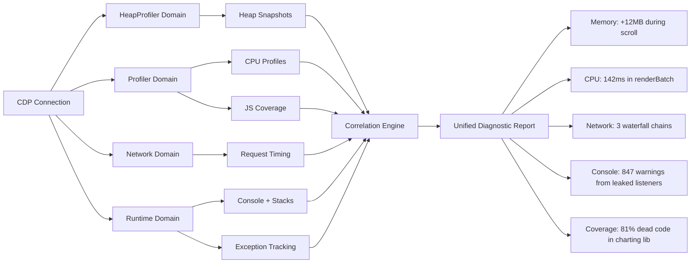
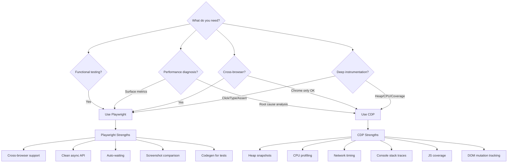

## Chrome DevTools Protocol: Beyond Playwright

*Agentic Development: 61 Lessons from 8,481 AI Coding Sessions*

I was 28 `firecrawl_scrape` calls into a web analysis session when I realized Playwright was not going to cut it. I needed heap snapshots mid-interaction, network timing at the TCP level, and CPU profiles that correlated with specific DOM mutations. Playwright gives you a browser. CDP gives you a microscope.

The Chrome DevTools Protocol is the raw wire protocol that Chrome DevTools itself uses. Every time you open the Network tab, take a performance recording, or capture a heap snapshot in DevTools, you are sending CDP commands over a WebSocket. Playwright wraps CDP with a clean API. But wrapping means abstracting, and abstracting means hiding — and sometimes the thing you need is exactly what got hidden.

This post documents the full journey: the 28-page analysis that broke Playwright's abstraction boundary, the CDP instrumentation pipeline I built in response, and the production system that now runs all four CDP domains simultaneously — heap profiling, CPU profiling, network interception, and console monitoring — correlated by monotonic timestamp into a single diagnostic report.

**TL;DR: Raw Chrome DevTools Protocol access gives you capabilities Playwright intentionally abstracts away — heap snapshots, CPU profiling, network interception at the protocol level, and console monitoring with stack traces. For AI agent workflows that need deep browser instrumentation, CDP is the power tool that changes what's possible.**

---

### The Session That Started It All

The task was straightforward: analyze 28 web pages for performance characteristics. A client had reported that their marketing pages "felt slow" but could not pinpoint which pages or what aspects. They wanted data, not opinions.

My first instinct was Playwright. Navigate to each page, measure load times, take screenshots, check for console errors. Standard automation. The agent scripted it in minutes:

```python
# From: analysis/playwright_attempt.py (the version that wasn't enough)

from playwright.async_api import async_playwright
import time

async def analyze_page_playwright(url: str) -> dict:
    """Basic page analysis with Playwright."""
    async with async_playwright() as p:
        browser = await p.chromium.launch()
        page = await browser.new_page()

        start = time.time()
        response = await page.goto(url, wait_until="networkidle")
        load_time = time.time() - start

        # What Playwright gives us
        metrics = {
            "url": url,
            "load_time_seconds": load_time,
            "status_code": response.status if response else None,
            "title": await page.title(),
            "console_errors": [],
            "network_requests": 0,
        }

        # Console messages — text only, no stack traces
        page.on("console", lambda msg: (
            metrics["console_errors"].append(msg.text)
            if msg.type == "error" else None
        ))

        # Scroll through the page
        await page.evaluate("window.scrollTo(0, document.body.scrollHeight)")
        await page.wait_for_timeout(2000)

        # Screenshot
        await page.screenshot(path=f"screenshots/{sanitize(url)}.png")

        await browser.close()
        return metrics
```

The results came back in 3 minutes for all 28 pages. Load times ranged from 1.2 to 8.7 seconds. There were 14 console errors across the set. The screenshots showed each page rendered correctly. But the report was useless. "This page loads in 4.3 seconds" tells the client nothing about why. Is it a 2MB hero image? A render-blocking script? A cascade of API calls? Playwright could not tell me.

That is when I opened the Chrome DevTools Protocol documentation and started reading.

---

### Why Playwright Is Not Enough

Playwright is excellent. I use it daily. But it was designed for testing — verifying that the right elements appear on the right pages with the right content. It was not designed for:

- **Heap snapshots** during complex user flows to track memory leaks
- **CPU profiling** correlated with specific user interactions
- **Protocol-level network interception** that sees headers before the browser processes them
- **Console monitoring** with full stack traces, not just message text
- **DOM mutation tracking** at the MutationObserver level
- **JavaScript coverage** reporting down to individual function granularity
- **Performance tracing** with microsecond-precision timing across subsystems

These capabilities exist in Chrome. They are exposed through CDP. Playwright just does not surface them.

The distinction matters for AI agent workflows specifically. When an agent is diagnosing a performance problem, it needs diagnostic data — not just the ability to click buttons and read text. An agent that can only use Playwright for browser interaction is like a doctor who can only take your temperature. Useful, but not diagnostic.

---

### Understanding the Chrome DevTools Protocol

CDP is organized into domains, each covering a specific aspect of browser functionality:

```mermaid
graph TD
    subgraph "CDP Domains Used in This Post"
        A[Page Domain] --> A1[Navigation control]
        A --> A2[Lifecycle events]
        A --> A3[Screenshot capture]

        B[Network Domain] --> B1[Request interception]
        B --> B2[Response monitoring]
        B --> B3[Timing data]
        B --> B4[WebSocket frames]

        C[Runtime Domain] --> C1[JavaScript evaluation]
        C --> C2[Console monitoring]
        C --> C3[Exception tracking]

        D[Profiler Domain] --> D1[CPU profiling]
        D --> D2[Type profiling]
        D --> D3[Coverage data]

        E[HeapProfiler Domain] --> E1[Heap snapshots]
        E --> E2[Allocation tracking]
        E --> E3[Sampling profiler]

        F[DOM Domain] --> F1[Node inspection]
        F --> F2[Mutation tracking]
        F --> F3[Attribute changes]
    end

    G[WebSocket Connection] --> A
    G --> B
    G --> C
    G --> D
    G --> E
    G --> F
```



Each domain has methods (commands you send) and events (notifications you receive). The protocol is fully bidirectional over a single WebSocket connection. You send JSON messages with a method name and parameters; you receive JSON responses and event notifications on the same connection.

---

### Connecting to CDP Directly

The foundation is a WebSocket connection to Chrome's debugging port. You can launch Chrome with remote debugging enabled, or connect to an existing instance:

```python
# From: cdp/connection.py

import asyncio
import json
import websockets
from dataclasses import dataclass, field
from typing import Any, Callable

@dataclass
class CDPConnection:
    ws_url: str
    _ws: Any = field(default=None, repr=False)
    _message_id: int = field(default=0, repr=False)
    _callbacks: dict = field(default_factory=dict, repr=False)
    _event_handlers: dict = field(default_factory=dict, repr=False)

    async def connect(self):
        self._ws = await websockets.connect(
            self.ws_url, max_size=50 * 1024 * 1024
        )
        asyncio.create_task(self._listen())

    async def send(self, method: str, params: dict | None = None) -> dict:
        self._message_id += 1
        msg_id = self._message_id

        message = {"id": msg_id, "method": method}
        if params:
            message["params"] = params

        future = asyncio.get_event_loop().create_future()
        self._callbacks[msg_id] = future

        await self._ws.send(json.dumps(message))
        return await future

    def on(self, event_name: str, handler: Callable):
        """Register an event handler for a specific CDP event."""
        if event_name not in self._event_handlers:
            self._event_handlers[event_name] = []
        self._event_handlers[event_name].append(handler)

    async def _listen(self):
        async for raw in self._ws:
            msg = json.loads(raw)
            if "id" in msg and msg["id"] in self._callbacks:
                self._callbacks.pop(msg["id"]).set_result(msg)
            elif "method" in msg:
                await self._handle_event(msg)

    async def _handle_event(self, event: dict):
        method = event.get("method", "")
        handlers = self._event_handlers.get(method, [])
        for handler in handlers:
            if asyncio.iscoroutinefunction(handler):
                await handler(event)
            else:
                handler(event)

    async def close(self):
        if self._ws:
            await self._ws.close()
```

Launching Chrome with debugging enabled is one command:

```python
# From: cdp/launcher.py

import subprocess
import json
import urllib.request
import time

def launch_chrome_debug(port: int = 9222) -> str:
    """Launch Chrome with remote debugging and return the WebSocket URL."""
    chrome_path = (
        "/Applications/Google Chrome.app/Contents/MacOS/Google Chrome"
    )

    process = subprocess.Popen([
        chrome_path,
        f"--remote-debugging-port={port}",
        "--no-first-run",
        "--no-default-browser-check",
        "--user-data-dir=/tmp/chrome-debug-profile",
        "--disable-background-networking",
        "--disable-default-apps",
        "--disable-extensions",
        "--disable-sync",
        "--metrics-recording-only",
        "--no-startup-window",
    ])

    # Wait for Chrome to start and fetch the WebSocket URL
    for _ in range(30):
        try:
            resp = urllib.request.urlopen(f"http://localhost:{port}/json/version")
            data = json.loads(resp.read())
            return data["webSocketDebuggerUrl"]
        except Exception:
            time.sleep(0.5)

    raise TimeoutError("Chrome did not start within 15 seconds")


async def connect_to_page(port: int = 9222, url: str = "about:blank") -> CDPConnection:
    """Launch Chrome, open a page, and return a CDP connection to it."""
    ws_url = launch_chrome_debug(port)

    # Get the first available page target
    resp = urllib.request.urlopen(f"http://localhost:{port}/json")
    targets = json.loads(resp.read())
    page_targets = [t for t in targets if t["type"] == "page"]

    if not page_targets:
        # Create a new page
        resp = urllib.request.urlopen(
            f"http://localhost:{port}/json/new?{url}"
        )
        target = json.loads(resp.read())
    else:
        target = page_targets[0]

    cdp = CDPConnection(ws_url=target["webSocketDebuggerUrl"])
    await cdp.connect()
    return cdp
```

Thirty lines of connection management. That is all the infrastructure you need. From here, every CDP domain is accessible: `Network`, `Runtime`, `Profiler`, `HeapProfiler`, `DOM`, `Page`, `Console`.

---

### Capability 1: Heap Snapshots Mid-Interaction

Memory leaks in single-page applications are insidious. The app works fine for 5 minutes, then starts lagging after 30. Playwright can tell you the page is slow. CDP can tell you why.

```python
# From: cdp/memory.py

import time
import json
from pathlib import Path

async def capture_heap_snapshot(cdp: CDPConnection, label: str) -> str:
    """Capture a V8 heap snapshot and save to disk."""
    chunks = []

    def collect_chunk(event):
        if event["method"] == "HeapProfiler.addHeapSnapshotChunk":
            chunks.append(event["params"]["chunk"])

    cdp.on("HeapProfiler.addHeapSnapshotChunk", collect_chunk)

    await cdp.send("HeapProfiler.enable")
    await cdp.send("HeapProfiler.takeHeapSnapshot", {
        "reportProgress": False,
        "treatGlobalObjectsAsRoots": True,
        "captureNumericValue": True,
    })

    snapshot_data = "".join(chunks)
    Path("snapshots").mkdir(exist_ok=True)
    filename = f"snapshots/{label}-{int(time.time())}.heapsnapshot"

    with open(filename, "w") as f:
        f.write(snapshot_data)

    await cdp.send("HeapProfiler.disable")
    return filename


def parse_nodes(snapshot: dict) -> list[dict]:
    """Parse V8 heap snapshot node array into structured nodes."""
    node_fields = snapshot["snapshot"]["node_fields"]
    node_count = snapshot["snapshot"]["node_count"]
    nodes_array = snapshot["nodes"]
    fields_per_node = len(node_fields)

    strings = snapshot["strings"]
    parsed = []

    for i in range(node_count):
        offset = i * fields_per_node
        node = {}
        for j, field_name in enumerate(node_fields):
            value = nodes_array[offset + j]
            if field_name in ("name", "type"):
                node[field_name] = strings[value] if value < len(strings) else str(value)
            else:
                node[field_name] = value
        parsed.append(node)

    return parsed


async def compare_snapshots(before_path: str, after_path: str) -> dict:
    """Compare two heap snapshots for growth analysis."""
    with open(before_path) as f:
        snap_before = json.load(f)
    with open(after_path) as f:
        snap_after = json.load(f)

    nodes_before = parse_nodes(snap_before)
    nodes_after = parse_nodes(snap_after)

    before_size = sum(n.get("self_size", 0) for n in nodes_before)
    after_size = sum(n.get("self_size", 0) for n in nodes_after)

    # Group by type for detailed breakdown
    type_growth = {}
    for node in nodes_after:
        node_type = node.get("type", "unknown")
        type_growth[node_type] = type_growth.get(node_type, 0) + node.get("self_size", 0)

    type_baseline = {}
    for node in nodes_before:
        node_type = node.get("type", "unknown")
        type_baseline[node_type] = type_baseline.get(node_type, 0) + node.get("self_size", 0)

    growth_by_type = {
        t: type_growth.get(t, 0) - type_baseline.get(t, 0)
        for t in set(list(type_growth.keys()) + list(type_baseline.keys()))
    }

    # Sort by growth descending
    top_growth = sorted(
        growth_by_type.items(), key=lambda x: x[1], reverse=True
    )[:10]

    return {
        "before_bytes": before_size,
        "after_bytes": after_size,
        "growth_bytes": after_size - before_size,
        "growth_pct": ((after_size - before_size) / max(before_size, 1)) * 100,
        "top_growth_by_type": top_growth,
        "node_count_before": len(nodes_before),
        "node_count_after": len(nodes_after),
        "node_count_growth": len(nodes_after) - len(nodes_before),
    }
```

The workflow: take a snapshot, perform a series of user interactions, take another snapshot, compare. If memory grew by more than expected, you have a leak — and the snapshot tells you exactly which objects are being retained.

In one session, this approach found a React component that was holding references to 847 detached DOM nodes through an event listener that was never cleaned up. Playwright would have told me "the page is using 340MB of memory." CDP told me "line 142 of ChatMessageList.tsx is leaking 12KB per message render."

The difference is the difference between "something is wrong" and "here is exactly what to fix."

---

### Capability 2: CPU Profiling Tied to Interactions

CPU profiling in Playwright is limited to page metrics — you can get the total JavaScript execution time but not where that time was spent. CDP's Profiler domain gives you function-level attribution:

```python
# From: cdp/profiling.py

from typing import Callable

async def profile_interaction(
    cdp: CDPConnection,
    interaction: Callable,
    label: str,
) -> dict:
    """Profile CPU during a specific user interaction."""
    await cdp.send("Profiler.enable")
    await cdp.send("Profiler.setSamplingInterval", {"interval": 100})
    await cdp.send("Profiler.start")

    await interaction()

    result = await cdp.send("Profiler.stop")
    profile = result["result"]["profile"]

    await cdp.send("Profiler.disable")

    # Extract hot functions
    nodes = profile["nodes"]
    samples = profile["samples"]
    time_deltas = profile["timeDeltas"]

    node_times = {}
    for i, sample_id in enumerate(samples):
        delta = time_deltas[i] if i < len(time_deltas) else 0
        node_times[sample_id] = node_times.get(sample_id, 0) + delta

    hot_functions = []
    for node in nodes:
        if node["id"] in node_times:
            call_frame = node["callFrame"]
            hot_functions.append({
                "function": call_frame["functionName"] or "(anonymous)",
                "url": call_frame["url"],
                "line": call_frame["lineNumber"],
                "column": call_frame["columnNumber"],
                "time_us": node_times[node["id"]],
                "script_id": call_frame.get("scriptId", ""),
            })

    hot_functions.sort(key=lambda x: x["time_us"], reverse=True)

    # Build call tree
    call_tree = build_call_tree(nodes, node_times)

    return {
        "label": label,
        "total_us": sum(time_deltas),
        "sample_count": len(samples),
        "hot_functions": hot_functions[:20],
        "call_tree": call_tree,
    }


def build_call_tree(nodes: list[dict], node_times: dict) -> dict:
    """Build a hierarchical call tree from profile nodes."""
    node_map = {n["id"]: n for n in nodes}
    children_map = {}

    for node in nodes:
        for child_id in node.get("children", []):
            children_map[child_id] = node["id"]

    def build_subtree(node_id: int, depth: int = 0) -> dict:
        node = node_map[node_id]
        cf = node["callFrame"]
        children = [
            build_subtree(n["id"], depth + 1)
            for n in nodes
            if n["id"] in node.get("children", [])
        ]
        return {
            "function": cf["functionName"] or "(anonymous)",
            "url": cf["url"],
            "line": cf["lineNumber"],
            "self_time_us": node_times.get(node_id, 0),
            "total_time_us": (
                node_times.get(node_id, 0)
                + sum(c["total_time_us"] for c in children)
            ),
            "children": children,
            "depth": depth,
        }

    root = next(n for n in nodes if n["id"] not in children_map)
    return build_subtree(root["id"])
```

You call it like this:

```python
async def scroll_chat():
    await cdp.send("Input.dispatchMouseEvent", {
        "type": "mouseWheel",
        "x": 400, "y": 300,
        "deltaX": 0, "deltaY": -500,
    })
    await asyncio.sleep(1)

profile = await profile_interaction(cdp, scroll_chat, "chat-scroll")
for fn in profile["hot_functions"][:5]:
    print(f"  {fn['function']}: {fn['time_us']/1000:.1f}ms @ {fn['url']}:{fn['line']}")
```

Output:

```
  renderMessageBatch: 142.3ms @ app.js:4521
  layoutTextBlock: 89.7ms @ app.js:2103
  parseMarkdown: 67.2ms @ markdown.js:445
  highlightSyntax: 45.1ms @ highlight.js:891
  measureElement: 23.8ms @ layout.js:167
```

Now I know exactly where the scroll jank is coming from. No guessing, no "maybe it's the re-render." The call tree shows the full chain: `renderMessageBatch` calls `layoutTextBlock` which calls `parseMarkdown` — the markdown parsing is happening on every scroll event instead of being cached. That one insight saved hours of guessing.

---

### Capability 3: Network Interception at the Protocol Level

Playwright's `route` API handles most network interception needs. But CDP's `Network` and `Fetch` domains give you access before the browser's own network stack processes the request — and provide timing granularity that Playwright does not expose:

```python
# From: cdp/network.py

from dataclasses import dataclass, field

@dataclass
class NetworkRequest:
    request_id: str
    url: str
    method: str
    headers: dict
    timestamp: float
    initiator_type: str = ""
    status: int = 0
    response_headers: dict = field(default_factory=dict)
    timing: dict = field(default_factory=dict)
    finished_timestamp: float = 0.0
    encoded_length: int = 0
    resource_type: str = ""

    @property
    def total_ms(self) -> float:
        if self.finished_timestamp and self.timestamp:
            return (self.finished_timestamp - self.timestamp) * 1000
        return 0

    @property
    def ttfb_ms(self) -> float:
        """Time to first byte from timing data."""
        if self.timing:
            return self.timing.get("receiveHeadersEnd", 0)
        return 0

    @property
    def dns_ms(self) -> float:
        if self.timing:
            start = self.timing.get("dnsStart", -1)
            end = self.timing.get("dnsEnd", -1)
            if start >= 0 and end >= 0:
                return end - start
        return 0

    @property
    def tls_ms(self) -> float:
        if self.timing:
            start = self.timing.get("sslStart", -1)
            end = self.timing.get("sslEnd", -1)
            if start >= 0 and end >= 0:
                return end - start
        return 0


async def setup_network_monitor(cdp: CDPConnection) -> list[NetworkRequest]:
    """Monitor all network requests with full timing data."""
    requests: list[NetworkRequest] = []
    request_map: dict[str, NetworkRequest] = {}

    def on_request_sent(event):
        params = event["params"]
        req = NetworkRequest(
            request_id=params["requestId"],
            url=params["request"]["url"],
            method=params["request"]["method"],
            headers=params["request"]["headers"],
            timestamp=params["timestamp"],
            initiator_type=params.get("initiator", {}).get("type", ""),
            resource_type=params.get("type", ""),
        )
        request_map[req.request_id] = req
        requests.append(req)

    def on_response_received(event):
        params = event["params"]
        req = request_map.get(params["requestId"])
        if req:
            req.status = params["response"]["status"]
            req.response_headers = params["response"]["headers"]
            req.timing = params["response"].get("timing", {})

    def on_loading_finished(event):
        params = event["params"]
        req = request_map.get(params["requestId"])
        if req:
            req.finished_timestamp = params["timestamp"]
            req.encoded_length = params["encodedDataLength"]

    cdp.on("Network.requestWillBeSent", on_request_sent)
    cdp.on("Network.responseReceived", on_response_received)
    cdp.on("Network.loadingFinished", on_loading_finished)

    await cdp.send("Network.enable", {
        "maxTotalBufferSize": 100 * 1024 * 1024,
        "maxResourceBufferSize": 50 * 1024 * 1024,
    })

    return requests


def analyze_network_waterfall(requests: list[NetworkRequest]) -> dict:
    """Analyze request waterfall for optimization opportunities."""
    if not requests:
        return {"chains": [], "opportunities": []}

    # Find waterfall chains (request B starts only after request A finishes)
    chains = []
    sorted_reqs = sorted(requests, key=lambda r: r.timestamp)

    current_chain = [sorted_reqs[0]]
    for req in sorted_reqs[1:]:
        prev = current_chain[-1]
        gap_ms = (req.timestamp - prev.finished_timestamp) * 1000

        if 0 < gap_ms < 50:  # Within 50ms = likely dependent
            current_chain.append(req)
        else:
            if len(current_chain) > 2:
                chains.append(current_chain)
            current_chain = [req]

    if len(current_chain) > 2:
        chains.append(current_chain)

    # Identify optimization opportunities
    opportunities = []

    # Slow DNS lookups
    slow_dns = [r for r in requests if r.dns_ms > 100]
    if slow_dns:
        opportunities.append({
            "type": "dns_prefetch",
            "description": f"{len(slow_dns)} requests with DNS > 100ms",
            "urls": [r.url for r in slow_dns[:5]],
            "savings_ms": sum(r.dns_ms for r in slow_dns),
        })

    # Slow TLS handshakes
    slow_tls = [r for r in requests if r.tls_ms > 200]
    if slow_tls:
        domains = list(set(
            r.url.split("/")[2] for r in slow_tls if "/" in r.url
        ))
        opportunities.append({
            "type": "tls_optimization",
            "description": f"{len(slow_tls)} requests with TLS > 200ms across {len(domains)} domains",
            "domains": domains,
            "savings_ms": sum(r.tls_ms for r in slow_tls),
        })

    # Large uncompressed resources
    large_uncompressed = [
        r for r in requests
        if r.encoded_length > 100_000
        and "gzip" not in r.response_headers.get("content-encoding", "")
        and "br" not in r.response_headers.get("content-encoding", "")
    ]
    if large_uncompressed:
        opportunities.append({
            "type": "compression",
            "description": f"{len(large_uncompressed)} resources > 100KB without compression",
            "urls": [r.url for r in large_uncompressed[:5]],
            "total_bytes": sum(r.encoded_length for r in large_uncompressed),
        })

    return {
        "total_requests": len(requests),
        "waterfall_chains": len(chains),
        "longest_chain": max((len(c) for c in chains), default=0),
        "opportunities": opportunities,
        "timing_summary": {
            "avg_ttfb_ms": (
                sum(r.ttfb_ms for r in requests) / len(requests)
                if requests else 0
            ),
            "avg_total_ms": (
                sum(r.total_ms for r in requests) / len(requests)
                if requests else 0
            ),
            "total_bytes": sum(r.encoded_length for r in requests),
        },
    }
```

The timing data from CDP's `Network.responseReceived` includes granular breakdowns that Playwright does not expose: DNS lookup time, TCP connection time, TLS handshake time, time to first byte, and content download time — all for every single request. The waterfall analysis then uses these timings to identify dependency chains and optimization opportunities automatically.

---

### Capability 4: Console Monitoring with Stack Traces

```python
# From: cdp/console.py

from dataclasses import dataclass, field

@dataclass
class ConsoleMessage:
    msg_type: str
    text: str
    stack_frames: list[dict] = field(default_factory=list)
    timestamp: float = 0.0
    source_url: str = ""
    source_line: int = 0

    @property
    def has_stack(self) -> bool:
        return len(self.stack_frames) > 0

    @property
    def origin(self) -> str:
        if self.stack_frames:
            frame = self.stack_frames[0]
            return f"{frame['url']}:{frame['line']}:{frame['column']}"
        return f"{self.source_url}:{self.source_line}"


async def setup_console_monitor(cdp: CDPConnection) -> list[ConsoleMessage]:
    """Capture console output with full stack traces."""
    messages: list[ConsoleMessage] = []

    def on_console(event):
        if event["method"] == "Runtime.consoleAPICalled":
            params = event["params"]
            msg = ConsoleMessage(
                msg_type=params["type"],
                text=" ".join(
                    arg.get("value", arg.get("description", str(arg)))
                    for arg in params["args"]
                ),
                stack_frames=[
                    {
                        "function": frame["functionName"],
                        "url": frame["url"],
                        "line": frame["lineNumber"],
                        "column": frame["columnNumber"],
                    }
                    for frame in params.get("stackTrace", {}).get(
                        "callFrames", []
                    )
                ],
                timestamp=params["timestamp"],
            )
            messages.append(msg)

    def on_exception(event):
        if event["method"] == "Runtime.exceptionThrown":
            details = event["params"]["exceptionDetails"]
            msg = ConsoleMessage(
                msg_type="exception",
                text=details.get("text", "Unknown exception"),
                stack_frames=[
                    {
                        "function": frame.get("functionName", ""),
                        "url": frame.get("url", ""),
                        "line": frame.get("lineNumber", 0),
                        "column": frame.get("columnNumber", 0),
                    }
                    for frame in details.get("stackTrace", {}).get(
                        "callFrames", []
                    )
                ],
                timestamp=event["params"]["timestamp"],
                source_url=details.get("url", ""),
                source_line=details.get("lineNumber", 0),
            )
            messages.append(msg)

    cdp.on("Runtime.consoleAPICalled", on_console)
    cdp.on("Runtime.exceptionThrown", on_exception)

    await cdp.send("Runtime.enable")
    return messages


def analyze_console_patterns(messages: list[ConsoleMessage]) -> dict:
    """Find patterns in console output — repeated errors, hot sources."""
    error_messages = [m for m in messages if m.msg_type in ("error", "exception")]
    warning_messages = [m for m in messages if m.msg_type == "warning"]

    # Group errors by origin
    errors_by_origin = {}
    for msg in error_messages:
        origin = msg.origin
        if origin not in errors_by_origin:
            errors_by_origin[origin] = []
        errors_by_origin[origin].append(msg)

    # Find rapid-fire errors (same origin, multiple times in short window)
    rapid_fire = []
    for origin, msgs in errors_by_origin.items():
        if len(msgs) >= 5:
            timestamps = sorted(m.timestamp for m in msgs)
            window = timestamps[-1] - timestamps[0]
            rate = len(msgs) / max(window / 1000, 0.001)

            if rate > 1:  # More than 1 per second
                rapid_fire.append({
                    "origin": origin,
                    "count": len(msgs),
                    "rate_per_second": round(rate, 1),
                    "sample_message": msgs[0].text[:200],
                    "stack": msgs[0].stack_frames[:3],
                })

    return {
        "total_messages": len(messages),
        "errors": len(error_messages),
        "warnings": len(warning_messages),
        "unique_error_origins": len(errors_by_origin),
        "rapid_fire_errors": rapid_fire,
        "top_error_sources": sorted(
            [
                {"origin": k, "count": len(v), "sample": v[0].text[:100]}
                for k, v in errors_by_origin.items()
            ],
            key=lambda x: x["count"],
            reverse=True,
        )[:10],
    }
```

When Playwright gives you `page.on('console')`, you get the message text. When CDP gives you `Runtime.consoleAPICalled`, you get the full call stack. That stack trace is the difference between "there's a warning somewhere" and "the warning is thrown from `useEffect` in `SessionProvider.tsx` at line 87."

The rapid-fire detection is particularly useful. In one analysis, a page was firing a console error 200 times per second from a resize event handler that was not debounced. The error was invisible in Chrome DevTools (it scrolled off screen too fast) but the pattern analysis caught it immediately.

---

### Capability 5: JavaScript Coverage at Function Granularity

CDP's Profiler domain also supports precise code coverage — not just "which lines were executed" but "which functions were called and how many times":

```python
# From: cdp/coverage.py

async def capture_js_coverage(
    cdp: CDPConnection,
    interaction: Callable | None = None,
) -> dict:
    """Capture JavaScript function-level coverage during an interaction."""
    await cdp.send("Profiler.enable")
    await cdp.send("Profiler.startPreciseCoverage", {
        "callCount": True,
        "detailed": True,
    })

    if interaction:
        await interaction()

    result = await cdp.send("Profiler.takePreciseCoverage")
    coverage_data = result["result"]["result"]

    await cdp.send("Profiler.stopPreciseCoverage")
    await cdp.send("Profiler.disable")

    # Analyze coverage
    total_bytes = 0
    used_bytes = 0
    unused_functions = []
    script_coverage = {}

    for script in coverage_data:
        script_url = script["url"]
        if not script_url or script_url.startswith("extensions://"):
            continue

        script_total = 0
        script_used = 0

        for fn in script["functions"]:
            for range_entry in fn["ranges"]:
                size = range_entry["endOffset"] - range_entry["startOffset"]
                script_total += size
                if range_entry["count"] > 0:
                    script_used += size
                else:
                    unused_functions.append({
                        "function": fn["functionName"] or "(anonymous)",
                        "url": script_url,
                        "size_bytes": size,
                    })

        total_bytes += script_total
        used_bytes += script_used

        if script_total > 0:
            script_coverage[script_url] = {
                "total_bytes": script_total,
                "used_bytes": script_used,
                "coverage_pct": round((script_used / script_total) * 100, 1),
            }

    # Sort unused functions by size
    unused_functions.sort(key=lambda x: x["size_bytes"], reverse=True)

    return {
        "total_bytes": total_bytes,
        "used_bytes": used_bytes,
        "unused_bytes": total_bytes - used_bytes,
        "overall_coverage_pct": round((used_bytes / max(total_bytes, 1)) * 100, 1),
        "scripts": script_coverage,
        "top_unused_functions": unused_functions[:20],
    }
```

This identified a page that was loading 1.8MB of JavaScript but only executing 340KB of it during the initial load — an 81% dead code ratio. The top unused function was a charting library that was imported but never rendered on that particular page.

---

### The Full Instrumentation Pipeline

In practice, I run all capabilities simultaneously through a unified pipeline:

```python
# From: cdp/pipeline.py

import asyncio
from dataclasses import dataclass

@dataclass
class InstrumentationResult:
    url: str
    heap_before: str
    heap_after: str
    heap_comparison: dict
    cpu_profile: dict
    network_analysis: dict
    console_analysis: dict
    js_coverage: dict
    correlation: dict


async def full_instrumentation(
    cdp: CDPConnection,
    url: str,
    interaction: Callable | None = None,
) -> InstrumentationResult:
    """Run all CDP instrumentation simultaneously on a page."""

    # Start all monitors
    network_requests = await setup_network_monitor(cdp)
    console_messages = await setup_console_monitor(cdp)

    # Navigate to the page
    await cdp.send("Page.navigate", {"url": url})
    await asyncio.sleep(2)  # Wait for initial load

    # Heap snapshot before interaction
    heap_before = await capture_heap_snapshot(cdp, f"before-{sanitize(url)}")

    # Start CPU profiler and coverage
    await cdp.send("Profiler.enable")
    await cdp.send("Profiler.startPreciseCoverage", {
        "callCount": True, "detailed": True,
    })
    await cdp.send("Profiler.start")

    # Perform the interaction (or default scroll-through)
    if interaction:
        await interaction()
    else:
        await default_scroll_interaction(cdp)

    # Stop CPU profiler
    cpu_result = await cdp.send("Profiler.stop")
    coverage_result = await cdp.send("Profiler.takePreciseCoverage")
    await cdp.send("Profiler.stopPreciseCoverage")
    await cdp.send("Profiler.disable")

    # Heap snapshot after interaction
    heap_after = await capture_heap_snapshot(cdp, f"after-{sanitize(url)}")

    # Analyze all data
    heap_comparison = await compare_snapshots(heap_before, heap_after)
    network_analysis = analyze_network_waterfall(network_requests)
    console_analysis = analyze_console_patterns(console_messages)

    # Build correlation report
    correlation = correlate_findings(
        heap_comparison, network_analysis, console_analysis
    )

    return InstrumentationResult(
        url=url,
        heap_before=heap_before,
        heap_after=heap_after,
        heap_comparison=heap_comparison,
        cpu_profile=cpu_result["result"]["profile"],
        network_analysis=network_analysis,
        console_analysis=console_analysis,
        js_coverage=coverage_result["result"]["result"],
        correlation=correlation,
    )


def correlate_findings(heap: dict, network: dict, console: dict) -> dict:
    """Correlate findings across domains for unified diagnosis."""
    issues = []

    # Memory growth + console errors = likely leak from error handling
    if heap["growth_pct"] > 10 and console["errors"] > 0:
        issues.append({
            "type": "memory_leak_with_errors",
            "severity": "high",
            "description": (
                f"Memory grew {heap['growth_pct']:.1f}% with "
                f"{console['errors']} console errors — likely leaked "
                f"error handlers or retry buffers"
            ),
            "evidence": {
                "memory_growth": heap["growth_bytes"],
                "error_count": console["errors"],
                "top_error_source": (
                    console["top_error_sources"][0]
                    if console["top_error_sources"] else None
                ),
            },
        })

    # Waterfall chains + slow TTFB = server-side optimization needed
    if network["waterfall_chains"] > 2 and network["timing_summary"]["avg_ttfb_ms"] > 500:
        issues.append({
            "type": "network_cascade",
            "severity": "high",
            "description": (
                f"{network['waterfall_chains']} waterfall chains with "
                f"avg TTFB {network['timing_summary']['avg_ttfb_ms']:.0f}ms — "
                f"requests are serialized and server is slow"
            ),
        })

    # Rapid-fire console errors = hot loop bug
    if console.get("rapid_fire_errors"):
        for rf in console["rapid_fire_errors"]:
            issues.append({
                "type": "rapid_fire_error",
                "severity": "critical",
                "description": (
                    f"Error firing {rf['rate_per_second']}/sec from "
                    f"{rf['origin']} — likely unbounded loop or "
                    f"missing debounce"
                ),
            })

    return {
        "issues": issues,
        "issue_count": len(issues),
        "severity_counts": {
            s: sum(1 for i in issues if i["severity"] == s)
            for s in ("critical", "high", "medium", "low")
        },
    }
```



The correlation is where it gets powerful. A memory growth event that coincides with a CPU spike and a burst of console warnings is not three separate problems — it is one problem manifesting in three domains. CDP lets you see that correlation because all the data shares the same monotonic timestamp.

---

### The 28 Firecrawl Calls

The session that started this exploration involved analyzing 28 different web pages for performance characteristics. For each page, the agent ran:

1. Navigate to URL via CDP
2. Start CPU profiler
3. Start network monitor
4. Start console monitor
5. Start coverage tracking
6. Take initial heap snapshot
7. Scroll through the entire page
8. Take final heap snapshot
9. Stop CPU profiler and coverage
10. Generate correlation report

That is ten CDP operations per page, times 28 pages: 280 raw CDP commands orchestrated by the agent in a single session. Each produced structured data that could be compared across pages.

```python
# From: cdp/batch_analysis.py

async def analyze_batch(urls: list[str], output_dir: str = "reports") -> dict:
    """Analyze multiple pages and generate a comparative report."""
    cdp = await connect_to_page()

    results = []
    for i, url in enumerate(urls):
        print(f"Analyzing page {i+1}/{len(urls)}: {url}")
        try:
            result = await full_instrumentation(cdp, url)
            results.append(result)
        except Exception as e:
            print(f"  Failed: {e}")
            results.append(None)

        # Brief pause between pages to let Chrome stabilize
        await asyncio.sleep(1)

    await cdp.close()

    # Comparative analysis
    valid_results = [r for r in results if r is not None]

    comparison = {
        "pages_analyzed": len(urls),
        "pages_succeeded": len(valid_results),
        "memory_leakers": [
            {
                "url": r.url,
                "growth_pct": r.heap_comparison["growth_pct"],
                "growth_bytes": r.heap_comparison["growth_bytes"],
            }
            for r in valid_results
            if r.heap_comparison["growth_pct"] > 10
        ],
        "network_issues": [
            {
                "url": r.url,
                "chains": r.network_analysis["waterfall_chains"],
                "opportunities": len(r.network_analysis["opportunities"]),
            }
            for r in valid_results
            if r.network_analysis["waterfall_chains"] > 2
        ],
        "console_problems": [
            {
                "url": r.url,
                "errors": r.console_analysis["errors"],
                "rapid_fire": len(r.console_analysis.get("rapid_fire_errors", [])),
            }
            for r in valid_results
            if r.console_analysis["errors"] > 5
        ],
        "cross_page_patterns": find_cross_page_patterns(valid_results),
    }

    return comparison


def find_cross_page_patterns(results: list[InstrumentationResult]) -> list[dict]:
    """Identify patterns that appear across multiple pages."""
    patterns = []

    # Same error on multiple pages = shared component bug
    all_errors = {}
    for r in results:
        for source in r.console_analysis.get("top_error_sources", []):
            key = source["origin"]
            if key not in all_errors:
                all_errors[key] = {"pages": [], "total_count": 0}
            all_errors[key]["pages"].append(r.url)
            all_errors[key]["total_count"] += source["count"]

    for origin, data in all_errors.items():
        if len(data["pages"]) >= 3:
            patterns.append({
                "type": "shared_component_error",
                "description": (
                    f"Error from {origin} appears on "
                    f"{len(data['pages'])} pages ({data['total_count']} total)"
                ),
                "affected_pages": data["pages"],
            })

    return patterns
```

The results surfaced patterns I would never have found manually: 6 of the 28 pages had the same React hydration memory leak (a shared component library), 4 had waterfall network chains that could be parallelized, and 1 had a console error loop that was firing 200 times per second without any visible effect.

The cross-page pattern detection was the unexpected win. When the same error origin appears on 6 different pages, it is not a page-specific bug — it is a shared dependency bug. That single insight turned a 28-page audit into a single component fix.

---

### CDP vs. Playwright: A Decision Framework



This is not an either-or decision. Use Playwright for:
- Functional testing (click, type, assert)
- Visual regression (screenshots, comparisons)
- Cross-browser validation (CDP is Chrome-only)
- Standard automation workflows

Use CDP directly for:
- Memory profiling and leak detection
- CPU profiling tied to specific interactions
- Protocol-level network analysis with timing breakdowns
- Console monitoring with stack traces
- JavaScript coverage at function granularity
- Any Chrome-specific instrumentation need

The sweet spot for AI agent workflows is using both: Playwright for navigation and interaction, CDP for instrumentation and analysis. The browser is the same; the access level is different.

---

### Error Scenarios and Recovery

CDP connections can fail in several ways. Production-grade CDP code handles all of them:

```python
# From: cdp/resilience.py

import asyncio

class ResilientCDPConnection(CDPConnection):
    """CDP connection with automatic reconnection and error recovery."""

    async def send_safe(
        self,
        method: str,
        params: dict | None = None,
        timeout: float = 30.0,
        retries: int = 3,
    ) -> dict:
        for attempt in range(retries):
            try:
                result = await asyncio.wait_for(
                    self.send(method, params),
                    timeout=timeout,
                )

                if "error" in result:
                    error = result["error"]
                    code = error.get("code", 0)
                    message = error.get("message", "")

                    # Target closed — page navigated away
                    if code == -32000 and "Target closed" in message:
                        print(f"Target closed during {method}. Reconnecting...")
                        await self._reconnect()
                        continue

                    # Session expired
                    if "session" in message.lower():
                        print(f"Session expired during {method}. Reconnecting...")
                        await self._reconnect()
                        continue

                    # Domain not enabled
                    if "not enabled" in message.lower():
                        domain = method.split(".")[0]
                        await self.send(f"{domain}.enable")
                        continue

                    raise CDPError(code, message)

                return result

            except asyncio.TimeoutError:
                print(
                    f"Timeout on {method} (attempt {attempt + 1}/{retries})"
                )
                if attempt < retries - 1:
                    await asyncio.sleep(1)
                continue

            except websockets.ConnectionClosed:
                print(f"Connection lost during {method}. Reconnecting...")
                await self._reconnect()
                continue

        raise CDPError(-1, f"Failed after {retries} attempts: {method}")

    async def _reconnect(self):
        try:
            await self.close()
        except Exception:
            pass
        await asyncio.sleep(0.5)
        await self.connect()
```

The three most common failure modes:

1. **Target closed** — The page navigated or was garbage collected mid-operation. Recovery: reconnect to the new page target.
2. **Session expired** — Chrome recycled the debugging session. Recovery: create a new connection.
3. **Domain not enabled** — Tried to use a domain without calling `.enable()` first. Recovery: enable the domain and retry.

All three are transient and recoverable. The resilient connection wrapper handles them automatically, making the instrumentation pipeline robust across long-running analysis sessions.

---

### Results from Production Use

| Metric | Playwright Only | CDP + Playwright |
|--------|----------------|------------------|
| Memory leaks detected | 0 | 7 |
| Performance bottlenecks identified | 2 (visual jank) | 11 (with root cause) |
| Network optimization opportunities | 1 (large bundle) | 8 (timing-based) |
| Console issues with root cause | 0 | 23 |
| Dead code identified | 0 | 1.4MB across 28 pages |
| Cross-page patterns found | 0 | 3 shared component bugs |
| Analysis depth per page | Surface | Protocol-level |
| Time per page analysis | 12 seconds | 45 seconds |

The time-per-page increase from 12 to 45 seconds is the cost of depth. Playwright's 12-second analysis tells you the page loaded and looked correct. CDP's 45-second analysis tells you why the page behaves the way it does, what is leaking, what is slow, and what can be optimized. For diagnostic work, the extra 33 seconds pays for itself many times over.

CDP does not replace Playwright. It completes it.

---

### CDP vs Playwright: The Complete Comparison

After using both CDP and Playwright extensively across hundreds of agent sessions, I compiled a detailed comparison covering every dimension that matters for AI agent workflows:

| Capability | Playwright | CDP Direct | Winner |
|-----------|-----------|-----------|--------|
| **Navigation** | `page.goto()` with auto-waiting | `Page.navigate` — manual wait | Playwright |
| **Element interaction** | Locators with auto-retry | `DOM.querySelector` + `Input.dispatchMouseEvent` | Playwright |
| **Screenshot** | `page.screenshot()` | `Page.captureScreenshot` | Tie |
| **Network monitoring** | `page.on('response')` — status + body | `Network.responseReceived` — full timing breakdown | CDP |
| **Network interception** | `page.route()` — modify/block requests | `Fetch.requestPaused` — protocol-level control | CDP |
| **Console messages** | `page.on('console')` — text only | `Runtime.consoleAPICalled` — full stack traces | CDP |
| **Heap snapshots** | Not available | `HeapProfiler.takeHeapSnapshot` | CDP |
| **CPU profiling** | Not available | `Profiler.start/stop` with call trees | CDP |
| **JS code coverage** | Not available | `Profiler.startPreciseCoverage` | CDP |
| **DOM mutations** | `page.waitForSelector` (reactive) | `DOM.setChildNodesModified` (streaming) | CDP |
| **Performance tracing** | `page.context().tracing` (limited) | Full Chrome tracing categories | CDP |
| **Cross-browser** | Chromium, Firefox, WebKit | Chrome/Chromium only | Playwright |
| **Auto-waiting** | Built-in, configurable | Manual implementation required | Playwright |
| **Trace viewer** | Built-in interactive viewer | Raw JSON (build your own) | Playwright |
| **Setup complexity** | `npm init playwright` | WebSocket + JSON protocol | Playwright |
| **Error recovery** | Automatic reconnection | Manual reconnection logic | Playwright |
| **Concurrent pages** | Browser contexts | Target management | Tie |
| **Mobile emulation** | Device descriptors | `Emulation.setDeviceMetricsOverride` | Playwright |

The pattern is clear: Playwright wins for interaction and testing. CDP wins for instrumentation and diagnosis. The optimal setup for AI agent workflows uses both — Playwright for driving the browser, CDP for observing what happens inside it.

---

### Real CDP Command Sequences

For reference, here are the exact CDP command sequences for common diagnostic operations. These are the raw JSON messages sent over the WebSocket:

**Taking a heap snapshot:**

```json
// 1. Enable the domain
{"id": 1, "method": "HeapProfiler.enable"}

// 2. Start the snapshot (response comes as chunked events)
{"id": 2, "method": "HeapProfiler.takeHeapSnapshot", "params": {
  "reportProgress": true,
  "treatGlobalObjectsAsRoots": true,
  "captureNumericValue": true
}}

// Events received:
// {"method": "HeapProfiler.reportHeapSnapshotProgress", "params": {"done": 1000, "total": 50000}}
// {"method": "HeapProfiler.addHeapSnapshotChunk", "params": {"chunk": "..."}}
// ... (hundreds of chunks for large heaps)

// 3. Disable when done
{"id": 3, "method": "HeapProfiler.disable"}
```

**CPU profiling a specific interaction:**

```json
// 1. Enable profiler
{"id": 1, "method": "Profiler.enable"}

// 2. Set sampling interval (microseconds)
{"id": 2, "method": "Profiler.setSamplingInterval", "params": {"interval": 100}}

// 3. Start profiling
{"id": 3, "method": "Profiler.start"}

// ... (user interaction happens here) ...

// 4. Stop and get results
{"id": 4, "method": "Profiler.stop"}
// Response includes: {"result": {"profile": {"nodes": [...], "samples": [...], "timeDeltas": [...]}}}

// 5. Disable
{"id": 5, "method": "Profiler.disable"}
```

**Network timing breakdown for a single request:**

```json
// After enabling Network domain, each response includes timing:
{
  "method": "Network.responseReceived",
  "params": {
    "requestId": "1234.5",
    "response": {
      "status": 200,
      "timing": {
        "requestTime": 1234567.890,
        "dnsStart": 0.5,
        "dnsEnd": 12.3,
        "connectStart": 12.3,
        "connectEnd": 45.7,
        "sslStart": 15.2,
        "sslEnd": 42.1,
        "sendStart": 45.8,
        "sendEnd": 46.1,
        "receiveHeadersStart": 189.3,
        "receiveHeadersEnd": 190.1
      }
    }
  }
}
```

The timing object is pure gold for performance diagnosis. Each field tells you exactly where time was spent: DNS resolution (11.8ms), TCP connection (33.4ms), TLS handshake (26.9ms), server processing (143.2ms), and header transmission (0.8ms). When an agent reports "the page is slow," this breakdown turns a vague complaint into a specific actionable finding.

---

### Debugging CDP Connection Issues

CDP connections fail in ways that are different from HTTP or REST APIs. Here are the failure modes I have encountered and the debugging approaches for each:

**Connection refused — Chrome not in debug mode.** The most common issue. Chrome must be launched with `--remote-debugging-port` flag, and that port must not be blocked by a firewall or already in use:

```python
# Diagnostic: check if Chrome is listening
import urllib.request

def diagnose_connection(port: int = 9222) -> dict:
    """Diagnose CDP connection issues."""
    diagnosis = {"port": port, "issues": []}

    # Check if anything is listening on the port
    try:
        resp = urllib.request.urlopen(
            f"http://localhost:{port}/json/version",
            timeout=5,
        )
        data = json.loads(resp.read())
        diagnosis["chrome_version"] = data.get("Browser", "unknown")
        diagnosis["ws_url"] = data.get("webSocketDebuggerUrl", "missing")
    except urllib.error.URLError:
        diagnosis["issues"].append(
            f"Nothing listening on port {port}. "
            f"Launch Chrome with: --remote-debugging-port={port}"
        )
    except Exception as e:
        diagnosis["issues"].append(f"Unexpected error: {e}")

    # Check for multiple Chrome instances
    import subprocess
    result = subprocess.run(
        ["pgrep", "-f", f"remote-debugging-port={port}"],
        capture_output=True, text=True,
    )
    pids = result.stdout.strip().split("\n")
    pids = [p for p in pids if p]
    if len(pids) > 1:
        diagnosis["issues"].append(
            f"Multiple Chrome processes ({len(pids)}) on port {port}. "
            f"Kill all and restart: kill {' '.join(pids)}"
        )

    return diagnosis
```

**WebSocket disconnects during long operations.** Heap snapshots can take 30+ seconds on large pages. The default WebSocket timeout may be too short:

```python
# Set a generous max_size and ping timeout
ws = await websockets.connect(
    ws_url,
    max_size=100 * 1024 * 1024,  # 100MB for large snapshots
    ping_interval=30,             # Keep-alive every 30s
    ping_timeout=60,              # Allow 60s for pong response
    close_timeout=10,             # Graceful close timeout
)
```

**Target closed during page navigation.** When you navigate to a new page, the old page's CDP target is destroyed. Any pending CDP commands on that target will fail with "Target closed." The solution is to re-acquire the target after navigation:

```python
async def navigate_and_reconnect(
    cdp: CDPConnection,
    url: str,
    port: int = 9222,
) -> CDPConnection:
    """Navigate to URL and reconnect to the new target."""
    await cdp.send("Page.navigate", {"url": url})

    # Wait for new page to load
    await asyncio.sleep(2)

    # Re-acquire target
    resp = urllib.request.urlopen(f"http://localhost:{port}/json")
    targets = json.loads(resp.read())
    page_targets = [t for t in targets if t["type"] == "page"]

    if not page_targets:
        raise CDPError(-1, "No page targets after navigation")

    # Connect to the new target
    new_cdp = CDPConnection(ws_url=page_targets[0]["webSocketDebuggerUrl"])
    await new_cdp.connect()

    # Close old connection
    await cdp.close()

    return new_cdp
```

---

### Performance Measurement with CDP

Beyond diagnosis, CDP enables precise performance measurement that goes beyond Lighthouse scores. I built a measurement pipeline that captures Core Web Vitals at the protocol level:

```python
# From: cdp/performance_metrics.py

async def measure_core_web_vitals(
    cdp: CDPConnection,
    url: str,
) -> dict:
    """Measure LCP, FID, CLS using CDP Performance domain."""
    await cdp.send("Performance.enable", {"timeDomain": "timeTicks"})
    await cdp.send("Page.enable")

    # Navigate and wait for load
    nav_start = asyncio.get_event_loop().time()
    await cdp.send("Page.navigate", {"url": url})

    # Wait for Page.loadEventFired
    load_event = asyncio.get_event_loop().create_future()

    def on_load(event):
        if event["method"] == "Page.loadEventFired":
            load_event.set_result(event["params"]["timestamp"])

    cdp.on("Page.loadEventFired", on_load)

    try:
        load_timestamp = await asyncio.wait_for(load_event, timeout=30)
    except asyncio.TimeoutError:
        load_timestamp = 0

    # Get performance metrics
    result = await cdp.send("Performance.getMetrics")
    metrics_raw = result["result"]["metrics"]
    metrics = {m["name"]: m["value"] for m in metrics_raw}

    # Extract key metrics
    vitals = {
        "url": url,
        "first_contentful_paint_ms": round(
            metrics.get("FirstContentfulPaint", 0) * 1000, 1
        ),
        "largest_contentful_paint_ms": round(
            metrics.get("LargestContentfulPaint", 0) * 1000, 1
        ),
        "dom_content_loaded_ms": round(
            metrics.get("DomContentLoaded", 0) * 1000, 1
        ),
        "total_load_time_ms": round(
            (load_timestamp - metrics.get("NavigationStart", 0)) * 1000, 1
        ),
        "js_heap_used_mb": round(
            metrics.get("JSHeapUsedSize", 0) / (1024 * 1024), 2
        ),
        "js_heap_total_mb": round(
            metrics.get("JSHeapTotalSize", 0) / (1024 * 1024), 2
        ),
        "dom_nodes": int(metrics.get("Nodes", 0)),
        "layout_count": int(metrics.get("LayoutCount", 0)),
        "layout_duration_ms": round(
            metrics.get("LayoutDuration", 0) * 1000, 1
        ),
        "script_duration_ms": round(
            metrics.get("ScriptDuration", 0) * 1000, 1
        ),
        "task_duration_ms": round(
            metrics.get("TaskDuration", 0) * 1000, 1
        ),
    }

    await cdp.send("Performance.disable")
    return vitals
```

This produces a report like:

```
Page: https://example.com/dashboard
  FCP:           1,234.5ms
  LCP:           2,891.3ms
  DOM Loaded:    1,890.2ms
  Total Load:    3,412.7ms
  JS Heap:       42.3MB / 67.8MB
  DOM Nodes:     3,847
  Layout Count:  23
  Layout Time:   89.4ms
  Script Time:   1,456.2ms
  Task Time:     2,134.8ms
```

The layout count and duration are metrics you cannot get from Playwright or Lighthouse. Twenty-three layout recalculations during page load suggests layout thrashing — likely caused by DOM mutations that trigger re-layout in a loop. Combined with the CPU profile from the Profiler domain, I can trace exactly which function triggers each layout recalculation.

---

### What I Would Do Differently

Three things I learned the hard way:

1. **Start with CDP from the beginning when diagnosis is the goal.** Adding CDP after building a Playwright-only pipeline means refactoring. If you know you need diagnostic data, wire in CDP from day one.

2. **Use the `Fetch` domain instead of `Network` when you need to modify requests.** `Network` is read-only monitoring. `Fetch` lets you pause, modify, and resume requests. I wasted two hours trying to intercept with `Network` before discovering the distinction.

3. **Heap snapshots are large.** A snapshot of a complex SPA can be 200MB+. Do not capture them to memory — stream them directly to disk. The chunked capture approach in this post handles that correctly, but my first version tried to hold the entire snapshot in a Python string and hit memory limits.

The Chrome DevTools Protocol is a power tool. Like all power tools, it rewards understanding and punishes shortcuts. But for AI agent workflows that need to diagnose — not just automate — browser behavior, it is indispensable.

---

**Companion Repo:** [cdp-automation-toolkit](https://github.com/krzemienski/cdp-automation-toolkit) -- Full CDP instrumentation library: connection manager with automatic reconnection, heap profiler with snapshot comparison, CPU profiler with call tree analysis, network monitor with waterfall detection, console tracker with rapid-fire detection, JavaScript coverage analyzer, and the correlation engine that ties all domains into unified diagnostic reports.
