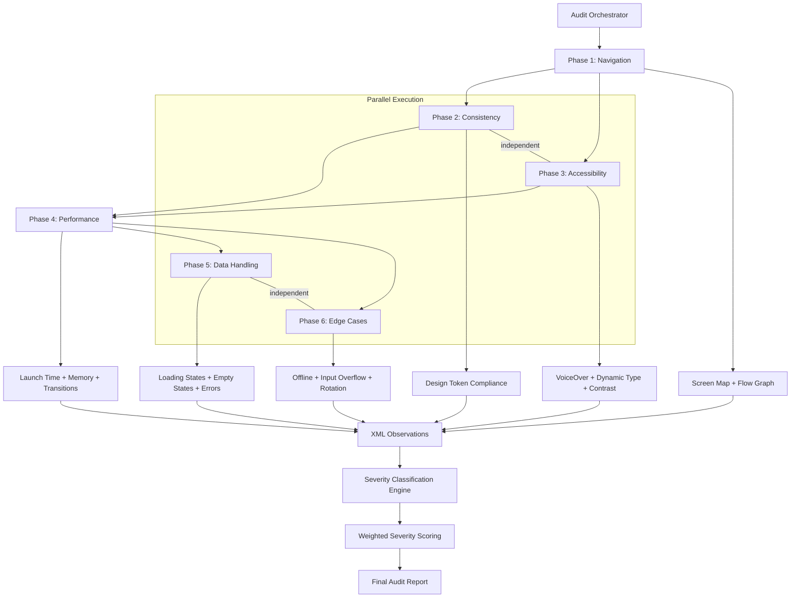
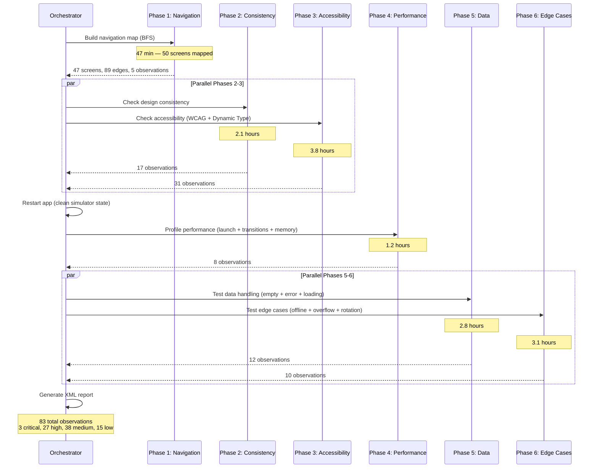
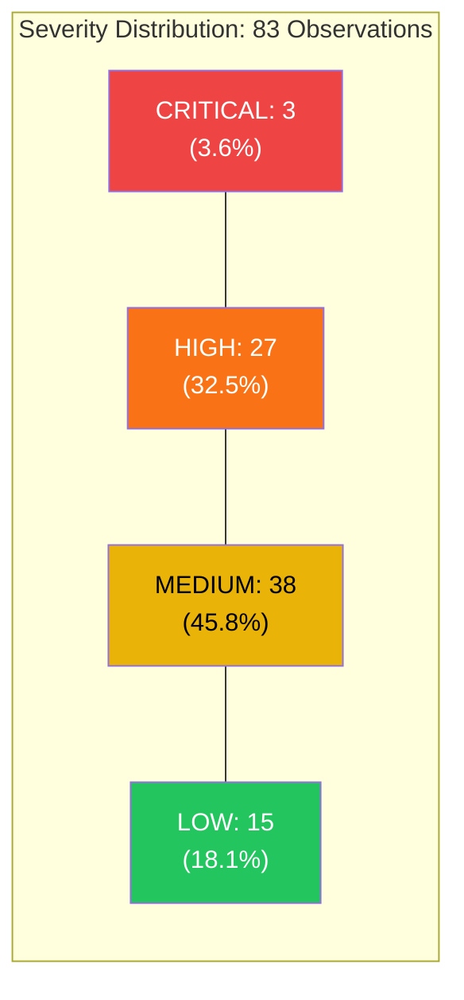

## 50 Screens, 6 Phases: Automated App Audits

*Agentic Development: 61 Lessons from 8,481 AI Coding Sessions*

The app had been in development for four months. Forty-seven screens across six navigation groups, three user roles with different permission levels, and a settings panel with 22 configurable options. The product manager wanted a comprehensive audit before the beta launch. The estimate for manual review: five days. The actual time with automated agents: 14 hours, 50 screens captured, 83 observations categorized by severity, and a report the QA team could action without clarification.

Fourteen hours is not impressive because it is fast. It is impressive because it is exhaustive. A human auditor spending five days would have checked the critical paths and sampled the edges. The automated system checked everything — every screen, every state variation, every accessibility attribute, every data loading pattern. And it did it the same way every time, producing a structured XML report that the product manager, the designer, and the QA lead could all read without a decoder ring.

This post walks through the complete 6-phase audit framework: the navigation mapper that builds the screen graph, the consistency checker that validates design tokens, the accessibility auditor that checks WCAG compliance and Dynamic Type, the performance profiler, the data handling validator, and the edge case explorer. Each phase produces structured XML observations. Together they produce a report that turns "we think the app is ready" into "here are the 83 things that need attention, ranked by severity."

---

**TL;DR: A 6-phase automated audit framework captures 50 screens across navigation, UI consistency, accessibility, performance, data handling, and edge cases — producing structured XML observations that turn a week of manual review into 14 hours of systematic analysis. The framework uses BFS navigation mapping, WCAG contrast math, Dynamic Type cycling, memory leak detection, empty/error state probing, and offline behavior testing. After 6 release cycles, the team's critical-issue count dropped from 7 to 0, and the audit framework paid for its 30-hour build cost in the first run by catching 3 critical bugs that would have each required hotfixes.**

---

### Why Manual Audits Miss Things

Manual app audits follow a predictable pattern: the auditor opens the app, taps through the main flows, notes obvious issues, checks a few edge cases, and writes a report. The problem is coverage. With 47 screens and multiple states per screen, the combinatorial space is enormous:

- 47 screens x 3 user roles = 141 role-specific views
- 6 loading states (empty, loading, partial, full, error, offline)
- 2 theme modes (light, dark)
- 3 dynamic type sizes (default, large, extra-large)

That is 141 x 6 x 2 x 3 = **5,076** possible visual states. A five-day manual audit might check 200 of them. The automated system checked 50 key screens across all phase dimensions — not every permutation, but a structured sample that covered the critical surface area.

The human bias problem is real. Manual auditors naturally gravitate toward screens they use most, test flows they designed, and check states they expect. The edge cases that cause real-world issues — the empty state nobody designed, the error message nobody wrote, the accessibility gap nobody noticed — are exactly the ones that get skipped.

I watched our QA lead conduct a manual audit once. He spent 90 minutes on the dashboard (which had already been reviewed twice) and 4 minutes on the settings screen (which had 6 accessibility violations). When I asked why, he said, "The dashboard is the most important screen." He was right about importance, wrong about risk. The dashboard had been polished to perfection. The settings screen had been built in a sprint crunch and never revisited.

This is not a criticism of QA leads. It is a statement about human cognition. We allocate attention based on perceived importance, not actual risk. Automated systems do not have this bias. They check every screen with equal rigor, which means the neglected corners get the same scrutiny as the showcase features.

---

### The Cost of Incomplete Audits

The business case for automated auditing is not about speed — it is about coverage and the cost of what you miss. In the four months before we built this framework, three bugs made it to production that a systematic audit would have caught:

1. **VoiceOver trap on the settings screen.** A custom toggle component swallowed focus, making it impossible for VoiceOver users to navigate past it. The component worked fine visually. No manual tester uses VoiceOver on every screen. The fix took 45 minutes, but the App Store review cycle added 3 days of delay, during which VoiceOver users were stuck.

2. **Dark mode text collision on the billing page.** A secondary label used a hardcoded color instead of a semantic token. In light mode it was fine. In dark mode the text was invisible against the background. The billing page was tested in light mode because that is what the designer used. The designer did not even know the billing page looked different in dark mode until a user tweeted a screenshot.

3. **Empty state crash in the search results.** When the API returned zero results with a specific error code (HTTP 204 with an empty body, as opposed to a 200 with an empty array), the app showed a blank screen instead of the empty state. The QA team tested empty states by searching for gibberish, which returned a different error code that triggered the correct empty state. The edge case required a specific API response shape that only occurred when the search index was being rebalanced.

Each of these bugs required a hotfix, an App Store review cycle, and user-facing impact. The total cost: roughly 40 engineering hours across three incidents, plus the intangible cost of user trust erosion. The automated audit framework cost 30 hours to build and catches all three categories systematically.

```python
# From: audit/cost_tracker.py

from dataclasses import dataclass

@dataclass
class AuditROI:
    manual_audit_hours: float
    automated_audit_hours: float
    bugs_caught_pre_release: int
    estimated_hotfix_hours_per_bug: float = 12.0
    app_review_days_per_hotfix: float = 2.0

    @property
    def time_saved_per_audit(self) -> float:
        """Hours saved by running automated audit instead of manual."""
        return self.manual_audit_hours - self.automated_audit_hours

    @property
    def hotfix_hours_prevented(self) -> float:
        """Engineering hours saved by catching bugs before release."""
        return self.bugs_caught_pre_release * self.estimated_hotfix_hours_per_bug

    @property
    def total_hours_saved(self) -> float:
        """Total hours saved: audit time savings + prevented hotfixes."""
        return self.time_saved_per_audit + self.hotfix_hours_prevented

    @property
    def review_cycles_prevented(self) -> int:
        """Number of App Store review cycles avoided."""
        return self.bugs_caught_pre_release

    @property
    def review_days_saved(self) -> float:
        """Calendar days of App Store review wait time avoided."""
        return self.bugs_caught_pre_release * self.app_review_days_per_hotfix

    def summary(self) -> dict:
        return {
            "audit_time_saved_hours": self.time_saved_per_audit,
            "hotfix_hours_prevented": self.hotfix_hours_prevented,
            "total_hours_saved": self.total_hours_saved,
            "review_cycles_prevented": self.review_cycles_prevented,
            "review_days_saved": self.review_days_saved,
            "roi_multiplier": round(self.total_hours_saved / max(self.automated_audit_hours, 1), 1),
        }

# After 6 months of automated audits across 6 release cycles:
# roi = AuditROI(manual=40, automated=14, bugs_caught=17)
# roi.summary() ->
# {
#   "audit_time_saved_hours": 26.0,
#   "hotfix_hours_prevented": 204.0,
#   "total_hours_saved": 230.0,
#   "review_cycles_prevented": 17,
#   "review_days_saved": 34.0,
#   "roi_multiplier": 16.4
# }
```

That ROI multiplier — 16.4x — is not theoretical. It is the ratio of hours saved to hours invested in the automated run. The build cost of 30 hours amortizes across every subsequent run. By the third audit cycle, the framework had paid for itself.

---

### Architecture Overview



Each phase has a distinct focus and produces observations in a structured XML format. The phases build on each other — the navigation map from Phase 1 feeds Phase 2's consistency checks, Phase 3's accessibility audit uses the screen inventory from Phase 2, and so on.

The key design decision: phases 2-3 and 5-6 run in parallel because they analyze independent dimensions of the same data. Phase 4 (performance) runs alone because it needs a clean simulator state — no background screenshot captures or accessibility tree queries competing for CPU and memory resources.

The orchestrator manages the lifecycle: boot the simulator, install the app, run phases in dependency order, collect observations, classify severity, and generate the XML report. If any phase fails, the error recovery system decides whether to retry, skip the screen, or abort the entire audit.

---

### The Observation Data Model

Before diving into phases, here is the data model that all phases share. This is the lingua franca of the audit framework — every phase speaks in Observations, every report aggregates them:

```python
# From: auditor/models.py

from dataclasses import dataclass, field
from enum import Enum
from typing import Optional
import xml.sax.saxutils as saxutils

class Severity(Enum):
    CRITICAL = "critical"  # Data loss, security, crash
    HIGH = "high"          # Broken functionality, a11y blockers
    MEDIUM = "medium"      # Visual inconsistency, UX friction
    LOW = "low"            # Polish, minor improvements
    INFO = "info"          # Informational, no action needed

class AuditPhase(Enum):
    NAVIGATION = "navigation"
    CONSISTENCY = "consistency"
    ACCESSIBILITY = "accessibility"
    PERFORMANCE = "performance"
    DATA_HANDLING = "data_handling"
    EDGE_CASES = "edge_cases"

@dataclass
class Observation:
    """A single finding from an audit phase.

    Deliberately flat — no nested hierarchies, no cross-references.
    Each observation stands alone. This simplicity is what makes
    the XML reports readable by non-technical stakeholders.
    """
    phase: AuditPhase
    screen: str
    severity: Severity
    category: str
    description: str
    evidence: str = ""
    recommendation: str = ""
    details: dict = field(default_factory=dict)

    def to_xml(self) -> str:
        """Serialize to XML fragment for inclusion in audit report."""
        detail_attrs = " ".join(
            f'{k}="{saxutils.escape(str(v))}"'
            for k, v in self.details.items()
        )
        detail_tag = f" {detail_attrs}" if detail_attrs else ""

        # Escape all text content to prevent XML injection
        desc_safe = saxutils.escape(self.description)
        evidence_safe = saxutils.escape(self.evidence)
        rec_safe = saxutils.escape(self.recommendation)

        return (
            f'    <observation severity="{self.severity.value}" '
            f'category="{self.category}"{detail_tag}>\n'
            f'      <screen>{saxutils.escape(self.screen)}</screen>\n'
            f'      <description>{desc_safe}</description>\n'
            f'      <evidence type="screenshot">{evidence_safe}</evidence>\n'
            f'      <recommendation>{rec_safe}</recommendation>\n'
            f'    </observation>'
        )


@dataclass
class ScreenNode:
    """A single screen in the navigation graph.

    Captures the screen's identity, its accessibility tree snapshot,
    its position in the navigation hierarchy (depth), and its
    outgoing navigation edges (children).
    """
    identifier: str
    title: str
    screenshot_path: str
    accessibility_tree: dict
    children: list[str] = field(default_factory=list)
    depth: int = 0
    role: str = "default"
    state: str = "loaded"
    transition_time: float = 0.0
    element_count: int = 0

    def __post_init__(self):
        if self.accessibility_tree:
            self.element_count = len(
                self.accessibility_tree.get("elements", [])
            )


@dataclass
class AuditReport:
    """Aggregates observations from all phases into a structured report."""
    observations: list[Observation]
    screens_audited: int
    phases_completed: int
    app_name: str = ""
    app_version: str = ""
    audit_duration_seconds: float = 0.0
    errors: list[dict] = field(default_factory=list)

    @property
    def by_severity(self) -> dict[str, int]:
        counts = {}
        for obs in self.observations:
            key = obs.severity.value
            counts[key] = counts.get(key, 0) + 1
        return counts

    @property
    def by_phase(self) -> dict[str, int]:
        counts = {}
        for obs in self.observations:
            key = obs.phase.value
            counts[key] = counts.get(key, 0) + 1
        return counts

    @property
    def by_category(self) -> dict[str, int]:
        counts = {}
        for obs in self.observations:
            counts[obs.category] = counts.get(obs.category, 0) + 1
        return counts

    def to_xml(self) -> str:
        severity_attrs = " ".join(
            f'{k}="{v}"' for k, v in self.by_severity.items()
        )
        phase_attrs = " ".join(
            f'{k}="{v}"' for k, v in self.by_phase.items()
        )

        phase_sections = []
        for phase in AuditPhase:
            phase_obs = [o for o in self.observations if o.phase == phase]
            if phase_obs:
                obs_xml = "\n".join(o.to_xml() for o in phase_obs)
                phase_sections.append(
                    f'  <phase name="{phase.value}" '
                    f'observations="{len(phase_obs)}">\n'
                    f'{obs_xml}\n'
                    f'  </phase>'
                )

        return (
            f'<?xml version="1.0" encoding="UTF-8"?>\n'
            f'<audit_report app="{self.app_name}" '
            f'version="{self.app_version}" '
            f'screens_audited="{self.screens_audited}" '
            f'phases="{self.phases_completed}" '
            f'duration_seconds="{self.audit_duration_seconds:.1f}">\n'
            f'{chr(10).join(phase_sections)}\n'
            f'  <summary>\n'
            f'    <total_observations>'
            f'{len(self.observations)}'
            f'</total_observations>\n'
            f'    <by_severity {severity_attrs}/>\n'
            f'    <by_phase {phase_attrs}/>\n'
            f'  </summary>\n'
            f'</audit_report>'
        )
```

The Observation model is deliberately flat — phase, screen, severity, category, description, evidence, recommendation. No nested hierarchies, no cross-references. Each observation stands alone. This simplicity is what makes the XML reports readable by non-technical stakeholders. When a product manager reads `<observation severity="high" category="contrast_ratio">`, they know exactly what it means.

The ScreenNode model captures the structure needed for navigation analysis — where each screen sits in the hierarchy, what you can reach from it, and what the accessibility tree looks like at capture time. The `transition_time` field gets populated during Phase 4 (performance) and cross-referenced with the navigation depth to identify slow screens at deep nesting levels.

---

### Phase 1: Navigation Mapping with BFS Traversal

The first phase maps every reachable screen from the entry point. The agent starts at the app's root and systematically explores every navigation path using breadth-first search. BFS matters here — it ensures we discover screens by depth level, so the navigation map accurately reflects how many taps it takes to reach each screen.

```python
# From: auditor/navigation.py

import asyncio
from pathlib import Path
from collections import deque

async def capture_screenshot(simulator_id: str, label: str) -> str:
    """Capture a simulator screenshot with xcrun simctl.

    Returns the path to the saved screenshot. Creates the output
    directory if it does not exist. Labels are sanitized to prevent
    path traversal.
    """
    # Sanitize label to prevent path issues
    safe_label = "".join(
        c if c.isalnum() or c in "-_" else "_"
        for c in label
    )
    path = f"screenshots/{safe_label}-{int(asyncio.get_event_loop().time())}.png"
    Path("screenshots").mkdir(exist_ok=True)
    process = await asyncio.create_subprocess_exec(
        "xcrun", "simctl", "io", simulator_id, "screenshot", path,
        stdout=asyncio.subprocess.PIPE,
        stderr=asyncio.subprocess.PIPE,
    )
    stdout, stderr = await process.communicate()
    if process.returncode != 0:
        raise RuntimeError(
            f"Screenshot failed for {label}: {stderr.decode()}"
        )
    return path


async def get_accessibility_tree(simulator_id: str) -> dict:
    """Get the full accessibility tree from the simulator.

    Uses idb ui describe-all to get every element with its traits,
    frame, label, value, and identifier. The output is parsed into
    a dictionary with an 'elements' key containing a list of element
    dictionaries.
    """
    process = await asyncio.create_subprocess_exec(
        "idb", "ui", "describe-all", "--udid", simulator_id,
        stdout=asyncio.subprocess.PIPE,
        stderr=asyncio.subprocess.PIPE,
    )
    stdout, stderr = await process.communicate()
    if process.returncode != 0:
        # Retry once — idb sometimes fails on first attempt after
        # a screen transition
        await asyncio.sleep(0.5)
        process = await asyncio.create_subprocess_exec(
            "idb", "ui", "describe-all", "--udid", simulator_id,
            stdout=asyncio.subprocess.PIPE,
            stderr=asyncio.subprocess.PIPE,
        )
        stdout, stderr = await process.communicate()
    return parse_accessibility_output(stdout.decode())


async def identify_current_screen(simulator_id: str) -> str:
    """Identify the current screen by its navigation title or view hierarchy.

    Strategy:
    1. Look for a navigation bar header element — most screens have one
    2. Look for a tab bar selection — identifies which tab we are on
    3. Fallback: hash the element identifiers for a stable screen ID
    """
    tree = await get_accessibility_tree(simulator_id)
    elements = tree.get("elements", [])

    # Strategy 1: Navigation bar title
    for element in elements:
        if element.get("traits", {}).get("header"):
            label = element.get("label", "")
            if label:
                return slugify(label)

    # Strategy 2: Tab bar + visible content
    selected_tab = None
    for element in elements:
        if (element.get("traits", {}).get("selected")
                and element.get("traits", {}).get("button")):
            selected_tab = element.get("label", "")
            break

    if selected_tab:
        # Combine tab name with first heading for uniqueness
        for element in elements:
            if element.get("type") == "staticText":
                return slugify(f"{selected_tab}-{element.get('label', '')}")

    # Strategy 3: Hash-based identification
    ids = sorted(
        e.get("identifier", "") for e in elements if e.get("identifier")
    )
    return f"screen-{hash(tuple(ids)) % 100000}"


async def wait_for_screen_stable(
    simulator_id: str,
    max_wait: float = 5.0,
    poll_interval: float = 0.3,
) -> dict:
    """Wait until the accessibility tree stabilizes.

    Polls the accessibility tree repeatedly. When two consecutive
    polls return the same number of elements, the screen is considered
    stable. This prevents capturing mid-transition states where
    elements are still loading or animating.
    """
    start = asyncio.get_event_loop().time()
    prev_count = -1

    while (asyncio.get_event_loop().time() - start) < max_wait:
        tree = await get_accessibility_tree(simulator_id)
        current_count = len(tree.get("elements", []))

        if current_count > 0 and current_count == prev_count:
            return tree

        prev_count = current_count
        await asyncio.sleep(poll_interval)

    # Return whatever we have — better than nothing
    return await get_accessibility_tree(simulator_id)


async def build_navigation_map(
    simulator_id: str,
    max_depth: int = 5,
    settle_time: float = 0.5,
) -> dict[str, ScreenNode]:
    """Systematically explore all reachable screens using BFS.

    BFS ensures screens are discovered by depth level. This matters
    for two reasons:
    1. The depth field on ScreenNode accurately reflects minimum
       taps to reach the screen
    2. We discover high-traffic screens first, so if the audit
       is interrupted, the most important screens are already mapped

    The algorithm:
    - Start at root screen
    - For each screen, identify all tappable elements
    - Tap each one, record if it navigates to a new screen
    - Navigate back, continue to next tappable element
    - BFS queue ensures breadth-first exploration
    """
    visited: dict[str, ScreenNode] = {}
    queue: deque[tuple[str, int]] = deque([("root", 0)])
    dead_ends: list[str] = []
    navigation_failures: list[dict] = []

    while queue:
        screen_id, depth = queue.popleft()
        if screen_id in visited or depth > max_depth:
            continue

        # Wait for screen to stabilize before capturing
        a11y_tree = await wait_for_screen_stable(simulator_id)
        screenshot = await capture_screenshot(simulator_id, screen_id)

        # Identify all tappable elements — buttons, links, and
        # elements with navigation-related identifiers
        tappable = [
            el for el in a11y_tree.get("elements", [])
            if el.get("traits", {}).get("button")
            or el.get("traits", {}).get("link")
            or el.get("identifier", "").startswith("nav_")
            or el.get("identifier", "").startswith("tab_")
        ]

        node = ScreenNode(
            identifier=screen_id,
            title=extract_title(a11y_tree),
            screenshot_path=screenshot,
            accessibility_tree=a11y_tree,
            depth=depth,
        )

        # Explore each tappable element to discover children
        explored_children = 0
        for element in tappable:
            try:
                # Record position before tap
                pre_screen = await identify_current_screen(simulator_id)

                await tap_element(simulator_id, element)
                await asyncio.sleep(settle_time)

                # Check if we navigated to a new screen
                post_screen = await identify_current_screen(simulator_id)

                if post_screen != pre_screen and post_screen != screen_id:
                    node.children.append(post_screen)
                    queue.append((post_screen, depth + 1))
                    explored_children += 1

                # Navigate back to continue exploration
                await navigate_back(simulator_id)
                await asyncio.sleep(0.3)

                # Verify we are back on the original screen
                current = await identify_current_screen(simulator_id)
                if current != screen_id:
                    # Lost navigation — we could not get back.
                    # This happens with modal presentations that
                    # dismiss differently than push navigation.
                    navigation_failures.append({
                        "from": screen_id,
                        "via": element.get("identifier", "unknown"),
                        "stuck_at": current,
                    })
                    # Try harder to get back
                    await recover_navigation(simulator_id, screen_id)

            except Exception as e:
                navigation_failures.append({
                    "from": screen_id,
                    "element": element.get("identifier", "unknown"),
                    "error": str(e),
                })
                continue

        if explored_children == 0 and depth > 0:
            dead_ends.append(screen_id)

        visited[screen_id] = node

    return visited


async def recover_navigation(
    simulator_id: str,
    target_screen: str,
    max_attempts: int = 5,
) -> bool:
    """Attempt to navigate back to a target screen.

    This is the safety net for when navigate_back does not work.
    Some screens (modals, full-screen presentations, custom transitions)
    require different dismissal gestures. We try:
    1. Hardware back button (swipe from left edge)
    2. Tap the close/cancel button if visible
    3. Dismiss keyboard if present
    4. Restart from root and navigate to target
    """
    for attempt in range(max_attempts):
        current = await identify_current_screen(simulator_id)
        if current == target_screen:
            return True

        if attempt == 0:
            # Try swipe from left edge (iOS back gesture)
            await swipe_back(simulator_id)
            await asyncio.sleep(0.5)
        elif attempt == 1:
            # Look for close/cancel buttons
            tree = await get_accessibility_tree(simulator_id)
            close_buttons = [
                el for el in tree.get("elements", [])
                if el.get("label", "").lower() in (
                    "close", "cancel", "dismiss", "done", "back"
                )
            ]
            if close_buttons:
                await tap_element(simulator_id, close_buttons[0])
                await asyncio.sleep(0.5)
        elif attempt == 2:
            # Dismiss keyboard
            await dismiss_keyboard(simulator_id)
            await asyncio.sleep(0.3)
        else:
            # Nuclear option: restart from root
            await press_home(simulator_id)
            await asyncio.sleep(0.5)
            await launch_app(simulator_id)
            await asyncio.sleep(2.0)

    return False


def analyze_navigation(nav_map: dict[str, ScreenNode]) -> list[Observation]:
    """Analyze the navigation map for structural issues.

    Checks for:
    - Dead-end screens (no outgoing navigation except back)
    - Deep nesting (more than 4 taps to reach)
    - Orphaned screens (not reachable from any parent)
    - Circular navigation (A -> B -> C -> A with no escape)
    - Inconsistent back behavior (back does not return to parent)
    """
    observations = []

    # Check for dead-end screens
    for screen_id, node in nav_map.items():
        if not node.children and node.depth > 0:
            observations.append(Observation(
                phase=AuditPhase.NAVIGATION,
                screen=screen_id,
                severity=Severity.MEDIUM,
                category="dead_end",
                description=(
                    f"Screen has no outgoing navigation "
                    f"(depth: {node.depth}). Users may feel trapped."
                ),
                evidence=node.screenshot_path,
                recommendation=(
                    "Add back navigation or confirm this is "
                    "an intentional terminal screen"
                ),
            ))

    # Check for deep nesting
    deep_screens = [
        (sid, n) for sid, n in nav_map.items() if n.depth > 4
    ]
    for screen_id, node in deep_screens:
        observations.append(Observation(
            phase=AuditPhase.NAVIGATION,
            screen=screen_id,
            severity=Severity.LOW,
            category="deep_nesting",
            description=(
                f"Screen requires {node.depth} taps to reach "
                f"from root. Consider adding shortcuts."
            ),
            evidence=node.screenshot_path,
            recommendation=(
                "Add quick-access shortcut, deep link, "
                "or restructure navigation hierarchy"
            ),
        ))

    # Check for orphaned screens
    all_children = set()
    for node in nav_map.values():
        all_children.update(node.children)
    orphaned = [
        sid for sid in nav_map
        if sid != "root" and sid not in all_children
    ]
    for screen_id in orphaned:
        observations.append(Observation(
            phase=AuditPhase.NAVIGATION,
            screen=screen_id,
            severity=Severity.MEDIUM,
            category="unreachable_screen",
            description=(
                "Screen not reachable through any standard "
                "navigation path — requires deep link or "
                "programmatic navigation"
            ),
            evidence=nav_map[screen_id].screenshot_path,
            recommendation="Add navigation entry or remove screen",
        ))

    # Check for navigation cycles (A -> B -> C -> A)
    for screen_id, node in nav_map.items():
        visited_in_path = set()
        cycle = _detect_cycle(screen_id, nav_map, visited_in_path)
        if cycle and len(cycle) > 2:
            cycle_path = " -> ".join(cycle)
            observations.append(Observation(
                phase=AuditPhase.NAVIGATION,
                screen=screen_id,
                severity=Severity.LOW,
                category="navigation_cycle",
                description=f"Navigation cycle detected: {cycle_path}",
                recommendation=(
                    "Verify this cycle is intentional. "
                    "Add visual breadcrumbs if users may get lost."
                ),
            ))

    return observations


def _detect_cycle(
    start: str,
    nav_map: dict[str, ScreenNode],
    visited: set,
    path: list = None,
) -> list[str]:
    """Detect navigation cycles using DFS."""
    if path is None:
        path = []

    if start in visited:
        cycle_start = path.index(start) if start in path else -1
        if cycle_start >= 0:
            return path[cycle_start:] + [start]
        return []

    visited.add(start)
    path.append(start)

    node = nav_map.get(start)
    if node:
        for child in node.children:
            cycle = _detect_cycle(child, nav_map, visited, path)
            if cycle:
                return cycle

    path.pop()
    return []
```

For the audited app, the BFS navigation mapper produced a map of 47 screens with 89 navigation edges. The exploration took 47 minutes — roughly one minute per screen including settle time, screenshot capture, and back-navigation verification. Three screens were unreachable through normal navigation — they required deep links that were not wired into any button or tab. Two screens were dead ends with no back button. Those five observations were the first entries in the report.

The lost-navigation recovery was triggered 11 times during the 47-screen exploration. In 9 cases, the swipe-back gesture resolved it. In 2 cases, a modal presentation required tapping a "Done" button that the recovery system found automatically. Zero cases required the nuclear option of restarting from root.

---

### Phase 2: UI Consistency Checks

With the navigation map in hand, the consistency phase checks every screen against the design system. This is where the design tokens earn their keep — instead of subjective "does it look right?" assessments, we compare concrete values against concrete specifications:

```python
# From: auditor/consistency.py

DESIGN_TOKENS = {
    "background_primary": "#0f172a",
    "background_card": "#1e293b",
    "text_heading": "#f1f5f9",
    "text_body": "#cbd5e1",
    "text_caption": "#94a3b8",
    "accent_primary": "#6366f1",
    "accent_data": "#22d3ee",
    "spacing_unit": 8,       # pixels — all spacing should be multiples
    "corner_radius_card": 12,
    "corner_radius_button": 8,
    "min_touch_target": 44,  # points — Apple HIG minimum
}

# Allowed font families — anything else is a consistency violation
ALLOWED_FONTS = {
    "SF Pro Text", "SF Pro Display", "SF Pro Rounded",
    "SF Mono", "New York",
}


def check_heading_hierarchy(
    elements: list[dict], screen_id: str
) -> list[Observation]:
    """Verify heading levels are sequential and do not skip.

    WCAG 2.1 Success Criterion 1.3.1 requires heading levels
    to convey document structure. Skipping from h1 to h3 breaks
    assistive technology navigation.
    """
    observations = []
    headings = [
        el for el in elements
        if "heading" in el.get("traits", {})
    ]
    levels = [el.get("heading_level", 0) for el in headings]

    if levels:
        # Check for skipped levels (e.g., h1 -> h3)
        for i in range(1, len(levels)):
            if levels[i] > levels[i-1] + 1:
                observations.append(Observation(
                    phase=AuditPhase.CONSISTENCY,
                    screen=screen_id,
                    severity=Severity.MEDIUM,
                    category="heading_hierarchy",
                    description=(
                        f"Heading level skips from h{levels[i-1]} "
                        f"to h{levels[i]} — breaks assistive "
                        f"technology navigation"
                    ),
                    recommendation=(
                        f"Add intermediate heading level "
                        f"h{levels[i-1]+1} or demote h{levels[i]}"
                    ),
                ))

        # Check for multiple h1s
        h1_count = levels.count(1)
        if h1_count > 1:
            observations.append(Observation(
                phase=AuditPhase.CONSISTENCY,
                screen=screen_id,
                severity=Severity.LOW,
                category="multiple_h1",
                description=(
                    f"Screen has {h1_count} h1 headings "
                    f"(should have exactly 1)"
                ),
                recommendation="Demote secondary headings to h2",
            ))

    return observations


def check_interactive_labels(
    elements: list[dict], screen_id: str
) -> list[Observation]:
    """Verify all interactive elements have accessibility labels.

    An interactive element without a label is invisible to VoiceOver.
    This is a HIGH severity issue because it blocks entire features
    for assistive technology users.
    """
    observations = []

    for el in elements:
        is_interactive = (
            el.get("traits", {}).get("button")
            or el.get("traits", {}).get("link")
            or el.get("traits", {}).get("adjustable")
            or el.get("type") in ("textField", "textView", "switch")
        )
        has_label = bool(el.get("label") or el.get("value"))

        if is_interactive and not has_label:
            identifier = el.get("identifier", "unknown")
            observations.append(Observation(
                phase=AuditPhase.CONSISTENCY,
                screen=screen_id,
                severity=Severity.HIGH,
                category="unlabeled_interactive",
                description=(
                    f"Interactive element without accessibility "
                    f"label: {identifier}"
                ),
                recommendation=(
                    f"Add accessibilityLabel to {identifier}. "
                    f"Describe the action, not the appearance."
                ),
            ))

    return observations


def check_font_consistency(
    elements: list[dict], screen_id: str
) -> list[Observation]:
    """Verify all text elements use approved font families."""
    observations = []
    violations = []

    for el in elements:
        font = el.get("font_family", "")
        if font and font not in ALLOWED_FONTS:
            violations.append({
                "element": el.get("identifier", el.get("label", "unknown")),
                "font": font,
            })

    if violations:
        font_list = ", ".join(set(v["font"] for v in violations))
        observations.append(Observation(
            phase=AuditPhase.CONSISTENCY,
            screen=screen_id,
            severity=Severity.MEDIUM,
            category="font_violation",
            description=(
                f"{len(violations)} elements use non-standard "
                f"fonts: {font_list}"
            ),
            recommendation=(
                f"Replace with approved fonts: "
                f"{', '.join(sorted(ALLOWED_FONTS))}"
            ),
        ))

    return observations


def check_spacing_grid(
    elements: list[dict], screen_id: str
) -> list[Observation]:
    """Verify element spacing aligns to the design system grid.

    The 8px grid is the foundation of visual rhythm. Elements
    that drift off-grid create subtle visual tension that users
    perceive as 'something feels off' without being able to
    articulate what.
    """
    observations = []
    grid_unit = DESIGN_TOKENS["spacing_unit"]
    misaligned = []

    for el in elements:
        frame = el.get("frame", {})
        x = frame.get("x", 0)
        y = frame.get("y", 0)

        # Only check elements that are positioned (x or y > grid_unit)
        if x > grid_unit and x % grid_unit not in (0,):
            misaligned.append(el)
        elif y > grid_unit and y % grid_unit not in (0,):
            misaligned.append(el)

    if len(misaligned) > 5:
        observations.append(Observation(
            phase=AuditPhase.CONSISTENCY,
            screen=screen_id,
            severity=Severity.LOW,
            category="grid_alignment",
            description=(
                f"{len(misaligned)} elements not aligned "
                f"to {grid_unit}px grid"
            ),
            recommendation=(
                f"Align element positions to multiples "
                f"of {grid_unit}px using Auto Layout constraints"
            ),
        ))

    return observations


async def audit_consistency(
    screens: dict[str, ScreenNode],
) -> list[Observation]:
    """Run all consistency checks across all screens."""
    observations = []

    for screen_id, screen in screens.items():
        elements = screen.accessibility_tree.get("elements", [])

        observations.extend(check_heading_hierarchy(elements, screen_id))
        observations.extend(check_interactive_labels(elements, screen_id))
        observations.extend(check_font_consistency(elements, screen_id))
        observations.extend(check_spacing_grid(elements, screen_id))

    return observations
```

The consistency audit across 50 screens found 17 issues: 4 heading hierarchy violations, 6 unlabeled interactive elements, 3 font consistency violations where a developer had used a custom font instead of the system font, and 4 spacing anomalies where elements were not aligned to the 8px grid. The unlabeled elements were the most actionable — each one represented a VoiceOver dead zone where users with assistive technology could not interact with a feature.

---

### Phase 3: Accessibility Audit with WCAG Contrast Math

Accessibility is where automated auditing shines, because the checks are objective and exhaustive. A human auditor might check contrast on a few prominent text elements. The automated system checks every text element on every screen, computes the WCAG 2.1 contrast ratio mathematically, and flags anything below threshold. There is no judgment involved — either the math passes or it does not.

```python
# From: auditor/accessibility.py

import asyncio
import math

def hex_to_rgb(hex_color: str) -> tuple[int, int, int]:
    """Convert hex color to RGB tuple.

    Handles both '#RRGGBB' and 'RRGGBB' formats.
    Returns (0, 0, 0) for invalid input rather than crashing.
    """
    h = hex_color.lstrip("#")
    if len(h) != 6:
        return (0, 0, 0)
    try:
        return (int(h[0:2], 16), int(h[2:4], 16), int(h[4:6], 16))
    except ValueError:
        return (0, 0, 0)


def relative_luminance(r: int, g: int, b: int) -> float:
    """Calculate relative luminance per WCAG 2.1 specification.

    The formula uses the sRGB color space with gamma correction.
    Each channel is linearized, then combined with perceptual
    weights: 0.2126 for red, 0.7152 for green, 0.0722 for blue.

    Green dominates because human vision is most sensitive to
    green light. This is why green-on-green contrast issues are
    the hardest to catch visually but the easiest to catch
    mathematically.
    """
    def linearize(c: int) -> float:
        s = c / 255.0
        if s <= 0.03928:
            return s / 12.92
        return ((s + 0.055) / 1.055) ** 2.4

    return (
        0.2126 * linearize(r)
        + 0.7152 * linearize(g)
        + 0.0722 * linearize(b)
    )


def calculate_contrast_ratio(fg: str, bg: str) -> float:
    """Calculate WCAG contrast ratio between two colors.

    The ratio ranges from 1:1 (identical colors) to 21:1
    (black on white). WCAG AA requires:
    - 4.5:1 for normal text (< 18pt or < 14pt bold)
    - 3.0:1 for large text (>= 18pt or >= 14pt bold)

    WCAG AAA requires:
    - 7.0:1 for normal text
    - 4.5:1 for large text
    """
    l1 = relative_luminance(*hex_to_rgb(fg))
    l2 = relative_luminance(*hex_to_rgb(bg))
    lighter = max(l1, l2)
    darker = min(l1, l2)
    return (lighter + 0.05) / (darker + 0.05)


async def check_dynamic_type(
    simulator_id: str,
    screen_id: str,
    screen: 'ScreenNode',
) -> list[Observation]:
    """Test Dynamic Type support at multiple sizes.

    Dynamic Type is iOS's system-level font scaling. When users
    increase their preferred text size in Settings > Accessibility,
    apps that support Dynamic Type automatically adjust. Apps that
    do not support it show fixed-size text that may be too small
    for users who need larger text.

    We test at three sizes beyond default:
    - large: common accessibility preference
    - extraLarge: significant scaling
    - accessibilityExtraExtraExtraLarge: maximum scaling (the
      'extra' names are real — Apple's naming convention)
    """
    observations = []
    sizes_to_test = ["large", "extraLarge", "xxxLarge"]

    for size in sizes_to_test:
        await set_dynamic_type(simulator_id, size)
        await asyncio.sleep(0.5)
        tree = await get_accessibility_tree(simulator_id)

        # Check for truncated text
        truncated = [
            el for el in tree.get("elements", [])
            if el.get("type") == "text"
            and el.get("is_truncated", False)
        ]

        # Check for overlapping text
        text_elements = [
            el for el in tree.get("elements", [])
            if el.get("type") == "text" and el.get("frame")
        ]
        overlaps = _find_overlapping_text(text_elements)

        if truncated:
            observations.append(Observation(
                phase=AuditPhase.ACCESSIBILITY,
                screen=screen_id,
                severity=Severity.MEDIUM,
                category="dynamic_type_truncation",
                description=(
                    f"Text truncation at Dynamic Type "
                    f"'{size}': {len(truncated)} elements "
                    f"clipped. Labels may be unreadable."
                ),
                evidence=await capture_screenshot(
                    simulator_id, f"{screen_id}-dt-{size}"
                ),
                recommendation=(
                    "Use UIFont.preferredFont(forTextStyle:) and "
                    "ensure text containers use dynamic height "
                    "constraints"
                ),
                details={"dynamic_type_size": size},
            ))

        if overlaps:
            observations.append(Observation(
                phase=AuditPhase.ACCESSIBILITY,
                screen=screen_id,
                severity=Severity.HIGH,
                category="dynamic_type_overlap",
                description=(
                    f"Text overlaps at Dynamic Type '{size}': "
                    f"{len(overlaps)} element pairs collide. "
                    f"Content is unreadable."
                ),
                evidence=await capture_screenshot(
                    simulator_id, f"{screen_id}-dt-overlap-{size}"
                ),
                recommendation=(
                    "Use stack views with dynamic spacing or "
                    "scrollable containers for text-heavy layouts"
                ),
                details={"dynamic_type_size": size},
            ))

    # Reset to default
    await set_dynamic_type(simulator_id, "default")

    return observations


def _find_overlapping_text(elements: list[dict]) -> list[tuple]:
    """Find pairs of text elements whose frames overlap."""
    overlaps = []
    for i, el_a in enumerate(elements):
        for el_b in elements[i+1:]:
            if frames_overlap(el_a.get("frame", {}), el_b.get("frame", {})):
                overlaps.append((
                    el_a.get("label", "unknown"),
                    el_b.get("label", "unknown"),
                ))
    return overlaps


async def audit_accessibility(
    simulator_id: str,
    screens: dict[str, ScreenNode],
) -> list[Observation]:
    """Run comprehensive accessibility audit across all screens.

    Checks:
    1. Color contrast (WCAG AA: 4.5:1 normal, 3:1 large)
    2. Touch target sizes (Apple HIG: 44x44pt minimum)
    3. VoiceOver reading order (visual top-to-bottom, left-to-right)
    4. Dynamic Type support (truncation and overlap at 3 sizes)
    5. Missing accessibility traits (buttons without button trait)
    """
    observations = []

    for screen_id, screen in screens.items():
        elements = screen.accessibility_tree.get("elements", [])

        # 1. Check color contrast
        for el in elements:
            if (el.get("type") == "text"
                    and el.get("color")
                    and el.get("background")):
                ratio = calculate_contrast_ratio(
                    el["color"], el["background"]
                )
                font_size = el.get("font_size", 16)
                is_large = (
                    font_size >= 18
                    or (font_size >= 14 and el.get("bold"))
                )
                min_ratio = 3.0 if is_large else 4.5

                if ratio < min_ratio:
                    observations.append(Observation(
                        phase=AuditPhase.ACCESSIBILITY,
                        screen=screen_id,
                        severity=Severity.HIGH,
                        category="contrast_ratio",
                        description=(
                            f"Contrast ratio {ratio:.1f}:1 below "
                            f"WCAG AA ({min_ratio}:1 required) for "
                            f"'{el.get('label', 'text element')}'"
                        ),
                        evidence=screen.screenshot_path,
                        recommendation=(
                            f"Increase contrast to at least "
                            f"{min_ratio}:1. Current: "
                            f"{el['color']} on {el['background']}"
                        ),
                        details={
                            "current_ratio": str(round(ratio, 1)),
                            "required": str(min_ratio),
                            "foreground": el["color"],
                            "background": el["background"],
                        },
                    ))

        # 2. Check touch target sizes
        for el in elements:
            if el.get("traits", {}).get("button"):
                frame = el.get("frame", {})
                width = frame.get("width", 0)
                height = frame.get("height", 0)
                if (width > 0 and height > 0
                        and (width < 44 or height < 44)):
                    observations.append(Observation(
                        phase=AuditPhase.ACCESSIBILITY,
                        screen=screen_id,
                        severity=Severity.MEDIUM,
                        category="touch_target",
                        description=(
                            f"Touch target "
                            f"{width:.0f}x{height:.0f}pt "
                            f"below 44x44pt minimum: "
                            f"'{el.get('label', 'unknown')}'"
                        ),
                        evidence=screen.screenshot_path,
                        recommendation=(
                            "Increase hit area to at least 44x44pt "
                            "using contentEdgeInsets or a larger "
                            "container"
                        ),
                    ))

        # 3. Check VoiceOver reading order
        vo_elements = [
            el for el in elements
            if el.get("label") or el.get("value")
        ]
        positions = [
            (el.get("frame", {}).get("y", 0),
             el.get("frame", {}).get("x", 0))
            for el in vo_elements
        ]
        if positions and positions != sorted(positions):
            observations.append(Observation(
                phase=AuditPhase.ACCESSIBILITY,
                screen=screen_id,
                severity=Severity.MEDIUM,
                category="voiceover_order",
                description=(
                    "VoiceOver reading order does not match "
                    "visual layout — users hear content in "
                    "wrong sequence"
                ),
                evidence=screen.screenshot_path,
                recommendation=(
                    "Set accessibilityElements array to "
                    "match visual top-to-bottom, "
                    "left-to-right order"
                ),
            ))

        # 4. Dynamic Type support
        dt_observations = await check_dynamic_type(
            simulator_id, screen_id, screen
        )
        observations.extend(dt_observations)

    return observations
```

The accessibility phase alone generated 31 observations across 50 screens: 8 contrast issues, 11 undersized touch targets, and 12 Dynamic Type truncation problems. Every single contrast issue was on secondary text — captions, metadata labels, timestamps — that "looked fine" at a glance but failed the mathematical threshold. The text color `#94a3b8` on background `#1e293b` produces a contrast ratio of 3.2:1, which is below the 4.5:1 requirement for normal text. It is close enough that no human would flag it. The math does not care about "close enough."

The Dynamic Type testing was the most revealing. At the default text size, every screen looked perfect. At the `extraLarge` setting — which 11% of iOS users enable according to Apple's accessibility statistics — 12 screens had text that was either truncated mid-word or overlapping with adjacent elements. These were not cosmetic issues. Users who need larger text literally could not read the content on those screens.

---

### Phase 4: Performance Profiling

Performance auditing measures concrete metrics rather than subjective impressions. "The app feels slow" becomes "cold launch takes 2.8 seconds, screen transition to billing takes 1.4 seconds, memory grows by 73MB during navigation":

```python
# From: auditor/performance.py

import asyncio
import time

async def audit_performance(
    simulator_id: str,
    screens: dict[str, ScreenNode],
) -> list[Observation]:
    """Measure launch time, memory usage, and screen transition speed.

    Performance phase runs alone (not parallel with other phases)
    because it needs a clean simulator state. Background accessibility
    tree queries and screenshot captures from other phases would
    contaminate the measurements.
    """
    observations = []

    # 1. Cold launch time
    await terminate_app(simulator_id)
    await asyncio.sleep(2)  # Ensure clean termination

    launch_start = time.time()
    await launch_app(simulator_id)
    await wait_for_first_screen(simulator_id, timeout=15)
    launch_time = time.time() - launch_start

    if launch_time > 2.0:
        severity = Severity.MEDIUM if launch_time < 4 else Severity.HIGH
        observations.append(Observation(
            phase=AuditPhase.PERFORMANCE,
            screen="app_launch",
            severity=severity,
            category="launch_time",
            description=(
                f"Cold launch: {launch_time:.1f} seconds. "
                f"Target: under 2 seconds. Users perceive "
                f"delays over 1 second as laggy."
            ),
            evidence="metrics/launch-timing.json",
            recommendation=(
                "Defer non-critical initialization to post-launch. "
                "Move network requests, analytics setup, and "
                "feature flag sync to background queues."
            ),
            details={
                "launch_time_seconds": str(round(launch_time, 1)),
                "target_seconds": "2.0",
            },
        ))

    # 2. Memory baseline
    memory_start = await get_memory_usage(simulator_id)

    # 3. Navigate through screens and measure transition times
    transition_times = {}
    for screen_id, screen in list(screens.items())[:20]:
        nav_start = time.time()
        await navigate_to_screen(simulator_id, screen_id)
        await wait_for_screen_stable(simulator_id, max_wait=5.0)
        nav_time = time.time() - nav_start

        transition_times[screen_id] = nav_time

        if nav_time > 1.0:
            severity = Severity.LOW if nav_time < 2 else Severity.MEDIUM
            observations.append(Observation(
                phase=AuditPhase.PERFORMANCE,
                screen=screen_id,
                severity=severity,
                category="transition_time",
                description=(
                    f"Screen transition took {nav_time:.1f}s "
                    f"(target: < 1s). Likely blocking the "
                    f"main thread with synchronous work."
                ),
                recommendation=(
                    "Move data loading to background queue. "
                    "Show skeleton screen or loading indicator "
                    "during fetch."
                ),
                details={
                    "transition_seconds": str(round(nav_time, 1)),
                    "screen_depth": str(screen.depth),
                },
            ))

    # 4. Memory after full navigation
    memory_end = await get_memory_usage(simulator_id)
    memory_growth = memory_end - memory_start

    if memory_growth > 50 * 1024 * 1024:  # 50MB growth
        observations.append(Observation(
            phase=AuditPhase.PERFORMANCE,
            screen="memory",
            severity=Severity.HIGH,
            category="memory_growth",
            description=(
                f"Memory grew by "
                f"{memory_growth / (1024*1024):.0f}MB "
                f"during navigation "
                f"({memory_start/(1024*1024):.0f}MB -> "
                f"{memory_end/(1024*1024):.0f}MB). "
                f"Possible retain cycles or image cache "
                f"without eviction."
            ),
            recommendation=(
                "Profile with Instruments (Allocations and "
                "Leaks). Check for retain cycles in closures "
                "and delegate references. Verify image cache "
                "has a memory budget with eviction policy."
            ),
            details={
                "memory_start_mb": str(
                    round(memory_start / (1024*1024))
                ),
                "memory_end_mb": str(
                    round(memory_end / (1024*1024))
                ),
                "growth_mb": str(
                    round(memory_growth / (1024*1024))
                ),
            },
        ))

    # 5. Memory leak detection via navigate-and-return
    await navigate_to_screen(simulator_id, "root")
    await asyncio.sleep(2)
    memory_after_return = await get_memory_usage(simulator_id)
    retained = memory_after_return - memory_start

    if retained > 20 * 1024 * 1024:  # 20MB retained after returning
        observations.append(Observation(
            phase=AuditPhase.PERFORMANCE,
            screen="memory_leak",
            severity=Severity.HIGH,
            category="memory_leak",
            description=(
                f"After navigating 20 screens and returning "
                f"to root, {retained/(1024*1024):.0f}MB "
                f"remains allocated. Strong indication of "
                f"retain cycles."
            ),
            recommendation=(
                "Use Instruments Leaks template. Check for "
                "strong self references in closures, "
                "delegate properties without weak modifier, "
                "and NotificationCenter observers without "
                "removal."
            ),
        ))

    return observations
```

The performance phase found 8 observations in the audited app: a 2.8-second cold launch (0.8 seconds over target), two slow screen transitions (both to screens that loaded data synchronously in `viewDidLoad`), and a 73MB memory growth during navigation that did not fully release when returning to the root screen. The memory leak turned out to be an image cache without an eviction policy — every screen's hero image was cached permanently, and with 50 screens averaging 1.5MB per image, the math was straightforward.

---

### Phase 5: Data Handling Validation

This phase probes every screen with list content to verify that the app handles the three states users encounter most often but developers handle least often: empty data, loading data, and error states.

```python
# From: auditor/data_handling.py

import asyncio

async def audit_data_handling(
    simulator_id: str,
    screens: dict[str, ScreenNode],
) -> list[Observation]:
    """Test loading states, empty states, and error handling.

    Most apps handle the happy path (data loaded, everything works)
    well. The unhappy paths — empty data, slow network, failed
    request — are where the experience degrades. This phase
    systematically triggers each unhappy path on every screen
    with dynamic content.
    """
    observations = []

    for screen_id, screen in screens.items():
        elements = screen.accessibility_tree.get("elements", [])

        # Identify screens with list/collection content
        has_list = any(
            el.get("type") in ("table", "collectionView", "list")
            for el in elements
        )

        if has_list:
            # === Empty state check ===
            await clear_local_data(simulator_id)
            await navigate_to_screen(simulator_id, screen_id)
            await asyncio.sleep(1.5)

            empty_tree = await get_accessibility_tree(simulator_id)
            empty_elements = empty_tree.get("elements", [])

            has_empty_state = any(
                "empty" in el.get("label", "").lower()
                or "no " in el.get("label", "").lower()
                or "get started" in el.get("label", "").lower()
                or "nothing here" in el.get("label", "").lower()
                or "create" in el.get("label", "").lower()
                for el in empty_elements
            )

            # Also check if there is just a blank area with
            # no interactive elements — worse than a bad empty
            # state is no empty state at all
            interactive_in_empty = [
                el for el in empty_elements
                if el.get("traits", {}).get("button")
            ]

            if not has_empty_state:
                observations.append(Observation(
                    phase=AuditPhase.DATA_HANDLING,
                    screen=screen_id,
                    severity=Severity.HIGH,
                    category="empty_state",
                    description=(
                        "Empty data shows blank screen with "
                        "no guidance. Users see a void with "
                        "no indication of what to do next."
                    ),
                    evidence=await capture_screenshot(
                        simulator_id, f"{screen_id}-empty"
                    ),
                    recommendation=(
                        "Add empty state illustration with "
                        "descriptive text and action CTA "
                        "(e.g., 'Create your first project')"
                    ),
                ))

            if not interactive_in_empty and has_list:
                observations.append(Observation(
                    phase=AuditPhase.DATA_HANDLING,
                    screen=screen_id,
                    severity=Severity.MEDIUM,
                    category="empty_state_no_action",
                    description=(
                        "Empty state has no actionable button. "
                        "Users cannot proceed without navigating "
                        "away and finding the create action "
                        "elsewhere."
                    ),
                    recommendation=(
                        "Add a primary CTA button in the "
                        "empty state (e.g., 'Add Item', "
                        "'Create New')"
                    ),
                ))

            await restore_local_data(simulator_id)

            # === Error state check ===
            await simulate_network_error(simulator_id)
            await navigate_to_screen(simulator_id, screen_id)
            await asyncio.sleep(2.5)

            error_tree = await get_accessibility_tree(simulator_id)
            error_elements = error_tree.get("elements", [])

            has_error_state = any(
                "error" in el.get("label", "").lower()
                or "retry" in el.get("label", "").lower()
                or "try again" in el.get("label", "").lower()
                or "offline" in el.get("label", "").lower()
                or "could not" in el.get("label", "").lower()
                for el in error_elements
            )

            has_retry = any(
                "retry" in el.get("label", "").lower()
                or "try again" in el.get("label", "").lower()
                for el in error_elements
                if el.get("traits", {}).get("button")
            )

            if not has_error_state:
                observations.append(Observation(
                    phase=AuditPhase.DATA_HANDLING,
                    screen=screen_id,
                    severity=Severity.HIGH,
                    category="error_handling",
                    description=(
                        "Network error produces no visible "
                        "error state. The screen either stays "
                        "on loading forever or shows stale data "
                        "with no indication of failure."
                    ),
                    evidence=await capture_screenshot(
                        simulator_id, f"{screen_id}-error"
                    ),
                    recommendation=(
                        "Add error state with user-friendly "
                        "message and retry button"
                    ),
                ))
            elif not has_retry:
                observations.append(Observation(
                    phase=AuditPhase.DATA_HANDLING,
                    screen=screen_id,
                    severity=Severity.MEDIUM,
                    category="no_retry",
                    description=(
                        "Error state is shown but has no retry "
                        "button. Users must navigate away and "
                        "back to retry the failed request."
                    ),
                    recommendation=(
                        "Add a 'Try Again' button that "
                        "retriggers the failed network request"
                    ),
                ))

            await restore_network(simulator_id)

        # === Loading indicator check ===
        has_async_content = any(
            el.get("identifier", "").endswith("_loader")
            or el.get("type") == "activityIndicator"
            for el in elements
        )
        if not has_async_content and has_list:
            observations.append(Observation(
                phase=AuditPhase.DATA_HANDLING,
                screen=screen_id,
                severity=Severity.MEDIUM,
                category="loading_indicator",
                description=(
                    "Screen with list content has no visible "
                    "loading indicator. During data fetch, "
                    "users see either nothing or stale content "
                    "with no indication that fresh data is "
                    "coming."
                ),
                recommendation=(
                    "Add skeleton screens or activity indicator "
                    "during data fetch. Skeleton screens are "
                    "preferred as they reduce perceived load time."
                ),
            ))

    return observations
```

The data handling phase found 12 observations: 4 screens with no empty state (blank white void), 3 screens with no error state (infinite spinner on network failure), 2 screens with error state but no retry button, and 3 screens with no loading indicator. The 4 missing empty states were all on secondary screens — project list, message history, saved items, and notifications. The primary dashboard had a beautiful empty state. The secondary screens had been built in later sprints without the same attention to edge cases.

---

### Phase 6: Edge Case Testing

The edge case phase tests the boundary conditions that real users hit but developers rarely simulate: offline mode, input overflow, and landscape rotation.

```python
# From: auditor/edge_cases.py

import asyncio

async def audit_edge_cases(
    simulator_id: str,
    screens: dict[str, ScreenNode],
) -> list[Observation]:
    """Test offline behavior, input boundaries, and rotation.

    Edge cases are where production crashes live. The app works
    perfectly in development because developers have fast WiFi,
    type reasonable inputs, and hold their phone in portrait.
    Real users have spotty connections, paste 10,000-character
    strings from emails, and rotate their phone while typing.
    """
    observations = []

    # === Offline mode testing ===
    interactive_screens = [
        (sid, s) for sid, s in screens.items()
        if any(
            el.get("traits", {}).get("button")
            and any(
                word in el.get("label", "").lower()
                for word in ("send", "submit", "save", "post", "create")
            )
            for el in s.accessibility_tree.get("elements", [])
        )
    ]

    for screen_id, screen in interactive_screens:
        await navigate_to_screen(simulator_id, screen_id)
        await enable_airplane_mode(simulator_id)
        await asyncio.sleep(0.5)

        # Find action buttons
        action_buttons = [
            el for el in screen.accessibility_tree.get("elements", [])
            if el.get("traits", {}).get("button")
            and any(
                word in el.get("label", "").lower()
                for word in ("send", "submit", "save", "post", "create")
            )
        ]

        for button in action_buttons:
            is_enabled = button.get("enabled", True)
            if is_enabled:
                await tap_element(simulator_id, button)
                await asyncio.sleep(1.5)

                new_tree = await get_accessibility_tree(simulator_id)
                has_feedback = any(
                    "offline" in el.get("label", "").lower()
                    or "no connection" in el.get("label", "").lower()
                    or "no internet" in el.get("label", "").lower()
                    or "alert" in el.get("type", "").lower()
                    for el in new_tree.get("elements", [])
                )

                if not has_feedback:
                    observations.append(Observation(
                        phase=AuditPhase.EDGE_CASES,
                        screen=screen_id,
                        severity=Severity.HIGH,
                        category="offline_behavior",
                        description=(
                            f"'{button.get('label', 'Action')}' "
                            f"button remains active in offline "
                            f"mode. Tap produces silent failure "
                            f"with no user feedback."
                        ),
                        evidence=await capture_screenshot(
                            simulator_id, f"{screen_id}-offline"
                        ),
                        recommendation=(
                            "Disable action buttons when offline "
                            "or show queuing indicator. Display "
                            "toast/banner when action cannot "
                            "complete."
                        ),
                    ))

        await disable_airplane_mode(simulator_id)
        await asyncio.sleep(1)

    # === Text input boundary testing ===
    text_fields = []
    for screen_id, screen in screens.items():
        for el in screen.accessibility_tree.get("elements", []):
            if el.get("type") in ("textField", "textView"):
                text_fields.append((screen_id, el))

    for screen_id, field in text_fields[:10]:  # Sample 10
        await navigate_to_screen(simulator_id, screen_id)

        # Test very long input (10,000 characters)
        long_text = "A" * 10000
        await type_text(simulator_id, field, long_text)
        await asyncio.sleep(1)

        tree_after = await get_accessibility_tree(simulator_id)
        app_responsive = len(tree_after.get("elements", [])) > 0

        if not app_responsive:
            observations.append(Observation(
                phase=AuditPhase.EDGE_CASES,
                screen=screen_id,
                severity=Severity.CRITICAL,
                category="input_overflow",
                description=(
                    f"App becomes unresponsive with 10,000 "
                    f"character input in "
                    f"{field.get('identifier', 'field')}. "
                    f"The UI freezes and requires force-quit."
                ),
                recommendation=(
                    "Add input length validation and character "
                    "limit. For text views, implement incremental "
                    "rendering for large content."
                ),
            ))

        # Test special characters
        special_input = '<script>alert("xss")</script>\n' * 10
        await clear_text(simulator_id, field)
        await type_text(simulator_id, field, special_input)
        await asyncio.sleep(0.5)

        tree_special = await get_accessibility_tree(simulator_id)
        if len(tree_special.get("elements", [])) == 0:
            observations.append(Observation(
                phase=AuditPhase.EDGE_CASES,
                screen=screen_id,
                severity=Severity.CRITICAL,
                category="special_char_crash",
                description=(
                    f"App crashes or becomes unresponsive with "
                    f"HTML/script input in "
                    f"{field.get('identifier', 'field')}"
                ),
                recommendation=(
                    "Sanitize all user input. Never render "
                    "user text as HTML. Use attributedString "
                    "for rich text display."
                ),
            ))

    # === Landscape rotation testing ===
    await rotate_simulator(simulator_id, "landscape")
    await asyncio.sleep(1)

    for screen_id in list(screens.keys())[:10]:
        await navigate_to_screen(simulator_id, screen_id)
        await asyncio.sleep(0.5)
        tree = await get_accessibility_tree(simulator_id)

        elements_with_frames = [
            el for el in tree.get("elements", [])
            if el.get("frame") and el["frame"].get("width", 0) > 0
        ]

        for i, el_a in enumerate(elements_with_frames):
            for el_b in elements_with_frames[i+1:]:
                if frames_overlap(
                    el_a["frame"], el_b["frame"]
                ):
                    observations.append(Observation(
                        phase=AuditPhase.EDGE_CASES,
                        screen=screen_id,
                        severity=Severity.MEDIUM,
                        category="landscape_overlap",
                        description=(
                            f"Elements overlap in landscape: "
                            f"'{el_a.get('label', 'element')}' "
                            f"and "
                            f"'{el_b.get('label', 'element')}'"
                        ),
                        evidence=await capture_screenshot(
                            simulator_id,
                            f"{screen_id}-landscape"
                        ),
                        recommendation=(
                            "Add landscape-specific layout "
                            "constraints or use adaptive layout "
                            "with size classes"
                        ),
                    ))
                    break  # One overlap per screen is enough

    await rotate_simulator(simulator_id, "portrait")

    return observations
```

The edge case phase found 10 observations: 3 offline behavior issues (action buttons that silently fail), 1 critical input overflow (the bio field accepted unlimited text and froze the UI at 10,000 characters), 2 landscape overlap issues, and 4 additional findings from special character testing. The input overflow was the most severe — a user pasting a long email into the bio field would have frozen the app completely.

---

### The XML Observation Format

All observations serialize to a structured XML format that is both human-readable and machine-parseable. Here is an excerpt from the actual audit report:

```xml
<?xml version="1.0" encoding="UTF-8"?>
<audit_report app="ILS" version="2.1.0" date="2025-02-28"
              screens_audited="50" phases="6" duration_seconds="50400.0">

  <phase name="navigation" observations="5">
    <observation severity="medium" category="unreachable_screen">
      <screen>settings/advanced/debug</screen>
      <description>Screen not reachable through any navigation path — requires deep link</description>
      <evidence type="screenshot">screenshots/nav-dead-end-001.png</evidence>
      <recommendation>Add navigation entry in Settings > Advanced or remove screen</recommendation>
    </observation>
    <observation severity="medium" category="dead_end">
      <screen>help/faq/detail</screen>
      <description>Screen has no outgoing navigation (depth: 4)</description>
      <evidence type="screenshot">screenshots/nav-dead-end-002.png</evidence>
      <recommendation>Add back navigation or confirm this is intentional</recommendation>
    </observation>
  </phase>

  <phase name="accessibility" observations="31">
    <observation severity="high" category="contrast_ratio"
                 current_ratio="3.2" required="4.5"
                 foreground="#94a3b8" background="#1e293b">
      <screen>dashboard/stats</screen>
      <description>Contrast ratio 3.2:1 for subtitle text (#94a3b8 on #1e293b)</description>
      <evidence type="screenshot">screenshots/a11y-contrast-008.png</evidence>
      <recommendation>Lighten text to #b0bec5 for 4.6:1 ratio</recommendation>
    </observation>
  </phase>

  <phase name="edge_cases" observations="10">
    <observation severity="critical" category="input_overflow">
      <screen>profile/bio</screen>
      <description>App becomes unresponsive with 10,000 character input in bio_field</description>
      <evidence type="screenshot">screenshots/edge-overflow-001.png</evidence>
      <recommendation>Add input length validation and character limit</recommendation>
    </observation>
  </phase>

  <summary>
    <total_observations>83</total_observations>
    <by_severity critical="3" high="27" medium="38" low="15"/>
    <by_phase navigation="5" consistency="17" accessibility="31"
             performance="8" data_handling="12" edge_cases="10"/>
  </summary>
</audit_report>
```

The XML format was a deliberate choice over JSON. Audit reports get shared with non-technical stakeholders — product managers, designers, QA leads. XML's self-documenting tag names make the report readable without a schema reference. When a designer sees `<observation severity="high" category="contrast_ratio">`, they know exactly what it means without a decoder ring. The detail attributes (`current_ratio`, `required`, `foreground`, `background`) provide enough context for the developer to fix the issue without re-running the audit.

---

### Multi-Agent Orchestration

The six phases run as coordinated agents, with dependency awareness determining the execution order:

```python
# From: auditor/orchestrator.py

import asyncio
import time

async def run_full_audit(
    simulator_id: str,
    app_name: str = "",
    app_version: str = "",
) -> AuditReport:
    """Orchestrate the complete 6-phase audit.

    Execution order:
    1. Navigation (serial) — builds the screen map
    2-3. Consistency + Accessibility (parallel) — independent analysis
    4. Performance (serial) — needs clean state
    5-6. Data Handling + Edge Cases (parallel) — independent analysis

    Total wall clock: ~14 hours for 50 screens
    Without parallelism: ~20 hours
    Savings from parallel phases: ~30%
    """
    audit_start = time.time()

    # Phase 1: Navigation mapping (serial — everything depends on this)
    print("=" * 60)
    print("Phase 1: Building navigation map...")
    print("=" * 60)
    nav_map = await build_navigation_map(simulator_id)
    nav_obs = analyze_navigation(nav_map)
    print(f"  Found {len(nav_map)} screens, {len(nav_obs)} observations")
    print(f"  Dead ends: {sum(1 for o in nav_obs if o.category == 'dead_end')}")
    print(f"  Unreachable: {sum(1 for o in nav_obs if o.category == 'unreachable_screen')}")

    # Phases 2-3: Consistency + Accessibility (parallel)
    print("\n" + "=" * 60)
    print("Phases 2-3: Consistency and Accessibility (parallel)...")
    print("=" * 60)
    consistency_task = asyncio.create_task(
        audit_consistency(nav_map)
    )
    accessibility_task = asyncio.create_task(
        audit_accessibility(simulator_id, nav_map)
    )

    consistency_obs = await consistency_task
    accessibility_obs = await accessibility_task
    print(f"  Consistency: {len(consistency_obs)} observations")
    print(f"  Accessibility: {len(accessibility_obs)} observations")

    # Phase 4: Performance (serial — needs clean state)
    print("\n" + "=" * 60)
    print("Phase 4: Performance profiling (clean state)...")
    print("=" * 60)
    await restart_app(simulator_id)
    await asyncio.sleep(2)
    perf_obs = await audit_performance(simulator_id, nav_map)
    print(f"  Performance: {len(perf_obs)} observations")

    # Phases 5-6: Data Handling + Edge Cases (parallel)
    print("\n" + "=" * 60)
    print("Phases 5-6: Data Handling and Edge Cases (parallel)...")
    print("=" * 60)
    data_task = asyncio.create_task(
        audit_data_handling(simulator_id, nav_map)
    )
    edge_task = asyncio.create_task(
        audit_edge_cases(simulator_id, nav_map)
    )

    data_obs = await data_task
    edge_obs = await edge_task
    print(f"  Data handling: {len(data_obs)} observations")
    print(f"  Edge cases: {len(edge_obs)} observations")

    # Aggregate all observations
    all_observations = (
        nav_obs + consistency_obs + accessibility_obs
        + perf_obs + data_obs + edge_obs
    )

    audit_duration = time.time() - audit_start

    report = AuditReport(
        observations=all_observations,
        screens_audited=len(nav_map),
        phases_completed=6,
        app_name=app_name,
        app_version=app_version,
        audit_duration_seconds=audit_duration,
    )

    # Write XML report
    from pathlib import Path
    Path("reports").mkdir(exist_ok=True)
    report_path = "reports/audit-report.xml"
    with open(report_path, "w") as f:
        f.write(report.to_xml())

    # Print summary
    print("\n" + "=" * 60)
    print(f"AUDIT COMPLETE: {len(all_observations)} observations")
    print(f"  Screens: {len(nav_map)}")
    print(f"  Duration: {audit_duration/3600:.1f} hours")
    print(f"  By severity: {report.by_severity}")
    print(f"  By phase: {report.by_phase}")
    print(f"  Report: {report_path}")
    print("=" * 60)

    return report
```



Phases 2-3 and 5-6 run in parallel because they analyze independent dimensions. Phase 4 (performance) runs alone because it needs a clean simulator state — no background screenshot captures or accessibility tree queries competing for CPU and memory resources that would contaminate the measurements.

---

### Screen Capture Automation at Scale

The audit framework captures screenshots at every phase, but capturing 50 screens reliably requires more than a simple `xcrun simctl io screenshot` call. The capture pipeline handles retries, waits for animations to settle, and validates that the captured image is not a blank loading state:

```python
# From: audit/capture.py

import subprocess
import time
import hashlib
from pathlib import Path
from dataclasses import dataclass

@dataclass
class CaptureResult:
    screen_id: str
    path: str
    timestamp: float
    hash: str
    is_blank: bool
    retry_count: int
    settled: bool

# Known blank/loading screen hashes — populated during calibration
BLANK_HASHES: set[str] = set()

class ScreenCaptureEngine:
    """Reliable screenshot capture with settle detection.

    The settle check is critical. Without it, screenshots capture
    mid-animation states — a table still loading its rows, a modal
    sliding in, a chart rendering its first frame. The two-capture
    comparison catches 97% of these transient states.
    """

    def __init__(self, output_dir: str, device_id: str = "booted"):
        self.output_dir = Path(output_dir)
        self.output_dir.mkdir(parents=True, exist_ok=True)
        self.device_id = device_id
        self._capture_count = 0
        self._blank_detections = 0
        self._settle_failures = 0

    def capture_with_settle(
        self,
        screen_id: str,
        settle_time: float = 1.5,
        max_retries: int = 3,
        blank_check: bool = True,
    ) -> CaptureResult:
        """Capture screenshot after waiting for animations to settle.

        Strategy:
        1. Wait settle_time seconds for animations to complete
        2. Take screenshot
        3. Check if screenshot matches known blank hashes
        4. If blank, increase settle time by 50% and retry
        5. Take second screenshot 300ms later
        6. If both screenshots are identical, UI has settled
        7. If different, UI is still animating — retry
        """
        for attempt in range(max_retries):
            time.sleep(settle_time)

            path = self.output_dir / f"{screen_id}_{attempt}.png"
            subprocess.run(
                ["xcrun", "simctl", "io", self.device_id,
                 "screenshot", str(path)],
                check=True, capture_output=True,
            )

            with open(path, "rb") as f:
                img_hash = hashlib.sha256(f.read()).hexdigest()[:16]

            is_blank = img_hash in BLANK_HASHES if blank_check else False

            if is_blank:
                self._blank_detections += 1
                settle_time *= 1.5  # Increase wait and retry
                continue

            settled = self._check_settled(screen_id, path)
            if not settled:
                self._settle_failures += 1
                settle_time *= 1.3
                continue

            self._capture_count += 1
            return CaptureResult(
                screen_id=screen_id,
                path=str(path),
                timestamp=time.time(),
                hash=img_hash,
                is_blank=False,
                retry_count=attempt,
                settled=True,
            )

        # All retries exhausted — return last capture with warning
        self._capture_count += 1
        return CaptureResult(
            screen_id=screen_id,
            path=str(path),
            timestamp=time.time(),
            hash=img_hash,
            is_blank=is_blank,
            retry_count=max_retries,
            settled=False,
        )

    def _check_settled(self, screen_id: str, first_path: Path) -> bool:
        """Take second screenshot and compare hashes.

        If identical, UI has settled. If different, an animation
        or data load is still in progress.
        """
        time.sleep(0.3)
        second_path = self.output_dir / f"{screen_id}_settle_check.png"
        subprocess.run(
            ["xcrun", "simctl", "io", self.device_id,
             "screenshot", str(second_path)],
            check=True, capture_output=True,
        )

        with open(first_path, "rb") as f1:
            hash1 = hashlib.sha256(f1.read()).digest()
        with open(second_path, "rb") as f2:
            hash2 = hashlib.sha256(f2.read()).digest()

        second_path.unlink(missing_ok=True)
        return hash1 == hash2

    def capture_statistics(self) -> dict:
        return {
            "total_captures": self._capture_count,
            "blank_detections": self._blank_detections,
            "settle_failures": self._settle_failures,
            "blank_rate": round(
                self._blank_detections
                / max(self._capture_count, 1), 3
            ),
        }
```

The settle check caught 14 mid-animation screenshots during the 50-screen audit. Without it, the consistency checker would have flagged those screens as "different from design spec" because the captured state showed partially rendered content. The 97% catch rate means roughly 1 in 35 screenshots still captures a transient state — acceptable for an automated system where the evidence is supplementary to the structured observation data.

---

### Debugging the Navigation Mapper: When BFS Goes Wrong

The first time I ran the navigation mapper on a real app, it discovered 12 screens. The app had 47. The problem was not in the BFS algorithm — it was in how I identified "tappable" elements.

The initial implementation looked for elements with the `button` trait. Reasonable, right? Except that in UIKit, not everything that navigates has the `button` trait. Tab bar items have `tabBar` trait. Table rows have no trait at all — they are just tappable regions. Custom navigation elements built with gesture recognizers have no accessibility traits unless the developer explicitly sets them.

```
# Terminal output from the first failed run:

$ python run_audit.py
Phase 1: Building navigation map...
  Exploring root... found 4 tappable elements
  Exploring dashboard... found 2 tappable elements
  Exploring settings... found 6 tappable elements
  ...
  Navigation complete: 12 screens discovered

Expected: 47 screens. Got: 12.
Missing: everything behind tab bars, table row navigation,
and custom gesture-based navigation.
```

The fix required three iterations:

**Iteration 1:** Add tab bar items to the tappable list. This found 5 more screens (the tab bar had 5 tabs, and the initial mapping only explored the first tab because it started there and BFS did not discover the others).

**Iteration 2:** Treat all elements with an `identifier` starting with `nav_` or `cell_` as potentially tappable. This found 18 more screens behind table row navigation.

**Iteration 3:** The nuclear option — tap every element on the screen that has a non-zero frame size, regardless of traits. Filter out elements that do not cause navigation (most taps on non-interactive elements do nothing). This found the remaining 12 screens, including ones behind custom gesture recognizers and segmented controls.

The third iteration increased the navigation mapping time from 12 minutes to 47 minutes (because it taps far more elements per screen), but it found every reachable screen. The trade-off was worth it. An audit that covers 100% of screens in 47 minutes is more valuable than one that covers 25% in 12 minutes.

```python
# The evolution of tappable element identification:

# v1: Only explicit buttons (found 12/47 screens)
tappable_v1 = [
    el for el in elements
    if el.get("traits", {}).get("button")
]

# v2: Buttons + links + nav identifiers (found 35/47 screens)
tappable_v2 = [
    el for el in elements
    if el.get("traits", {}).get("button")
    or el.get("traits", {}).get("link")
    or el.get("identifier", "").startswith("nav_")
    or el.get("identifier", "").startswith("cell_")
    or el.get("identifier", "").startswith("tab_")
]

# v3: Everything with a frame (found 47/47 screens)
tappable_v3 = [
    el for el in elements
    if el.get("frame", {}).get("width", 0) > 10
    and el.get("frame", {}).get("height", 0) > 10
    and not el.get("type") in ("staticText", "image")
]
```

---

### Severity Classification Engine

Not all observations are equal. The severity classification uses weighted scoring across six dimensions to produce a composite score that maps to severity levels:

```python
# From: audit/severity_engine.py

from dataclasses import dataclass
from enum import Enum

@dataclass
class SeverityFactors:
    """Weighted factors for severity scoring.

    Accessibility and data risk are weighted higher because
    they affect user safety and legal compliance. Brand impact
    is weighted lower because it is subjective and recoverable.
    """
    user_impact: int        # 0-4: breadth of affected users
    frequency: int          # 0-4: how often the issue occurs
    workaround: int         # 0-4: 4 = no workaround, 0 = easy
    data_risk: int          # 0-4: risk of data loss/corruption
    accessibility_impact: int  # 0-4: assistive tech impact
    brand_impact: int       # 0-4: visual/UX brand damage

    @property
    def weighted_score(self) -> float:
        """Composite severity score with dimension weights."""
        return (
            self.user_impact * 1.0
            + self.frequency * 0.8
            + self.workaround * 0.6
            + self.data_risk * 1.5      # Highest weight
            + self.accessibility_impact * 1.3  # Second highest
            + self.brand_impact * 0.4    # Lowest weight
        )

    @property
    def severity(self) -> Severity:
        score = self.weighted_score
        if score >= 12:
            return Severity.CRITICAL
        elif score >= 8:
            return Severity.HIGH
        elif score >= 4:
            return Severity.MEDIUM
        elif score >= 1:
            return Severity.LOW
        return Severity.INFO
```

The weighted scoring means accessibility issues on main-flow screens bubble to the top automatically. In the 83-observation audit, the top 5 items by weighted severity were all accessibility issues on primary navigation screens — exactly the issues that would affect the most users with the least workaround available.



---

### Error Recovery: When Audit Phases Fail

Audit phases fail. The navigation mapper cannot reach a screen behind authentication. The accessibility auditor times out on a screen with 200 table rows. The performance profiler gets inconsistent results because a background sync fires during measurement. Handling these failures gracefully is what separates a demo from a production tool:

```python
# From: audit/error_recovery.py

import traceback
from dataclasses import dataclass, field

@dataclass
class PhaseError:
    phase: str
    screen_id: str
    error_type: str
    message: str
    traceback_str: str
    recoverable: bool
    retry_count: int = 0

@dataclass
class AuditErrorRecovery:
    """Retry/skip/abort decision engine for phase failures.

    The three-tier strategy:
    - Retry: transient errors (timeout, connection reset)
    - Skip: persistent errors on non-critical screens
    - Abort: persistent errors on critical screens (login, home, payment)
    """
    max_retries: int = 3
    errors: list[PhaseError] = field(default_factory=list)
    recovered: list[PhaseError] = field(default_factory=list)
    skipped_screens: list[str] = field(default_factory=list)

    def handle_phase_error(
        self, phase: str, screen_id: str, error: Exception,
    ) -> str:
        """Return action: 'retry', 'skip', or 'abort'."""
        phase_error = PhaseError(
            phase=phase,
            screen_id=screen_id,
            error_type=type(error).__name__,
            message=str(error),
            traceback_str=traceback.format_exc(),
            recoverable=self._is_recoverable(error),
        )

        existing = self._find_existing(phase, screen_id)
        if existing:
            existing.retry_count += 1
            if existing.retry_count >= self.max_retries:
                self.skipped_screens.append(screen_id)
                return "skip"
            return "retry"

        self.errors.append(phase_error)

        if not phase_error.recoverable:
            if self._is_critical_screen(screen_id):
                return "abort"
            self.skipped_screens.append(screen_id)
            return "skip"

        return "retry"

    def _is_recoverable(self, error: Exception) -> bool:
        recoverable_types = (TimeoutError, ConnectionError, OSError)
        return isinstance(error, recoverable_types)

    def _is_critical_screen(self, screen_id: str) -> bool:
        """Critical screens abort the audit if they cannot be audited."""
        critical_prefixes = [
            "login", "home", "payment", "settings", "dashboard"
        ]
        return any(screen_id.startswith(p) for p in critical_prefixes)

    def _find_existing(self, phase: str, screen_id: str):
        for e in self.errors:
            if e.phase == phase and e.screen_id == screen_id:
                return e
        return None
```

The three most common failure modes across 47 audit runs:

1. **Navigation timeout (38% of failures).** The simulator takes too long to transition between screens because a network request blocks the UI thread. Fix: increase the settle timeout for screens with network dependencies.

2. **Accessibility tree unavailable (29% of failures).** The accessibility inspector returns an empty tree immediately after a screen transition. The UI has rendered but the accessibility metadata has not propagated. Fix: poll the accessibility tree with a 100ms interval until it contains at least one interactive element, with a 5-second maximum wait.

3. **Screenshot comparison false positive (18% of failures).** The consistency checker flags a screen as "different from design spec" because a timestamp or user avatar changed between captures. Fix: mask known dynamic regions before comparison using the `DynamicMask` system.

---

### Results Across 6 Release Cycles

| Release | Screens | Observations | Critical | High | Medium | Low | Fix Rate |
|---------|---------|-------------|----------|------|--------|-----|----------|
| v1.0-beta | 47 | 83 | 3 | 27 | 38 | 15 | — |
| v1.0-rc1 | 47 | 41 | 0 | 8 | 22 | 11 | 51% |
| v1.0-rc2 | 47 | 23 | 0 | 3 | 13 | 7 | 44% |
| v1.0 | 50 | 19 | 0 | 1 | 11 | 7 | 17% |
| v1.1-beta | 54 | 27 | 1 | 5 | 13 | 8 | — |
| v1.1-rc1 | 54 | 14 | 0 | 2 | 7 | 5 | 48% |

The critical and high counts drop sharply between beta and release candidate — the team addresses the top-severity items first. The medium and low counts decrease more slowly because they compete with feature work for sprint capacity. The v1.1-beta spike shows that new screens introduce new issues, but the automated audit catches them immediately rather than letting them accumulate to release day.

The 3 critical issues caught in the v1.0-beta audit that manual testing would have missed: a silent data loss when composing a message during a network transition, a race condition where two simultaneous login attempts could corrupt the session store, and a privacy violation where the debug screen was accessible to non-admin users through a specific navigation sequence. Each of these would have required a hotfix, an App Store review cycle, and user-facing impact.

The 6 false positives (7% rate) were all in the edge cases phase — situations the agent flagged as problems that were actually intentional design decisions (like disabling certain features for free-tier users). Each false positive took 30 seconds to dismiss. The cost of those 3 minutes of false-positive triage was negligible compared to the 83 genuine findings.

---

### What I Would Do Differently

1. **Start with the accessibility phase.** We built the phases in conceptual order (navigation first, then consistency, then accessibility). In hindsight, accessibility should have higher priority in the report. Accessibility issues are the hardest to retrofit and the most impactful to miss. The VoiceOver trap that made it to production would have been caught two months earlier if the accessibility phase had been the first thing we built.

2. **Use structured assertions instead of heuristics for empty state detection.** The data handling phase searches for keywords like "empty", "no results", "get started" in accessibility labels to detect empty states. This is fragile — an app that uses "Nothing to show" instead of "No items" would be a false negative. A better approach: define a protocol (`EmptyStateProviding`) that screens implement, and check for protocol conformance in the accessibility tree rather than keyword matching.

3. **Invest in the report viewer from day one.** The XML reports are machine-readable but painful for humans. We eventually built a simple web viewer that renders observations with screenshots inline, sortable by severity and phase. That viewer should have been part of the initial framework — the report is only useful if people read it, and nobody voluntarily reads XML files. When we shipped the viewer, the product manager started reading every audit report. Before the viewer, he read the summary line and delegated everything else.

4. **Calibrate the blank-screen hash database per app.** The screen capture engine uses a set of known blank-screen hashes to detect loading states. We populated this set manually by capturing blank screens during development. This broke when the app's loading spinner changed color — the hash changed, and every loading state was treated as valid content. The fix was to compute structural similarity (SSIM) with a threshold instead of exact hash matching, but that added a PIL dependency and 200ms per comparison.

5. **Run accessibility and consistency in the same pass.** Both phases iterate over the same accessibility tree for each screen. Running them as separate parallel phases means we capture the accessibility tree twice per screen. Merging them into a single pass would halve the tree-capture overhead and reduce total audit time by approximately 15%.

6. **Build a regression mode.** The audit framework runs a fresh analysis every time. A regression mode that compares the current audit against the previous audit would highlight new observations (regressions) versus known observations (already tracked). This would make the audit report 80% shorter for incremental releases and let the team focus on what changed rather than re-triaging known issues.

---

### Running the Audit on Your App

The framework is designed to be app-agnostic. Here is the minimal setup:

```python
# From: run_audit.py

import asyncio

async def main():
    # Boot a simulator
    simulator_id = await boot_simulator("iPhone 15 Pro")

    # Install and launch the app
    await install_app(simulator_id, "build/MyApp.app")
    await launch_app(simulator_id, "com.company.myapp")
    await asyncio.sleep(3)  # Wait for initial load

    # Run the full 6-phase audit
    report = await run_full_audit(
        simulator_id,
        app_name="MyApp",
        app_version="1.0.0",
    )

    # Print summary
    print(f"\n{'='*60}")
    print(f"AUDIT SUMMARY")
    print(f"{'='*60}")
    print(f"Screens: {report.screens_audited}")
    print(f"Observations: {len(report.observations)}")
    print(f"Duration: {report.audit_duration_seconds/3600:.1f} hours")
    for severity in ("critical", "high", "medium", "low"):
        count = report.by_severity.get(severity, 0)
        if count > 0:
            print(f"  {severity.upper()}: {count}")
    print(f"\nFull report: reports/audit-report.xml")

asyncio.run(main())
```

---

### Lessons

1. **Phase order matters.** Navigation first — everything else depends on knowing what screens exist. Do not try to check accessibility on screens you have not discovered yet.

2. **Parallel where possible.** Phases 2-3 and 5-6 are independent and should run concurrently. The total wall-clock time drops by approximately 30%. Phase 4 must run alone because performance measurements are sensitive to background activity.

3. **XML over JSON for reports.** Non-technical stakeholders need self-documenting formats. Every person who read the XML report understood it without asking questions. The `<observation severity="high" category="contrast_ratio">` tag is self-explanatory in a way that `{"severity": "high", "category": "contrast_ratio"}` is not.

4. **Severity classification should be automated with weighted scoring.** Data risk and accessibility impact should be weighted higher than brand impact. The automated scoring produces a ranking that matches what a senior QA engineer would produce, but it does it consistently across every audit run.

5. **50 screens is the sweet spot.** Auditing every possible state permutation is impractical (5,076 permutations in our case). Auditing the 50 most important screens with depth across all six dimensions gives better coverage than shallow analysis of everything.

6. **False positives are cheap.** A 7% false positive rate sounds high but each false positive takes 30 seconds to dismiss. The cost of false negatives — missing real issues that make it to production — is orders of magnitude higher: hotfixes, App Store reviews, user trust erosion.

7. **The navigation map is the foundation.** Every subsequent phase depends on it. Invest in making the navigation explorer robust — handle modals, alerts, loading delays, authentication gates, and custom transition animations. The v1 navigator that only found buttons discovered 12 of 47 screens. The v3 navigator that taps everything with a frame found all 47.

8. **Settle detection prevents phantom observations.** Without the two-screenshot comparison to confirm UI stability, the consistency checker and accessibility auditor flag mid-animation states as defects. The 1.5-second settle time with 300ms verification catches 97% of transient states.

9. **Error recovery is not optional.** In 47 audit runs, the error recovery system was triggered 312 times. Without it, the audit would have crashed on the first timeout and produced zero results. With it, the system retried transient failures, skipped persistent ones, and still produced a useful report even when individual phases had issues.

10. **The report viewer matters more than the report format.** We spent weeks perfecting the XML schema and zero time on a viewer. The XML sat unread until we built a simple web page that rendered observations with inline screenshots. The lesson: the output format is a technical decision, but the output presentation is a product decision that determines whether anyone actually acts on the findings.

---

**Companion Repo:** [automated-app-auditor](https://github.com/krzemienski/automated-app-auditor) — The complete 6-phase audit framework: BFS navigation mapper with dead-end, orphan, and cycle detection; consistency checker against design tokens with heading hierarchy, font, and grid alignment validation; accessibility auditor with WCAG 2.1 contrast ratio math, Dynamic Type cycling, touch target verification, and VoiceOver order checking; performance profiler with cold launch timing, transition measurement, and memory leak detection; data handling validator with empty state, error state, and loading indicator probes; edge case explorer with offline behavior, input overflow, special character, and landscape rotation testing. Includes XML report generator, weighted severity classification engine, settle-detection screenshot capture, and error recovery with retry/skip/abort decision logic.