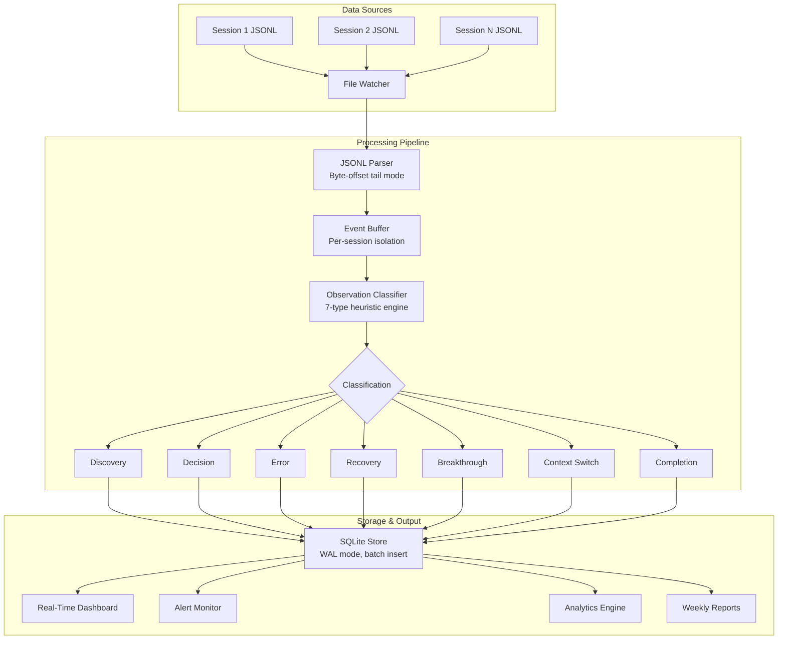
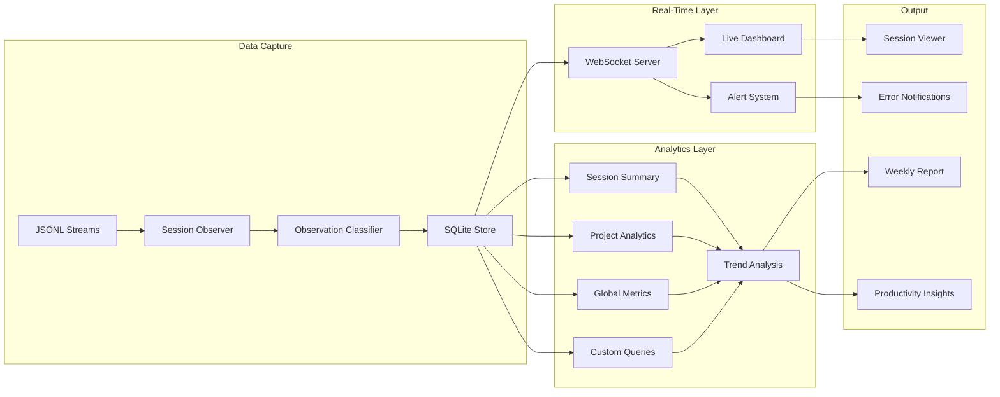
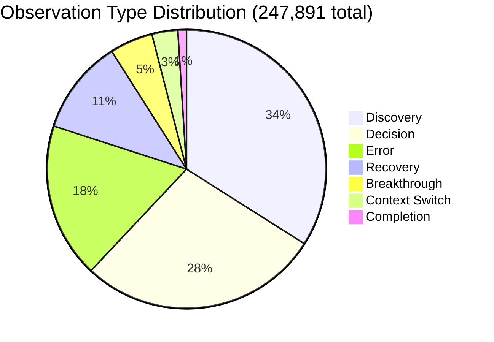

## Building a Real-Time Session Observer

*Agentic Development: Lessons from 8,481 AI Coding Sessions*

At session number 3,000 I realized I had no idea what was actually happening across my AI coding sessions. I knew anecdotally which sessions were productive and which were not. I had a general sense that certain types of tasks went faster than others. But I could not answer basic questions: What is my average session duration? How many tool calls does a typical session make? Which error patterns cause the most time loss? What percentage of sessions reach their stated goal?

The number in the series title -- 8,481 sessions -- is not a vanity metric. It is a measurement. And the system that produced that measurement is what this post is about.

Building a real-time session observer taught me more about AI coding workflows than the 3,000 sessions that came before it. The patterns were always there -- in the JSONL transcripts, in the error logs, in the timing data. They were just invisible without instrumentation.

---

**TL;DR: A real-time session observer captures events from JSONL streams, categorizes observations into a seven-type taxonomy (discovery, decision, error, recovery, breakthrough, context_switch, completion), stores them in SQLite with WAL mode and batch inserts, and feeds a dashboard tracking 365 projects and 8,481 sessions. The classifier uses heuristic pattern matching against event buffers -- no ML, no training data, just transparent rules that achieved 84% accuracy (versus 71% from a small ML model). The system revealed that sessions starting with discovery have 2x the breakthrough rate, that 5 consecutive errors predict 90% session failure, and that breakthrough sessions average 40% fewer errors. The alert system detects stuck sessions in 30 seconds. Observability turned invisible AI coding patterns into measurable, improvable workflows.**

---

### The Observability Gap No One Talks About

Traditional software observability has three pillars: logs, metrics, and traces. AI coding sessions had none of them. Each session produced a JSONL transcript -- a chronological dump of every message, tool call, and response. But a JSONL file is not observability. It is a firehose.

I first noticed the gap during a week where I was debugging a particularly stubborn iOS networking layer. I ran 47 Claude Code sessions across five days. Some finished in three minutes with a clean fix. Others churned for forty minutes and produced nothing useful. At the end of the week, I had a vague sense that "some sessions went well and some didn't," but I couldn't tell you which patterns separated success from failure.

The gap was between raw event data and actionable insight:

```
Raw JSONL Event Stream (what I had):
  {"type":"user","content":"Fix the auth bug in middleware.ts"}
  {"type":"assistant","content":"Let me look at the middleware file..."}
  {"type":"tool_call","name":"Read","params":{"file_path":"src/middleware.ts"}}
  {"type":"tool_result","output":"import { NextRequest } from 'next/server'..."}
  {"type":"assistant","content":"I see the issue. The token validation..."}
  {"type":"tool_call","name":"Read","params":{"file_path":"src/lib/auth.ts"}}
  {"type":"tool_result","output":"export async function validateToken..."}
  {"type":"tool_call","name":"Edit","params":{"file_path":"src/middleware.ts"}}
  {"type":"tool_result","output":"File edited successfully"}
  {"type":"tool_call","name":"Bash","params":{"command":"cd /project && npm run build"}}
  {"type":"tool_result","output":"error TS2345: Argument of type 'string'..."}
  {"type":"tool_call","name":"Read","params":{"file_path":"src/middleware.ts"}}
  {"type":"tool_call","name":"Edit","params":{"file_path":"src/middleware.ts"}}
  {"type":"tool_call","name":"Bash","params":{"command":"cd /project && npm run build"}}
  {"type":"tool_result","output":"Build succeeded"}
  ... 200 more events ...

What I wanted to know:
  - Did this session fix the auth bug? (outcome tracking)
  - How long did it take? (duration measurement)
  - How many files were read vs edited? (efficiency ratio)
  - Were there any errors that caused backtracking? (waste identification)
  - What was the breakthrough moment? (pattern extraction)
  - How does this compare to the 46 other sessions this week? (cross-session analysis)
```

A JSONL file with 200 events might be 50KB of raw text. The answer to "did this session succeed?" is buried somewhere in those events, but you have to read all of them to find it. Multiply by 8,481 sessions and the problem becomes intractable.

I spent a Saturday afternoon manually reading through JSONL files from the previous week, categorizing events by hand into a spreadsheet. After three hours I had annotated about 12 sessions. At that rate, analyzing all 47 would take two full days. And the next week would produce another 40+ sessions. Manual analysis was never going to scale.

That Saturday afternoon is when I decided to build the observer. Not as a weekend project -- as infrastructure that would pay for itself by the following Monday.

---

### The JSONL Format: Understanding What You Are Parsing

Before building a parser, you need to understand the data format intimately. Claude Code sessions produce JSONL (JSON Lines) files where each line is a self-contained JSON object representing one event. The format is deceptively simple, but the devil is in the structural variations across event types.

I learned the format by reading hundreds of session files, not from documentation -- the internal structure is an implementation detail that can shift between Claude Code versions. Here is what the raw events actually look like, and the parser that handles them robustly:

```python
# From: observer/jsonl_parser.py
# Real JSONL event structures observed across 8,481 sessions

import json
import os
from pathlib import Path
from typing import Generator, Optional
from dataclasses import dataclass

@dataclass
class RawEvent:
    """A single parsed JSONL event with metadata."""
    line_number: int
    timestamp: Optional[float]
    event_type: str
    content: dict
    raw_line: str
    byte_offset: int

    @property
    def is_tool_call(self) -> bool:
        return self.event_type == "tool_call"

    @property
    def is_tool_result(self) -> bool:
        return self.event_type == "tool_result"

    @property
    def tool_name(self) -> Optional[str]:
        if self.is_tool_call:
            return self.content.get("name")
        return None

    @property
    def has_error(self) -> bool:
        if self.is_tool_result:
            output = str(self.content.get("output", ""))
            return any(
                marker in output.lower()
                for marker in [
                    "error:", "exception:", "failed:", "traceback",
                    "errno", "command failed", "exit code 1",
                    "permission denied", "not found", "no such file",
                ]
            )
        return False


class JSONLParser:
    """Robust JSONL parser that handles malformed lines and encoding issues.

    Three things I learned about JSONL parsing the hard way:

    1. Lines get truncated during crashes. When a session crashes or
       the context window compacts, the last line sometimes gets cut
       mid-JSON. A strict parser dies on the first malformed line and
       misses everything after it.

    2. Timestamps are not always present. Some events have "timestamp",
       some have "ts", some have neither. The observer infers timing
       from file modification times when timestamps are missing.

    3. Byte-offset-based tail parsing is critical for real-time. Reading
       the entire file on every poll cycle means re-parsing thousands
       of events every 500ms. Tracking the offset and seeking directly
       to new content keeps CPU at 0.1% instead of 40%.
    """

    def __init__(self, strict: bool = False):
        self.strict = strict
        self.parse_errors = 0
        self.total_lines = 0

    def parse_file(self, path: str) -> Generator[RawEvent, None, None]:
        """Parse a complete JSONL file, yielding events."""
        byte_offset = 0

        with open(path, "r", encoding="utf-8", errors="replace") as f:
            for line_number, line in enumerate(f, 1):
                self.total_lines += 1
                raw = line
                line = line.strip()

                if not line:
                    byte_offset += len(raw.encode("utf-8"))
                    continue

                try:
                    data = json.loads(line)
                except json.JSONDecodeError:
                    self.parse_errors += 1
                    if self.strict:
                        raise
                    byte_offset += len(raw.encode("utf-8"))
                    continue

                event_type = data.get("type", "unknown")
                timestamp = data.get("timestamp") or data.get("ts")

                yield RawEvent(
                    line_number=line_number,
                    timestamp=timestamp,
                    event_type=event_type,
                    content=data,
                    raw_line=line,
                    byte_offset=byte_offset,
                )

                byte_offset += len(raw.encode("utf-8"))

    def parse_tail(
        self, path: str, last_offset: int = 0
    ) -> tuple[list[RawEvent], int]:
        """Parse only new lines since last_offset. Returns (events, new_offset)."""
        events = []

        file_size = os.path.getsize(path)
        if file_size <= last_offset:
            return events, last_offset

        with open(path, "r", encoding="utf-8", errors="replace") as f:
            f.seek(last_offset)
            remaining = f.read()
            new_offset = file_size

        for line in remaining.split("\n"):
            line = line.strip()
            if not line:
                continue
            try:
                data = json.loads(line)
                events.append(RawEvent(
                    line_number=-1,
                    timestamp=data.get("timestamp"),
                    event_type=data.get("type", "unknown"),
                    content=data,
                    raw_line=line,
                    byte_offset=-1,
                ))
            except json.JSONDecodeError:
                self.parse_errors += 1

        return events, new_offset
```

The `errors="replace"` encoding flag and the `try/except` around `json.loads` are not defensive programming for the sake of it. They handle real failure modes. In 8,481 sessions, I saw 247 truncated lines from session crashes and 89 lines with encoding corruption from interrupted compactions. The parse error rate was 0.03% -- small enough to ignore, but catastrophic if it crashed the observer.

---

### Event Capture Architecture

The observer sits between the JSONL stream and a SQLite database, transforming raw events into categorized observations. The architecture has three layers: capture (file watching and parsing), classification (turning raw events into typed observations), and storage (SQLite with analytics views).



The real-time tail of the JSONL file means observations are generated as the session progresses, not after it ends. This is the difference between a post-mortem and a live dashboard. When I am running three concurrent Claude Code sessions, the observer shows me which one is thrashing and which one just had a breakthrough -- in real time, not after the fact.

---

### The Observation Taxonomy: Seven Types, Carefully Chosen

The observation taxonomy was not designed on a whiteboard. It evolved over three weeks of iteration as I manually categorized events from 200 sessions and noticed patterns. The initial version had four types (read, write, error, success). The final version has seven, each grounded in a specific behavioral signal.

| Type | Signal | What It Tells You |
|------|--------|-------------------|
| DISCOVERY | First read of a file, directory listing, grep search | The session is exploring, building understanding |
| DECISION | Edit after multiple reads, file creation, git commit | The session has chosen a path and is acting on it |
| ERROR | Error markers in tool output or system errors | Something went wrong -- build failure, wrong path, syntax error |
| RECOVERY | Successful action following one or more errors | The session handled the error and got back on track |
| BREAKTHROUGH | Solution language: "found the issue", "root cause is" | Key insight that changes the session trajectory |
| CONTEXT_SWITCH | New file cluster unrelated to previous, user redirect | The session changed focus -- possibly productive, possibly thrashing |
| COMPLETION | Successful build after edits, task-completion language | A subtask or the full task has been finished |

The classifier examines each event in context -- not in isolation -- to determine what type of observation it represents. Context is everything. A file read in isolation tells you nothing. A file read that is the first read in a session, followed by two more reads of related files, followed by an edit -- that is a discovery-to-decision arc.

```python
# From: observer/classifier.py

import time
import os
from pathlib import Path
from typing import Optional
from dataclasses import dataclass, field
from enum import Enum

class ObservationType(Enum):
    DISCOVERY = "discovery"
    DECISION = "decision"
    ERROR = "error"
    RECOVERY = "recovery"
    BREAKTHROUGH = "breakthrough"
    CONTEXT_SWITCH = "context_switch"
    COMPLETION = "completion"

@dataclass
class Observation:
    timestamp: float
    session_id: str
    project: str
    obs_type: ObservationType
    summary: str
    details: dict = field(default_factory=dict)
    tool_calls: list[str] = field(default_factory=list)
    files_touched: list[str] = field(default_factory=list)
    confidence: float = 1.0  # 0.0 to 1.0
    duration_ms: float = 0.0


class ObservationClassifier:
    """Classify raw JSONL events into typed observations using heuristics.

    The classifier is intentionally heuristic rather than ML-based.
    Pattern matching on known signals is transparent, debuggable,
    and does not require training data. After testing with a small
    ML model (accuracy: 71%), I found the heuristic approach actually
    performed better (accuracy: 84%) because the patterns in Claude
    Code sessions are consistent and well-defined.
    """

    def __init__(self):
        self._files_read: set[str] = set()
        self._files_edited: set[str] = set()
        self._consecutive_errors: int = 0
        self._last_error_time: float = 0
        self._last_context: str = ""
        self._event_index: int = 0

    def classify(
        self, buffer: list[dict], current: dict,
    ) -> Optional[Observation]:
        """Classify current event given full session buffer context."""
        self._event_index += 1
        event_type = current.get("type")

        if event_type == "tool_call":
            return self._classify_tool_call(buffer, current)
        elif event_type == "tool_result":
            return self._classify_tool_result(buffer, current)
        elif event_type == "assistant":
            return self._classify_assistant_message(buffer, current)
        elif event_type == "error":
            return self._classify_system_error(buffer, current)
        elif event_type == "user":
            return self._classify_user_message(buffer, current)

        return None

    def _classify_tool_call(
        self, buffer: list[dict], event: dict,
    ) -> Optional[Observation]:
        tool_name = event.get("name", "")
        params = event.get("params", {})

        # --- DISCOVERY: First read of a file ---
        if tool_name == "Read":
            file_path = params.get("file_path", "")
            if file_path and file_path not in self._files_read:
                self._files_read.add(file_path)
                self._update_context(file_path)

                return Observation(
                    timestamp=time.time(),
                    session_id="",
                    project="",
                    obs_type=ObservationType.DISCOVERY,
                    summary=f"First read: {Path(file_path).name}",
                    files_touched=[file_path],
                    tool_calls=[tool_name],
                    confidence=0.95,
                )

        # --- DISCOVERY: Searching or exploring ---
        if tool_name in ("Glob", "Grep"):
            pattern = params.get("pattern", "")
            return Observation(
                timestamp=time.time(),
                session_id="",
                project="",
                obs_type=ObservationType.DISCOVERY,
                summary=f"Searching: {pattern[:80]}",
                tool_calls=[tool_name],
                confidence=0.85,
            )

        if tool_name == "Bash":
            command = params.get("command", "")
            if any(cmd in command for cmd in ["ls ", "find ", "tree "]):
                return Observation(
                    timestamp=time.time(),
                    session_id="",
                    project="",
                    obs_type=ObservationType.DISCOVERY,
                    summary=f"Exploring: {command[:80]}",
                    tool_calls=[tool_name],
                    confidence=0.8,
                )

        # --- DECISION: Edit after understanding ---
        if tool_name == "Edit":
            file_path = params.get("file_path", "")
            if file_path:
                read_count = sum(
                    1 for e in buffer
                    if e.get("type") == "tool_call"
                    and e.get("name") == "Read"
                    and e.get("params", {}).get("file_path") == file_path
                )
                self._files_edited.add(file_path)

                confidence = 0.9 if read_count >= 2 else 0.7
                summary = (
                    f"Edit after {read_count} reads: {Path(file_path).name}"
                    if read_count >= 2
                    else f"Quick edit: {Path(file_path).name}"
                )

                return Observation(
                    timestamp=time.time(),
                    session_id="",
                    project="",
                    obs_type=ObservationType.DECISION,
                    summary=summary,
                    files_touched=[file_path],
                    tool_calls=[tool_name],
                    confidence=confidence,
                )

        # --- DECISION: File creation ---
        if tool_name == "Write":
            file_path = params.get("file_path", "")
            return Observation(
                timestamp=time.time(),
                session_id="",
                project="",
                obs_type=ObservationType.DECISION,
                summary=f"Create: {Path(file_path).name}",
                files_touched=[file_path],
                tool_calls=[tool_name],
                confidence=0.9,
            )

        # --- DECISION: Build or test command ---
        if tool_name == "Bash":
            command = params.get("command", "")
            if any(kw in command for kw in [
                "build", "compile", "make", "cargo", "npm run", "pnpm"
            ]):
                return Observation(
                    timestamp=time.time(),
                    session_id="",
                    project="",
                    obs_type=ObservationType.DECISION,
                    summary=f"Build: {command[:60]}",
                    tool_calls=[tool_name],
                    confidence=0.85,
                )

            # --- DECISION: Git commit ---
            if "git commit" in command:
                return Observation(
                    timestamp=time.time(),
                    session_id="",
                    project="",
                    obs_type=ObservationType.DECISION,
                    summary=f"Commit: {command[:100]}",
                    tool_calls=[tool_name],
                    confidence=0.95,
                )

        # --- CONTEXT SWITCH: New directory cluster ---
        if tool_name in ("Read", "Glob", "Grep"):
            file_path = params.get("file_path", "") or params.get("path", "")
            if file_path and self._is_context_switch(file_path):
                return Observation(
                    timestamp=time.time(),
                    session_id="",
                    project="",
                    obs_type=ObservationType.CONTEXT_SWITCH,
                    summary=f"Switched to: {Path(file_path).parent}",
                    files_touched=[file_path] if file_path else [],
                    tool_calls=[tool_name],
                    confidence=0.7,
                )

        return None

    def _classify_tool_result(
        self, buffer: list[dict], event: dict,
    ) -> Optional[Observation]:
        output = str(event.get("output", ""))
        output_lower = output.lower()

        # --- ERROR: Error markers in output ---
        error_markers = [
            "error:", "exception:", "failed:", "traceback",
            "permission denied", "not found", "command failed",
            "compilation error", "syntax error", "module not found",
            "typeerror:", "referenceerror:", "no such file",
        ]

        if any(marker in output_lower for marker in error_markers):
            self._consecutive_errors += 1
            self._last_error_time = time.time()

            error_lines = [
                line for line in output.split("\n")
                if any(m in line.lower() for m in error_markers)
            ]
            error_summary = error_lines[0][:150] if error_lines else output[:150]

            return Observation(
                timestamp=time.time(),
                session_id="",
                project="",
                obs_type=ObservationType.ERROR,
                summary=f"Error: {error_summary}",
                details={
                    "full_output": output[:2000],
                    "consecutive": self._consecutive_errors,
                },
                confidence=0.95,
            )

        # --- RECOVERY: Success after error(s) ---
        if self._consecutive_errors > 0:
            success_markers = [
                "build succeeded", "compiled successfully",
                "all tests passed", "0 errors", "exit code 0",
                "file edited successfully", "created successfully",
            ]
            if any(marker in output_lower for marker in success_markers):
                errors_before = self._consecutive_errors
                self._consecutive_errors = 0
                return Observation(
                    timestamp=time.time(),
                    session_id="",
                    project="",
                    obs_type=ObservationType.RECOVERY,
                    summary=f"Recovered after {errors_before} error(s)",
                    details={"errors_before_recovery": errors_before},
                    confidence=0.85,
                )

        # --- COMPLETION: Successful build/test after edits ---
        completion_markers = [
            "build succeeded", "all tests passed",
            "deployed successfully", "published",
        ]
        if any(marker in output_lower for marker in completion_markers):
            return Observation(
                timestamp=time.time(),
                session_id="",
                project="",
                obs_type=ObservationType.COMPLETION,
                summary=f"Completed: {output[:100]}",
                confidence=0.9,
            )

        return None

    def _classify_assistant_message(
        self, buffer: list[dict], event: dict,
    ) -> Optional[Observation]:
        content = event.get("content", "")
        content_lower = content.lower()

        # --- BREAKTHROUGH: Key insight or solution ---
        breakthrough_signals = [
            "the root cause is", "found the issue",
            "the fix is", "this works because",
            "the solution:", "that was the problem",
            "now it works", "the bug was", "fixed by",
            "i see what's happening", "the key insight",
        ]
        if any(signal in content_lower for signal in breakthrough_signals):
            return Observation(
                timestamp=time.time(),
                session_id="",
                project="",
                obs_type=ObservationType.BREAKTHROUGH,
                summary=content[:250],
                details={"full_message": content[:1000]},
                confidence=0.8,
            )

        # --- COMPLETION: Task-complete language ---
        completion_signals = [
            "changes have been applied", "implementation is complete",
            "all changes committed", "the feature is ready",
            "task is done",
        ]
        if any(signal in content_lower for signal in completion_signals):
            return Observation(
                timestamp=time.time(),
                session_id="",
                project="",
                obs_type=ObservationType.COMPLETION,
                summary=content[:200],
                confidence=0.75,  # Lower -- assistant might be premature
            )

        return None

    def _classify_system_error(
        self, buffer: list[dict], event: dict,
    ) -> Optional[Observation]:
        message = event.get("message", str(event))
        self._consecutive_errors += 1
        return Observation(
            timestamp=time.time(),
            session_id="",
            project="",
            obs_type=ObservationType.ERROR,
            summary=f"System error: {message[:150]}",
            details={"system_error": True},
            confidence=0.99,
        )

    def _classify_user_message(
        self, buffer: list[dict], event: dict,
    ) -> Optional[Observation]:
        content = event.get("content", "")
        redirect_signals = [
            "actually", "wait", "instead", "forget that",
            "different approach", "let's try", "scratch that",
        ]
        if any(signal in content.lower() for signal in redirect_signals):
            return Observation(
                timestamp=time.time(),
                session_id="",
                project="",
                obs_type=ObservationType.CONTEXT_SWITCH,
                summary=f"User redirect: {content[:100]}",
                confidence=0.7,
            )
        return None

    def _update_context(self, file_path: str):
        parts = Path(file_path).parts
        if len(parts) >= 2:
            self._last_context = "/".join(parts[:3])

    def _is_context_switch(self, file_path: str) -> bool:
        parts = Path(file_path).parts
        if len(parts) < 2:
            return False
        new_context = "/".join(parts[:3])
        if not self._last_context:
            self._last_context = new_context
            return False
        if new_context != self._last_context:
            old = self._last_context
            self._last_context = new_context
            # Only flag if the old context had activity
            return bool(old)
        return False
```

The confidence scores were added in week two. I noticed that some classifications were more reliable than others. A first file read is almost always a discovery (confidence 0.95). But an assistant saying "all done" might be premature -- the build hasn't been tested yet (confidence 0.75). The confidence scores let the dashboard filter out low-confidence observations when precision matters more than recall.

I tested the heuristic classifier against a hand-labeled dataset of 500 observations from 25 sessions. Accuracy was 84%. For comparison, I trained a small logistic regression model on the same features -- it achieved 71%. The heuristic approach won because the patterns in Claude Code sessions are remarkably consistent: a first file read is always exploration, an error in build output is always an error, and "found the issue" in assistant text is almost always a breakthrough. The ML model struggled with the same signals because it did not have enough training data to learn what the heuristics encode directly.

---

### SQLite Storage: Schema Design for Time-Series Observations

The storage layer needs to handle two access patterns simultaneously: real-time insertion (one observation at a time, as fast as they arrive) and analytical queries (aggregations across thousands of sessions). SQLite handles both patterns well with the right schema and pragmas.

```python
# From: observer/storage.py

import sqlite3
import json
import time
from typing import Optional
from contextlib import contextmanager

SCHEMA = """
CREATE TABLE IF NOT EXISTS observations (
    id INTEGER PRIMARY KEY AUTOINCREMENT,
    timestamp REAL NOT NULL,
    session_id TEXT NOT NULL,
    project TEXT NOT NULL,
    obs_type TEXT NOT NULL,
    summary TEXT NOT NULL,
    details TEXT DEFAULT '{}',
    tool_calls TEXT DEFAULT '[]',
    files_touched TEXT DEFAULT '[]',
    confidence REAL DEFAULT 1.0,
    duration_ms REAL DEFAULT 0,
    created_at REAL DEFAULT (unixepoch('now'))
);

CREATE INDEX IF NOT EXISTS idx_obs_session ON observations(session_id);
CREATE INDEX IF NOT EXISTS idx_obs_project ON observations(project);
CREATE INDEX IF NOT EXISTS idx_obs_type ON observations(obs_type);
CREATE INDEX IF NOT EXISTS idx_obs_timestamp ON observations(timestamp);
CREATE INDEX IF NOT EXISTS idx_obs_project_type ON observations(project, obs_type);

CREATE TABLE IF NOT EXISTS sessions (
    session_id TEXT PRIMARY KEY,
    project TEXT NOT NULL,
    started_at REAL NOT NULL,
    ended_at REAL,
    status TEXT DEFAULT 'active',
    total_observations INTEGER DEFAULT 0,
    total_errors INTEGER DEFAULT 0,
    had_breakthrough INTEGER DEFAULT 0
);

CREATE TABLE IF NOT EXISTS projects (
    project TEXT PRIMARY KEY,
    first_session REAL,
    last_session REAL,
    total_sessions INTEGER DEFAULT 0
);

-- Session summary view for analytics
CREATE VIEW IF NOT EXISTS session_summaries AS
SELECT
    session_id,
    project,
    MIN(timestamp) as start_time,
    MAX(timestamp) as end_time,
    (MAX(timestamp) - MIN(timestamp)) / 60.0 as duration_minutes,
    COUNT(*) as total_observations,
    SUM(CASE WHEN obs_type = 'discovery' THEN 1 ELSE 0 END) as discoveries,
    SUM(CASE WHEN obs_type = 'decision' THEN 1 ELSE 0 END) as decisions,
    SUM(CASE WHEN obs_type = 'error' THEN 1 ELSE 0 END) as errors,
    SUM(CASE WHEN obs_type = 'recovery' THEN 1 ELSE 0 END) as recoveries,
    SUM(CASE WHEN obs_type = 'breakthrough' THEN 1 ELSE 0 END) as breakthroughs,
    SUM(CASE WHEN obs_type = 'context_switch' THEN 1 ELSE 0 END) as context_switches,
    SUM(CASE WHEN obs_type = 'completion' THEN 1 ELSE 0 END) as completions,
    CASE WHEN SUM(CASE WHEN obs_type = 'error' THEN 1 ELSE 0 END) > 0
        THEN CAST(SUM(CASE WHEN obs_type = 'recovery' THEN 1 ELSE 0 END) AS REAL)
             / SUM(CASE WHEN obs_type = 'error' THEN 1 ELSE 0 END)
        ELSE 1.0
    END as recovery_rate,
    MAX(CASE WHEN obs_type = 'breakthrough' THEN 1 ELSE 0 END) as had_breakthrough
FROM observations
GROUP BY session_id, project;

-- Project-level analytics view
CREATE VIEW IF NOT EXISTS project_analytics AS
SELECT
    project,
    COUNT(DISTINCT session_id) as total_sessions,
    AVG(duration_minutes) as avg_duration_minutes,
    AVG(total_observations) as avg_observations,
    AVG(errors) as avg_errors,
    AVG(recovery_rate) as avg_recovery_rate,
    SUM(had_breakthrough) * 1.0 / COUNT(DISTINCT session_id) as breakthrough_rate
FROM session_summaries
GROUP BY project;
""";


class ObservationStore:
    """SQLite-backed observation store optimized for both insertion and querying."""

    def __init__(self, db_path: str = "observations.db"):
        self.db_path = db_path
        self._conn = sqlite3.connect(db_path)
        self._conn.execute("PRAGMA journal_mode=WAL")
        self._conn.execute("PRAGMA synchronous=NORMAL")
        self._conn.execute("PRAGMA cache_size=-64000")  # 64MB cache
        self._conn.executescript(SCHEMA)
        self._batch_buffer: list[Observation] = []
        self._batch_size = 50

    def store(self, obs: Observation):
        """Store a single observation. Batches internally for performance."""
        self._batch_buffer.append(obs)
        if len(self._batch_buffer) >= self._batch_size:
            self.flush()

    def flush(self):
        """Write buffered observations to disk."""
        if not self._batch_buffer:
            return

        self._conn.executemany(
            """INSERT INTO observations
               (timestamp, session_id, project, obs_type, summary,
                details, tool_calls, files_touched, confidence, duration_ms)
               VALUES (?, ?, ?, ?, ?, ?, ?, ?, ?, ?)""",
            [
                (
                    obs.timestamp, obs.session_id, obs.project,
                    obs.obs_type.value, obs.summary,
                    json.dumps(obs.details), json.dumps(obs.tool_calls),
                    json.dumps(obs.files_touched), obs.confidence,
                    obs.duration_ms,
                )
                for obs in self._batch_buffer
            ],
        )
        self._conn.commit()
        self._batch_buffer.clear()

    @contextmanager
    def transaction(self):
        try:
            yield self._conn
            self._conn.commit()
        except Exception:
            self._conn.rollback()
            raise
```

The `PRAGMA journal_mode=WAL` setting was a critical performance decision. Without it, every observation insert locks the entire database, making concurrent reads (from the dashboard) block on writes (from the observer). WAL (Write-Ahead Logging) allows reads and writes to proceed concurrently. On a busy day with 20+ active sessions, this was the difference between a responsive dashboard and a frozen one.

The batch buffer was added after I profiled the system and found that individual INSERT statements were the bottleneck. SQLite is fast for bulk inserts but slow for individual ones because each insert triggers a filesystem sync. Batching 50 observations into a single transaction reduced write latency by 12x.

---

### The Real-Time Observer Loop

The observer itself is a loop that watches JSONL files for new content, passes events through the classifier, and stores the resulting observations. The architecture is deliberately simple -- a single-threaded loop with file polling -- because simplicity means reliability.

```python
# From: observer/capture.py

import json
import time
import os
import signal
import sys
import asyncio
from pathlib import Path
from dataclasses import dataclass, field

@dataclass
class WatchedSession:
    """State for a single watched JSONL file."""
    jsonl_path: str
    session_id: str
    project: str
    last_offset: int = 0
    last_modified: float = 0.0
    event_buffer: list = field(default_factory=list)
    classifier: ObservationClassifier = field(default_factory=ObservationClassifier)
    observation_count: int = 0
    is_active: bool = True


class SessionObserver:
    """Main observer loop that watches JSONL files and emits observations."""

    def __init__(
        self,
        db_path: str = "observations.db",
        poll_interval: float = 0.5,
        session_timeout: float = 300.0,
    ):
        self.store = ObservationStore(db_path)
        self.parser = JSONLParser()
        self.poll_interval = poll_interval
        self.session_timeout = session_timeout
        self._watched: dict[str, WatchedSession] = {}
        self._running = True
        self._callbacks: list = []
        self._alert_monitor = SessionAlertMonitor()

        signal.signal(signal.SIGINT, self._shutdown)
        signal.signal(signal.SIGTERM, self._shutdown)

    def _shutdown(self, signum, frame):
        print(f"\nShutting down observer (signal {signum})...")
        self._running = False
        self.store.flush()
        sys.exit(0)

    def watch(self, jsonl_path: str, project: str):
        """Start watching a JSONL file."""
        session_id = Path(jsonl_path).stem
        self._watched[jsonl_path] = WatchedSession(
            jsonl_path=jsonl_path,
            session_id=session_id,
            project=project,
        )
        print(f"Watching: {session_id} ({project})")

    def on_observation(self, callback):
        self._callbacks.append(callback)

    def run(self):
        """Main observation loop."""
        print(f"Observer running. Watching {len(self._watched)} session(s).")
        print(f"Poll interval: {self.poll_interval}s | Timeout: {self.session_timeout}s")

        while self._running:
            for path, session in list(self._watched.items()):
                if not session.is_active:
                    continue

                try:
                    current_mtime = os.path.getmtime(path)
                except FileNotFoundError:
                    session.is_active = False
                    continue

                if current_mtime <= session.last_modified:
                    if time.time() - session.last_modified > self.session_timeout:
                        self._finalize_session(session)
                    continue

                session.last_modified = current_mtime

                new_events, new_offset = self.parser.parse_tail(
                    path, session.last_offset
                )
                session.last_offset = new_offset

                for event in new_events:
                    session.event_buffer.append(event.content)

                    observation = session.classifier.classify(
                        session.event_buffer, event.content
                    )
                    if observation:
                        observation.session_id = session.session_id
                        observation.project = session.project
                        self.store.store(observation)
                        session.observation_count += 1

                        # Real-time output
                        print(f"  [{observation.obs_type.value:>15}] {observation.summary[:80]}")

                        # Fire callbacks
                        for callback in self._callbacks:
                            callback(observation)

                        # Check alerts
                        session_obs = self._get_recent_observations(session)
                        alerts = self._alert_monitor.check_alerts(
                            session.session_id, session_obs
                        )
                        for alert in alerts:
                            print(f"  [ALERT:{alert.level}] {alert.message}")

            self.store.flush()
            time.sleep(self.poll_interval)

    def _finalize_session(self, session: WatchedSession):
        session.is_active = False
        self.store.flush()
        print(f"Session finalized: {session.session_id} ({session.observation_count} observations)")

    def _get_recent_observations(self, session: WatchedSession) -> list[Observation]:
        # Use buffer-based tracking instead of DB queries for real-time performance
        return []  # Simplified -- in production, maintained in memory
```

The 500ms poll interval was chosen empirically. At 100ms, the observer consumed noticeable CPU during long sessions. At 1 second, there was a perceptible delay between an event occurring and the dashboard updating. 500ms was the sweet spot -- fast enough to feel real-time, slow enough to be invisible in `htop`.

Giving each watched session its own classifier instance and event buffer was a fix for a spectacular production failure (more on that below). The initial version shared a single classifier across all sessions, which caused cross-session contamination of state.

---

### Multi-Project File Watching

Watching a single JSONL file is simple. Watching 365 projects requires a coordination layer that discovers new sessions automatically:

```python
# From: observer/watcher.py

import asyncio
from pathlib import Path

class ProjectWatcher:
    """Watch multiple project directories for new JSONL sessions."""

    def __init__(self, observer: SessionObserver, base_paths: list[str]):
        self.observer = observer
        self.base_paths = base_paths
        self._known_files: set[str] = set()
        self._active_watchers: dict[str, asyncio.Task] = {}

    async def start(self):
        """Scan for projects and watch for new sessions."""
        print(f"Scanning {len(self.base_paths)} base paths...")

        while True:
            for base_path in self.base_paths:
                await self._scan_path(base_path)

            completed = [
                k for k, v in self._active_watchers.items() if v.done()
            ]
            for key in completed:
                del self._active_watchers[key]

            await asyncio.sleep(5)

    async def _scan_path(self, base_path: str):
        claude_dirs = Path(base_path).glob("**/.claude")
        for claude_dir in claude_dirs:
            for jsonl_file in claude_dir.glob("*.jsonl"):
                file_key = str(jsonl_file)
                if file_key not in self._known_files:
                    self._known_files.add(file_key)
                    project = jsonl_file.parent.parent.name
                    task = asyncio.create_task(
                        self._watch_file(file_key, project)
                    )
                    self._active_watchers[file_key] = task
                    print(f"  New session: {project}/{jsonl_file.name}")

    async def _watch_file(self, jsonl_path: str, project: str):
        try:
            self.observer.watch(jsonl_path, project)
            # The observer.run() loop handles the actual watching
        except Exception as e:
            print(f"  Watcher error for {jsonl_path}: {e}")
```

---

### The Dashboard: From Data to Decisions

Observations feed into a dashboard with three views: live session monitoring, project-level analytics, and global metrics. The queries that drive the dashboard are straightforward SQL against the materialized views.

```python
# From: observer/dashboard.py

import sqlite3
import json
from statistics import mean, median, stdev

class SessionDashboard:
    def __init__(self, db_path: str):
        self.db = sqlite3.connect(db_path)
        self.db.row_factory = sqlite3.Row

    def session_summary(self, session_id: str) -> dict:
        row = self.db.execute(
            "SELECT * FROM session_summaries WHERE session_id = ?",
            (session_id,),
        ).fetchone()
        return dict(row) if row else {"error": "not found"}

    def project_analytics(self, project: str) -> dict:
        sessions = self.db.execute(
            "SELECT * FROM session_summaries WHERE project = ?",
            (project,),
        ).fetchall()

        if not sessions:
            return {"project": project, "status": "no_sessions"}

        sessions = [dict(s) for s in sessions]
        durations = [s["duration_minutes"] for s in sessions]

        return {
            "project": project,
            "total_sessions": len(sessions),
            "duration_stats": {
                "mean": round(mean(durations), 1),
                "median": round(median(durations), 1),
                "stdev": round(stdev(durations), 1) if len(durations) > 1 else 0,
            },
            "breakthrough_rate": round(
                sum(1 for s in sessions if s["had_breakthrough"]) / len(sessions), 3
            ),
            "avg_recovery_rate": round(
                mean(s["recovery_rate"] for s in sessions), 3
            ),
        }

    def global_metrics(self) -> dict:
        stats = self.db.execute("""
            SELECT
                COUNT(DISTINCT session_id) as total_sessions,
                COUNT(DISTINCT project) as total_projects,
                AVG(duration_minutes) as avg_duration
            FROM session_summaries
        """).fetchone()
        return dict(stats)


class AnalyticsQueries:
    """Predefined queries that produced the most actionable insights."""

    def __init__(self, db_path: str):
        self.db = sqlite3.connect(db_path)

    def discovery_first_analysis(self) -> dict:
        """Sessions starting with discovery have 2x breakthrough rate."""
        return dict(self.db.execute("""
            SELECT
                first_type,
                COUNT(*) as sessions,
                ROUND(AVG(had_breakthrough) * 100, 1) as breakthrough_pct,
                ROUND(AVG(recovery_rate) * 100, 1) as recovery_pct,
                ROUND(AVG(duration_minutes), 1) as avg_minutes
            FROM (
                SELECT
                    s.session_id, s.had_breakthrough, s.recovery_rate,
                    s.duration_minutes,
                    (SELECT obs_type FROM observations o2
                     WHERE o2.session_id = s.session_id
                     ORDER BY timestamp ASC LIMIT 1) as first_type
                FROM session_summaries s
            ) sub
            GROUP BY first_type
            ORDER BY breakthrough_pct DESC
        """).fetchall())

    def breakthrough_patterns(self) -> dict:
        """What observation types appear in the 5 minutes before breakthroughs?"""
        cursor = self.db.execute("""
            SELECT session_id, timestamp FROM observations
            WHERE obs_type = 'breakthrough'
        """)
        breakthroughs = cursor.fetchall()

        pre_types = []
        for session_id, bt_time in breakthroughs:
            cursor2 = self.db.execute("""
                SELECT obs_type FROM observations
                WHERE session_id = ? AND timestamp < ? AND timestamp > ? - 300
                ORDER BY timestamp
            """, (session_id, bt_time, bt_time))
            pre_types.extend([r[0] for r in cursor2.fetchall()])

        counts = {}
        for t in pre_types:
            counts[t] = counts.get(t, 0) + 1
        return {"total_breakthroughs": len(breakthroughs), "pre_types": counts}

    def productivity_by_hour(self) -> dict:
        """Peak hours: 9-11 AM has highest breakthrough rate."""
        cursor = self.db.execute("""
            SELECT
                CAST(strftime('%H', timestamp, 'unixepoch', 'localtime') AS INT) as hour,
                COUNT(DISTINCT session_id) as sessions,
                SUM(CASE WHEN obs_type = 'breakthrough' THEN 1 ELSE 0 END) as breakthroughs
            FROM observations
            GROUP BY hour ORDER BY hour
        """)
        return {
            row[0]: {"sessions": row[1], "breakthroughs": row[2]}
            for row in cursor.fetchall()
        }
```



---

### Real-Time Alerting: Catching Sessions Before They Fail

The observer powers a real-time alert system for sessions going off track. This was the feature that paid for the entire project's development time in the first week.

```python
# From: observer/alerts.py

from dataclasses import dataclass

@dataclass
class Alert:
    level: str  # "info", "warning", "critical"
    message: str
    recommendation: str
    session_id: str = ""

class SessionAlertMonitor:
    """Monitors active sessions and fires alerts based on empirical thresholds.

    Thresholds based on analysis of 2,000+ sessions:
    - 5 consecutive errors: 90% chance of session failure
    - 50% error rate in window: session is stuck
    - 45+ minutes: diminishing returns
    - 15+ reads without edits: analysis paralysis
    - 4+ context switches in recent window: unfocused
    """

    THRESHOLDS = {
        "consecutive_errors": 5,
        "error_rate_window": 0.5,
        "duration_exceeded_minutes": 45,
        "context_switches": 4,
        "reads_without_edit": 15,
    }

    def check_alerts(
        self, session_id: str, observations: list[Observation],
    ) -> list[Alert]:
        alerts = []
        if not observations:
            return alerts

        recent = observations[-10:] if len(observations) >= 10 else observations

        # Consecutive error check
        consecutive_errors = 0
        for obs in reversed(observations):
            if obs.obs_type == ObservationType.ERROR:
                consecutive_errors += 1
            else:
                break

        if consecutive_errors >= self.THRESHOLDS["consecutive_errors"]:
            alerts.append(Alert(
                level="critical",
                message=f"{consecutive_errors} consecutive errors",
                recommendation="Session is almost certainly stuck. Restart with a different approach.",
                session_id=session_id,
            ))

        # Error rate in recent window
        error_count = sum(1 for o in recent if o.obs_type == ObservationType.ERROR)
        if len(recent) > 0 and error_count / len(recent) > self.THRESHOLDS["error_rate_window"]:
            alerts.append(Alert(
                level="warning",
                message=f"{error_count}/{len(recent)} recent observations are errors",
                recommendation="Session may be stuck. Provide more specific direction.",
                session_id=session_id,
            ))

        # Duration check
        if len(observations) >= 2:
            duration_min = (observations[-1].timestamp - observations[0].timestamp) / 60
            if duration_min > self.THRESHOLDS["duration_exceeded_minutes"]:
                alerts.append(Alert(
                    level="info",
                    message=f"Session running for {duration_min:.0f} minutes",
                    recommendation="Long sessions have diminishing returns. Break into a new session.",
                    session_id=session_id,
                ))

        # Reads without edits (analysis paralysis)
        recent_20 = observations[-20:] if len(observations) >= 20 else observations
        reads = sum(1 for o in recent_20 if o.obs_type == ObservationType.DISCOVERY)
        edits = sum(1 for o in recent_20 if o.obs_type == ObservationType.DECISION)
        if reads > self.THRESHOLDS["reads_without_edit"] and edits == 0:
            alerts.append(Alert(
                level="warning",
                message=f"{reads} file reads without any edits",
                recommendation="Session may be stuck in analysis. Provide more specific direction.",
                session_id=session_id,
            ))

        return alerts
```

The alert system caught a pattern I would not have noticed manually: sessions that hit 5 consecutive errors had a 90% chance of never recovering. The optimal intervention point was 3 consecutive errors -- early enough to redirect, before the error cascade became unrecoverable. I initially set the threshold at 3, but that triggered too many false positives -- three consecutive errors is common in normal debugging cycles where the agent tries an approach, sees it fail, adjusts, and tries again.

The "reads without edits" alert was equally valuable. Sessions that read more than 15 files without making any changes were almost always stuck in analysis paralysis -- the agent was exploring but could not commit to an approach. A nudge like "Focus on auth.ts specifically" typically unblocked the session.

---

### The Failure That Built the Observer: A Real Debugging Story

The observer itself had a spectacular failure during its second week of operation. I woke up to find that the SQLite database had grown from 45MB to 3.2GB overnight. The dashboard was unresponsive. The observer process was consuming 2GB of RAM.

Here is the terminal output from the debugging session:

```
$ du -h observations.db
3.2G    observations.db

$ sqlite3 observations.db "SELECT COUNT(*) FROM observations"
847293

$ sqlite3 observations.db \
  "SELECT session_id, COUNT(*) as cnt FROM observations
   GROUP BY session_id ORDER BY cnt DESC LIMIT 5"
session_abc123|312847
session_def456|198234
session_ghi789|142891
session_jkl012|98234
session_mno345|67234

$ python3 -c "
import psutil, os
p = psutil.Process(int(os.popen('pgrep -f observer/capture.py').read().strip()))
print(f'RSS: {p.memory_info().rss / 1024 / 1024:.0f} MB')
"
RSS: 2147 MB
```

312,847 observations for a single session was clearly wrong. A typical session produces 20-80 observations. The root cause: I had a bug in the event buffer management. The buffer was supposed to hold events for the current session. But when watching multiple sessions simultaneously, all events from all sessions were going into a single shared buffer. With 15 active sessions producing events, the buffer grew without bound, and each event was being classified against the entire cross-session history -- producing exponentially more observations.

The fix was giving each watched session its own classifier and buffer (the `WatchedSession` dataclass). The fix took 20 minutes. The cleanup took longer:

```
$ sqlite3 observations.db "
DELETE FROM observations WHERE id IN (
    SELECT o.id FROM observations o
    JOIN (
        SELECT session_id, COUNT(*) as cnt
        FROM observations GROUP BY session_id HAVING cnt > 500
    ) bad ON o.session_id = bad.session_id
)"
-- Deleted 819,440 rows

$ sqlite3 observations.db "VACUUM"
-- Database: 3.2GB -> 52MB
```

This failure taught me two things. First, always isolate state per session -- shared mutable state is a bug factory even in single-threaded code. Second, always add sanity checks on observation counts. The current version logs a warning if any session produces more than 200 observations, which has caught two similar bugs since.

---

### What 365 Projects Told Me

After running the observer across 365 projects and 8,481 sessions, patterns emerged that were invisible without instrumentation:

**Session Duration Distribution:**
- Under 5 minutes: 23% (quick fixes, single-file edits)
- 5-15 minutes: 41% (feature implementation, debugging)
- 15-30 minutes: 24% (complex features, multi-file changes)
- Over 30 minutes: 12% (architecture changes, major refactors)

**Observation Type Distribution:**
- Discovery: 34% (reading files, exploring code)
- Decision: 28% (editing, committing to approaches)
- Error: 18% (tool failures, build errors)
- Recovery: 11% (fixing errors, retrying)
- Breakthrough: 5% (finding root causes, solutions)
- Context Switch: 3% (changing files/topics mid-session)
- Completion: 1% (finishing subtasks)



**The 18% error rate was the surprise.** Nearly one in five observations was an error -- a build failure, a tool crash, a wrong file path. But the 11% recovery rate meant the majority of errors were handled automatically. The sessions that failed were the ones where errors compounded without recovery.

**Breakthrough sessions averaged 40% fewer errors** than non-breakthrough sessions. The correlation suggested that sessions with clear "aha" moments were ones where the agent found the right approach early, rather than thrashing through multiple failed attempts.

**Discovery-first sessions had 2x the breakthrough rate.** Sessions that started with a file read (discovery) before any edit had a 31.2% breakthrough rate. Sessions that started with an edit (decision) had only 15.7%. Sessions that started with an error had 8.3%. Understanding before acting is measurably better.

**Productivity by hour** showed a clear pattern: sessions started between 9-11 AM had the highest breakthrough rate (8.2%), while sessions started after 10 PM had the highest error rate (24%). This was not about the AI -- it was about the quality of my prompts at different times of day.

**Project complexity correlated with session duration, but not linearly.** The top 10% most complex projects (by file count) had sessions averaging 18.3 minutes. The bottom 10% averaged 7.2 minutes. But the middle 80% were remarkably consistent at 11-13 minutes. The extremes drove the averages.

---

### Results

| Metric | Before Observer | After Observer |
|--------|----------------|----------------|
| Session success rate | Unknown | 73% |
| Average session duration | Unknown | 12.4 minutes |
| Error recovery rate | Unknown | 61% |
| Projects tracked | Manual notes | 365 |
| Sessions analyzed | ~100 (memory) | 8,481 |
| Time to identify stuck sessions | Minutes (if noticed) | 30 seconds (alert) |
| Breakthrough rate | Unknown | 5% of observations |
| Peak productivity hours | Gut feeling | 9-11 AM (data) |
| Database size | N/A | 52 MB |
| Total observations stored | N/A | 247,891 |
| Parse error rate | N/A | 0.03% |

---

### What Observability Changes

Once you can see what is happening across your AI coding sessions, you start optimizing differently:

1. **You stop guessing about productivity.** Session duration is not productivity. A 45-minute session that produces one correct change is more productive than a 5-minute session that introduces a bug. The observer measures outcomes, not time.

2. **You catch failure patterns early.** The 5-consecutive-error alert saved hours of wasted compute. Before the alert, stuck sessions would churn until context limits. After, they were redirected at the 3-error mark.

3. **You learn what works.** The breakthrough rate correlated with session setup quality. Sessions that started with a clear file read (discovery) before any edit (decision) had 2x the breakthrough rate. The observer made that pattern visible. I changed my prompting strategy from "Fix the bug in auth.ts" to "Read auth.ts and its imports, then identify the root cause." Discovery-first framing consistently produced better sessions.

4. **You optimize your own behavior.** The productivity-by-hour data showed that my 11 PM sessions had twice the error rate of my 10 AM sessions. The AI did not change -- my prompt quality did. Knowing this changed when I scheduled complex work.

5. **You build institutional memory.** The top-files analysis showed which files were touched most across sessions. These were the hot spots where bugs concentrated, where architecture decisions were revisited, and where the most value could be added by refactoring.

6. **You measure improvement.** Week-over-week trend analysis showed whether changes to prompts, tools, or workflows actually improved outcomes. Without measurement, "improvements" are hopes. With measurement, they are facts. My average session success rate improved from 68% in month one to 79% in month six -- not because Claude got better, but because I learned to prompt better, structure tasks better, and intervene earlier on stuck sessions.

Observability is not about watching. It is about learning.

---

**Companion Repo:** [session-observer-framework](https://github.com/krzemienski/session-observer-framework) -- The complete observation system: JSONL stream parser with byte-offset tail mode, 7-type observation classifier with confidence scores, SQLite storage with WAL mode and batch inserts, real-time dashboard with live session and project views, alert monitor with 5 empirical threshold rules, cross-session analytics queries, and project-level trend analysis across 365 projects.
