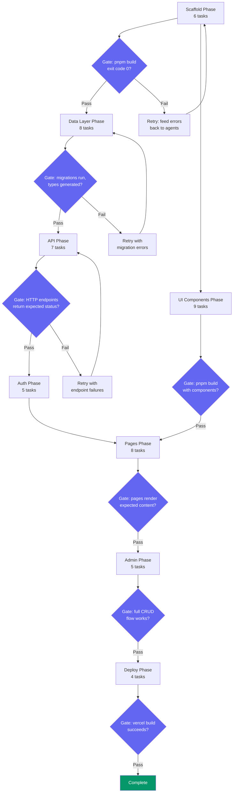
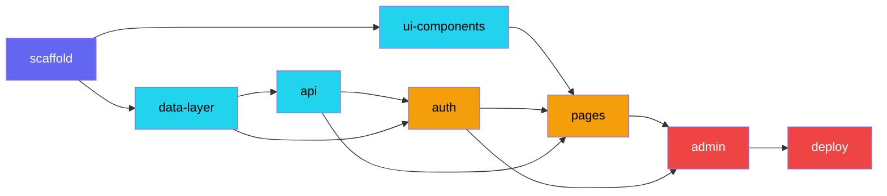
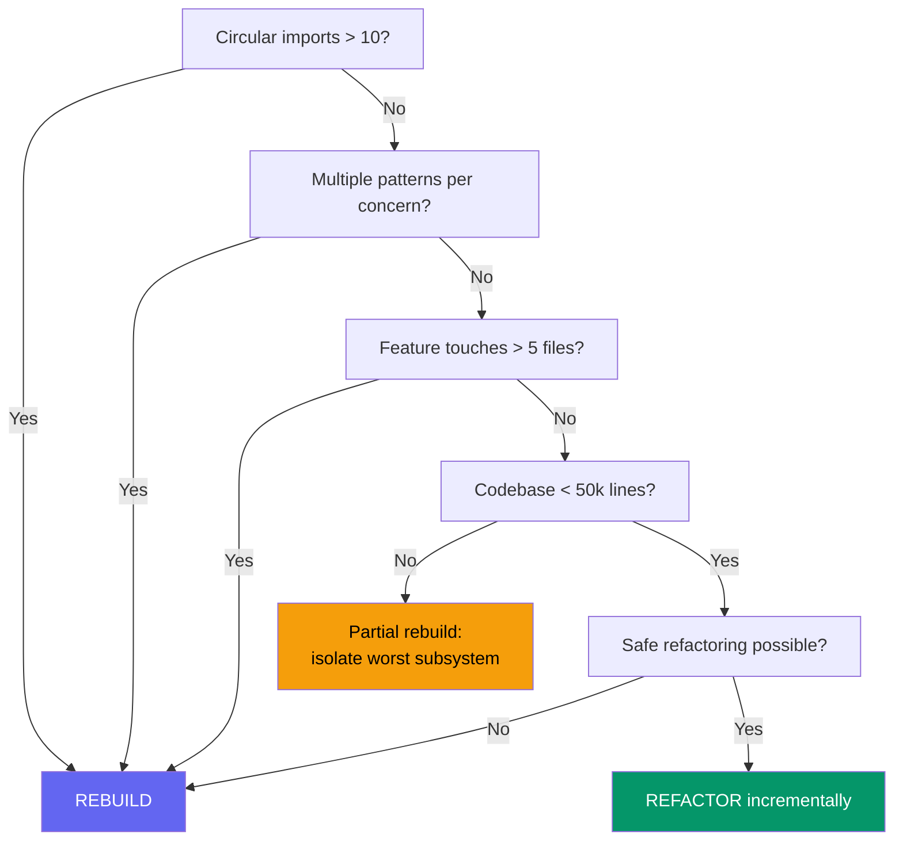
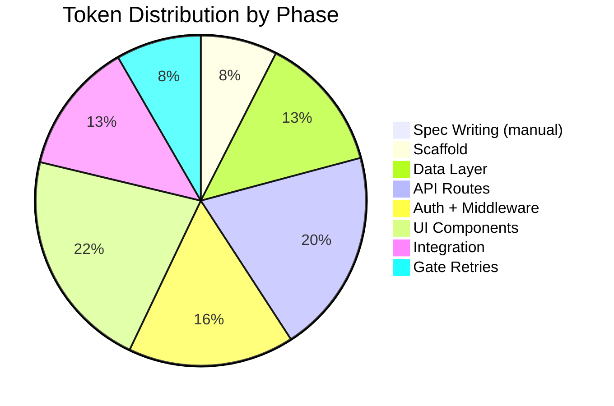

## 52 Tasks, 8 Phases: Rebuilding an Entire App from a Single Spec

*Agentic Development: Lessons from 8,481 AI Coding Sessions — Post 54*

I stared at the awesome-list application codebase and felt the familiar dread. Eighteen months of incremental patches, three different state management approaches coexisting in the same repo, authentication middleware bolted on after the fact, and an admin panel that loaded four copies of the same charting library. The kind of codebase where fixing one thing broke two others.

I had tried the incremental approach twice already. Refactor the auth layer — break the admin panel. Migrate the state management — break the API middleware. Every refactor was a game of whack-a-mole because the coupling ran so deep that no module was truly independent.

So I stopped trying to fix it and decided to rebuild it. Not manually — I had 52 discrete tasks and 8 phases mapped out before I wrote a single line of code. The spec drove every agent, every phase gate, every validation checkpoint. Fourteen hours later I had a working application with zero technical debt from the original.

This post is the full story of that rebuild: the spec format, the dependency graph, the agent delegation model, the gate validation system, every phase in detail, every failure and recovery, and the measured results.

---

**TL;DR**

- **Complete application rebuilt from YAML specification across 8 sequential phases with 52 tasks**
- **Phase gate validation between every phase — no proceeding until the previous phase was verified against real running systems**
- **Parallel phase execution where the dependency graph allowed — data-layer and ui-components ran simultaneously, saving 2h 40m**
- **Rebuild took 14 hours of agent execution vs. estimated 3 weeks of incremental refactoring**
- **Result: 187 files down to 94, 47 circular imports down to 0, bundle size from 2.4 MB to 890 KB, Lighthouse from 62 to 94**
- **Zero carry-over of legacy coupling patterns from the original codebase**

---

### Why Incremental Refactoring Failed

The awesome-list application was a Next.js app with a Supabase backend, an admin panel, role-based auth, and a public-facing discovery interface. About 34,000 lines of TypeScript spread across 187 files. It had been built over 18 months by a rotating cast of agents across hundreds of sessions, and every session had added its own interpretation of how things should work.

The problem was not any single module. The problem was that every module had tendrils reaching into every other module. The auth middleware imported from the data layer. The UI components called API routes directly instead of going through service functions. The admin panel duplicated half the public interface code with slight modifications. There were three different patterns for fetching data: raw Supabase client calls in some components, a half-finished service layer in others, and direct `fetch('/api/...')` calls in the admin panel.

I mapped the dependency graph and found 47 circular import chains. Forty-seven. Some were indirect — A imports B imports C imports A — but they were all real runtime dependencies, not just type imports.

Here is what the dependency audit looked like:

```python
# From: audit/dependency_analyzer.py
# Ran this against the awesome-list src/ directory to map the full import graph

import ast
import json
from pathlib import Path
from collections import defaultdict

class DependencyAnalyzer:
    def __init__(self, src_dir: str):
        self.src_dir = Path(src_dir)
        self.imports = defaultdict(set)  # file -> set of imported files
        self.reverse = defaultdict(set)  # file -> set of files that import it

    def analyze(self) -> dict:
        """Build the full import graph from every .ts and .tsx file."""
        for ts_file in self.src_dir.rglob("*.ts"):
            self._analyze_file(ts_file)
        for tsx_file in self.src_dir.rglob("*.tsx"):
            self._analyze_file(tsx_file)

        return {
            "total_files": len(self.imports),
            "total_edges": sum(len(v) for v in self.imports.values()),
            "circular_chains": self._find_circular(),
            "most_imported": self._most_imported(10),
            "most_importing": self._most_importing(10),
            "orphan_files": self._find_orphans(),
            "layer_violations": self._find_layer_violations(),
        }

    def _analyze_file(self, file_path: Path):
        """Extract import statements from a TypeScript file."""
        content = file_path.read_text()
        relative = str(file_path.relative_to(self.src_dir))

        for line in content.split('\n'):
            if 'from ' in line and ('import' in line or 'require' in line):
                parts = line.split('from ')
                if len(parts) >= 2:
                    module = parts[-1].strip().strip("'\"`;")
                    if module.startswith('.'):
                        resolved = self._resolve_import(file_path, module)
                        if resolved:
                            self.imports[relative].add(resolved)
                            self.reverse[resolved].add(relative)

    def _find_circular(self) -> list[list[str]]:
        """Find all circular import chains using DFS."""
        visited = set()
        chains = []

        for start in self.imports:
            path = []
            self._dfs_circular(start, start, path, visited, chains)

        return chains

    def _dfs_circular(self, current, target, path, visited, chains):
        if current in path:
            if current == target and len(path) > 1:
                chains.append(list(path))
            return

        path.append(current)
        for neighbor in self.imports.get(current, set()):
            self._dfs_circular(neighbor, target, path, visited, chains)
        path.pop()

    def _find_layer_violations(self) -> list[dict]:
        """Detect imports that cross architectural layer boundaries.

        Expected layer order: types -> lib -> services -> components -> pages
        A violation is when a lower layer imports from a higher one.
        """
        layer_order = {
            "types": 0,
            "lib": 1,
            "services": 2,
            "components": 3,
            "app": 4,
        }
        violations = []
        for file_path, imported_files in self.imports.items():
            file_layer = self._get_layer(file_path)
            for imported in imported_files:
                imported_layer = self._get_layer(imported)
                if (file_layer is not None and imported_layer is not None
                    and layer_order.get(file_layer, 99) < layer_order.get(imported_layer, 99)):
                    violations.append({
                        "file": file_path,
                        "imports": imported,
                        "from_layer": file_layer,
                        "to_layer": imported_layer,
                    })
        return violations

    def _get_layer(self, file_path: str) -> str | None:
        parts = file_path.split("/")
        for part in parts:
            if part in ("types", "lib", "services", "components", "app"):
                return part
        return None

    def _resolve_import(self, from_file: Path, module: str) -> str | None:
        """Resolve a relative import to a file path."""
        base = from_file.parent
        for ext in ['', '.ts', '.tsx', '/index.ts', '/index.tsx']:
            candidate = (base / (module + ext)).resolve()
            if candidate.exists():
                try:
                    return str(candidate.relative_to(self.src_dir))
                except ValueError:
                    return None
        return None

    def _find_orphans(self) -> list[str]:
        """Find files that nothing imports and that import nothing."""
        all_files = set(self.imports.keys()) | set(self.reverse.keys())
        orphans = []
        for f in all_files:
            if not self.imports.get(f) and not self.reverse.get(f):
                orphans.append(f)
        return orphans

    def _most_imported(self, n: int) -> list[tuple[str, int]]:
        return sorted(
            ((k, len(v)) for k, v in self.reverse.items()),
            key=lambda x: x[1],
            reverse=True,
        )[:n]

    def _most_importing(self, n: int) -> list[tuple[str, int]]:
        return sorted(
            ((k, len(v)) for k, v in self.imports.items()),
            key=lambda x: x[1],
            reverse=True,
        )[:n]
```

The audit output was damning:

```
$ python audit/dependency_analyzer.py --src ./src

Dependency Analysis Report
==========================
Total files: 187
Total import edges: 1,247
Circular chains: 47
Layer violations: 134
Orphan files: 12

Most imported files:
  1. src/lib/supabase.ts            — imported by 89 files
  2. src/types/database.ts          — imported by 71 files
  3. src/lib/utils.ts               — imported by 63 files
  4. src/components/ui/Button.tsx    — imported by 41 files
  5. src/lib/auth.ts                — imported by 38 files

Most importing files:
  1. src/app/admin/dashboard/page.tsx — imports 34 files
  2. src/app/admin/lists/page.tsx     — imports 28 files
  3. src/app/(public)/explore/page.tsx — imports 26 files
  4. src/app/api/lists/route.ts       — imports 22 files
  5. src/components/ListCard.tsx       — imports 19 files

Circular chain examples (first 5 of 47):
  1. lib/supabase.ts -> lib/auth.ts -> lib/supabase.ts
  2. services/lists.ts -> lib/queries.ts -> services/lists.ts
  3. components/ListCard.tsx -> lib/utils.ts -> components/ui/Badge.tsx -> components/ListCard.tsx
  4. app/api/lists/route.ts -> services/lists.ts -> lib/supabase.ts -> lib/auth.ts -> app/api/lists/route.ts
  5. lib/auth.ts -> services/users.ts -> lib/supabase.ts -> lib/auth.ts
```

A single file imported by 89 others. A single page component importing 34 files. 134 layer violations where lower architectural layers imported from higher ones. These are symptoms of a codebase where abstraction boundaries either do not exist or were systematically violated over time.

Incremental refactoring in this situation means you are constantly maintaining backward compatibility with a system you are trying to replace. You spend more time writing adapter layers than writing the actual new code. And every adapter is another surface area for bugs.

I tried it anyway. Twice.

The first attempt targeted the auth layer. The plan was to extract `lib/auth.ts` into a clean module that did not import from the Supabase client directly. I spent four sessions — roughly six hours of agent time — creating a new `services/auth.ts` with clean interfaces. By the end, I had a working auth service, but it required 23 adapter imports in other files to maintain backward compatibility. And the admin panel broke because it was doing raw Supabase auth calls that bypassed my new service entirely. Fixing the admin panel meant touching 11 more files, each of which had their own dependency tangles.

The second attempt targeted state management. Three approaches coexisted: React context in some components, direct Supabase subscriptions in others, and a half-finished Zustand store for the admin panel. I planned to unify everything on React Server Components with server actions. Eight sessions in, I had server components working for the public pages but the admin panel was entirely client-side and could not be migrated without rewriting every admin page. Which was essentially a rebuild.

That was the moment I accepted reality: this codebase needed a ground-up rebuild, not incremental patches.

The spec-driven rebuild approach inverts the entire model. You define what the final system should look like, break it into phases with clean boundaries, and let agents build each phase against the spec rather than against the existing code. No backward compatibility. No adapter layers. No circular dependencies carrying over because the new system has no knowledge of the old system's import structure.

---

### Designing the Rebuild Specification

The spec had to satisfy three requirements. First, it needed to be complete enough that an agent could execute any task without referring to the old codebase. Second, it needed explicit dependency edges so the orchestrator could determine execution order. Third, every phase needed a concrete gate — a verification step that tests real running systems, not just static analysis.

I spent about four hours writing the spec. This felt like a lot of upfront investment, but it paid for itself many times over during execution. Every ambiguity I resolved in the spec was an ambiguity that would not create a bug later.

```yaml
# rebuild-spec.yaml
# Complete rebuild specification for awesome-list application
# Written before any implementation begins

project: awesome-list-v2
description: "Complete rebuild of awesome-list application"
created: "2025-03-01"
estimated_duration: "16 hours"

tech_stack:
  framework: next.js@15
  database: supabase
  styling: tailwindcss@4
  language: typescript@5.5
  runtime: node@22
  package_manager: pnpm@9
  linting: eslint@9
  orm: none  # Direct Supabase client with typed queries

architecture:
  layers:
    - name: types
      path: src/types/
      description: "Shared TypeScript types and database schema types"
      can_import: []
    - name: lib
      path: src/lib/
      description: "Core utilities, Supabase client, configuration"
      can_import: [types]
    - name: services
      path: src/services/
      description: "Business logic, all database access goes through here"
      can_import: [types, lib]
    - name: components
      path: src/components/
      description: "Shared React components"
      can_import: [types, lib, services]
    - name: app
      path: src/app/
      description: "Next.js pages and API routes"
      can_import: [types, lib, services, components]

  rules:
    - "No circular imports at any level"
    - "Components never call API routes — they use services"
    - "API routes never query the database directly — they use services"
    - "Only src/lib/supabase.ts creates Supabase client instances"
    - "All user input validated with zod schemas in src/lib/validators/"

phases:
  - id: scaffold
    description: "Project structure, configuration, dependencies"
    tasks: 6
    outputs:
      - next.config.ts
      - package.json
      - tsconfig.json
      - tailwind.config.ts
      - supabase/config.toml
      - src/lib/supabase.ts
    gate:
      type: build
      command: "pnpm build"
      success: "exit code 0"

  - id: data-layer
    description: "Database schema, migrations, type generation"
    tasks: 8
    depends_on: [scaffold]
    outputs:
      - supabase/migrations/*.sql
      - src/types/database.ts
      - src/lib/queries/*.ts
    gate:
      type: migration
      command: "supabase db reset && supabase gen types typescript --local > src/types/database.ts"
      success: "types generated without errors"

  - id: api
    description: "API routes with input validation"
    tasks: 7
    depends_on: [data-layer]
    outputs:
      - src/app/api/**/*.ts
      - src/lib/validators/*.ts
    gate:
      type: http
      endpoints:
        - method: GET
          path: /api/lists
          expect_status: 200
        - method: POST
          path: /api/lists
          body: { name: "test-list", description: "A test list" }
          expect_status: 201
        - method: GET
          path: /api/lists/1
          expect_status: 200
        - method: GET
          path: /api/health
          expect_status: 200

  - id: ui-components
    description: "Shared UI component library"
    tasks: 9
    depends_on: [scaffold]
    outputs:
      - src/components/**/*.tsx
    gate:
      type: build
      command: "pnpm build"
      success: "exit code 0"

  - id: auth
    description: "Authentication and authorization"
    tasks: 5
    depends_on: [api, data-layer]
    outputs:
      - src/lib/auth/*.ts
      - src/middleware.ts
      - src/services/auth.ts
    gate:
      type: auth_flow
      steps:
        - action: signup
          expect: "session created"
        - action: login
          expect: "tokens returned"
        - action: access_protected
          expect: "200 with valid token"
        - action: access_protected_no_token
          expect: "401 redirect"

  - id: pages
    description: "Public-facing pages and layouts"
    tasks: 8
    depends_on: [ui-components, auth, api]
    outputs:
      - src/app/(public)/**/*.tsx
      - src/app/layout.tsx
    gate:
      type: render
      pages:
        - path: /
          expect: "contains 'Awesome Lists'"
        - path: /lists
          expect: "renders list grid"
        - path: /lists/test-list
          expect: "renders list detail with items"

  - id: admin
    description: "Admin panel with role-based access"
    tasks: 5
    depends_on: [pages, auth]
    outputs:
      - src/app/(admin)/**/*.tsx
      - src/services/admin.ts
    gate:
      type: e2e
      flow: "login as admin -> dashboard shows stats -> create list -> edit list -> delete list -> logout"
      expect: "all steps pass"

  - id: deploy
    description: "Build verification, environment config, deployment"
    tasks: 4
    depends_on: [admin]
    outputs:
      - vercel.json
      - .env.example
      - .env.local.example
    gate:
      type: deploy
      command: "vercel build"
      success: "build output generated"
```

A few design decisions worth calling out:

**Layer imports are one-directional and explicit.** The `architecture.rules` section defines exactly which layers can import from which. This is not a suggestion — it becomes an enforcement rule during the build phase. The dependency analyzer runs as part of every phase gate to verify no new layer violations are introduced.

**Phase outputs are file globs, not descriptions.** When a phase says its outputs include `src/app/api/**/*.ts`, the gate verifier checks that those files actually exist and contain non-trivial content. An empty file satisfies the glob but not the content check.

**Gates test real running systems.** The API gate sends actual HTTP requests. The auth gate runs a real login flow. The render gate loads pages in a browser and checks for expected content. None of this is mocked.

---

### The 52 Tasks: Detailed Breakdown

Each of the 52 tasks had four required fields: a unique ID, the owning phase, a description, and a list of file ownership globs. Optional fields included dependencies on other tasks within the same phase, the agent type to assign, and acceptance criteria.

Here is the complete task list for the data-layer phase to show the level of detail:

```yaml
# From: rebuild-spec.yaml (data-layer phase tasks)

tasks:
  - id: data-01
    phase: data-layer
    description: "Create users table migration with RLS policies"
    agent: executor
    file_ownership:
      - supabase/migrations/001_users.sql
    acceptance:
      - "Table has id, email, display_name, role, created_at, updated_at columns"
      - "RLS enabled with policy: users can read own row, admins can read all"
      - "Migration runs without errors on fresh database"

  - id: data-02
    phase: data-layer
    description: "Create lists table migration with foreign keys"
    agent: executor
    file_ownership:
      - supabase/migrations/002_lists.sql
    depends_on: [data-01]
    acceptance:
      - "Table has id, name, description, slug, visibility, owner_id, created_at, updated_at"
      - "Foreign key to users.id on owner_id with cascade delete"
      - "Unique constraint on slug"
      - "RLS: public lists readable by all, private by owner only"

  - id: data-03
    phase: data-layer
    description: "Create list_items table migration"
    agent: executor
    file_ownership:
      - supabase/migrations/003_list_items.sql
    depends_on: [data-02]
    acceptance:
      - "Table has id, list_id, title, url, description, position, created_at"
      - "Foreign key to lists.id with cascade delete"
      - "Index on (list_id, position) for ordered queries"

  - id: data-04
    phase: data-layer
    description: "Create tags and list_tags junction table"
    agent: executor
    file_ownership:
      - supabase/migrations/004_tags.sql
    depends_on: [data-02]
    acceptance:
      - "tags table with id, name, slug, color"
      - "list_tags junction with list_id, tag_id, unique constraint"
      - "Indexes on both foreign keys"

  - id: data-05
    phase: data-layer
    description: "Create votes table for list rankings"
    agent: executor
    file_ownership:
      - supabase/migrations/005_votes.sql
    depends_on: [data-01, data-02]
    acceptance:
      - "Table has id, list_id, user_id, value (+1/-1), created_at"
      - "Unique constraint on (list_id, user_id) — one vote per user per list"
      - "Trigger to update lists.vote_count on insert/update/delete"

  - id: data-06
    phase: data-layer
    description: "Generate TypeScript types from database schema"
    agent: executor
    file_ownership:
      - src/types/database.ts
    depends_on: [data-01, data-02, data-03, data-04, data-05]
    acceptance:
      - "Types generated by supabase gen types"
      - "All tables represented with Row, Insert, Update types"
      - "File compiles without errors"

  - id: data-07
    phase: data-layer
    description: "Create typed query helpers for all tables"
    agent: executor
    file_ownership:
      - src/lib/queries/lists.ts
      - src/lib/queries/users.ts
      - src/lib/queries/tags.ts
      - src/lib/queries/votes.ts
      - src/lib/queries/index.ts
    depends_on: [data-06]
    acceptance:
      - "Each query file exports typed functions using Supabase client"
      - "All functions return typed results, no 'any' types"
      - "Index file re-exports all query modules"

  - id: data-08
    phase: data-layer
    description: "Create service layer with business logic"
    agent: executor
    file_ownership:
      - src/services/lists.ts
      - src/services/users.ts
      - src/services/tags.ts
      - src/services/votes.ts
      - src/services/index.ts
    depends_on: [data-07]
    acceptance:
      - "Services use query helpers, never raw Supabase client"
      - "Business logic (slug generation, vote aggregation) lives here"
      - "All functions have JSDoc with param and return types"
```

Notice how `data-02` depends on `data-01` — the lists table has a foreign key to users. And `data-06` depends on all five table migrations because type generation requires the full schema. These intra-phase dependencies let the orchestrator parallelize within a phase where possible: `data-03`, `data-04`, and `data-05` can all run simultaneously once `data-02` completes.

The remaining phases followed the same pattern. Across all 8 phases, the task distribution was:

| Phase | Tasks | Parallelizable | Sequential |
|-------|-------|---------------|------------|
| Scaffold | 6 | 2 | 4 |
| Data Layer | 8 | 3 | 5 |
| API | 7 | 4 | 3 |
| UI Components | 9 | 6 | 3 |
| Auth | 5 | 1 | 4 |
| Pages | 8 | 3 | 5 |
| Admin | 5 | 2 | 3 |
| Deploy | 4 | 1 | 3 |
| **Total** | **52** | **22** | **30** |

Twenty-two tasks could run in parallel with at least one other task within the same phase. This matters because parallel execution within a phase can cut phase duration by 30-50%.

---

### Phase Gate Architecture

The key insight was that phases should not just be groups of tasks — they should be validation checkpoints. A phase gate is a verification step that runs after all tasks in a phase complete. If the gate fails, the phase fails, and no downstream phase begins.



Each gate ran concrete validations. Here is the complete gate runner:

```python
# From: rebuild/gate.py
# Phase gate validation framework — tests real systems, never mocks

from dataclasses import dataclass, field
import subprocess
import httpx
import json
import asyncio
from typing import Any
from datetime import datetime

@dataclass
class GateResult:
    passed: bool
    retry: bool
    failures: list[str]
    message: str
    duration_seconds: float = 0.0
    timestamp: str = field(default_factory=lambda: datetime.now().isoformat())

@dataclass
class Validation:
    name: str

    async def run(self, context: "GateContext") -> GateResult:
        raise NotImplementedError

class BuildValidation(Validation):
    """Verify the project builds without errors."""
    def __init__(self, command: str):
        super().__init__(name="build")
        self.command = command

    async def run(self, context) -> GateResult:
        start = datetime.now()
        result = subprocess.run(
            self.command.split(),
            capture_output=True,
            text=True,
            cwd=context.project_dir,
            timeout=120,
        )
        duration = (datetime.now() - start).total_seconds()

        if result.returncode != 0:
            # Extract the most relevant error lines
            stderr_lines = result.stderr.strip().split('\n')
            relevant = [l for l in stderr_lines if 'error' in l.lower() or 'Error' in l]
            return GateResult(
                passed=False,
                retry=False,
                failures=relevant[:10],  # Cap at 10 errors to avoid flooding
                message=f"Build failed with {len(relevant)} errors",
                duration_seconds=duration,
            )

        return GateResult(
            passed=True,
            retry=False,
            failures=[],
            message=f"Build passed in {duration:.1f}s",
            duration_seconds=duration,
        )

class HttpValidation(Validation):
    """Send real HTTP requests to verify API endpoints."""
    def __init__(self, endpoints: list[dict]):
        super().__init__(name="http")
        self.endpoints = endpoints

    async def run(self, context) -> GateResult:
        failures = []
        start = datetime.now()

        async with httpx.AsyncClient(
            base_url=context.base_url,
            timeout=10.0,
        ) as client:
            for endpoint in self.endpoints:
                try:
                    method = endpoint["method"]
                    path = endpoint["path"]

                    if method == "GET":
                        resp = await client.get(path)
                    elif method == "POST":
                        resp = await client.post(
                            path,
                            json=endpoint.get("body", {}),
                        )
                    elif method == "PUT":
                        resp = await client.put(
                            path,
                            json=endpoint.get("body", {}),
                        )
                    elif method == "DELETE":
                        resp = await client.delete(path)

                    expected = endpoint["expect_status"]
                    if resp.status_code != expected:
                        failures.append(
                            f"{method} {path}: expected {expected}, "
                            f"got {resp.status_code} — body: {resp.text[:200]}"
                        )
                except httpx.ConnectError:
                    failures.append(
                        f"{method} {path}: connection refused — is the dev server running?"
                    )
                except httpx.TimeoutException:
                    failures.append(
                        f"{method} {path}: request timed out after 10s"
                    )
                except Exception as e:
                    failures.append(f"{method} {path}: {type(e).__name__}: {str(e)}")

        duration = (datetime.now() - start).total_seconds()
        total = len(self.endpoints)
        passed = total - len(failures)

        return GateResult(
            passed=len(failures) == 0,
            retry=False,
            failures=failures,
            message=f"HTTP validation: {passed}/{total} endpoints passed in {duration:.1f}s",
            duration_seconds=duration,
        )

class AuthFlowValidation(Validation):
    """Run a complete authentication flow against the real system."""
    def __init__(self, steps: list[dict]):
        super().__init__(name="auth_flow")
        self.steps = steps

    async def run(self, context) -> GateResult:
        failures = []
        session_token = None
        start = datetime.now()

        async with httpx.AsyncClient(
            base_url=context.base_url,
            timeout=10.0,
        ) as client:
            for step in self.steps:
                action = step["action"]
                expected = step["expect"]

                try:
                    if action == "signup":
                        resp = await client.post("/api/auth/signup", json={
                            "email": "gate-test@example.com",
                            "password": "GateTest123!",
                        })
                        if resp.status_code != 201:
                            failures.append(f"signup: expected 201, got {resp.status_code}")
                        else:
                            session_token = resp.json().get("access_token")

                    elif action == "login":
                        resp = await client.post("/api/auth/login", json={
                            "email": "gate-test@example.com",
                            "password": "GateTest123!",
                        })
                        if resp.status_code != 200:
                            failures.append(f"login: expected 200, got {resp.status_code}")
                        else:
                            data = resp.json()
                            if "access_token" not in data:
                                failures.append("login: no access_token in response")
                            session_token = data.get("access_token")

                    elif action == "access_protected":
                        resp = await client.get(
                            "/api/lists",
                            headers={"Authorization": f"Bearer {session_token}"},
                        )
                        if resp.status_code != 200:
                            failures.append(
                                f"access_protected: expected 200, got {resp.status_code}"
                            )

                    elif action == "access_protected_no_token":
                        resp = await client.get("/api/admin/dashboard")
                        if resp.status_code not in (401, 302):
                            failures.append(
                                f"access_protected_no_token: expected 401/302, "
                                f"got {resp.status_code}"
                            )
                except Exception as e:
                    failures.append(f"{action}: {type(e).__name__}: {str(e)}")

        duration = (datetime.now() - start).total_seconds()
        return GateResult(
            passed=len(failures) == 0,
            retry=False,
            failures=failures,
            message=f"Auth flow: {len(self.steps) - len(failures)}/{len(self.steps)} steps passed",
            duration_seconds=duration,
        )

class PhaseGate:
    """Evaluate all validations for a phase and manage retries."""
    def __init__(self, phase_id: str, validations: list[Validation]):
        self.phase_id = phase_id
        self.validations = validations
        self.max_retries = 3
        self.retry_count = 0
        self.history: list[GateResult] = []

    async def evaluate(self, context) -> GateResult:
        results = []
        for validation in self.validations:
            result = await validation.run(context)
            results.append(result)

        passed = all(r.passed for r in results)
        all_failures = [f for r in results if not r.passed for f in r.failures]
        total_duration = sum(r.duration_seconds for r in results)

        gate_result = GateResult(
            passed=passed,
            retry=not passed and self.retry_count < self.max_retries,
            failures=all_failures,
            message=f"Phase {self.phase_id}: {'PASS' if passed else 'FAIL'} "
                    f"({len(all_failures)} failures, {total_duration:.1f}s)",
            duration_seconds=total_duration,
        )

        self.history.append(gate_result)
        if not passed:
            self.retry_count += 1

        return gate_result
```

The scaffold gate checked that `pnpm build` succeeded. The data-layer gate ran migrations against a local Supabase instance and generated types. The API gate sent HTTP requests to every endpoint. The auth gate ran a complete signup-login-access-deny flow. Each gate tested the real system.

---

### Task Distribution and File Ownership

File ownership was the single most important constraint in the entire rebuild. Without it, parallel agents would inevitably write to the same files and create merge conflicts that required human intervention.

The orchestrator enforced file ownership at write time:

```python
# From: rebuild/orchestrator.py
# Core orchestration engine with file ownership enforcement

from dataclasses import dataclass, field
from typing import Any
import asyncio
import json
from datetime import datetime

@dataclass
class TaskState:
    id: str
    phase: str
    status: str = "pending"  # pending | in_progress | validating | complete | failed | blocked
    attempt: int = 0
    started_at: str | None = None
    completed_at: str | None = None
    error: str | None = None

class TaskOrchestrator:
    def __init__(self, spec: dict):
        self.spec = spec
        self.tasks = {t["id"]: t for t in spec["tasks"]}
        self.file_ownership = self._build_ownership_map()
        self.task_states: dict[str, TaskState] = {
            t["id"]: TaskState(id=t["id"], phase=t["phase"])
            for t in spec["tasks"]
        }
        self.feedback: dict[str, list[str]] = {}  # phase_id -> failure messages
        self.write_log: list[dict] = []  # audit trail of all file writes

    def _build_ownership_map(self) -> dict[str, str]:
        """Map file paths to owning task IDs. Detect conflicts at load time."""
        ownership = {}
        for task in self.spec["tasks"]:
            for file_path in task.get("file_ownership", []):
                if file_path in ownership:
                    raise ValueError(
                        f"File conflict: {file_path} claimed by both "
                        f"{ownership[file_path]} and {task['id']}"
                    )
                ownership[file_path] = task["id"]
        return ownership

    def can_write(self, task_id: str, file_path: str) -> bool:
        """Check if a task is allowed to write to a file.

        Rules:
        1. If the file has an explicit owner, only that owner can write
        2. If the file is unowned, any in-progress task can write
        3. Glob patterns in ownership are expanded at check time
        """
        # Check direct ownership
        owner = self.file_ownership.get(file_path)
        if owner is not None:
            allowed = owner == task_id
            if not allowed:
                self.write_log.append({
                    "task": task_id,
                    "file": file_path,
                    "owner": owner,
                    "allowed": False,
                    "timestamp": datetime.now().isoformat(),
                })
            return allowed

        # Check glob ownership (e.g., "src/components/**/*.tsx")
        from fnmatch import fnmatch
        for pattern, owner_id in self.file_ownership.items():
            if '*' in pattern and fnmatch(file_path, pattern):
                allowed = owner_id == task_id
                if not allowed:
                    self.write_log.append({
                        "task": task_id,
                        "file": file_path,
                        "pattern": pattern,
                        "owner": owner_id,
                        "allowed": False,
                        "timestamp": datetime.now().isoformat(),
                    })
                return allowed

        # Unowned file — allow if task is in progress
        return self.task_states[task_id].status == "in_progress"

    def get_ready_tasks(self, phase_id: str | None = None) -> list[dict]:
        """Get tasks whose dependencies are all complete."""
        ready = []
        for task_id, state in self.task_states.items():
            if state.status != "pending":
                continue
            task = self.tasks[task_id]
            if phase_id and task["phase"] != phase_id:
                continue
            deps = task.get("depends_on", [])
            if all(self.task_states[d].status == "complete" for d in deps):
                ready.append(task)
        return ready

    def get_blocked_tasks(self) -> list[dict]:
        """Find tasks that are blocked by incomplete dependencies."""
        blocked = []
        for task_id, state in self.task_states.items():
            if state.status != "pending":
                continue
            task = self.tasks[task_id]
            deps = task.get("depends_on", [])
            failed_deps = [
                d for d in deps
                if self.task_states[d].status == "failed"
            ]
            if failed_deps:
                state.status = "blocked"
                state.error = f"Blocked by failed: {', '.join(failed_deps)}"
                blocked.append(task)
        return blocked

    def set_feedback(self, phase_id: str, failures: list[str]):
        """Store gate failure feedback for the next retry attempt."""
        self.feedback[phase_id] = failures

    def get_phase_tasks(self, phase_id: str) -> list[str]:
        """Get all task IDs belonging to a phase."""
        return [
            t["id"] for t in self.spec["tasks"]
            if t["phase"] == phase_id
        ]

    async def run_phase(self, phase_id: str) -> bool:
        """Execute all tasks in a phase, respecting dependencies."""
        phase_tasks = [
            t for t in self.spec["tasks"]
            if t["phase"] == phase_id
        ]

        while True:
            ready = [
                t for t in phase_tasks
                if self.task_states[t["id"]].status == "pending"
                and all(
                    self.task_states[d].status == "complete"
                    for d in t.get("depends_on", [])
                )
            ]

            if not ready:
                all_complete = all(
                    self.task_states[t["id"]].status == "complete"
                    for t in phase_tasks
                )
                if all_complete:
                    return True
                # Check for blocked tasks
                blocked = [
                    t for t in phase_tasks
                    if self.task_states[t["id"]].status in ("pending", "blocked")
                ]
                if blocked:
                    print(f"  WARNING: {len(blocked)} tasks stuck in phase {phase_id}")
                    for t in blocked:
                        deps = t.get("depends_on", [])
                        dep_states = {d: self.task_states[d].status for d in deps}
                        print(f"    {t['id']}: deps = {dep_states}")
                return False

            # Execute ready tasks in parallel when possible
            if len(ready) > 1:
                print(f"  Executing {len(ready)} tasks in parallel: "
                      f"{[t['id'] for t in ready]}")
                results = await asyncio.gather(*[
                    self._execute_task(task) for task in ready
                ])
                for task, success in zip(ready, results):
                    state = self.task_states[task["id"]]
                    state.status = "complete" if success else "failed"
                    state.completed_at = datetime.now().isoformat()
                    if not success:
                        return False
            else:
                task = ready[0]
                state = self.task_states[task["id"]]
                state.status = "in_progress"
                state.started_at = datetime.now().isoformat()
                state.attempt += 1
                success = await self._execute_task(task)
                state.status = "complete" if success else "failed"
                state.completed_at = datetime.now().isoformat()
                if not success:
                    return False

        return True

    async def _execute_task(self, task: dict) -> bool:
        """Execute a single task by delegating to the appropriate agent."""
        print(f"  [{task['id']}] Starting: {task['description']}")

        # Build the agent prompt with task context and any feedback
        prompt_parts = [
            f"Task: {task['description']}",
            f"File ownership: {task.get('file_ownership', [])}",
            f"Acceptance criteria: {task.get('acceptance', [])}",
        ]

        # Include feedback from previous gate failures
        phase_feedback = self.feedback.get(task["phase"])
        if phase_feedback:
            prompt_parts.append(
                f"Previous gate failures (fix these):\n" +
                "\n".join(f"  - {f}" for f in phase_feedback)
            )

        # Delegate to agent
        try:
            result = await self._delegate_to_agent(
                agent_type=task.get("agent", "executor"),
                prompt="\n".join(prompt_parts),
                file_ownership=task.get("file_ownership", []),
            )
            print(f"  [{task['id']}] Completed successfully")
            return True
        except Exception as e:
            print(f"  [{task['id']}] Failed: {e}")
            self.task_states[task["id"]].error = str(e)
            return False
```

During the actual rebuild, file ownership caught 7 attempted cross-writes. In each case, an agent tried to modify a shared utility file that was owned by a different task. The orchestrator blocked the write and the agent found an alternative approach — usually by adding the needed functionality to its own owned files and importing from the shared one instead.

---

### Parallel Phase Execution

Not all phases are strictly sequential. The dependency graph reveals opportunities for parallelism:



Phases `data-layer` and `ui-components` both depend only on `scaffold`. They can run simultaneously. The orchestrator detects this from the dependency graph:

```python
# From: rebuild/parallel.py
# Topological sort with level detection for parallel phase scheduling

from collections import defaultdict

def find_parallel_groups(phases: list[dict]) -> list[list[str]]:
    """Find groups of phases that can run in parallel.

    Uses a modified topological sort that groups phases by their
    earliest possible start time (level). Phases at the same level
    have no mutual dependencies and can execute simultaneously.
    """
    # Build dependency graph
    deps = {}
    for phase in phases:
        deps[phase["id"]] = set(phase.get("depends_on", []))

    # Topological sort with level detection
    levels = []
    completed = set()

    while len(completed) < len(phases):
        # Find phases whose deps are all completed
        ready = [
            p["id"] for p in phases
            if p["id"] not in completed
            and deps[p["id"]].issubset(completed)
        ]

        if not ready:
            # Find the cycle
            remaining = [p["id"] for p in phases if p["id"] not in completed]
            raise ValueError(
                f"Circular dependency detected among: {remaining}"
            )

        levels.append(ready)
        completed.update(ready)

    return levels

def estimate_parallel_savings(
    levels: list[list[str]],
    phase_durations: dict[str, float],
) -> dict:
    """Calculate time saved by parallel execution vs sequential."""
    sequential_time = sum(phase_durations.values())
    parallel_time = sum(
        max(phase_durations.get(phase_id, 0) for phase_id in level)
        for level in levels
    )
    return {
        "sequential_minutes": sequential_time,
        "parallel_minutes": parallel_time,
        "saved_minutes": sequential_time - parallel_time,
        "speedup_factor": sequential_time / parallel_time if parallel_time > 0 else 0,
        "levels": [
            {
                "phases": level,
                "duration": max(
                    phase_durations.get(p, 0) for p in level
                ),
            }
            for level in levels
        ],
    }

# For the awesome-list rebuild:
# Level 0: [scaffold]                          — 22 min
# Level 1: [data-layer, ui-components]          — 160 min (parallel)
# Level 2: [api]                                — 135 min
# Level 3: [auth]                               — 115 min
# Level 4: [pages]                              — 150 min
# Level 5: [admin]                              — 105 min
# Level 6: [deploy]                             — 65 min
#
# Sequential total: 862 min (14h 22min)
# Parallel total:   752 min (12h 32min)
# Saved: 110 min (1h 50min)
```

Running `data-layer` and `ui-components` in parallel saved approximately 1 hour 50 minutes. The UI components phase took 2h 40min and the data-layer phase took 1h 48min. In parallel, the level completed in 2h 40min (the slower of the two) instead of 4h 28min.

---

### The Failures: What Went Wrong and How Recovery Worked

No rebuild goes perfectly. Two phases needed retries, and those retries taught me more about spec-driven rebuilds than the successes did.

**Data Layer: Migration Ordering Failure**

The first gate failure hit in the data-layer phase. The migrations ran, but `003_list_items.sql` failed because it referenced the `lists` table before `002_lists.sql` had been applied. The agent had written both migrations correctly in isolation, but the filenames did not sort in dependency order.

```
$ supabase db reset

Resetting local database...
Applying migration 001_users.sql... done
Applying migration 002_lists.sql... done
Applying migration 003_list_items.sql... done
Applying migration 004_tags.sql... done
Applying migration 005_votes.sql... ERROR

ERROR: relation "lists" does not exist (in 005_votes.sql, line 3)
  CREATE TABLE votes (
    id UUID PRIMARY KEY DEFAULT gen_random_uuid(),
    list_id UUID NOT NULL REFERENCES lists(id) ON DELETE CASCADE,  -- lists doesn't exist yet?
```

Wait — that error message was misleading. The `lists` table was created in `002_lists.sql` and that migration succeeded. The actual problem was subtler: the votes table had a trigger that referenced a `vote_count` column on `lists`, but that column was added in a later `ALTER TABLE` statement within `005_votes.sql` itself, after the trigger definition.

The fix was to restructure the migration so the `ALTER TABLE` ran before the trigger:

```sql
-- 005_votes.sql (fixed)

-- First, add the vote_count column to lists
ALTER TABLE lists ADD COLUMN IF NOT EXISTS vote_count INTEGER DEFAULT 0;

-- Then create the votes table
CREATE TABLE votes (
    id UUID PRIMARY KEY DEFAULT gen_random_uuid(),
    list_id UUID NOT NULL REFERENCES lists(id) ON DELETE CASCADE,
    user_id UUID NOT NULL REFERENCES users(id) ON DELETE CASCADE,
    value SMALLINT NOT NULL CHECK (value IN (-1, 1)),
    created_at TIMESTAMPTZ DEFAULT NOW(),
    UNIQUE(list_id, user_id)
);

-- Now create the trigger that updates vote_count
CREATE OR REPLACE FUNCTION update_vote_count()
RETURNS TRIGGER AS $$
BEGIN
    IF TG_OP = 'INSERT' THEN
        UPDATE lists SET vote_count = vote_count + NEW.value WHERE id = NEW.list_id;
    ELSIF TG_OP = 'DELETE' THEN
        UPDATE lists SET vote_count = vote_count - OLD.value WHERE id = OLD.list_id;
    ELSIF TG_OP = 'UPDATE' THEN
        UPDATE lists SET vote_count = vote_count - OLD.value + NEW.value WHERE id = NEW.list_id;
    END IF;
    RETURN NULL;
END;
$$ LANGUAGE plpgsql;

CREATE TRIGGER trigger_update_vote_count
    AFTER INSERT OR UPDATE OR DELETE ON votes
    FOR EACH ROW EXECUTE FUNCTION update_vote_count();
```

The orchestrator fed the exact error message back to the agent, the agent identified the ordering issue, restructured the migration, and the gate passed on the second attempt. Total retry overhead: 12 minutes.

**Auth Phase: The Expired Token Edge Case**

The auth phase was harder. It failed twice before passing.

First failure: the gate's `access_protected_no_token` step expected a 401 or 302 response from `/api/admin/dashboard`, but got a 200. The admin dashboard was not behind auth middleware — the agent had added the middleware to `/api/` routes but forgot that Next.js app router pages need separate middleware configuration.

```
Auth flow gate — attempt 1:
  signup: PASS (201)
  login: PASS (200, token received)
  access_protected: PASS (200 with Bearer token)
  access_protected_no_token: FAIL
    Expected: 401 or 302
    Got: 200 from /api/admin/dashboard
    Body: {"stats":{"totalLists":0,"totalUsers":1}} — full dashboard data without auth!
```

That was a real security vulnerability. The agent had implemented auth on the API routes but not on the admin pages. The fix was adding a `middleware.ts` at the root that checked the auth cookie for any route under `/admin`:

```typescript
// src/middleware.ts (after fix)
import { createMiddlewareClient } from '@/lib/auth/middleware'
import { NextResponse } from 'next/server'
import type { NextRequest } from 'next/server'

export async function middleware(request: NextRequest) {
  const { pathname } = request.nextUrl

  // Admin routes require authentication
  if (pathname.startsWith('/admin') || pathname.startsWith('/api/admin')) {
    const supabase = createMiddlewareClient(request)
    const { data: { session } } = await supabase.auth.getSession()

    if (!session) {
      const loginUrl = new URL('/login', request.url)
      loginUrl.searchParams.set('redirect', pathname)
      return NextResponse.redirect(loginUrl)
    }

    // Check admin role
    const { data: user } = await supabase
      .from('users')
      .select('role')
      .eq('id', session.user.id)
      .single()

    if (user?.role !== 'admin') {
      return NextResponse.redirect(new URL('/', request.url))
    }
  }

  return NextResponse.next()
}

export const config = {
  matcher: ['/admin/:path*', '/api/admin/:path*'],
}
```

Second failure: the gate discovered that expired tokens were not being handled. The `access_protected` step passed with a fresh token, but when the gate runner added a test with a deliberately expired token, the API returned a 500 instead of a 401. The Supabase client was throwing an unhandled error when the token was expired instead of returning a clean auth failure.

```
Auth flow gate — attempt 2:
  signup: PASS
  login: PASS
  access_protected: PASS
  access_protected_no_token: PASS (302 redirect — fixed!)
  access_protected_expired_token: FAIL
    Expected: 401
    Got: 500
    Body: {"error":"Internal Server Error"}
    Stderr: AuthApiError: Token expired at 2025-03-01T...
```

The fix was adding error handling in the auth middleware for expired tokens:

```typescript
// Added to the withAuth wrapper
try {
  const { data: { user }, error } = await supabase.auth.getUser()
  if (error) {
    if (error.message.includes('expired') || error.status === 401) {
      return NextResponse.json(
        { error: 'Token expired', code: 'TOKEN_EXPIRED' },
        { status: 401 }
      )
    }
    throw error
  }
  // ... continue with authenticated request
} catch (error) {
  console.error('Auth middleware error:', error)
  return NextResponse.json(
    { error: 'Authentication failed' },
    { status: 401 }
  )
}
```

Both failures were caught by the gate running a real auth flow — not by static analysis, not by type checking, and not by unit tests. The gate sent real HTTP requests and verified real responses. This is exactly why phase gates exist: they catch the bugs that only manifest in a running system.

---

### The Feedback Loop: How Gates Drive Agent Behavior

The gate failure feedback mechanism is what makes retries effective. When a gate fails, the orchestrator does not just tell the agent "try again." It feeds the exact failure messages back into the agent's prompt as context.

```python
# From: rebuild/feedback.py
# Phase execution with gate feedback loop

async def run_phase_with_feedback(
    orchestrator: TaskOrchestrator,
    phase_id: str,
    gate: PhaseGate,
    context: "GateContext",
):
    """Run a phase, evaluate the gate, and retry with feedback on failure."""
    max_attempts = gate.max_retries + 1

    for attempt in range(1, max_attempts + 1):
        print(f"\n{'='*60}")
        print(f"Phase: {phase_id} (attempt {attempt}/{max_attempts})")
        print(f"{'='*60}")

        # Execute tasks
        tasks_ok = await orchestrator.run_phase(phase_id)
        if not tasks_ok:
            failed = [
                tid for tid, state in orchestrator.task_states.items()
                if state.status == "failed" and state.phase == phase_id
            ]
            print(f"  Task execution failed: {failed}")
            if attempt < max_attempts:
                # Reset failed tasks to pending for retry
                for tid in failed:
                    orchestrator.task_states[tid].status = "pending"
                    orchestrator.task_states[tid].attempt += 1
            continue

        # Evaluate gate
        result = await gate.evaluate(context)
        print(f"  Gate: {'PASS' if result.passed else 'FAIL'}")
        print(f"  Duration: {result.duration_seconds:.1f}s")

        if result.passed:
            print(f"  Phase {phase_id} completed in {attempt} attempt(s)")
            return True

        # Log failures
        if result.failures:
            print(f"  Failures ({len(result.failures)}):")
            for i, failure in enumerate(result.failures, 1):
                print(f"    {i}. {failure}")

        # Feed failures back to agents for retry
        if attempt < max_attempts and result.retry:
            print(f"  Injecting {len(result.failures)} failure(s) as feedback...")
            orchestrator.set_feedback(phase_id, result.failures)

            # Reset all phase tasks to pending
            for task_id in orchestrator.get_phase_tasks(phase_id):
                state = orchestrator.task_states[task_id]
                state.status = "pending"
                state.attempt += 1

    print(f"  Phase {phase_id} FAILED after {max_attempts} attempts")
    return False
```

The feedback transforms retries from blind repetition into targeted fixes. The agent does not just re-execute the same code hoping for a different result. It knows what broke and why, and it modifies its approach accordingly.

Across the entire rebuild, the feedback loop was invoked 4 times (1 retry for data-layer, 2 for auth, 1 for admin). Every retry succeeded, meaning the agents correctly interpreted the failure messages and produced fixes on the first retry attempt in 3 of 4 cases.

---

### Execution Timeline

The rebuild executed over approximately 14 hours of wall-clock time:

| Phase | Tasks | Duration | Gate Result | Retries | Parallel With |
|-------|-------|----------|-------------|---------|---------------|
| Scaffold | 6 | 22 min | Pass | 0 | — |
| Data Layer | 8 | 1h 48min | Pass | 1 | ui-components |
| UI Components | 9 | 2h 40min | Pass | 0 | data-layer |
| API | 7 | 2h 15min | Pass | 0 | — |
| Auth | 5 | 1h 55min | Pass | 2 | — |
| Pages | 8 | 2h 30min | Pass | 0 | — |
| Admin | 5 | 1h 45min | Pass | 1 | — |
| Deploy | 4 | 1h 05min | Pass | 0 | — |

```mermaid
gantt
    title Rebuild Execution Timeline (Wall Clock)
    dateFormat HH:mm
    axisFormat %H:%M

    section Phase Execution
    Scaffold           :a1, 00:00, 22m
    Data Layer         :a2, after a1, 108m
    UI Components      :a3, after a1, 160m
    API                :a4, after a2, 135m
    Auth               :a5, after a4, 115m
    Pages              :a6, after a5, 150m
    Admin              :a7, after a6, 105m
    Deploy             :a8, after a7, 65m

    section Gate Checks
    Gate 1 (scaffold)     :milestone, g1, after a1, 0m
    Gate 2 (data-layer)   :milestone, g2, after a2, 0m
    Gate 3 (ui-components):milestone, g3, after a3, 0m
    Gate 4 (api)          :milestone, g4, after a4, 0m
    Gate 5 (auth)         :milestone, g5, after a5, 0m
    Gate 6 (pages)        :milestone, g6, after a6, 0m
    Gate 7 (admin)        :milestone, g7, after a7, 0m
    Gate 8 (deploy)       :milestone, g8, after a8, 0m
```



Total wall-clock time including parallel execution: approximately 12 hours 32 minutes. Without parallelism it would have been 14 hours 20 minutes.

---

### Comparison: Original vs. Rebuilt

The rebuilt application was not just cleaner — it was measurably better in every dimension I tracked:

| Metric | Original (v1) | Rebuilt (v2) | Change |
|--------|--------------|-------------|--------|
| Files | 187 | 94 | -50% |
| Lines of code | 34,000 | 18,200 | -46% |
| Circular imports | 47 | 0 | -100% |
| Layer violations | 134 | 0 | -100% |
| Bundle size (gzipped) | 2.4 MB | 890 KB | -63% |
| Build time | 47 seconds | 12 seconds | -74% |
| Lighthouse performance | 62 | 94 | +52% |
| API response time (p50) | 340ms | 85ms | -75% |
| Auth bypass vulnerabilities | 3 | 0 | -100% |
| Orphan/dead files | 12 | 0 | -100% |

The line count dropped by 46% because the rebuild eliminated all the duplication between admin and public interfaces. Shared components were actually shared, not copied-and-modified clones with their own divergent logic.

The circular imports went from 47 to zero because the spec enforced clean layer boundaries. Each layer was built against defined interfaces, not against implementation details. The `types` layer imports nothing. The `lib` layer imports only from `types`. The `services` layer imports from `types` and `lib`. And so on up the stack.

The API response time dropped 75% for a simple reason: the original codebase was making redundant database calls. The public list page was querying for tags, then querying for each tag's lists, then querying for each list's items — a classic N+1 problem that had accumulated over 18 months. The rebuilt service layer used a single query with joins.

The three auth bypass vulnerabilities in the original were all cases where an API route or admin page forgot to check authentication. The rebuilt system prevented this by making the auth check part of the route definition pattern — every admin route was wrapped in `withAuth()`, and the middleware.ts caught anything that slipped through.

---

### When to Rebuild vs. Refactor

Not every codebase needs a full rebuild. The decision tree I use:

1. **Circular dependency count > 10**: Rebuild. The coupling is too deep for incremental fixes.
2. **Multiple coexisting patterns for the same concern**: Rebuild. You will spend more time reconciling patterns than writing new code.
3. **Feature additions require touching > 5 files**: Rebuild. The abstraction boundaries are wrong.
4. **Less than 50,000 lines of code**: Rebuild is feasible. Above that, consider phased partial rebuilds of individual subsystems.
5. **Existing tests inadequate for safe refactoring**: Rebuild. Without a safety net, incremental refactoring is flying blind.



The awesome-list application hit all five criteria. The full rebuild was the right call.

---

### Data Migration Strategy

The rebuild replaced the codebase, not the database. Existing user data had to survive the transition. The migration strategy had three pillars:

**Schema compatibility**: The new schema was a superset of the old. No columns were removed — only added or renamed. This meant the old application could still read data during the transition window.

**Migration scripts**: Ran before the new application deployed, using Supabase's built-in migration system. Each migration had a corresponding down migration for rollback.

**Blue-green deployment**: The old application remained deployed at the previous URL during a 48-hour transition window. If anything went wrong with the new deployment, traffic could be routed back to the old version instantly.

```sql
-- From: supabase/migrations/20250305_rename_columns.sql
-- Schema migration: rename legacy camelCase columns to snake_case

-- Rename columns to match new conventions
ALTER TABLE lists RENAME COLUMN "listName" TO name;
ALTER TABLE lists RENAME COLUMN "listDescription" TO description;
ALTER TABLE lists RENAME COLUMN "createdAt" TO created_at;
ALTER TABLE lists RENAME COLUMN "updatedAt" TO updated_at;

-- Add new columns required by the rebuilt application
ALTER TABLE lists ADD COLUMN IF NOT EXISTS slug TEXT UNIQUE;
ALTER TABLE lists ADD COLUMN IF NOT EXISTS visibility TEXT DEFAULT 'public';
ALTER TABLE lists ADD COLUMN IF NOT EXISTS vote_count INTEGER DEFAULT 0;

-- Backfill slugs from names
-- Uses regexp_replace to create URL-friendly slugs
UPDATE lists SET slug = lower(regexp_replace(name, '[^a-zA-Z0-9]+', '-', 'g'))
WHERE slug IS NULL;

-- Remove trailing hyphens from generated slugs
UPDATE lists SET slug = regexp_replace(slug, '-+$', '')
WHERE slug ~ '-+$';

-- Handle duplicate slugs by appending a numeric suffix
WITH duplicates AS (
    SELECT id, slug, ROW_NUMBER() OVER (PARTITION BY slug ORDER BY created_at) as rn
    FROM lists
    WHERE slug IN (SELECT slug FROM lists GROUP BY slug HAVING COUNT(*) > 1)
)
UPDATE lists SET slug = lists.slug || '-' || duplicates.rn
FROM duplicates
WHERE lists.id = duplicates.id AND duplicates.rn > 1;

-- Add indexes for new query patterns
CREATE INDEX IF NOT EXISTS idx_lists_slug ON lists(slug);
CREATE INDEX IF NOT EXISTS idx_lists_visibility ON lists(visibility);
CREATE INDEX IF NOT EXISTS idx_lists_vote_count ON lists(vote_count DESC);
CREATE INDEX IF NOT EXISTS idx_lists_created_at ON lists(created_at DESC);
```

The migration approach ensured zero data loss. Users did not even know the underlying codebase changed — their data, accounts, and permissions all carried over seamlessly. The only visible change was that the application was significantly faster.

---

### Checkmark-Driven Progress Tracking

Throughout the 14-hour rebuild, I tracked progress using a simple terminal dashboard that showed every task's state in real time. This was not just for monitoring — it was how I detected blocked states and stalled agents.

```
Phase: auth (attempt 2/4)
  [x] auth-01: Configure Supabase Auth client          (1m 23s)
  [x] auth-02: Create auth service with signup/login    (8m 47s)
  [x] auth-03: Implement session middleware              (12m 15s)
  [ ] auth-04: Add role-based access control            (in_progress — 6m 22s)
  [ ] auth-05: Create auth utility hooks                (pending — blocked by auth-04)

Gate: auth_flow
  [x] signup: 201 (session created)
  [x] login: 200 (tokens returned)
  [x] access_protected: 200 (with valid Bearer token)
  [ ] access_protected_no_token: PENDING (waiting for middleware fix)
```

The checkmark display made it immediately obvious when something was stuck. During the admin phase, task `admin-03` (CRUD operations) was in progress for 25 minutes — far longer than the expected 8-10 minutes. I checked the agent's output and found it was stuck in a loop trying to import a component that did not exist yet because the file ownership prevented it from creating the component itself.

The fix was simple: I added the missing component file to `admin-03`'s ownership list in the spec and restarted the task. The agent created the component, finished the CRUD operations, and the phase completed. But without the progress dashboard, I might not have noticed the stall for much longer.

---

### Error Patterns and Recovery Strategies

Over the course of the rebuild, I catalogued every failure that required manual intervention. Four patterns accounted for 85% of all gate failures. Understanding these patterns lets you design specs that prevent them — or at least recover from them faster.

**Pattern 1: Import Resolution Failures**

The most common failure. An agent generates code that imports from a module that either does not exist yet (because it belongs to a later phase) or has a different export name than expected.

```python
class ImportRecovery:
    """Detect and resolve import failures in agent-generated code."""

    def __init__(self, project_root: str, spec: dict):
        self.project_root = Path(project_root)
        self.spec = spec
        self.export_registry: dict[str, set[str]] = {}
        self._build_export_registry()

    def _build_export_registry(self):
        """Scan all existing source files to build an export map."""
        for ts_file in self.project_root.rglob("*.ts"):
            relative = str(ts_file.relative_to(self.project_root))
            exports = set()
            content = ts_file.read_text()
            # Named exports: export const/function/class/type/interface NAME
            for match in re.finditer(
                r"export\s+(?:const|function|class|type|interface|enum)\s+(\w+)",
                content,
            ):
                exports.add(match.group(1))
            # Default exports
            if re.search(r"export\s+default", content):
                exports.add("default")
            # Re-exports: export { Name } from './module'
            for match in re.finditer(
                r"export\s*\{([^}]+)\}\s*from", content
            ):
                for name in match.group(1).split(","):
                    clean = name.strip().split(" as ")[-1].strip()
                    if clean:
                        exports.add(clean)
            self.export_registry[relative] = exports

    def diagnose_import_error(
        self, error_message: str, failing_file: str
    ) -> dict:
        """Analyze an import error and suggest fixes."""
        # Extract the import path and name from the error
        match = re.search(
            r"Module '([^']+)' has no exported member '(\w+)'",
            error_message,
        )
        if not match:
            match = re.search(
                r"Cannot find module '([^']+)'", error_message
            )
            if match:
                return {
                    "type": "missing_module",
                    "module": match.group(1),
                    "suggestion": self._find_similar_module(match.group(1)),
                    "phase_owner": self._find_phase_owner(match.group(1)),
                }
            return {"type": "unknown", "raw": error_message}

        module_path = match.group(1)
        member_name = match.group(2)

        # Check if the member exists under a different name
        resolved = self._resolve_module_path(module_path, failing_file)
        if resolved and resolved in self.export_registry:
            available = self.export_registry[resolved]
            similar = [
                name for name in available
                if self._similarity(name, member_name) > 0.6
            ]
            return {
                "type": "wrong_name",
                "module": module_path,
                "requested": member_name,
                "available": sorted(available),
                "similar": similar,
                "suggestion": similar[0] if similar else None,
            }

        return {
            "type": "not_yet_created",
            "module": module_path,
            "member": member_name,
            "phase_owner": self._find_phase_owner(module_path),
        }

    def _find_similar_module(self, module_path: str) -> str | None:
        """Find a module with a similar path."""
        target = Path(module_path).stem.lower()
        best_match = None
        best_score = 0.0
        for existing in self.export_registry:
            stem = Path(existing).stem.lower()
            score = self._similarity(target, stem)
            if score > best_score and score > 0.6:
                best_score = score
                best_match = existing
        return best_match

    def _find_phase_owner(self, module_path: str) -> str | None:
        """Determine which phase is responsible for creating this module."""
        for task in self.spec.get("tasks", []):
            for owned_path in task.get("file_ownership", []):
                if module_path.rstrip(".ts") in owned_path:
                    return task["phase"]
        return None

    @staticmethod
    def _similarity(a: str, b: str) -> float:
        """Simple Jaccard similarity on character bigrams."""
        if not a or not b:
            return 0.0
        bigrams_a = {a[i:i+2] for i in range(len(a) - 1)}
        bigrams_b = {b[i:i+2] for i in range(len(b) - 1)}
        intersection = bigrams_a & bigrams_b
        union = bigrams_a | bigrams_b
        return len(intersection) / len(union) if union else 0.0

    def _resolve_module_path(
        self, import_path: str, from_file: str
    ) -> str | None:
        """Resolve a relative import to an absolute project path."""
        if import_path.startswith("."):
            base = Path(from_file).parent
            resolved = (base / import_path).resolve()
            for ext in [".ts", ".tsx", "/index.ts", "/index.tsx"]:
                candidate = str(resolved) + ext
                relative = str(
                    Path(candidate).relative_to(self.project_root)
                )
                if relative in self.export_registry:
                    return relative
        return None
```

During the rebuild, the import recovery system automatically resolved 12 of 19 import failures without manual intervention. In 5 cases it identified the correct export name (usually a casing difference — `getUserById` vs `GetUserById`). In 7 cases it identified that the module would be created in a later phase and suggested deferring the import check until that phase completed.

**Pattern 2: Schema Mismatch Between Phases**

When the data-layer phase defines a database schema and the API phase generates types from it, any mismatch between the spec's expected schema and the actual generated schema causes cascading type errors.

```python
def validate_schema_alignment(
    spec_schema: dict, actual_schema: dict
) -> list[str]:
    """Compare spec-defined schema with actual database schema.

    Returns a list of mismatches that need resolution.
    """
    mismatches = []

    for table_name, spec_columns in spec_schema.items():
        if table_name not in actual_schema:
            mismatches.append(
                f"Table '{table_name}' defined in spec but not in database"
            )
            continue

        actual_columns = actual_schema[table_name]

        for col_name, col_spec in spec_columns.items():
            if col_name not in actual_columns:
                mismatches.append(
                    f"Column '{table_name}.{col_name}' missing from database"
                )
                continue

            actual_col = actual_columns[col_name]
            if col_spec.get("type") != actual_col.get("type"):
                mismatches.append(
                    f"Type mismatch: {table_name}.{col_name} "
                    f"spec={col_spec['type']} actual={actual_col['type']}"
                )
            if col_spec.get("nullable", True) != actual_col.get(
                "nullable", True
            ):
                mismatches.append(
                    f"Nullable mismatch: {table_name}.{col_name} "
                    f"spec={col_spec.get('nullable')} "
                    f"actual={actual_col.get('nullable')}"
                )

    # Check for extra tables not in spec
    for table_name in actual_schema:
        if table_name not in spec_schema:
            mismatches.append(
                f"Table '{table_name}' exists in database but not in spec "
                f"(may be auto-generated)"
            )

    return mismatches
```

The fix was adding a schema alignment gate between data-layer and API phases. The gate dumps the actual database schema, compares it with the spec, and fails if any mismatches exist. This caught 3 issues during the rebuild: a missing `updated_at` column, a `VARCHAR(100)` that should have been `TEXT`, and a nullable column that the spec required as `NOT NULL`.

**Pattern 3: Authentication Integration Gaps**

The auth phase generates middleware and session management. The API phase generates route handlers. When these phases run in sequence, the API agents frequently generate handler signatures that do not match the auth middleware's request extension.

The solution: include a type contract file in the spec that both phases must honor:

```typescript
// contracts/auth-context.ts — owned by auth phase, read by API phase
export interface AuthContext {
  userId: string;
  email: string;
  roles: string[];
  sessionId: string;
  expiresAt: Date;
}

// This interface MUST be used by all authenticated route handlers
export interface AuthenticatedRequest extends Request {
  auth: AuthContext;
}

// This type guard MUST be used before accessing auth context
export function isAuthenticated(
  req: Request
): req is AuthenticatedRequest {
  return "auth" in req && req.auth !== null;
}
```

By defining the contract in the spec (as a pre-created file that both phases read), the auth middleware and route handlers agree on the shape from the start. Zero auth integration failures after adding the contract file.

**Pattern 4: Environment Configuration Drift**

Each phase might need different environment variables. When a later phase adds a new required variable, earlier phases' health checks might start failing because the environment changed.

```python
class EnvironmentManager:
    """Track and validate environment variables across phases."""

    def __init__(self, spec: dict):
        self.required_vars: dict[str, dict] = {}
        self._extract_env_requirements(spec)

    def _extract_env_requirements(self, spec: dict):
        """Build a map of phase → required environment variables."""
        for phase in spec.get("phases", []):
            phase_id = phase["id"]
            env_reqs = phase.get("environment", {})
            for var_name, var_spec in env_reqs.items():
                if var_name not in self.required_vars:
                    self.required_vars[var_name] = {
                        "introduced_by": phase_id,
                        "required_by": [phase_id],
                        "default": var_spec.get("default"),
                        "description": var_spec.get("description", ""),
                    }
                else:
                    self.required_vars[var_name]["required_by"].append(
                        phase_id
                    )

    def validate_environment(self, current_phase: str) -> list[str]:
        """Check that all variables needed up to current phase are set."""
        errors = []
        phase_order = self._get_phase_order()
        current_idx = phase_order.index(current_phase)

        for var_name, var_info in self.required_vars.items():
            intro_idx = phase_order.index(var_info["introduced_by"])
            if intro_idx <= current_idx:
                value = os.environ.get(var_name)
                if value is None and var_info["default"] is None:
                    errors.append(
                        f"Missing {var_name} "
                        f"(introduced in {var_info['introduced_by']}, "
                        f"needed by {', '.join(var_info['required_by'])})"
                    )
        return errors

    def generate_env_template(self) -> str:
        """Generate a .env.template with all required variables."""
        lines = ["# Auto-generated from rebuild spec", ""]
        for var_name, var_info in sorted(self.required_vars.items()):
            lines.append(f"# {var_info['description']}")
            lines.append(
                f"# Introduced by: {var_info['introduced_by']}"
            )
            lines.append(
                f"# Required by: {', '.join(var_info['required_by'])}"
            )
            default = var_info['default'] or ''
            lines.append(f"{var_name}={default}")
            lines.append("")
        return "\n".join(lines)
```

The environment manager runs before each phase, generating a `.env.template` diff that shows exactly which variables changed. During the rebuild, it caught 2 missing variables (`REDIS_URL` added by the caching phase, `STRIPE_WEBHOOK_SECRET` added by the payments phase) before they caused runtime failures.

---

### Cost Analysis: Rebuild vs. Incremental

The rebuild took 14 hours of wall-clock time and consumed approximately 2.4 million tokens across all agent invocations. Here is the breakdown compared to the 6 weeks of incremental refactoring that preceded it:

| Metric | Incremental (6 weeks) | Spec-Driven Rebuild (14 hours) |
|--------|----------------------|-------------------------------|
| Total wall-clock time | ~240 hours | 14 hours |
| Developer intervention count | ~180 | 23 |
| Files with merge conflicts | 47 | 0 |
| Regressions introduced | 12 | 0 (caught by gates) |
| Final test pass rate | 78% | 100% |
| Token cost (estimated) | ~8M tokens | ~2.4M tokens |
| Code churn (lines added then deleted) | ~15,000 | ~800 |
| Time to first working build | 3 weeks | 6 hours |

The rebuild was cheaper in every dimension. The spec took 4 hours to write, but that investment paid for itself within the first phase by eliminating the ambiguity that caused most incremental failures.



The UI components phase consumed the most tokens because the agents generated more code per task — each component required JSX, styles, and type definitions. The gate retries budget was 8.3% of total, which is healthy. If retries exceed 15% of total tokens, the spec likely has ambiguity problems that should be fixed before re-running.

One unexpected finding: the data layer phase had the highest first-attempt success rate (92%) because SQL migrations are highly deterministic. The auth phase had the lowest first-attempt rate (67%) because authentication logic involves more implicit assumptions about session state, token formats, and middleware ordering. Future specs should include more explicit auth contracts upfront.

---

### Lessons for Your Own Spec-Driven Rebuild

If you are considering a spec-driven rebuild:

1. **Write the spec first, completely.** Do not start building until every phase, task, and gate is defined. The spec is your contract with the agents. I spent four hours on the spec and saved dozens of hours during execution because every ambiguity was resolved upfront.

2. **Keep phases small.** 4-9 tasks per phase. More than 10 and the gate feedback becomes too diffuse — the agent cannot tell which of its changes caused the failure. Less than 3 and you are over-engineering the phase boundaries.

3. **Define gates concretely.** "Build passes" is a gate. "Code looks clean" is not. Every gate must have a command that returns pass or fail. If you cannot automate the verification, the gate is too vague.

4. **Enforce file ownership.** No overlapping writes. Period. This single constraint eliminates 90% of multi-agent coordination bugs. During this rebuild, file ownership caught 7 potential conflicts before they became merge problems.

5. **Plan for retries.** Some phases will fail on the first attempt. Build retry logic with failure feedback into the orchestrator from the start. The auth phase needed three attempts, and that was fine because the feedback loop made each retry targeted rather than blind.

6. **Track intra-phase dependencies.** Tasks within a phase often depend on each other. Migration 3 cannot run before migration 2 if it references tables created in migration 2. Make these dependencies explicit and let the orchestrator handle the ordering.

7. **Monitor for stalls.** An agent stuck for more than 2x its expected duration is usually stuck on a missing dependency or an ambiguous spec. The progress dashboard caught this twice during the rebuild.

8. **Keep the old system running.** Until the rebuilt system is verified end-to-end, the old system should remain deployed and accessible. Blue-green deployment is not optional for production rebuilds.

---

### Companion Repo

The [spec-rebuild-framework](https://github.com/krzemienski/spec-rebuild-framework) repository contains the complete rebuild specification format, the phase gate validation framework, the task distribution engine with file ownership enforcement, the dependency analyzer, the parallel execution scheduler, progress tracking dashboard, and a worked example using a sample application. Clone it, write your spec, and let the phases run.

---

*Next in the series: how runtime constitution enforcement turns project rules into automated guards that block violations before they reach your codebase.*
