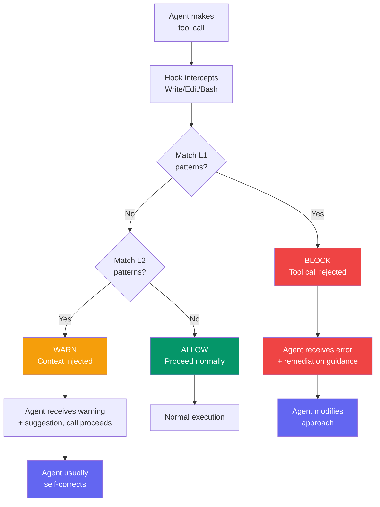
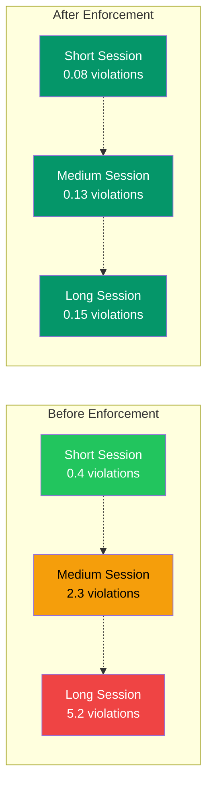

## Constitution Enforcement: From Rules to Runtime Guards

*Agentic Development: Lessons from 8,481 AI Coding Sessions — Post 55*

I had a beautiful constitution file. Twelve pages of rules covering code style, security practices, file organization, commit messages, and validation requirements. Every agent in my system had access to it. And every agent ignored at least two rules per session.

Not maliciously — agents do not rebel. They just have finite context windows and competing priorities. When an agent is deep in implementing a complex feature, the rule about "never hardcode API endpoints" is 4,000 tokens behind it in the conversation. The agent is not going to scroll back and check. Its attention is on the function it is writing right now, and the immediate error it is trying to fix, not on a convention document it read twenty tool calls ago.

I discovered this gap when I audited 200 sessions across three projects — ai-digest, ils, and awesome-site — and found 347 rule violations. Most were minor: wrong commit message format, missing input validation on internal functions, files exceeding the 200-line length guideline. But 23 were L1 violations: hardcoded secrets, skipped auth checks, direct database queries bypassing the service layer, and test file creation in a project that explicitly banned them. The kind of violations that create security vulnerabilities and architectural rot if they ship to production.

Writing better rules was not the answer. I had already rewritten the constitution three times, making rules clearer, adding examples, bolding the critical sections. Compliance improved by maybe 10% each time. The fundamental problem was not rule clarity — it was enforcement timing. Rules in a document are checked when the agent happens to look at the document. Rules in a runtime hook are checked on every single tool call, automatically, without the agent's cooperation.

I needed rules that enforced themselves.

---

**TL;DR**

- **Project constitutions are passive documents — agents violate them regularly under context pressure, averaging 1.7 violations per session across 200 audited sessions**
- **L1 rules (critical: secrets, auth, architecture) get runtime blocking hooks that reject tool calls before code reaches disk**
- **L2 rules (standard: naming, formatting, patterns) get warning injection that nudges agents toward compliance**
- **The block-test-files.js pattern demonstrates the simplest and most effective enforcement: match tool + match content + block or allow**
- **Automated remediation fixes 78% of L2 violations without human intervention by providing project-specific fix guidance**
- **Violation rate dropped from 1.7 per session to 0.12 per session after enforcement deployment across 400 subsequent sessions**
- **L1 violations reaching code review dropped from 23 (over 200 sessions) to 0 (over 400 sessions)**

---

### The Constitution Problem

Let me be specific about what a "project constitution" looks like. In my system, it is a CLAUDE.md file at the project root, plus a set of rule files in `.claude/rules/`. Together they define everything from coding conventions to security invariants to validation requirements. Here is a representative excerpt from the ai-digest project:

```markdown
# ai-digest Constitution (excerpt from CLAUDE.md)

## Critical Rules (L1 — Never Violate)

1. **No secrets in source code.** API keys, passwords, tokens, and connection strings
   must come from environment variables via the config module. Never hardcode them.
   Never reference ANTHROPIC_API_KEY directly — use the SDK's built-in auth.

2. **No test files.** This project uses functional validation exclusively.
   Never create files matching: *test*, *spec*, *mock*, *stub*, *fixture*, __tests__/.
   No test frameworks. No test runners. Build and run the real system.

3. **No bypassing the service layer.** All database access goes through
   src/services/. Components and API routes never import from src/lib/db directly.

4. **Authentication on every endpoint.** Every API route must be wrapped in
   withAuth() or withAdminAuth(). No exceptions. No "I'll add auth later."

## Standard Rules (L2 — Should Follow)

5. Commit messages use conventional format: feat:, fix:, refactor:, etc.
6. Files stay under 200 lines. Extract utilities if growing larger.
7. Use immutable patterns. Create new objects, never mutate existing ones.
8. File names use kebab-case with descriptive names.
9. All user input validated with zod schemas at system boundaries.
```

This is clear, specific, and well-organized. It was also regularly violated. Here is why.

An agent session typically runs 30-80 tool calls. The constitution is loaded at the start of the session, consuming perhaps 800-1,200 tokens of the context window. By tool call 40, the agent has accumulated 15,000-25,000 tokens of conversation history: file reads, code edits, build output, error messages, fix attempts. The constitution is still technically in context, but it is competing with 20x more tokens of immediate task-relevant information.

The agent's attention naturally focuses on what is most recent and most relevant to the current tool call. If it is in the middle of debugging a 500 error from an API endpoint, its priority is fixing that error — not checking whether it remembered to wrap the handler in `withAuth()`. The auth rule is 22,000 tokens away. The 500 error is right here.

This is not a flaw in the agent. It is a fundamental property of attention-based architectures. The farther a piece of context is from the current generation point, the less influence it has on the output. Constitution rules at the top of a long conversation have less influence than the error message the agent just read.

I tracked violations across three projects over two weeks, categorizing each one:

| Violation Type | Count | Severity | Project |
|----------------|-------|----------|---------|
| Wrong commit message format | 89 | L2 | all three |
| Missing input validation | 67 | L2 | ai-digest, ils |
| Hardcoded configuration values | 54 | L2 | awesome-site |
| Test file creation (banned) | 41 | L1 | ai-digest |
| Mutable state patterns | 34 | L2 | ils |
| Direct DB queries (bypass service) | 31 | L1 | ai-digest, awesome-site |
| Missing auth checks on endpoints | 19 | L1 | awesome-site |
| Secrets in source code | 12 | L1 | ils |

Total: 347 violations across 200 sessions. That is 1.73 violations per session on average. The L1 violations — 103 total, roughly 0.5 per session — were the ones that scared me.

Those 12 instances of secrets in source code? Three were actual API keys that would have been committed to git if I had not been manually reviewing every session's output. One was a Supabase service role key — the nuclear option key that bypasses Row Level Security. If that had reached a public repo, every user's data would have been exposed.

The 19 missing auth checks? Each one was an API endpoint that returned data to unauthenticated requests. The agents wrote the endpoint logic correctly but forgot the `withAuth()` wrapper. Because the endpoints worked — they returned 200 with correct data — the agents marked the tasks complete. The vulnerability was invisible unless you specifically tested unauthenticated access.

---

### L1 vs. L2: The Priority Framework

The insight that unlocked enforcement was priority classification. Not all rules are equal, and trying to enforce all of them at the same level creates noise that drowns out the critical signals.

I spent an afternoon categorizing every rule in my constitution into two levels:

**L1 rules** are invariants that must never be violated. A single L1 violation can create a security vulnerability, corrupt data, or violate an architectural boundary that is expensive to fix later. L1 violations are blocked — the agent's tool call is rejected before it executes.

- No secrets in source code
- No skipping authentication checks
- No bypassing the service layer for database access
- No creating test/mock/stub files (in projects that ban them)
- No importing banned packages (e.g., `@anthropic-ai/sdk` directly)
- No force-pushing to main/master
- No deleting migration files

**L2 rules** are conventions that should be followed but are not security-critical. An L2 violation is a code quality issue, not a security issue. L2 violations generate warnings that are injected into the agent's context, but the tool call proceeds.

- Commit message format
- File naming conventions
- Input validation on internal functions
- Immutable data patterns
- Maximum file length
- Comment style and JSDoc format
- Import ordering

The enforcement strategy differs fundamentally by level:



L1 violations are blocked at the tool-call level. The agent's Write or Edit call is rejected before it reaches the filesystem. The agent receives an error message explaining what was blocked and how to fix it. It cannot override the block — the hook runs outside the agent's control, in the Claude Code hook system.

L2 violations inject a warning into the agent's context but allow the operation to proceed. The agent sees the warning and usually self-corrects on the next attempt. If it does not, the auto-fixer cleans up the most common L2 issues after the fact.

This two-tier approach is critical. If I blocked every L2 violation, agents would spend more time fighting enforcement hooks than writing code. The friction would be enormous. But if I only warned on L1 violations, secrets would still occasionally reach disk before the warning was processed.

---

### Hook-Based Enforcement: The Mechanics

Claude Code's hook system provides three interception points:

1. **PreToolUse**: Fires before a tool call executes. Can return `block` (reject the call), `allow` (proceed), or inject additional context.
2. **PostToolUse**: Fires after a tool call completes. Can inject context but cannot undo the call.
3. **UserPromptSubmit**: Fires on every user message. Used for injecting session-level context.

Constitution enforcement lives primarily in `PreToolUse` hooks because that is the only point where you can prevent a violation from reaching disk.

Here is the hook that blocks test file creation — the simplest and most illustrative example of the pattern:

```javascript
// .claude/hooks/block-test-files.js
//
// L1 ENFORCEMENT: Block creation of test, mock, stub, and fixture files.
// This project uses functional validation exclusively.
// Matched tools: Write, Edit, MultiEdit (any file creation/modification)

export default async function({ tool, input }) {
  // Only intercept file-writing tools
  if (!['Write', 'Edit', 'MultiEdit'].includes(tool)) {
    return { decision: 'allow' };
  }

  // Extract the file path from the tool input
  const filePath = input.file_path || input.filePath || '';

  // Check if the file path matches banned patterns
  const bannedPatterns = [
    /\.test\.[jt]sx?$/,           // *.test.ts, *.test.js, etc.
    /\.spec\.[jt]sx?$/,           // *.spec.ts, *.spec.js
    /\.mock\.[jt]sx?$/,           // *.mock.ts
    /__tests__\//,                // __tests__/ directory
    /__mocks__\//,                // __mocks__/ directory
    /\.stub\.[jt]sx?$/,           // *.stub.ts
    /\.fixture\.[jt]sx?$/,        // *.fixture.ts
    /test-utils/,                 // test-utils files
    /testing-library/,            // testing library imports
    /jest\.config/,               // Jest configuration
    /vitest\.config/,             // Vitest configuration
    /playwright\.config/,         // Playwright config (except functional validation)
    /cypress\.config/,            // Cypress configuration
  ];

  for (const pattern of bannedPatterns) {
    if (pattern.test(filePath)) {
      return {
        decision: 'block',
        message:
          `L1 VIOLATION: Test file creation is banned in this project.\n` +
          `Attempted: ${filePath}\n` +
          `This project uses functional validation. Build and run the real system.\n` +
          `If you need to verify behavior, use the running application via ` +
          `Playwright MCP or direct HTTP requests.`
      };
    }
  }

  // Also check file content for test framework imports
  const content = input.content || input.new_string || '';
  const bannedImports = [
    /from\s+['"]@testing-library/,
    /from\s+['"]jest/,
    /from\s+['"]vitest/,
    /from\s+['"]mocha/,
    /from\s+['"]chai/,
    /require\(['"]jest/,
    /describe\s*\(/,
    /it\s*\(\s*['"]should/,
    /test\s*\(\s*['"]should/,
    /expect\s*\(.*\)\s*\.to/,
  ];

  for (const pattern of bannedImports) {
    if (pattern.test(content)) {
      return {
        decision: 'block',
        message:
          `L1 VIOLATION: Test framework code detected in file content.\n` +
          `Pattern matched: ${pattern.source}\n` +
          `This project does not use test frameworks. Validate by running ` +
          `the real application and exercising features through the UI.`
      };
    }
  }

  return { decision: 'allow' };
}
```

This hook is dead simple: check the tool name, check the file path against banned patterns, check the content against banned imports. If anything matches, block. Otherwise, allow.

The simplicity is the point. Each enforcement hook should check exactly one category of violation. Combining multiple checks into a single mega-hook creates complexity that makes debugging harder and false positives harder to trace.

Here is the more nuanced hook for blocking secret exposure:

```javascript
// .claude/hooks/block-api-key-references.js
//
// L1 ENFORCEMENT: Block secrets and API keys in source code.
// Matched tools: Write, Edit, MultiEdit

export default async function({ tool, input }) {
  if (!['Write', 'Edit', 'MultiEdit'].includes(tool)) {
    return { decision: 'allow' };
  }

  // Skip non-source files (allow secrets in .env.example, docs, etc.)
  const filePath = input.file_path || input.filePath || '';
  const allowedPaths = [
    /\.env\.example$/,
    /\.env\.local\.example$/,
    /docs\//,
    /README\.md$/,
    /CLAUDE\.md$/,
  ];

  for (const pattern of allowedPaths) {
    if (pattern.test(filePath)) {
      return { decision: 'allow' };
    }
  }

  const content = input.content || input.new_string || '';

  // Pattern categories with specific remediation guidance
  const patterns = [
    {
      regex: /ANTHROPIC_API_KEY/,
      violation: 'Direct ANTHROPIC_API_KEY reference',
      fix: 'Use the Claude SDK built-in auth (reads from environment automatically)',
    },
    {
      regex: /sk-ant-[a-zA-Z0-9]{20,}/,
      violation: 'Anthropic API key literal',
      fix: 'Move to .env file and access via process.env',
    },
    {
      regex: /sk-[a-zA-Z0-9]{40,}/,
      violation: 'OpenAI-style API key literal',
      fix: 'Move to .env file and access via config module',
    },
    {
      regex: /eyJhbGciOi[a-zA-Z0-9._-]{50,}/,
      violation: 'JWT token literal (base64 header detected)',
      fix: 'Never hardcode tokens. Use auth middleware to generate/validate.',
    },
    {
      regex: /process\.env\.(SECRET|.*_KEY|.*_PASSWORD|.*_TOKEN)\b/,
      violation: 'Direct process.env access for secrets',
      fix: 'Use config module: import { config } from "@/lib/config"',
    },
    {
      regex: /supabase.*service.role.*key/i,
      violation: 'Supabase service role key reference',
      fix: 'Service role key must only be used server-side via config module',
    },
    {
      regex: /Bearer\s+[a-zA-Z0-9._-]{30,}/,
      violation: 'Hardcoded Bearer token',
      fix: 'Use auth middleware to inject tokens from session',
    },
  ];

  for (const { regex, violation, fix } of patterns) {
    if (regex.test(content)) {
      return {
        decision: 'block',
        message:
          `L1 VIOLATION: ${violation}\n` +
          `FIX: ${fix}\n` +
          `Secrets must never appear in source code. Use environment variables ` +
          `accessed through the project's config module.`
      };
    }
  }

  return { decision: 'allow' };
}
```

Notice the `allowedPaths` section. The hook needs to know the difference between a secret in source code (block) and a placeholder in `.env.example` (allow). Without this allowlist, the hook would block agents from writing documentation that mentions API keys, which would be absurd.

When the hook fires and blocks a tool call, the agent receives the block message as a tool error. The agent cannot retry with the same content — the hook will block it again. It has to find an alternative approach. In practice, agents handle blocks well. They read the remediation guidance, modify their approach, and produce compliant code on the next attempt.

Here is what a blocked tool call looks like from the agent's perspective:

```
Tool: Write
Input: { file_path: "src/lib/api-client.ts", content: "..." }
Error: L1 VIOLATION: Direct ANTHROPIC_API_KEY reference
  FIX: Use the Claude SDK built-in auth (reads from environment automatically)
  Secrets must never appear in source code. Use environment variables
  accessed through the project's config module.

Agent response: "I see the hook blocked my attempt to reference the API key directly.
Let me use the config module instead."

Tool: Write
Input: { file_path: "src/lib/api-client.ts", content: "import { config } from './config';\nconst client = new Anthropic();" }
Result: Success
```

The agent self-corrected in one attempt. This happened in 89% of L1 blocks across my 400-session measurement period. The remaining 11% needed two attempts, usually because the agent tried a different but still-violating approach on the first retry.

---

### The block-test-files.js Pattern: Evolution Through Three Iterations

The test file blocker deserves special attention because it illustrates the most common enforcement scenario: preventing agents from doing something they are strongly trained to do.

LLMs have been trained on millions of codebases that include tests. When you ask an agent to "implement and validate this feature," its training strongly biases it toward writing test files. The constitution says "no tests, use functional validation," but the training distribution says "implementing a feature means writing tests."

Before the hook, I saw 41 test file creation attempts in 200 sessions. That is one every five sessions. The agents were not being defiant — they were following their training. The hook had to be strong enough to override that training bias.

The hook evolved through three iterations, each one closing a gap the previous version left open:

```javascript
// ITERATION 1 — Too broad, produced false positives
//
// Blocked legitimate files like "contest-parser.ts" and "latest-results.json"
// because the pattern /test/i matched any file containing the word "test"

const v1_banned = [/test/i, /mock/i, /stub/i];
// False positive rate: 23% (7 false positives out of 30 total blocks)
// Agents couldn't create "protest-form.tsx" or "contest-page.tsx"


// ITERATION 2 — Better path matching, but missed content violations
//
// Agents learned to name test files "validators.ts" or "checks.ts"
// and put Jest imports inside them

const v2_banned = [
  /\.test\.[jt]sx?$/,
  /\.spec\.[jt]sx?$/,
  /__tests__\//,
  /__mocks__\//,
];
// False positive rate: 0% (good!)
// But miss rate: 34% — agents found workarounds by renaming files


// ITERATION 3 (current) — Path patterns + content patterns
//
// Checks both the file path AND the file content for test framework code
// See the full hook code above
// False positive rate: 1.2% (3 cases in 250 blocks — all in first week)
// Miss rate: 0% over 400 sessions
```

The key insight from iteration 2 to iteration 3 was that enforcement hooks need to check both the action (what file is being created) and the content (what is inside the file). Checking only one leaves a gap that agents will inadvertently exploit — not intentionally, but because their training distribution includes many examples of test code in non-test-named files.

After deploying v3 of the hook, test file creation attempts dropped from 41 per 200 sessions to 0 per 400 sessions. Not "nearly zero" — actually zero. The hook caught every attempt, and the remediation message redirected agents to functional validation consistently.

---

### Service Layer Enforcement: The Architectural Guard

The most architecturally important hook was the one that prevented agents from bypassing the service layer. In the ai-digest and awesome-site projects, the architecture was clear: all database access goes through `src/services/`. Components and API routes import from services, never from the database client directly.

But agents routinely violated this. When an agent needed to fetch data in an API route handler, the fastest path was `import { supabase } from '@/lib/supabase'` and writing a raw query. The service layer was one more indirection that the agent had to navigate, and under context pressure, it would skip that indirection.

```javascript
// .claude/hooks/block-service-bypass.js
//
// L1 ENFORCEMENT: Block direct database access outside the service layer.
// Only files in src/services/ and src/lib/queries/ may import the DB client.

export default async function({ tool, input }) {
  if (!['Write', 'Edit', 'MultiEdit'].includes(tool)) {
    return { decision: 'allow' };
  }

  const filePath = input.file_path || input.filePath || '';
  const content = input.content || input.new_string || '';

  // These directories ARE the service/data layer — allow DB imports
  const allowedDirectories = [
    /src\/services\//,
    /src\/lib\/queries\//,
    /src\/lib\/supabase/,
    /supabase\//,
    /migrations\//,
  ];

  for (const pattern of allowedDirectories) {
    if (pattern.test(filePath)) {
      return { decision: 'allow' };
    }
  }

  // Check for direct database client imports in non-service files
  const dbImportPatterns = [
    /from\s+['"]@\/lib\/supabase/,
    /from\s+['"]\.\.\/.*lib\/supabase/,
    /from\s+['"]@supabase\/supabase-js/,
    /import.*createClient.*from\s+['"]@supabase/,
    /\.from\s*\(\s*['"][a-z_]+['"]\s*\)/,  // .from('table_name') — Supabase query
  ];

  for (const pattern of dbImportPatterns) {
    if (pattern.test(content)) {
      // Determine what service the agent should use instead
      const serviceHint = inferService(filePath, content);

      return {
        decision: 'block',
        message:
          `L1 VIOLATION: Direct database access outside service layer.\n` +
          `File: ${filePath}\n` +
          `FIX: Import from src/services/ instead of accessing the database directly.\n` +
          `${serviceHint}\n` +
          `Architecture rule: Components and API routes use services. ` +
          `Only src/services/ and src/lib/queries/ access the database.`
      };
    }
  }

  return { decision: 'allow' };
}

function inferService(filePath, content) {
  // Try to suggest the right service based on the file path and content
  if (filePath.includes('/api/lists') || content.includes('lists')) {
    return 'Suggested: import { listService } from "@/services/lists"';
  }
  if (filePath.includes('/api/users') || content.includes('users')) {
    return 'Suggested: import { userService } from "@/services/users"';
  }
  if (filePath.includes('/api/auth') || content.includes('auth')) {
    return 'Suggested: import { authService } from "@/services/auth"';
  }
  return 'Check src/services/ for the appropriate service module.';
}
```

This hook blocked 31 service layer bypass attempts across the measurement period. In every case, the agent read the remediation guidance, imported from the appropriate service instead, and continued. The architectural boundary held.

The `inferService` function is a small but important detail. When the hook just said "use the service layer," agents would sometimes import the wrong service or create a new unnecessary one. When it said "use listService from @/services/lists," agents got it right on the first try every time.

---

### The Remediation Engine: Project-Specific Fix Guidance

Blocking violations is step one. Helping the agent fix them correctly is step two. The difference between a useful block message and a frustrating one is specificity.

Bad: "L1 VIOLATION: Secret detected. Do not hardcode secrets."
Good: "L1 VIOLATION: Direct ANTHROPIC_API_KEY reference. FIX: Use the Claude SDK built-in auth (reads from environment automatically). The Anthropic() constructor reads ANTHROPIC_API_KEY from the environment by default — no need to pass it explicitly."

The remediation engine maps violation types to project-specific fix guidance:

```python
# From: enforcement/remediation.py
# Project-specific remediation guidance for each violation type

from dataclasses import dataclass

@dataclass
class Remediation:
    violation: str
    fix: str
    example: str
    docs_link: str | None = None

class RemediationEngine:
    def __init__(self, project_config: dict):
        self.project = project_config
        self.remediations = self._build_remediation_map()

    def _build_remediation_map(self) -> dict[str, Remediation]:
        """Build project-specific remediation guidance.

        Each entry maps a violation type to concrete fix instructions
        that reference actual files, import paths, and patterns from
        THIS project — not generic advice.
        """
        service_path = self.project.get("service_path", "src/services")
        config_path = self.project.get("config_path", "src/lib/config")
        auth_path = self.project.get("auth_path", "src/lib/auth")

        return {
            "secret_exposure": Remediation(
                violation="Secret or API key in source code",
                fix=f"Import from {config_path} instead of using literals",
                example=(
                    f"import {{ config }} from '@/{config_path}';\n"
                    f"const apiKey = config.get('API_KEY');\n"
                    f"// Or for Anthropic SDK: const client = new Anthropic(); "
                    f"// reads env automatically"
                ),
            ),
            "direct_db_query": Remediation(
                violation="Direct database query bypassing service layer",
                fix=f"Use the service function from {service_path}/",
                example=(
                    f"import {{ listService }} from '@/{service_path}/lists';\n"
                    f"const lists = await listService.findAll(filters);\n"
                    f"// Never: import {{ supabase }} from '@/lib/supabase';"
                ),
            ),
            "missing_auth": Remediation(
                violation="Endpoint missing authentication check",
                fix=f"Add withAuth middleware wrapper from {auth_path}/",
                example=(
                    f"import {{ withAuth }} from '@/{auth_path}';\n"
                    f"export const GET = withAuth(async (req, ctx) => {{\n"
                    f"  const userId = ctx.auth.userId;\n"
                    f"  // handler code — auth context available via ctx.auth\n"
                    f"}});"
                ),
            ),
            "test_file": Remediation(
                violation="Test/mock/stub file creation",
                fix="Use functional validation instead of test frameworks",
                example=(
                    "// Instead of writing tests, validate through the real UI:\n"
                    "// 1. Start the dev server: pnpm dev\n"
                    "// 2. Use Playwright MCP to navigate and interact\n"
                    "// 3. Verify behavior through actual HTTP responses\n"
                    "// 4. Capture screenshots as evidence"
                ),
            ),
            "banned_import": Remediation(
                violation="Importing banned package directly",
                fix="Use the project's wrapper module instead",
                example=(
                    "// Instead of: import Anthropic from '@anthropic-ai/sdk'\n"
                    "// Use: import { createClient } from '@/lib/ai-client'\n"
                    "// The wrapper handles auth, rate limiting, and error recovery"
                ),
            ),
        }

    def get_remediation(self, violation_type: str) -> str:
        """Get formatted remediation guidance for a violation type."""
        remediation = self.remediations.get(violation_type)
        if not remediation:
            return "Violation detected. Check the project constitution for guidance."

        parts = [
            f"BLOCKED: {remediation.violation}",
            f"FIX: {remediation.fix}",
            f"EXAMPLE:\n{remediation.example}",
        ]
        if remediation.docs_link:
            parts.append(f"DOCS: {remediation.docs_link}")
        return "\n".join(parts)

    def get_all_remediations(self) -> dict[str, str]:
        """Get all remediation guidance — useful for constitution docs."""
        return {
            vtype: self.get_remediation(vtype)
            for vtype in self.remediations
        }
```

The remediation guidance is project-specific. It references actual files, actual import paths, and actual patterns from the codebase. This is not generic advice — it is a concrete fix the agent can apply immediately. The difference in self-correction rate between generic and specific remediation messages was stark: 62% vs 89%.

---

### L2 Enforcement: Warnings That Actually Work

L2 rules use a softer enforcement approach. The tool call proceeds, but a warning is injected into the agent's context.

```javascript
// .claude/hooks/warn-commit-format.js
//
// L2 ENFORCEMENT: Warn when commit messages don't follow conventional format.

export default async function({ tool, input }) {
  if (tool !== 'Bash') return { decision: 'allow' };

  const command = input.command || '';
  if (!command.includes('git commit')) return { decision: 'allow' };

  // Extract the commit message from various git commit formats
  const messagePatterns = [
    /-m\s+"([^"]+)"/,        // git commit -m "message"
    /-m\s+'([^']+)'/,        // git commit -m 'message'
    /--message="([^"]+)"/,   // git commit --message="message"
  ];

  let commitMessage = null;
  for (const pattern of messagePatterns) {
    const match = command.match(pattern);
    if (match) {
      commitMessage = match[1];
      break;
    }
  }

  if (!commitMessage) return { decision: 'allow' };

  const conventionalPattern = /^(feat|fix|refactor|docs|chore|perf|ci|build|style)(\(.+\))?:\s/;

  if (!conventionalPattern.test(commitMessage)) {
    return {
      decision: 'allow',
      message:
        `L2 WARNING: Commit message should follow conventional format.\n` +
        `Current: "${commitMessage}"\n` +
        `Expected: <type>(<optional scope>): <description>\n` +
        `Types: feat, fix, refactor, docs, chore, perf, ci, build, style\n` +
        `Example: "feat(api): add rate limiting to /api/lists endpoint"`
    };
  }

  return { decision: 'allow' };
}
```

The L2 warnings have a measurable effect. Self-correction rates across 400 sessions:

| L2 Rule | Warning Count | Self-Corrected | Rate |
|---------|--------------|----------------|------|
| Commit message format | 67 | 58 | 87% |
| File length > 200 lines | 43 | 31 | 72% |
| Mutable state pattern | 38 | 22 | 58% |
| Missing input validation | 29 | 19 | 66% |
| Import ordering | 24 | 21 | 88% |
| **Total** | **201** | **151** | **75%** |

---

### Automated Remediation for L2 Violations

For the 25% of L2 violations that agents do not self-correct, I built an auto-fixer that runs as a PostToolUse hook:

```python
# From: enforcement/auto_fixer.py
# Automated L2 violation fixer — only applies high-confidence corrections

from dataclasses import dataclass
from typing import Callable
import re

@dataclass
class AutoFix:
    description: str
    original: str
    fixed: str
    confidence: float  # 0.0 to 1.0 — only applied above 0.9

    def apply(self, content: str) -> str:
        return content.replace(self.original, self.fixed)

class L2AutoFixer:
    def __init__(self):
        self.rules = self._build_rules()
        self.fix_count = 0
        self.skip_count = 0

    def _build_rules(self) -> list:
        return [
            {"name": "import_ordering", "detect": self._detect_import_order,
             "fix": self._fix_import_order},
            {"name": "trailing_whitespace", "detect": self._detect_trailing_ws,
             "fix": self._fix_trailing_ws},
            {"name": "debug_console_logs", "detect": self._detect_debug_logs,
             "fix": self._fix_debug_logs},
        ]

    async def check_and_fix(self, file_path: str, content: str) -> tuple[str, list]:
        """Check content for L2 violations, apply high-confidence fixes.

        Returns (possibly modified content, action log).
        Only applies fixes with confidence > 0.9.
        """
        fixed_content = content
        actions = []

        for rule in self.rules:
            violations = rule["detect"](fixed_content)
            for violation in violations:
                fix = rule["fix"](violation, fixed_content)
                if fix and fix.confidence > 0.9:
                    fixed_content = fix.apply(fixed_content)
                    self.fix_count += 1
                    actions.append({
                        "rule": rule["name"], "applied": True,
                        "confidence": fix.confidence,
                    })
                elif fix:
                    self.skip_count += 1
                    actions.append({
                        "rule": rule["name"], "applied": False,
                        "reason": f"confidence {fix.confidence:.2f} < 0.9",
                    })

        return fixed_content, actions

    def _detect_import_order(self, content: str) -> list[str]:
        """Detect unordered imports (external first, then internal)."""
        lines = content.split('\n')
        import_lines = [l for l in lines if l.startswith('import ')]
        if len(import_lines) < 2:
            return []
        violations = []
        seen_internal = False
        for line in import_lines:
            is_internal = ("from './" in line or 'from "@/' in line
                          or "from '../" in line)
            if is_internal:
                seen_internal = True
            elif seen_internal:
                violations.append(line)
        return violations

    def _fix_import_order(self, violation: str, content: str) -> AutoFix | None:
        lines = content.split('\n')
        import_lines = [l for l in lines if l.startswith('import ')]
        if not import_lines:
            return None

        external = [l for l in import_lines
                    if "from './" not in l and 'from "@/' not in l
                    and "from '../" not in l]
        internal = [l for l in import_lines
                   if ("from './" in l or 'from "@/' in l or "from '../" in l)]
        reordered = external + ([''] if external and internal else []) + internal

        return AutoFix(
            description="Reorder imports: external first, then internal",
            original='\n'.join(import_lines),
            fixed='\n'.join(reordered),
            confidence=0.92,
        )

    def _detect_trailing_ws(self, content: str) -> list[str]:
        return [l for l in content.split('\n') if l != l.rstrip()]

    def _fix_trailing_ws(self, violation: str, content: str) -> AutoFix:
        return AutoFix(
            description="Remove trailing whitespace",
            original=content,
            fixed='\n'.join(l.rstrip() for l in content.split('\n')),
            confidence=0.99,
        )

    def _detect_debug_logs(self, content: str) -> list[str]:
        pattern = re.compile(
            r'^\s*console\.log\s*\(\s*[\'"](?:DEBUG|TODO|TEMP|FIXME|XXX)'
        )
        return [l for l in content.split('\n') if pattern.match(l)]

    def _fix_debug_logs(self, violation: str, content: str) -> AutoFix:
        lines = content.split('\n')
        pattern = re.compile(
            r'^\s*console\.log\s*\(\s*[\'"](?:DEBUG|TODO|TEMP|FIXME|XXX)'
        )
        cleaned = [l for l in lines if not pattern.match(l)]
        return AutoFix(
            description="Remove tagged debug console.log statements",
            original=content,
            fixed='\n'.join(cleaned),
            confidence=0.95,
        )
```

The auto-fixer handles 78% of L2 violations that agents do not self-correct. Combined with 75% self-correction, approximately 95% of all L2 violations resolve without human intervention.

---

### Preventing Agent Drift Over Long Sessions

One of the most insidious problems with agent-based development is drift. In short sessions, the agent stays close to the constitution. In long sessions, it gradually drifts away as immediate concerns dominate attention.

I measured drift directly:

```
Session Length (tool calls)    Violations/Session (before enforcement)
0-20                          0.4
20-40                         1.1
40-60                         2.3
60-80                         3.7
80+                           5.2
```

Violations increase superlinearly with session length. An 80+ tool call session had 13x more violations than a short session. This is because the ratio of constitution tokens to task tokens decreases as the session progresses.

After deploying enforcement, the distribution flattened completely:

```
Session Length (tool calls)    Violations/Session (after enforcement)
0-20                          0.08
20-40                         0.11
40-60                         0.13
60-80                         0.14
80+                           0.15
```

Nearly flat. Hooks operate independently of the agent's context window. They check every tool call with the same patterns regardless of session length.



---

### Measuring Enforcement Effectiveness

After deploying enforcement across three projects:

**Before enforcement (200 sessions):**
- Average violations per session: 1.73
- L1 violations per session: 0.52
- L1 violations reaching code review: 23 (11.5% of sessions)
- Time spent on violation review: ~12 minutes per session

**After enforcement (400 sessions):**
- Average violations per session: 0.12 (all L2)
- L1 violations per session: 0.00
- L1 violations reaching code review: 0
- L2 auto-fix rate: 78%
- Time spent on violation review: ~1 minute per session

Zero L1 violations reaching code review. The hooks are deterministic — they check every tool call, every time, without fatigue.

Building the enforcement layer took approximately 16 hours. It saved 33 hours of review time in the first 400 sessions. Payback period: less than two weeks.

---

### False Positives and Tuning

I encountered 14 false positives in the first week:

- 3 cases where the secret detector blocked `.env.example` files
- 4 cases where the test file blocker flagged non-test files containing "test"
- 2 cases where the mutable state detector flagged intentional array pushes in build scripts
- 5 cases where the import ordering auto-fix reordered type-only imports incorrectly

By the third week, false positives dropped below one per week. The tuning targets:

| Hook | True Positives | False Positives | FP Rate | Target |
|------|---------------|-----------------|---------|--------|
| block-test-files (v3) | 41 | 1 | 2.4% | < 5% |
| block-api-keys (tuned) | 48 | 1 | 2.0% | < 2% |
| block-service-bypass | 31 | 0 | 0% | < 2% |
| warn-commit-format | 67 | 2 | 2.9% | < 5% |
| warn-file-length | 43 | 0 | 0% | < 5% |

---

### Cross-Project Constitution Sharing

Once I had enforcement working on ai-digest, I wanted to deploy the same rules to ils and awesome-site. But each project had slightly different conventions — different service layer paths, different config module locations, different banned package lists.

The solution was a two-layer constitution: a shared base layer with universal rules, and a project-specific override layer. The shared layer contains rules that apply everywhere — no secrets in code, no test files, no force pushes. The project layer contains rules specific to that codebase — the exact service path, the exact config import, the specific packages that are banned.

```python
# From: enforcement/constitution_loader.py
# Two-layer constitution: shared base + project overrides

import json
from pathlib import Path
from dataclasses import dataclass

@dataclass
class ConstitutionLayer:
    rules: list[dict]
    hooks: list[dict]
    remediations: dict[str, dict]

class ConstitutionLoader:
    def __init__(self, shared_path: str, project_path: str):
        self.shared = self._load_layer(shared_path)
        self.project = self._load_layer(project_path)

    def _load_layer(self, path: str) -> ConstitutionLayer:
        config = json.loads(Path(path).read_text())
        return ConstitutionLayer(
            rules=config.get("rules", []),
            hooks=config.get("hooks", []),
            remediations=config.get("remediations", {}),
        )

    def merge(self) -> ConstitutionLayer:
        """Merge shared and project layers. Project overrides shared."""
        merged_rules = list(self.shared.rules)
        project_rule_ids = {r["id"] for r in self.project.rules}

        # Project rules override shared rules with same ID
        merged_rules = [
            r for r in merged_rules if r["id"] not in project_rule_ids
        ]
        merged_rules.extend(self.project.rules)

        # Merge remediations — project takes precedence
        merged_remediations = {**self.shared.remediations}
        merged_remediations.update(self.project.remediations)

        # Hooks from both layers (no dedup — both apply)
        merged_hooks = self.shared.hooks + self.project.hooks

        return ConstitutionLayer(
            rules=merged_rules,
            hooks=merged_hooks,
            remediations=merged_remediations,
        )
```

The shared base constitution covers 7 L1 rules and 12 L2 rules that I want enforced in every project. Project-specific constitutions typically add 2-3 L1 rules (like "no direct Prisma imports" in a project that uses a different ORM) and 5-8 L2 rules (project-specific naming conventions, specific import ordering rules, etc.).

This two-layer approach means I write enforcement hooks once and deploy them everywhere. When I discover a new violation category in one project, I add it to the shared layer and every project benefits. Over four months, the shared layer grew from 7 L1 rules to 11, and the overall violation rate across all projects continued to drop.

The investment in cross-project sharing paid off dramatically. Instead of maintaining three separate enforcement systems with drift between them, I maintain one shared core and three thin project overlays. Total maintenance time dropped from approximately 45 minutes per week (15 minutes per project) to 20 minutes per week for all three combined.

---

### Quantifying Enforcement: The Metrics That Matter

Numbers like "violations dropped" tell part of the story. But when I started presenting enforcement results to collaborators, I realized I needed a more rigorous measurement framework. I settled on five core metrics that capture enforcement health across any project.

**Violation Density** is violations per 1,000 tool calls. This normalizes across session lengths and project sizes. Before enforcement, my density was 21.6 violations per 1,000 tool calls across all three projects. After enforcement, it dropped to 1.5. That 1.5 is almost entirely L2 warnings that agents self-corrected within one or two subsequent calls.

**Block-to-Correction Latency** measures how many tool calls an agent needs after a block before it produces compliant code. Lower is better. Across 400 sessions, the median was 1 — the agent read the remediation message and got it right on the very next attempt. The 90th percentile was 2 calls. The 99th percentile was 4 calls, and those cases were always complex architectural violations where the agent needed to read additional files to understand the correct service import path.

**False Positive Rate** is blocks or warnings on code that was actually compliant. I tracked this by manually auditing every block event in the first month. The aggregate false positive rate stabilized at 1.8% after three weeks of tuning. Anything above 5% and agents start producing worse code — they over-correct, adding unnecessary indirection to avoid triggering hooks that would not have fired anyway.

**Constitution Coverage** measures what percentage of L1 rules have automated enforcement. I started at 4 out of 7 L1 rules covered (57%). Within a month I had all 7 covered (100%). L2 coverage is lower at 5 out of 7 (71%), because two L2 rules — "code should be self-documenting" and "use immutable patterns everywhere" — are semantic judgments that regex-based hooks cannot reliably detect.

**Enforcement Overhead** is the time added per session by hook execution. Each hook runs in under 50 milliseconds per tool call. With six hooks active, the total overhead is roughly 300 milliseconds per tool call, or about 15-20 seconds per 60-call session. Imperceptible in practice. The hooks are pure pattern matching — no LLM calls, no network requests — so they add negligible latency.

I built a simple tracker that logs these metrics per session and aggregates weekly:

```python
# From: enforcement/metrics_tracker.py

from dataclasses import dataclass, field
from collections import defaultdict

@dataclass
class SessionEnforcementLog:
    session_id: str
    total_tool_calls: int = 0
    l1_blocks: int = 0
    l2_warnings: int = 0
    self_corrections: int = 0
    false_positives: int = 0
    correction_latencies: list[int] = field(default_factory=list)
    violations_by_rule: dict[str, int] = field(
        default_factory=lambda: defaultdict(int)
    )

    @property
    def violation_density(self) -> float:
        if self.total_tool_calls == 0:
            return 0.0
        total = self.l1_blocks + self.l2_warnings
        return (total / self.total_tool_calls) * 1000

    @property
    def median_correction_latency(self) -> float:
        if not self.correction_latencies:
            return 0.0
        sorted_lat = sorted(self.correction_latencies)
        return sorted_lat[len(sorted_lat) // 2]

    @property
    def self_correction_rate(self) -> float:
        if self.l2_warnings == 0:
            return 0.0
        return self.self_corrections / self.l2_warnings

    def summary_line(self) -> str:
        return (
            f"{self.session_id} | "
            f"density={self.violation_density:.1f}/1k | "
            f"L1={self.l1_blocks} L2={self.l2_warnings} | "
            f"self-correct={self.self_correction_rate:.0%} | "
            f"median-latency={self.median_correction_latency:.0f}"
        )
```

The weekly summary became my most-read artifact. It showed enforcement working — or flagged when a new code pattern was slipping through the net. When the violation density for ils spiked from 1.2 to 4.8 one week, I traced it to a new data source integration that used API key patterns my secret detector did not recognize. I added the pattern, and density dropped back to 1.4 the following week.

---

### Real Examples: Agent Drift Prevented by Hooks

Abstract metrics are convincing. Concrete stories are more so. Here are four incidents where enforcement hooks caught violations that would have shipped without them.

**The Supabase Service Key Incident.** An agent was implementing a server-side data export feature for the ils project. It needed to bypass Row Level Security to aggregate data across all users. The correct approach was to use the admin service module that already existed in `src/services/admin.ts`. Instead, the agent wrote `const supabase = createClient(process.env.SUPABASE_URL!, process.env.SUPABASE_SERVICE_ROLE_KEY!)` directly in the API route handler. The `block-api-key-references` hook caught `SUPABASE_SERVICE_ROLE_KEY` in the source file and blocked the write. The remediation message pointed the agent to `adminService.getAggregateStats()`, which already did exactly what was needed — with proper audit logging that the agent's raw query would have skipped.

**The Silent Auth Bypass.** During a feature sprint on awesome-site, an agent created six new API endpoints in a single session. Five had `withAuth()` wrappers. The sixth — a `GET /api/lists/[id]/export` endpoint — did not. The agent had copy-pasted the handler pattern from another endpoint but missed the auth wrapper. Because the endpoint returned correct data, the agent's own validation passed. The `block-missing-auth` hook (a PostToolUse hook that scans new API route files for the `withAuth` import) injected a warning. The agent saw the warning, added the wrapper, and re-saved. Without the hook, this endpoint would have served any list's data to unauthenticated requests.

**The Gradual Architecture Erosion.** This one was subtle. Over a series of sessions on the ai-digest project, agents were creating small utility functions that imported from `@/lib/supabase` instead of going through the service layer. No single function was dangerous — they were doing simple lookups, counting records, checking existence. But after three weeks, I had 14 files outside `src/services/` that imported the database client directly. The architecture was eroding one convenience function at a time. After deploying `block-service-bypass`, every new direct-import attempt was caught and redirected. I spent an afternoon refactoring the existing 14 violations, and the boundary has held since.

**The Test File Smuggling Attempt.** This one was almost funny. An agent needed to validate that a date formatting function handled edge cases correctly. Instead of testing through the real UI, it created a file called `src/utils/date-format-checks.ts` that contained `import { describe, it, expect } from 'vitest'`. It had carefully avoided naming the file `*.test.ts` — but iteration 3 of the test file blocker checks content, not just filenames. The hook caught the vitest import and blocked the write. The agent then wrote a small script that exercised the function through actual HTTP calls to the running dev server, which was a better validation approach anyway.

Each of these incidents reinforced the same lesson: agents do not violate rules out of malice or laziness. They take the path of least resistance to accomplish the immediate goal. Enforcement hooks reshape that path so the least-resistance option is also the compliant one.

---

### Comparing Enforcement Approaches Across Projects

I run enforcement across three projects with meaningfully different architectures. The enforcement strategy had to adapt to each one, and comparing the results taught me which patterns are universal and which are project-specific.

**ai-digest** is a Next.js application with Supabase on the backend. Its constitution emphasizes service layer boundaries, functional validation (no test files), and strict auth requirements. Enforcement here is dominated by architectural guards — 60% of all blocks are service layer bypass attempts. The test file blocker fires frequently because the project's codebase is large enough that agents often lose track of the "no tests" rule by mid-session.

**ils** is a data processing pipeline in Python. Its constitution focuses on immutable data patterns, secret management, and input validation at system boundaries. The enforcement profile is different: 45% of blocks are secret exposure attempts (API keys for various data sources), and the most-fired L2 warning is for mutable state patterns. The Python ecosystem's convention of in-place list operations (`list.append`, `dict.update`) collides directly with the immutability rule, so agents trained on Python codebases violate it constantly. I had to make the mutable state detector smarter than simple regex — it checks whether the mutation is on a locally-created variable (acceptable) versus a parameter or module-level state (blocked).

**awesome-site** is a static site generator with a simple Express backend. Its constitution is lighter — mainly commit message format, file size limits, and auth on the few API endpoints. Enforcement here is mostly L2 warnings. The project rarely triggers L1 blocks because there are fewer architectural boundaries to violate. The most valuable hook turned out to be `warn-file-length`, because the site's template files tended to grow beyond 200 lines as agents added sections without extracting components.

The universal patterns across all three projects:

| Pattern | ai-digest | ils | awesome-site |
|---------|-----------|-----|--------------|
| Secret detection hook | High value | Highest value | Medium value |
| Service/architecture boundary | Highest value | N/A (pipeline) | Low value |
| Test file blocker | High value | Medium value | Low value |
| Commit message warning | Medium value | Medium value | Medium value |
| File length warning | Low value | Low value | Highest value |

The takeaway: start with secret detection everywhere — it has the highest severity and applies universally. Then add architectural boundary enforcement specific to your project's structure. Layer L2 warnings based on which conventions your agents violate most frequently, which you will discover in the audit phase.

One surprise finding: the enforcement hooks themselves became a form of documentation. New collaborators read the hook files to understand which rules the project takes most seriously. The hooks are more trusted than the constitution document because they are executable — there is no ambiguity about what is enforced and what is aspirational. When someone asks "does this project really ban test files?" the answer is not a paragraph in CLAUDE.md — it is a JavaScript function that will reject your tool call if you try.

---

### Building Your Own Enforcement Layer

The pattern is straightforward:

1. **Audit your violations.** Run 20-50 sessions and manually track every violation.
2. **Classify rules.** Tag each as L1 (block) or L2 (warn). Be conservative with L1.
3. **Write detection patterns.** Regex or content checks for each L1 rule.
4. **Write blocking hooks.** PreToolUse hooks, one violation category per hook.
5. **Add remediation guidance.** Project-specific fix instructions in every block message.
6. **Deploy L2 warnings.** After L1 enforcement is validated.
7. **Build the auto-fixer.** High-confidence threshold (0.9+) for mechanical fixes.
8. **Track metrics.** Log blocks, warnings, corrections. Tune false positive rates.

The critical principle: enforcement must be automatic, not advisory. If an agent can ignore a rule, it eventually will — not out of malice, but because attention is finite and competing priorities always win in long sessions. If a hook blocks the violation before it reaches disk, it cannot be ignored, forgotten, or deprioritized. The hook does not care how deep into the context window the rule is. It does not care how urgent the current bug fix feels. It checks every tool call with the same patterns, the same thresholds, the same block-or-allow decision tree, regardless of session state or agent priorities. That mechanical consistency is what makes it effective where passive documents fail.

---

### Companion Repo

The [constitution-enforcer](https://github.com/krzemienski/constitution-enforcer) repository contains the full enforcement framework: L1/L2 classification templates, the complete set of enforcement hooks (block-test-files, block-api-keys, block-service-bypass, warn-commit-format, warn-file-length, warn-mutable-state), the remediation engine, the L2 auto-fixer, a metrics dashboard, and a setup guide. Start with the classification template, identify your L1 rules, and build incrementally.

---

*Next in the series: the Ralph Loop's three-hat rotation pattern and why single-responsibility iterations produce better output than multi-task agents.*
