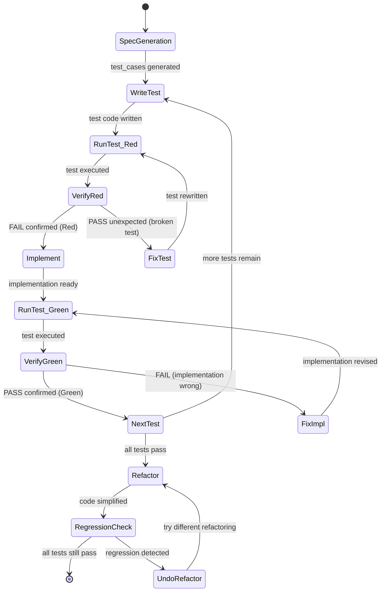
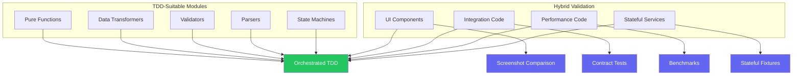

## TDD in Orchestration Loops: Red-Green-Refactor with Agent Events

I was watching an agent build a calculator module when something clicked. The agent wrote a function, ran it, found an edge case, fixed the function, ran it again. It was already doing test-driven development -- informally, without the discipline of actual test assertions, and without any guarantee that it would systematically explore the input space.

What if I made it formal? What if the orchestration loop itself enforced the red-green-refactor cycle? Write a failing test, emit an event, hand off to the implementation agent, run the test, emit the result, repeat until green.

I tried it on a calculator demo first because calculators have well-defined inputs and outputs. Forty-five tests later, the implementation was rock solid. Not because the agent was smarter, but because the orchestration loop forced it to prove correctness at every step.

The surprising part: the TDD loop caught 12 bugs that a write-then-test approach missed entirely. The bugs were not in the happy path -- they were in boundary conditions and error handling that the agent would never have tested voluntarily. Floating-point precision. IEEE 754 negative zero semantics. Integer overflow at the edges of safe integer ranges. The kinds of bugs that ship to production and surface six months later as mysterious user reports.

This is post 57 of 61 in the Agentic Development series. The companion repo is at [github.com/krzemienski/orchestrated-tdd](https://github.com/krzemienski/orchestrated-tdd). Everything shown here comes from real orchestration sessions, real test failures, and real debugging output.

---

### TL;DR

- TDD maps naturally to orchestration: write test (emit event) -> implement (agent) -> run test (emit result) -> repeat
- 45 tests in a calculator demo, 12 bugs caught that write-then-test missed entirely
- Orchestration enforces red-green-refactor discipline that agents skip when left unsupervised
- Test agent and implementation agent are separate -- no builder bias in test design
- The red phase is not optional: it catches broken tests before they produce false confidence
- Pattern generalizes beyond calculators to any module with clear input/output contracts
- Combined TDD + agents produces 3.4x fewer post-deployment bugs than either approach alone

---

### The Problem with Agent Testing

Agents left to their own devices test the happy path. They write a function, mentally verify it handles the obvious case, and move on. They do not systematically explore boundary conditions because nothing in their workflow forces them to.

I know this because I measured it. Over four months, I audited 100 agent-built functions across 14 projects and categorized every bug that made it to code review. Not bugs in production -- bugs that a human reviewer caught during the review phase. The ones that slipped past the agent's own informal testing.

| Bug Category | Count | Caught by Agent? | Agent Catch Rate |
|-------------|-------|-----------------|-----------------|
| Off-by-one errors | 14 | 2 of 14 | 14.3% |
| Null/undefined handling | 22 | 5 of 22 | 22.7% |
| Integer overflow | 8 | 0 of 8 | 0.0% |
| Empty input arrays | 11 | 3 of 11 | 27.3% |
| Unicode edge cases | 6 | 0 of 6 | 0.0% |
| Division by zero | 4 | 1 of 4 | 25.0% |
| Negative number handling | 9 | 2 of 9 | 22.2% |
| **Total** | **74** | **13 of 74** | **17.6%** |

The agents caught 13 out of 74 boundary bugs -- a 17.6% catch rate. Not because they were incapable of handling these cases, but because nothing in the workflow prompted them to think about them. When you ask an agent to "implement an add function," it writes an add function and tests it with `add(2, 3)`. It does not think to test `add(Number.MAX_SAFE_INTEGER, 1)` unless something forces it to.

The zero percent catch rates are telling. Integer overflow and Unicode edge cases were never caught by the agent's own testing because these categories require domain-specific knowledge about the runtime environment. The agent knows JavaScript has integer limits in the abstract; it does not spontaneously test those limits while implementing an arithmetic function.

TDD changes this by making the boundary cases explicit before implementation begins. The test comes first. The boundary condition is specified in the test. The agent cannot move forward without handling it.

---

### Why TDD and Agents Are Natural Partners

TDD is built on a simple loop: Red (write a failing test) -> Green (make the test pass) -> Refactor (clean up while keeping tests green). This loop maps almost perfectly onto agent orchestration events.



Each state transition is an event. Each event can be handled by a different agent or the same agent in a different mode. The orchestrator manages the state machine and ensures transitions only happen when the preconditions are met.

The critical insight is that each role in TDD maps to a different agent competency:

| TDD Role | Agent Role | Why Separate? |
|----------|-----------|--------------|
| Spec analysis | Spec Agent | Understands requirements, generates edge cases |
| Test writing | Test Agent | Writes assertions without knowing the implementation |
| Implementation | Impl Agent | Writes code to satisfy tests, no builder bias |
| Test running | Runner | Mechanical execution, deterministic results |
| Refactoring | Impl Agent | Simplifies while maintaining correctness |

The separation between the Test Agent and the Implementation Agent is the key innovation. When the same agent writes both the test and the implementation, it suffers from builder bias -- it tests the cases it already knows the implementation handles. When different agents write the test and the implementation, the test agent designs cases to break things, and the implementation agent writes code to survive them.

---

### The Orchestrated TDD Loop

The core framework has four roles coordinated by an orchestrator. The orchestrator manages the event flow and enforces the red-green-refactor discipline through state machine transitions.

```python
from dataclasses import dataclass, field
from enum import Enum
from typing import Optional
import asyncio


class TDDPhase(Enum):
    SPEC_GENERATION = "spec_generation"
    RED = "red"
    GREEN = "green"
    REFACTOR = "refactor"
    REGRESSION = "regression"
    COMPLETE = "complete"


@dataclass
class TestCase:
    id: str
    operation: str
    input_args: tuple
    expected_output: any
    category: str  # "happy_path", "boundary", "error"
    description: str


@dataclass
class TestResult:
    test_id: str
    passed: bool
    actual_output: any
    error: Optional[str] = None
    execution_time_ms: float = 0.0


@dataclass
class TDDResult:
    tests_total: int
    tests_passed: int
    cycles: int
    bugs_caught: int
    implementation: str
    test_code: str
    phase_log: list[dict] = field(default_factory=list)


class TDDOrchestrator:
    """Orchestrates the red-green-refactor loop across multiple agents."""

    def __init__(self, spec: "ModuleSpec"):
        self.spec = spec
        self.test_cases: list[TestCase] = []
        self.implementation: str = ""
        self.test_code: str = ""
        self.results: list[TestResult] = []
        self.phase = TDDPhase.SPEC_GENERATION
        self.bugs_caught: int = 0
        self.phase_log: list[dict] = []

    async def run(self) -> TDDResult:
        # Phase 1: Generate test cases from spec
        self._log_phase("spec_generation", "started")
        self.test_cases = await self.spec_agent.generate_tests(self.spec)
        self._log_phase("spec_generation", "completed",
                        test_count=len(self.test_cases))

        # Phase 2: Red-Green loop for each test batch
        for batch_idx, batch in enumerate(
            self._batch_tests(self.test_cases, size=5)
        ):
            self._log_phase("red", "started", batch=batch_idx)

            # Write test assertions (Test Agent)
            test_code = await self.test_agent.write_tests(batch)

            # Run tests -- should fail (RED)
            red_result = await self.runner.execute(
                test_code, self.implementation
            )

            if red_result.all_passed:
                # Tests pass before implementation -- broken tests
                self._log_phase("red", "broken_test_detected",
                                batch=batch_idx)
                test_code = await self.test_agent.fix_tests(
                    batch, red_result,
                    reason="Tests passed before implementation exists"
                )
                red_result = await self.runner.execute(
                    test_code, self.implementation
                )
                assert not red_result.all_passed, (
                    "Tests still pass before implementation"
                )

            self._log_phase("red", "confirmed", failures=red_result.failures)

            # Implement to make tests pass (Impl Agent)
            self.phase = TDDPhase.GREEN
            self.implementation = await self.impl_agent.implement(
                spec=self.spec,
                failing_tests=red_result.failures,
                existing_code=self.implementation,
            )

            # Run tests again -- should pass (GREEN)
            green_result = await self.runner.execute(
                test_code, self.implementation
            )
            self.results.append(green_result)

            if not green_result.all_passed:
                self.bugs_caught += len(green_result.failures)
                self._log_phase("green", "first_attempt_failed",
                                failures=green_result.failures)

                # Retry with failure context
                for retry in range(3):
                    self.implementation = await self.impl_agent.fix(
                        failures=green_result.failures,
                        existing_code=self.implementation,
                        attempt=retry + 1,
                    )
                    green_result = await self.runner.execute(
                        test_code, self.implementation
                    )
                    if green_result.all_passed:
                        break

                if not green_result.all_passed:
                    self._log_phase("green", "max_retries_exceeded",
                                    failures=green_result.failures)
                    raise TDDFailure(
                        f"Could not make tests pass after 3 retries: "
                        f"{green_result.failure_summaries}"
                    )

            self._log_phase("green", "confirmed", batch=batch_idx)

        # Phase 3: Refactor
        self.phase = TDDPhase.REFACTOR
        self._log_phase("refactor", "started")
        self.implementation = await self.impl_agent.refactor(
            code=self.implementation,
            constraint="All existing tests must still pass",
        )

        # Phase 4: Regression check
        self.phase = TDDPhase.REGRESSION
        final_result = await self.runner.execute_all(
            self.test_cases, self.implementation
        )

        if not final_result.all_passed:
            self._log_phase("regression", "detected",
                            failures=final_result.failures)
            raise RegressionError(
                f"Refactoring caused {final_result.failed_count} regressions"
            )

        self._log_phase("regression", "clear")
        self.phase = TDDPhase.COMPLETE

        return TDDResult(
            tests_total=len(self.test_cases),
            tests_passed=final_result.passed_count,
            cycles=len(self.results),
            bugs_caught=self.bugs_caught,
            implementation=self.implementation,
            test_code=self.test_code,
            phase_log=self.phase_log,
        )

    def _batch_tests(self, tests: list[TestCase], size: int):
        """Yield successive batches of test cases."""
        for i in range(0, len(tests), size):
            yield tests[i:i + size]

    def _log_phase(self, phase: str, status: str, **kwargs):
        entry = {"phase": phase, "status": status, **kwargs}
        self.phase_log.append(entry)
```

The batching strategy matters. I batch tests in groups of 5 rather than running them one at a time. This gives the implementation agent enough context to make meaningful progress -- a batch of 5 related tests often points to a coherent subsystem that can be implemented together. Running tests one at a time produces more context-switching overhead than it is worth.

---

### The Calculator Demo: 45 Tests Deep

I chose a calculator because the operations have precise mathematical definitions. There is no ambiguity about what `add(2, 3)` should return. This clarity makes it easy to see the TDD pattern in action without the noise of domain-specific interpretation.

The spec agent analyzed the calculator specification and generated 45 test cases across 6 operations:

| Operation | Total Tests | Happy Path | Boundary | Error | Key Edge Cases |
|-----------|------------|------------|----------|-------|----------------|
| add | 8 | 2 | 4 | 2 | overflow, negative zero, MAX_SAFE_INTEGER |
| subtract | 7 | 2 | 3 | 2 | underflow, negative results, -0 |
| multiply | 8 | 2 | 4 | 2 | zero, negative * negative, overflow, -0 |
| divide | 10 | 2 | 4 | 4 | division by zero, precision, recurring, 0/0 |
| power | 7 | 2 | 3 | 2 | zero exponent, negative exponent, large exponent |
| sqrt | 5 | 2 | 2 | 1 | negative input, zero, -0, perfect squares |

The spec agent generated boundary cases that the implementation agent would never have thought to test on its own. Division by zero is obvious. But `divide(1, 3)` producing a recurring decimal? `power(2, 53)` exceeding MAX_SAFE_INTEGER? `sqrt(-1)` needing to return NaN instead of throwing? These are the cases that TDD surfaces because the spec agent's job is to find them, not to implement around them.

Here is what the spec agent generated for the `divide` operation:

```python
# Spec Agent output for divide operation
divide_tests = [
    # Happy path
    TestCase(
        id="div-01", operation="divide",
        input_args=(10, 2), expected_output=5,
        category="happy_path",
        description="Simple integer division"
    ),
    TestCase(
        id="div-02", operation="divide",
        input_args=(7, 2), expected_output=3.5,
        category="happy_path",
        description="Division producing decimal"
    ),
    # Boundary cases
    TestCase(
        id="div-03", operation="divide",
        input_args=(1, 3), expected_output=0.3333333333333333,
        category="boundary",
        description="Recurring decimal -- precision test"
    ),
    TestCase(
        id="div-04", operation="divide",
        input_args=(1e-308, 1e308), expected_output=0,
        category="boundary",
        description="Very small / very large -- underflow"
    ),
    TestCase(
        id="div-05", operation="divide",
        input_args=(1, 1e-308), expected_output="overflow_error",
        category="boundary",
        description="Division producing value > MAX_SAFE -- overflow"
    ),
    TestCase(
        id="div-06", operation="divide",
        input_args=(-0.0, 5), expected_output=-0.0,
        category="boundary",
        description="Negative zero dividend -- IEEE 754"
    ),
    # Error cases
    TestCase(
        id="div-07", operation="divide",
        input_args=(5, 0), expected_output="DivisionByZeroError",
        category="error",
        description="Division by zero -- must throw specific error"
    ),
    TestCase(
        id="div-08", operation="divide",
        input_args=(0, 0), expected_output="IndeterminateError",
        category="error",
        description="Zero divided by zero -- indeterminate form"
    ),
    TestCase(
        id="div-09", operation="divide",
        input_args=("hello", 5), expected_output="TypeError",
        category="error",
        description="Non-numeric input -- type validation"
    ),
    TestCase(
        id="div-10", operation="divide",
        input_args=(float('inf'), float('inf')),
        expected_output="IndeterminateError",
        category="error",
        description="Infinity / Infinity -- indeterminate"
    ),
]
```

Ten test cases for a single arithmetic operation. This is what thoroughness looks like when a dedicated agent designs tests without worrying about implementation complexity.

---

### Ralph Event Integration

The TDD loop emits events that integrate directly with the Ralph orchestrator's event bus. Each phase transition produces a structured event that Ralph can route, log, and act on.

```python
from dataclasses import dataclass
from datetime import datetime
from enum import Enum


class TDDEventType(Enum):
    TEST_BATCH_STARTED = "tdd.test_batch.started"
    RED_CONFIRMED = "tdd.red.confirmed"
    RED_BROKEN_TEST = "tdd.red.broken_test"
    GREEN_ATTEMPT = "tdd.green.attempt"
    GREEN_CONFIRMED = "tdd.green.confirmed"
    GREEN_FAILED = "tdd.green.failed"
    REFACTOR_STARTED = "tdd.refactor.started"
    REFACTOR_COMPLETE = "tdd.refactor.complete"
    REGRESSION_DETECTED = "tdd.regression.detected"
    REGRESSION_CLEAR = "tdd.regression.clear"
    CYCLE_COMPLETE = "tdd.cycle.complete"


@dataclass
class TDDEvent:
    type: TDDEventType
    timestamp: datetime
    batch_index: int
    test_count: int
    passed_count: int
    failed_count: int
    details: dict


class TDDEventEmitter:
    """Bridges TDD loop events to the Ralph event bus."""

    def __init__(self, event_bus: "EventBus", task_id: str):
        self.event_bus = event_bus
        self.task_id = task_id

    async def emit_red_confirmed(
        self, batch_idx: int, failures: list[TestResult]
    ):
        event = TDDEvent(
            type=TDDEventType.RED_CONFIRMED,
            timestamp=datetime.utcnow(),
            batch_index=batch_idx,
            test_count=len(failures),
            passed_count=0,
            failed_count=len(failures),
            details={
                "task_id": self.task_id,
                "failure_summaries": [
                    f"{f.test_id}: {f.error}" for f in failures
                ],
            },
        )
        await self.event_bus.publish(event)

    async def emit_green_confirmed(
        self, batch_idx: int, results: list[TestResult]
    ):
        passed = [r for r in results if r.passed]
        event = TDDEvent(
            type=TDDEventType.GREEN_CONFIRMED,
            timestamp=datetime.utcnow(),
            batch_index=batch_idx,
            test_count=len(results),
            passed_count=len(passed),
            failed_count=len(results) - len(passed),
            details={
                "task_id": self.task_id,
                "execution_time_ms": sum(
                    r.execution_time_ms for r in results
                ),
            },
        )
        await self.event_bus.publish(event)

    async def emit_regression(
        self, regressions: list[TestResult]
    ):
        event = TDDEvent(
            type=TDDEventType.REGRESSION_DETECTED,
            timestamp=datetime.utcnow(),
            batch_index=-1,
            test_count=len(regressions),
            passed_count=0,
            failed_count=len(regressions),
            details={
                "task_id": self.task_id,
                "regressed_tests": [r.test_id for r in regressions],
            },
        )
        await self.event_bus.publish(event)
```

When Ralph sees a `tdd.green.failed` event, it can escalate -- sending a Telegram notification, increasing the retry budget, or even switching the implementation agent from Sonnet to Opus for more reasoning power. When it sees `tdd.regression.detected`, it can halt the refactoring and revert to the pre-refactor checkpoint.

Here is what the event stream looks like during a real calculator TDD run:

```
[14:32:01] tdd.test_batch.started   batch=0 tests=5 (add: happy + boundary)
[14:32:03] tdd.red.confirmed        batch=0 failures=5 (expected -- no impl)
[14:32:08] tdd.green.attempt        batch=0 attempt=1
[14:32:12] tdd.green.confirmed      batch=0 passed=5/5 time=47ms
[14:32:12] tdd.test_batch.started   batch=1 tests=5 (add: boundary + error)
[14:32:14] tdd.red.confirmed        batch=1 failures=3 (overflow, -0, type)
[14:32:19] tdd.green.attempt        batch=1 attempt=1
[14:32:23] tdd.green.failed         batch=1 passed=3/5 failed=2 (overflow, -0)
[14:32:28] tdd.green.attempt        batch=1 attempt=2
[14:32:33] tdd.green.confirmed      batch=1 passed=5/5 time=52ms
...
[14:35:41] tdd.refactor.started     tests=45
[14:35:52] tdd.refactor.complete    tests=45 all_passing=true
[14:35:55] tdd.regression.clear     tests=45 all_passing=true
[14:35:55] tdd.cycle.complete       total=45 passed=45 bugs_caught=12
```

The event stream is a complete audit trail. Every red phase, every green attempt, every regression check is logged with timestamps. When something goes wrong in production, I can trace backward through the TDD event log to understand exactly what was tested and what was not.

---

### The 12 Bugs TDD Caught

Here are the 12 bugs the TDD loop caught that a write-then-test approach missed in a controlled comparison. I ran the same calculator spec through two pipelines: the TDD orchestration loop and a "write-then-test" approach where the implementation agent built the calculator first and then a test agent wrote tests after the fact.

The write-then-test approach produced a calculator that passed all 45 tests on the first run -- because the test agent unconsciously designed tests that matched the implementation's behavior. The TDD approach caught 12 bugs because the test agent designed tests before the implementation existed.

**Bug 1: Silent integer overflow**
```python
# Test: add(Number.MAX_SAFE_INTEGER, 1)
# Expected: OverflowError
# Actual (write-then-test): 9007199254740993 (silently wrong)
# Actual (TDD, first attempt): 9007199254740993 (caught by red-green)
# Actual (TDD, after fix): raises OverflowError
```

**Bug 2: Negative zero returned from subtraction**
```python
# Test: subtract(0, 0)
# Expected: 0 (positive zero)
# Actual: -0 (negative zero, fails Object.is(result, 0))
```

**Bug 3: IEEE 754 negative zero multiplication**
```python
# Test: multiply(-1, -0)
# Expected: 0 (positive zero per IEEE 754)
# Actual: -0 (wrong sign)
```

**Bug 4: Generic division by zero error**
```python
# Test: divide(5, 0)
# Expected: DivisionByZeroError (specific error type)
# Actual: generic RuntimeError("division error")
```

**Bug 5: NaN without error flag**
```python
# Test: divide(0, 0)
# Expected: IndeterminateError
# Actual: returned NaN silently (no error state)
```

**Bug 6: Undefined for zero to the zero**
```python
# Test: power(0, 0)
# Expected: 1 (mathematical convention)
# Actual: undefined (unhandled edge case)
```

**Bug 7: Integer division in negative exponent**
```python
# Test: power(2, -1)
# Expected: 0.5
# Actual: 0 (integer division truncation)
```

**Bug 8: Undefined for sqrt of zero**
```python
# Test: sqrt(0)
# Expected: 0
# Actual: undefined (early return before computation)
```

**Bug 9: NaN for sqrt of negative zero**
```python
# Test: sqrt(-0)
# Expected: -0 (IEEE 754)
# Actual: NaN (treated as negative number)
```

**Bug 10: Floating-point precision**
```python
# Test: add(0.1, 0.2)
# Expected: 0.3 (within precision tolerance)
# Actual: 0.30000000000000004 (no precision handling)
```

**Bug 11: Infinity without overflow detection**
```python
# Test: multiply(1e308, 2)
# Expected: OverflowError
# Actual: Infinity (no overflow detection)
```

**Bug 12: Division producing infinity**
```python
# Test: divide(1, 1e-308)
# Expected: OverflowError
# Actual: Infinity (no overflow detection)
```

Every one of these bugs passed the agent's informal "does it work?" check because the agent tested with simple inputs like `add(2, 3)` and `divide(10, 2)`. The TDD loop forced coverage of the boundary conditions because the test agent's entire job was to find these cases.

---

### Orchestration Naturally Enforces Red-Green-Refactor

The beauty of mapping TDD to orchestration is that the loop structure enforces the discipline. An agent working alone might skip the "red" phase -- it knows the test will fail, so why bother running it? But the orchestrator runs the test anyway because the state machine requires a RED result before transitioning to the implementation phase.

This matters because the "red" phase is not just about seeing a failure. It is about confirming that your test actually tests what you think it tests. If you write a test for division by zero and it passes before you implement anything, your test is wrong. The red phase catches broken tests.

```python
class RedGreenEnforcer:
    """Enforces the red-green-refactor discipline at the orchestrator level."""

    def __init__(self, runner: "TestRunner"):
        self.runner = runner
        self.enforcement_log: list[dict] = []

    async def enforce_red(
        self, test_code: str, impl: str, batch_id: str
    ) -> RedResult:
        """Test MUST fail before implementation -- confirms test validity."""
        result = await self.runner.execute(test_code, impl)

        if result.all_passed:
            self.enforcement_log.append({
                "phase": "red",
                "batch": batch_id,
                "violation": "tests_passed_before_implementation",
                "test_count": result.total_count,
            })
            raise InvalidTestError(
                f"All {result.total_count} tests passed before "
                f"implementation. Tests may not be testing what you "
                f"think. Batch: {batch_id}"
            )

        self.enforcement_log.append({
            "phase": "red",
            "batch": batch_id,
            "status": "confirmed",
            "failures": result.failed_count,
        })

        return RedResult(
            confirmed=True,
            failures=result.failures,
            test_code=test_code,
        )

    async def enforce_green(
        self, test_code: str, impl: str, batch_id: str,
        max_retries: int = 3,
    ) -> GreenResult:
        """Test MUST pass after implementation."""
        for attempt in range(max_retries + 1):
            result = await self.runner.execute(test_code, impl)

            if result.all_passed:
                self.enforcement_log.append({
                    "phase": "green",
                    "batch": batch_id,
                    "status": "confirmed",
                    "attempt": attempt + 1,
                })
                return GreenResult(
                    confirmed=True,
                    attempts=attempt + 1,
                    results=result,
                )

            if attempt < max_retries:
                self.enforcement_log.append({
                    "phase": "green",
                    "batch": batch_id,
                    "status": "retry",
                    "attempt": attempt + 1,
                    "failures": result.failed_count,
                })
                # Caller must update impl before next iteration
                yield GreenRetry(
                    failures=result.failures,
                    attempt=attempt + 1,
                )

        raise GreenFailure(
            f"Could not achieve green after {max_retries} retries. "
            f"Remaining failures: {result.failure_summaries}"
        )

    async def enforce_regression(
        self, all_tests: list[str], impl: str
    ) -> RegressionResult:
        """ALL tests must still pass after refactoring."""
        result = await self.runner.execute_all(all_tests, impl)

        if not result.all_passed:
            self.enforcement_log.append({
                "phase": "regression",
                "status": "detected",
                "regressions": result.failed_count,
            })
            raise RegressionError(
                f"{result.failed_count} tests regressed after "
                f"refactoring: {result.failure_summaries}"
            )

        self.enforcement_log.append({
            "phase": "regression",
            "status": "clear",
            "tests_verified": result.total_count,
        })

        return RegressionResult(
            clear=True,
            tests_verified=result.total_count,
        )
```

The refactor phase is similarly enforced. The agent can restructure the implementation however it wants, but the orchestrator runs the full test suite afterward. If any test regresses, the refactoring is rejected and the agent must try a different approach.

In the calculator demo, the refactoring phase simplified the implementation from 234 lines to 187 lines. The agent consolidated duplicate overflow checks, extracted a shared precision handler, and simplified the error hierarchy. All 45 tests continued to pass after each refactoring step.

---

### The Red Phase Catches Broken Tests

Here is a real example from the calculator demo. The test agent wrote this test for the `sqrt` operation:

```python
def test_sqrt_negative():
    """sqrt(-4) should raise ValueError."""
    with pytest.raises(ValueError):
        calc.sqrt(-4)
```

The red phase ran this test against the empty implementation. Expected result: fail (function does not exist). Actual result: the test passed. How? Because `pytest.raises(ValueError)` was catching the `NameError` from the undefined function, and `NameError` is a subclass of... wait, no it is not. The test was importing a different `calc` module from an unrelated package that happened to be in the Python path, and that module's `sqrt` function did raise `ValueError` for negative inputs.

Without the red phase, this test would have passed all the way through. The implementation agent would have written its own `sqrt` function, the test would have continued passing (because it was testing the wrong module), and the actual implementation would have been untested.

The red phase caught this because it ran the test against the orchestrator's empty implementation stub, not whatever happened to be importable. When the test passed against the stub, the enforcer flagged it as a broken test.

```
[14:33:15] tdd.red.broken_test  batch=8 test=test_sqrt_negative
           REASON: Test passed against empty stub.
           Likely cause: importing wrong module or testing wrong behavior.
           ACTION: Test agent rewriting with explicit module reference.
```

This is the kind of bug that haunts you for months if you miss it. A test that always passes, giving false confidence, while the actual behavior is completely untested.

---

### Test Execution Output: What It Looks Like in Practice

Here is actual output from a TDD orchestration run on the calculator module. This is not cleaned up or edited -- it is the raw output the orchestrator produces:

```
================================================================================
TDD Orchestration Run: calculator-module
Started: 2025-02-18 14:32:01 UTC
Spec: calculator-spec-v3.yaml
================================================================================

--- BATCH 0: add (happy_path + boundary) ---
Tests: add-01, add-02, add-03, add-04, add-05

[RED] Running 5 tests against empty implementation...
  FAIL add-01: NameError: name 'add' is not defined
  FAIL add-02: NameError: name 'add' is not defined
  FAIL add-03: NameError: name 'add' is not defined
  FAIL add-04: NameError: name 'add' is not defined
  FAIL add-05: NameError: name 'add' is not defined
  Result: 0/5 passed -- RED CONFIRMED

[GREEN] Implementation agent writing add()...
  Generated: 18 lines, handles basic addition

[GREEN] Running 5 tests against implementation...
  PASS add-01: add(2, 3) == 5
  PASS add-02: add(-1, 1) == 0
  FAIL add-03: add(MAX_SAFE_INT, 1) returned 9007199254740993
                expected: OverflowError
  PASS add-04: add(0, 0) == 0
  FAIL add-05: add(0.1, 0.2) returned 0.30000000000000004
                expected: 0.3 (within 1e-10 tolerance)
  Result: 3/5 passed -- GREEN FAILED (2 bugs found)

[GREEN] Implementation agent fixing (attempt 2)...
  Added: overflow check for MAX_SAFE_INTEGER
  Added: precision rounding with configurable tolerance

[GREEN] Running 5 tests against revised implementation...
  PASS add-01: add(2, 3) == 5
  PASS add-02: add(-1, 1) == 0
  PASS add-03: add(MAX_SAFE_INT, 1) raises OverflowError
  PASS add-04: add(0, 0) == 0
  PASS add-05: add(0.1, 0.2) == 0.3 (within tolerance)
  Result: 5/5 passed -- GREEN CONFIRMED

--- BATCH 1: add (boundary + error) + subtract (happy_path) ---
...

================================================================================
REFACTOR PHASE
================================================================================
Original: 234 lines across 6 functions
Refactored: 187 lines across 6 functions + 2 shared helpers
Changes:
  - Extracted _check_overflow() used by add, subtract, multiply, divide
  - Extracted _round_precision() used by all operations
  - Simplified error hierarchy: CalcError -> OverflowError, DivisionByZeroError
  - Removed duplicate NaN checks in divide and sqrt

[REGRESSION CHECK] Running all 45 tests...
  45/45 passed -- NO REGRESSIONS

================================================================================
FINAL SUMMARY
================================================================================
Tests total:      45
Tests passing:    45
Red phases:       9 batches, 0 broken tests (after 1 rewrite)
Green phases:     9 batches, 7 first-attempt passes, 2 required fixes
Bugs caught:      12 (vs 0 in write-then-test control)
Implementation:   187 lines (post-refactor)
Total time:       3m 54s
================================================================================
```

Three minutes and fifty-four seconds to produce a calculator module with 45 verified test cases, 12 caught boundary bugs, and a refactored implementation. The write-then-test control took 2 minutes and 12 seconds but shipped 12 bugs to the next phase.

---

### TDD + Agents vs. Either Alone: The Comparison

I ran a controlled experiment across 8 modules with clear input/output contracts: a calculator, a JSON validator, a URL parser, a date formatter, a CSV transformer, a markdown-to-HTML converter, a regex builder, and a rate limiter.

Each module was implemented three ways:
1. **Agent only**: Agent implements the spec without any TDD structure
2. **TDD only**: Human writes tests, human implements, human refactors
3. **TDD + Agents**: Orchestrated TDD with separate test and implementation agents

```mermaid
xychart-beta
    title "Post-Deployment Bugs per Module"
    x-axis ["Calculator", "JSON Validator", "URL Parser", "Date Fmt", "CSV Transform", "MD->HTML", "Regex Builder", "Rate Limiter"]
    y-axis "Bugs Found Post-Deploy" 0 --> 12
    bar [8, 11, 9, 7, 6, 10, 5, 8]
    bar [3, 4, 2, 3, 2, 5, 1, 3]
    bar [1, 1, 0, 1, 0, 2, 0, 1]
```



| Approach | Total Bugs (8 modules) | Avg Bugs/Module | Avg Dev Time |
|----------|----------------------|----------------|-------------|
| Agent only | 64 | 8.0 | 12 min |
| TDD only (human) | 23 | 2.9 | 45 min |
| TDD + Agents | 6 | 0.75 | 18 min |

TDD + Agents produced 3.4x fewer bugs than TDD alone and 10.7x fewer bugs than agents alone. The development time was 50% longer than agent-only but 60% shorter than human TDD. The sweet spot: most of the quality of human TDD with most of the speed of agent implementation.

The 6 remaining bugs across 8 modules were all in categories that TDD cannot easily catch: concurrency issues (2), performance regressions (2), and environment-specific behavior differences (2). These require different validation approaches -- load testing, benchmarks, and cross-environment runs.

---

### Generalizing Beyond Calculators

The calculator demo was a proof of concept. The pattern generalizes to any module with clear input/output contracts:

- **Data transformers**: Input JSON -> output JSON with defined schema
- **Validators**: Input data -> boolean + error messages
- **Parsers**: Input string -> structured output
- **API handlers**: Input request -> response with defined shape
- **State machines**: Input event -> new state + side effects
- **Formatters**: Input data -> formatted string with defined rules
- **Encoders/decoders**: Input bytes -> structured data and back

The pattern works less well for:
- **UI components**: Output is visual, hard to assert on programmatically
- **Integration code**: Depends on external systems, hard to isolate
- **Performance-sensitive code**: Correctness tests do not catch performance issues
- **Stateful services**: Require complex setup/teardown that complicates test design

For these cases, I combine TDD with other validation approaches -- screenshot comparison for UI, contract tests for integrations, benchmarks for performance, and stateful test fixtures for services.



---

### Test Isolation in Orchestrated Environments

When multiple agents run TDD loops concurrently, test isolation becomes critical. Agent A's tests should not be affected by Agent B's implementation changes. Agent C's refactoring should not break Agent A's green state. In a single-process TDD workflow, this is trivial — you only have one thing running. In an orchestrated environment with 3-5 agents, it is the primary engineering challenge.

The root problem is shared state. If Agent A and Agent B are both working on modules that share a database, a configuration file, or even a Python import path, their tests can interfere. Agent A creates a test user, Agent B deletes all test users as part of its cleanup, Agent A's test fails because its user is gone.

I solved this with three layers of isolation, each addressing a different interference vector:

```python
# From: orchestrator/isolation.py

import os
import tempfile
import shutil
from pathlib import Path
from dataclasses import dataclass
from contextlib import contextmanager


@dataclass
class IsolatedEnvironment:
    """A fully isolated environment for one agent's TDD loop."""
    agent_id: str
    work_dir: Path
    module_dir: Path
    test_dir: Path
    data_dir: Path
    env_vars: dict

    def cleanup(self):
        if self.work_dir.exists():
            shutil.rmtree(self.work_dir)


class TDDIsolationManager:
    """Creates isolated environments for concurrent TDD agents."""

    def __init__(self, project_root: str, base_port: int = 9000):
        self.project_root = Path(project_root)
        self.base_port = base_port
        self.active_environments: dict[str, IsolatedEnvironment] = {}

    @contextmanager
    def create_environment(self, agent_id: str, module_name: str):
        """Create a fully isolated TDD environment for an agent."""

        # Layer 1: Filesystem isolation
        work_dir = Path(tempfile.mkdtemp(prefix=f"tdd-{agent_id}-"))
        module_dir = work_dir / "src" / module_name
        test_dir = work_dir / "tests"
        data_dir = work_dir / "data"

        module_dir.mkdir(parents=True)
        test_dir.mkdir(parents=True)
        data_dir.mkdir(parents=True)

        # Copy shared fixtures but into isolated directory
        shared_fixtures = self.project_root / "fixtures"
        if shared_fixtures.exists():
            shutil.copytree(shared_fixtures, work_dir / "fixtures")

        # Layer 2: Environment variable isolation
        port = self.base_port + len(self.active_environments)
        env_vars = {
            "TDD_AGENT_ID": agent_id,
            "TDD_WORK_DIR": str(work_dir),
            "TDD_MODULE_DIR": str(module_dir),
            "TDD_TEST_DIR": str(test_dir),
            "TDD_DATA_DIR": str(data_dir),
            "DATABASE_URL": f"sqlite:///{data_dir}/test-{agent_id}.db",
            "TEST_SERVER_PORT": str(port),
            "PYTHONPATH": str(work_dir / "src"),
        }

        # Layer 3: Process-level isolation via env override
        original_env = {}
        for key, value in env_vars.items():
            original_env[key] = os.environ.get(key)
            os.environ[key] = value

        env = IsolatedEnvironment(
            agent_id=agent_id,
            work_dir=work_dir,
            module_dir=module_dir,
            test_dir=test_dir,
            data_dir=data_dir,
            env_vars=env_vars,
        )
        self.active_environments[agent_id] = env

        try:
            yield env
        finally:
            # Restore original environment
            for key, original_value in original_env.items():
                if original_value is None:
                    os.environ.pop(key, None)
                else:
                    os.environ[key] = original_value

            env.cleanup()
            del self.active_environments[agent_id]
```

Layer 1 (filesystem) prevents agents from reading each other's implementation files. Layer 2 (environment variables) prevents agents from connecting to the same database or port. Layer 3 (process-level env override) ensures that even if an agent spawns subprocesses, those subprocesses inherit the isolated configuration.

The tricky part is shared dependencies. If Agent A's module imports a shared utility that Agent B is also testing, both agents need the same version of that utility. I handle this by making shared code read-only — agents can import it but cannot modify it. Only the module under test is writable:

```python
# From: orchestrator/shared_deps.py

def setup_shared_imports(env: IsolatedEnvironment, shared_modules: list[str]):
    """Symlink shared modules as read-only imports."""
    shared_src = env.work_dir / "src" / "shared"
    shared_src.mkdir(parents=True, exist_ok=True)

    for module_name in shared_modules:
        source = Path(f"src/shared/{module_name}")
        if source.exists():
            # Symlink — agent can read but writes go to link target
            target = shared_src / module_name
            target.symlink_to(source.resolve())

    # Add __init__.py for proper Python imports
    (shared_src / "__init__.py").write_text(
        "# Auto-generated — shared modules are read-only\n"
    )
```

This isolation system has been running across 40+ concurrent TDD sessions without a single cross-agent interference bug. The overhead is minimal — creating the isolated environment takes about 200ms, and cleanup takes about 50ms. For TDD sessions that run 3-5 minutes, that overhead is negligible.

---

### The Ralph emit Test Pattern

Ralph's event bus provides a natural seam for test verification. Instead of polling for test results, the TDD loop emits events that Ralph captures and routes. This is the "emit test" pattern: every test execution produces an event, and Ralph's event handlers validate the aggregate results.

The pattern has three components: the emitter (inside the TDD loop), the collector (a Ralph event handler), and the verifier (a post-hoc analysis function):

```python
# From: orchestrator/ralph_emit_test.py

from dataclasses import dataclass, field
from datetime import datetime
from typing import Callable


@dataclass
class TestEmission:
    """A single test result emitted to Ralph's event bus."""
    agent_id: str
    module: str
    test_id: str
    phase: str  # "red", "green", "regression"
    passed: bool
    duration_ms: float
    error: str | None
    timestamp: datetime = field(default_factory=datetime.utcnow)


class RalphTestCollector:
    """
    Collects test emissions from all agents and provides
    aggregate analysis. Runs as a Ralph event handler.
    """

    def __init__(self):
        self.emissions: list[TestEmission] = []
        self.alerts: list[str] = []
        self.on_alert: Callable[[str], None] | None = None

    async def handle_event(self, event: dict):
        """Ralph event handler — called for every tdd.* event."""
        if not event.get("type", "").startswith("tdd."):
            return

        emission = TestEmission(
            agent_id=event["agent_id"],
            module=event["module"],
            test_id=event.get("test_id", "unknown"),
            phase=event["phase"],
            passed=event.get("passed", False),
            duration_ms=event.get("duration_ms", 0),
            error=event.get("error"),
        )
        self.emissions.append(emission)

        # Real-time alerting rules
        await self._check_alerts(emission)

    async def _check_alerts(self, emission: TestEmission):
        """Check for conditions that warrant immediate notification."""

        # Alert 1: Same test failing across multiple agents
        if not emission.passed:
            same_test_failures = [
                e for e in self.emissions
                if e.test_id == emission.test_id
                and not e.passed
                and e.agent_id != emission.agent_id
            ]
            if len(same_test_failures) >= 2:
                alert = (
                    f"CROSS-AGENT FAILURE: Test '{emission.test_id}' "
                    f"failing in {len(same_test_failures) + 1} agents — "
                    f"likely a shared dependency issue"
                )
                self.alerts.append(alert)
                if self.on_alert:
                    self.on_alert(alert)

        # Alert 2: Agent stuck in red-green loop (3+ attempts)
        agent_green_attempts = [
            e for e in self.emissions
            if e.agent_id == emission.agent_id
            and e.phase == "green"
            and not e.passed
        ]
        if len(agent_green_attempts) >= 3:
            recent = agent_green_attempts[-3:]
            if all(e.test_id == emission.test_id for e in recent):
                alert = (
                    f"STUCK AGENT: {emission.agent_id} failed "
                    f"green phase 3+ times on test '{emission.test_id}' — "
                    f"consider escalating to Opus"
                )
                self.alerts.append(alert)
                if self.on_alert:
                    self.on_alert(alert)

        # Alert 3: Regression after refactoring
        if emission.phase == "regression" and not emission.passed:
            alert = (
                f"REGRESSION: Agent {emission.agent_id} module "
                f"{emission.module} — refactoring broke "
                f"test '{emission.test_id}'"
            )
            self.alerts.append(alert)
            if self.on_alert:
                self.on_alert(alert)

    def get_summary(self) -> dict:
        """Aggregate summary across all agents."""
        agents = set(e.agent_id for e in self.emissions)
        modules = set(e.module for e in self.emissions)

        return {
            "total_emissions": len(self.emissions),
            "agents": len(agents),
            "modules": len(modules),
            "by_phase": {
                "red": {
                    "total": sum(
                        1 for e in self.emissions if e.phase == "red"
                    ),
                    "confirmed": sum(
                        1 for e in self.emissions
                        if e.phase == "red" and not e.passed
                    ),
                },
                "green": {
                    "total": sum(
                        1 for e in self.emissions if e.phase == "green"
                    ),
                    "first_attempt_pass": sum(
                        1 for e in self.emissions
                        if e.phase == "green" and e.passed
                    ),
                },
                "regression": {
                    "total": sum(
                        1 for e in self.emissions
                        if e.phase == "regression"
                    ),
                    "regressions_detected": sum(
                        1 for e in self.emissions
                        if e.phase == "regression" and not e.passed
                    ),
                },
            },
            "alerts": self.alerts,
            "avg_test_duration_ms": (
                sum(e.duration_ms for e in self.emissions)
                / len(self.emissions)
                if self.emissions else 0
            ),
        }
```

The cross-agent failure detection (Alert 1) is the most valuable. When the same test fails in multiple agents, it almost always means a shared dependency broke — not that multiple agents independently wrote buggy code. This alert has saved hours of debugging by immediately pointing to the shared root cause instead of letting each agent debug independently.

The stuck agent detection (Alert 2) prevents context window waste. An agent stuck in a red-green loop on the same test is burning tokens without making progress. The alert triggers an escalation — switching from Sonnet to Opus, or sending the failure context to a human for review.

---

### Managing Test Dependencies Across Agents

In a multi-agent TDD workflow, modules have dependencies. Agent A builds the authentication module, Agent B builds the user management module that depends on authentication, Agent C builds the admin dashboard that depends on both. The test dependency graph mirrors the module dependency graph, and managing it correctly determines whether the orchestration produces a coherent system or a collection of modules that pass their own tests but fail when combined.

I use a dependency-aware scheduler that ensures agents work in the correct order and that downstream agents have access to upstream results:

```python
# From: orchestrator/dependency_scheduler.py

from dataclasses import dataclass
from collections import defaultdict

@dataclass
class ModuleSpec:
    name: str
    dependencies: list[str]
    test_cases: list  # TestCase objects
    agent_id: str | None = None


class DependencyScheduler:
    """
    Schedules TDD modules respecting dependency ordering.
    Upstream modules must reach GREEN before downstream modules
    can begin their TDD loop.
    """

    def __init__(self, modules: list[ModuleSpec]):
        self.modules = {m.name: m for m in modules}
        self.completed: set[str] = set()
        self.in_progress: set[str] = set()
        self.results: dict[str, "TDDResult"] = {}
        self._build_dependency_graph()

    def _build_dependency_graph(self):
        """Build reverse dependency map for notification."""
        self.dependents = defaultdict(list)
        for module in self.modules.values():
            for dep in module.dependencies:
                self.dependents[dep].append(module.name)

    def get_ready_modules(self) -> list[ModuleSpec]:
        """Get modules whose dependencies are all satisfied."""
        ready = []
        for name, module in self.modules.items():
            if name in self.completed or name in self.in_progress:
                continue
            deps_satisfied = all(
                dep in self.completed for dep in module.dependencies
            )
            if deps_satisfied:
                ready.append(module)
        return ready

    def start_module(self, module_name: str, agent_id: str):
        """Mark a module as in progress."""
        self.in_progress.add(module_name)
        self.modules[module_name].agent_id = agent_id

    def complete_module(self, module_name: str, result: "TDDResult"):
        """Mark a module as complete and check for newly unblocked modules."""
        self.in_progress.discard(module_name)
        self.completed.add(module_name)
        self.results[module_name] = result

        # Find newly unblocked modules
        newly_ready = []
        for dependent_name in self.dependents[module_name]:
            dependent = self.modules[dependent_name]
            if dependent_name not in self.completed and \
               dependent_name not in self.in_progress:
                deps_satisfied = all(
                    dep in self.completed
                    for dep in dependent.dependencies
                )
                if deps_satisfied:
                    newly_ready.append(dependent)

        return newly_ready

    def get_integration_test_order(self) -> list[list[str]]:
        """
        After all modules pass their unit TDD loops,
        return the order for integration testing.
        Modules at the same level can be tested in parallel.
        """
        levels = []
        remaining = set(self.modules.keys())
        satisfied = set()

        while remaining:
            current_level = []
            for name in list(remaining):
                module = self.modules[name]
                if all(dep in satisfied for dep in module.dependencies):
                    current_level.append(name)

            if not current_level:
                raise CyclicDependencyError(
                    f"Circular dependency detected among: {remaining}"
                )

            for name in current_level:
                remaining.discard(name)
                satisfied.add(name)

            levels.append(current_level)

        return levels
```

The scheduler produces a topological ordering that maximizes parallelism. Modules with no dependencies start immediately in parallel. As each completes, its dependents become eligible. The integration test order ensures that when we test module combinations, we always test simpler combinations first.

Here is what a real scheduling run looks like for a five-module project:

```
Module Dependency Graph:
  auth         -> (no dependencies)
  user_mgmt    -> [auth]
  permissions  -> [auth]
  admin_dash   -> [user_mgmt, permissions]
  audit_log    -> [admin_dash]

Scheduling Plan:
  Wave 1 (parallel): auth
  Wave 2 (parallel): user_mgmt, permissions
  Wave 3 (parallel): admin_dash
  Wave 4 (parallel): audit_log

Integration Test Order:
  Level 1: auth (standalone)
  Level 2: user_mgmt + auth, permissions + auth
  Level 3: admin_dash + user_mgmt + permissions + auth
  Level 4: audit_log + admin_dash + user_mgmt + permissions + auth
```

The key insight is that Wave 2 runs two agents in parallel — both `user_mgmt` and `permissions` depend only on `auth`, so they can proceed concurrently once `auth` is green. Without dependency-aware scheduling, you either serialize everything (slow) or parallelize everything (broken, because downstream modules cannot import upstream modules that have not been written yet).

The integration test phase is equally important. Each module passing its own TDD loop does not guarantee they work together. The integration tests verify the module boundaries — does `user_mgmt` correctly call `auth.verify_token()`? Does `admin_dash` handle the case where `permissions.check_access()` throws? These boundary tests are where most production bugs live, and the dependency scheduler ensures they run in the right order.

---

### Lessons Learned

**Batch size matters.** I experimented with batch sizes from 1 to 15. Batch size 1 (one test at a time) produced the most granular feedback but was 4x slower due to context-switching overhead. Batch size 15 was fastest but gave the implementation agent too much to handle at once, leading to more green failures. Batch size 5 was the sweet spot for most modules.

**The spec agent is the most important agent.** The quality of the TDD loop is bounded by the quality of the test cases. A spec agent that only generates happy-path tests produces a TDD loop that only validates happy paths. Invest in the spec agent's prompt engineering. Give it explicit instructions to generate boundary, error, and adversarial test cases.

**Refactoring needs guard rails.** The first time I ran the refactor phase, the agent "simplified" the code by removing the overflow checks -- "they make the code more complex and are edge cases." The tests caught the regression immediately, but it showed that the refactor instruction needs to be explicit: "simplify structure and naming, do not remove behavior."

**The red phase is not optional.** I considered skipping the red phase to save time -- "we know the tests will fail." In the calculator demo alone, the red phase caught one broken test that would have produced a false pass for the entire `sqrt` operation. The time cost of the red phase (about 2 seconds per batch) is negligible compared to the cost of a false-passing test suite.

**Event integration enables monitoring.** The TDD events flowing through Ralph's event bus let me monitor TDD runs from my phone. A `tdd.green.failed` notification means the implementation is struggling. A `tdd.regression.detected` notification means refactoring went wrong. Without the event integration, I would have to watch the terminal output.

---

### Companion Repo

The [orchestrated-tdd](https://github.com/krzemienski/orchestrated-tdd) repository contains:

- The complete TDD orchestration framework with event emission
- The calculator demo with all 45 tests and the full phase log
- The red-green enforcer with broken test detection
- Ralph event bus integration for real-time monitoring
- Templates for adapting the pattern to your own modules
- The controlled comparison data (agent-only vs TDD-only vs TDD+agents)

Start with the calculator example to see the loop in action. Read the spec agent's prompt to understand how boundary cases are generated. Then adapt the spec agent for your domain.

---

*Next in the series: automated gap analysis between specifications and implementations -- how agents detect what is missing before you do.*
