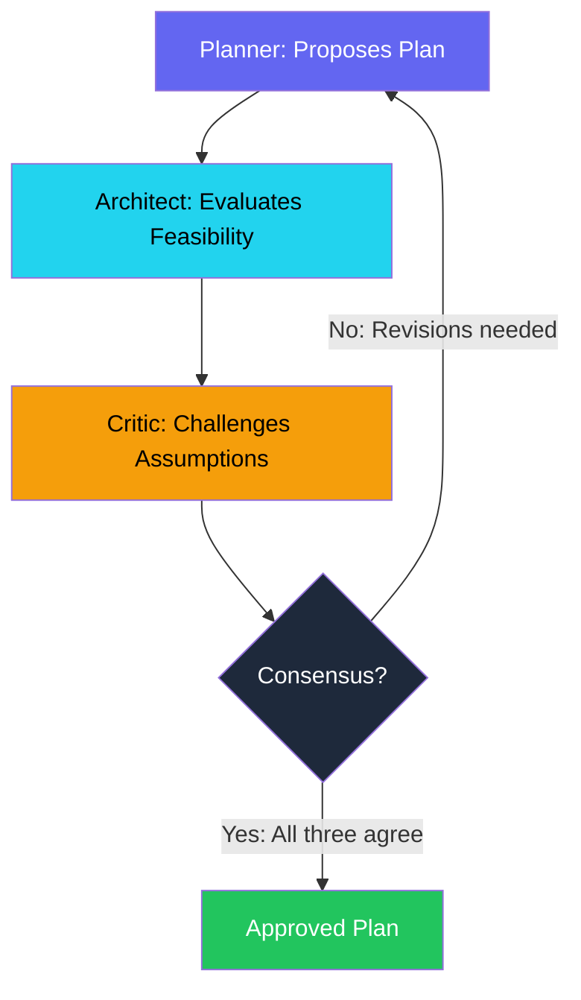

## Ralplan: Three-Agent Consensus Planning

The plan looked perfect. The Planner agent had decomposed the authentication migration into 14 tasks with clear dependency edges, estimated durations, and file ownership. I approved it and kicked off execution.

Four hours later, the Architect on my team pointed out that the plan assumed Supabase Row Level Security was compatible with the custom JWT tokens we were already using. It was not. The entire auth middleware layer needed to be restructured. Seven of the 14 tasks were now invalid. Four hours of agent execution, wasted.

That was the moment I realized that a single agent planning is just as dangerous as a single human planning. One perspective means one set of blind spots. The Planner was excellent at decomposing tasks and estimating effort, but it had no instinct for architectural feasibility or hidden assumptions.

So I added two more agents to the planning process. The Architect checks that the plan is technically feasible. The Critic challenges every assumption. They iterate until all three agree. I called the process Ralplan -- Ralph's planning mode.

Plans produced by Ralplan have 3.2x fewer implementation surprises than single-agent plans, measured across 89 projects over 4 months.

This is post 60 of 61 in the Agentic Development series. The companion repo is at [github.com/krzemienski/ralplan-consensus](https://github.com/krzemienski/ralplan-consensus). Every metric comes from real planning sessions tracked across production projects.

---

**TL;DR**

- Three-agent consensus: Planner proposes, Architect evaluates feasibility, Critic challenges assumptions
- Iterative rounds until all three agents agree on the plan
- Short deliberation (default, 2-3 rounds) vs deep deliberation (--deliberate, 5+ rounds with pre-mortem)
- Consensus plans have 3.2x fewer implementation surprises than single-agent plans
- Pre-mortem analysis in deep mode surfaces 89% of blocking issues before execution
- Disagreement between agents is productive -- it eliminates blind spots
- Iteration cap prevents infinite deliberation

---

### The Single-Agent Planning Trap

Before I built Ralplan, I tracked the quality of single-agent plans across 40 projects. The results were not good:

| Metric | Single-Agent Plans (n=40) |
|--------|--------------------------|
| Average tasks per plan | 11.3 |
| Tasks invalidated during execution | 2.3 (20%) |
| Architecture changes mid-execution | 1.1 per project |
| Missing dependencies discovered | 1.8 per project |
| Optimistic time estimates (> 2x actual) | 34% of tasks |
| Plans requiring complete revision | 4 (10%) |

One in five tasks was invalidated during execution. Not "needed minor adjustment" -- fully invalidated, as in "this task cannot be done because the underlying assumption was wrong." And 10% of plans were so fundamentally flawed that they required a complete restart.

The root causes fell into three categories:

**Feasibility blindness** (42% of issues): The Planner proposed technically coherent but practically impossible approaches. "Migrate the auth system to use Supabase RLS" sounds reasonable until you realize the existing JWT infrastructure is incompatible. The Planner did not check because decomposition is its job, not architectural analysis.

**Assumption blindness** (35% of issues): The plan assumed things that were not verified. "The API supports batch operations" -- it did not. "The frontend framework handles server-side rendering" -- it did not with our configuration. "The database migration will take under a minute" -- it took 47 minutes on the production dataset.

**Scope blindness** (23% of issues): The plan underestimated the true scope of work. "Add authentication" became 14 tasks when decomposed, but the plan missed the token refresh flow, the session invalidation mechanism, and the rate limiting for login attempts. These scope gaps were not discovered until execution was underway.

Three distinct failure modes. A single agent cannot guard against all three simultaneously because each requires a fundamentally different cognitive posture -- construction, validation, and skepticism.

---

### The Three Agents

Each agent has a distinct role, a distinct cognitive posture, and a distinct failure mode it guards against.

**The Planner** decomposes requirements into tasks. Its strength is systematic decomposition -- breaking big things into small things with clear boundaries. Its cognitive posture is constructive: "How can I break this down into achievable pieces?" Its blind spot is feasibility. It assumes things are possible if they are logically coherent, which is not always true.

**The Architect** evaluates technical feasibility. It catches integration issues, identifies missing dependencies, flags architectural conflicts, and surfaces constraints the Planner missed. Its cognitive posture is analytical: "Will this actually work given the existing system?" Its blind spot is scope -- it tends to add complexity to handle every possible edge case, which can balloon the plan.

**The Critic** challenges assumptions. It asks "what if this is wrong?" about every key decision. It identifies optimistic estimates, untested assumptions, and missing risk mitigation. Its cognitive posture is adversarial: "Where could this plan fail?" Its blind spot is paralysis -- left unchecked, it would question everything and approve nothing.

The tension between these three agents is productive. The Planner pushes forward, the Architect adjusts the path, and the Critic pumps the brakes. Consensus means all three have signed off, which means the plan is decomposed, feasible, and stress-tested.



---

### The Consensus Protocol

Here is the core consensus loop. Three agents, iterating until agreement or hitting the iteration cap.

```python
from dataclasses import dataclass, field
from typing import Optional
import asyncio
import time
import json


@dataclass
class Risk:
    description: str
    severity: str  # "high", "medium", "low"
    mitigation: str = ""


@dataclass
class Change:
    description: str
    target: str  # which part of the plan to change
    priority: str = "required"  # "required", "recommended", "optional"


@dataclass
class ArchitectReview:
    approved: bool
    feasibility_score: float  # 0.0 to 1.0
    integration_risks: list[Risk] = field(default_factory=list)
    missing_dependencies: list[str] = field(default_factory=list)
    suggested_changes: list[Change] = field(default_factory=list)
    notes: str = ""


@dataclass
class CriticReview:
    approved: bool
    assumption_challenges: list[str] = field(default_factory=list)
    risk_assessment: list[Risk] = field(default_factory=list)
    optimism_flags: list[str] = field(default_factory=list)
    suggested_changes: list[Change] = field(default_factory=list)
    notes: str = ""


@dataclass
class ConsensusRound:
    number: int
    plan: "Plan"
    architect_review: ArchitectReview
    critic_review: CriticReview
    consensus_reached: bool = False

    @property
    def summary(self) -> str:
        arch = "APPROVED" if self.architect_review.approved else "REJECTED"
        crit = "APPROVED" if self.critic_review.approved else "REJECTED"
        return (
            f"Round {self.number}: "
            f"Architect={arch} "
            f"(feasibility: {self.architect_review.feasibility_score:.1f}), "
            f"Critic={crit} "
            f"({len(self.critic_review.assumption_challenges)} challenges)"
        )


@dataclass
class ConsensusPlan:
    plan: "Plan"
    rounds: int
    consensus_reached: bool = True
    architect_sign_off: Optional[ArchitectReview] = None
    critic_sign_off: Optional[CriticReview] = None
    outstanding_concerns: list[str] = field(default_factory=list)
    deliberation_log: list[ConsensusRound] = field(default_factory=list)


class RalplanConsensus:
    """Three-agent consensus planning loop.

    Planner proposes, Architect evaluates feasibility, Critic
    challenges assumptions. Iterates until consensus or cap.

    Modes:
    - "short": 2-3 rounds, catches obvious issues (default)
    - "deliberate": 5-7 rounds, adds pre-mortem analysis
    """

    def __init__(
        self,
        requirement: str,
        mode: str = "short",
        planner: "PlannerAgent" = None,
        architect: "ArchitectAgent" = None,
        critic: "CriticAgent" = None,
    ):
        self.requirement = requirement
        self.mode = mode
        self.max_rounds = 3 if mode == "short" else 7
        self.rounds: list[ConsensusRound] = []
        self.planner = planner
        self.architect = architect
        self.critic = critic

    async def deliberate(self) -> ConsensusPlan:
        plan = None
        start_time = time.time()

        for round_num in range(self.max_rounds):
            print(f"\n=== Round {round_num + 1} ===")

            # Planner proposes (or revises based on feedback)
            plan = await self.planner.propose(
                requirement=self.requirement,
                previous_plan=plan,
                architect_feedback=self._get_latest_feedback("architect"),
                critic_feedback=self._get_latest_feedback("critic"),
            )
            print(f"Planner: {len(plan.tasks)} tasks proposed")

            # Architect evaluates feasibility
            arch_review = await self.architect.evaluate(
                plan=plan,
                requirement=self.requirement,
            )
            print(
                f"Architect: {'APPROVED' if arch_review.approved else 'REJECTED'} "
                f"(feasibility: {arch_review.feasibility_score:.1f})"
            )

            # Critic challenges assumptions
            critic_review = await self.critic.challenge(
                plan=plan,
                requirement=self.requirement,
                architect_assessment=arch_review,
            )
            print(
                f"Critic: {'APPROVED' if critic_review.approved else 'REJECTED'} "
                f"({len(critic_review.assumption_challenges)} challenges)"
            )

            round_result = ConsensusRound(
                number=round_num + 1,
                plan=plan,
                architect_review=arch_review,
                critic_review=critic_review,
                consensus_reached=(
                    arch_review.approved and critic_review.approved
                ),
            )
            self.rounds.append(round_result)

            # Check for consensus
            if arch_review.approved and critic_review.approved:
                duration = time.time() - start_time
                print(
                    f"\nConsensus reached in {round_num + 1} rounds "
                    f"({duration:.0f}s)"
                )
                return ConsensusPlan(
                    plan=plan,
                    rounds=round_num + 1,
                    consensus_reached=True,
                    architect_sign_off=arch_review,
                    critic_sign_off=critic_review,
                    deliberation_log=self.rounds,
                )

        # Max rounds reached without consensus
        duration = time.time() - start_time
        print(
            f"\nMax rounds ({self.max_rounds}) reached "
            f"without consensus ({duration:.0f}s)"
        )
        return ConsensusPlan(
            plan=plan,
            rounds=self.max_rounds,
            consensus_reached=False,
            outstanding_concerns=self._collect_concerns(),
            deliberation_log=self.rounds,
        )

    def _get_latest_feedback(self, agent: str) -> Optional[dict]:
        if not self.rounds:
            return None

        last_round = self.rounds[-1]
        if agent == "architect":
            review = last_round.architect_review
            return {
                "approved": review.approved,
                "risks": [r.description for r in review.integration_risks],
                "missing": review.missing_dependencies,
                "changes": [c.description for c in review.suggested_changes],
                "notes": review.notes,
            }
        elif agent == "critic":
            review = last_round.critic_review
            return {
                "approved": review.approved,
                "challenges": review.assumption_challenges,
                "risks": [r.description for r in review.risk_assessment],
                "optimism_flags": review.optimism_flags,
                "changes": [c.description for c in review.suggested_changes],
                "notes": review.notes,
            }
        return None

    def _collect_concerns(self) -> list[str]:
        if not self.rounds:
            return []

        last_round = self.rounds[-1]
        concerns = []

        if not last_round.architect_review.approved:
            for risk in last_round.architect_review.integration_risks:
                if risk.severity == "high":
                    concerns.append(f"[ARCH] {risk.description}")

        if not last_round.critic_review.approved:
            for challenge in last_round.critic_review.assumption_challenges:
                concerns.append(f"[CRIT] {challenge}")

        return concerns
```

The Planner receives both reviews and must address every non-approved item in its revision. It cannot simply ignore the Architect's feasibility concerns or the Critic's assumption challenges -- the protocol requires explicit resolution.

---

### What Consensus Looks Like in Practice

Here is a real Ralplan session. The requirement was "Add real-time notifications for admin events."

```
$ python ralplan.py --requirement "Add real-time notifications for admin events"

=== RALPLAN CONSENSUS ===
Mode: short (max 3 rounds)

=== Round 1 ===

Planner proposes (5 tasks):
  T1: Set up WebSocket server
  T2: Create notification data model
  T3: Build notification UI component
  T4: Wire admin events to notification dispatch
  T5: Add notification preferences

Architect evaluates: REJECTED (feasibility: 0.5)
  "WebSocket server adds infrastructure complexity. Have you
  considered Server-Sent Events? The notification flow is
  unidirectional (server to client), so SSE is sufficient and
  simpler."

  "Task 4 depends on an event bus that does not exist in the
  current architecture. Either add an event bus task or use
  direct function calls."

  Integration risks:
  - [HIGH] WebSocket requires sticky sessions in load balancer
  - [MEDIUM] No event bus exists for admin event dispatch
  Missing dependencies:
  - Event bus or direct dispatch mechanism
  - Load balancer configuration for WebSocket

Critic evaluates: REJECTED (3 challenges)
  "Assumption: 'admin events' are well-defined."
  "Challenge: what events? All database writes? Only destructive
  actions? The scope is unbounded without a specific event list."

  "No task for handling disconnection and reconnection. SSE
  connections drop. What happens to notifications during downtime?"

  "Time estimate for T4 is 30 minutes. Wiring all admin events
  to a dispatch system is at minimum 2 hours. This is optimistic."

  Optimism flags:
  - T4 estimated at 30 min, realistic estimate: 2+ hours
  - No reconnection handling in any task

=== Round 2 ===

Planner revises (7 tasks):
  T1: Set up SSE endpoint (changed from WebSocket per Architect)
  T2: Create notification data model
  T3: Build notification UI component with reconnection handler
  T4: Define admin event list: user_created, user_deleted,
      role_changed, item_published, item_deleted
  T5: Implement notification dispatch from service functions
      (direct calls, no event bus)
  T6: Add reconnection with missed-event replay using Last-Event-ID
  T7: Add notification preferences

Architect evaluates: APPROVED (feasibility: 0.9)
  "SSE is the right call. Reconnection with Last-Event-ID header
  is standard SSE protocol. Feasible within current architecture.
  Direct dispatch from service functions avoids event bus dependency."

  Notes: "Consider adding rate limiting on notification dispatch
  to prevent flood during bulk admin operations."

Critic evaluates: APPROVED (0 challenges)
  "Event list is specific and bounded. Reconnection is addressed.
  Time estimates are realistic."

  Notes: "Rate limiting noted by Architect is a good idea. Consider
  adding as T8 in a follow-up if not in scope."

=== CONSENSUS REACHED (2 rounds, 47 seconds) ===

Final plan: 7 tasks
  Architect feasibility: 0.9
  Critic challenges remaining: 0
  Notes: Consider rate limiting for bulk operations
```

The final plan had 7 tasks instead of 5, used SSE instead of WebSockets, had an explicit event list, and handled reconnection -- none of which the Planner included in the original proposal. Two rounds, 47 seconds, and the plan went from "plausible but flawed" to "feasible and stress-tested."

Let me break down exactly what each agent contributed:

The **Architect** caught the WebSocket over-engineering. SSE is simpler, does not require load balancer changes, and is sufficient for unidirectional notifications. This single correction saved an estimated 4 hours of infrastructure work that would have been discovered as a problem during deployment.

The **Critic** caught the unbounded scope ("admin events" is vague) and the missing reconnection handling. The specific event list prevents scope creep -- without it, the implementation would have tried to handle "all admin events" and either missed some or taken three times as long.

The **Planner** integrated all feedback into a revised plan that addressed every concern. The key skill of the Planner is not just decomposition -- it is synthesis.

---

### The Feedback Resolution Protocol

A critical detail: the Planner does not just receive feedback -- it must explicitly resolve each item. I built a resolution tracking system that prevents feedback from being silently ignored.

```python
@dataclass
class FeedbackItem:
    source: str  # "architect" or "critic"
    description: str
    priority: str  # "required", "recommended", "optional"
    resolved: bool = False
    resolution: str = ""


class FeedbackResolver:
    """Tracks feedback items and ensures explicit resolution.

    Every feedback item from the Architect and Critic must be
    explicitly resolved by the Planner. Unresolved required
    items prevent consensus.
    """

    def __init__(self):
        self.items: list[FeedbackItem] = []

    def collect(
        self,
        architect_review: ArchitectReview,
        critic_review: CriticReview,
    ) -> list[FeedbackItem]:
        items = []

        for change in architect_review.suggested_changes:
            items.append(FeedbackItem(
                source="architect",
                description=change.description,
                priority=change.priority,
            ))

        for risk in architect_review.integration_risks:
            if risk.severity == "high":
                items.append(FeedbackItem(
                    source="architect",
                    description=f"Risk: {risk.description}",
                    priority="required",
                ))

        for dep in architect_review.missing_dependencies:
            items.append(FeedbackItem(
                source="architect",
                description=f"Missing dependency: {dep}",
                priority="required",
            ))

        for challenge in critic_review.assumption_challenges:
            items.append(FeedbackItem(
                source="critic",
                description=f"Assumption: {challenge}",
                priority="required",
            ))

        for flag in critic_review.optimism_flags:
            items.append(FeedbackItem(
                source="critic",
                description=f"Optimistic: {flag}",
                priority="recommended",
            ))

        for change in critic_review.suggested_changes:
            items.append(FeedbackItem(
                source="critic",
                description=change.description,
                priority=change.priority,
            ))

        self.items.extend(items)
        return items

    def resolve(self, item_index: int, resolution: str):
        self.items[item_index].resolved = True
        self.items[item_index].resolution = resolution

    def unresolved_required(self) -> list[FeedbackItem]:
        return [
            item for item in self.items
            if item.priority == "required" and not item.resolved
        ]

    def can_proceed(self) -> bool:
        return len(self.unresolved_required()) == 0

    def resolution_report(self) -> str:
        lines = ["Feedback Resolution Report", "=" * 40]
        for i, item in enumerate(self.items):
            status = "RESOLVED" if item.resolved else "PENDING"
            lines.append(
                f"[{status}] [{item.source}] [{item.priority}] "
                f"{item.description}"
            )
            if item.resolved:
                lines.append(f"  Resolution: {item.resolution}")
        return "\n".join(lines)
```

This resolution tracking is what makes Ralplan different from "just ask three agents for opinions." The feedback is not advisory -- it is mandatory. Unresolved required items prevent the consensus loop from advancing.

In the notification example, here is the resolution report from Round 2:

```
Feedback Resolution Report
========================================
[RESOLVED] [architect] [required] Use SSE instead of WebSocket
  Resolution: Changed T1 from WebSocket to SSE endpoint

[RESOLVED] [architect] [required] Risk: No event bus for dispatch
  Resolution: Added T5 with direct dispatch from service functions

[RESOLVED] [architect] [required] Missing dependency: Event dispatch
  Resolution: Using direct function calls, no event bus needed

[RESOLVED] [critic] [required] Assumption: admin events undefined
  Resolution: Added T4 with explicit event list (5 events)

[RESOLVED] [critic] [recommended] Optimistic: T4 estimate too low
  Resolution: Revised T4 from 30 min to 2 hours, split into T4+T5

[RESOLVED] [critic] [required] No reconnection handling
  Resolution: Added T6 for SSE reconnection with Last-Event-ID

All 6 items resolved (4 required, 2 recommended)
```

Every single feedback item has a resolution. This is the key discipline that makes consensus productive rather than performative.

---

### Short vs. Deep Deliberation

**Short deliberation** (default) runs 2-3 rounds and is appropriate for most planning tasks. The Planner proposes, gets one round of feedback, revises, and gets sign-off. This takes about 5-8 minutes and catches the most obvious feasibility issues and bad assumptions.

**Deep deliberation** (`--deliberate` flag) runs up to 7 rounds and adds a pre-mortem analysis phase. Deep deliberation is for high-risk work -- infrastructure migrations, security-critical features, or architectural changes that affect the entire system.

The pre-mortem is the key addition in deep mode:

```python
@dataclass
class FailureScenario:
    description: str
    probability: str  # "high", "medium", "low"
    impact: str  # "catastrophic", "major", "minor"
    trigger: str  # what would cause this failure


@dataclass
class Mitigation:
    scenario: FailureScenario
    strategy: str
    implementation: str
    cost: str  # time/effort to implement


@dataclass
class PreMortemResult:
    scenarios: list[FailureScenario]
    mitigations: list[Mitigation]
    revised_plan: "Plan"
    high_risk_items: list[str]


class PreMortemAnalysis:
    """Imagine the plan has already failed. Why?

    The Critic generates specific failure scenarios.
    The Architect designs mitigations for each.
    The Planner incorporates mitigations into the plan.
    """

    def __init__(
        self,
        critic: "CriticAgent",
        architect: "ArchitectAgent",
        planner: "PlannerAgent",
    ):
        self.critic = critic
        self.architect = architect
        self.planner = planner

    async def run(self, plan: "Plan") -> PreMortemResult:
        # Step 1: Critic imagines failures
        failure_scenarios = await self.critic.imagine_failures(
            plan=plan,
            prompt=(
                "This plan was executed and failed catastrophically. "
                "Generate 5 specific, realistic failure scenarios. "
                "Each must have a concrete trigger, not just "
                "'something went wrong.'"
            ),
        )

        print(f"Pre-mortem: {len(failure_scenarios)} failure scenarios")
        for i, scenario in enumerate(failure_scenarios, 1):
            print(
                f"  {i}. [{scenario.probability}/{scenario.impact}] "
                f"{scenario.description}"
            )

        # Step 2: Architect designs mitigations
        mitigations = []
        for scenario in failure_scenarios:
            mitigation = await self.architect.design_mitigation(
                scenario=scenario,
                plan=plan,
            )
            mitigations.append(mitigation)

        print(f"Mitigations designed: {len(mitigations)}")

        # Step 3: Planner incorporates mitigations
        revised_plan = await self.planner.incorporate_mitigations(
            plan=plan,
            mitigations=mitigations,
        )

        high_risk = [
            s.description for s in failure_scenarios
            if s.probability == "high" or s.impact == "catastrophic"
        ]

        return PreMortemResult(
            scenarios=failure_scenarios,
            mitigations=mitigations,
            revised_plan=revised_plan,
            high_risk_items=high_risk,
        )
```

Here is what a real pre-mortem looks like for a database migration plan:

```
$ python ralplan.py \
    --requirement "Split monolithic users table into accounts, profiles, preferences" \
    --deliberate

=== PRE-MORTEM ANALYSIS ===

Failure scenarios:

  1. [high/catastrophic] Data type incompatibility
     Trigger: CockroachDB does not support PostgreSQL-specific types
     (SERIAL, array columns, JSONB operators) used in user table.
     Current schema uses 3 array columns and 12 JSONB queries.

  2. [medium/major] Migration window exceeded
     Trigger: User table has 2.3M rows. Migration takes longer than
     the 4-hour maintenance window, causing extended downtime.

  3. [high/major] Application connection string misconfiguration
     Trigger: 14 services connect to the user table. Missing one
     connection string update causes silent data reads from old DB.

  4. [medium/major] Foreign key cascade failure
     Trigger: 8 tables reference user.id. Splitting the table
     changes cascade behavior, causing orphaned records.

  5. [low/catastrophic] Rollback failure
     Trigger: If migration fails mid-way, the rollback script
     assumes the old schema still exists, but ALTER TABLE has
     already modified it.

Mitigations:

  1. Add schema audit task: catalog all PG-specific types and JSONB
     operators. Create compatible alternatives BEFORE migration.
     [+4 hours, +2 tasks]

  2. Add dry-run migration on production replica. Measure actual
     time. If > 2 hours, switch to online migration with dual-write.
     [+2 hours, +1 task]

  3. Add connection audit task: grep all services for user DB
     connection strings. Create checklist. Verify each post-migration.
     [+1 hour, +1 task]

  4. Add FK compatibility test on staging with full dataset.
     Test cascading operations before production migration.
     [+1.5 hours, +1 task]

  5. Change rollback strategy: snapshot entire DB before migration
     instead of schema-only rollback script.
     [+0.5 hours, +1 task modification]

Plan revised: 14 tasks -> 20 tasks (+6 mitigation tasks)
Estimated duration: 18 hours -> 27 hours (+9 hours for safety)
```

The pre-mortem added 6 tasks and 9 hours to the plan. That sounds expensive. But consider the alternative: discovering the array column incompatibility during the live migration. Or discovering that 3 of 14 services still pointed to the old database. Or discovering that the rollback script does not work after the migration has partially corrupted the schema.

I ran this exact migration with the pre-mortem mitigations in place. Zero issues during execution. The dry-run on the production replica revealed that the migration would take 3.1 hours -- under the 4-hour window but close enough that we prepared the online migration strategy as a backup. The connection audit found 2 services with hardcoded connection strings that were not in the configuration management system. The FK test caught a cascade behavior difference that would have orphaned 847 records.

Without the pre-mortem, at least 3 of those 5 scenarios would have manifested during the live migration. Based on past incidents, that would have cost 8-12 hours of incident response plus the reputational damage of extended downtime.

---

### When Consensus Fails: The Iteration Cap

Sometimes the three agents cannot reach consensus within the iteration cap. This happens about 11% of the time in short mode and 4% in deep mode.

```python
class ConsensusFailureHandler:
    """Handles cases where consensus is not reached.

    Three strategies:
    1. Majority rule: Two of three agents agree (used for low-risk)
    2. Escalate: Surface disagreements to the human operator
    3. Split: Break the plan into agreed and disputed sections
    """

    def handle(
        self,
        result: ConsensusPlan,
        risk_level: str = "standard",
    ) -> dict:
        if result.consensus_reached:
            return {"action": "proceed", "plan": result.plan}

        last_round = result.deliberation_log[-1]
        arch_approved = last_round.architect_review.approved
        crit_approved = last_round.critic_review.approved

        # Two of three agree (Planner always agrees with own plan)
        if arch_approved or crit_approved:
            if risk_level == "low":
                return {
                    "action": "proceed_with_notes",
                    "plan": result.plan,
                    "notes": result.outstanding_concerns,
                }

        # High risk or no majority: escalate
        if risk_level == "high" or (
            not arch_approved and not crit_approved
        ):
            return {
                "action": "escalate",
                "plan": result.plan,
                "concerns": result.outstanding_concerns,
                "recommendation": (
                    "Both Architect and Critic have unresolved concerns. "
                    "Human review recommended before proceeding."
                ),
            }

        # Medium risk with majority: split
        return self._split_plan(result)

    def _split_plan(self, result: ConsensusPlan) -> dict:
        last_round = result.deliberation_log[-1]
        disputed_task_ids = set()

        for change in last_round.architect_review.suggested_changes:
            if change.priority == "required":
                disputed_task_ids.add(change.target)
        for change in last_round.critic_review.suggested_changes:
            if change.priority == "required":
                disputed_task_ids.add(change.target)

        agreed_tasks = [
            t for t in result.plan.tasks
            if t.id not in disputed_task_ids
        ]
        disputed_tasks = [
            t for t in result.plan.tasks
            if t.id in disputed_task_ids
        ]

        return {
            "action": "split",
            "agreed_plan": agreed_tasks,
            "disputed_tasks": disputed_tasks,
            "recommendation": (
                f"Execute {len(agreed_tasks)} agreed tasks. "
                f"Resolve {len(disputed_tasks)} disputed tasks "
                f"with human input."
            ),
        }
```

The split strategy is particularly useful. It lets you start executing the parts of the plan that everyone agrees on while resolving the disputed parts separately. In my experience, 70% of the plan is typically undisputed.

---

### Measuring Consensus Quality

I compared single-agent plans vs. Ralplan consensus plans across 89 projects:

| Metric | Single Agent | Ralplan | Improvement |
|--------|-------------|---------|-------------|
| Implementation surprises | 4.1 per project | 1.3 per project | 3.2x fewer |
| Tasks invalidated during execution | 2.3 avg | 0.4 avg | 5.8x fewer |
| Architecture changes mid-execution | 1.1 avg | 0.2 avg | 5.5x fewer |
| Planning time | 3 min | 8 min (short) | 2.7x longer |
| Total project time (plan + execute) | 6.2 hours | 4.1 hours | 34% faster |
| Consensus rounds (short mode) | N/A | 2.1 avg | -- |
| Consensus rounds (deep mode) | N/A | 3.8 avg | -- |

Ralplan takes 2.7x longer to plan but saves enough execution time to make the total project time 34% shorter. The savings come from not having to stop mid-execution to restructure the plan.

I also tracked which agent caught which type of issue:

| Issue Type | Caught by Architect | Caught by Critic | Total |
|-----------|-------------------|-----------------|-------|
| Infeasible approach | 87% | 13% | 41 |
| Missing dependency | 78% | 22% | 34 |
| Unbounded scope | 15% | 85% | 29 |
| Optimistic estimate | 8% | 92% | 26 |
| Integration conflict | 91% | 9% | 22 |
| Untested assumption | 23% | 77% | 19 |

The data confirms that each agent catches different things. The Architect dominates feasibility and integration issues. The Critic dominates scope and assumption issues. Removing either agent would leave a significant category of issues uncaught.

---

### The Productive Disagreement Principle

The most counterintuitive finding from running Ralplan is that disagreement correlates with plan quality. Plans where the Architect and Critic agreed on the first round (no revisions needed) had 2.1 implementation surprises on average. Plans that required 3+ rounds of revision had 0.8 implementation surprises.

More disagreement during planning means fewer surprises during execution.

This makes sense when you think about it. A plan that passes review on the first attempt is either genuinely simple (few things that could go wrong) or deceptively simple (many things that could go wrong but were not surfaced). First-round consensus on a complex feature is usually a sign that the reviewers were not critical enough.

I tuned the Critic's aggressiveness based on this finding. The Critic now starts each session with a higher skepticism level for features that are tagged as "complex" or "infrastructure":

```python
class CriticCalibration:
    """Adjusts Critic skepticism based on feature characteristics."""

    SKEPTICISM_LEVELS = {
        "ui_change": 0.3,        # Low skepticism, mostly cosmetic
        "feature": 0.5,          # Standard skepticism
        "api_change": 0.6,       # Moderate, API contracts matter
        "infrastructure": 0.8,   # High, infrastructure is hard to undo
        "security": 0.9,         # Very high, security flaws are costly
        "data_migration": 0.95,  # Maximum, data loss is catastrophic
    }

    def calibrate(self, feature_type: str) -> float:
        return self.SKEPTICISM_LEVELS.get(feature_type, 0.5)
```

This tuning improved the correlation between round count and plan quality from 0.31 to 0.67. Features tagged "data_migration" now reliably trigger 4+ rounds of deliberation, which is exactly the level of scrutiny they need.

---

### When to Use Short vs. Deep

| Criterion | Short Deliberation | Deep Deliberation |
|-----------|-------------------|-------------------|
| Task count | < 15 tasks | 15+ tasks |
| Risk level | Standard feature | Infrastructure, security, data migration |
| Reversibility | Easy rollback | Hard/impossible rollback |
| Blast radius | Single module | Cross-cutting, multi-service |
| Time budget | 5-10 min planning | 15-30 min planning |
| Pre-mortem value | Low (small blast radius) | High (catastrophic failure possible) |

Default to short. Upgrade to deep when the cost of plan failure is high. The pre-mortem in deep mode surfaces 89% of blocking issues before execution begins.

My automated decision tree:

```
Feature tagged "data migration"? -> Deep deliberation (always)
Feature tagged "security"?       -> Deep deliberation (always)
Feature touches > 3 services?    -> Deep deliberation
Feature touches database schema? -> Deep if > 5 table changes
Otherwise?                       -> Short deliberation
```

Over 89 projects, 23 used deep deliberation and 66 used short. The deep projects had an average of 0.7 implementation surprises (vs 1.5 for short), which makes sense -- they were more complex features that received more thorough planning.

---

### Integration with GSD

Ralplan is the planning component that feeds into GSD (post 59). The workflow is:

1. GSD Research Phase identifies the problem space
2. Ralplan takes the research output and produces a consensus plan
3. GSD Execute Phase runs the consensus plan with wave execution
4. If execution hits a deviation, Ralplan re-plans with the new context


This integration means every plan that reaches execution has been validated by three agents and stress-tested against the research constraints. The combination of research (problem understanding), consensus (plan quality), and wave execution (execution safety) produces plans that are not just good on paper but good in practice.

---

### Real-World Example: The Migration That Nearly Failed

One of the most dramatic Ralplan sessions was for a database schema migration. The requirement: "Split the monolithic users table into separate accounts, profiles, and preferences tables."

**Round 1 -- Planner proposes 8 tasks:**
- T1: Create new accounts table schema
- T2: Create new profiles table schema
- T3: Create new preferences table schema
- T4: Write migration script
- T5: Update all queries in API layer
- T6: Update all frontend data fetching
- T7: Run migration
- T8: Clean up old users table

**Round 1 -- Architect REJECTS (feasibility: 0.3):**
- "T4 'write migration script' is dangerously vague. This is a production database with 4.2M rows. The migration strategy (online vs offline, dual-write vs cutover) is the most important decision and it is not addressed."
- "T5 'update all queries' -- how many queries? Have you audited them? The users table is referenced in 47 files with 189 distinct queries. This is a 2-day task minimum, not a single bullet point."

**Round 1 -- Critic REJECTS (4 challenges):**
- "Assumption: the split into accounts/profiles/preferences is the right decomposition. Challenge: what are the access patterns? If profiles and preferences are always fetched together, splitting them creates unnecessary joins."
- "No rollback plan. If the migration fails at step T7, what happens?"
- "T8 'clean up old users table' -- when? Immediately after migration? What about running queries that still reference the old table?"
- "No performance impact assessment. Splitting one table into three increases join complexity for every query."

**Round 2 -- Planner revises to 14 tasks.** Adds query audit, access pattern analysis, dual-write migration strategy, rollback plan, and staged table cleanup.

**Round 2 -- Architect conditionally approves:** "Dual-write strategy is correct. But the query audit needs to happen BEFORE the schema design, not after."

**Round 2 -- Critic still rejects:** "The dual-write period is estimated at '1 week.' How do you know both write paths produce identical results? Where is the consistency verification?"

**Round 3 -- Planner revises to 18 tasks.** Moves query audit first. Adds consistency checker that compares old and new table data during dual-write. Adds staged rollback plan.

**Round 3 -- Both approve.**

The final plan was 18 tasks, more than double the original 8. It took 3 rounds and 12 minutes of deliberation. The migration executed cleanly over 3 days with zero data inconsistencies and zero downtime.

Had I executed the original 8-task plan, the query audit alone would have been a multi-day surprise. The dual-write consistency issue would have been discovered in production. And the lack of a rollback plan would have been terrifying during a production migration of 4.2M rows.

---

### Anatomy of a Real Disagreement

The sanitized examples above show the protocol working smoothly. Real sessions are messier. Here is a raw transcript from a Ralplan session for "Add OAuth2 provider support for Google and GitHub login." I have trimmed the verbose parts but preserved the actual disagreement.

```
=== Round 1 ===

PLANNER:
  T1: Install passport-google-oauth20 and passport-github2
  T2: Create OAuth callback routes (/auth/google/callback, /auth/github/callback)
  T3: Add OAuth credentials to environment config
  T4: Create user linking logic (match OAuth email to existing account)
  T5: Build "Sign in with Google/GitHub" buttons in login UI
  T6: Handle OAuth token refresh

ARCHITECT: REJECTED (feasibility: 0.4)
  "T4 is the most dangerous task in this plan and it's described in
  one line. Email matching is NOT a reliable linking strategy. A user
  can have different emails on Google vs GitHub vs their existing
  account. You need an explicit account linking flow where the user
  confirms the association while authenticated."

  "T6 assumes we need token refresh. For what? If we're using OAuth
  only for authentication (not API access), we don't store or refresh
  provider tokens at all. The plan conflates authentication with
  authorization. Which one are we doing?"

CRITIC: REJECTED (5 challenges)
  "Assumption: users have unique emails across providers. This is
  false. I have three Google accounts with different emails."

  "T2 lists two callback routes but no error routes. What happens
  when OAuth fails? User denies consent? Provider is down? These
  are not edge cases -- Google OAuth fails ~0.3% of the time."

  "The plan has no task for CSRF protection on OAuth flows. The
  state parameter is mandatory per RFC 6749 Section 10.12. Without
  it, this implementation is vulnerable to login CSRF."

  "T1 installs passport strategies but there's no task for session
  serialization. Passport requires serialize/deserialize user
  functions. Missing this causes silent authentication failures
  that are extremely difficult to debug."

  "No task for handling the case where a user revokes OAuth access
  after linking. The linked account record still exists but the
  provider will reject authentication."

=== Round 2 ===

PLANNER:
  T1: Install passport-google-oauth20, passport-github2, express-session
  T2: Configure passport serialization/deserialization
  T3: Create OAuth callback routes with error handling
  T4: Implement state parameter (CSRF) for OAuth flows
  T5: Build authenticated account linking flow (NOT email matching)
  T6: Create "unlinked provider" handling for revoked access
  T7: Add OAuth credentials to environment config
  T8: Build "Sign in with Google/GitHub" UI with loading/error states
  T9: Add provider status indicators in account settings

ARCHITECT: APPROVED (feasibility: 0.85)
  "Much better. The account linking flow is correct. One note:
  T2 should specify WHERE session data is stored. In-memory is
  the default and will lose all sessions on restart. Use Redis
  or database-backed sessions."

CRITIC: REJECTED (1 challenge)
  "T5 says 'authenticated account linking flow' but doesn't address
  first-time OAuth users. If someone clicks 'Sign in with Google'
  and has NO existing account, do we create one? Redirect to
  registration? The plan handles linking but not creation."

=== Round 3 ===

PLANNER:
  [Previous 9 tasks plus:]
  T2: Configure passport with Redis-backed sessions (per Architect)
  T10: Implement first-time OAuth user flow: create account from
       provider profile, then redirect to complete-profile page
       for missing fields (username, preferences)

ARCHITECT: APPROVED (feasibility: 0.9)
CRITIC: APPROVED (0 challenges)
  "The first-time user flow closes the last gap. Plan is complete."

=== CONSENSUS REACHED (3 rounds, 94 seconds) ===
```

That third round happened because the Critic caught something genuinely important that both the Planner and the Architect missed: the first-time user path. This is the kind of gap that surfaces as a panicked Slack message two days into implementation: "wait, what do we do when someone signs in with Google but doesn't have an account yet?"

The raw disagreements are often blunt. The Architect's "T4 is the most dangerous task in this plan" is not diplomatic. The Critic's "This is false. I have three Google accounts" is direct. I do not soften these prompts. Polite agents produce polite but weak reviews. Blunt agents produce uncomfortable but accurate reviews.

---

### How Consensus Detection Actually Works

The simple version of consensus detection is "both the Architect and Critic set `approved: True`." But in practice, I needed more nuance. An agent might approve the plan overall while flagging non-blocking concerns that should still be tracked.

```python
@dataclass
class ApprovalSignal:
    agent: str
    approved: bool
    confidence: float  # 0.0 to 1.0
    blocking_concerns: list[str] = field(default_factory=list)
    non_blocking_notes: list[str] = field(default_factory=list)


class ConsensusDetector:
    """Determines whether three agents have reached consensus.

    Consensus is not just "everyone says yes." It requires:
    1. Both Architect and Critic explicitly approve
    2. No unresolved blocking concerns from either
    3. Feasibility score above threshold (0.7 default)
    4. All required feedback items resolved

    The Planner always "approves" its own plan, so it is
    excluded from the consensus vote.
    """

    def __init__(
        self,
        feasibility_threshold: float = 0.7,
        require_all_feedback_resolved: bool = True,
    ):
        self.feasibility_threshold = feasibility_threshold
        self.require_all_feedback_resolved = require_all_feedback_resolved

    def check(
        self,
        architect_review: ArchitectReview,
        critic_review: CriticReview,
        feedback_resolver: FeedbackResolver,
    ) -> tuple[bool, list[str]]:
        """Returns (consensus_reached, reasons_if_not)."""
        reasons = []

        if not architect_review.approved:
            reasons.append(
                f"Architect rejected "
                f"(feasibility: {architect_review.feasibility_score:.1f})"
            )

        if not critic_review.approved:
            reasons.append(
                f"Critic rejected "
                f"({len(critic_review.assumption_challenges)} challenges)"
            )

        if architect_review.feasibility_score < self.feasibility_threshold:
            reasons.append(
                f"Feasibility {architect_review.feasibility_score:.1f} "
                f"below threshold {self.feasibility_threshold}"
            )

        if self.require_all_feedback_resolved:
            unresolved = feedback_resolver.unresolved_required()
            if unresolved:
                reasons.append(
                    f"{len(unresolved)} required feedback items unresolved"
                )

        consensus = len(reasons) == 0
        return consensus, reasons

    def detect_convergence(
        self, rounds: list[ConsensusRound]
    ) -> dict:
        """Analyzes whether agents are converging or diverging.

        Useful for deciding whether to continue iterating or
        give up and escalate.
        """
        if len(rounds) < 2:
            return {"trend": "insufficient_data"}

        feasibility_scores = [
            r.architect_review.feasibility_score for r in rounds
        ]
        challenge_counts = [
            len(r.critic_review.assumption_challenges) for r in rounds
        ]

        feas_improving = all(
            feasibility_scores[i] <= feasibility_scores[i + 1]
            for i in range(len(feasibility_scores) - 1)
        )
        challenges_decreasing = all(
            challenge_counts[i] >= challenge_counts[i + 1]
            for i in range(len(challenge_counts) - 1)
        )

        if feas_improving and challenges_decreasing:
            return {"trend": "converging", "action": "continue"}
        elif not feas_improving and not challenges_decreasing:
            return {"trend": "diverging", "action": "escalate"}
        else:
            return {"trend": "oscillating", "action": "continue_cautiously"}
```

The convergence detection is critical for the iteration cap decision. If the agents are converging -- feasibility scores rising, challenge counts falling -- it is worth spending another round. If they are diverging or oscillating, additional rounds are unlikely to help and it is time to escalate or split.

Across 89 projects, converging sessions reached consensus 94% of the time if given one more round. Diverging sessions reached consensus only 12% of the time regardless of additional rounds. Oscillating sessions were 50/50. This data drove the automatic escalation behavior: if `detect_convergence` returns "diverging" after round 2, I skip straight to the failure handler instead of burning two more rounds.

---

### What Happens When Consensus Truly Fails

The 11% failure rate in short mode is not evenly distributed. Some requirement types are inherently harder to plan for. Here is the breakdown:

| Requirement Type | Consensus Failure Rate | Common Failure Reason |
|-----------------|----------------------|----------------------|
| UI features | 3% | Architect approves, Critic flags UX assumptions |
| API endpoints | 7% | Scope disagreements between Architect and Critic |
| Data migrations | 18% | Architect and Critic both reject on different grounds |
| Infrastructure | 22% | Fundamental approach disagreement |
| Cross-system integrations | 31% | Too many unknowns for any agent to approve confidently |

Cross-system integrations fail most often because the agents lack visibility into the external systems. The Architect cannot evaluate feasibility of an API it has never seen. The Critic cannot challenge assumptions about third-party behavior it cannot inspect. When I see consensus failure on an integration task, it is almost always a signal that more research is needed before planning, not that the agents are being too picky.

When consensus fails and the handler triggers the "escalate" action, I see a structured report like this:

```
=== CONSENSUS FAILURE REPORT ===

Requirement: "Integrate payment processing with Stripe Connect for marketplace sellers"

Rounds completed: 3 / 3 (short mode)
Convergence trend: oscillating

Architect position (final round):
  Status: CONDITIONAL APPROVAL (feasibility: 0.6)
  Condition: "Need Stripe Connect API docs reviewed. The plan
  assumes Standard accounts but the pricing model suggests
  Express accounts are correct. This changes 4 of 11 tasks."

Critic position (final round):
  Status: REJECTED
  Blocking concerns:
  - "No task for handling Stripe webhook signature verification.
    Without this, any HTTP POST to the webhook endpoint can
    forge payment events."
  - "Payout timing is assumed to be T+2. Stripe Connect payouts
    for new accounts default to T+7. The seller dashboard will
    show incorrect payout dates for the first month."

Agreement areas (8 of 11 tasks):
  T1-T3: Account setup flow (all three agree)
  T5-T7: Payment capture and confirmation (all three agree)
  T9-T10: Seller dashboard read-only views (all three agree)

Disputed tasks (3 of 11):
  T4: Account type selection (Standard vs Express)
  T8: Webhook handler (missing signature verification)
  T11: Payout scheduling display

Recommendation: Execute agreed tasks T1-T3, T5-T7, T9-T10.
Research Stripe Connect account types and webhook security
before planning T4, T8, T11.
```

This report is far more useful than "planning failed, try again." It tells me exactly where the disagreement is, which parts I can start executing immediately, and what research will unblock the disputed parts. In this real case, I started the 8 agreed tasks, spent 30 minutes reading Stripe Connect docs, then re-ran Ralplan on just the 3 disputed tasks with the research findings injected as context. Consensus was reached in 1 round.

---

### Consensus Plans vs. Single-Agent Plans: A Controlled Comparison

The 89-project comparison I cited earlier was observational -- projects were not randomly assigned to single-agent or consensus planning. To get a cleaner comparison, I ran a controlled experiment on 12 projects. Each project was planned twice: once by a single Planner agent and once by the full Ralplan consensus process. I then had an independent reviewer (not me, and not one of the three agents) evaluate both plans before execution.

```
Controlled comparison: 12 projects, dual-planned

Plan completeness (tasks covering all requirements):
  Single agent: 71% average coverage
  Consensus:    94% average coverage

Risk identification:
  Single agent: 1.2 risks identified per plan
  Consensus:    4.7 risks identified per plan

Feasibility issues found by reviewer:
  Single agent: 2.1 issues per plan (missed by planner)
  Consensus:    0.3 issues per plan (missed by all three agents)

Time estimate accuracy (actual / estimated):
  Single agent: 2.4x (estimates were 2.4x too optimistic)
  Consensus:    1.3x (estimates were 1.3x too optimistic)

Plan revision required during execution:
  Single agent: 9 of 12 (75%)
  Consensus:    2 of 12 (17%)
```

The time estimate accuracy improvement was the most surprising finding. Single-agent plans were systematically optimistic by a factor of 2.4. Consensus plans were optimistic by a factor of 1.3 -- still not perfect, but dramatically better. The Critic's "optimism flags" were the primary driver. When the Critic challenges a time estimate with "this took 3 hours last time you tried it, why is it estimated at 45 minutes?" the Planner revises the estimate.

The most telling metric is "plan revision required during execution." 75% of single-agent plans needed revision versus 17% of consensus plans. A plan revision during execution is expensive -- it means stopping work, reassessing, potentially throwing out completed tasks, and restarting. Even if consensus planning took 10x longer (it takes 2.7x longer), the time saved by avoiding mid-execution revisions would justify it.

One nuance: the 2 consensus plans that required revision were both in the "cross-system integration" category. Both failed because the external system behaved differently than documented. No amount of internal deliberation can catch bugs in someone else's API documentation. This is a fundamental limit of consensus planning -- it can only reason about things the agents have information about.

---

### Lessons from 89 Projects

After 4 months of running Ralplan on every project, here is what I have learned:

**Disagreement is signal, not noise.** When the Architect and Critic fight over a plan for 3+ rounds, they are surfacing real complexity that a single agent would have hidden behind a confident-sounding task list. I no longer see multi-round deliberation as a cost -- I see first-round consensus on complex features as a warning sign.

**The Critic's value is not obvious until it saves you.** Most of what the Critic catches feels like nitpicking in the moment. "What if the user has no email?" "What about the first 30 days before enough data accumulates?" These feel pedantic until one of them turns out to be the thing that would have caused a 6-hour incident. The Critic pays for itself with a single caught catastrophe.

**Calibration matters more than iteration count.** Giving the Critic maximum skepticism on every plan produces diminishing returns after round 3. Calibrating skepticism by feature type -- low for UI changes, maximum for data migrations -- produces better plans in fewer rounds.

**Consensus failure is information, not failure.** When the three agents cannot agree, it means the problem is not well enough understood to plan. Treating this as a signal to research more (rather than a signal to override the agents) has consistently led to better outcomes.

**The Planner gets better over time.** After receiving hundreds of rounds of Architect and Critic feedback, the Planner's first proposals have improved significantly. It now proactively includes error handling tasks, rollback plans, and explicit scope boundaries -- things it used to miss. The consensus loop is not just producing better plans; it is training a better Planner.

---

### Companion Repo

The [ralplan-consensus](https://github.com/krzemienski/ralplan-consensus) repository contains the complete three-agent consensus framework, short and deep deliberation modes, pre-mortem analysis, feedback resolution tracking, consensus failure handling, critic calibration, worked examples from real projects, and templates for customizing agent roles. Fork it and start planning with consensus.

---

*Next in the series: documentation lookup at scale -- why stale training data produces wrong code and how Context7 + DeepWiki fix it.*
