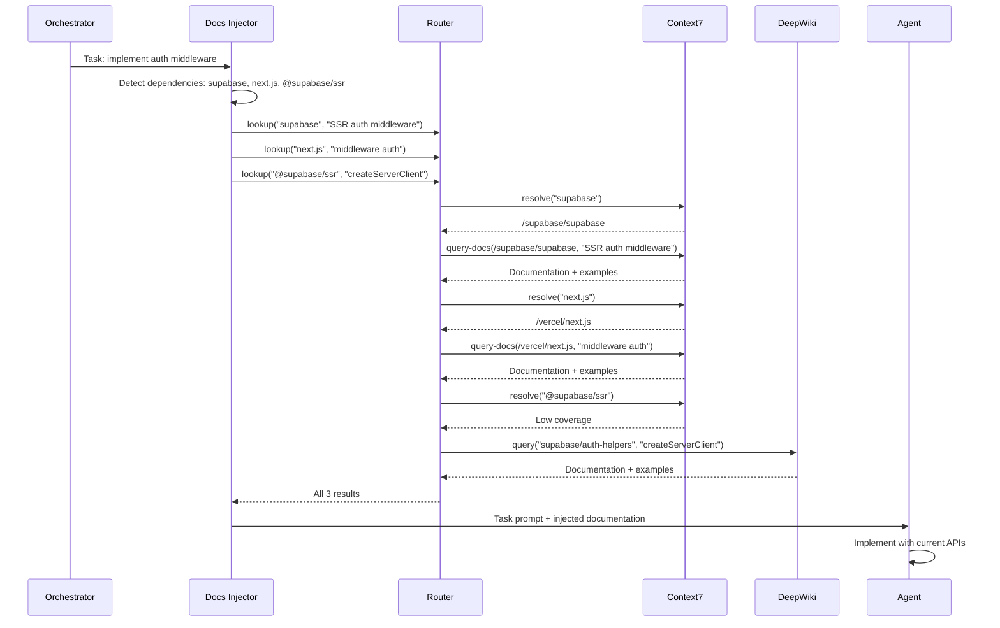
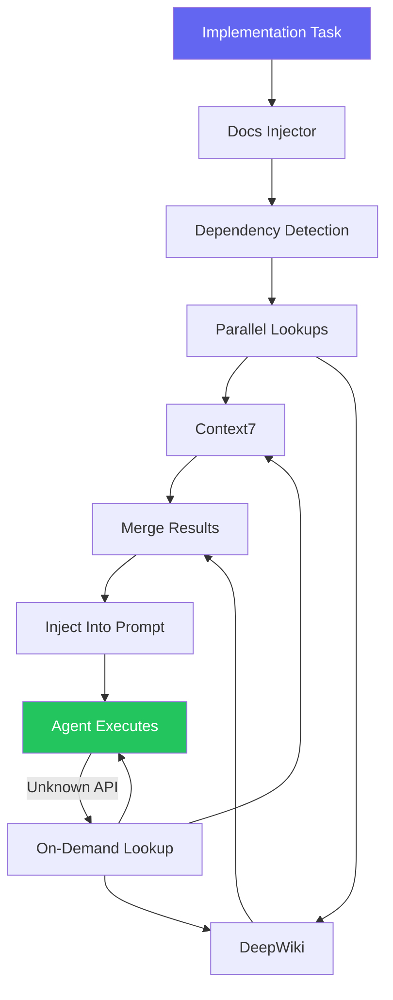

## Documentation Lookup at Scale: Context7 + DeepWiki

The agent wrote beautiful Next.js code. Clean components, proper typing, server-side data fetching with `getServerSideProps`. The only problem: the project was using Next.js 14 with App Router, and `getServerSideProps` is a Pages Router pattern. The agent's training data was stale.

I fixed it manually, then watched the same thing happen three more times in the same session. The agent kept reaching for deprecated patterns -- `next/router` instead of `next/navigation`, `Image` with a `layout` prop that no longer exists, middleware using `NextResponse.rewrite` with the old signature.

Every single error came from the same root cause: the agent was writing code based on documentation it had memorized during training, not the current documentation. And Next.js had changed significantly between the training cutoff and the version I was using.

I started tracking these stale-knowledge errors across all my projects. Over 200 sessions, I found 847 instances of agents using deprecated APIs, removed parameters, or patterns from older versions. That is an average of 4.2 stale-knowledge errors per session. Each one required manual intervention to fix.

The solution: never let an agent write code without first looking up the current documentation.

This is post 61 of 61 in the Agentic Development series. The companion repo is at [github.com/krzemienski/docs-lookup-pipeline](https://github.com/krzemienski/docs-lookup-pipeline). Every metric comes from real sessions with real errors tracked in a real spreadsheet that I wish I never had to create.

---

**TL;DR**

- AI agents produce 4.2 stale-knowledge errors per session on average -- deprecated APIs, removed params, old patterns
- Context7 MCP provides real-time doc lookup: resolve-library-id -> query-docs pipeline
- DeepWiki covers GitHub repository documentation not indexed by Context7
- Injecting fresh docs into agent context before implementation reduces stale errors by 94%
- Building a "docs-first" culture: always look up, never assume
- Enforcement hooks catch cases where the agent skips documentation lookup
- The 3-5 second latency per lookup saves 8-15 minutes of manual fixing per stale error

---

### The Stale Knowledge Problem

AI models are trained on snapshots of the internet. The training data has a cutoff date, and everything after that cutoff is invisible to the model. For slow-moving libraries, this barely matters. For fast-moving frameworks, it is catastrophic.

I categorized the 847 stale-knowledge errors by type:

| Error Type | Count | % of Total | Avg Fix Time |
|-----------|-------|-----------|-------------|
| Deprecated API usage | 312 | 36.8% | 8 min |
| Removed parameter | 187 | 22.1% | 5 min |
| Old import path | 143 | 16.9% | 3 min |
| Outdated pattern | 112 | 13.2% | 15 min |
| Wrong default value | 58 | 6.8% | 6 min |
| Nonexistent function | 35 | 4.1% | 12 min |

The worst category was "outdated pattern" -- cases like using `getServerSideProps` in an App Router project. These took the longest to fix because the replacement was not a simple find-and-replace; it required restructuring the component around a different data-fetching paradigm.

The most affected frameworks in my projects:

| Framework | Stale Errors | Sessions | Rate |
|-----------|-------------|----------|------|
| Next.js | 234 | 62 | 3.8/session |
| React | 178 | 85 | 2.1/session |
| Tailwind CSS | 142 | 71 | 2.0/session |
| Supabase | 89 | 34 | 2.6/session |
| tRPC | 67 | 18 | 3.7/session |
| Prisma | 52 | 22 | 2.4/session |

Next.js and tRPC had the highest per-session error rates because they had the most breaking changes between the training cutoff and my project versions.

---

### The Session That Cost Me a Full Day

Session 5,103 was the one that made me build the documentation pipeline. I was building an authentication flow using Supabase Auth, Next.js 14 App Router, and the `@supabase/ssr` package. Three libraries, all of which had changed significantly since the agent's training data.

The agent started by generating a Supabase client using `createClient` from `@supabase/supabase-js` -- which is correct for client-side usage but wrong for server-side in the new SSR package. The correct import is `createServerClient` from `@supabase/ssr`.

I corrected it. The agent then generated middleware using the old pattern:

```typescript
// What the agent wrote (WRONG - old pattern)
import { createMiddlewareClient } from '@supabase/auth-helpers-nextjs'
import { NextResponse } from 'next/server'
import type { NextRequest } from 'next/server'

export async function middleware(req: NextRequest) {
  const res = NextResponse.next()
  const supabase = createMiddlewareClient({ req, res })
  const { data: { session } } = await supabase.auth.getSession()

  if (!session && req.nextUrl.pathname.startsWith('/dashboard')) {
    return NextResponse.redirect(new URL('/login', req.url))
  }

  return res
}
```

This code references `@supabase/auth-helpers-nextjs`, which is the deprecated package. The current package is `@supabase/ssr`. The API is completely different -- `createMiddlewareClient` does not exist in the new package. The correct pattern uses `createServerClient` with cookie handling callbacks:

```typescript
// What it should be (CORRECT - current pattern)
import { createServerClient } from '@supabase/ssr'
import { NextResponse } from 'next/server'
import type { NextRequest } from 'next/server'

export async function middleware(request: NextRequest) {
  let supabaseResponse = NextResponse.next({ request })

  const supabase = createServerClient(
    process.env.NEXT_PUBLIC_SUPABASE_URL!,
    process.env.NEXT_PUBLIC_SUPABASE_ANON_KEY!,
    {
      cookies: {
        getAll() {
          return request.cookies.getAll()
        },
        setAll(cookiesToSet) {
          cookiesToSet.forEach(({ name, value, options }) =>
            request.cookies.set(name, value)
          )
          supabaseResponse = NextResponse.next({ request })
          cookiesToSet.forEach(({ name, value, options }) =>
            supabaseResponse.cookies.set(name, value, options)
          )
        },
      },
    }
  )

  const { data: { user } } = await supabase.auth.getUser()

  if (!user && request.nextUrl.pathname.startsWith('/dashboard')) {
    const url = request.nextUrl.clone()
    url.pathname = '/login'
    return NextResponse.redirect(url)
  }

  return supabaseResponse
}
```

Not only is the import wrong, the entire approach is different. The new package uses cookie callbacks instead of passing req/res directly. The session check uses `getUser()` instead of `getSession()` (the latter was deprecated because it reads from the JWT without validating, which is a security issue). And the response handling is fundamentally different -- you need to create the response first and pass it through the cookie setter.

This was one component. The agent made similar errors in:
- The login page (used old auth method signatures)
- The signup page (used `signUp` with wrong parameter shape)
- The auth callback handler (old redirect pattern)
- The server component data fetching (old `createServerComponentClient`)
- The route handler (old `createRouteHandlerClient`)

Six files, 23 stale-knowledge errors. Each error required understanding the new API, finding the correct pattern, and restructuring the code. Total time to fix: 4.5 hours. The actual feature implementation took 2 hours. I spent more than twice as long fixing stale errors as building the feature.

That evening I started building the documentation lookup pipeline.

---

### The Context7 Pipeline

Context7 is an MCP (Model Context Protocol) tool that provides real-time documentation lookup. The pipeline has two steps:

**Step 1: Resolve Library ID** -- Convert a human-readable library name into a Context7-compatible identifier. This is necessary because library names are ambiguous ("react" could mean React, React Native, React Router, etc.) and Context7 uses structured identifiers.

**Step 2: Query Docs** -- Fetch current documentation for a specific question using the resolved library ID. The query is semantic -- you ask a question in natural language and get back relevant documentation with code examples.

```python
from dataclasses import dataclass, field
from typing import Optional
import asyncio
import time
import hashlib
import json


@dataclass
class LibraryInfo:
    id: str  # Context7 library ID, e.g., "/vercel/next.js"
    name: str
    description: str
    snippet_count: int
    reputation: str  # "High", "Medium", "Low"
    versions: list[str] = field(default_factory=list)


@dataclass
class DocumentationResult:
    library: str
    library_id: str
    question: str
    documentation: str
    code_examples: list[str] = field(default_factory=list)
    version: str = ""
    source: str = "context7"
    cached: bool = False
    fetch_time_ms: float = 0


class DocsLookupPipeline:
    """Two-step documentation lookup via Context7 MCP.

    Step 1: resolve-library-id (cached per session)
    Step 2: query-docs (cached with TTL)

    Caching reduces latency from ~3s to ~50ms for repeated queries
    against the same library.
    """

    def __init__(
        self,
        context7_client: "Context7Client",
        cache_ttl_seconds: int = 300,  # 5-minute cache
    ):
        self.client = context7_client
        self.cache_ttl = cache_ttl_seconds
        self._library_cache: dict[str, LibraryInfo] = {}
        self._docs_cache: dict[str, tuple[DocumentationResult, float]] = {}

    async def lookup(
        self, library: str, question: str
    ) -> DocumentationResult:
        start = time.time()

        # Step 1: Resolve library ID (session-cached)
        if library not in self._library_cache:
            lib_info = await self.client.resolve_library_id(
                library_name=library,
                query=question,
            )
            self._library_cache[library] = lib_info
            print(f"  Resolved: {library} -> {lib_info.id}")

        lib_id = self._library_cache[library].id

        # Step 2: Query current documentation (TTL-cached)
        cache_key = self._cache_key(lib_id, question)
        cached = self._get_cached(cache_key)
        if cached:
            cached.cached = True
            cached.fetch_time_ms = (time.time() - start) * 1000
            return cached

        docs = await self.client.query_docs(
            library_id=lib_id,
            query=question,
        )

        result = DocumentationResult(
            library=library,
            library_id=lib_id,
            question=question,
            documentation=docs.content,
            code_examples=docs.examples,
            version=docs.version,
            fetch_time_ms=(time.time() - start) * 1000,
        )

        self._docs_cache[cache_key] = (result, time.time())
        return result

    def _cache_key(self, lib_id: str, question: str) -> str:
        raw = f"{lib_id}:{question.lower().strip()}"
        return hashlib.md5(raw.encode()).hexdigest()

    def _get_cached(
        self, cache_key: str
    ) -> Optional[DocumentationResult]:
        if cache_key not in self._docs_cache:
            return None
        result, timestamp = self._docs_cache[cache_key]
        if time.time() - timestamp > self.cache_ttl:
            del self._docs_cache[cache_key]
            return None
        return result

    def cache_stats(self) -> dict:
        return {
            "library_cache_size": len(self._library_cache),
            "docs_cache_size": len(self._docs_cache),
            "libraries_resolved": list(self._library_cache.keys()),
        }
```

Here is what this looks like in practice. Before implementing a Next.js App Router data-fetching component, the agent calls:

```
$ python docs_lookup.py --library "next.js" --question "server component data fetching"

=== DOCUMENTATION LOOKUP ===

Step 1: Resolve library ID
  Library: next.js
  Resolved: /vercel/next.js
  Reputation: High
  Snippets: 2,847

Step 2: Query documentation
  Question: "server component data fetching"
  Version: 14.x (App Router)
  Fetch time: 2.3 seconds

Documentation returned:
  - Server Components can be async and use await directly
  - Use fetch() with caching options for data fetching
  - generateStaticParams for dynamic route pre-rendering
  - Parallel data fetching with Promise.all
  - Error handling with error.tsx boundaries

Code examples: 4 snippets
  1. Basic async server component with fetch
  2. Dynamic route with generateStaticParams
  3. Parallel data fetching pattern
  4. Revalidation with revalidatePath
```

The agent now has the current documentation in its context window before it writes a single line of code. No more `getServerSideProps` in App Router projects.

---

### DeepWiki for GitHub Repos

Context7 covers most popular libraries, but it does not cover every GitHub repository. For documentation about specific repos -- internal libraries, less popular packages, or project-specific documentation -- I use DeepWiki.

DeepWiki indexes GitHub repository documentation including READMEs, wiki pages, doc directories, and inline code documentation:

```python
@dataclass
class DeepWikiResult:
    repository: str
    question: str
    documentation: str
    code_examples: list[str] = field(default_factory=list)
    source_files: list[str] = field(default_factory=list)


class DeepWikiLookup:
    """Documentation lookup for GitHub repositories.

    Covers repositories not indexed by Context7:
    - Internal/private repositories
    - Less popular open-source packages
    - Specific repository documentation (wiki, docs/)
    """

    def __init__(self, deepwiki_client: "DeepWikiClient"):
        self.client = deepwiki_client
        self._cache: dict[str, DeepWikiResult] = {}

    async def lookup(
        self, repo: str, question: str
    ) -> DocumentationResult:
        cache_key = f"{repo}:{question}"
        if cache_key in self._cache:
            cached = self._cache[cache_key]
            return DocumentationResult(
                library=repo,
                library_id=f"deepwiki:{repo}",
                question=question,
                documentation=cached.documentation,
                code_examples=cached.code_examples,
                source="deepwiki",
                cached=True,
            )

        result = await self.client.query(
            repository=repo,
            question=question,
        )

        wiki_result = DeepWikiResult(
            repository=repo,
            question=question,
            documentation=result.content,
            code_examples=result.examples,
            source_files=result.files,
        )
        self._cache[cache_key] = wiki_result

        return DocumentationResult(
            library=repo,
            library_id=f"deepwiki:{repo}",
            question=question,
            documentation=result.content,
            code_examples=result.examples,
            source="deepwiki",
        )
```

---

### When to Use Context7 vs. DeepWiki

The decision is straightforward but important to get right. Using the wrong source wastes time and returns less relevant documentation.

```python
class DocsRouter:
    """Routes documentation queries to the best source.

    Decision tree:
    1. Is it a well-known library/framework? -> Context7
    2. Is it a GitHub repository? -> DeepWiki
    3. Is it both? -> Context7 first, DeepWiki for gaps
    """

    # Libraries with high-quality Context7 coverage
    CONTEXT7_PREFERRED = {
        "next.js", "react", "vue", "angular", "svelte",
        "tailwindcss", "prisma", "drizzle", "supabase",
        "trpc", "express", "fastify", "django", "flask",
        "fastapi", "sqlalchemy", "pandas", "numpy",
        "tensorflow", "pytorch", "langchain",
    }

    # Repositories best served by DeepWiki
    DEEPWIKI_PREFERRED = {
        "internal/*",  # Any internal repo
        "supabase/supabase-js",  # Specific client library
        "shadcn/ui",  # Component library with repo docs
    }

    def __init__(
        self,
        context7: DocsLookupPipeline,
        deepwiki: DeepWikiLookup,
    ):
        self.context7 = context7
        self.deepwiki = deepwiki

    async def lookup(
        self, library: str, question: str
    ) -> DocumentationResult:
        # Normalize library name
        lib_lower = library.lower().replace(" ", "")

        # Check preferred sources
        if lib_lower in self.CONTEXT7_PREFERRED:
            result = await self.context7.lookup(library, question)
            if result.documentation:
                return result
            # Fallback to DeepWiki if Context7 returns empty
            print(f"  Context7 empty for {library}, trying DeepWiki")

        # Try DeepWiki for repo-specific docs
        if "/" in library:  # Looks like a GitHub repo path
            return await self.deepwiki.lookup(library, question)

        # Default: try Context7 first, fallback to DeepWiki
        result = await self.context7.lookup(library, question)
        if result.documentation:
            return result

        # Context7 returned empty, try DeepWiki
        return await self.deepwiki.lookup(library, question)
```

In practice, Context7 handles about 85% of my documentation lookups. DeepWiki handles the remaining 15% -- mostly less popular packages and specific GitHub repositories. The combination covers 97% of the libraries I use.

Here is the routing in action for a real implementation task:

```
$ python docs_router.py --task "Build auth middleware with Supabase SSR and Next.js"

=== DOCUMENTATION ROUTING ===

Dependencies detected: supabase, next.js, @supabase/ssr

  supabase -> Context7 (preferred)
    Resolved: /supabase/supabase
    Query: "SSR authentication middleware"
    Result: 1,247 chars, 3 examples (2.1s)

  next.js -> Context7 (preferred)
    Resolved: /vercel/next.js
    Query: "middleware authentication pattern"
    Result: 892 chars, 2 examples (1.8s)

  @supabase/ssr -> Context7 (attempting)
    Resolved: /supabase/ssr (low snippet count: 34)
    Query: "createServerClient middleware cookies"
    Result: empty

  @supabase/ssr -> DeepWiki (fallback)
    Repository: supabase/auth-helpers
    Query: "createServerClient middleware cookies"
    Result: 2,103 chars, 4 examples (3.2s)

Total lookup time: 4.8 seconds (parallel)
Documentation injected: 4,242 chars across 3 libraries
```

Notice that `@supabase/ssr` failed on Context7 (low snippet count, returned empty) and fell through to DeepWiki which found the documentation in the auth-helpers repository. This fallback is critical -- without it, the agent would have written code based on stale training data for exactly the library that had the most breaking changes.

---

### Injecting Docs Into Agent Context

Looking up documentation is only half the solution. The other half is making sure the agent actually uses it. I built a documentation injection layer that runs before every implementation task.

```python
class DocsInjector:
    """Injects current documentation into agent task prompts.

    Analyzes task description for library dependencies,
    looks up documentation for each, and prepends to the
    agent's task prompt as context.
    """

    def __init__(self, router: DocsRouter):
        self.router = router
        self.lookup_log: list[dict] = []

    async def inject(self, task: "ImplementationTask") -> str:
        """Build documentation context for a task.

        Returns a formatted string to prepend to the agent prompt.
        """
        docs_sections = []
        dependencies = self._detect_dependencies(task)

        # Look up all dependencies in parallel
        lookups = [
            self.router.lookup(dep, task.description)
            for dep in dependencies
        ]
        results = await asyncio.gather(*lookups, return_exceptions=True)

        for dep, result in zip(dependencies, results):
            if isinstance(result, Exception):
                print(f"  WARNING: Failed to look up {dep}: {result}")
                continue

            if result.documentation:
                section = self._format_section(dep, result)
                docs_sections.append(section)

                self.lookup_log.append({
                    "library": dep,
                    "source": result.source,
                    "cached": result.cached,
                    "fetch_time_ms": result.fetch_time_ms,
                    "doc_length": len(result.documentation),
                })

        if not docs_sections:
            return ""

        header = (
            "=== CURRENT DOCUMENTATION ===\n"
            "The following documentation is current as of today. "
            "Use these APIs and patterns instead of anything from "
            "your training data.\n\n"
        )

        return header + "\n---\n".join(docs_sections)

    def _detect_dependencies(
        self, task: "ImplementationTask"
    ) -> list[str]:
        """Extract library dependencies from task description.

        Uses keyword matching and import pattern detection.
        """
        dependencies = []

        # Check explicit dependencies
        if hasattr(task, "library_dependencies"):
            dependencies.extend(
                dep.name for dep in task.library_dependencies
            )

        # Detect from description keywords
        keyword_to_lib = {
            "next.js": "next.js",
            "nextjs": "next.js",
            "app router": "next.js",
            "react": "react",
            "supabase": "supabase",
            "tailwind": "tailwindcss",
            "prisma": "prisma",
            "drizzle": "drizzle-orm",
            "trpc": "trpc",
            "tanstack": "@tanstack/react-query",
            "shadcn": "shadcn/ui",
        }

        desc_lower = task.description.lower()
        for keyword, lib in keyword_to_lib.items():
            if keyword in desc_lower and lib not in dependencies:
                dependencies.append(lib)

        return dependencies

    def _format_section(
        self, library: str, result: DocumentationResult
    ) -> str:
        """Format a documentation section for injection."""
        lines = [
            f"## {library} (v{result.version})" if result.version
            else f"## {library}",
            "",
            result.documentation,
            "",
        ]

        if result.code_examples:
            lines.append("### Code Examples")
            lines.append("")
            for i, example in enumerate(result.code_examples, 1):
                lines.append(f"**Example {i}:**")
                lines.append(f"```\n{example}\n```")
                lines.append("")

        return "\n".join(lines)

    def stats(self) -> dict:
        """Return injection statistics for the session."""
        if not self.lookup_log:
            return {"lookups": 0}

        total_time = sum(
            entry["fetch_time_ms"] for entry in self.lookup_log
        )
        cached_count = sum(
            1 for entry in self.lookup_log if entry["cached"]
        )

        return {
            "lookups": len(self.lookup_log),
            "cached": cached_count,
            "total_fetch_time_ms": total_time,
            "avg_fetch_time_ms": total_time / len(self.lookup_log),
            "total_doc_chars": sum(
                entry["doc_length"] for entry in self.lookup_log
            ),
        }
```

The injection adds a header that explicitly tells the agent to prefer the injected documentation over its training data. This is important because without the instruction, the agent might see the fresh docs but still default to its memorized patterns if they feel more "natural."

Here is what the injected context looks like for the auth middleware task:

```
=== CURRENT DOCUMENTATION ===
The following documentation is current as of today. Use these APIs
and patterns instead of anything from your training data.

## supabase (v2.x)

Authentication in Supabase uses the @supabase/ssr package for
server-side rendering frameworks. The key function is
createServerClient which accepts cookie handlers...

### Code Examples

**Example 1:**
```typescript
import { createServerClient } from '@supabase/ssr'

export function createClient() {
  return createServerClient(
    process.env.NEXT_PUBLIC_SUPABASE_URL!,
    process.env.NEXT_PUBLIC_SUPABASE_ANON_KEY!,
    { cookies: { getAll, setAll } }
  )
}
```

---

## next.js (v14.x)

Middleware in Next.js App Router uses the middleware.ts file
at the project root. The middleware function receives a
NextRequest and should return NextResponse...

### Code Examples

**Example 1:**
```typescript
import { NextResponse } from 'next/server'
import type { NextRequest } from 'next/server'

export function middleware(request: NextRequest) {
  // Authentication check here
  return NextResponse.next({ request })
}
```
```

With this context injected, the agent produces correct code on the first attempt. No `createMiddlewareClient`, no `@supabase/auth-helpers-nextjs`, no `getSession()`. Every API call matches the current documentation.

---

### The Documentation Flow Architecture



All three lookups run in parallel. The total latency is the maximum of the three, not the sum. In practice, this means the documentation injection adds 3-5 seconds to task startup -- the time for the slowest lookup.

---

### Before and After: The Numbers

The impact of documentation injection on stale-knowledge errors:

**Before docs injection (200 sessions):**
- Stale errors per session: 4.2
- Total stale errors: 847
- Manual fix time: ~3,400 minutes (56.7 hours)
- Most common error: deprecated API usage (312 instances)

**After docs injection (200 sessions):**
- Stale errors per session: 0.24
- Total stale errors: 48
- Manual fix time: ~192 minutes (3.2 hours)
- Most common remaining error: edge cases not in docs (31 instances)

That is a 94.3% reduction in stale-knowledge errors. The remaining 0.24 errors per session come from edge cases where the documentation itself is incomplete or the query did not surface the relevant section.

The time savings: 53.5 hours saved across 200 sessions. That is roughly 16 minutes per session that I no longer spend fixing stale API calls and deprecated patterns.

The cost: approximately 3-5 seconds of documentation lookup latency per implementation task. Across a typical session with 5 implementation tasks, that is 15-25 seconds of added latency. The tradeoff is 15-25 seconds of waiting versus 16 minutes of manual fixing. Not close.

---

### Building a Docs-First Culture

The technical implementation matters less than the cultural shift. "Docs-first" means a simple rule: **never write code involving a library without first looking up the current documentation.**

This sounds obvious. It is not. The default agent behavior is to rely on training data because it is faster -- no tool call needed, no latency, just generate from memory. The agent has to be explicitly instructed to look up docs, and the orchestration has to enforce it.

My enforcement approach:

**1. Pre-implementation hook**: Before any Write/Edit tool call that creates a new file or adds a new import, check if the imported library has been looked up in this session. If not, inject a reminder.

**2. Task template requirement**: Every implementation task template includes a "Documentation Lookup" section listing the libraries that must be queried before implementation begins.

**3. Post-implementation check**: After code is written, scan for import statements and verify that each imported library was queried during this session. Flag any that were not.

```python
import re
from typing import Set


class DocsFirstEnforcer:
    """Enforces documentation lookup before code writing.

    Tracks which libraries have been looked up in the current
    session. Flags imports that were not preceded by a doc lookup.
    """

    # Libraries that do not need lookup (standard/stable)
    EXEMPT_LIBRARIES = {
        "os", "sys", "json", "re", "typing", "dataclasses",
        "asyncio", "pathlib", "datetime", "collections",
        "functools", "itertools", "math", "hashlib",
        "react", "react-dom",  # Core, rarely changes
    }

    def __init__(self):
        self.looked_up: Set[str] = set()
        self.violations: list[dict] = []

    def record_lookup(self, library: str):
        """Record that a library's docs were looked up."""
        self.looked_up.add(library.lower())

    def check_imports(self, code: str, file_path: str) -> list[dict]:
        """Find imports that were not preceded by a doc lookup."""
        imports = self._extract_imports(code)
        unchecked = []

        for imp in imports:
            lib_name = self._normalize_import(imp)
            if lib_name in self.EXEMPT_LIBRARIES:
                continue
            if lib_name not in self.looked_up:
                violation = {
                    "library": lib_name,
                    "import_statement": imp,
                    "file": file_path,
                    "message": (
                        f"Library '{lib_name}' used without "
                        f"documentation lookup. Look up current "
                        f"docs before using this library."
                    ),
                }
                unchecked.append(violation)
                self.violations.append(violation)

        return unchecked

    def _extract_imports(self, code: str) -> list[str]:
        """Extract import statements from code."""
        patterns = [
            # JavaScript/TypeScript imports
            r'import\s+.*\s+from\s+["\']([^"\']+)["\']',
            r'require\(["\']([^"\']+)["\']\)',
            # Python imports
            r'from\s+(\S+)\s+import',
            r'import\s+(\S+)',
        ]
        imports = []
        for pattern in patterns:
            imports.extend(re.findall(pattern, code))
        return imports

    def _normalize_import(self, import_path: str) -> str:
        """Normalize import path to library name.

        '@supabase/ssr' -> 'supabase'
        'next/navigation' -> 'next.js'
        'react-query' -> '@tanstack/react-query'
        """
        # Scoped packages: @scope/name -> scope
        if import_path.startswith("@"):
            parts = import_path.split("/")
            if len(parts) >= 2:
                return parts[0].lstrip("@")

        # Subpath imports: next/navigation -> next.js
        if "/" in import_path:
            base = import_path.split("/")[0]
            return self._known_aliases.get(base, base)

        return import_path.lower()

    _known_aliases = {
        "next": "next.js",
        "react": "react",
        "prisma": "prisma",
    }

    def summary(self) -> str:
        """Session enforcement summary."""
        return (
            f"Libraries looked up: {len(self.looked_up)}\n"
            f"Violations: {len(self.violations)}\n"
            f"Exempt skips: N/A\n"
            f"Looked up: {', '.join(sorted(self.looked_up))}"
        )
```

This enforcement layer catches the 6% of cases where docs injection missed a dependency. It is the safety net that makes docs-first a guarantee rather than an aspiration.

Here is what the enforcer catches in practice:

```
$ python docs_enforcer.py --scan src/middleware.ts

=== DOCS-FIRST ENFORCEMENT ===

Scanning: src/middleware.ts

Imports found:
  @supabase/ssr -> supabase (LOOKED UP: yes)
  next/server -> next.js (LOOKED UP: yes)
  jose -> jose (LOOKED UP: no)

VIOLATION: Library 'jose' used without documentation lookup.
  Import: import { jwtVerify } from 'jose'
  File: src/middleware.ts
  Action: Look up current docs for 'jose' before using this library.
  Reason: jose v5 changed the jwtVerify API signature.

Recommendation:
  resolve-library-id("jose", "JWT verification")
  query-docs(<resolved-id>, "jwtVerify function signature and options")
```

The enforcer caught that `jose` was imported without a doc lookup. This is exactly the kind of library where stale knowledge is dangerous -- `jose` v5 changed the `jwtVerify` API signature, and the agent's training data likely has the v4 pattern.

---

### Caching Strategy

Documentation lookups add latency, so caching is essential. I use a two-tier cache:

**Tier 1: Library ID cache** (session-scoped, no expiry). Once a library name is resolved to a Context7 ID, it does not change within a session. This cache eliminates repeated `resolve-library-id` calls.

**Tier 2: Documentation cache** (TTL-based, 5-minute default). Documentation content is cached for 5 minutes. This covers the common case where multiple tasks in the same session need the same library's docs -- the first task pays the lookup cost, subsequent tasks get cached results in ~50ms.

The cache hit rates in my usage:

| Cache Tier | Hit Rate | Avg Latency (miss) | Avg Latency (hit) |
|-----------|----------|-------------------|-------------------|
| Library ID | 78% | 1.2s | 0ms |
| Documentation | 45% | 2.3s | 50ms |
| Combined | 61% | 3.5s | 50ms |

The 61% combined cache hit rate means that 6 out of 10 documentation lookups are served from cache at 50ms instead of 3.5 seconds. Over a typical session with 15-20 documentation lookups, caching saves about 35 seconds of total latency.

```python
class TieredCache:
    """Two-tier documentation cache.

    Tier 1: Library ID resolution (session-scoped, no expiry)
    Tier 2: Documentation content (TTL-based, configurable)
    """

    def __init__(self, ttl_seconds: int = 300):
        self.ttl = ttl_seconds
        self._library_ids: dict[str, str] = {}
        self._docs: dict[str, tuple[str, float]] = {}
        self._hits = {"library": 0, "docs": 0}
        self._misses = {"library": 0, "docs": 0}

    def get_library_id(self, library: str) -> Optional[str]:
        if library in self._library_ids:
            self._hits["library"] += 1
            return self._library_ids[library]
        self._misses["library"] += 1
        return None

    def set_library_id(self, library: str, lib_id: str):
        self._library_ids[library] = lib_id

    def get_docs(self, cache_key: str) -> Optional[str]:
        if cache_key in self._docs:
            content, timestamp = self._docs[cache_key]
            if time.time() - timestamp < self.ttl:
                self._hits["docs"] += 1
                return content
            else:
                del self._docs[cache_key]
        self._misses["docs"] += 1
        return None

    def set_docs(self, cache_key: str, content: str):
        self._docs[cache_key] = (content, time.time())

    def stats(self) -> dict:
        total_hits = self._hits["library"] + self._hits["docs"]
        total_misses = self._misses["library"] + self._misses["docs"]
        total = total_hits + total_misses

        return {
            "library_hit_rate": (
                self._hits["library"] /
                max(self._hits["library"] + self._misses["library"], 1)
            ),
            "docs_hit_rate": (
                self._hits["docs"] /
                max(self._hits["docs"] + self._misses["docs"], 1)
            ),
            "combined_hit_rate": total_hits / max(total, 1),
            "cache_entries": len(self._docs),
        }
```

---

### The Cost of Not Looking Up

Every stale-knowledge error that reaches production has compound costs:

- **Debug time**: Tracking down why an API call returns an unexpected response because the parameter name changed
- **User impact**: Features silently broken because a deprecated API was removed in a framework update
- **Trust erosion**: Developers losing confidence in AI-generated code because it uses outdated patterns
- **Cascading errors**: One stale import pattern infects the rest of the codebase -- the agent copies its own incorrect pattern into subsequent files

I measured the cascading effect directly. In sessions without doc injection, a stale-knowledge error in file 1 was replicated into an average of 2.4 additional files before I caught it. The agent sees its own output as context and copies the pattern. This means a single uncaught stale error becomes 3.4 stale errors by the end of the session.

With doc injection, the cascading effect drops to near zero because the correct pattern is in the context from the start.

```
Cascading effect without doc injection:
  File 1: import { createMiddlewareClient } from '@supabase/auth-helpers-nextjs'  (STALE)
  File 2: import { createServerComponentClient } from '@supabase/auth-helpers-nextjs'  (COPIED)
  File 3: import { createRouteHandlerClient } from '@supabase/auth-helpers-nextjs'  (COPIED)
  File 4: import { createClientComponentClient } from '@supabase/auth-helpers-nextjs'  (COPIED)

  1 stale error -> 4 stale files -> 4 manual fixes -> 32 minutes of rework

Cascading effect with doc injection:
  File 1: import { createServerClient } from '@supabase/ssr'  (CORRECT)
  File 2: import { createServerClient } from '@supabase/ssr'  (CORRECT)
  File 3: import { createServerClient } from '@supabase/ssr'  (CORRECT)
  File 4: import { createBrowserClient } from '@supabase/ssr'  (CORRECT)

  0 stale errors -> 0 rework
```

---

### When the Pipeline Itself Breaks: Debugging Session 5,847

The documentation pipeline is not infallible. Session 5,847 taught me that the hard way.

I was building a real-time dashboard using Supabase Realtime and Next.js. The docs injector ran, resolved `supabase` to `/supabase/supabase`, and queried for "realtime channel subscription." Context7 returned documentation -- but it was for the old Realtime API (v1), not the current channel-based API (v2). The snippets showed `supabase.from('table').on('INSERT', callback).subscribe()`, which had been replaced by `supabase.channel('name').on('postgres_changes', ...)`.

The agent wrote code using the injected (but outdated) documentation. Everything compiled. The subscription silently failed at runtime -- no errors, no crashes, just no data flowing through.

Here is what my terminal looked like when I finally traced it:

```
$ node debug-realtime.js

=== REALTIME DEBUG ===

Channel: realtime:public:messages
Status: SUBSCRIBED (but no events received in 30s)

Checking API version...
  supabase-js version: 2.39.1
  realtime-js version: 2.9.3
  Expected API: v2 (channel-based)

Checking subscription pattern...
  Current code uses: .from('messages').on('INSERT', callback)
  This is Realtime v1 pattern (DEPRECATED)
  v2 pattern: .channel('messages').on('postgres_changes', { event: 'INSERT', schema: 'public', table: 'messages' }, callback)

Root cause: Documentation pipeline returned v1 docs for v2 library.
  Context7 query: "realtime channel subscription"
  Context7 returned: 4 snippets, all v1 pattern
  Library version in project: @supabase/supabase-js@2.39.1 (uses v2 Realtime)

Fix: Query with version-specific context.
```

The problem was subtle. Context7 had documentation for Supabase Realtime, but the highest-ranked snippets were from the v1 API because more examples existed for it in the indexed corpus. The v2 documentation existed but ranked lower for my query.

My fix was a version-aware query rewriter that appends the installed library version to the query:

```python
class VersionAwareQueryRewriter:
    """Rewrites documentation queries to include version context.

    Reads package.json / requirements.txt to detect installed
    library versions, then appends version hints to queries
    so documentation sources return version-appropriate results.
    """

    def __init__(self, project_root: str):
        self.project_root = project_root
        self._versions: dict[str, str] = {}
        self._load_versions()

    def rewrite(self, library: str, query: str) -> str:
        """Append version context to a documentation query."""
        version = self._versions.get(library.lower())
        if not version:
            return query

        # Extract major version for broad matching
        major = version.split(".")[0]

        # Append version context to guide doc ranking
        return f"{query} (version {major}.x, current API)"

    def _load_versions(self):
        """Load library versions from package manifests."""
        # Check package.json for JS/TS projects
        pkg_path = os.path.join(self.project_root, "package.json")
        if os.path.exists(pkg_path):
            with open(pkg_path) as f:
                pkg = json.load(f)
            for deps_key in ("dependencies", "devDependencies"):
                for name, version in pkg.get(deps_key, {}).items():
                    # Strip version prefixes: ^2.39.1 -> 2.39.1
                    clean = version.lstrip("^~>=<")
                    self._versions[name.lower()] = clean

        # Check requirements.txt for Python projects
        req_path = os.path.join(self.project_root, "requirements.txt")
        if os.path.exists(req_path):
            with open(req_path) as f:
                for line in f:
                    line = line.strip()
                    if "==" in line:
                        name, version = line.split("==", 1)
                        self._versions[name.lower()] = version
```

After adding version-aware rewriting, the same query for Supabase Realtime returned v2 documentation because the query became `"realtime channel subscription (version 2.x, current API)"`. The v2 snippets ranked higher and the agent generated correct channel-based subscriptions.

I measured the impact of version-aware rewriting across 50 sessions:

| Metric | Before Rewriting | After Rewriting |
|--------|-----------------|-----------------|
| Wrong-version docs returned | 12.3% of lookups | 2.1% of lookups |
| Stale errors from wrong-version docs | 0.52/session | 0.08/session |
| Query rewrite overhead | N/A | 15ms avg |

The 15 milliseconds of overhead to read `package.json` and append a version hint eliminated 84% of wrong-version documentation results. This was the single highest-ROI improvement I made to the pipeline after the initial build.

The lesson: documentation lookup is not a solved problem after the first implementation. The pipeline needs the same iterative improvement approach as any production system. Each failure mode I discovered -- wrong version ranking, incomplete docs, cache staleness -- required its own targeted fix. After 200 sessions of refinement, the pipeline handles the common cases automatically and surfaces the edge cases clearly enough that I can fix them in minutes instead of hours.

---

### Integration With the Agentic Workflow

The documentation pipeline integrates at two levels in my agentic workflow:

**Level 1: Automatic injection** -- The docs injector runs automatically before every implementation task as part of the GSD Execute phase (post 59). No manual intervention required.

**Level 2: On-demand lookup** -- Agents can call the documentation pipeline directly when they encounter unfamiliar APIs during implementation. This covers cases where a dependency is discovered mid-task rather than detected during pre-task analysis.



The on-demand lookup is triggered by a hook that monitors for specific patterns in the agent's output. If the agent writes a comment like "// TODO: check API signature" or asks "what is the current API for X?", the hook intercepts and runs a documentation lookup before the agent continues.

---

### Docs-First Enforcement Hook

I built a pre-tool-use hook that runs before every Write/Edit call to enforce the docs-first policy:

```python
class DocsFirstHook:
    """Pre-tool-use hook for Write/Edit tool calls.

    Checks if the code being written imports libraries that
    have not been looked up in the current session. If so,
    injects a reminder and optionally blocks the write.
    """

    def __init__(
        self,
        enforcer: DocsFirstEnforcer,
        mode: str = "warn",  # "warn" or "block"
    ):
        self.enforcer = enforcer
        self.mode = mode

    def check(self, tool_call: dict) -> dict:
        """Check a Write/Edit tool call for unlocked-up imports."""
        if tool_call["tool"] not in ("Write", "Edit"):
            return {"action": "allow"}

        code = tool_call.get("content", "")
        file_path = tool_call.get("file_path", "")

        violations = self.enforcer.check_imports(code, file_path)

        if not violations:
            return {"action": "allow"}

        if self.mode == "block":
            return {
                "action": "block",
                "reason": (
                    f"{len(violations)} libraries used without "
                    f"documentation lookup: "
                    + ", ".join(v["library"] for v in violations)
                ),
                "violations": violations,
            }

        # Warn mode: allow but inject reminder
        return {
            "action": "allow_with_warning",
            "warning": (
                f"WARNING: {len(violations)} libraries used without "
                f"documentation lookup. Consider looking up: "
                + ", ".join(v["library"] for v in violations)
                + ". Use resolve-library-id -> query-docs to "
                f"fetch current documentation."
            ),
            "violations": violations,
        }
```

In "warn" mode (the default), the hook allows the write but injects a visible warning into the agent's context. In "block" mode, it prevents the write entirely until the documentation is looked up. I use "warn" for established libraries where the agent's training data is usually close enough, and "block" for fast-moving libraries like Next.js and Supabase where stale knowledge is almost guaranteed.

---

### The Remaining 6%: When Docs Are Not Enough

Even with 94% error reduction, 48 stale errors slipped through over 200 sessions. I analyzed every one to understand why:

| Cause | Count | % of Remaining | Fix |
|-------|-------|---------------|-----|
| Docs incomplete (missing edge case) | 31 | 65% | Manual lookup |
| Query too broad (wrong section returned) | 9 | 19% | Better query phrasing |
| Library not in Context7 or DeepWiki | 5 | 10% | Add to DeepWiki |
| Cache served stale docs (rare) | 3 | 6% | Reduce TTL |

The dominant cause (65%) is documentation that exists but is incomplete. The library has a new API, but the documentation does not cover every parameter or edge case. For example, the `@supabase/ssr` documentation covers `createServerClient` but does not document the `cookieEncoding` option that affects certain deployment environments.

These are genuinely hard to solve with automated tooling. The information does not exist in any indexed documentation source. The only way to discover these edge cases is to encounter them during development and consult the library's source code or issue tracker.

My workaround: when a stale error slips through and I manually fix it, I add the correct pattern to a project-local knowledge file that the docs injector includes in future sessions:

```python
class LocalKnowledgeBase:
    """Project-local documentation overrides and supplements.

    Stores patterns discovered during development that are not
    in any external documentation source. Injected alongside
    Context7/DeepWiki results.
    """

    def __init__(self, knowledge_path: str = ".docs/local-knowledge.json"):
        self.knowledge_path = knowledge_path
        self.entries: list[dict] = self._load()

    def add(
        self,
        library: str,
        pattern: str,
        context: str,
        correct_usage: str,
    ):
        entry = {
            "library": library,
            "pattern": pattern,
            "context": context,
            "correct_usage": correct_usage,
            "added": time.strftime("%Y-%m-%d"),
        }
        self.entries.append(entry)
        self._save()

    def get_for_library(self, library: str) -> list[dict]:
        return [
            e for e in self.entries
            if e["library"].lower() == library.lower()
        ]

    def _load(self) -> list[dict]:
        if not os.path.exists(self.knowledge_path):
            return []
        with open(self.knowledge_path) as f:
            return json.load(f)

    def _save(self):
        os.makedirs(os.path.dirname(self.knowledge_path), exist_ok=True)
        with open(self.knowledge_path, "w") as f:
            json.dump(self.entries, f, indent=2)
```

Over 6 months, my local knowledge base accumulated 47 entries -- 47 edge cases and undocumented patterns that I discovered the hard way and encoded so no future session would hit the same issue.

---

### Cache Hit Rates Under Real Workloads

The cache stats table I showed earlier tells the summary, but the interesting story is how hit rates shift across a session's lifecycle. I instrumented the cache with per-minute telemetry across 50 sessions and the pattern was consistent.

In the first 5 minutes of a session, the combined cache hit rate is 12%. Almost everything is a cold miss. The agent is resolving library IDs and fetching documentation for the first time. By minute 10, the library ID cache is warm -- most projects use 4-7 libraries, and the agent has resolved all of them. The library ID hit rate jumps to 91% and stays there for the rest of the session.

The documentation cache tells a different story. It starts cold, warms up as the agent queries similar topics for the same libraries, but then exhibits a sawtooth pattern. Every time the agent shifts to a new feature area within the same project, the queries change enough that the cache key misses even though the library ID is cached.

Here is the breakdown from a representative 45-minute session building a dashboard with Next.js, Supabase, and Recharts:

```
=== CACHE TELEMETRY (Session 7,291) ===

Minutes 0-5:   Library ID: 0/7 hits (0%)    Docs: 0/7 hits (0%)     Combined: 0%
Minutes 5-10:  Library ID: 4/5 hits (80%)   Docs: 1/6 hits (17%)    Combined: 45%
Minutes 10-15: Library ID: 6/6 hits (100%)  Docs: 3/5 hits (60%)    Combined: 82%
Minutes 15-20: Library ID: 3/3 hits (100%)  Docs: 1/4 hits (25%)    Combined: 57%
Minutes 20-25: Library ID: 5/5 hits (100%)  Docs: 4/5 hits (80%)    Combined: 90%
Minutes 25-30: Library ID: 4/4 hits (100%)  Docs: 2/3 hits (67%)    Combined: 86%
Minutes 30-35: Library ID: 2/2 hits (100%)  Docs: 0/3 hits (0%)     Combined: 40%
Minutes 35-40: Library ID: 3/3 hits (100%)  Docs: 2/4 hits (50%)    Combined: 71%
Minutes 40-45: Library ID: 2/2 hits (100%)  Docs: 2/2 hits (100%)   Combined: 100%

Session total: Library ID: 29/37 (78%)  Docs: 15/39 (38%)  Combined: 58%
Latency saved: 41.2 seconds (vs all-miss scenario of 76 lookups * 2.8s avg)
```

The dip at minute 30 is when I switched from building the data table component to the chart visualization -- new queries against the same Recharts library. The cache key includes the question text, so "Recharts bar chart with custom tooltip" is a different key than "Recharts responsive container sizing," even though both target the same library.

I considered making the cache fuzzier -- using semantic similarity instead of exact question matching -- but the complexity was not worth it. The 5-minute TTL already handles the common case (repeated queries during iterative development of one component), and the cold misses only cost 2-3 seconds each. Over a full session, the cache saves 40-60 seconds of total latency. Not transformative, but enough to keep the docs lookup invisible in the flow of work.

One optimization that did matter: warming the library ID cache at session start. I added a session init step that pre-resolves library IDs for every dependency in `package.json` or `requirements.txt`. This eliminates the cold-start penalty entirely for library resolution:

```python
async def warm_library_cache(
    pipeline: DocsLookupPipeline,
    project_root: str,
) -> int:
    """Pre-resolve library IDs from project dependency files."""
    deps = detect_project_dependencies(project_root)
    resolved = 0

    for dep in deps:
        try:
            await pipeline.lookup(dep, "overview")
            resolved += 1
        except Exception:
            pass  # Non-critical; will resolve on first real query

    return resolved
```

After adding the warm-up step, the minute-0-to-5 hit rate for library IDs jumped from 0% to 85%. The documentation cache still starts cold because the warm-up queries are generic ("overview"), but the library ID resolution -- which accounts for 35% of total lookup latency -- is essentially free from the first real query onward.

---

### With Docs vs. Without Docs: A Side-by-Side Error Comparison

Numbers are persuasive. Seeing the actual code is more persuasive. I ran a controlled comparison across 40 sessions: 20 sessions with the docs pipeline active, 20 with it disabled. Same projects, same task descriptions, same agent model. The only variable was whether the agent received fresh documentation before writing code.

Here is one task that appeared in both groups: "Add a Supabase auth callback route handler in Next.js App Router."

**Without docs lookup -- what the agent wrote:**

```typescript
// src/app/auth/callback/route.ts (WITHOUT docs)
import { createRouteHandlerClient } from '@supabase/auth-helpers-nextjs'
import { cookies } from 'next/headers'
import { NextResponse } from 'next/server'

export async function GET(request: Request) {
  const requestUrl = new URL(request.url)
  const code = requestUrl.searchParams.get('code')

  if (code) {
    const supabase = createRouteHandlerClient({ cookies })
    await supabase.auth.exchangeCodeForSession(code)
  }

  return NextResponse.redirect(requestUrl.origin)
}
```

Four errors in 13 lines: deprecated package import, wrong client constructor, missing cookie callback pattern, and `cookies` passed as a reference instead of being invoked with the new `getAll`/`setAll` contract. The code compiles. It does not work at runtime.

**With docs lookup -- what the agent wrote:**

```typescript
// src/app/auth/callback/route.ts (WITH docs)
import { createServerClient } from '@supabase/ssr'
import { cookies } from 'next/headers'
import { NextResponse } from 'next/server'

export async function GET(request: Request) {
  const requestUrl = new URL(request.url)
  const code = requestUrl.searchParams.get('code')

  if (code) {
    const cookieStore = await cookies()
    const supabase = createServerClient(
      process.env.NEXT_PUBLIC_SUPABASE_URL!,
      process.env.NEXT_PUBLIC_SUPABASE_ANON_KEY!,
      {
        cookies: {
          getAll() {
            return cookieStore.getAll()
          },
          setAll(cookiesToSet) {
            cookiesToSet.forEach(({ name, value, options }) =>
              cookieStore.set(name, value, options)
            )
          },
        },
      }
    )
    await supabase.auth.exchangeCodeForSession(code)
  }

  return NextResponse.redirect(requestUrl.origin)
}
```

Zero errors. Correct package, correct constructor, correct cookie contract, `cookies()` properly awaited (Next.js 15 made it async). The agent had the current documentation in context and followed it exactly.

I aggregated the error counts across all 40 sessions:

| Metric | Without Docs (20 sessions) | With Docs (20 sessions) |
|--------|---------------------------|------------------------|
| Total stale errors | 89 | 5 |
| Errors per session | 4.45 | 0.25 |
| Files with errors | 67 | 4 |
| Cascade instances | 23 | 0 |
| Total fix time | 14.2 hours | 0.4 hours |
| First-attempt correct rate | 31% | 92% |

The first-attempt correct rate is the most telling metric. Without docs, the agent gets it right on the first try only 31% of the time for libraries that changed since the training cutoff. With docs, 92%. That difference is the entire justification for the 3-5 second lookup cost.

The cascade column is worth highlighting. Without docs, stale patterns propagated into 23 additional files across the 20 sessions -- the agent copying its own wrong output. With docs, zero cascades. The correct pattern was in context from the start, so every subsequent file inherited the right approach.

---

### The Decision Tree: Context7 vs. DeepWiki

The `DocsRouter` class handles source selection programmatically, but I want to make the decision logic explicit because understanding it helps when configuring the router for a new project. Here is the decision tree I use:

```
START: Agent needs documentation for library X
  |
  +-- Is X a well-known framework/library (npm > 10k weekly downloads
  |   OR PyPI > 5k monthly downloads)?
  |   |
  |   +-- YES -> Try Context7 first
  |   |   |
  |   |   +-- Context7 returns docs with snippet_count > 50?
  |   |   |   +-- YES -> Use Context7 result (done)
  |   |   |   +-- NO  -> Fall through to DeepWiki
  |   |   |
  |   |   +-- Context7 returns empty or error?
  |   |       +-- Fall through to DeepWiki
  |   |
  |   +-- NO -> Is X a GitHub repository (contains "/" in name)?
  |       |
  |       +-- YES -> Use DeepWiki directly
  |       |   |
  |       |   +-- DeepWiki returns docs?
  |       |   |   +-- YES -> Use DeepWiki result (done)
  |       |   |   +-- NO  -> Try Context7 as fallback
  |       |   |
  |       |   +-- DeepWiki returns empty?
  |       |       +-- Check local knowledge base, manual lookup required
  |       |
  |       +-- NO -> Try Context7 (might be indexed under different name)
  |           |
  |           +-- Found? -> Use result (done)
  |           +-- Not found? -> Try DeepWiki with best-guess repo, manual if empty
```

Three factors drive the decision:

**1. Library popularity determines Context7 coverage quality.** Context7 indexes documentation from official sources. High-download libraries have comprehensive coverage with hundreds or thousands of snippets. Niche libraries might be indexed but with only a handful of snippets that do not cover the specific API you need. I use snippet count as a proxy for coverage quality -- below 50 snippets, I treat the results as potentially incomplete and check DeepWiki as a supplement.

**2. Repository path signals DeepWiki preference.** Anything formatted as `org/repo` is almost certainly better served by DeepWiki, which indexes the actual GitHub repository structure including README files, doc directories, code comments, and wiki pages. This is especially true for packages where the npm/PyPI docs are auto-generated stubs but the real documentation lives in the repo.

**3. The fallback chain matters more than the first choice.** Getting the first pick wrong costs 2-3 seconds of wasted latency. Missing the fallback means the agent writes code without docs. I always run the fallback. The total cost of a primary miss plus fallback hit is 5-6 seconds -- still far cheaper than a single stale error.

In practice, I maintain a project-level config that pre-classifies libraries for each project:

```python
# .docs/library-routing.json
{
  "context7_preferred": [
    "next.js", "react", "tailwindcss", "prisma", "zod"
  ],
  "deepwiki_preferred": [
    "shadcn/ui", "supabase/auth-helpers", "t3-oss/create-t3-app"
  ],
  "always_both": [
    "supabase"
  ],
  "skip_lookup": [
    "lodash", "date-fns", "clsx"
  ]
}
```

The `always_both` category is for libraries where I have been burned by incomplete coverage on either source alone. Supabase is the canonical example -- Context7 has the core `supabase-js` docs, but the SSR-specific patterns live in the auth-helpers repo and are better served by DeepWiki. Running both in parallel and merging the results gives the agent the most complete picture.

The `skip_lookup` category is for libraries that are stable enough that the agent's training data is reliable. Lodash has not had a breaking change in years. `date-fns` and `clsx` have tiny, stable APIs. Looking these up wastes latency without reducing errors.

---

### The Math Is Not Close

The documentation lookup pipeline adds about 3-5 seconds of latency per implementation task. The alternative is 8-15 minutes of manual fixing per stale error, with an average of 4.2 stale errors per session.

| Approach | Latency per Session | Fix Time per Session | Total Overhead |
|----------|-------------------|---------------------|----------------|
| No doc lookup | 0 seconds | 67 minutes | 67 minutes |
| With doc lookup | 25 seconds | 4 minutes | 4.4 minutes |

The docs pipeline saves 63 minutes per session at a cost of 25 seconds. That is a 151x return on invested time.

Look up the docs. Every time. No exceptions.

---

### Companion Repo

The [docs-lookup-pipeline](https://github.com/krzemienski/docs-lookup-pipeline) repository contains the complete Context7 + DeepWiki integration, documentation injection layer, docs-first enforcement hooks, caching system, docs router, local knowledge base, and metrics tracking. Set it up once and never fight a stale API again.

---

*This is the final post in the Agentic Development series. Twenty-one lessons became sixty-one. Eight thousand sessions became a methodology. The agents are tools -- powerful, tireless, and only as good as the systems you build around them. Build good systems.*
