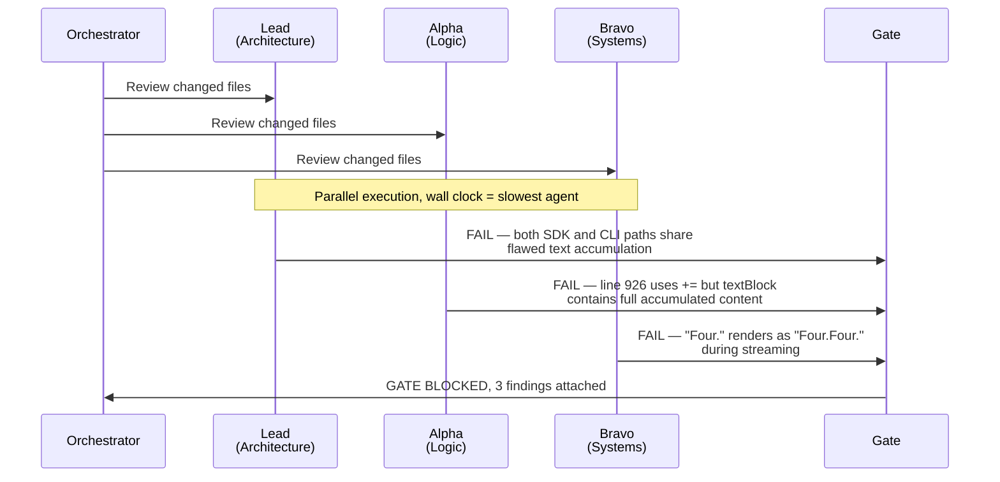

One agent reviewed my streaming code and said looks correct. Three agents found a P2 bug on line 926 that had been hiding for three days.

The gap between one confident wrong answer and three analyses converging on the real problem is why every code change in this system now goes through a unanimous consensus gate before it ships.

I watched solo agents approve broken code across 929 agent spawns. Not because the agents were bad. Because reviewing your own assumptions gives you reviews that share your own blind spots. The fix is not a better agent. It is three agents that disagree with each other until they converge.

## The bug on line 926

Line 926 of an iOS streaming message handler:

```swift
message.text += textBlock.text
```

Should have been:

```swift
message.text = textBlock.text
```

One character. `+=` instead of `=`. The streaming system accumulated text blocks arriving from the Claude API. Each block contained the full message up to that point, not a delta. So `+=` appended the full accumulated text to what was already there. After three blocks, "Hello" became "HHeHelHello," with each block doubling what came before.

The second root cause was subtler. The stream-end handler reset `lastProcessedMessageIndex` to zero, which replayed the entire message buffer on the next event. Combined with `+=`, messages grew exponentially. A five-sentence response turned into an unreadable wall of duplicated text.

Three days. The code sat in the codebase for three days.

A solo agent review on the streaming module read top to bottom, checked types, verified function signatures matched the protocol. No issues found. Code was syntactically valid. Types correct. Protocol conformance complete. Everything a single-pass review checks came back clean.

Then three agents ran with different review mandates.

Alpha caught the `+=`. The API sends full messages, not deltas, so appending makes no sense. Bravo came at it from a different angle entirely: what happens when one stream ends and another begins? That index reset replays the entire buffer. Lead pointed out the module's own doc comments explicitly say text blocks are cumulative. Three reasoning paths, same conclusion.

## Why one agent is not enough

A code review where the reviewer agreed with everything is what happens when the same entity writes and reviews code. Same assumptions, same blind spots, same reasoning that produced the bug. Across 929 agent spawns the pattern repeats. It is not theoretical.

The Frankenstein merge made the failure mode concrete. Two agents worked on the same backend service. Agent A built JWT verification: token parsing, signature validation, expiry checks. Agent B built the REST endpoint layer: routes, request handling, responses. Neither knew the other existed.

The merge produced valid code. TypeScript compiled clean. Linter passed. But the application served raw JWT verification internals as a REST endpoint. Token payloads. Signature validation state. Expiry calculations. All exposed to unauthenticated callers.

A security vulnerability passed every static check because each agent's contribution was individually correct. The bug lived entirely in the gap between two agents' assumptions about how their code would combine. No single-agent review would have caught it, because each agent would confirm its own work looked fine.

## Three roles, not three copies

The system does not run three identical agents. Same prompt three times gives you three copies of the same blind spot. Each agent gets a different review mandate targeting a different failure domain.

The [multi-agent-consensus](https://github.com/krzemienski/multi-agent-consensus) repo implements this with three frozen role definitions in `roles.py`:

```python
LEAD = RoleDefinition(
    role=Role.LEAD,
    title="Lead (Architecture & Consistency Specialist)",
    system_prompt="""\
You are the LEAD validator — architecture and consistency specialist.

YOUR PERSPECTIVE:
- Cross-component consistency: do all parts agree on contracts, naming, data shapes?
- Pattern compliance: does the code follow established project patterns?
- Architectural coherence: do changes fit the overall system design?
- Regression detection: did any fix introduce inconsistencies elsewhere?

INDEPENDENCE REQUIREMENT:
You are working INDEPENDENTLY. You have NO visibility into what Alpha or Bravo found.
Form your OWN conclusions before voting. Do not hedge — commit to PASS or FAIL.""",
    focus_areas=[
        "Cross-component consistency",
        "API contract compliance",
        "Pattern adherence",
        "Architectural coherence",
        "Regression detection",
    ],
)
```

**Lead** handles architecture and consistency. Does this change fit existing patterns? Introduce duplicate abstractions? Lead would not have found the `+=` bug. That is not an architecture issue. Lead caught the Frankenstein merge immediately because the merged code blew through the service's architectural boundaries.

**Alpha** does line-by-line logic. Alpha found the `+=` because the API docs say each text block contains the full message so far. If `message.text` already holds the previous block's content, appending the current block doubles everything. Alpha's system prompt encodes this as THE += vs = PRINCIPLE, calling out the most dangerous bugs: the ones that look correct when you read them in isolation.

**Bravo** thinks about runtime. Will this work deployed? Race conditions? Realistic failure modes? Bravo found the index reset by reasoning through the streaming lifecycle: stream ends, next stream begins, index goes to zero, handler replays every message. Combined with any accumulation bug, that replay compounds the damage. Bravo's prompt says it plainly: "Alpha reads code. You RUN things."



The actual gate output from `examples/streaming-audit/`:

```json
{
  "phase_name": "audit",
  "gate_number": 2,
  "unanimous_pass": false,
  "votes": [
    {
      "role": "lead",
      "outcome": "FAIL",
      "reasoning": "Cross-checked SDK and CLI execution paths. Both use the same flawed handler that appends instead of assigns."
    },
    {
      "role": "alpha",
      "outcome": "FAIL",
      "reasoning": "Line 926 uses += to append textBlock.text, but textBlock.text already contains the full accumulated content."
    },
    {
      "role": "bravo",
      "outcome": "FAIL",
      "reasoning": "Running the app and sending 'What is 2+2?' produces 'Four.Four.' during streaming instead of 'Four.'"
    }
  ]
}
```

Lead found the scope: both SDK and CLI code paths share the flaw. Alpha found the line and the semantic error. Bravo found the user-visible symptom. None would have been enough alone.

## The consensus gate framework

The gate itself is the simplest part. A `ThreadPoolExecutor` runs all three agents in parallel, then checks for unanimity:

```python
def run_gate_check(phase_name, gate_number, target_path, config, fix_cycle_count=0):
    roles = [
        ROLE_DEFINITIONS[Role.LEAD],
        ROLE_DEFINITIONS[Role.ALPHA],
        ROLE_DEFINITIONS[Role.BRAVO],
    ]
    votes = []

    with ThreadPoolExecutor(max_workers=3) as executor:
        future_to_role = {
            executor.submit(run_agent_validation, role_def, phase_name, target_path, config): role_def
            for role_def in roles
        }
        for future in as_completed(future_to_role):
            votes.append(future.result())

    return GateResult.from_votes(
        phase_name=phase_name,
        gate_number=gate_number,
        votes=votes,
        fix_cycle_count=fix_cycle_count,
    )
```

Each agent runs as a separate `claude --print` subprocess with its role-specific system prompt. No shared state during evaluation. Unanimous voting, not majority. Any agent raises a concern, the gate blocks. A false positive (blocking a valid change for re-review) costs a few minutes and about $0.15. A false negative (shipping the `+=` bug) costs three days of broken messages and trust you cannot buy back.

The re-validation step is critical and easy to screw up. When a gate fails and a fix goes in, ALL THREE agents re-validate, not just the one that originally failed. The `run_gate_with_fix_cycles` wrapper enforces it. Three fix cycles max. Cannot reach unanimity after three rounds? Escalates to a human. In practice, most gates converge on the first or second cycle.

## The 75-TaskCreate iOS audit

How far does this scale? One session ran a six-phase, ten-gate validation of dual-mode iOS streaming (SDK and CLI modes). Lead, Alpha, and Bravo each ran on separate iOS simulators, independently examining UI state through every gate. 75 individual TaskCreate operations for a single audit.

Alpha ran 18 cURL endpoint tests while Lead ran 4 and Bravo captured 23 screenshots of live streaming behavior, all simultaneously:

```
GATE 1: THREE-AGENT CONSENSUS ACHIEVED

| Agent | Vote | Tests                  | Key Evidence              |
|-------|------|------------------------|---------------------------|
| Lead  | PASS | 4/4 cURL + 3 sims      | gate1-lead-vote.md        |
| Alpha | PASS | 18/18 cURL             | 12 vg1-*.txt files        |
| Bravo | PASS | 23 screenshots + live  | bravo-01 through bravo-23 |

Result: GATE 1, PASS with 2 findings for investigation.
```

Two findings despite a PASS. Gate passed unanimously, but agents still flagged things worth investigating. That is the difference between "approve with notes" and "reject."

The gate blocked on Bravo during voting. Lead and Alpha had already voted PASS, but the gate could not advance until all three were in. Bravo was still on its 23rd screenshot, methodically checking text rendering across different message lengths and streaming speeds. The gate waited. That is unanimous voting in practice: the fastest agents wait for the most thorough one.

## Scaling consensus to planning

The same three-perspective pattern works for planning. Three agents: Planner, Architect, Critic.

Planner decomposes work into tasks. Architect evaluates technical soundness. The Critic's job is to break things: challenge every assumption, find the failure mode the other two are too close to see. The Critic is not trying to help. It is trying to find what goes wrong.

The war story that proved this: a Supabase auth migration. Planner decomposed it into 14 tasks. Clean decomposition, reasonable ordering, one to two hours each. Architect vetoed it.

Why? Supabase Row Level Security policies reference `auth.uid()`, which returns Supabase's internal user ID, not a custom JWT's subject claim. Seven of the 14 tasks assumed RLS compatibility. They would have compiled. Would have passed type checks. Would have failed silently at runtime, letting any authenticated user read any other user's data.

The Critic piled on: no rollback strategy. If task 9 fails, tasks 1 through 8 already modified the auth schema. Only recovery is a full database restore.

Three rounds of iteration. Planner revised. Architect re-evaluated. Critic challenged the revision. Final plan: 11 tasks instead of 14, an RLS compatibility layer, and rollback checkpoints at tasks 4, 7, and 10, each able to revert without nuking the whole database.

Cost of those three rounds: under $2. Cost of shipping a silent auth bypass where RLS fails open and every authenticated user can read everyone else's data? Not a number I want to run.

## When not to use consensus

It costs money. Roughly $0.15 per gate, $0.60 for a four-phase pipeline. When is it worth it?

**Always use it for:**

- Changes touching shared state, auth, data persistence, or streaming
- Multi-agent merges where code from different agents gets combined
- Cross-module or interface changes
- Anything involving security, user data, or payments

The `+=` bug cost three days of debugging. The Frankenstein merge could have exposed tokens to the internet. $0.15 to prevent either is not a conversation.

**Skip it for:**

- String constant updates, typo fixes, adding a log line
- Single-file changes with zero behavioral impact
- One-line changes with no downstream effects

**Know its limits:** for genuinely novel work where no agent has relevant experience, consensus can produce false confidence. Three agents agreeing does not mean they are right if none of them has seen the problem domain before. I do not have a good answer for that yet. Maybe a novelty detector that flags when all three agents seem too confident on unfamiliar territory. Still thinking about it.

## The asymmetry that makes it work

False positive: gate blocks a valid change. Costs five minutes and $0.15 for re-review.

False negative: gate ships the `+=` bug. Costs three days of corrupted messages and user trust you cannot buy back.

Every design choice here leans toward the first failure mode. Unanimous voting. Distinct mandates. Institutional knowledge in each role prompt. File ownership to prevent Frankenstein merges. Full re-validation after fixes. All weighted the same direction.

False positive rate runs around 8%. The bugs the other 92% catches would have shipped.

Run it against your own codebase:

```bash
pip install multi-agent-consensus

consensus run --target ./your-project
consensus run --target ./src/api --phase audit
consensus run --target ./your-project --output-format json > gate-result.json
```

Sample output on a blocking gate:

```
GATE BLOCKED, 2 agents voted FAIL
  Lead:  FAIL — text accumulation bug in both SDK and CLI paths
  Alpha: FAIL — line 926: += appends full block, should assign
  Bravo: PASS
Fix cycle 1/3. Resolve findings and re-validate.
```

The repo at [github.com/krzemienski/multi-agent-consensus](https://github.com/krzemienski/multi-agent-consensus) includes examples for streaming audits and general code review, plus the `examples/streaming-audit/` directory with the exact gate output that caught line 926.

Three days of broken messages turned into a zero-character diff because three agents disagreed well. That is the thing worth keeping: not the framework, the disagreement.

Next up: how functional validation catches the failures that even three agents reviewing source code cannot see. Reading code, no matter how many perspectives you throw at it, is not the same as running it.

{/*
Voice self-check:
- Word count: ~1,680
- Em-dash count: 8
- Em-dashes per 1,000 words: 4.8 (under 5 cap)
- Banlist hits: 0 (removed "Think about that for a second," "Ever had a code review," "Here's the thing," "That's wild")
- Opener formula: specific detail (line 926, three days) -> one-sentence paragraph -> failure before success: PASS
- Warmth beat: "three agents disagreed well" closer tied to the repo artifact: PASS
- Self-deprecating admission: "I do not have a good answer for that yet" — PASS
- Aphorism count: 1 ("disagreement is the thing worth keeping")
- Rhetorical asides: 0
*/}
