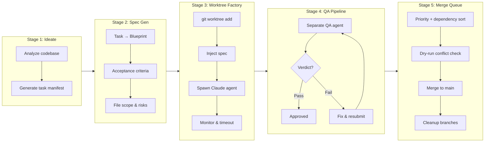
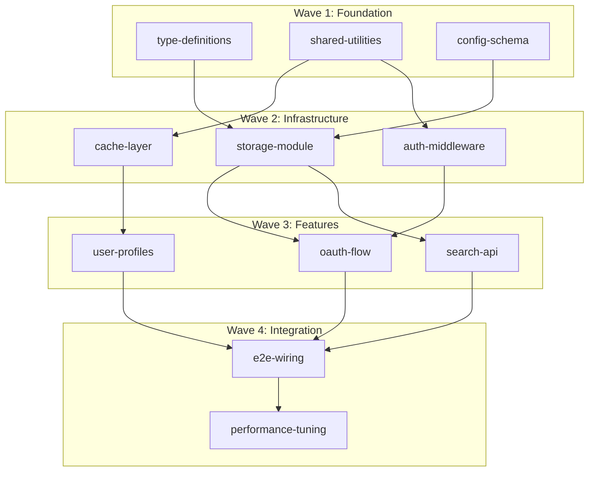

Two agents worked on the same codebase for twenty minutes. Agent A refactored the storage module. Agent B added caching to the storage module. Neither knew the other existed.

I stared at the merge conflicts and felt the familiar sinking. The diff was a disaster.

That was the moment I stopped thinking about AI agents as "faster developers" and started thinking about them as concurrent processes that need isolation guarantees. Better prompts would not fix this. Smarter conflict resolution would not fix this. Making conflicts *structurally impossible* would fix this.

The mechanism that made them structurally impossible: **file-scope declarations enforced before any agent starts working.** Each spec declares exactly which files its agent is allowed to touch. If two specs overlap, the orchestrator rejects the second one at task creation time, not at merge time. Combine that with git worktrees — each agent gets its own physical working directory on its own branch — and two agents literally cannot edit the same file at the same time. The filesystem enforces what prompts can't.

The pipeline I built around this turned weeks of serial work into something 194 agents could build in parallel without stepping on each other once. Ideation, spec generation, isolated execution, independent QA, priority-weighted merge. Five stages. Zero conflicts.

## Why branches don't cut it

The obvious first attempt is branches. Agent A works on `feature/auth`, Agent B works on `feature/cache`. Clean separation, right?

Nope. Branches share a working directory. If Agent A is on `feature/auth` and Agent B needs to switch to `feature/cache`, Agent A's uncommitted changes get clobbered. You could commit before switching, but now you're serializing parallel work. That defeats the whole point.

Even with separate clones, you pay a steep cost. A full clone of a large repo takes minutes and gigabytes. Worktrees? Seconds. They share the object store. The `.git` directory stays shared; only the working tree gets duplicated. For a 500MB repo, 194 full clones would eat ~97GB. 194 worktrees consume a fraction of that.

```bash
# One command. New branch, new working directory, shared history.
git worktree add ../worktrees/feature-auth -b auto/auth-oauth
```

That single command gives you a physically separate directory with its own branch, its own index, its own HEAD, all backed by the same repository. Agent A works in `/worktrees/feature-auth/`. Agent B works in `/worktrees/feature-cache/`. Different directories, different branches, same git history. No filesystem contention. No accidental overwrites.

Creating one worktree is trivial. The engineering challenge was managing 194 of them through a complete lifecycle: creation, spec injection, agent execution, quality review, priority-ordered merge, and cleanup. That is what `auto-claude-worktrees` does.

## The five-stage pipeline

I did not just "create worktrees and run agents." I built a five-stage pipeline where each stage feeds the next, and the whole thing runs with minimal human intervention.



From the Awesome List project (my stress test), here are the numbers:

| Metric | Value |
|--------|-------|
| Tasks ideated | 194 |
| Specs generated | 91 |
| Worktrees created | 71 |
| QA reports produced | 71 |
| Git branches created | 90 |
| Total sessions consumed | 3,066 |
| Conversation data | 470 MB |
| QA first-pass rejection rate | ~22% |
| QA second-pass approval rate | ~95% |

194 tasks generated. 91 turned into specs (the rest got deferred or were duplicates). 71 worktrees provisioned and executed. Zero merge conflicts when those branches came back together.

## Stage 1: Ideation — let the agent scope the work

Here is a counterintuitive move: let the AI agent decide what to build. Not the high-level vision, that stays mine. But the granular task decomposition? An Opus agent analyzing the full codebase produces better task boundaries than I do manually. I have tried both. It is not close.

The ideation agent examines directory structure, file contents, and architecture patterns, then generates a task list. Each task gets four things: a unique identifier, a scope boundary (which files it touches), dependencies (which tasks must finish first), and a priority ranking.

I deliberately let ideation over-generate. Why? Producing 194 task descriptions costs a fraction of executing even one of them. The downstream QA pipeline filters what should not ship. It is cheaper to generate 194 and execute 91 than to carefully curate 91 up front.

## Stage 2: Spec generation — the bottleneck nobody expects

Raw task descriptions are not enough for autonomous agents. "Implement OAuth flow" is too vague. An agent will make assumptions about endpoints, token formats, error handling, and those assumptions will conflict with whatever another agent assumed about the same system.

The spec generator turns each task into a detailed blueprint:

- **Objective**: Single-sentence end state
- **Files in scope**: Explicit list of files to create, modify, or delete
- **Implementation steps**: Ordered sequence of changes
- **Acceptance criteria**: Concrete, verifiable conditions
- **Risk notes**: Known pitfalls and edge cases

The data model from the codebase:

```python
class Spec(BaseModel):
    task_id: str
    objective: str
    files_in_scope: list[str]
    implementation_steps: list[str]
    acceptance_criteria: list[str]
    risk_notes: list[str] = []
    estimated_complexity: str = "medium"

    def get_branch_name(self) -> str:
        if self.branch_name:
            return self.branch_name
        return f"auto/{self.task_id}"
```

The `files_in_scope` field is everything. It declares exactly which files this task can touch. When two specs declare overlapping file scopes, the orchestrator catches it *before any agent starts working*. Conflict prevention at the cheapest point (task creation) instead of the most expensive point (merge time).

Here is the lesson from running this at scale: **specs are the bottleneck, not execution.** A precise spec passes QA on the first attempt. A vague spec fails QA, gets sent back for fixes, and burns two extra sessions. That 22% first-pass rejection rate? Almost entirely traceable to specs that weren't specific enough about edge cases or error handling.

## Stage 3: the worktree factory

This is the core. For each spec, the factory runs a four-step lifecycle:

1. **Create worktree** — `git worktree add` from main with a dedicated branch
2. **Inject spec** — Write the spec as both human-readable markdown and machine-readable JSON into the worktree
3. **Spawn agent** — Launch a Claude session scoped to that worktree directory
4. **Monitor** — Wait for completion with a configurable timeout

```python
def execute_in_worktree(spec, repo_path, config, base_dir):
    branch_name = spec.get_branch_name()
    state = WorktreeState(task_id=spec.task_id, branch_name=branch_name)

    # Create isolated worktree
    worktree_path = create_worktree(repo_path, branch_name, base_dir)

    # Inject spec as context for the agent
    inject_spec(worktree_path, spec)

    # Spawn Claude agent scoped to this directory
    process = spawn_agent(worktree_path, spec, config)

    # Wait for completion with timeout
    stdout, stderr = process.communicate(timeout=config.timeout_seconds)

    if process.returncode == 0:
        state.mark_completed()
    else:
        state.mark_failed(f"Agent exited with code {process.returncode}")

    return state
```

The factory runs all specs in parallel using a `ThreadPoolExecutor`. With `max_parallel_workers` set to 8, eight agents work simultaneously, each in its own worktree, each on its own branch. The system prompt tells every agent: you are in an isolated worktree, your changes affect nothing else, follow the spec exactly, commit early and often.

```python
def run_factory(specs, repo_path, config):
    with ThreadPoolExecutor(max_workers=config.max_parallel_workers) as executor:
        future_to_spec = {
            executor.submit(execute_in_worktree, spec, repo_path, config, base_dir): spec
            for spec in specs
        }
        for future in as_completed(future_to_spec):
            state = future.result()
            states.append(state)
    return states
```

Each agent operates in complete isolation. It cannot see other worktrees. It cannot modify files outside its worktree. The filesystem enforces the isolation that prompts alone cannot guarantee.

Cleanup matters at scale. 194 worktrees consume real disk space, and abandoned worktrees accumulate stale lock files. The pipeline prunes worktrees after merge and runs `git worktree prune` to clean up stale references.

Here is the start of an actual 194-task run from the Awesome List project. The log captures worktree IDs, branch names, and launch timestamps as the factory spins up eight parallel workers:

```
[2026-02-14T09:12:03Z] auto-claude run --repo ./awesome-list --specs .auto-claude/specs/ --workers 8
[2026-02-14T09:12:03Z] Loading 91 specs from .auto-claude/specs/
[2026-02-14T09:12:03Z] Resolved dependency order: 91 tasks across 4 waves

[2026-02-14T09:12:04Z] [wt-001] LAUNCH  branch=auto/add-category-ai-tools      scope=categories/ai-tools/**
[2026-02-14T09:12:04Z] [wt-002] LAUNCH  branch=auto/add-category-devtools      scope=categories/devtools/**
[2026-02-14T09:12:04Z] [wt-003] LAUNCH  branch=auto/add-category-infra         scope=categories/infra/**
[2026-02-14T09:12:05Z] [wt-004] LAUNCH  branch=auto/add-category-ml-frameworks scope=categories/ml/**
[2026-02-14T09:12:05Z] [wt-005] LAUNCH  branch=auto/add-category-observability scope=categories/observability/**
[2026-02-14T09:12:05Z] [wt-006] LAUNCH  branch=auto/update-readme-structure    scope=README.md
[2026-02-14T09:12:06Z] [wt-007] LAUNCH  branch=auto/add-badges-ci              scope=.github/**
[2026-02-14T09:12:06Z] [wt-008] LAUNCH  branch=auto/add-contributing-guide     scope=CONTRIBUTING.md
[2026-02-14T09:14:37Z] [wt-006] DONE    duration=4m33s  commits=2   qa=pending
[2026-02-14T09:18:44Z] [wt-003] FAILED  duration=6m38s  error=agent-timeout    attempt=1/2
[2026-02-14T09:19:21Z] [wt-001] DONE    duration=7m17s  commits=3   qa=approved
[2026-02-14T09:24:40Z] [wt-004] DONE    duration=12m35s commits=4   qa=rejected  reasons=missing-error-handling
[2026-02-14T09:24:41Z] [wt-004] FIX     agent applying QA remediation instructions
[2026-02-14T09:29:02Z] [wt-004] DONE    duration=4m21s  commits=6   qa=approved
[2026-02-14T09:32:18Z] Active: 8/8  Queued: 71  Completed: 12  Failed: 0  Rejected→Fixed: 3
```

Eight agents running simultaneously within six seconds. Each gets its own worktree, its own branch, and a declared file scope the orchestrator enforces. Durations vary wildly: 4m33s for a README change, 12m35s for a category that needed QA remediation before it earned approval. `wt-003` failed its first attempt on agent timeout and the factory respawned it against a fresh session ID. `wt-004` hit a QA rejection (missing error handling), got the specific remediation fed back to the same agent, and passed on the second pass.

## Stage 4: QA pipeline — why self-review doesn't work

I learned this the hard way: **QA agents must be separate from execution agents.** The same biases that lead an agent to write buggy code lead it to overlook those bugs in review. A fresh agent with no memory of the implementation decisions catches things the builder agent rationalizes away.

The QA agent receives three pieces of context: the original spec with acceptance criteria, the git diff of all changes, and any completion notes the execution agent left behind. It produces one of three verdicts:

- **Approved**: all acceptance criteria met, code quality acceptable
- **Rejected with fixes**: specific issues identified, remediation instructions provided
- **Rejected permanently**: the approach is flawed, needs re-specification

```python
QA_SYSTEM_PROMPT = """\
You are an independent QA reviewer for an autonomous development pipeline.

IMPORTANT: You are NOT the agent that wrote this code. You are a separate reviewer
with fresh eyes. Do not assume anything works. Verify everything against the spec.
"""
```

When the QA agent rejects a task, it does not just say "rejected." It provides specific failed criteria, detailed issues, and step-by-step remediation instructions. Those instructions get fed back to the original execution agent (still alive in its worktree) as a fix prompt. The agent applies fixes, commits, and the QA agent reviews again.

The numbers: 22% first-pass rejection rate, but 95% second-pass approval. The QA pipeline catches real stuff. Missing error handling. Edge cases the spec mentioned but the agent skipped. Hardcoded values that should be configurable. And because the fix cycle runs automatically, those 22% of tasks get repaired without any human touching them.

## Stage 5: priority-weighted merge queue

194 worktrees produce up to 194 branches that all need to merge back to main. Naive sequential merging (branch 1, then 2, then 3) invites conflicts. Branch 150 will conflict with something branch 12 changed, and by that point nobody remembers why branch 12 made that change.

The merge queue uses a topological sort with priority weighting:



How the merge algorithm works:

1. **Foundation tasks first**: shared infrastructure, type definitions, config schemas. No dependencies, merge cleanly by definition.
2. **Dry-run conflict check**: before every merge, `git merge --no-commit --no-ff` detects conflicts without applying changes. If conflicts exist, the merge gets aborted and the task gets flagged for re-execution against updated main.
3. **Small before large**: focused single-file tasks merge before broad refactors. Within the same priority, the sort is deterministic (alphabetical by task ID) so the merge order stays reproducible.
4. **Dependency ordering**: a topological sort ensures no task merges before its dependencies.

```python
def check_conflicts(repo_path, branch_name):
    """Dry-run merge to detect conflicts without committing."""
    result = subprocess.run(
        ["git", "merge", "--no-commit", "--no-ff", branch_name],
        cwd=repo_path, capture_output=True, text=True,
    )
    conflicts = []
    if result.returncode != 0:
        status = subprocess.run(
            ["git", "diff", "--name-only", "--diff-filter=U"],
            cwd=repo_path, capture_output=True, text=True,
        )
        if status.stdout.strip():
            conflicts = status.stdout.strip().split("\n")
    # Always abort the attempted merge
    subprocess.run(["git", "merge", "--abort"], cwd=repo_path, capture_output=True)
    return conflicts
```

The dry-run conflict check is cheap insurance. It takes milliseconds and prevents the only failure mode that would need human intervention: an unresolvable merge conflict in the middle of an automated pipeline.

When conflicts pop up, the task does not just fail. It re-enters the execution pipeline with an updated main branch as its base. The agent re-executes against the current state of the codebase, producing changes that account for everything that merged before it. More expensive than a clean merge, sure. But way cheaper than a human trying to resolve a three-way diff between two agents' competing visions.

## The ripple rebase problem

Session `0ea2a1c3` pushed this system to its limit. 21 active worktrees running simultaneously. The pipeline orchestrating creation, development, QA, and merge of 9 pull requests in sequence, PRs #8 through #16. Each PR built on the foundation laid by the previous one.

Here is the "ripple rebase" problem that came up. After merging PR #8, every branch based on the pre-merge state of main needed to rebase. With 20 active branches, that is 20 rebase operations after each merge. Over the course of 9 merges, the system performed roughly 180 rebase operations.

Any one of those 180 rebases could have surfaced a conflict that did not exist when the branch was first created. But they didn't. Every single rebase applied cleanly.

Why? File scope got declared up front. Branch A owns `src/auth/**`. Branch B owns `src/cache/**`. When A merges and B rebases, there are no conflicts because B never touched auth files. The scope boundaries guarantee non-overlapping changes, which guarantees clean rebases. Without scope declarations, those 180 rebase operations would have been a minefield. With them, every one was a no-op in terms of conflict resolution.

We also discovered a `gh pr merge` bug during this session, an edge case in GitHub's CLI that surfaces during rapid sequential merges. The specifics matter less than the meta-lesson: you only discover tooling bugs at scale. Nobody runs `gh pr merge` 9 times in rapid succession during normal development. The worktree factory made it routine.

## When worktrees are the wrong answer

I want to be honest about the limits here. Worktrees add real overhead: disk space (each is a full working copy minus shared objects), cognitive load (tracking dozens of parallel streams), and merge complexity. For small changes touching fewer than three files, a single branch is simpler and faster.

For tightly coupled changes (shared state, database migrations, API contract changes) worktrees create the illusion of independence. Two agents can each build working code in isolation, but the code fails when combined because they made incompatible assumptions about a database schema. File scope checks catch file-level conflicts, but they cannot catch semantic conflicts. I still don't have a great answer for that. If you've solved it, I'd genuinely love to hear how.

My rule of thumb: if two tasks share more than two files, they should be one task in one worktree. If a task requires understanding the output of another task to succeed, sequence them with a dependency. Do not parallelize.

The pattern works best when the codebase has natural boundaries. The Awesome List project had clear domain separation, with each list category as an independent module. The ILS iOS project had 35 worktrees distributed across isolated domains: macOS app, iCloud sync, multi-agent teams, custom themes, SSH service, performance optimization. The SSH service never touched iCloud sync files. Themes never touched performance code. The boundaries were natural, not forced.

## The numbers in context

Across 23,479 total sessions in this workflow, 18,945 were agent-spawned. Every one of those needed filesystem isolation from others working on the same project. The team coordination data tells the scale story: 128 `TeamCreate` calls, 1,720 `SendMessage` calls between agents, 2,182 tasks created and tracked.

The worktree pipeline consumed 3,066 of those sessions across the Awesome List project alone. One project, one pipeline run: 194 ideated tasks, 91 specs, 71 worktrees, 71 QA reports, and 90 git branches. All converging back to a single clean main branch.

Here is the counterintuitive part: the overhead of writing specs, declaring file scopes, and running the five-stage pipeline costs *less* than a single merge conflict in a 194-branch system. One unresolved conflict cascades through every subsequent merge. Prevention costs minutes. Resolution costs hours.

## Running it yourself

The [`auto-claude-worktrees`](https://github.com/krzemienski/auto-claude-worktrees) repo packages the full pipeline as a CLI tool:

```bash
pip install auto-claude-worktrees

# Run the full pipeline
auto-claude full --repo ./my-project --workers 4

# Or run stages individually
auto-claude ideate --repo ./my-project
auto-claude spec --repo ./my-project --tasks .auto-claude/tasks.json
auto-claude run --repo ./my-project --specs .auto-claude/specs/ --workers 8
auto-claude qa --repo ./my-project
auto-claude merge --repo ./my-project
```

Configuration lives in `.auto-claude.toml`:

```toml
[pipeline]
max_parallel_workers = 8
model = "sonnet"
qa_model = "opus"
timeout_seconds = 600
max_retries = 2

[merge]
strategy = "priority-weighted"
```

Start with 3 worktrees to understand the pattern. Watch the agents work in isolation, see the QA pipeline catch issues, observe the merge queue converge everything cleanly. Then scale to 8 workers, then 20. The system scales linearly because the isolation guarantees hold at any count.

## What actually changed

Before worktrees, I thought about agents as collaborators that needed to communicate and coordinate. Wrong framing. Now I think about them as isolated processes that need precisely defined interfaces. The worktree is not a convenience feature. It is the unit of autonomous agent work. Each worktree gets its own spec, its own agent, its own QA reviewer, its own merge path. Everything you need is in this directory, everything you produce stays in this directory, and nothing outside this directory is your concern. That is the contract.

When Ralph (the orchestrator covered in Day 22's post) runs across multiple worktrees, each one gets its own execution loop, its own cycle of implementation, verification, and correction. Ten named worktrees, each running independent loops, all producing commits on their own branches, all merging back through the same priority-weighted queue. The isolation makes it work. Without it, ten parallel agents produce chaos. With it, they produce a codebase.

The file scope declaration in the spec is the key insight. Not "try not to conflict." Not "communicate if you need to touch shared files." Declare your scope up front, and the system rejects you if your scope overlaps with any running agent. Prevention, not resolution. Rejection at task creation, not firefighting at merge time.

363 total worktrees across four projects. Peak of 35 simultaneous worktrees active at once. 9 PRs created and merged in a single session. A 47-task spec managing 21 active worktrees across phases. Zero merge conflicts.

Not because I got lucky. Because conflicts were structurally impossible.

Tomorrow (Day 06): an off-day. Comment replies only. Day 07 picks up Ralph — the hat-rotation loop that runs inside these isolated worktrees and makes the 1:47 AM story real.

The repo is `github.com/krzemienski/auto-claude-worktrees`. The license is MIT. The pipeline ships as `pip install auto-claude-worktrees`.

Declare scope. Let the filesystem enforce it. Stop resolving conflicts and start preventing them.

{/* voice-self-check: em-dashes=3 (0.9/1k), banlist-hits=0, opener-formula=pass (specific detail: "twenty minutes" → one-sentence paragraph "I stared..." → failure stated before success "disaster" then "made them structurally impossible") */}
