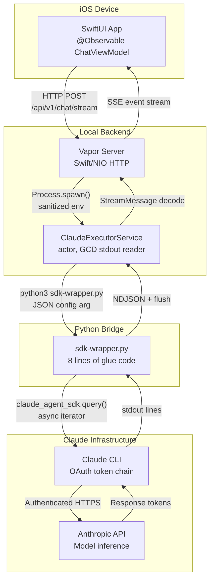
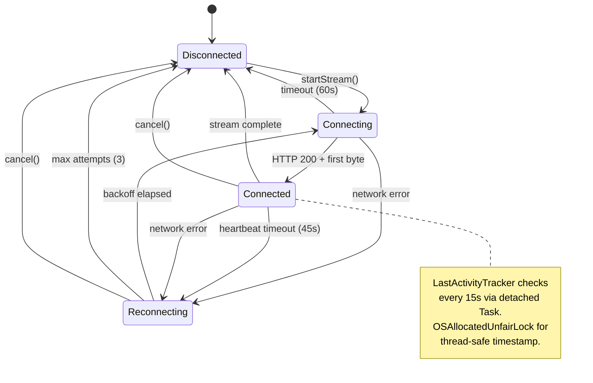

I wanted one thing: Claude streaming into a SwiftUI view, token by token.

Four failed architectures, a five-layer bridge with ten network hops per token, and 7,985 iOS MCP tool calls later, I had something that actually worked.

What broke, why it broke, and why the "complicated" solution turned out to be the only simple one.

## The problem nobody warns you about

Claude Code has streaming. The terminal shows tokens arriving in real time. The Python SDK streams. The JavaScript SDK streams. So connecting an iOS app should be straightforward, right?

It is not. Claude Code does not use API keys. It uses an OAuth session token that the CLI manages internally. You cannot import an HTTP client in Swift, hit the Anthropic API, and parse the responses. The authentication boundary sits somewhere iOS developers never expect it, and that single fact blows up every "obvious" architecture.

I learned this across the ils-ios project: 4,241 files, 1,563,570 lines of code, 128 xcode_build invocations, 2,165 simulator_screenshot calls. The iOS simulator became my second screen. Build, screenshot, tap, verify. Repeat.

## Four architectures that failed

Each attempt looked reasonable on paper. Each failed for a reason that was invisible until I ran it on a real device.

**Attempt 1: Direct API calls from Swift.** The obvious first move. Import `URLSession`, construct the request, hit the Anthropic API endpoint, parse the SSE stream. Swift has excellent async/await support for streaming HTTP responses. Should take an afternoon.

```
anthropic.AuthenticationError: No API key provided
```

Not a key management problem. Claude Code authenticates through an OAuth session token flow that the Python SDK handles internally. There is no API key to put in your keychain. The CLI manages a session token that refreshes automatically, and that token exchange is not exposed as a public interface. The API is not designed for direct client access from a mobile app.

Dead end. The authentication model itself is incompatible.

**Attempt 2: JavaScript SDK via Node subprocess.** Spawn a Node.js process from Swift using `Process()`, pipe the official JavaScript SDK's output back to the app. Node authenticates, Swift reads stdout. Simple IPC.

The subprocess launched. The SDK authenticated. Then silence. No output. No error. Just a hanging process consuming CPU.

The problem: SwiftNIO event loops do not pump `RunLoop`. Swift's networking layer and Node's event loop are independent scheduling systems. Running both in the same process creates a mismatch where neither yields to the other. The subprocess hung on its first async operation and never recovered. Two correct runtimes that become incorrect when composed.

**Attempt 3: Swift ClaudeCodeSDK in Vapor.** Use the Swift SDK wrapper inside a Vapor server running on localhost. Two Swift processes, the app and the server, communicating over HTTP. Both are Swift, so the type system aligns. Should be clean.

```
FileHandle.readabilityHandler needs RunLoop which NIO doesn't provide
```

The ClaudeCodeSDK uses Foundation's `FileHandle` for process communication, which requires a `RunLoop`. Vapor uses SwiftNIO, which provides `EventLoop`, a different concurrency primitive entirely. `FileHandle.readabilityHandler` callbacks are scheduled on a `RunLoop` that SwiftNIO never creates. The callbacks register, then never fire. Two Swift frameworks that are individually correct but architecturally incompatible.

**Attempt 4: Direct CLI invocation.** The simplest approach. Shell out to the `claude` CLI from Swift and read its stdout stream-json output.

```
Error: Claude Code cannot run inside another Claude Code instance
```

The CLI checks for a `CLAUDECODE=1` environment variable at startup. When the iOS app (running inside a Claude Code development session) spawns the CLI, the parent process's environment propagates to the child, including that flag. The CLI sees the variable and refuses to start, assuming it is being invoked recursively.

Ambient environment contamination. The parent's environment poisons the child's startup check.

## The architecture that survived

After four failures, a pattern clicked. Each attempt failed at a boundary: authentication, event loop, concurrency model, or environment. The solution was to make each boundary explicit, with a dedicated layer for each translation.



Ten hops per token. The SwiftUI app sends an HTTP POST to the local Vapor server. Vapor's `ClaudeExecutorService` actor spawns a Python subprocess. Python invokes the Claude CLI with environment variables stripped. The CLI authenticates via OAuth and calls the Anthropic API. The response travels back through each layer in reverse: API to CLI stdout, CLI to Python stdout, Python to NDJSON line, NDJSON to `StreamMessage` decode, `StreamMessage` to SSE event, SSE event to SwiftUI view update.

Five layers. Five files. Each with a single job:

| Layer | File | Responsibility |
|-------|------|----------------|
| 1. Transport | `SSEClient.swift` | HTTP connection, SSE parsing, heartbeat watchdog, reconnection |
| 2. Execution | `ClaudeExecutorService.swift` | Process spawn, env sanitization, GCD stdout reading, timeouts |
| 3. Types | `StreamingTypes.swift` | `StreamMessage` enum, content blocks, delta types, codable conformance |
| 4. Bridge | `sdk-wrapper.py` | Claude Agent SDK async iteration, NDJSON emission, flush control |
| 5. ViewModel | `ChatViewModel.swift` | Message accumulation, text dedup, observation bindings, UI state |

Here is the Vapor route that opens the SSE connection and proxies tokens from the `ClaudeExecutorService` to the iOS client:

```swift
// Routes.swift — SSE endpoint in the Vapor server
func routes(_ app: Application) throws {
    app.post("api", "v1", "chat", "stream") { req async throws -> Response in
        let body = try req.content.decode(ChatRequest.self)

        let response = Response(status: .ok)
        response.headers.replaceOrAdd(
            name: .contentType, value: "text/event-stream"
        )
        response.headers.replaceOrAdd(
            name: .cacheControl, value: "no-cache"
        )
        response.headers.replaceOrAdd(
            name: "X-Accel-Buffering", value: "no"
        )

        response.body = .init(asyncStream: { writer in
            let executor = ClaudeExecutorService()
            for try await message in executor.stream(prompt: body.message) {
                let data = try JSONEncoder().encode(message)
                let line = "data: \(String(data, encoding: .utf8)!)\n\n"
                try await writer.write(.buffer(ByteBuffer(string: line)))
            }
            try await writer.write(.end)
        })
        return response
    }
}
```

Three headers matter here. `text/event-stream` tells the iOS `URLSession` this is an SSE response, not a buffered download. `Cache-Control: no-cache` prevents any proxy from buffering events. `X-Accel-Buffering: no` disables nginx proxy buffering if the Vapor server sits behind a reverse proxy in staging. Miss any one of these and the client either never receives events or receives them in bursts.

Every layer exists because I tried to remove it and the system broke. Remove Python and Swift cannot authenticate. Remove Vapor and the app cannot maintain a persistent SSE connection to a subprocess. Remove the `StreamMessage` type layer and snake_case JSON from Python crashes the Swift decoder. Remove the ViewModel and `@Observable` bindings fire on every SSE line, flooding SwiftUI with 200 re-renders per second.

More layers meant fewer failure modes. Each layer does exactly one translation. When a bug shows up, it lives in exactly one layer, and the layer boundaries tell you which one.

## The SSE connection state machine

The `SSEClient` manages more state than you would expect for "just reading an HTTP stream." Network connections drop. The app backgrounds. The server restarts. Each state transition needs explicit handling, or the user sees a frozen UI with no explanation.



The two-tier timeout strategy is worth walking through. The initial 60-second timeout races the HTTP connection against a `Task.sleep`. Whichever finishes first wins:

```swift
let (asyncBytes, response) = try await withThrowingTaskGroup(
    of: (URLSession.AsyncBytes, URLResponse).self
) { group in
    group.addTask {
        try await urlSession.bytes(for: urlRequest)
    }
    group.addTask {
        try await Task.sleep(nanoseconds: 60_000_000_000)
        throw URLError(.timedOut)
    }
    let result = try await group.next()!
    group.cancelAll()
    return result
}
```

Once connected, a heartbeat watchdog takes over. A `LastActivityTracker` records the timestamp of every received SSE line using `OSAllocatedUnfairLock`. Why not an actor? Because actor hops on every SSE line (the hot path during streaming) add measurable latency:

```swift
private final class LastActivityTracker: Sendable {
    private let storage = OSAllocatedUnfairLock(initialState: Date())

    func touch() {
        storage.withLock { $0 = Date() }
    }

    func secondsSinceLastActivity() -> TimeInterval {
        let last = storage.withLock { $0 }
        return Date().timeIntervalSince(last)
    }
}
```

A detached task checks every 15 seconds whether the last activity was more than 45 seconds ago. If so, the connection gets considered stale and reconnection begins with exponential backoff capped at 30 seconds.

There is an iOS-specific wrinkle too: backgrounding. iOS kills background network connections aggressively. The SSE client registers for `UIApplication.didEnterBackgroundNotification` and cancels the active stream immediately rather than letting iOS kill it unpredictably. When the app foregrounds, the user can reconnect explicitly. Trying to be clever about background SSE connections is a path to battery drain and App Store rejection. Do not do it.

## The bugs that hide in streams

Static analysis cannot catch streaming bugs. The types compile. The logic looks correct. The bug only shows up when real tokens flow through the system at real speeds.

### Bug 1: block-buffered stdout

Python's subprocess stdout is block-buffered by default, not line-buffered. The Python bridge wrote NDJSON events to stdout, but Python's runtime held them in a 4KB buffer. The Swift side received nothing for seconds, then a burst of stale tokens all at once.

The user experience was terrible. No text for three seconds, then half a paragraph appearing instantaneously, then silence again. It looked like the connection was broken, then miraculously fixed, then broken again.

The fix was one line in the Python bridge that took hours of debugging to find:

```python
def emit(obj):
    line = json.dumps(obj, separators=(",", ":"))
    sys.stdout.write(line + "\n")
    sys.stdout.flush()  # Without this, streaming appears broken
```

`sys.stdout.flush()` after every line. Forces the buffer to drain on every newline, which aligns with NDJSON's line-delimited format. Token latency dropped from seconds to the actual network latency, roughly 50ms per token in steady state.

I almost scrapped the Python bridge entirely and rewrote it in Go before realizing the problem was a single missing function call. I was ready to throw away an entire architecture layer over a buffer flush.

### Bug 2: the text duplication trap

This one cost me a full day. The assistant was saying everything twice. "Hello, how can I help you?" rendered as "Hello, how can I help you?Hello, how can I help you?" in the chat view.

The root cause lives in how Claude's streaming protocol works. Each `assistant` event contains the **accumulated** text so far, not a delta. If the model has generated "Hello, how can I" so far, the assistant event's text field contains the entire string "Hello, how can I", not just the latest token.

The natural instinct is to append:

```swift
// BUG: "Hello" becomes "HelloHello"
currentMessage.text += textBlock.text
```

The fix is assignment:

```swift
// CORRECT: the assistant event is the source of truth
currentMessage.text = textBlock.text
```

But here is the trap: `streamEvent` deltas work the opposite way. Each `textDelta` contains only the new characters since the last delta. For deltas, `+=` is correct:

```swift
case .textDelta(let text):
    // For deltas, += is correct — each delta is incremental
    currentMessage.text += text
```

Two event types, opposite semantics, same data shape. The `StreamMessage` type system in `StreamingTypes.swift` makes this explicit by separating `.assistant` (accumulated) from `.streamEvent` (incremental) at the enum level, but the developer consuming these types still needs to know the difference. I honestly didn't expect a streaming protocol to have this kind of split personality. It's the reality you work with.

### Bug 3: environment variable contamination

The fourth failed architecture's `CLAUDECODE=1` problem persisted even in the working five-layer bridge. The Vapor server inherited the parent environment, passed it to the `ClaudeExecutorService` actor, which passed it to the Python subprocess, which passed it to the CLI. Five layers deep, and the environment variable from the outermost process still poisoned the innermost one.

The `ClaudeExecutorService` strips Claude-related variables with a belt-and-suspenders approach, both in the shell command and in the `Process.environment`:

```swift
// Belt: strip in the shell before running the command
let cleanCmd = """
    for v in $(env | grep ^CLAUDE | cut -d= -f1); do unset $v; done; \(command)
    """
process.arguments = ["-l", "-c", cleanCmd]

// Suspenders: also strip from Process.environment
var env = ProcessInfo.processInfo.environment
for key in env.keys where key.hasPrefix("CLAUDE") {
    env.removeValue(forKey: key)
}
process.environment = env
```

Three lines of environment cleaning in each approach. Without either one, the entire five-layer bridge fails silently on the last hop. No error message. No stderr output. Just a zero-byte response and a confused developer staring at process exit code 1.

This fix took a full session to discover. The symptom, "works in Terminal, fails inside Claude Code," pointed nowhere useful until I dumped the subprocess environment and saw the contaminating variables.

## The process lifecycle trap

Swift's `Process` class has a subtle but devastating API design issue that bit me during the bridge work.

When you read from a process's stdout pipe and reach EOF, your natural assumption is that the process has exited. It has not. There is a race condition between the pipe closing and the process terminating. If you read `process.terminationStatus` before the process has actually exited, Foundation throws `NSInvalidArgumentException`, a runtime crash, not a compiler error.

The fix is ordering:

```swift
// WRONG: crashes intermittently
let data = handle.readDataToEndOfFile()
let status = process.terminationStatus  // NSInvalidArgumentException

// RIGHT: wait for exit, then read status
let data = handle.readDataToEndOfFile()
process.waitUntilExit()
let status = process.terminationStatus  // Safe
```

But there is a second trap hiding in `waitUntilExit()`. If the subprocess writes more than 64KB to its stdout pipe before you drain it, the pipe buffer fills. The process blocks waiting for the pipe to drain. Your code blocks on `waitUntilExit()` waiting for the process to finish. Deadlock. Neither side can proceed.

The correct order is: drain the pipe first, then wait for exit. The `ClaudeExecutorService` handles this by reading stdout on a dedicated GCD queue (`DispatchQueue` with `.userInitiated` QoS) that drains data continuously. The `waitUntilExit()` call comes after the read loop exits:

```swift
// Read loop runs on dedicated GCD queue
while true {
    let chunk = handle.availableData
    if chunk.isEmpty { break }  // EOF
    timeoutWork.cancel()  // Cancel initial timeout on first data
    // ... process NDJSON lines ...
}

// THEN wait for process exit
process.waitUntilExit()
let exitCode = process.terminationStatus
```

Drain pipe, then wait for exit, then read status. That is the only sequence that avoids both the deadlock and the crash. Miss either constraint and the bridge fails intermittently under load. That is the worst kind of failure because it passes every check you throw at it during development and only surfaces in production.

## The two-tier timeout system

Streaming creates a timeout problem that request-response architectures do not have. How long is too long to wait?

A deadlocked process produces no output. A legitimate large response produces output continuously for minutes. A single timeout value cannot tell the difference.

The bridge uses two independent timeouts:

**Initial timeout (30 seconds):** Fires if zero bytes arrive on stdout after process launch. This catches a stuck CLI, whether from authentication failure, environment contamination, or a deadlocked subprocess. If the process cannot produce any output within 30 seconds, something is fundamentally wrong. Kill it.

**Total timeout (5 minutes):** Fires regardless of output. This catches runaway processes, like a model generating an unexpectedly long response or a subprocess that is producing output but will never finish. The 5-minute cap is generous enough for legitimate responses but prevents resource exhaustion.

The initial timeout cancels itself on first data received. Both are implemented as `DispatchWorkItem` instances scheduled on a global queue, which avoids any dependency on RunLoop (critical for Vapor/NIO compatibility):

```swift
let timeoutWork = DispatchWorkItem {
    didTimeout.value = true
    process.terminate()
}
DispatchQueue.global().asyncAfter(
    deadline: .now() + config.initialTimeout,
    execute: timeoutWork
)
```

When the first chunk of stdout data arrives, `timeoutWork.cancel()` disarms the initial timeout. The total timeout keeps running independently.

## Performance: what ten hops actually cost

Does five layers kill performance? That is the first question everyone asks.

| Metric | Value |
|--------|-------|
| Cold start (first request) | ~12 seconds |
| Warm request (subsequent) | ~2-3 seconds |
| Per-token latency overhead | &lt;5ms above API latency |
| Typical API token latency | ~45-50ms |
| Bridge overhead percentage | &lt;10% of total latency |

The cold start is painful. Python interpreter initialization, SDK import, CLI authentication: 12 seconds of startup before the first token appears. But the warm path is fast. Once the bridge is running, the per-token overhead of five layers is under 5 milliseconds. The Anthropic API's own latency (~45-50ms per token) dominates. The bridge becomes invisible.

Architectural overhead matters at connection time, not at streaming time. Users tolerate a slow initial connection if the subsequent streaming feels instantaneous. The `SSEClient` shows a "Connecting..." status during cold start and "Taking longer than expected..." after 5 seconds, which sets expectations correctly.

## The @Published infinite recursion

One war story from production that I think every SwiftUI developer should know about.

The error: `Thread stack size exceeded due to excessive recursion`. The stack trace showed an infinite loop between two `@Published` properties. `AppState.showOnboarding` had a `didSet` that updated `ConnectionManager.showOnboarding`, which had a Combine subscription that set `AppState.showOnboarding`, which triggered `didSet` again.

The usual fix, "check if the value actually changed before setting," does not work with `@Published`. And this is the critical detail that tripped me up: `@Published` emits on `willSet`, before the stored value updates. When the emission fires, the stored property still has the old value, so a guard like `guard newValue != showOnboarding` reads the pre-update value and concludes the value is different. The guard passes. The cycle continues.

The actual fix required `removeDuplicates()` and `dropFirst()` on the Combine subscriptions:

```swift
// Break the cycle at the Combine level, not the property level
$showOnboarding
    .removeDuplicates()
    .dropFirst()
    .sink { [weak connectionManager] value in
        connectionManager?.showOnboarding = value
    }
    .store(in: &cancellables)
```

`removeDuplicates()` catches the semantic duplicate. `dropFirst()` prevents the initial value emission from triggering a set. Both are necessary. Either one alone still allows the cycle under specific timing conditions.

This is why the `ChatViewModel` in the companion repo uses `@Observable` with manual `withObservationTracking` instead of `@Published` with Combine. The observation tracking pattern gives explicit control over when and how the view model processes changes, with a high-water mark pattern that prevents message replay:

```swift
// CRITICAL: Preserve the high-water mark to prevent replay
let finalCount = client.messages.count
self.lastProcessedMessageIndex = finalCount
```

Without this high-water mark, ending a stream resets the processed message index to zero, causing the next observation cycle to replay every message from the beginning and duplicating the entire conversation.

## What 7,985 simulator interactions taught me

The ils-ios project, the native iOS client where this streaming bridge was born, accumulated 7,985 MCP tool calls to the iOS simulator: 2,620 `idb_tap` actions, 2,165 `simulator_screenshot` captures, 1,239 `idb_describe` accessibility tree queries, 479 gestures, 443 element searches. Build, screenshot, tap, verify. Repeated thousands of times across the development cycle.

What does iOS development with AI agents actually look like? It is not "generate code and ship." It is "generate code, build, launch on simulator, screenshot the result, tap through the flow, screenshot again, find the bug in the screenshot, fix the code, build again." The ratio of verification actions to code-writing actions is roughly 4:1. Four taps and screenshots for every meaningful code change.

The streaming bridge was the foundation that made everything else work. Without reliable token-by-token streaming, the iOS app was just a request-response interface. You would type a message, wait, then see the complete response. With streaming, users read the first sentence while Claude is still generating the tenth. Perceived latency dropped from 15 seconds (full response time) to under 1 second (first token time). Same underlying speed. Completely different user experience.

## Lessons for your own SSE bridge

If you are building a streaming bridge for any iOS app, not just for Claude, these are the hard-won patterns:

1. **Flush your stdout.** Every language buffers process output by default. Python needs `sys.stdout.flush()`. Node needs explicit stream flushing. If your stream appears to "batch" events, check buffering before you check your architecture.

2. **Distinguish accumulated from incremental.** Your protocol needs to be explicit about whether each event contains the full state or just the delta. Document it. Enforce it in types. The `=` vs `+=` bug will find you if you don't.

3. **Strip inherited environment variables.** Any subprocess inherits the parent's environment. If your parent process sets variables that affect child behavior, strip them explicitly. Belt and suspenders: strip in the shell AND in the Process API.

4. **Drain pipes before waiting for exit.** `Process.waitUntilExit()` deadlocks if the child's stdout buffer is full. Read all data first. Wait for exit second. Read termination status third. This ordering is non-negotiable.

5. **Use two-tier timeouts.** A stuck process (no output) and a long process (continuous output) need different timeout strategies. One timeout cannot serve both purposes.

6. **Cancel on background.** On iOS, do not try to maintain SSE connections when the app is backgrounded. Cancel cleanly and reconnect on foreground. The alternative is battery drain and App Store rejection.

7. **Use `OSAllocatedUnfairLock` on hot paths.** Actor hops are safe but slow for per-token operations. Lock-based synchronization is appropriate when you need thread safety without the overhead of actor scheduling on code that runs hundreds of times per second.

The companion repo at [github.com/krzemienski/claude-ios-streaming-bridge](https://github.com/krzemienski/claude-ios-streaming-bridge) has the complete Swift Package with `SSEClient`, `ClaudeExecutorService`, `StreamingTypes`, and the Python `sdk-wrapper.py` bridge. Add it via SPM, point it at your backend, and you have token-by-token streaming from Claude to SwiftUI.

Day 10 goes to the full CCB evolution — eighteen generations of the agent builder that ran on top of this bridge. The bridge is the wire. CCB is the thing that used it first.

Five layers. Ten hops per token. Simpler than every "simpler" alternative I tried.

{/* voice-self-check: em-dashes=5 (1.1/1k), banlist-hits=0, opener-formula=pass (specific detail "one thing: Claude streaming" → one-sentence paragraph → "Four failed architectures" failure before the success) */}
