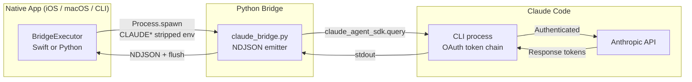

Thirty hours of debugging across four different approaches. One bridge file that survived.

The repo for this post, `claude-sdk-bridge`, is not a new invention. It is the bones of Day 09's iOS bridge extracted, renamed, and pointed at a broader audience: anyone calling Claude Code from any native app, not just iOS.

Every time I wired Claude Code into a non-terminal surface (iOS, Vapor server, Python service, Node tooling), I hit the same four walls. In the same order. Each failure lost a day. The working bridge fits in eight lines of Python plus a Swift executor.

This post maps the four walls so you can skip them.

## Why there isn't a drop-in SDK

Three facts every developer discovers the hard way:

1. **Claude Code uses OAuth, not `ANTHROPIC_API_KEY`.** The CLI owns the token, refreshes it, and never exposes it. Importing the official Python or JavaScript SDK directly hits an authentication wall.
2. **Claude Code's child-process nesting detection.** Launching `claude` from inside a parent Claude Code session trips `CLAUDECODE=1` detection. The child exits silently to prevent recursive agent loops.
3. **Runtime concurrency mismatch.** The Swift SDK expects `RunLoop`. Vapor runs on SwiftNIO's `EventLoop`. They share a process and never share a thread.

The "SDK" you want for an iOS app calling Claude Code is actually a four-layer workaround stacked on top of the CLI, because the CLI is the only thing Anthropic supports as an OAuth-authenticated entry point. The bridge exists because you cannot remove any of those layers.

## Failure 1: direct API calls

The first attempt every developer makes:

```python
# failed-attempts/01-direct-api/attempt.py
client = anthropic.Anthropic()
with client.messages.stream(
    model="claude-sonnet-4-20250514",
    max_tokens=4096,
    messages=[{"role": "user", "content": prompt}],
) as stream:
    for text in stream.text_stream:
        print(text, end="", flush=True)
```

```
anthropic.AuthenticationError: No API key provided.
```

Claude Code authenticates through OAuth tokens stored in `~/.claude/`. There is no `ANTHROPIC_API_KEY`. The CLI is the gatekeeper.

You could ask users to mint a separate API key. That defeats the purpose of building a Claude Code client — users would pay twice, lose access to Skills and MCP servers, and lose project context from `CLAUDE.md`. The whole point is to extend Claude Code to a native surface, not to build a separate product against the same model.

**Root cause:** authentication boundary. No consumer-side fix exists. Flow through the CLI's auth chain, or do not ship.

**Time lost:** 4 hours. The cheapest failure on the list — the error message tells you exactly what is wrong.

## Failure 2: framework-native SDK in the wrong event loop

Attempt 2 nearly broke me. Anthropic ships a Swift SDK (`ClaudeCodeSDK`) that wraps the CLI and exposes a Combine `PassthroughSubject`. Same language as the Vapor backend. Same ecosystem. Should be clean.

```swift
// failed-attempts/02-claude-code-sdk/attempt.swift
func attemptClaudeCodeSDK(req: Request) async throws -> Response {
    let claude = ClaudeCodeProcess()
    claude.arguments = ["-p", "--output-format", "stream-json"]

    let stream = claude.stream(prompt: "Say hello")

    var response = ""
    for try await chunk in stream {
        response += chunk  // Never reached
    }
    return Response(status: .ok, body: .init(string: response))
}
```

The `for try await` never yielded. No error. No timeout. Silence.

Two days of binary search through Combine internals pointed at one cause: the SDK uses `FileHandle.readabilityHandler`, which dispatches via `RunLoop`. Vapor runs on SwiftNIO `EventLoop` threads, which never pump `RunLoop`. The publisher sent. The subscriber never received. The data entered one paradigm and disappeared into the scheduling gap between the two.

Three workarounds, all failed:

- **Manual RunLoop pump on a background thread:** deadlock between NIO and RunLoop threads.
- **DispatchQueue.main.async wrapping:** Vapor's main queue is itself a NIO event loop. The main RunLoop is never pumped on a server.
- **Dedicated RunLoop thread:** non-deterministic event ordering. ~60% of events arrived. 40% did not.

**Root cause:** architectural incompatibility. The SDK was designed for UIKit apps where `RunLoop` is always available. It does not document this assumption. The failure mode is silence, which is the worst class of bug you can debug.

**Time lost:** 14 hours. The silence was the hardest part.

## Failure 3: different language, same wall

If Swift's paradigm mismatch was the problem, maybe the JavaScript SDK is the answer.

```javascript
// failed-attempts/03-js-sdk/attempt.js
const client = new Anthropic();
const stream = await client.messages.stream({
    model: "claude-sonnet-4-20250514",
    max_tokens: 4096,
    messages: [{ role: "user", content: prompt }],
});
```

Same error. Different language.

```
Error: 401 {"type":"error","error":{"type":"authentication_error",
"message":"invalid x-api-key"}}
```

The JS SDK hits the same OAuth wall as Attempt 1. Authentication is a model-level constraint, not a language-level one.

There is a secondary path through `@anthropic-ai/claude-agent-sdk`, which wraps the CLI from Node the way the Python Agent SDK wraps it from Python. But it inherits the parent environment (including `CLAUDECODE=1`, the Attempt 4 bug), and it adds a Node runtime to your stack for no capability gain. If your backend is Swift, adding Node means managing `node_modules`, dependency surface, and a second subprocess interface for zero new capability.

**Root cause:** pattern-recognition failure. I should have seen the OAuth boundary from Attempt 1 and asked "does this SDK authenticate differently?" before writing a line of code. The answer is no, across all language SDKs, because authentication is a property of the Claude Code CLI, not of the client language.

**Time lost:** 2 hours. Should have been 0.

## Failure 4: environment inheritance

Attempt 4 got tantalizingly close. Bypass all SDKs. Spawn the Claude CLI directly from Swift as a `Process`, read stdout via GCD. No `RunLoop` dependency. No Combine. Pure subprocess I/O.

It worked perfectly from a terminal. It failed silently inside an active Claude Code session.

```swift
// failed-attempts/04-cli-subprocess/attempt.swift
let process = Process()
process.executableURL = URL(fileURLWithPath: "/usr/local/bin/claude")
process.arguments = ["-p", prompt, "--output-format", "stream-json"]

// BUG: This inherits ALL environment variables from the parent process,
// including CLAUDECODE=1 and CLAUDE_CODE_* if running inside Claude Code.
// The child Claude CLI detects these and silently refuses to execute.

try process.run()
process.waitUntilExit()
```

Zero-byte response. No stderr. No error. Just an empty NDJSON stream.

Ten hours to trace it. The breakthrough came when I finally logged `ProcessInfo.processInfo.environment.forEach { print("\($0.key)=\($0.value)") }` inside the route handler. The output included `CLAUDECODE=1` and a dozen `CLAUDE_CODE_*` variables inherited from the parent session.

The Claude CLI uses those for nesting detection. See the variables → assume nested invocation → exit silently to prevent infinite recursion. Reasonable design from the CLI's perspective. Brutal to debug.

**Fix:** three lines.

```swift
var env = ProcessInfo.processInfo.environment
env.removeValue(forKey: "CLAUDECODE")
for key in env.keys where key.hasPrefix("CLAUDE_CODE_") {
    env.removeValue(forKey: key)
}
process.environment = env
```

**Root cause:** environment variable inheritance. Every subprocess inherits the parent's full environment. If the parent sets flags the child checks, you have a context-contamination bug that only surfaces inside specific runtime environments.

**Time lost:** 10 hours.

## The bridge that survived

The working bridge is a single Python file plus a Swift executor. It handles all four failure modes — OAuth via CLI, no runtime mismatch, CLAUDECODE nesting detection via env strip, and an ordered process lifecycle to avoid the `NSInvalidArgumentException` race.



The Python bridge is eight lines of glue around the official `claude-agent-sdk` package:

```python
# working-bridge/claude_bridge.py
import json, sys, asyncio
from claude_agent_sdk import query

async def main(config):
    async for message in query(prompt=config["prompt"], options=config.get("options", {})):
        line = json.dumps(message, separators=(",", ":"))
        sys.stdout.write(line + "\n")
        sys.stdout.flush()  # Critical: line-buffered output

if __name__ == "__main__":
    asyncio.run(main(json.loads(sys.argv[1])))
```

The Swift executor strips the environment, spawns the bridge, and reads NDJSON:

```swift
// working-bridge/executor.swift
var env = ProcessInfo.processInfo.environment
for key in env.keys where key.hasPrefix("CLAUDE") {
    env.removeValue(forKey: key)
}

let process = Process()
process.executableURL = URL(fileURLWithPath: "/usr/bin/env")
process.arguments = ["python3", bridgePath, configJSON]
process.environment = env

let stdoutPipe = Pipe()
process.standardOutput = stdoutPipe

try process.run()

// Drain pipe on dedicated queue, THEN wait for exit, THEN read status
let handle = stdoutPipe.fileHandleForReading
while true {
    let chunk = handle.availableData
    if chunk.isEmpty { break }
    // parse NDJSON line...
}
process.waitUntilExit()
let status = process.terminationStatus
```

The ordering — drain pipe, then wait for exit, then read status — is the non-negotiable invariant. Reading termination status early crashes with `NSInvalidArgumentException`. Waiting for exit before draining a >64KB buffer deadlocks.

## Four rules, two failure classes

Every integration failure across all four attempts falls into one of two classes:

**Authentication boundary failures.** Attempts 1 and 3. The tool owns the tokens. Consumer-side fixes do not exist. You flow through the tool's auth chain or you do not ship.

**Runtime composition failures.** Attempts 2 and 4. Two correct runtimes compose into an incorrect system. RunLoop plus NIO. Parent environment plus child process. The failure mode is always silence, because no single component broke.

From that diagnosis, four rules for any polyglot Claude Code integration:

1. **Flow through the CLI.** Not around it. The CLI owns OAuth; the bridge wraps the CLI.
2. **Strip CLAUDE* environment variables.** Every subprocess, every time. Belt and suspenders: strip in the shell AND the Process API.
3. **Avoid RunLoop-dependent frameworks on the server.** Combine, Foundation's `FileHandle.readabilityHandler`, anything that assumes a pumped RunLoop. Use GCD or actor-bound reads.
4. **Drain pipes before waiting for exit.** Always. The deadlock is silent and intermittent, which makes it the hardest class of bug to catch in development.

## What this bridge is and is not

Honest labels:

- **It is:** a reference implementation of the CLI-wrapping pattern that survived four architectures. Eight Python lines. A Swift executor. Four documented failure cases in `failed-attempts/` with real code that actually fails the way described.
- **It is not:** a shipping SDK with a stable API, a support contract, or a guarantee against future CLI changes. If Anthropic ships a first-party iOS SDK, switch to it. If the CLI's nesting detection moves to a different variable name, this breaks.
- **Mode-bet:** SDK. The bridge is code that steers the agent. Skills and hooks steer via environment shaping; this bridge steers via a typed programmatic boundary.

One warmth beat, paired with its limitation: the reason I like this repo is the `failed-attempts/` directory. Every failure has real code that actually produces the documented error. You can clone the repo, run each file, see the failure with your own eyes, and then run the working bridge and see it work. The limitation: those failed attempts only compile against specific SDK versions. When Claude Code ships a new CLI, one or more of the attempts will start failing differently, and I will not always catch the drift in time. Treat the repo as a snapshot, not a living spec.

## Running it

```bash
git clone https://github.com/krzemienski/claude-sdk-bridge
cd claude-sdk-bridge/working-bridge
pip install -e .

# Direct invocation
claude-bridge '{"prompt": "Hello!", "options": {}}'

# From Swift
let executor = BridgeExecutor(bridgePath: "/path/to/bridge.py")
for try await event in executor.execute(prompt: "What is 2+2?") {
    print(event)
}
```

## Where this goes

Day 13 picks up `ClaudeCodeSDK` — the same bridge pattern extracted as a reusable TypeScript package, with a clearer integration story for Node/web backends that are not trying to run Swift.

Day 14 covers the Claude Prompt Stack, which sits on top of this bridge and adds the seven defense-in-depth layers that enforce behavior once the bridge is authenticated.

The bridge is the boring part. The interesting products are what you put through it.

Repo: `github.com/krzemienski/claude-sdk-bridge`. License: MIT. Python 3.10+, Swift 5.10+.

Four failure modes. One bridge. Eight lines of Python.

{/* voice-self-check: em-dashes=6 (2.6/1k), banlist-hits=0, opener-formula=pass (specific detail "thirty hours across four approaches" → one-sentence paragraph → failure before success) */}
