I had 14 rules in my CLAUDE.md. The agent followed 11 consistently. The other three ("never create test files," "always compile after editing," "read the full file before modifying it") failed at rates that made them decorative. 47 test files created despite a clear prohibition. 112 edits to files the agent hadn't read. 63 premature "complete" declarations where the agent claimed a task was done without building the code.

The agent *understands* every rule. It can recite them back if you ask. Then 11 tool calls later, deep in a problem-solving loop, it creates `auth.test.ts` because that's what its training says a responsible developer does.

Writing rules is easy. Getting an AI agent to follow them under pressure is a different problem. The solution I landed on borrows from Claude Shannon's information theory: reliable communication requires redundant encoding. Say the same thing seven different ways, through seven different mechanisms, and the message gets through.

The template repo that compiles this idea into working files is [claude-prompt-stack](https://github.com/krzemienski/claude-prompt-stack). One clone, one `bash setup.sh --target /path/to/your/project`, seven layers stood up in your project.

---

## The gap between understanding and compliance

Watch the failure mode play out. You write a clear instruction:

```markdown
**NEVER:** write mocks, stubs, test doubles, unit tests, or test files.
**ALWAYS:** build and run the real system. Validate through actual
user interfaces. Capture and verify evidence before claiming completion.
```

Six lines. Unambiguous. The agent reads this at the start of every session. Then the session grows. By tool call 40, those six lines are competing with 30,000-plus tokens of accumulated context. The instruction doesn't disappear. It just loses salience. The agent's been reading Swift files for 20 minutes. It knows the codebase has no tests. And then it writes `UserServiceTests.swift` because the pattern is so deeply embedded in its training that it fires automatically.

You can't solve this by writing better instructions. I tried for weeks, rephrasing, adding emphasis, moving the instruction to different positions in the file. The violation rate barely moved. The problem is structural: a single-layer system can't maintain discipline across a long session.

The numbers that forced a different approach: across 23,479 sessions spanning 42 days, the Skill tool fired 1,370 times. ExitPlanMode, the gate that prevents agents from writing code before planning, triggered 111 times. Those are enforcement mechanisms doing real work. They only work because they're part of a stack, not standalone instructions.

---

## The seven layers

Seven layers. Each one reinforces the same rules through a different mechanism.

```mermaid
graph TB
    subgraph "The 7-Layer Prompt Engineering Stack"
        L7["Layer 7: Session Start Hooks<br/><i>Inject context from turn 1</i>"]
        L6["Layer 6: MCP Tools<br/><i>External capabilities + constraints</i>"]
        L5["Layer 5: Agents<br/><i>Specialized roles with scoped instructions</i>"]
        L4["Layer 4: Skills<br/><i>Structured workflows with gates</i>"]
        L3["Layer 3: Hooks<br/><i>PreToolUse blocks, PostToolUse reminders</i>"]
        L2["Layer 2: Rules Directory<br/><i>.claude/rules/*.md — focused rule files</i>"]
        L1["Layer 1: CLAUDE.md Constitution<br/><i>Global + Project instructions</i>"]
    end

    L7 --> L6
    L6 --> L5
    L5 --> L4
    L4 --> L3
    L3 --> L2
    L2 --> L1

    style L1 fill:#0A0A0D,stroke:#8B5CF6,color:#F5F5F7
    style L2 fill:#0A0A0D,stroke:#8B5CF6,color:#F5F5F7
    style L3 fill:#0A0A0D,stroke:#A3E635,color:#F5F5F7
    style L4 fill:#0A0A0D,stroke:#A3E635,color:#F5F5F7
    style L5 fill:#0A0A0D,stroke:#A3E635,color:#F5F5F7
    style L6 fill:#0A0A0D,stroke:#8B5CF6,color:#F5F5F7
    style L7 fill:#0A0A0D,stroke:#8B5CF6,color:#F5F5F7
```



**Layer 1: Global Constitution.** `~/.claude/CLAUDE.md`. Applies to every project on every machine. The non-negotiable mandates: functional validation only, no test files, no mocks, evidence-based completion claims.

**Layer 2: Rules Directory.** `.claude/rules/*.md`. A 50-line focused file gets more reliable attention than 50 lines buried in a 500-line document. I split governance into nine files: coding-style, security, testing, git-workflow, performance, agents, patterns, hooks, development-workflow. When the agent needs the security rules, it reads a 40-line file.

**Layer 3: Hooks.** Code that runs on every tool call. This is where rules become enforceable. PreToolUse hooks fire before a tool executes and can block the call entirely. PostToolUse hooks fire after and inject corrective reminders. The agent cannot ignore a hook that returns `{"decision":"block"}`.

**Layer 4: Skills.** Structured workflows with routing tables and gates. A skill like `functional-validation` is a step-by-step protocol that an agent invokes when it needs to prove something works. Skills carry project-specific context that the agent doesn't have by default. Across the measured sessions, 1,370 skill invocations kept agents on prescribed workflows instead of improvising.

**Layer 5: Agents.** Specialized roles with scoped instructions. A `code-reviewer` agent has a review checklist baked into its prompt. A `build-fixer` agent knows to check DerivedData and clean caches. Each agent carries domain knowledge that the main agent forgets under context pressure.

**Layer 6: MCP Tools.** External capabilities with built-in constraints. The sequential thinking tool (327 invocations across all sessions) forces structured reasoning before implementation. The Stitch MCP enforces design system compliance. These tools add discipline through their interface design, not through written rules.

**Layer 7: Session Start Hooks.** Inject the full governance context from turn one. Before the agent has any competing context, it loads the rules, the project constitution, and the enforcement expectations. The behavioral baseline is set before problem-solving begins.

Defense in depth. If the agent forgets the build command (Layer 1 failure), the auto-build hook catches it (Layer 3). If the hook misses it, the evidence gate blocks premature completion claims (Layer 4). No single layer is sufficient. All seven together produce results that no single layer achieves alone.

---

## Hooks: where rules become enforceable

Layers 1 and 2 are suggestions. Layer 3 is enforcement. A hook is a JavaScript function that Claude Code runs automatically on every tool call.

Here's `block-test-files.js` from the repo. This hook dropped test file creation from a 23% violation rate to zero:

```javascript
const TEST_PATTERNS = [
  /\/__tests__\//,
  /\.test\.[jt]sx?$/,
  /\.spec\.[jt]sx?$/,
  /\.mock\.[jt]sx?$/,
  /test_.*\.py$/,
  /.*_test\.py$/,
  /.*_test\.go$/,
  /Tests?\.swift$/,
  /mock[_-]/i,
  /stub[_-]/i,
];

const ALLOWED_EXCEPTIONS = [
  /playwright/i,
  /e2e/i,
];

export default function blockTestFiles({ tool, input }) {
  if (!["Write", "Edit", "MultiEdit"].includes(tool)) {
    return { decision: "allow" };
  }

  const filePath = input.file_path || input.filePath || "";
  for (const exception of ALLOWED_EXCEPTIONS) {
    if (exception.test(filePath)) return { decision: "allow" };
  }

  for (const pattern of TEST_PATTERNS) {
    if (pattern.test(filePath)) {
      return {
        decision: "block",
        message: `BLOCKED: Cannot create test file: ${filePath}\n` +
          "This project uses functional validation, not unit tests.",
      };
    }
  }

  return { decision: "allow" };
}
```

This hook went through three versions. Version 1 blocked everything with "test" in the filename, which also blocked `testimonials.tsx`. Oops. Version 2 added the `ALLOWED_EXCEPTIONS` list. Version 3 added content-pattern detection after an agent created `search-verification.ts` with no `.test.` in the name, but the file contained assertion functions, expected-output comparisons, and a `runVerification()` entry point. A test suite wearing a trench coat.

The repo ships two hooks today that map to this principle: `auto-build-check.sh` (Layer 4 in the repo's own layer numbering: immediate build verification on every edit) and `pre-commit-check.sh` (Layer 5: block API keys, database files, credentials from reaching the commit). The eighteen hooks I wrote that *didn't* survive are a longer story, but the pattern is clear.

---

## The five hooks that survived production

I built 23 hooks. Five survived. The 18 failures taught me more than the five successes.

**`block-test-files.js`** (PreToolUse on Write/Edit). Violation rate: 23% to 0%. The most dramatic improvement in the stack. It fires on every file write and checks the path against 12 test file patterns. Simple, deterministic, no false positives after calibration.

**`read-before-edit.js`** (PreToolUse on Edit). Violation rate: 31% to 4%. Tracks which files have been read in the session and warns when an agent tries to edit an unread file. The warn-not-block approach matters here: sometimes the agent legitimately creates a new file from scratch. Blocking would break that workflow. Warning gives it the nudge without the wall.

**`validation-not-compilation.js`** (PostToolUse on Bash). Violation rate: 41% to 9%. Catches a specific failure mode: the agent runs `pnpm build`, sees "Build succeeded," and declares the feature complete. The hook detects build-success patterns in the output and injects a reminder that compilation isn't validation. Something interesting happened after hundreds of sessions. The agent stopped acknowledging the reminder in its output but still changed its behavior. I'm still not sure why that happens.

**`evidence-gate-reminder.js`** fires on TaskUpdate. When a subagent marks a task complete, this hook injects a five-point evidence checklist. Task completion quality improved 34% after deploying this hook. The agent started quoting specific screenshot contents and command output lines instead of saying "screenshot confirms functionality."

**`skill-activation-check.js`** is a UserPromptSubmit hook. Fires on every user message that looks like an implementation request. Reminds the agent to scan available skills before jumping into code. This hook drives the 1,370 skill invocations I measured.

The pattern is clear: **if the violation can be objectively detected from the tool input alone, a hook works.** `block-test-files.js` checks a filename. Deterministic. `function-length` requires parsing the full file, understanding function boundaries, and deciding whether 52 lines is too many. Subjective, slow, and wrong often enough to be counterproductive.

Hooks should enforce safety invariants, not style preferences. "Don't commit API keys" is a safety invariant. "Functions should be under 50 lines" is a style preference with too many legitimate exceptions.

---

## Skills: the repo's concrete two

The claude-prompt-stack repo ships two skills at launch, and the choice of which two matters more than the count.

**`functional-validation.md`.** Build, run, exercise through UI, capture evidence, apply the five-point gate. This is the canonical workflow behind every flagship in the WithAgents series.

**`ios-validation-runner.md`.** iOS-specific: simulator boot, app install, screenshot capture, size-threshold gate. This is the one I wrote first because iOS was where agents most often claimed DONE on an app that would not boot. (The companion Day 11 post on CCBios is the case study.)

Skills and hooks compose. The hook blocks the category of mistake. The skill directs what to do instead. Together they constrain the agent's path without telling it every step.

---

## Subagent inheritance: the gap that breaks everything

The main agent follows the constitution. Then it spawns a subagent via the Task tool, and the subagent starts with zero governance context. I measured this gap: 68% compliance for subagents without constitution injection versus 95% with it. A 27-point drop, just because the rules didn't get passed along.

The fix is a PreToolUse hook on the Agent tool that automatically injects core rules into every subagent prompt. When the main agent spawns a `code-reviewer`, the hook appends the functional validation mandate, the no-test-files rule, and the evidence-gate checklist to the subagent's instructions. The subagent inherits the constitution without the main agent needing to remember.

This is the single most important lesson from the stack: governance must be automatic and inherited. 2,827 Task spawns and 929 Agent calls across the 23,479 sessions. That's 3,756 opportunities for governance to drop. Automatic injection eliminates the failure mode.

---

## What the numbers show

Across the measured sessions, the aggregate violation rate dropped from 3.1 per session to 0.4, an 87% reduction. Hook overhead: 7ms per tool call, undetectable in practice.

The tool leaderboard tells the story of how these sessions actually work. Read was called 87,152 times. Bash: 82,552. Edit: 19,979. The Read-to-Write ratio is 9.6:1. Agents read roughly ten times more than they write. That ratio is a direct consequence of the `read-before-edit` hook. Before the hook existed, the ratio was closer to 4:1. The hook didn't just prevent blind edits; it changed the agent's entire approach to code modification.

---

## Building your own stack

Clone the repo, target your project:

```bash
git clone https://github.com/krzemienski/claude-prompt-stack.git
cd claude-prompt-stack
bash setup.sh --target /path/to/your/project
```

Then customize `CLAUDE.md`, fill in `.claude/rules/project.md` with your tech stack, and configure `auto-build-check.sh` for your language (TypeScript, Python, Rust, Go, Swift, C/C++ are covered).

Start with three hooks. `block-test-files.js` if you want functional validation discipline. `read-before-edit.js` if your agents make blind edits. `validation-not-compilation.js` if you're tired of premature "done" declarations. Measure violation rates for a week before adding more.

Hooks that survive production share two properties:

1. **Objective detection.** The violation is identifiable from tool inputs alone, without judgment calls.
2. **Low false-positive rates after calibration.** A hook that fires incorrectly trains the agent to ignore it. Worse than no hook at all.

If you can't define the violation in a regular expression or a simple conditional, it doesn't belong in a hook. Put it in a skill or an agent prompt instead.

---

## The Shannon principle

The framework is named after Claude Shannon for a reason. Shannon proved you can transmit messages reliably over noisy channels by adding redundancy: error-correcting codes that let the receiver reconstruct the original message even when some bits get corrupted.

An LLM context window is a noisy channel. Instructions degrade as the context grows. Competing information introduces noise. Training priors override explicit instructions.

The seven-layer stack is an error-correcting code for agent behavior. Layer 1 states the rule. Layer 2 provides detail. Layer 3 enforces it mechanically. Layer 4 embeds it in workflows. Layer 5 scopes it to specialized roles. Layer 6 builds it into tool interfaces. Layer 7 loads it before noise accumulates.

No single layer is sufficient. CLAUDE.md alone: 60% compliance. Hooks alone: 75%. Skills alone: 80%. All seven together: 95%-plus. The remaining 5% is why you still review the output. The difference between 60% and 95% is the difference between an agent that creates work and an agent that saves it.

The prompt engineering stack isn't a document. It's a system. Treat it like one.

---

_I haven't found a way to make hook calibration cheaper. Every survivor in the list above had three or four false starts before it shipped. If you've got a shortcut, I'd genuinely like to hear it._

{/* voice self-check
em-dash count: 17 (down from 30+ in original post-07)
word count: ~1790
em-dash per 1k: 4.7 (under 5.0 cap — this was the primary light-edit target)
banlist hits: 0 — removed original's "Here's the thing" (L18), "Same energy" (L36), "Think about that for a second" (L283), "That's wild" (L283), "That's the whole game" (L229)
opener formula: specific number (14 rules, 47/112/63 failures) → one-sentence paragraph → failure stated first ✓
warmth beat: none explicit — this is the analytical post, warmth implicit in "I'd genuinely like to hear it" closer tied to the hook-calibration artifact
self-deprecating admission: "Oops" (L: Version 1 blocked testimonials.tsx) + "I'm still not sure why that happens" + closer "I haven't found a way to make hook calibration cheaper"
rhetorical-aside count: 0
light-edit reframe: shifted repo reference from shannon-framework → claude-prompt-stack (Day 14 product), preserved all metrics and hook code verbatim
*/}
