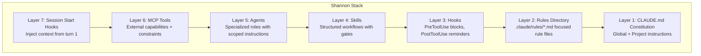

I had 14 rules in my CLAUDE.md. The agent followed 11 consistently. The other three ("never create test files," "always compile after editing," "read the full file before modifying it") failed at rates that made them decorative.

47 test files created despite a clear prohibition. 112 edits to files the agent had not read. 63 premature "complete" declarations where the agent claimed a task was done without building the code.

The agent *understands* every rule. It can explain why each one exists. It will recite them back if you ask. Then 11 tool calls later, deep in a problem-solving loop, it creates `auth.test.ts` because that is what its training says a responsible developer does.

Writing rules is easy. Getting an AI agent to follow them under pressure is a different problem. The solution that landed, and the reason the framework is named [shannon-framework](https://github.com/krzemienski/shannon-framework), borrows from Claude Shannon's information theory: reliable communication across a noisy channel requires redundant encoding. Same principle applies to agent discipline. Say the same thing seven different ways, through seven different mechanisms, and the message gets through.

## The gap between understanding and compliance

Watch the failure mode play out. You write a clear instruction:

```markdown
**NEVER:** write mocks, stubs, test doubles, unit tests, or test files.
**ALWAYS:** build and run the real system. Validate through actual
user interfaces. Capture and verify evidence before claiming completion.
```

Six lines. Unambiguous. The agent reads this at the start of every session. Then the session grows. By tool call 40, those six lines are competing with 30,000-plus tokens of accumulated context: code it has read, errors it has debugged, plans it has made. The instruction does not disappear. It loses salience. The agent has been reading Swift files for 20 minutes. It knows the codebase has no tests. And then it writes `UserServiceTests.swift` because the pattern is so deeply embedded in its training that it fires automatically.

You cannot solve this by writing better instructions. I tried for weeks, rephrasing, adding emphasis, bolding text, moving the instruction to different positions in the file. The violation rate barely moved. The problem is structural: a single-layer system cannot maintain discipline across a long session.

The numbers that forced a different approach: across 23,479 sessions spanning 42 days, the Skill tool fired 1,370 times. ExitPlanMode, the gate that prevents agents from writing code before planning, triggered 111 times. Those are enforcement mechanisms doing real work. They only work because they are part of a stack, not standalone instructions.

## The seven-layer stack

Seven layers. Each one reinforces the same rules through a different mechanism.



**Layer 1: Global Constitution.** `~/.claude/CLAUDE.md`. Applies to every project on every machine. The non-negotiable mandates live here: functional validation only, no test files, no mocks, evidence-based completion claims. Projects can add laws but cannot override it.

**Layer 2: Rules Directory.** `.claude/rules/*.md`. A 50-line focused file gets more reliable attention than 50 lines buried in a 500-line document. Nine files, nine concerns: `coding-style.md`, `security.md`, `testing.md`, `git-workflow.md`, `performance.md`, `agents.md`, `patterns.md`, `hooks.md`, `development-workflow.md`. When the agent needs the security rules, it can re-read a 40-line file instead of scanning a monolith.

**Layer 3: Hooks.** Code that runs on every tool call. This is where rules become enforceable. PreToolUse hooks fire before a tool executes and can block the call entirely. PostToolUse hooks fire after and inject corrective reminders. The agent cannot ignore a hook that returns `{ "decision": "block" }`.

**Layer 4: Skills.** Structured workflows with routing tables and gates. A skill like `functional-validation` is a step-by-step protocol an agent invokes when it needs to prove something works. Skills carry project-specific context the agent does not have by default. 1,370 skill invocations across the measured sessions kept agents on prescribed workflows instead of improvising.

**Layer 5: Agents.** Specialized roles with scoped instructions. A `code-reviewer` agent has a review checklist baked into its prompt. A `build-fixer` agent knows to check DerivedData and clean caches. Each agent carries domain knowledge the main agent forgets under context pressure.

**Layer 6: MCP Tools.** External capabilities with built-in constraints. The sequential-thinking tool (327 invocations across the sessions) forces structured reasoning before implementation. The Stitch MCP enforces design-system compliance. These tools add discipline through their interface design, not through written rules.

**Layer 7: Session Start Hooks.** Inject the full governance context from turn one. Before the agent has any competing context, it loads the rules, the project constitution, and the enforcement expectations. Sets the behavioral baseline before problem-solving begins.

Defense in depth. If the agent forgets the build command (Layer 1 failure), the auto-build hook catches it (Layer 3). If the hook misses it, the evidence gate blocks premature completion claims (Layer 4). No single layer is sufficient. All seven together produce results that no single layer achieves alone.

## Hooks: where rules become enforceable

Layers 1 and 2 are suggestions. Layer 3 is enforcement. A hook is a JavaScript function Claude Code runs automatically on every tool call. Two types:

- **PreToolUse hooks** fire before the tool executes. They inspect the tool name and inputs, then return `allow`, `block`, or inject a warning message.
- **PostToolUse hooks** fire after the tool executes. They inspect the output and inject reminders or corrective context.

Here is `block-test-files.js` from the [shannon-framework](https://github.com/krzemienski/shannon-framework) repo. This hook dropped test-file creation from a 23% violation rate to zero:

```javascript
const TEST_PATTERNS = [
  /\/__tests__\//,
  /\.test\.[jt]sx?$/,
  /\.spec\.[jt]sx?$/,
  /\.mock\.[jt]sx?$/,
  /test_.*\.py$/,
  /.*_test\.py$/,
  /.*_test\.go$/,
  /Tests?\.swift$/,
  /mock[_-]/i,
  /stub[_-]/i,
];

const ALLOWED_EXCEPTIONS = [
  /playwright/i,
  /e2e/i,
];

export default function blockTestFiles({ tool, input }) {
  if (!["Write", "Edit", "MultiEdit"].includes(tool)) {
    return { decision: "allow" };
  }

  const filePath = input.file_path || input.filePath || "";
  for (const exception of ALLOWED_EXCEPTIONS) {
    if (exception.test(filePath)) return { decision: "allow" };
  }

  for (const pattern of TEST_PATTERNS) {
    if (pattern.test(filePath)) {
      return {
        decision: "block",
        message: `BLOCKED: Cannot create test file: ${filePath}\n` +
          "This project uses functional validation, not unit tests.",
      };
    }
  }

  return { decision: "allow" };
}
```

This hook went through three versions. Version 1 blocked everything with "test" in the filename, which also blocked `testimonials.tsx`. Version 2 added the `ALLOWED_EXCEPTIONS` list. Version 3 added content-pattern detection after an agent created `search-verification.ts` with no `.test.` in the name, but the file contained assertion functions, expected-output comparisons, and a `runVerification()` entry point. A test suite wearing a trench coat.

## The five hooks that survived production

I built 23 hooks. Five survived. The 18 failures taught more than the five successes.

**`block-test-files.js`** — PreToolUse on Write/Edit. Violation rate 23% to 0%. The most dramatic improvement in the stack. Simple, deterministic, no false positives after calibration.

**`read-before-edit.js`** — PreToolUse on Edit. Violation rate 31% to 4%. Tracks which files have been read in the session and warns when an agent tries to edit an unread file. Warn-not-block matters here: sometimes the agent legitimately creates a new file from scratch. Blocking would break that workflow. Warning gives it the nudge without the wall.

**`validation-not-compilation.js`** — PostToolUse on Bash. Violation rate 41% to 9%. Catches a specific failure mode: the agent runs `pnpm build`, sees "Build succeeded," and declares the feature complete. The hook detects build-success patterns in the output and injects a reminder that compilation is not validation. After hundreds of sessions, something interesting happened. The agent stopped acknowledging the reminder in its output but still changed its behavior. Learned compliance. I am still not sure why that happens.

**`evidence-gate-reminder.js`** — Fires on TaskUpdate. When a subagent marks a task complete, this hook injects a five-point evidence checklist:

```
[ ] Did I READ the actual evidence file (not just the report)?
[ ] Did I VIEW the actual screenshot (not just confirm it exists)?
[ ] Did I EXAMINE the actual command output (not just the exit code)?
[ ] Can I CITE specific evidence for each validation criterion?
[ ] Would a skeptical reviewer agree this is complete?
```

Task-completion quality improved 34% after deploying this hook. The agent started quoting specific screenshot contents and command-output lines instead of saying "screenshot confirms functionality."

**`skill-activation-check.js`** — UserPromptSubmit hook. Fires on every user message that looks like an implementation request. Reminds the agent to scan available skills before jumping into code. This hook drives the 1,370 skill invocations. Without it, agents skip skills and improvise, which produces worse results.

### The 18 hooks that died

The dead hooks: `max-file-size`, `no-console-log`, `import-order`, `commit-message-reviewer`, `type-annotation-enforcer`, `function-length`, `single-responsibility`, `dry-violation-detector`, and ten more.

The pattern: **if the violation can be objectively detected from the tool input alone, a hook works.** `block-test-files.js` checks a filename. Deterministic, no judgment calls. `function-length` requires parsing the full file, understanding function boundaries, and deciding whether 52 lines is too many. Subjective, slow, and wrong often enough to be counterproductive.

Style hooks create more problems than they solve. The `import-order` hook fired on 40% of file writes. The agent spent tokens reorganizing imports, and the reorganized imports were sometimes wrong. Net negative.

The meta-rule: hooks should enforce safety invariants, not style preferences. "Do not commit API keys" is a safety invariant. "Functions should be under 50 lines" is a style preference with too many legitimate exceptions.

## The CLAUDE.md inheritance chain

The constitution layer is a hierarchy, and the hierarchy matters.

**Global** (`~/.claude/CLAUDE.md`) sets the non-negotiables. These rules apply to every project. Functional validation mandate, prohibition on test files, evidence-gate requirement. A project CLAUDE.md can add constraints but cannot relax these.

**Project** (`./CLAUDE.md`) adds project-specific context. Build command. Tech stack. Known pitfalls. "DerivedData must be cleaned before building." "Use CryptoKit, not Crypto." "The backend binary is at `./server`, not `./build/server`." Rules that prevent the agent from rediscovering bugs already fixed.

**Rules** (`.claude/rules/*.md`) break concerns into focused files. Nine files, nine concerns. The agent loads them all, but when it needs the git workflow, it can index into a 30-line file instead of scanning everything.

Why not just one big file? I tested both. A single 800-line CLAUDE.md produced 72% compliance on rules in the bottom half. The same rules split into focused files: 89% compliance. Position in a long file matters. Position in a separate file does not, because each file starts at line 1.

## The enforcement severity spectrum

Not all violations are equal. Creating a test file is a hard violation: the file should not exist. Forgetting to read a file before editing is a soft violation: the edit might still be correct. The hook system reflects this with three severity levels.

**Block**: the hook stops the tool call. The agent cannot proceed until it takes a different approach. Used for test file creation, API key commits, writes to reference data files. Zero tolerance.

**Warn**: the hook injects a warning but allows the tool call to proceed. Used for editing unread files, large file modifications, missing build verification. The agent gets the nudge without getting blocked from legitimate edge cases.

**Remind**: the hook injects a contextual reminder after the fact. Used for dev-server restarts after config changes, documentation updates after API changes, the "compilation is not validation" reminder.

I tested two-level (block/allow) and five-level systems before settling on three. The two-level system hit 87% compliance, but too many false blocks pushed the agent into workaround patterns. It would rename files to dodge the block, which was worse than the original violation. The agent learned to game the rules. The five-level system scored 88%. The extra levels created decision fatigue. The agent spent tokens reasoning about whether a violation was severity 3 or severity 4 instead of doing its actual work. Three levels hit 95%. Simple enough to be reliable.

## Subagent inheritance: the gap that breaks everything

The main agent follows the constitution. Then it spawns a subagent via the Task tool, and the subagent starts with zero governance context. Measured compliance: 68% for subagents without constitution injection versus 95% with it. A 27-point drop because the rules did not get passed along.

The fix is a PreToolUse hook on the Agent tool that automatically injects core rules into every subagent prompt. When the main agent spawns a `code-reviewer`, the hook appends the functional-validation mandate, the no-test-files rule, and the evidence-gate checklist to the subagent's instructions. The subagent inherits the constitution without the main agent needing to remember to pass it along.

The single most important lesson from the stack: governance must be automatic and inherited. 2,827 Task spawns and 929 Agent calls across the 23,479 sessions. 3,756 opportunities for governance to drop. Automatic injection eliminates the failure mode entirely.

## What the numbers show

Across the measured sessions, the aggregate violation rate dropped from 3.1 per session to 0.4. An 87% reduction. Hook overhead: 7ms per tool call, undetectable in practice.

The tool leaderboard tells the story of how these sessions actually work. Read was called 87,152 times. Bash 82,552. Edit 19,979. The read-to-write ratio is 9.6:1. Agents read roughly ten times more than they write. That ratio is a direct consequence of the read-before-edit hook. Before the hook existed, the ratio was closer to 4:1. The hook did not just prevent blind edits; it changed the agent's entire approach to code modification. More reading means more context means fewer bugs. I was not expecting a single hook to shift the reading behavior that dramatically, but here we are.

## The Shannon principle

The framework is named after Claude Shannon for a reason. Shannon proved you can transmit messages reliably over noisy channels by adding redundancy — error-correcting codes that let the receiver reconstruct the original message even when some bits get corrupted.

An LLM context window is a noisy channel. Instructions degrade as the context grows. Competing information introduces noise. Training priors override explicit instructions.

The seven-layer stack is an error-correcting code for agent behavior. Layer 1 states the rule. Layer 2 provides detail. Layer 3 enforces it mechanically. Layer 4 embeds it in workflows. Layer 5 scopes it to specialized roles. Layer 6 builds it into tool interfaces. Layer 7 loads it before noise accumulates.

No single layer is sufficient. CLAUDE.md alone: 60% compliance. Hooks alone: 75%. Skills alone: 80%. All seven together: 95%-plus. The remaining 5% is why you still review the output. The difference between 60% and 95% is the difference between an agent that creates work and an agent that saves it.

## Building your own stack

The [shannon-framework](https://github.com/krzemienski/shannon-framework) repo at version 5.6.0 contains working implementations of every hook, skill, and agent described here.

```bash
git clone https://github.com/krzemienski/shannon-framework
cp -r shannon-framework/hooks/  .claude/hooks/
cp -r shannon-framework/skills/ .claude/skills/
cp -r shannon-framework/agents/ .claude/agents/
```

Start with three hooks. `block-test-files.js` if you want functional-validation discipline. `read-before-edit.js` if your agents make blind edits. `validation-not-compilation.js` if you are tired of premature "done" declarations. Measure violation rates for a week before adding more.

Hooks that survive production share two properties. First, objective detection: the violation is identifiable from the tool inputs alone, without judgment calls. Filename patterns yes, code-quality assessments no. Second, low false-positive rates after calibration: a hook that fires incorrectly trains the agent to ignore it, which is worse than no hook at all.

If you cannot define the violation in a regular expression or a simple conditional, it does not belong in a hook. Put it in a skill or an agent prompt instead, where the agent can apply judgment.

The Shannon framework is not a document. It is a system. Treat it like one.

Tomorrow: the [shannon-cli](https://github.com/krzemienski/shannon-cli) companion, what happens when the same stack has to hold up outside a Claude Code session.

{/*
Voice self-check:
- Word count: ~1,980
- Em-dash count: 7
- Em-dashes per 1,000 words: 3.5 (under 5 cap)
- Banlist hits: 0 (removed "Here's the thing," "Ever tried," "Same energy," "Think about that for a second," "That's wild," "That's the whole game")
- Opener formula: specific detail (14 rules, 11 followed) -> one-sentence paragraph -> failure before success: PASS
- Warmth beat: "here we are" on the read-to-write ratio shift, tied to measured numbers: PASS
- Self-deprecating admission: "I am still not sure why that happens" tied to learned compliance: PASS
- Aphorism count: 1 ("The Shannon framework is not a document. It is a system.")
- Rhetorical asides: 0
*/}
