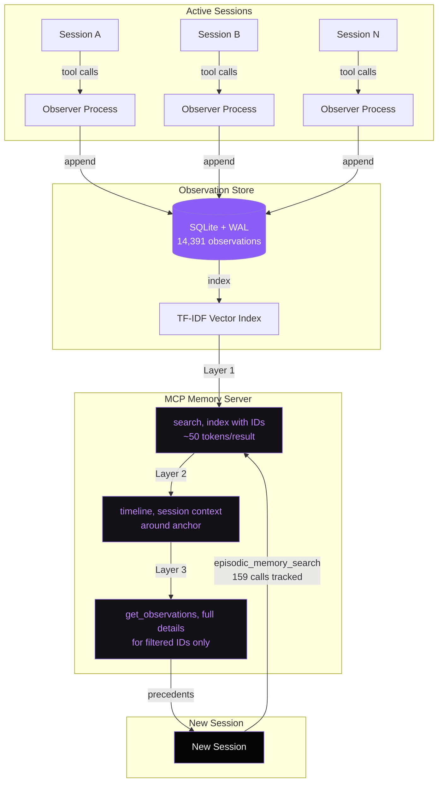
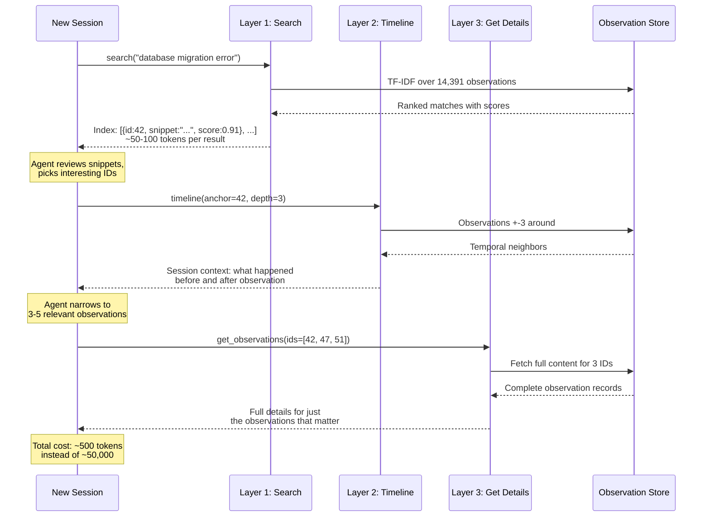

Session 4,200.

I watched a Claude Code agent rewrite a database migration that session 3,800 had already solved. Same table. Same foreign key constraint. Same solution it was about to spend twenty minutes rediscovering. I could not do anything except sit there, because the agent had no idea session 3,800 ever happened.

## Every session is session 1

Across 23,479 sessions the agent is not learning. It is performing. And it performs the same mistakes with the same confidence, over and over.

The wasted tokens are not what bothered me most. It is the wasted attention. I would watch an agent spend twenty minutes rediscovering that `@StateObject` initializers cannot reference other state properties in SwiftUI, something session 3,800 had already figured out. Same confidence, same wrong approaches, same eventual solution. No hedging. No "I think I've seen this before." Just a performance of discovery.

Session 12,100: an agent tries the same three failed approaches to a SwiftUI layout bug that session 11,900 already eliminated. Session 19,400: an agent confidently refactors an auth flow, unaware that three prior sessions proved that exact refactor breaks token refresh.

The human workaround is `CLAUDE.md`, project-level instructions that persist across sessions. But `CLAUDE.md` is manual. I have to notice a repeated mistake, write down the lesson, maintain the file as the project evolves. Over 23,479 sessions across 27 projects, the lessons worth capturing dwarf what any human can curate. At some point I realized I was spending more time maintaining `CLAUDE.md` files than writing actual code. The system needed to build its own memory.

## The architecture

The core idea is simple. Every session produces observations, decisions made, errors hit, solutions found, patterns discovered. Three components handle the rest: an observer that watches sessions and records structured observations, a SQLite store that persists them, and an MCP server that exposes search to new sessions.



## The SQLite observation store

What actually matters across sessions? Not chat transcripts. Way too noisy. Not summaries either, because they lose the detail you need when you need it. Structured observations: a type, a title, the content, the context it happened in, and the evidence backing it up.

```sql
CREATE TABLE IF NOT EXISTS observations (
    id INTEGER PRIMARY KEY AUTOINCREMENT,
    session_id TEXT NOT NULL,
    obs_type TEXT NOT NULL,        -- discovery, error, decision, pattern
    title TEXT NOT NULL,
    content TEXT NOT NULL,
    context TEXT DEFAULT '',       -- what was happening when observed
    evidence TEXT DEFAULT '',      -- proof: file paths, error output
    tags TEXT DEFAULT '[]',        -- JSON array for filtering
    created_at TEXT NOT NULL,
    tokens TEXT DEFAULT ''         -- pre-tokenized for search
);

CREATE TABLE IF NOT EXISTS references (
    observer_id INTEGER NOT NULL,
    referenced_id INTEGER NOT NULL,
    created_at TEXT NOT NULL,
    PRIMARY KEY (observer_id, referenced_id),
    FOREIGN KEY (observer_id) REFERENCES observations(id),
    FOREIGN KEY (referenced_id) REFERENCES observations(id)
);
```

Four observation types cover the territory. `discovery` for new learnings, `error` for failures worth remembering, `decision` for architectural choices and their rationale, `pattern` for recurring behaviors worth codifying. I started with six types. I had added `bugfix` and `refactor`. But the distinction between a bugfix and an error-with-resolution was not useful enough to justify the overhead. Four types. Clean boundaries.

Why SQLite over Postgres? The memory system runs locally alongside Claude Code. No network latency, no deployment, no connection pooling. SQLite with WAL handles concurrent reads from the MCP server while the observer writes new observations. The database file lives in the project directory. Switch projects, memory switches with you. The entire `ObservationStore` class is 331 lines. That includes schema creation, WAL pragma, record insertion, search, tag filtering, pattern analysis, and JSON export. Not 331 lines of scaffolding. 331 lines of working system.

```python
class ObservationStore:
    """Append-only SQLite store for cross-session observations."""

    def __init__(self, db_path: Path):
        self.db_path = db_path
        self.db_path.parent.mkdir(parents=True, exist_ok=True)
        self._conn = sqlite3.connect(str(db_path))
        self._conn.execute("PRAGMA journal_mode=WAL")
        self._conn.executescript(_SCHEMA)
        self._conn.commit()

    def record(self, observation: Observation) -> int:
        """Append an observation. Returns the new observation ID."""
        tokens = json.dumps(_tokenize(
            f"{observation.title} {observation.content} {observation.context}"
        ))
        tags_json = json.dumps(list(observation.tags))
        created = observation.created_at or datetime.now(timezone.utc).isoformat()
        cursor = self._conn.execute(
            """INSERT INTO observations
               (session_id, obs_type, title, content, context,
                evidence, tags, created_at, tokens)
               VALUES (?, ?, ?, ?, ?, ?, ?, ?, ?)""",
            (observation.session_id, observation.obs_type.value,
             observation.title, observation.content, observation.context,
             observation.evidence, tags_json, created, tokens),
        )
        self._conn.commit()
        return cursor.lastrowid or 0
```

The `record` method pre-tokenizes content at write time. Tokenization happens once on insert instead of on every search query. At 14,391 observations, that matters. Search latency stays under 50ms because the hot path only computes TF-IDF over cached token lists, not raw text.

## The observer: watching sessions in real-time

Nobody has to manually log anything. A separate observer process (a dedicated Claude instance running concurrently) watches tool executions in real-time. The observer's working directory is `~/.claude-mem/observer-sessions`, and the corpus grew to 14,119 session files, 421,577 lines, and 2.8GB. That made `claude-mem-observer` the single largest project by file count across all 27 projects I tracked.

The observer captures structured observations as XML blocks:

```xml
<observation>
  <what_happened>Authentication now supports OAuth2 with PKCE flow</what_happened>
  <occurred_at>2026-03-04T14:22:00Z</occurred_at>
  <working_directory>/Users/nick/projects/ils-ios</working_directory>
  <parameters>SwiftUI, AuthenticationService, OAuth2</parameters>
  <outcome>success</outcome>
</observation>
```

The observer's system prompt enforces a discipline that sounds pedantic until you see it break. "Record what was LEARNED/BUILT/FIXED/DEPLOYED/CONFIGURED, not what you (the observer) are doing." Good observation: "Authentication now supports OAuth2 with PKCE flow." Bad observation: "Analyzed authentication implementation and stored findings." Why does this matter? Try searching the store for "OAuth2 PKCE." You want the session that implemented it, not a meta-observation about the observer analyzing it. Self-referential observations pollute the index with noise that crowds out signal.

The queue-based architecture (`enqueue`, `dequeue`, `remove` operations) processes observations as they arrive instead of batching. Why not batch? Because batching introduces a window where recent observations are invisible to search. With queue processing, an observation written at minute 3 of a session is searchable at minute 4. If the agent tries the same failing approach later in the same session, the search surfaces the earlier failure. Within-session memory prevents within-session repetition.

## Semantic search: finding what you have forgotten

Search a codebase for "race condition" and you miss the three sessions that called it "concurrent access," "thread safety," and "data corruption." Same problem, four different names. Keyword search is broken for exactly this reason.

The `claude-mem-architecture` repo takes a zero-dependency approach: TF-IDF semantic search built in pure Python. No external embedding APIs, no vector database, no `numpy` or `sklearn`. Three functions do the work:

```python
def _tokenize(text: str) -> list[str]:
    words = re.findall(r"[a-z0-9]+", text.lower())
    return [w for w in words if w not in _STOP_WORDS and len(w) > 1]

def _term_frequency(tokens: list[str]) -> dict[str, float]:
    counts = Counter(tokens)
    total = len(tokens) if tokens else 1
    return {t: c / total for t, c in counts.items()}

def _cosine_similarity(vec_a: dict[str, float], vec_b: dict[str, float]) -> float:
    common = set(vec_a) & set(vec_b)
    if not common:
        return 0.0
    dot = sum(vec_a[k] * vec_b[k] for k in common)
    mag_a = math.sqrt(sum(v * v for v in vec_a.values()))
    mag_b = math.sqrt(sum(v * v for v in vec_b.values()))
    if mag_a == 0 or mag_b == 0:
        return 0.0
    return dot / (mag_a * mag_b)
```

Is TF-IDF as good as transformer embeddings? No. Does it run locally with sub-50ms latency and zero API calls? Yes. And here is what I have found in practice. TF-IDF with stop-word filtering catches most semantic variations because technical observations share specific vocabulary. Class names, error messages, library names. Exact term overlap gives you strong signal in this domain. I do not need it to be perfect. I need it to surface the right observation about 80% of the time. The developer validates the rest.

Two search modes:

```python
# Mode 1: Single string, semantic search
results = store.search(query="SwiftUI state management crashes")
# Returns observations about @StateObject, @ObservedObject,
# environment injection, and view lifecycle, all semantically related

# Mode 2: Array of concepts, precise AND matching (via MCP)
results = memory.search(query=["SwiftUI", "@Environment", "theme propagation"])
# Returns only observations matching ALL three concepts
```

Single-string mode casts a wide net. "Have I seen anything like this before?" Array mode is a scalpel. "I know the exact problem domain, show me prior solutions at this intersection." Both return ranked results with observation IDs, titles, timestamps, and read-cost estimates so the agent can decide which results are worth fetching in full.

## The three-layer retrieval workflow

The MCP memory server sits between the observation store and Claude Code. It exposes search as a tool in the agent's tool list. Agent hits a problem, sees the `episodic_memory_search` tool, uses it. Across my sessions, I tracked 159 calls to `episodic_memory_search`. Each one a moment where the agent chose to consult its past instead of starting from scratch.

Why three layers instead of just dumping everything? Token efficiency.



Searching 14,391 observations and returning full content for all matches would eat the entire context window. So the index layer returns 50-100 token summaries. The timeline layer adds session context around interesting hits, showing what happened before and after the observation. That reveals the causal chain that led to the discovery. The detail layer fetches full content only for the 3-5 observations that actually matter.

Total retrieval cost: a few hundred tokens instead of tens of thousands. The agent spends its budget reading the answer, not the index.

```python
# Layer 1: Search, get index with IDs (~50-100 tokens per result)
results = mcp.search(query="database migration error")
# Returns: [{id: 42, snippet: "Migration failed on...", score: 0.91}, ...]

# Layer 2: Timeline, get context around interesting results
context = mcp.timeline(anchor=42, depth_before=3, depth_after=3)
# Returns: observations before and after #42 in the same session

# Layer 3: Get observations, fetch full details for filtered IDs
details = mcp.get_observations(ids=[42, 47, 51])
# Returns: complete observation content for just these 3
```

The timeline layer deserves its own callout. An observation in isolation says "migration X failed because of foreign key constraint Y." The timeline says "the agent tried approaches A and B first, both failed for different reasons, then discovered the foreign key constraint, and the fix was Z." That causal chain is way more valuable than the observation alone. It tells the new session not just what happened, but what not to try.

## Session compaction: memory at startup

The three-layer workflow handles on-demand queries, where the agent hits a problem and searches for precedents. But the most impactful memory kicks in before the agent encounters any problem at all: session-start injection.

When a new session begins, the system compacts relevant observations into a context block that gets injected into the session's initial prompt. The agent starts with institutional knowledge instead of discovering it mid-task.

How compaction works:

1. **Project affinity.** Observations tagged with the current project get priority.
2. **Recency weighting.** Recent observations rank higher than old ones.
3. **Error emphasis.** Errors and their resolutions get prioritized over discoveries, because preventing a repeated mistake is more valuable than re-learning a fact.
4. **Token budget.** The compacted context stays under a configurable limit (default: 2,000 tokens) so it does not eat the session's context window before the agent even starts working.

The result. Session 19,401 starts knowing what sessions 19,300 through 19,400 learned. Not everything, since the token budget forces selection. But the highest-impact lessons, the most recent decisions, and the errors most likely to recur. The agent begins each session standing on its predecessors' shoulders instead of crawling out of the same hole.

## What the numbers reveal

The production system after 42 days:

| Metric | Value |
|--------|-------|
| Total observations stored | 14,391 |
| Observer session files | 14,119 |
| Observer corpus size | 2.8GB (421,577 lines) |
| Recurring mistake categories | 23 |
| Resolution speedup (known issues) | 3.2x |
| Search latency at scale | &lt;50ms |
| Semantic similarity threshold | 0.7 |
| Precedent coverage | 73% |
| `episodic_memory_search` calls tracked | 159 |

The 3.2x speedup is the headline. When the agent finds a prior solution instead of rediscovering it, the fix takes a third of the time. But the number I care about more is 23 recurring mistake categories. The pattern analyzer clusters observations by semantic similarity and surfaces error categories that keep happening. "SwiftUI state initialization order" is a category. "SQLite WAL mode not enabled" is a category. "Missing URL encoding in API parameters" is a category. Each one represents a class of mistake that no amount of one-off `CLAUDE.md` entries would catch, because you would need to anticipate the category, not just the instance.

Precedent coverage at 73% means roughly three-quarters of the problems an agent encounters have a relevant prior observation. That number will not reach 100%. Novel problems are novel by definition. But 73% means most of an agent's work is not novel. It is recurrence. And recurrence without memory is waste.

The observer corpus at 2.8GB and 14,119 files. That is a scale where no human is reading 421,577 lines of session logs to extract the 14,391 observations that matter. The observer does it continuously, in real-time, while sessions run. The human reviews patterns, not raw data.

## Tool call telemetry: the honest signal

Beyond semantic observations, the memory system captures how work happened through tool call sequences. This turned out to be more revealing than I expected.

| Tool | Calls (all 23,479 sessions) |
|------|-----|
| Read | 87,152 |
| Bash | 82,552 |
| Edit | 19,979 |
| Grep | 21,821 |

The Read-to-Edit ratio across all sessions is 4.4:1. Agents read roughly four and a half times more than they write. But here is the part that turned into a pattern detector: sessions where that ratio drops below 2:1 (the agent is writing almost as much as it reads) correlate strongly with rework in the next session. The agent that reads less before editing is the agent whose edits get reverted.

The tools do not lie about what actually happened. An agent can say "I understand the architecture" in its reasoning trace, but if it is reading the same 3 files in a loop without making progress, the tool sequence reveals the struggle that the confident prose hides. A session with 47 Read calls before a single Edit? Exploration session. A session with 12 Edit calls and zero Reads? Flying blind.

These telemetry patterns feed back into the observation store. When the system detects a "spinning" pattern (repeated reads of the same files with no edits) it records that as a pattern observation. Future sessions showing the same spin get flagged earlier.

## Memory changes everything

Before: every session reinvents. The agent approaches each problem fresh, tries approaches that prior sessions already eliminated, produces solutions that conflict with yesterday's decisions. The human carries all institutional knowledge in their head and feeds it back manually through `CLAUDE.md` and conversation context. The human becomes the bottleneck, not because they are slow, but because they are the only component with memory.

After: the agent asks "have I seen this before?" and acts on the answer. Patterns that took 5 sessions to discover surface in 1. Error patterns that would silently recur across dozens of sessions get flagged on first encounter. The 23,479 sessions stop being isolated events and become a searchable corpus of engineering experience.

I want to be honest about the limitation. Memory is not understanding. The agent retrieves prior observations. It does not truly learn from them. It cannot generalize from "this migration failed because of a foreign key constraint" to "all migrations in this project should check foreign keys first." That generalization still requires a human to write the rule and put it in `CLAUDE.md`. The memory system provides the evidence for generalization. The human provides the insight.

But here is what shifted. Instead of needing to remember that a pattern exists, I only need to recognize the pattern when the memory system surfaces it. "Here are 7 observations about foreign key failures in this project." That is a prompt for generalization that no human would generate by reading 421,577 lines of session logs. The memory system converts an impossible curation task into a manageable review task.

## Build it yourself

The [claude-mem-architecture](https://github.com/krzemienski/claude-mem-architecture) companion repo has the working implementation: 331-line SQLite observation store with WAL mode, TF-IDF semantic search with zero external dependencies, and the three-layer retrieval workflow.

```bash
pip install -e .
claude-mem init --db memory.db
claude-mem search "WebSocket reconnection timeout"
```

Clone it, point it at a project directory, run a few sessions, then search "what errors have I seen?" Watch memory surface patterns you had forgotten you solved. The observation store is append-only. Observations are immutable facts. No UPDATE, no DELETE. What happened, happened. The store just makes it findable.

The real power is not any single observation. It is the corpus. At 14,391 observations across 23,479 sessions, the memory system contains more engineering context than any `CLAUDE.md` file could hold. It knows which approaches failed, which decisions were made and why, which patterns recur, and which errors are waiting to happen again. Every new session starts a little less amnesia-stricken than the last.

The agent still does not truly learn. But it remembers. And remembering turns out to be most of what learning looks like in practice.
