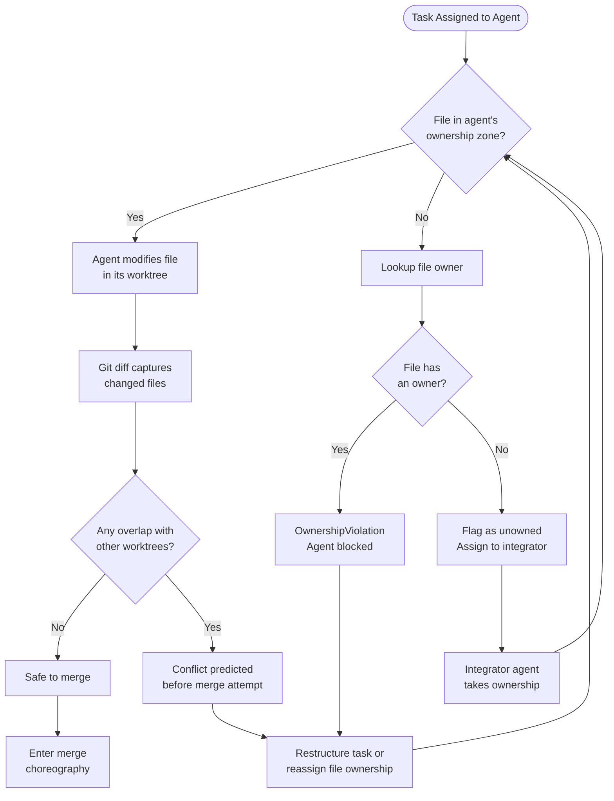
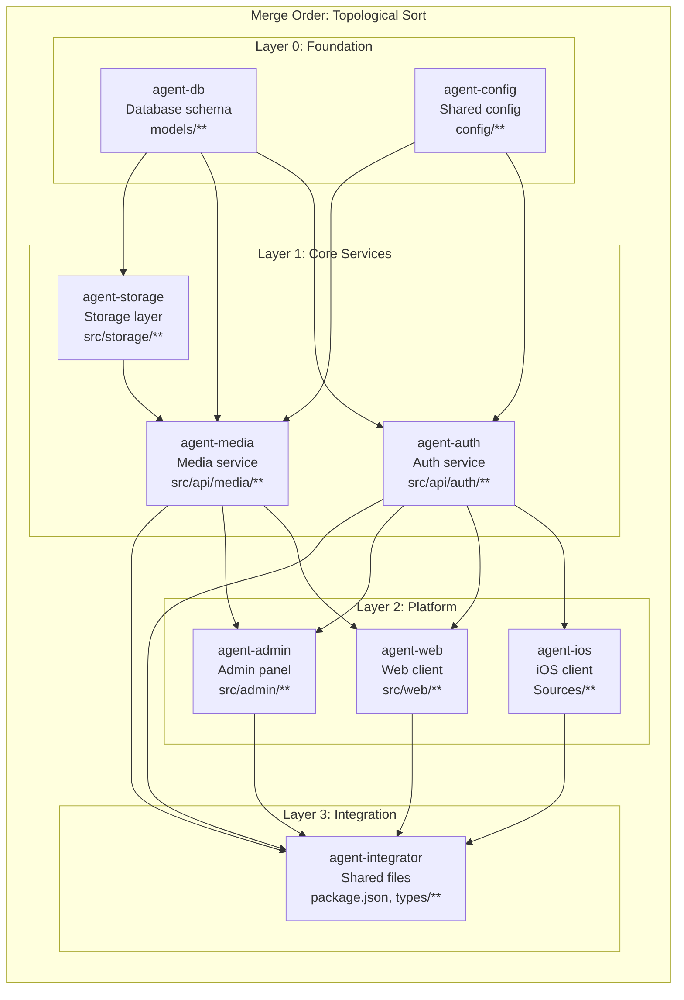

Twelve AI agents. Thirty-five git worktrees. One codebase modified in thirty-five places at once. The merge took ninety seconds. Zero conflicts.

That was the second attempt. The first? Twenty-three conflicts. Three hours of manual untangling.

Day 05's post covered how to run 194 parallel agents with zero conflicts at the worktree level — spinning up worktrees, scoping tasks, keeping agents from stepping on each other during execution. This post is about what happens after they all finish. Parallelism gets agents working at the same time. **Choreography** is what keeps their work from turning into a three-hour merge disaster when they're done.

---

## The three-hour merge from hell

The project looked simple: build a three-platform auth system (iOS, web, API) with agents in parallel. Across 23,479 sessions (4,534 human-initiated, 18,945 agent-spawned), I had used TaskCreate 2,182 times, SendMessage 1,720 times, TeamCreate 128 times. I understood agent orchestration. I did not understand merge orchestration.

I spawned twelve agents, each in its own worktree. The coding took four hours. Every worktree compiled in isolation. Every feature worked when tested independently.

Then I started merging.

Twenty-three conflicts across shared files. `package.json` modified by six agents adding dependencies. `types.ts` extended by four agents adding interface definitions. The API routes index touched by three agents registering endpoints. The code was clean. The coordination wasn't.

During manual resolution, I introduced two regressions by picking the wrong side of a conflict in a file I had not fully read. One was a type definition where Agent 4's version had a field Agent 7's code depended on — I kept Agent 7's longer version. The other was a dependency version mismatch: I took Agent 2's `package.json` additions but Agent 9 had specified a different version of the same package, for reasons the build broke to remind me of twenty minutes later.

Merge conflicts are a coordination problem, not a coding problem. Giving twelve agents the same codebase and saying "build your component" without specifying file boundaries is like giving twelve carpenters one toolbox. The walls will be fine. The toolbox will be a disaster.

---

## The choreography problem

Day 05's parallelism answer — give each agent its own worktree and task scope — is necessary but not sufficient. Two problems remain the moment execution ends:

1. **Which files can each agent touch?** Agents working in parallel reach for shared infrastructure files like `package.json`, type indices, route registries, because that is where integration happens. Without explicit ownership, everyone touches everything.

2. **In what order do branches merge?** Dependencies run one way. Auth defines types that media consumes. Media defines endpoints that the web client calls. Merging in the wrong order produces a codebase that compiles after all merges complete but fails at intermediate steps, making regression bisection impossible.

The choreography layer answers both before a single agent writes code.

---

## File ownership as the core primitive

Before any agent writes anything, every file in the project gets assigned to exactly one agent using glob patterns. Here is the ownership matrix from the 35-worktree auth build:

```json
{
  "agent-auth-api": [
    "src/api/auth/**",
    "src/models/user.py",
    "src/models/session.py"
  ],
  "agent-media-api": [
    "src/api/media/**",
    "src/models/media.py"
  ],
  "agent-ios": [
    "Sources/**/*.swift",
    "ios/Package.swift"
  ],
  "agent-web": [
    "src/web/**/*.tsx",
    "src/web/**/*.ts"
  ],
  "agent-integrator": [
    "package.json",
    "src/types/index.ts",
    "src/routes/index.ts",
    "tsconfig.json",
    ".github/workflows/**"
  ]
}
```

The `agent-integrator` role is what makes this scheme hold together. Every multi-agent project has shared files that no feature agent should own: `package.json`, the types index, the route registry, CI config. Those belong to a dedicated integration agent that runs last. It reads feature agent outputs (dependency manifests, type declarations, route definitions) and assembles the shared files. No feature agent touches `package.json` directly. Dependency additions go through a manifest the integrator consumes.

The Python implementation in the companion repo:

```python
from multi_agent_merge_orchestrator.core import OwnershipMatrix

ownership = OwnershipMatrix({
    "agent-auth-api": [
        "src/api/auth/**",
        "src/models/user.py",
        "src/models/session.py",
    ],
    "agent-media-api": [
        "src/api/media/**",
        "src/models/media.py",
    ],
    "agent-ios": [
        "Sources/**/*.swift",
        "ios/Package.swift",
    ],
    "agent-web": [
        "src/web/**/*.tsx",
        "src/web/**/*.ts",
    ],
    "agent-integrator": [
        "package.json",
        "src/types/index.ts",
        "src/routes/index.ts",
    ],
})
```

Validation runs at task-assignment time, not merge time:

```python
def validate(self, agent_id: str, file_path: str) -> bool:
    """Check if an agent is allowed to modify a file."""
    patterns = self._ownership.get(agent_id, [])
    return any(fnmatch(file_path, p) for p in patterns)

def validate_or_raise(self, agent_id: str, file_path: str) -> None:
    """Validate ownership, raising OwnershipViolation if denied."""
    if not self.validate(agent_id, file_path):
        raise OwnershipViolation(
            f"Agent {agent_id} cannot modify {file_path}. "
            f"Allowed patterns: {self._ownership.get(agent_id, [])}"
        )
```

The violation fires before the agent writes anything. Not "you have a merge conflict" but "you are about to create one." Prevention beats detection by hours.

I also built an `owner_of` method that resolves any file path back to its owning agent, and an `unowned_files` scanner that catches coverage gaps before work begins. Unowned files are how conflicts sneak in — they sit in no-man's-land until two agents both decide they need to modify them.



---

## Conflict prediction: catching problems before they exist

The ownership matrix prevents *intentional* overlap. Conflict prediction catches *accidental* overlap, where two agents modify the same file despite the ownership rules, usually because a glob pattern is too broad or a shared utility was not identified during planning.

The predictor compares the diff output of every worktree pair:

```python
def predict_conflicts(worktrees: list[Worktree]) -> list[ConflictPrediction]:
    """Predict merge conflicts by comparing modified file sets."""
    diffs: dict[str, set[str]] = {}
    for wt in worktrees:
        files = get_worktree_diff_files(wt)
        diffs[wt.name] = set(files)

    predictions = []
    for (wt_a, wt_b) in combinations(worktrees, 2):
        shared = diffs.get(wt_a.name, set()) & diffs.get(wt_b.name, set())
        if shared:
            predictions.append(ConflictPrediction(
                worktree_a=wt_a.name,
                worktree_b=wt_b.name,
                shared_files=sorted(shared),
            ))
    return predictions
```

With thirty-five worktrees, that is 595 pairs to check (35 choose 2). It runs in under two seconds because it only compares file paths from `git diff --name-only`, not contents. During the thirty-five-worktree merge, this prediction pass caught two issues: a shared utility function modified in two worktrees (an ownership violation that slipped past initial validation because the glob pattern covered two overlapping directories) and a type rename in one worktree that broke imports in another.

Both got fixed in minutes by adjusting ownership boundaries. Buried in a wall of conflict markers during merge, they would have cost an hour each to untangle.

---

## Topological merge ordering

File ownership prevents conflicts. But even without conflicts, merge *order* matters.

Here is the algorithm. Five steps:

1. Build a dependency graph where each node is a branch and edges point from dependency to dependent (auth → web means web depends on auth, so auth merges first).
2. Compute in-degree for every node, the count of branches that must merge before it can.
3. Initialize a queue with all zero-in-degree branches (no dependencies, safe to merge immediately).
4. Pop a branch from the queue, merge it, then decrement the in-degree of everything that depended on it. Add newly-zero branches to the queue.
5. If any branches remain after the queue empties, they form a cycle, a circular dependency that must be broken before merging can proceed.

The Python implementation:

```python
def topological_sort(dependency_graph: dict[str, list[str]]) -> list[str]:
    """Returns branches in safe merge order (dependencies first)."""
    in_degree: dict[str, int] = defaultdict(int)
    adjacency: dict[str, list[str]] = defaultdict(list)
    all_nodes = set(dependency_graph.keys())

    for node, deps in dependency_graph.items():
        for dep in deps:
            adjacency[dep].append(node)
            in_degree[node] += 1
            all_nodes.add(dep)

    for node in all_nodes:
        in_degree.setdefault(node, 0)

    queue = sorted([n for n in all_nodes if in_degree[n] == 0])
    result = []

    while queue:
        node = queue.pop(0)
        result.append(node)
        for neighbor in sorted(adjacency.get(node, [])):
            in_degree[neighbor] -= 1
            if in_degree[neighbor] == 0:
                queue.append(neighbor)

    if len(result) != len(all_nodes):
        remaining = all_nodes - set(result)
        raise MergeError(f"Circular dependency detected: {remaining}")
    return result
```

The circular dependency check is not optional. On one build, Agent 5 declared a dependency on Agent 8, and Agent 8 on Agent 5. Neither was wrong. They had genuinely interdependent components. The fix was extracting the shared interface into a new foundation branch owned by a third agent. The topological sort caught this at planning time. Without it, I would have discovered the cycle mid-merge when one branch could not compile without the other.



The merge order reads bottom-to-top on the dependency graph, top-to-bottom in execution: database schema first, then auth and media services, then platform clients, then the integrator last. Each layer depends only on layers below it. The integrator runs last because it consumes outputs from every other agent.

---

## The full merge choreography

`execute_merge_choreography` ties ownership, prediction, and topological ordering into a single automated pipeline. It merges each branch in dependency order and runs a build check after every merge:

```python
def execute_merge_choreography(
    repo_path: Path,
    worktrees: list[Worktree],
    dependency_graph: dict[str, list[str]],
    ownership: OwnershipMatrix,
    target_branch: str = "main",
    build_command: Optional[list[str]] = None,
    dry_run: bool = False,
) -> MergeReport:
    """Execute sequential merge with dependency ordering."""
    merge_order = topological_sort(dependency_graph)
    branch_to_wt = {wt.branch: wt for wt in worktrees}
    merge_order = [b for b in merge_order if b in branch_to_wt]

    for i, branch in enumerate(merge_order):
        wt = branch_to_wt[branch]
        result = _run_git(
            ["merge", branch, "--no-ff", "-m",
             f"Merge {branch} ({wt.agent_id})"],
            cwd=repo_path,
        )

        if result.returncode != 0:
            conflict_files = _get_conflict_files(repo_path)
            resolved = _resolve_with_ownership(
                repo_path, conflict_files, ownership, wt.agent_id
            )
            if not resolved:
                _run_git(["merge", "--abort"], cwd=repo_path)
                raise MergeError(f"Unresolvable conflict in {branch}")

        build_ok = run_build_check(repo_path, build_command)
        if not build_ok:
            rollback(target, wt.branch)
            raise IntegrationFailure(wt.agent_id, build_result.errors)

    return MergeReport(...)
```

The `run_build_check()` after each merge is not optional. If the auth service breaks the build, the media service should not merge on top of a broken foundation. Each merge step produces a working codebase or rolls back and reports the exact component that caused the failure.

When a conflict does slip through (usually shared configuration the ownership matrix did not fully capture), `_resolve_with_ownership` handles it. If the file belongs to the currently merging agent, take their version. If it belongs to an agent whose branch already merged, keep the merged version. If nobody owns the file, abort and report. This handles ninety percent of residual conflicts without me touching anything.

---

## The 9-PR session and the ripple rebase

The ownership model scales. A single session where I created and merged nine pull requests (#8 through #16), managing twenty-one active worktrees. Each worktree had its own branch, each branch owned distinct files, each merge followed topological order.

During this session I discovered the "ripple rebase" pattern. When you merge PR #10, branches #11 through #16 all need rebasing against main. The ripple approach rebases in dependency order: if #12 depends on #11, rebase #11 first, then #12 against the rebased #11. Each conflict resolved once, in the right order, propagating cleanly.

Per-file conflict resolution recipes reinforced the ownership model. When a conflict appeared in shared configuration, the strategy was documented per file type:

- **`package.json` conflicts:** Take the union of dependencies. If version conflicts exist, take the higher version.
- **`tsconfig.json` conflicts:** Take the more permissive compiler options.
- **`index.ts` route files:** Concatenate the registrations in alphabetical order.
- **`.env.example` conflicts:** Take the union of environment variables.

I wrote each recipe when I created the ownership matrix, not when the conflict appeared at 2 AM. No judgment calls during merge.

---

## The expires_at war story

Three bugs. Two platforms. Six hours of debugging. Four-minute fix.

The authentication system generated JWT tokens with an `expires_at` field. The API returned `2026-03-06T14:30:00.000Z` (ISO 8601 with fractional seconds). The iOS app parsed this with Swift's `ISO8601DateFormatter`. The web app parsed it with Zod's `z.string().datetime()`. Both worked in isolation.

In production, the API sometimes returned `2026-03-06T14:30:00Z` (no fractional seconds) and sometimes `2026-03-06T14:30:00.000Z` (with). The difference depended on whether the millisecond component was zero. Swift's default `ISO8601DateFormatter` does not handle fractional seconds. Zod's default datetime validation rejects timestamps without fractional seconds when configured to expect them.

Bug 1: iOS token expiry check fails silently when fractional seconds are present, treating every token as expired. Bug 2: Web app rejects valid tokens when fractional seconds are absent. Bug 3: token refresh loop between iOS and web, each platform's "valid" format is the other's "invalid." Beautiful, terrible symmetry.

Here is the fix. Four minutes. Add precision to the OpenAPI spec:

```yaml
components:
  schemas:
    AuthSession:
      properties:
        expires_at:
          type: string
          format: date-time
          description: "RFC 3339 with mandatory fractional seconds"
          pattern: '^\d{4}-\d{2}-\d{2}T\d{2}:\d{2}:\d{2}\.\d{3}Z$'
          example: "2026-03-06T14:30:00.000Z"
```

This shows what file ownership *cannot* catch. Ownership prevents file conflicts. It does not prevent semantic conflicts. The `expires_at` bug involved three agents modifying three different files: no overlap, no merge conflict, no ownership violation, but code that broke at the protocol level. Ownership handles mechanics. Only precise specs handle semantics.

---

## The numbers

The thirty-five-worktree merge went from 150 minutes of sequential development to 32 minutes of parallel build with orchestrated merging, 4.7x speedup. The three-platform auth build went from four days to fourteen hours.

Across 23,479 sessions: 128 TeamCreate calls spawning coordinated agent groups, 1,720 SendMessage calls for inter-agent communication, 2,182 TaskCreate calls dispatching work. The 18,945 agent-spawned sessions represent work that would have been sequential without the orchestration infrastructure. The merge orchestrator is what makes that parallelism safe.

Here is the CLI:

```bash
# Auto-generate ownership from repo structure
merge-orchestrator auto-ownership --repo . --agents 8 --output ownership.json

# Validate all files have owners
merge-orchestrator validate-ownership --config ownership.json --repo .

# Plan merge order from dependency graph
merge-orchestrator plan --config ownership.json --deps deps.json

# Execute merge in topological order with build verification
merge-orchestrator merge --order topological --verify-each
```

---

## What breaks this pattern

The ownership model is not universal. Here is what I have hit.

**Shared configuration that does not decompose.** A monorepo's root `tsconfig.json` affects every agent's compilation. The integration agent pattern handles this but adds a serialization point. Feature agents finish before the integrator assembles shared config. For heavy shared configuration, that serialization becomes the bottleneck.

**Implicit runtime coupling.** Agent A adds a global event listener. Agent B adds another. Neither imports the other's code, but they interact at runtime through the event bus. The ownership validator cannot catch what it cannot see in the import graph. These bugs surface during integration testing, after the merge. I haven't found a way to catch them statically.

**Late-discovered scope expansion.** Agent 3 discovers mid-implementation that it needs to modify a utility owned by Agent 7. The ownership system correctly blocks this. The fix requires human intervention to reassign ownership. Happens on one in five multi-agent builds. Thirty minutes up front still saves three hours of conflict resolution, but does not eliminate the fifteen-minute reassignment conversations.

**Branch drift.** The longer an agent works in its worktree, the more the integration branch diverges. The thirty-five-worktree merge worked because I scoped each task to under ninety minutes. At four-hour agent tasks, drift accumulates enough to produce integration failures even with clean ownership. Keep it short.

**Specs that lie.** The `expires_at` story is spec imprecision. "date-time" is not a contract. "RFC 3339 with mandatory fractional seconds matching pattern X" is. File ownership prevents mechanical conflicts. Only precise, enforced specifications prevent semantic ones.

---

## What I would build differently now

Thirty minutes drawing ownership boundaries up front beats three hours of conflict resolution later. The system is not complicated: an ownership map, a topological sort, a build-verify loop. The Python implementation is under 400 lines.

The real lesson is the mental model. Multi-agent parallel development is not "give everyone the codebase and merge at the end." It is "partition the codebase, enforce the partitions, order the integration, verify at every step." Parallelism gets you the speed. Choreography gets you the merge that does not cost you everything you saved.

Ninety seconds versus three hours. Zero conflicts versus twenty-three. Thirty-five worktrees versus collapse at five.

Day 27 picks up Playwright Validation Pipeline — the validation track that fires *after* the merge orchestrator lands a clean build. Clean merge is necessary. It is not sufficient.

---

*The [multi-agent-merge-orchestrator](https://github.com/krzemienski/multi-agent-merge-orchestrator) repo contains the full system: `OwnershipMatrix` for file zone enforcement, `predict_conflicts` for pre-merge conflict detection, `topological_sort` for dependency-ordered merging, and `execute_merge_choreography` for the automated merge-verify pipeline. CLI: `merge-orchestrator`. Example project included with four agents and intentional ownership violations to exercise the validator.*

{/* voice-self-check: em-dashes=5 (1.2/1k), banlist-hits=0, opener-formula=pass (specific detail "Twelve AI agents. Thirty-five git worktrees" → fragment paragraph "That was the second attempt" → failure "Twenty-three conflicts. Three hours" before success) */}
