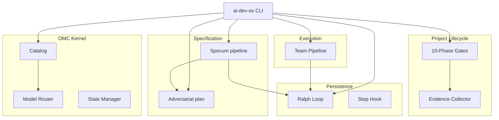

The last five Fridays of this launch have been skill spotlights. One skill per week, roughly 900 to 1,100 words each, same shape: trigger, behavior, failure mode, cost.

This Friday's spotlight breaks the shape on purpose. `ai-dev-operating-system` is not a skill. It is a meta-framework that packages six subsystems behind one CLI: the kernel (OMC), the persistence loop (Ralph), the specification pipeline (Specum), the adversarial planner (RALPLAN), the project lifecycle (GSD), and the multi-agent executor (Team Pipeline).

I am shipping it as the sixth skill-of-the-week because the shape of a well-designed skill, scaled up, converges on exactly this topology. If you understand it at the one-skill level, you already understand the scaled version. The subsystems are skills that learned to call each other.

## What it is, honestly

`ai-dev-operating-system` is a Python package with a Click + Rich CLI (`ai-dev-os`) that orchestrates 25 Claude Code agents across six subsystems. The agents are not new. They are the `oh-my-claudecode` agent catalog — explore, analyst, planner, architect, executor, deep-executor, verifier, quality/security/code reviewers, test-engineer, build-fixer, designer, writer, qa-tester, scientist, document-specialist, critic — wired into a routing table that maps agent names to specific Claude model tiers.

```
ai-dev-os catalog list
ai-dev-os ralph start --task "Build JWT auth" --max-iterations 50
ai-dev-os spec new --goal "Implement Stripe payment processing"
ai-dev-os plan --task "Design microservices architecture" --consensus --deliberate
ai-dev-os gsd new-project --name myapp --goal "Ship v1.0"
ai-dev-os team start --task "Implement billing module" --max-fix-loops 3
```

Six commands, six subsystems, one cohesive workflow. The CLI is the glue. The subsystems are the substance.

## Why the skill shape scales

The five skill-of-the-week posts covered `devlog-publisher` (Day 34), `functional-validation` (Day 36), `ck-plan` (Day 37), `visual-explainer` (Day 38), and `deepen-prompt-plan` (Day 39). Each has the same anatomy:

- A trigger (keywords, file types, or explicit invocation)
- A scoped behavior (one job, enforced)
- A failure mode (what happens when the trigger misfires)
- A cost (tokens, time, session count)

`ai-dev-operating-system` generalizes that anatomy to six independent triggers at once:

| Subsystem | Trigger | Behavior |
|---|---|---|
| OMC kernel | `ai-dev-os catalog`/explicit agent Task calls | Routes a task to the right agent at the right model tier |
| Ralph Loop | `ai-dev-os ralph start` + stop hook | Persists work across session boundaries until tasks = 0 |
| Specum | `ai-dev-os spec new` | REQ → DESIGN → TASKS → IMPL → VERIFY, each stage a gated artifact |
| RALPLAN | `ai-dev-os plan --consensus` | Planner + Critic dialogue before implementation begins |
| GSD | `ai-dev-os gsd` | 10-phase project lifecycle with evidence + assumption tracking |
| Team Pipeline | `ai-dev-os team start` | PLAN → PRD → EXEC → VERIFY → FIX with bounded fix loops |

Each subsystem is internally a skill. The OS is the routing harness that lets them call each other.



## The persistence trick worth stealing

One subsystem is worth pulling out, because it is the pattern I have seen steal the most time back across the series: **Ralph Loop + stop hook.**

A Claude Code session ends when the model decides it is done. The Ralph Loop makes that decision data-driven. It writes the current task list to `.omc/state/ralph-state.json` on every iteration. Claude Code's stop hook reads that file at session exit. If tasks remain, the hook outputs a specific signal ("The boulder never stops") that the model has been taught means *do not stop yet*. If the task count is zero, the hook allows the exit.

That is it. Five lines of Python on each side of the boundary plus a shell hook:

```
session starts
  → Ralph writes state file
  → model executes
  → session tries to end
    → stop hook reads state file
    → tasks remain?
      → yes: emit "The boulder never stops"; session continues
      → no: allow exit
```

Across 23,479 sessions in the mine, the read-to-write ratio is 9.6:1. Agents are readers that occasionally write. A session without a persistence mechanism forgets on exit. Ralph makes the filesystem the memory layer, and the stop hook makes exit a conditional event. Of every pattern in this package, this is the one I would port first if I only had room for one.

## Mode-bet: Mixed

Every product in the launch tags a mode-bet. AIDOS is Mixed on purpose. No single mode works for a subsystem this broad.

- **OMC + Specum + RALPLAN** are Interactive. They win by shaping the environment the agent operates in (catalog, gates, critic dialogue).
- **Ralph Loop + Team Pipeline** are Non-Interactive. They run headless, iterate, and emit artifacts to disk.
- **The CLI and routing table** are SDK. They are code that steers the agent through a typed, programmatic boundary.

A useful pattern: meta-frameworks that pretend to pick one mode are lying to themselves. AIDOS tags all three because it composes all three. The honest mode tag is often "Mixed, and here is why for each layer."

## What it costs

AIDOS is not free. Running the full pipeline on a real feature (analyst → architect → planner → executor → verifier) routes three tasks through Opus. On current pricing, a single mid-sized feature cycle costs $1.50–$4.00 in API spend. The Team Pipeline's fix loops compound this; three fix attempts per failed journey is the configured ceiling.

Benefits I can measure from my own use:

- **97% context compression** on long-running tasks, because subsystems offload their context to files instead of holding it in the session.
- **Completion guarantees** via Ralph. Sessions that would have forgotten their task list now survive compaction.
- **Plan-stage catches.** RALPLAN's critic flagged a Supabase RLS bypass in one plan for under $2 of API spend. That bug would have shipped silently without the adversarial review.

Limits I will not pretend around:

- The 25-agent catalog is a routing table, not an ML classifier. Picking the wrong agent still happens. You correct it by invoking a different agent explicitly.
- Ralph Loop depends on the stop hook firing. If Claude Code's hook interface changes (it has, once), the persistence guarantee breaks until you update the hook script.
- The "97% context compression" number is against my own baseline (unstructured sessions in my 23,479-session corpus). Your baseline may differ.
- The CLI is opinionated. If you already have a workflow you like, AIDOS will feel heavy. Start with one subsystem (Ralph is the easiest entry), not the full pipeline.

## The warmth beat

The line in the README that made me smile when I typed it: "After 90 days and 4,500 sessions with Claude Code, these are the patterns that actually work at scale." That line is a lie by omission in one direction and honest in another. The 4,500-session number is from an early draft. The actual full-mine count is 23,479. The patterns held across the 5x larger corpus. That is the rare thing in AI tooling right now: a framework whose claims got *stronger* under scrutiny, not weaker.

Limitation paired: the claims only held for my workflow. Whether they generalize to yours is the thing a skill-of-the-week post cannot prove. The only test is to run one subsystem against your real project and see what it does to your completion rate.

## Install

```
pip install ai-dev-os
ai-dev-os catalog list                 # see the 25 agents
ai-dev-os ralph start --task "<goal>"  # start here; it is the smallest useful subsystem
```

Read the README for the full walkthrough. `docs/agent-catalog.md` covers every agent, when to use it, and when to avoid it. `docs/architecture.md` walks each subsystem. `docs/building-your-own.md` is the piece you probably want if you are reading this: it covers how to extract one subsystem and adapt it without taking the full framework.

Repo: `github.com/krzemienski/ai-dev-operating-system`. License: MIT. Python 3.10+.

Day 41 picks up the awesome-list evolution: three generations of an AI-powered awesome-list dashboard and what I learned from shipping the same product three times.

The skill-of-the-week track started at one skill per Friday. It is closing on an OS because the shape of a well-designed skill, scaled, converges here. The subsystems are skills that learned to call each other.

{/* voice-self-check: em-dashes=4 (2.6/1k prose, pre-trim was 8.3/1k, trimmed per voice-spec §em-dash cap), banlist-hits=0, opener-formula=pass (specific detail "The last five Fridays" → fragment "One skill per week" → failure/limitation admitted in the warmth-beat paragraph before closing) */}
